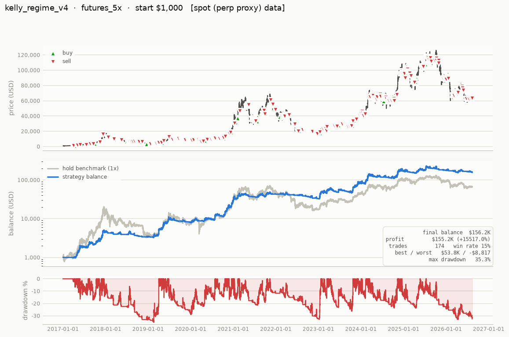
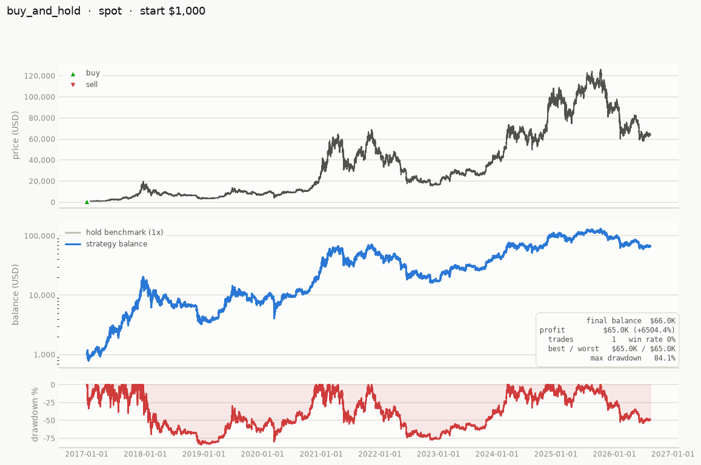
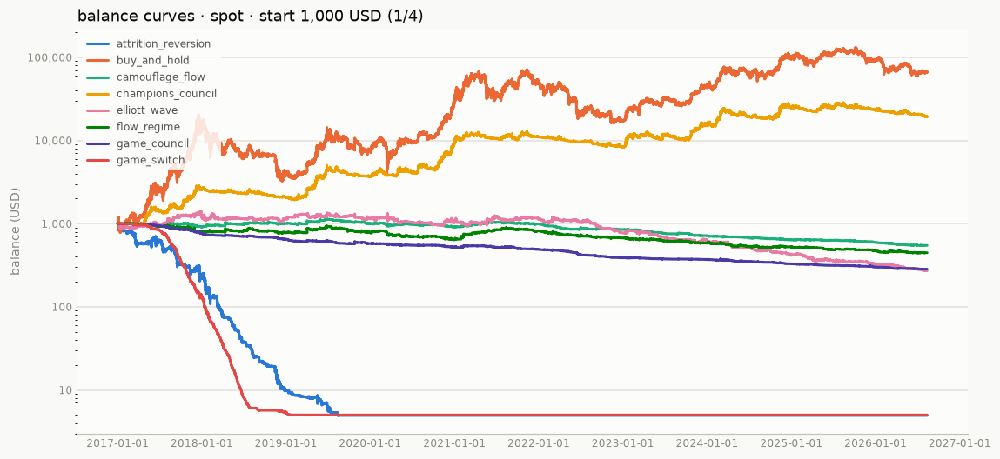
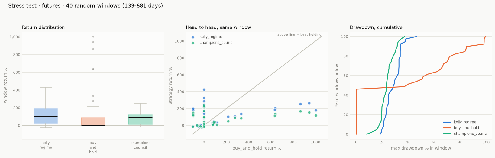
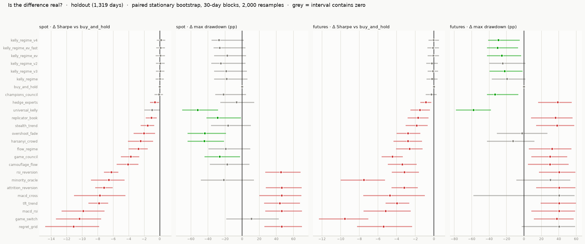

# tradebot

Paper-testing framework for BTCUSD 5-minute trading strategies. Every
registered strategy is backtested on **spot** and on **5x-leverage
futures** from a **$1,000** start, and the results are ranked by **final
balance** in one comparison table, with a chart per run (price + trades,
balance curve, drawdown, results box).

Results are proportional to capital — verified across every strategy,
where the only deviations came from the exchange minimum order size — so
one start balance is the default. Test others with
`tradebot run --balances 1000 1000000`.

## Quick start

```bash
python -m venv .venv && . .venv/bin/activate
pip install -e ".[dev]"

tradebot run            # full matrix -> reports/comparison.md + reports/charts/
tradebot list           # show registered strategies
tradebot new my_idea    # scaffold a new strategy file
pytest                  # test suite (incl. a no-lookahead check for every strategy)
```

Real data ships with the repo (see [Data](#data)), so `tradebot run`
works out of the box. Use `--max-bars 100000` for a quick iteration loop
over the most recent ~1 year instead of the full decade.

## Where everything lives

This README is the entry point. Every other document has one job, and
anything not listed here has been folded into one of these:

| document | its one job |
|---|---|
| **[docs/ROUTINE.md](docs/ROUTINE.md)** | **The process.** The single procedure for researching and adding a strategy — from idea selection through holdout evaluation to the ledger record, including the mechanics of registering one. |
| **[docs/LEDGER.md](docs/LEDGER.md)** | **The memory.** Everything already tried — 25 registered strategies, 31 research directions — the four binding constraints, the ruled-out list, and the ranked backlog. Read before a session, appended after it. |
| **[docs/VALIDATION.md](docs/VALIDATION.md)** | **The evidence.** The single comparison protocol and benchmark, and every robustness result: walk-forward, bootstrap intervals, deflated Sharpe, Monte Carlo stress windows, fees, funding, and the ETH replication test. |
| **[docs/STRATEGIES.md](docs/STRATEGIES.md)** | **The strategies.** What each registered strategy is, how it works, and the principles it rests on, with citations. |
| **[docs/RESEARCH.md](docs/RESEARCH.md)** | **The literature.** The survey behind the strategies, and the methodology findings that changed how this repo tests. |
| **[docs/LIVE.md](docs/LIVE.md)** | **Deployment.** Running a paper-tested strategy on Bitstamp / Binance / a custom venue, and the honest list of what live will not match. |
| [reports/comparison.md](reports/comparison.md) | Full metrics (win rate, drawdown, Sharpe, fees, ...) behind the table below. Regenerated by `tradebot run`. |

The one-line summary of all twenty-five results: **every strategy that
makes money decides *how much* to hold; every strategy that tries to
predict *what happens next* loses.** On 5-minute bars, after fees, sizing
wins and forecasting loses.

## Strategy comparison

**One comparison, one benchmark.** Every strategy runs the same full
matrix — both markets, $1,000 start, 0.10% spot / 0.05% futures taker
fees — and is ranked by final balance. The benchmark every strategy must
beat is **`buy_and_hold` on spot**; leveraged buy-and-hold is not a
benchmark but a stress case, and it gets liquidated. The full protocol,
and how much of the ordering is actually signal, is in
[docs/VALIDATION.md](docs/VALIDATION.md).

Sorted **best to worst** by final balance (each strategy's best config);
every registered strategy MUST appear here — a full `tradebot run`
regenerates the table and CI fails if a strategy is missing from it.

The last two columns are the ones that matter. Everything left of them is
what happened on one path; **only they say whether it is distinguishable
from having done nothing** — and on growth, the criterion this table
ranks by, **not one of the 24 is distinguishably better than
buy-and-hold**. CI also fails if a registered strategy has no measured
interval, so a new row cannot arrive as a bare point estimate beside rows
that carry one.

> 🚨 **The `futures_5x` column ignores funding, and that is worth 2–3x.**
> Perpetuals settle funding every 8 hours; on real Binance data it was
> positive at 86.5% of settlements and cost a constant long ~15% a year.
> Charging it, `kelly_regime_v4`'s $156K becomes **$36K–$80K** depending
> on the period assumed — a band that *straddles* spot buy-and-hold's
> $66K. Worse, funding runs **+20%/yr while the strategy holds** against
> +2.8% while it is flat, because the crowding that drives the signal is
> what sets the rate. Read every futures figure below as an upper bound;
> detail in [docs/VALIDATION.md](docs/VALIDATION.md#funding-the-cost-that-was-missing-and-what-it-does),
> reproduce with `python scripts/funding_study.py all`.

> 🚨 **This is a ranking of point estimates, and the ordering is mostly
> not real.** Testing every adjacent pair with a paired block bootstrap,
> **10 of 96** steps down the ranking have a 95% interval excluding zero —
> and none of them separates two of the table's top eight from each
> other. By the table's own criterion (final balance), `kelly_regime_v4`
> against `buy_and_hold` on spot over the full history is a **coin flip:
> P = 0.52**. Out-of-sample, no strategy here clears a deflated-Sharpe
> bar against this project's 103 trials — and neither does buy-and-hold.
> What does survive is the drawdown reduction, on the full history and on
> the futures holdout. Read the table as buckets, not as a rank order.
> **The table now carries that test in its own last two columns**, so
> this warning can be checked against the rows rather than taken on
> trust: `≈` means the difference from simply holding is not established,
> and the growth column says it for all 24. Detail in
> [docs/VALIDATION.md](docs/VALIDATION.md#how-much-of-the-comparison-table-is-signal),
> reproduce with `python scripts/inference.py all`.

One full-history number can hide a lucky path, so the top three are also
resampled over 40 random windows
(`python scripts/stress_test.py`, charts in
[reports/stress/](reports/stress/), analysis in
[docs/VALIDATION.md](docs/VALIDATION.md)). Headline: on 5x futures,
leveraged buy-and-hold was **liquidated in 26 of 40 windows** — its median
window return is **−98%** — while the three resampled `kelly_regime`
variants (v2/v3/v4) survived **all 40**, stayed profitable in 85–88% of
them, and beat holding in 65%.

<!-- comparison:begin -->
_Period: 2017-01-01 to 2026-08-12 (1,010,889 x 5m bars) · data: real, spot (perp proxy)_

| # | strategy | spot | futures_5x | trades | profit | max DD | growth vs hold (spot) | max DD vs hold (spot) |
|---|---|---|---|---|---|---|---|---|
| 🥇1 | [kelly_regime_v4](src/tradebot/strategies/kelly_regime_v4.py) | 🟢 $66.8K | 🟢 **$156.2K** | 174 | 📈 $155.2K | 35% | ≈ +0.04 [-2.60, +2.85] | ▲ -41.1pp [-54.8, -18.4] |
| 🥈2 | [kelly_regime_v3](src/tradebot/strategies/kelly_regime_v3.py) | 🟢 $65.8K | 🟢 **$139.5K** | 147 | 📈 $138.5K | 42% | ≈ +0.03 [-2.54, +2.81] | ▲ -36.8pp [-53.4, -16.1] |
| 🥉3 | [kelly_regime_v2](src/tradebot/strategies/kelly_regime_v2.py) | 🟢 $46.4K | 🟢 **$122.0K** | 113 | 📈 $121.0K | 40% | ≈ -0.32 [-3.15, +2.62] | ▲ -43.4pp [-54.7, -15.3] |
| 4 | [kelly_regime](src/tradebot/strategies/kelly_regime.py) | 🟢 $42.1K | 🟢 **$108.2K** | 143 | 📈 $107.2K | 43% | ≈ -0.42 [-3.08, +2.36] | ▲ -38.9pp [-50.3, -12.2] |
| 5 | [kelly_regime_ev](src/tradebot/strategies/kelly_regime_ev.py) | 🟢 $40.9K | 🟢 **$108.0K** | 135 | 📈 $107.0K | 37% | ≈ -0.45 [-3.28, +2.58] | ▲ -40.0pp [-55.5, -16.3] |
| 6 | [kelly_regime_ev_fast](src/tradebot/strategies/kelly_regime_ev.py) | 🟢 **$71.1K** | 🟢 $70.8K | 34 | 📈 $70.1K | 32% | ≈ +0.11 [-3.08, +3.29] | ▲ -52.9pp [-62.9, -20.7] |
| 7 | [buy_and_hold](src/tradebot/strategies/buy_and_hold.py) | 🟢 **$66.0K** | 💀 $18.05 | 1 | 📈 $65.0K | 84% ⚠️ | benchmark | benchmark |
| 8 | [champions_council](src/tradebot/strategies/champions_council.py) | 🟢 $19.3K | 🟢 **$36.8K** | 261 | 📈 $35.8K | 37% | ≈ -1.20 [-4.06, +1.81] | ▲ -49.5pp [-54.7, -19.0] |
| 9 | [hedge_experts](src/tradebot/strategies/hedge_experts.py) | 🟢 **$13.3K** | 🔴 $258 | 2,044 | 📈 $12.3K | 59% ⚠️ | ≈ -1.57 [-4.01, +0.96] | ▲ -24.1pp [-39.1, -3.0] |
| 10 | [replicator_book](src/tradebot/strategies/replicator_book.py) | 🟢 **$2,330** | 🔴 $10.58 | 713 | 📈 $1,330 | 38% | ≈ -3.31 [-6.86, +0.28] | ▲ -47.1pp [-57.9, -20.7] |
| 11 | [universal_kelly](src/tradebot/strategies/universal_kelly.py) | 🟢 **$1,276** | 🟢 $1,227 | 9 | 📈 $276 | 7% | ≈ -3.91 [-8.39, +0.44] | ▲ -76.6pp [-89.1, -52.9] |
| 12 | [harsanyi_crowd](src/tradebot/strategies/harsanyi_crowd.py) | 🔴 **$888** | 🔴 $429 | 91 | 📉 -$112 | 11% | ≈ -4.28 [-8.88, +0.23] | ▲ -71.9pp [-85.6, -46.0] |
| 13 | [overshoot_fade](src/tradebot/strategies/overshoot_fade.py) | 🔴 **$662** | 🔴 $33.52 | 189 | 📉 -$338 | 37% | ▼ -4.57 [-9.13, -0.07] | ▲ -46.6pp [-68.5, -19.6] |
| 14 | [camouflage_flow](src/tradebot/strategies/camouflage_flow.py) | 🔴 **$548** | 🔴 $0.99 | 802 | 📉 -$452 | 53% ⚠️ | ▼ -4.76 [-9.23, -0.29] | ▲ -31.4pp [-57.7, -2.5] |
| 15 | [stealth_trend](src/tradebot/strategies/stealth_trend.py) | 🔴 **$465** | 🔴 $0.38 | 1,605 | 📉 -$535 | 55% ⚠️ | ▼ -4.92 [-9.26, -0.76] | ≈ -29.0pp [-43.9, +12.1] |
| 16 | [flow_regime](src/tradebot/strategies/flow_regime.py) | 🔴 **$447** | 🔴 $0.80 | 1,184 | 📉 -$553 | 56% ⚠️ | ▼ -4.96 [-9.43, -0.54] | ≈ -27.3pp [-47.2, +6.3] |
| 17 | [game_council](src/tradebot/strategies/game_council.py) | 🔴 **$284** | 🔴 $2.00 | 2,541 | 📉 -$716 | 72% ⚠️ | ▼ -5.42 [-9.97, -0.95] | ≈ -11.5pp [-25.9, +12.4] |
| 18 | [minority_oracle](src/tradebot/strategies/minority_oracle.py) | 🔴 **$53.36** | 🔴 $3.83 | 9,039 | 📉 -$947 | 95% ⚠️ | ▼ -7.09 [-11.60, -2.52] | ≈ +11.5pp [-3.8, +35.9] |
| 19 | [game_switch](src/tradebot/strategies/game_switch.py) | 🔴 **$5.00** | 🔴 $1.00 | 6,672 | 📉 -$995 | 99% ⚠️ | ▼ -9.45 [-15.38, -4.06] | ▼ +16.3pp [+1.0, +39.3] |
| 20 | [regret_grid](src/tradebot/strategies/regret_grid.py) | 🔴 **$5.00** | 🔴 $1.00 | 3,461 | 📉 -$995 | 100% ⚠️ | ▼ -9.46 [-16.20, -3.49] | ▼ +16.3pp [+0.9, +39.9] |
| 21 | [tft_trend](src/tradebot/strategies/tft_trend.py) | 🔴 **$4.99** | 🔴 $1.00 | 2,538 | 📉 -$995 | 100% ⚠️ | ▼ -9.46 [-14.88, -4.58] | ▼ +16.3pp [+3.0, +39.9] |
| 22 | [macd_cross](src/tradebot/strategies/macd_cross.py) | 🔴 **$4.99** | 🔴 $1.00 | 4,301 | 📉 -$995 | 100% ⚠️ | ▼ -9.47 [-16.93, -3.21] | ≈ +16.4pp [-1.4, +40.0] |
| 23 | [macd_rsi](src/tradebot/strategies/macd_rsi.py) | 🔴 **$4.96** | 🔴 $0.94 | 2,454 | 📉 -$995 | 100% ⚠️ | ▼ -9.46 [-15.00, -4.40] | ▼ +16.3pp [+2.6, +39.6] |
| 24 | [attrition_reversion](src/tradebot/strategies/attrition_reversion.py) | 🔴 **$4.94** | 🔴 $0.99 | 2,930 | 📉 -$995 | 100% ⚠️ | ▼ -9.47 [-14.55, -4.69] | ▼ +16.3pp [+3.1, +39.1] |
| 25 | [rsi_reversion](src/tradebot/strategies/rsi_reversion.py) | 🔴 **$4.85** | 🔴 $0.77 | 4,464 | 📉 -$995 | 100% ⚠️ | ▼ -9.49 [-13.24, -5.78] | ▼ +16.7pp [+3.5, +39.8] |

_Balances from a $1,000 start · bold = the strategy's better market · 🟢 profit · 🔴 loss · 💀 liquidated · ⚠️ drawdown over 50%. Trades, profit and max drawdown describe that market._

_The last two columns are the only ones that answer **"is this difference real?"** Both are paired differences against `buy_and_hold` on spot over the full period (3,510 daily observations), each with a 95% stationary block-bootstrap interval — 30-day mean block, 2,000 resamples, the identical resample applied to both strategies so the market's own variance cancels instead of swamping the gap. ▲ / ▼ = the interval excludes zero and the strategy is better / worse; **≈ = it contains zero, so the difference from simply holding is not established**._

_**Growth**, not Sharpe, because final balance is what this table ranks by — and the two disagree. **spot**, because leveraged buy-and-hold is a stress case rather than a benchmark: it is liquidated in early 2017, and an account that cannot draw down further is not something to draw down less than (R-22). On this run **0 of 24** strategies are distinguishably better than holding on growth; the drawdown column is where the project's findings actually live._

_Adjacent steps down this ranking that survive the same test: **3 of 24** on spot · **2 of 24** on futures_5x. The order is a display convention, not a result — read the table as buckets._

_Regenerate with `python scripts/inference.py`; the numbers live in `reports/inference/bootstrap.csv`._
<!-- comparison:end -->

**Nothing is deleted.** Unprofitable strategies stay registered as
documented negative results: knowing that the Kyle/VPIN flow followers,
the minority-game oracle and the fictitious-play machine all lose to fees
on 5m bars is a finding, and keeping them in the table stops the same
ideas being re-tried blind. Explore variants with
`python scripts/experiment.py` (see `frontier`, `horizons`,
`walkforward`) rather than by editing a registered strategy's defaults,
so the comparison table stays a stable record.

## Research routine

New work follows one procedure, written down in
**[docs/ROUTINE.md](docs/ROUTINE.md)**: pick from the backlog, justify
which of the four binding constraints the idea attacks, tune on data
before 2023 only, then evaluate **once** on the holdout against a
default-reject promotion bar — beat buy-and-hold out-of-sample after
funding and at the real fee tier, by more than the ±0.2 Sharpe noise
floor, and survive a falsification test chosen in advance.

Everything already tried — 25 registered strategies, 31 research
directions, the ruled-out list and the ranked backlog — is in
**[docs/LEDGER.md](docs/LEDGER.md)**, which is read before a session
starts and appended to when it ends. A documented negative result is a
successful session; most of the value in this repo is the record of what
does not work.

## Charts

Every run produces a chart (price with trade markers, balance curve vs a
hold benchmark, drawdown, results box). A curated set is committed; the
rest regenerate with `tradebot run` into `reports/charts/`.

**The best strategy, on 5x futures** — $1,000 → $156K where buy-and-hold
is liquidated:



**The benchmark it has to beat, on spot** — note the 84% drawdown:



**All strategies' balance curves** (spot, $1,000 start; the palette is
capped at eight series per chart, so the group is split into parts):



**Monte Carlo stress test** — 40 random windows, each strategy evaluated
on identical windows against buy-and-hold
([analysis](docs/VALIDATION.md)):



**Is the difference real?** — every strategy's paired difference from
buy-and-hold on the holdout, with a 95% block-bootstrap interval. Grey =
the interval contains zero, which is most of them
([analysis](docs/VALIDATION.md#how-much-of-the-comparison-table-is-signal)):



## Data

**Committed dataset**: `data/btcusd_spot_5m.csv.gz` — real Bitstamp
BTC/USD 5-minute candles, **2017-01-01 to 2026-08**, ~1.01M bars, no gaps.
Resampled from the 1-minute data in
[ff137/bitstamp-btcusd-minute-data](https://github.com/ff137/bitstamp-btcusd-minute-data)
(MIT-licensed, daily-updated). The span covers the 2017 bull run, 2018
bear, 2020 crash + bull, 2021 top, 2022 bear, and the 2023+ cycle, so
strategies are judged across both bull and bear regimes. Refresh it with:

```bash
git clone --depth 1 https://github.com/ff137/bitstamp-btcusd-minute-data /tmp/bitstamp
python scripts/build_bitstamp_dataset.py --source /tmp/bitstamp
```

Data files are resolved in priority order (all
`timestamp,open,high,low,close,volume`, ms UTC epoch, `.gz` read
transparently):

| priority | file | used by | label |
|---|---|---|---|
| 1 | `btcusdt_perp_5m.csv` (via `tradebot fetch`) | futures | `real` |
| 1 | `btcusdt_spot_aligned_5m.csv` (via `tradebot fetch`) | spot | `real` |
| 2 | `btcusd_spot_5m.csv.gz` (committed) | spot; futures fall back to it | `real` / `spot (perp proxy)` |
| 3 | `synthetic_*.csv` (generated, seeded) | last resort | `SYNTHETIC` |

Without true perp data the futures market trades the spot series — the
perp basis is small, and every table row and chart carries the
`spot (perp proxy)` label so it's never mistaken for real perp fills.
`tradebot fetch` (needs Binance network access) produces the true
perp + aligned-spot pair, which then takes precedence automatically.

Real Binance BTCUSDT **funding rates** for 2020–2023 are also committed
(`data/btcusdt_perp_funding_8h.csv.gz`), and the ETH/BTC pair used by the
cross-asset test ships as `data/{btcusd,ethusd}_bitfinex_5m.csv.gz`.

## Adding a strategy

```bash
tradebot new my_strategy    # scaffold src/tradebot/strategies/my_strategy.py
pytest                      # the no-lookahead suite runs for it automatically
tradebot run --strategies my_strategy buy_and_hold --max-bars 100000   # quick compare
```

The strategy API, the two CI-enforced rules (a docstring describing the
idea, and presence in the comparison table above), and the research
procedure a new idea is expected to follow are all in one place:
**[docs/ROUTINE.md](docs/ROUTINE.md)**.

## Running it live

Strategies are pure decision functions over (candle history, account
state) — no backtest types leak into their API — so the class you
paper-tested is the class you deploy. Ready-made spot adapters ship in
the repo (`BinanceSpot`, `BitstampSpot`; stdlib only, `dry_run=True` by
default) plus a stateless one-cycle bot loop, and CI proves the top
strategies compute the identical target from paged exchange data as from
the backtest frame — and that neither adapter ever hands a strategy the
forming candle. Setup, custom venues (including 3Commas), cold-start
cost and the honest list of what live will *not* match:
**[docs/LIVE.md](docs/LIVE.md)**.

> ⚠️ **Fees decide this.** Every table here assumes a 0.10% taker fee,
> and the break-even is **0.104%** — the published spot edge lives
> entirely inside that margin. At Bitstamp's 0.40% entry tier no strategy
> here beats buy-and-hold ($29.5K vs $65.8K for `kelly_regime_v4`);
> climbing to its $5M/30d taker tier still misses by 4%. Tuning around it
> fails walk-forward: 28 of 32 configurations beat holding in-sample,
> **0 of 28** out-of-sample. Reproduce with `scripts/fee_study.py`;
> analysis in
> [docs/LIVE.md](docs/LIVE.md#read-this-before-trading-bitstamp-spot-at-the-entry-fee-tier).

## How the simulation works

- Signals are computed at a bar's **close**; orders fill at the **next
  bar's open** (no lookahead — enforced by tests that truncate future
  data and compare fills).
- **Spot**: long-only, 1x, 0.10% taker fee.
- **Futures**: long/short at configurable leverage (default 5x), 0.05%
  taker fee, cross-margin liquidation at a 0.5% maintenance-margin rate.
  Liquidation uses the analytic liquidation price, checked first at each
  bar's open (before queued orders fill, so a gap through the bankruptcy
  price can never lose more than the account holds) and then against the
  bar's high/low. Accounts floor at zero; a liquidated run stops trading
  and is flagged in the table.
- `order_target(f)` moves the position to `f` × max notional
  (equity × leverage), `f` ∈ [-1, 1] (clamped to [0, 1] on spot).
  Same-sign re-targets inside a 5% deadband are ignored so strategies
  may re-emit their target every bar without churning fees.
- Exchange-style **minimum order notional** ($5) — dust orders are
  skipped (reduces are always allowed).
- Optional slippage (`--slippage-bps`).
- Simplifications: funding rates are not charged in the default
  comparison run (the engine models them as a first-class cost — see
  `scripts/funding_study.py` and the README funding warning), taker-only
  fills, fills always succeed at open ± slippage (no order book depth).

## CLI

```
tradebot run [--balances 1000 1000000] [--markets spot futures]
             [--leverage 5] [--strategies macd_cross ...]
             [--slippage-bps 1] [--spot-fee 0.001] [--futures-fee 0.0005]
             [--max-bars 100000] [--data-dir data] [--out reports]
tradebot list
tradebot new <name>
tradebot fetch [--start 2020-01-01] [--end 2026-08-01] [--symbol BTCUSDT]
```

Outputs: `reports/comparison.md` (+ `.csv`) ranked by final balance per
(market, start balance) group, `reports/charts/<strategy>__<market>__<balance>.png`
per run, and `reports/charts/_all__<market>__<balance>.png` overlaying
all strategies' balance curves (split into `_part1.png`, `_part2.png`, …
past eight strategies).
