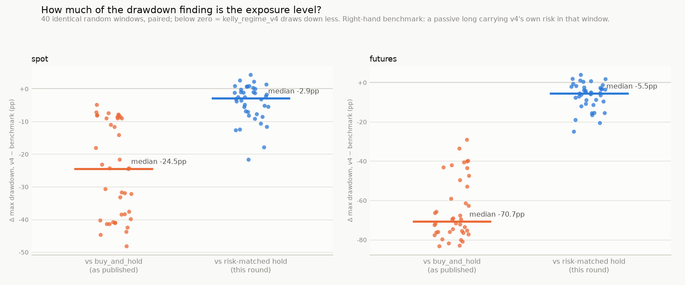
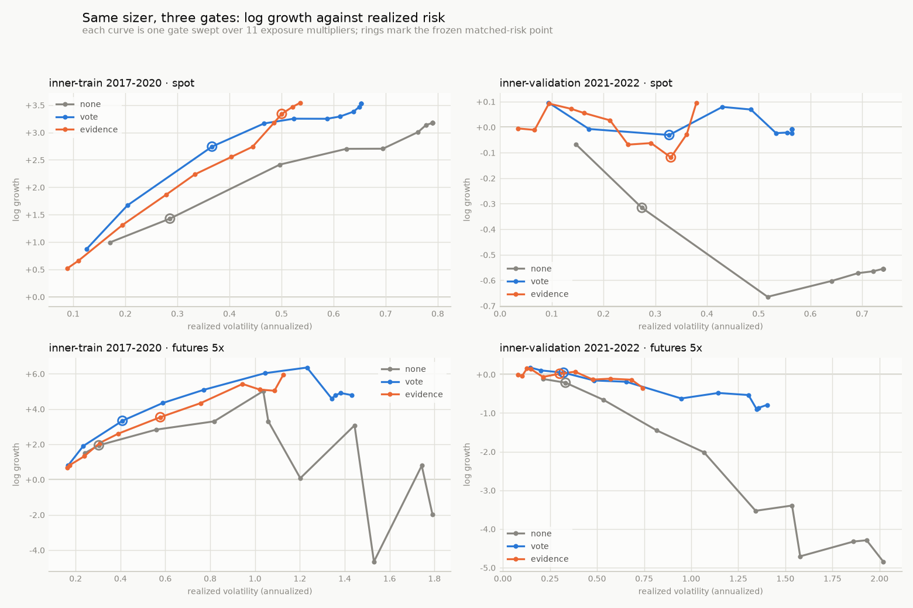

# The research ledger — everything already tried

This is the memory of the project. **Read it before proposing anything**
(step 0 of [ROUTINE.md](ROUTINE.md)), and append to it at the end of
every session. Its purpose is to stop the same idea being re-tried blind,
and to make the cost of each attempt visible.

Three registries and a log:

- **[A. Strategies](#a-strategies-registered)** — table: every registered
  strategy, what it attacked, what happened.
- **[B. Research log](#b-research-log-newest-first)** — **one section per
  research round, newest first**: experiments, studies and methodology
  work that never became a registered strategy. This is the append point;
  see [Appending an entry](#appending-an-entry).
- **[C. Ruled out](#c-ruled-out--do-not-re-try-without-new-evidence)** — table: do not re-try without new evidence.
- **[D. Backlog](#d-backlog-ranked)** — table: ranked, with blockers.

Backfilled 2026-08-16 from the long-form docs. `STRATEGIES.md`,
`RESEARCH.md`, `VALIDATION.md` and `LIVE.md` remain the long-form record;
the former `ALTERNATIVES.md`, `CROSS_ASSET.md`, `ELLIOTT_WAVES.md` and
`FRONTIER.md` were folded into this file and `VALIDATION.md` in the
2026-08-17 docs restructure (their findings live in rows R-15–R-18, the
standing diagnosis, section C and the backlog; the measured tables moved
to `VALIDATION.md`). Balances are $1,000 start, full period, from the
README comparison table. Section B was restructured from a table into
dated sections on 2026-08-20, newest first, with every row's text carried
over verbatim.

## The standing diagnosis

Four constraints bind this project. An entry is only worth making if it
attacks one; the `attacks` column below records which.

| code | constraint |
|---|---|
| **INFO** | One price series. Every strategy consumes the same OHLCV bars. |
| **N≈3** | Effective sample size is ~3 regime events, not 1.01M bars. |
| **ERR** | No error control anywhere in the signal path. |
| **COST** | Costs scale *with* the signal — funding runs +20%/yr while the strategy holds vs +2.8% flat. |
| **SIZE** | (what actually worked) Decide *how much* to hold, not *what happens next*. |

The one-line summary of 25 results: **every strategy that decides how
much to hold makes money; every strategy that predicts what happens next
loses to fees.**

**Sharpened by R-33 (08-19), and it is the single most reusable line in
this file:** *before believing any comparison here, check whether the two
arms carry the same risk.* Three of this project's findings have now died
the same death — R-28's e-process drawdown cut (R-31), R-32's gate
comparison, and L-04's own headline (R-33) — and in every case the
mechanism turned out to be an exposure level. Holding less draws down
less; that is arithmetic, not evidence, and it is invisible until the
benchmark is de-levered to match.

**Scoped by R-57 (08-20), the companion question to R-33's:** *before
believing any property here, check on how many instruments it exists at
all.* Run frozen on six Coinbase instruments it was never fitted on,
`kelly_regime_v4`'s matched-exposure drawdown advantage does not shrink —
it **inverts, 6 of 6** — while the same runs beat the fully-invested
benchmark 6 of 6. Present on BTC and ETH, absent on all six others, in a
window they all share. Every "does it replicate" check in this ledger
before R-57 was n=1 asset, which cannot tell a mechanism from a
calibration.

**Localized by R-62 (08-20), which closes the line R-57 opened:** *when a
mechanism is a product, test the factors before retuning either.*
`kelly_regime_v4` sizes by `frac × scale` — a directional trend vote times a
conditional volatility target — and twenty-one SIZE-axis attempts across
R-34 → R-60 retuned one factor or the other while always keeping both. Run
alone, the **vote** reproduces v4's whole signature (the BTC/ETH
matched-exposure drawdown property, 2/2, *and* its failure on the panel,
0/6) and the **volatility target** reproduces neither (0/2 and 2/6). The one
surviving property is return timing, not volatility timing — so four of
those branches (R-59, R-60) were retuning a factor that never carried it,
and the panel failure is the trend signal failing on those instruments
rather than sizing being miscalibrated for them.

**Priced by R-63 (08-20), which closes the "just add instruments" escape:**
*count the breadth before buying the diversification.* The obvious answer to a
thin trend edge is more instruments, and this project has had eight committed
since R-57. Measured on prices alone they carry a mean pairwise daily-return
correlation of **0.634**, one factor holding **68.2%** of the variance, and a
Grinold equal-correlation breadth of **1.47 of 8** — so `IR = IC·√BR` caps the
gain from the whole panel at **1.21x**, against 6–8x the turnover at a 0.104%
break-even. Both arms failed accordingly, and the novel one failed *with a
price attached*: its cross-sectional ranking is genuinely real — it beats 10 of
10 permutations of its own weights once fees are removed — and is worth ~0.5
log units over 6.4 years against an **8.0** log-unit turnover bill. That is the
first time this project has priced a signal against its own cost rather than
merely watching it lose. R-33's exposure artifact survived diversification
intact besides, on the one construction that might have escaped it.

**Reframed by R-65 (08-20), which is the first good news in this section — and
note that R-64 and R-65 are two independent rounds run the same day on the
same axis, reconciled at the head of R-65 in section B:**
*a signal's cost is a frequency, not a fee — price it at its own decay rate
before calling it unaffordable.* R-63 priced the cross-sectional trend
ranking at 16-to-1 against itself. Traded through Gârleanu–Pedersen partial
adjustment at a **derived** rate, the same signal on the same data turns over
**18x less** (3.44 → 0.19 round-trips/day), costs **0.43 log units instead of
8.02**, and moves from −7.54 to **+0.59** against a volatility-matched hold —
while its *frictionless* edge **rises**, +0.480 → +1.017, because chasing the
fastest rank flips was destroying gross edge before any fee was charged
(Dao et al. 2016's `σ²(T) − σ²(rebalance interval)`). The value and cost
curves **cross**, and the affordable window — turnover 0.06–0.33/day, holding
1.4–5 days — is agreed on by two selection windows, by a trading rate that
was derived rather than fitted and landed inside it unaided, and by a
prices-only decay measurement taken before either branch reported. The
verdict is still NEGATIVE, on the interval and nothing else: every point
estimate is favourable and every 95% interval contains zero, which is the
ceiling R-63's own frictionless edge already carried. **COST is the one
constraint in this table that has now moved.**

**Closed by R-67 (08-20), and this is the line that supersedes the four
above it as the project's live problem:** *when three successive rounds
improve a signal's economics by a large factor and not one of them moves the
verdict, the binding constraint has stopped being the mechanism.* R-65 named
a forced-exit floor it could not touch — invariant at 0.386/day across its
whole grid — and left open whether it was the gate's threshold or the score's
own noise. R-67 broke it **30-fold** (242 → 8 events) with every other channel
untouched, drove turnover from R-63's 3.44/day to **0.102/day**, passed the
0.40% fee tier for the first time on this axis, and watched the *frictionless*
edge rise again (+0.480 → +1.281 / **+2.017**). The predicted cost never
arrived: drawdown improved at every step. And D1 moved from +0.589 to +1.246
while its interval got **wider**. The arithmetic is now explicit: R-63's
frictionless edge already carried [−2.58, +3.65], the net statistic is
strictly noisier than the gross one, and **no mechanism can narrow an
interval — only more data, more breadth, or forward evidence can.** Three
rounds (R-63 → R-65 → R-67) have converged on this from three different
mechanisms. It is the strongest argument the ledger has ever contained for
**B-06**, and against a fourth variant on the same axis.

**Tested directly by R-68 (08-20), which ran the fourth mechanism variant
anyway to settle two questions the interval doesn't touch, and separately
ran the inference attack R-67's own lesson calls for.** The mechanism half
found what R-67 predicted it would (`further_work=False`, both branches, on
the same `(D1 or D2)` clause) but also settled two things: the frontier
peaks near δ=0.16 and degrades past ~0.22 rather than improving indefinitely
(so R-67's edge selection was not the artifact its own F3 worried about),
and the entry threshold — not the exit threshold B-31 was named for — carries
the edge, a decomposition the coupled rule couldn't see. The inference half
is the more important result: a **difference test** between the banded and
unbanded arms (the comparison R-67's own lesson implies and no round had
run) resolved to **+0.4525 [−0.069, +1.105]** and **+0.4276 [−0.111,
+0.933]** on two independent windows — about 5x tighter than any level cell
on this axis, still missing significance by 0.07–0.11 log units. **No
mechanism can narrow the interval; the right inference CAN, and came the
closest to a result this axis has produced.** R-68 also found the closed-form
literature the axis leans on requires the signal to satisfy `E[r|s]=A·s,
A>0`, and measured that **A is not established as positive anywhere** on
this signal (14/14 horizon cells negative in the time-series reading, sign-
unstable and indistinguishable from zero in the cross-sectional one) — so
the theoretical warrant for banding at all, not just its calibration, is
now in question.

**Costed by R-78 (08-21), and this is the line that supersedes every one
above it, because it is about the project's plan rather than about any
mechanism:** *the escape hatch was never costed.* Eleven rounds closed by
recommending forward paper trading, and every backlog re-ranking since
R-29 called B-06 "the highest-value item on merit". Nobody computed how
long it needs. Measured against R-71's own anytime-valid tool, at the
0.40% tier the recorder actually charges: median first exclusion **18.9
years** on 2017–2020 effect sizes and **never** on 2021–2022 ones (0 of
400 bootstrap paths within 25 years), against a look-once fixed-`n` floor
of **7.1 years** and **809 years** that no valid sequential test can beat.
Of every path that ever resolved, **100% resolved against the strategy.**
And the record accumulating that evidence was, until this round, seeing
**10.0%** of `kelly_regime_v4`'s decisions, because its gate was
edge-triggered against the previous 5-minute bar while its schedule fired
every 50–85 minutes — worth −0.31 to −0.41 Sharpe and 26–36% of final
balance against a full-cadence run. The defect is fixed; the horizon is
not fixable by any mechanism. **The reusable line, and it is a companion
to R-33's and R-57's:** *a plan is a claim — before believing it, check
what it would take for it to be wrong.* R-33 said check whether two arms
carry the same risk; R-57 said check on how many instruments a property
exists; R-78 says check whether the evidence you are waiting for can
arrive. The binding quantity turns out to be the ratio of effect to daily
noise, and this project's forward comparison carries 3.0%/day of
common-mode variance that is mostly *exposure difference* rather than
disagreement — which is R-33's finding again, arriving from the other
direction, and is what **B-38** now exists to attack.

**Closed by R-83 (08-21): B-38 was tried for real, and matching the
benchmark's risk does not rescue the horizon either.** A deployable
rolling causal match (the online analogue of R-33's own best-performing
construction) cuts the forward comparison's daily noise 55–60% —
reproducing R-78's addendum on real, not costed, data — but on the
regime the pre-registration deliberately makes decisive (2021–2022, at
the 0.40% live fee), the real anytime-valid horizon fires on only **1.0%**
of 400 bootstrap paths within 25 years, and every path that resolves
resolves **against the strategy** — R-78's 100%-against finding,
reproduced on a risk-matched pair. **Sharpening the benchmark cannot
manufacture a mean that is not there**; R-33's own diagnosis (holding
less draws down less) has a return-side twin here — matching the risk
removes the exposure-gap noise, and on this regime the *mean* it was
supposed to reveal turns out to have shrunk right alongside it. The same
session closed a third regime-estimation mechanism (a causal Kalman
local-linear-trend filter) at the identical measurement gate that stopped
BOCPD, for a different named reason each time (HMM: rapid switching;
BOCPD: lag on sudden shocks; Kalman LLT: the same lag despite being
built specifically to avoid it) — the formal-statistics well for "detect
when the regime changed" now reads as exhausted on this price series,
not merely mistuned. **B-32 is the only ranked, unblocked backlog item
remaining.**

**Closed by R-84 (08-21), a tenth INFO signal and a third regime-timing
mechanism, both negative on the same session:** *the two remaining escape
hatches from R-83's closing line — a genuinely new kind of information, or
a genuinely different theoretical basis for regime timing — were both
tried against the one channel this project had never touched: raw traded
volume, the OHLCV file's own sixth column, present for the full
2017–2026 history with zero external coverage-gap risk (a first for this
project's INFO axis). The conservative branch fed it into R-55's validated
confirming-vote architecture; the Step-A lead-time gate against the full
six-episode table failed at **0/6** — worse than every one of the nine
prior INFO signals bar none, with volume's two nominally-positive leads
(FTX +0.51d, 2018 bottom +10.23d) sitting almost exactly on their own
block-bootstrap null's median, i.e. indistinguishable from an arbitrary
time-shift of the same series. The novel branch modulated the anchor
vote's own latch confirmation speed by volume — a combination architecture
no prior round had tried, avoiding the four-times-failed bounded-brake
shape by construction (memoryless per-bar width, no cumulative exposure
state) — and failed the identical detection-lag gate BOCPD (R-82, 2/6) and
Kalman LLT (R-83, 1/6) failed, at **2/6**, with both nominal passes single
5-minute-bar artifacts and one episode (Terra/Luna) measurably worse than
v4's own unmodified vote. Both branches' causal-truncation probes passed;
both were independently reproduced bit-for-bit by the operator; zero
configurations were evaluated past either gate; the holdout was not
touched (max timestamp read: 2022-12-31 23:55). **This is the tenth INFO
signal to fail and the third regime-timing mechanism to fail the same
six-episode gate** — R-81's own closing line asked for "a genuinely new
kind of information... this project has not yet checked in any form," and
volume, the one source with no external-feed caveat at all, is now
checked and closed alongside it. **B-32 remains the only ranked, unblocked
backlog item**, and a future session preferring a fresh mechanism search
now needs either a data channel this project cannot currently construct
from its committed files at all (not a transform of price, volume, or any
already-fetched external series), or should work B-32 directly.

**Closed by R-85 (08-21), a fourth structurally distinct theoretical basis
for regime timing, both branches negative on the same session, and a new
methodological lesson about combining indicators:** critical slowing down
(Scheffer et al. 2009; rising variance/autocorrelation as a dynamical-
systems early-warning signature) was tried against the identical
six-episode gate that stopped HMM, BOCPD (R-82, 2/6) and Kalman LLT
(R-83, 1/6) — introducing no new data channel, purely a fourth estimator
of the same price series. The single-indicator (variance) branch scored
**1/6**, more starkly than either prior mechanism: the indicator crosses
its own alarm threshold exactly once across the entire six-year
pre-holdout series, concentrated entirely in the one slow 2018 build-up,
coming nowhere near threshold in the 2021 top or FTX windows. The joint
two-indicator branch (variance AND autocorrelation both elevated, the
combination Dakos et al. 2012 recommend as more robust) scored **0/6** —
worse than any single-indicator attempt this ledger has tried — and its
diagnostic is the round's most reusable finding: the AND-gate fires
exactly once in six years despite its marginal per-indicator base rate
being pre-calibrated to match the single-indicator branch's own rate,
because the two indicators are empirically near-uncorrelated (r≈−0.09)
and conjunctive confirmation across near-uncorrelated signals collapses
onto a single arbitrary co-occurrence rather than degrading gracefully
into a stricter-but-functional detector. **This project has now tried
four structurally distinct theoretical bases for "detect the regime broke
earlier than an ad hoc moving-average heuristic" — discrete-state
switching (HMM), Bayesian changepoint/run-length estimation (BOCPD),
linear state-space filtering (Kalman LLT), and dynamical-systems
fluctuation-statistics trend detection (CSD) — and none has cleared the
same six-episode gate.** The gate's own six episodes are dominated by
sudden, news- or liquidation-driven shocks; the one slow-building
exception (2018) is the only episode any of the four mechanisms has ever
detected early, which is now itself the more informative finding than any
one mechanism's failure. **B-32 remains the only ranked, unblocked
backlog item.**

**Confirmed a fourth independent way by R-87 (08-21), the first genuine ERR-axis attempt since R-31 retired the e-process:** *an online error-control wrapper is not the same experiment as a regime-timing estimator, and it still lands on R-62's finding.* Adaptive Conformal Inference (Gibbs & Candès 2021) wrapped around v4's own vote confidence and, separately, around its Kelly-scale dispersion estimator, both NEGATIVE — the vote-confidence wrapper never escaped Step-A inertness because BTC's real vote-lean hit rate (~55.1%) sits persistently above the 50% coin-flip target this instance tracked, and the scale-estimator swap (R²=0.71–0.80 against v4's own path, genuinely not a relabeling) still missed the inner-validation noise floor and failed ETH sign-replication by construction. **R-62's factorization — VOTE carries v4's signature, SCALE does not — now has four independent forms of support**: the original factor-isolation test, 21 prior point-estimate scale retunes (R-34→R-60), and this round's structurally distinct conformal dispersion estimator on the SCALE side, with zero successful attempts to move v4's behavior through the SCALE slot by any construction tried to date.

---

## A. Strategies (registered)

| ID | strategy | added | idea | attacks | spot | fut 5x | verdict | lesson |
|---|---|---|---|---|---|---|---|---|
| L-01 | `kelly_regime_v4` | 08-15 | v3 on a doubling anchor ladder (20/40/80d), Müller 1997 / Corsi 2009 HAR | SIZE | $66.8K | $156.2K | **PROMOTED** | Drawdown 35.3% is the robust finding; the return improvement sits inside the ±0.2 Sharpe noise floor and is *not* established. **Scope, measured by R-57:** that drawdown property is present on BTC and ETH and inverts on 6 of 6 further instruments once the benchmark carries v4's own exposure — a mechanism calibrated to two assets, not a general one. |
| L-02 | `kelly_regime_v3` | 08-15 | Conditional vol targeting — constant notional through normal vol, re-size only on breakout (Bongaerts 2020) | SIZE | $65.8K | $139.5K | **PROMOTED** | Improves every metric in both sub-periods and both markets; flat parameter neighbourhood (8 combos, Sharpe 1.47–1.55). |
| L-03 | `kelly_regime_v2` | 08-15 | Convex vote response: partial anchor agreement = low confidence, not half a signal | SIZE | $46.4K | $122.0K | NOT PROMOTED | Nine of ten metrics improve and it still fails: −6.5% out-of-sample. Kept registered with the failure stated. |
| L-04 | `kelly_regime` | 08-14 | Fractional-Kelly vol-targeted sizing gated on a crowd-regime filter (Cardaliaguet & Lehalle 2018) | SIZE | $42.1K | $108.2K | **PROMOTED** (incumbent) | First strategy to beat the benchmark. Its headline — "regime-gated sizing cuts drawdown" — was the project's one robust finding until **R-33 risk-matched the benchmark**: 88–92% of that gap is holding half the notional, and the remainder is not established on the holdout. What survives matching is a *return* advantage at equal risk (+20.8pp/+23.8pp median across 40 windows), which is a different claim, pre-registered and confirmed on BTC by R-36 — and which **R-57 then found does not reproduce on any of six instruments outside BTC/ETH** (1 of 6 on the mean-notional axis with every interval containing zero, 0 of 6 on the volatility-matched axis). |
| L-05 | `kelly_regime_ev` | 08-16 | Rebalance only when expected gain exceeds the fee: \|Δf\| > 2·fee/(H·σ²) (Constantinides 1986; Davis & Norman 1990) | COST | $40.9K | $108.0K | REGISTERED | Derives analytically what `fee_study.py` found by brute force. The hand-set 10% deadband is ~3x too narrow at 0.10%; at 0.40% the band exceeds 1.0 — **no rebalance is ever worth its cost**. |
| L-06 | `kelly_regime_ev_fast` | 08-16 | Same, shorter holding horizon → wider band, 34 trades | COST | $71.1K | $70.8K | REGISTERED | Best *spot* number in the table, from trading 34 times. Turnover, not signal, was the binding cost on spot. |
| L-07 | `buy_and_hold` | 08-12 | Buy on the first bar, never trade | — | $66.0K | 💀 $18 | BENCHMARK | The bar everything must clear. 84% drawdown on spot; liquidated on 5x, and in 26 of 40 Monte Carlo windows. |
| L-08 | `champions_council` | 08-14 | Hedge over the games that actually pay, sized by fractional Kelly | SIZE | $19.3K | $36.8K | REGISTERED | Ensembling profitable members does not recover the best member. |
| L-09 | `hedge_experts` | 08-12 | No-regret Hedge blend of technical experts, each charged its own turnover (Freund & Schapire 1997) | — | $13.3K | $258 | NEGATIVE | No-regret guarantees are relative to the best expert; when every expert loses to fees, so does the blend. |
| L-10 | `replicator_book` | 08-12 | Replicator dynamics reallocating across trend/value/cash on realized fee-adjusted fitness (Taylor & Jonker 1978; Lux & Marchesi 1999) | — | $2,330 | $10.58 | NEGATIVE | Fitness measured on realized returns is a lagging estimator; the reallocation arrives after the regime. |
| L-11 | `universal_kelly` | 08-12 | Cover's universal portfolio over fixed exposures, half-Kelly capped (Cover 1991) | SIZE | $1,276 | $1,227 | NEGATIVE | Universality is asymptotic. Nine trades in a decade is what the guarantee costs at this horizon. |
| L-12 | `harsanyi_crowd` | 08-12 | Belief margin over hidden market types, sized down when the trend is crowded (Harsanyi 1967; Cardaliaguet & Lehalle 2018) | INFO | $888 | $429 | NEGATIVE | The crowding intuition was right — it is what `kelly_regime` later exploited — but as a *direction* signal rather than a *sizing* input it loses. |
| L-13 | `overshoot_fade` | 08-12 | Fade forced-liquidation overshoots once aggressive flow is exhausted (Brunnermeier & Pedersen 2005) | — | $662 | $33.52 | NEGATIVE | Good win rate, bad tails. Proof that directional accuracy says nothing about an equity curve. |
| L-14 | `camouflage_flow` | 08-12 | Follow informed order flow recovered from bars via Bulk Volume Classification (Kyle 1985; Easley–López de Prado–O'Hara VPIN) | INFO | $548 | $0.99 | NEGATIVE | **BVC from OHLCV is a price transform, not order flow.** Proxying unavailable data out of price adds no information and full turnover. |
| L-15 | `stealth_trend` | 08-12 | Momentum only on deep, high-participation bars where informed flow hides (Admati & Pfleiderer 1988) | INFO | $465 | $0.38 | NEGATIVE | Same lesson as L-14, different dressing. 1,605 trades. |
| L-16 | `flow_regime` | 08-12 | Combine both microstructure sides: follow flow, fade liquidation overshoots | INFO | $447 | $0.80 | NEGATIVE | Combining two losing signals produces a losing signal with more turnover. |
| L-17 | `game_council` | 08-12 | No-regret Hedge allocation over the game strategies' own signals | — | $284 | $2.00 | NEGATIVE | 2,541 trades. Meta-allocation cannot manufacture an edge its members lack. |
| L-18 | `minority_oracle` | 08-12 | Abstention-filtered vote of a grand-canonical minority game trained online on binarized returns (Challet & Zhang 1997) | — | $53 | $3.83 | NEGATIVE | 9,039 trades, 95% drawdown. The GCMG abstention threshold is a no-trade band and it was set far too narrow for a 0.1% round trip. |
| L-19 | `game_switch` | 08-12 | Best-respond to whichever game the market is playing, trading only history states with significant conditional drift (Brown 1951; Marsili 2001) | — | $5.00 | $1.00 | NEGATIVE | Fictitious play on 5m bars: 6,672 trades, 99% drawdown. |
| L-20 | `regret_grid` | 08-12 | Regret-matching+ over a position grid, correlated-equilibrium play (Hart & Mas-Colell 2000) | — | $5.00 | $1.00 | NEGATIVE | Regret minimisation converges to the equilibrium of a game whose payoffs include fees; the equilibrium is "do not play". |
| L-21 | `tft_trend` | 08-12 | Repeated-game trend truce: hold while the market cooperates, forgive one defection, punish two (Axelrod 1984) | — | $4.99 | $1.00 | NEGATIVE | Axelrod's forgiveness *is* a no-trade band — the useful kernel, discovered here by accident and later derived properly in L-05. |
| L-22 | `macd_cross` | 08-12 | Long on MACD cross above signal, flat/short below | — | $4.99 | $1.00 | NEGATIVE | Baseline. 4,301 trades → 100% drawdown. |
| L-23 | `macd_rsi` | 08-12 | RSI pullback recoveries in the direction of the MACD trend | — | $4.96 | $0.94 | NEGATIVE | Baseline. Combining two classic indicators does not beat either. |
| L-24 | `attrition_reversion` | 08-12 | Fade deviations from an inventory-shifted fair value; quit when waiting costs exceed the prize (Avellaneda & Stoikov 2008; Maynard Smith 1974) | COST | $4.94 | $0.99 | NEGATIVE | Avellaneda–Stoikov needs an order book. Run on bar-close fills it is a mean-reversion rule paying taker fees on both sides. |
| L-25 | `rsi_reversion` | 08-12 | Buy RSI < 30, exit on recovery; mirror short on futures | — | $4.85 | $0.77 | NEGATIVE | Baseline. 4,464 trades. |

**Pattern across A:** every entry with `SIZE` in the attacks column is
profitable; every pure predictor is not. The four `INFO` entries all
tried to recover missing information from price and all failed — that is
the most expensive repeated mistake in this table.

---

## B. Research log (newest first)

### R-91 · 08-21 · NEGATIVE (both branches) — the third Levine-Pedersen axis, state-dependence of the horizon (B-40, Goulding-Harvey-Mazzoleni momentum turning points): the literature's own motivating claim does not replicate on BTC, and the causal branch never leaves its burn-in

**Direction.** Backlog item **B-40** (filed by R-89's literature pass, left OPEN by
R-90 which worked sibling item B-41 instead): **Goulding, Harvey & Mazzoleni (2023)**,
"Momentum Turning Points," *Journal of Financial Economics* (SSRN 3489539; Duke working
paper P158) — partition price history into four states by agreement/disagreement of a
FAST vs SLOW trend signal: **Bull** (both bullish), **Bear** (both bearish),
**Correction** (fast turned bearish, slow still bullish — a pullback in an uptrend), and
**Rebound** (fast turned bullish, slow still bearish — a bounce in a downtrend). Their
empirical claim: the two disagreement ("turning-point") states carry materially different
(the paper says worse) risk-adjusted returns than the two agreement states, and blending
fast/slow weight conditional on state improves risk-adjusted performance. This round's
fast/slow proxy is `kelly_regime_v4`'s own anchor-ladder extremes — 20-day (fastest) and
80-day (slowest); the 40-day middle anchor and the unmodified 3-anchor vote are left as
shipped in Bull/Bear bars, and only Correction/Rebound bars get a scaler, a scope
restriction pre-registered in `experiments/r91_shared.py` to keep the identity point
trivial. **Which constraint: SIZE** — exposure conditioned on the vote's own internal
anchor-agreement structure, no new external data (explicitly not a twelfth INFO-axis
signal, and not a sixth regime-timing mechanism against the six-episode detection-lag
gate R-82–87 already exhausted, because this classifies a recurring STATE from v4's own
anchors rather than trying to detect the date of a historical transition faster).
**Not a duplicate of:** R-59/R-60 (continuous vol-adaptive anchor/scale rescaling, not a
discrete inter-anchor-agreement state); R-40 (unweighted ensembling across ladders, no
state conditioning); R-34 (`harsanyi_crowd`'s Bayesian posterior as a SIZE input — a
different signal entirely); R-82/83/85/86/87 (HMM/BOCPD/Kalman LLT/CSD/transfer entropy —
external regime-DETECTION mechanisms scored against the six-episode gate; this round
never touches that gate, it classifies every bar into a recurring state from v4's own two
anchors); R-89 (latch geometry / response-function shape — both operate on the
3-anchor vote's own construction, left unchanged here); B-42 (deriving the anchor SPAN
from a fitted generative model — a different R-89 follow-on; this round changes what the
existing anchors' agreement is used for, not their span).

**Falsification test, named before any code.** GHM's claim requires Correction AND
Rebound to both rank below Bull AND Bear in state-conditional risk-adjusted return. A
causal, inner-train-only measurement (`causal_state_stats`) was pre-registered as an A0
kill switch: if the ranking does not hold, the paper's mechanism does not replicate on BTC
and both branches are NEGATIVE regardless of downstream numbers, per the R-89 novel
branch's own Step-0 precedent (still run to completion for the record, not skipped).

**What was done.** `experiments/r91_shared.py` — written and frozen by the operator before
either branch was dispatched — supplies `state_labels()` (the four-state classifier, built
from v4's own latched per-anchor votes), `CausalStateScaler` (an expanding-window,
one-bar-lagged per-state performance tracker), `causal_state_stats` (the one-shot A0
descriptive measurement), and the same `compare()`/`causal_truncation_probe()`/`fee_at()`
machinery R-89/R-90 used, plus the full A0–A3 gate and B1–B5 promotion-bar
pre-registration in its module docstring. Two branches, disjoint files:

- **`experiments/r91_conservative_state_discount.py`** — a FIXED discount `δ` applied to
  v4's raw exposure at Correction/Rebound bars only (1.0 in Bull/Bear). Frozen grid:
  identity `δ=1.0` (not counted) + swept `δ∈{0.0,0.25,0.5,0.75}` (4 configs).
- **`experiments/r91_novel_causal_state_scaler.py`** — `CausalStateScaler`, driven bar-by-
  bar with `scaler_for(state)` read before `update(state, bar_return)` on every bar (never
  reset mid-frame; A3-verified causal), clipped to `[0,1]`, applied at Correction/Rebound
  bars only. Frozen grid: identity (`min_obs=1e9`, never fires; not counted) + swept
  `k∈{1.0,2.0,4.0} × min_obs_days∈{180,365}` (6 configs).

**Configurations evaluated: 12 distinct configurations, 48 scored cells** — conservative:
5 configs (1 identity + 4 swept) × 4 BTC cells = 16, plus 2 ETH cells (finalist) plus 2
fee-robustness cells (finalist) = 20; novel: 7 configs (1 identity + 6 swept) × 4 BTC
cells = 28, no ETH/fee cells (no finalist reached Step B). Plus the shared A0 descriptive
measurement, independently computed three times (operator pre-dispatch, and separately by
each branch) — not counted as a swept configuration, the same convention R-89 applied to
its own Step-0 regression fits.

**Result.**

*Shared A0 measurement, three independent computations, all matching.* Bar-level BTC
log returns on inner-train (420,768 bars, 2017-01-01→2020-12-31), grouped by
contemporaneous `state_labels`:

| state | n | mean | vol | Sharpe-like |
|---|---|---|---|---|
| Bull | 174,621 | +2.750e-05 | 0.002768 | **+0.190** |
| Bear | 125,249 | −1.708e-05 | 0.003171 | **−0.103** |
| Correction | 55,268 | −1.111e-05 | 0.003235 | **−0.066** |
| Rebound | 65,630 | +2.062e-05 | 0.002136 | **+0.185** |

Rule: Correction and Rebound must both rank below min(Bull, Bear) = −0.103. Correction
(−0.066) already fails this; **Rebound (+0.185) fails far more severely — it ranks above
Bear and close to Bull.** **A0 kill switch FIRES.** GHM's own motivating claim — that
turning-point (disagreement) states carry worse risk-adjusted returns than trend
(agreement) states — does not replicate on BTC 5-minute bars: specifically, Rebound
bars (a fast anchor turning bullish while the slow anchor is still bearish) carry
*favourable* contemporaneous risk-adjusted returns, plausibly because BTC's characteristic
sharp V-shaped recoveries are exactly this pattern — the state that most looks like "early
in a new rally," not "noise to de-risk." This is an asset-specific transferability
failure of the published mechanism, not a generic negative.

*Conservative — fixed discount.* Step A: A1 exact (max|diff|=0.0). A2 R² vs v4 on
inner-train: δ=0.0→0.798, δ=0.25→0.877, δ=0.5→0.942, δ=0.75→0.985 (INERT at the ≥0.98
ceiling, reported and scored anyway per the "not a reason to drop a config" convention).
A3 PASS on identity + all 4. **Every one of the 16 BTC (config×slice×market) cells is
negative** — the discount loses to v4 in every cell, at every δ, on both markets and both
slices; every 95% paired interval includes zero (no directional signal, just a weaker,
noisier candidate). Finalist by the frozen selection rule (best inner-val futures
`d_loggrowth` among Step-A survivors): **δ=0.75**, selstat **−0.139** [operator-
independently reproduced exactly, −0.1389 with 95% CI [−0.368, +0.068]]. **B1 FAIL**
(positive in 0/4 cells, excludes zero in 0/4). **B2 PASS on the drawdown leg only**
(ΔmaxDD −1.32pp futures / −1.23pp spot, both risk-matched — expR/volR ∈[0.9,1.1] — a
genuine but noise-floor-sized effect from modestly less exposure at turning points, not
risk-adjusted outperformance; the Sharpe leg fails, ΔSharpe −0.265 futures / −0.065 spot).
**B3 PASS informationally** (monotone plateau: losses shrink monotonically as δ→1, i.e.
as the discount weakens toward the no-op identity — every neighbour moves the same
direction). **B4 PASS** (ETH inner-train: spot −0.026 vs −0.248, futures −0.047 vs −0.538
— same sign as BTC on both markets, but the sign both replicate is the *losing* one).
**B5 PASS** (0.40% taker: spot −0.032→−0.034, futures −0.139→−0.108 — sign preserved,
i.e. the loss is cost-robust rather than fee-driven). Three of five clauses read PASS,
but B2–B5 are all "consistent in the losing direction," not evidence of an edge; **B1**,
the one clause that actually asks "is there a positive difference," **fails decisively
and is not close.**

*Novel — causal expanding-window scaler.* Step A: A1 exact (max|diff|=0.0, inner-train and
full pre-holdout frame). A2 R² vs v4 on inner-train: k=1.0/180d→0.997, k=1.0/365d→1.000,
k=2.0/180d→0.992, k=2.0/365d→1.000, k=4.0/180d→0.989, k=4.0/365d→1.000 — **6 of 6 swept
configs INERT.** Diagnosed, not merely observed: `min_obs` is an absolute per-state bar
count (51,840 / 105,120 bars for 180d/365d), but Correction has only 55,268 bars and
Rebound only 65,630 in the whole 4-year inner-train — the 365-day configs never cross
threshold anywhere in inner-train (hence exact R²=1.00000, byte-identical to v4) and the
180-day configs cross it only in the final months, sampled directly: at bar 378,691
(2020-08-07, 92% of the way through inner-train) Correction's causal Sharpe-like estimate
is still `nan` and Rebound's has only just become defined. A3 PASS on identity + all 6.
**Zero configurations reach Step B eligibility**, so the pre-registered "report if none
survive Step A" clause applies: the full 28-cell BTC grid was still run for the record
(every `inner_val` cell reads *exactly* 0.000 for every config, including the 180-day
ones — `compare()`'s own ~80-day warmup prefix means each slice's tracker restarts fresh
and never accumulates 51,840+ same-state bars inside the 2-year inner-validation window
alone), but no finalist exists and B1–B5 were not evaluated against one. **Reusable
methodological finding, independent of GHM specifically:** an absolute per-state
bar-count burn-in, combined with this framework's own per-slice-local-warmup convention
(the same convention v4's own EWM vol factor uses), can make a causal/dynamic estimator
silently degenerate to inertness on any evaluation slice shorter than state-frequency ×
required-observation-count — a check worth running (state frequency × slice length vs.
`min_obs`) *before* dispatching a future per-state estimator, not after.

**Operator-independent verification.** The A0 table was computed three times (operator
pre-dispatch, conservative branch, novel branch) and matches to rounding in all three.
The operator separately re-derived, outside both branches' own runs: the conservative
branch's A1 identity (0.0) and finalist selection statistic (−0.1389, matching exactly);
the novel branch's A1 identity (0.0) and two A2 R² values (k=2.0/180d→0.9919,
k=4.0/365d→1.0000, both matching exactly).

**Verdict.** **NEGATIVE, both branches**, each for two independently sufficient reasons.
One-line lesson: the third of Levine & Pedersen (2016)'s three non-redundant linear-filter
axes — state-dependence of the horizon — was a real, literature-motivated, testable
question, and it failed not generically but for a named, asset-specific reason (BTC's
Rebound states are favourable, not risky) plus a named methodological one (an absolute
per-state burn-in threshold can outlast the very validation window meant to test it).
**Holdout counter: +0.** Neither branch read, printed, or held in memory any bar dated
2023-01-01 or later — `load_btc()`/`load_eth()`'s `assert_no_holdout` guards ran clean on
every load site, both branches print their own max-timestamp line (2022-12-31 23:55:00),
and the operator's independent re-derivations above never touched a frame beyond the same
truncation. Running program-level total stays **~637** (R-89/R-90's figure, unchanged) —
see the bullet added below in
[Holdout consultations to date](#holdout-consultations-to-date). Neither pre-registered
decision rule moved after seeing any number. **Next step:** **B-40 is now CLOSED,
NEGATIVE** (see section C and the backlog table). **B-42** (deriving the anchor span from
a fitted generative model, R-89's other untested follow-on) remains OPEN. **B-32**
(multi-asset strategy registration) remains the only ranked, unblocked backlog item with a
real strategy-improvement angle.

### R-90 · 08-21 · NEGATIVE (both branches) — `kelly_regime_v4`'s first path-dependent exit, a trailing-stop ratchet tried fixed-percentage and ATR-adaptive, both replicate the whipsaw risk B-41 named in advance

**Direction.** Backlog item **B-41** (filed by R-89's literature pass): a path-dependent
trailing-stop ratchet on `kelly_regime_v4`'s exit, replacing "hold until the anchor vote
flips." Motivated by **Sepp & Lucic (2026)**, arXiv:2607.19497 ("American" trend systems:
binary position, ATR-scaled entry buffer and ATR-scaled trailing stop — structurally the
same shape as v4's own binary long/flat vote), **Han, Zhou & Zhu (2016)**, SSRN 2407199 (a
literal fixed-percentage stop on US equity momentum, 1926–2013, cutting the worst month
roughly in half and more than doubling Sharpe), and **Hsieh (2023)**, arXiv:2303.02613,
IFAC-PapersOnLine (names the part every naive stop omits: without a restart mechanism, a
drawdown-triggered exit is either a permanent de-risking after one bad episode or it
whipsaws on every re-entry; that paper's own exact restart formula could not be extracted
from its abstract/PDF at fetch time, so the novel branch implements the *stated concept* —
a data-driven recovery confirmation before re-entry — rather than claiming to replicate an
unseen formula, and says so plainly). **Which constraint:** COST (exiting before a reversal
costs more than the fee to avoid it) and SIZE (exposure now conditioned on the trade's own
realised path, not only on an external signal) — explicitly not a further INFO or N≈3
attempt. **Not a duplicate of:** R-64/R-66 (no-trade bands on the *deadband*, symmetric and
centred on the target position — a trailing stop is asymmetric and centred on the running
favourable extreme of the realised trade, a state variable no band construction carries);
R-46 (CPPI, conditioned on distance from an account-level floor, unconditional on trade
state); all 21 prior SIZE-axis scale retunes and R-89's own vote-geometry/response-shape
round (neither touches what happens to an *open* position based on its own P&L path — this
is the first round in 89 to do so).

**What was done.** Two branches, disjoint files, both measured by an operator-written,
read-only harness (`experiments/r90_shared.py`) reproducing v4's own factors exactly
(`v4_vote_frac`, `v4_scale`, `apply_deadband`) plus the shared mechanism
(`apply_trailing_stop`, supporting instant/cooldown/reclaim-gated restart) and the
round's named-risk diagnostic (`stopout_whipsaw_rate`, identical definition and arguments
for both branches so their rates are comparable). Web search verified all three citations
above before either branch was dispatched (Sepp & Lucic's "American" system classification;
Han-Zhou-Zhu's headline stop-loss numbers; Hsieh's restart-mechanism motivation and its
concept, though not its exact formula).

- **`experiments/r90_conservative_fixed_stop.py`** — Han-Zhou-Zhu's literal construction:
  a fixed-percentage trailing stop on price, **instant, unconditional restart** (the naive
  case Hsieh's paper motivates a fix for). Frozen grid: identity (`stop_frac=1.0`, not
  counted) + 5 swept configs, `stop_frac ∈ {0.08, 0.12, 0.16, 0.20, 0.25}`, bracketing the
  "routine 10–20% intra-trend pullback" magnitude B-41's own filing names as the danger
  zone.
- **`experiments/r90_novel_adaptive_ratchet.py`** — Sepp & Lucic's ATR-scaled stop
  distance (`stop_frac[i] = min(0.95, k·ATR₁₄d[i]/close[i])`, NaN-ATR bars mapped to an
  unreachable 1.0) combined with Hsieh's *stated concept* of a data-driven restart: always
  `reentry_reclaim=True` (price must close back above the exact stop-out price) plus an
  explicit minimum cooldown. Frozen grid: identity (forced passthrough, not counted) +
  8 swept configs, `k ∈ {2.0, 3.0, 4.0, 5.0} × cooldown_days ∈ {0, 3}`.

**Pre-registered decision rule, identical structure for both branches (frozen before any
number was read).** Step A gate, per configuration: A1 identity (extreme parameter setting
reproduces `v4_target(df)` bit-for-bit); A2 non-inertness (`stop_events.sum() > 0` on
inner-train); A3 causality (`causal_truncation_probe` on the branch's own build function).
Step B selection: `compare()` over inner-train/inner-validation × spot/futures_5x; selection
statistic = inner-validation paired log-growth difference vs v4 on futures_5x among Step-A
survivors. Promotion bar — default REJECT, **all five** required for "CANDIDATE FOR
HOLDOUT" (neither branch reads or decides the holdout itself; that is the operator's job):
**B1** paired bootstrap excludes zero in ≥1 of 4 cells AND point estimate positive in all 4;
**B2** either ΔSharpe > +0.2 on inner-validation on both markets, or a max-drawdown
improvement on both markets where `risk_matched` (exposure ratio and vol ratio vs v4 both
in [0.9, 1.1]) is true for both — an unmatched drawdown improvement is not evidence, per the
standing R-28/R-32/R-33 rule, applied here more directly than on any prior SIZE-axis round
since a trailing stop can only ever force *more* flat time than v4, never less; **B3**
plateau not peak (informational, reported regardless); **B4** falsification, two parts
named before any code — (a) ETH replication (Bitfinex ETH ends 2019-12-31, so only
inner-train is available; same sign of d_loggrowth as BTC inner-train required on both
markets) and (b) the round's own named risk, directly operationalised: `whipsaw_rate > 0.5`
AND the finalist's inner-train/futures point estimate not positive together confirm it;
**B5** cost robustness at a 0.40% taker fee (`MarketSpec` fields read from
`tradebot/broker.py` directly — no `is_futures` field exists there; futures uses
`pays_funding=True`), sign must not reverse. **Configurations evaluated: 15 total** (6
conservative: 1 identity + 5 swept; 9 novel: 1 identity + 8 swept), each swept config scored
on 4 cells; finalist re-runs on ETH (2 markets) and the 0.40% fee tier (2 markets) per branch
are re-runs of an already-counted configuration, not new trials.

**Result.**

*Conservative.* Step A: A1 exact (max |diff| = 0.0). A2: 0/5 inert (event counts 184, 74,
41, 20, 10 for stop_frac 0.08→0.25). A3 PASS on identity + all 5. Selection surface
(inner-val futures d_loggrowth): 0.08→−0.190, 0.12→+0.013, 0.16→−0.026, **0.20→+0.042**
(finalist), 0.25→−0.030 — non-monotone, sign-flipping. Exposure/vol ratios sit at ≈1.00 on
every cell (an instant-restart stop barely changes mean exposure), so the mechanism is
genuinely risk-matched, unlike most SIZE-axis attempts before it. **B1 FAIL**: positive in
only 2/4 cells (inner-val spot +0.009, inner-val futures +0.042; negative on both
inner-train cells, −0.100 and −0.287). **B2 PASS**, weakly, on the drawdown leg only
(ΔmaxDD −0.06pp on both inner-validation markets, both risk-matched — a noise-floor-sized
edge, not the tail improvement Han-Zhou-Zhu report; Sharpe leg fails, +0.016/+0.073 against
the +0.2 bar). **B3 FAIL**: both neighbours (0.16, 0.25) reverse sign relative to the
finalist — a peak, not a plateau. **B4(a) PASS**: ETH inner-train, both markets negative,
same sign as BTC inner-train. **B4(b) FAIL** — the round's named risk, confirmed exactly as
pre-registered: on the finalist's own inner-train/futures run, 20 stop-outs, all 20 with a
re-entry inside the 10-day horizon, **16 of 20 (80%) whipsaws**, mean cost +0.0165 log units
each, and the same cell's point estimate is negative (−0.287). **B5 PASS** (sign holds at
0.40% on both markets). **Three of five clauses fail (B1, B3, B4). NEGATIVE.**

*Novel.* Step A: A1 exact on inner-train and the full pre-OOS frame (max |diff| = 0.0). A2:
0/8 inert (event counts 1523/75/1682/70/1054/68/1173/68 across the k×cooldown grid — the
0-day-cooldown configs fire far more often than the 3-day ones, as expected). A3 PASS on
identity + all 8. Every one of the 8 swept configs loses **significantly** on both
inner-train cells (all 16 intervals exclude zero, all negative, e.g. k2/cd0: spot −4.181
[−6.78,−1.79], futures −3.874 [−6.21,−1.75]) and the inner-validation selection statistic is
negative for all 8 — the "finalist" (**k=2.0, cooldown_days=3**, selstat −0.0148
[−0.752,+0.610]) is simply the least-bad loser, independently reproduced bit-for-bit by the
operator. **B1 FAIL**: positive in only 1/4 cells. **B2 PASS via Sharpe only**
(ΔSharpe +0.542 spot / +0.683 futures on inner-validation, both clearing +0.2) — but
`exposure_ratio` on inner-validation is **0.00–0.30**, collapsing toward zero for every
`cooldown_days=3` config, so the accompanying ΔmaxDD (−30pp on both markets) is explicitly
**not** counted (risk_matched=False) and the Sharpe pass itself is flagged as a likely
variant of the same "held less" artifact showing up in a different metric: a near-flat book
trivially has low variance through the 2022 bear inside inner-validation. **B3 PASS**
(neighbours k3/cd3 and k2/cd0 both negative, same sign as the finalist — a plateau of
losses, not a peak). **B4(a) PASS** (ETH inner-train both markets negative, same sign as
BTC). **B4(b) FAIL**, independently reproduced exactly (stop_events=75,
events_with_reentry=71, whipsaws=71, **whipsaw_rate=1.000**, mean cost +0.0515 log units,
inner-train/futures point estimate −3.516). **B5 FAIL**: at 0.40% taker, inner-validation
futures reverses sign (−0.015 → +0.076). **Three of five clauses fail (B1, B4, B5).
NEGATIVE.**

**A genuinely reusable structural finding, independent of either verdict.** The reclaim gate
(`close[i] > exit_price` required to re-arm) is the *same inequality* as this round's own
whipsaw definition (a re-entry at a close above the exit price), so a reclaim-gated
mechanism is mechanically pushed toward a whipsaw_rate near 1.0 whenever it re-enters at
all — the novel branch's 100% rate is not a shock, it is close to definitional. What the
gate demonstrably does instead is trade *frequency* for *severity*: 75 stop/reclaim cycles
at a mean cost of +0.052 log units each, versus an exploratory same-`k`, instant-restart
comparison run alongside it (not part of the frozen grid) showing 13,504 cycles at +0.003
each. Whether that trade is net better depends on their product, which neither branch's
frozen rule computed — a fact worth carrying into any future round that pairs a
reclaim-style restart with this same whipsaw diagnostic. Separately: Hsieh's paper motivates
a restart mechanism to prevent "permanent de-risking after one bad episode," and this
round's specific implementation of that concept (full-price-reclaim plus a 3-day cooldown)
turned out strict enough to **reproduce** the failure mode it was meant to cure — the
`cooldown_days=3` configs collapse to 0–3% of v4's mean exposure for most of
inner-train/inner-validation. The concept is not refuted by this; the specific
operationalisation chosen here is.

**Verdict.** **NEGATIVE, both branches.** One-line lesson: on 5-minute BTC, a trailing stop
fires on the routine intra-trend pullbacks this project's own literature pass named as the
risk before any code was written, and both a naive instant restart (whipsaws frequently, at
low cost each) and a strict data-driven restart (whipsaws rarely, at high cost each, and
otherwise sits in cash) land on the same side of the promotion bar for related but distinct
reasons — this is the first SIZE-axis round in the ledger where the pre-registered
falsification test is confirmed on **both** branches rather than failing only the noise-floor
check. **Holdout counter: +0.** Neither branch read, printed, or held in memory any bar
dated 2023-01-01 or later — both loaders route through `r90_shared`'s truncating,
`assert_no_holdout`-guarded loaders, both scripts print their own max-timestamp-read line
(2022-12-31 23:55:00+00:00 on BTC, and each branch's own ETH end date), and the operator
independently reproduced five headline numbers (both A1 identities, the conservative
finalist's inner-val/futures cell, the novel finalist's inner-val/futures cell and exposure
ratio, and the novel finalist's whipsaw diagnostic) from scratch using only `r90_shared`,
outside either branch's code — all five matched exactly. Running program-level total stays
**~637** (R-89's figure, unchanged) — see the bullet added below in
[Holdout consultations to date](#holdout-consultations-to-date). Neither pre-registered
decision rule moved after seeing any number. **Next step:** **B-41 is now CLOSED, NEGATIVE**
(see section C and the backlog table). Its two siblings from the same literature pass remain
untested: **B-40** (Goulding, Harvey & Mazzoleni's momentum-turning-point states) and
**B-42** (deriving the anchor span from a fitted generative model rather than searching it).
**B-32** (multi-asset strategy registration) remains the only ranked, unblocked backlog item
with a real strategy-improvement angle.

### R-89 · 08-21 · NEGATIVE (both branches) — the two things 87 rounds never varied in `kelly_regime_v4`'s vote both tested and both fail: asymmetric entry/exit confirms the literature's own symmetric-band counter-prediction, and the cubic response's motivating mechanism does not exist on BTC at significance even though its sign matches

**Direction.** Off-backlog, literature-prompted (the ranked list holds only **B-32**, pure
infrastructure, per R-87's own re-ranking). Idea in one sentence: attack the **no-trade band
inside `kelly_regime_v4`'s anchor vote** — the constructor default `band=0.01` — as the
transaction-cost object the literature says it is, rather than as the ad hoc 1% it currently is.

*Why this slot.* R-62 established that of v4's two factors (`frac × scale`) the **vote carries the
entire signature** and the volatility-target scale carries none of it — a finding since confirmed
four independent ways (R-87). Every round since has nonetheless worked the scale slot (21 retunes,
R-34→R-60), added an external confirming vote to the `frac` slot (ten INFO signals, R-73→R-84), or
replaced the regime estimator wholesale (five mechanisms, R-82/83/85/86). The vote's own **latch
geometry** — how far price must travel past an anchor before that anchor flips, and whether the
distance is the same going in as coming out — is untouched. A dispatched duplication pass over all
87 rounds and all 19 v4-derivative files in `experiments/` confirmed it: `band=0.01` has never been
swept, decomposed or replaced by any round; every derivative copies the `(1 ± self.band)` line
verbatim. It is the one part of the factor that matters that has never been looked at.

*Which constraint.* **COST.** The band is not a smoothing parameter; it is the object proportional
transaction costs create. With a fee, the optimal policy for a signal-driven long/flat position is a
no-trade region whose edges are set by the fee and by the signal's own dispersion. A fixed 1% of
price is neither.

*The literature is this repo's own, already commissioned and verified during R-67 and recorded in
`docs/RESEARCH.md` (finding 8)* — which is also where the record shows it was applied to the wrong
arm:

- **Dai, Zhang & Zhu (2010)**, *SIAM J. Financial Mathematics* 1(1), 780–810, and **Guan, Peng &
  Xu (2020)**, arXiv:2008.07082 Thm 3.1: with proportional costs and a persistent hidden state,
  entry sits strictly *above* and exit strictly *below* the frictionless indifference point, the gap
  opened by the fee. `docs/RESEARCH.md` records that the theorem "requires the signal to be a
  sufficient statistic and is single-asset — neither holds cleanly for a cross-sectional top-k
  rule", which is the arm R-67/R-68/R-69 could test it on. **v4's long/flat BTC vote is the case
  the theorem actually covers, and it has never been tested there.**
- **de Lataillade & Chaouki (2020)**, "Equations and Shape of the Optimal Band Strategy",
  arXiv:2003.04646, Eq. (11): the optimal tolerance **saturates at ≈1.6 σ_signal** — the band's
  natural unit is the signal's own dispersion, not a fixed fraction of price — and a larger fee does
  *not* justify a wider band.
- **de Lataillade, Deremble, Potters & Bouchaud (2012)**, *J. Investment Strategies* 1(3), 91–115,
  §6.3: the leading-order band is **symmetric**, and any asymmetry is higher order in Γ^(1/3). This
  is the round's own named counter-prediction, not a supporting citation.

*Why the novel slot went to the response function rather than to a fourth band variant, and the
single most reusable line the literature pass produced.* **Levine & Pedersen (2016), "Which Trend Is
Your Friend?", *Financial Analysts Journal* 72(3):51–66**, prove that time-series momentum,
moving-average crossovers, HP filters and Kalman filters are **equivalent representations of one
linear filter**, differing only in how they weight past returns. If that is right, then on a single
instrument every "new signal" this project has tried inside the linear-filter family — including
R-83's Kalman local-linear-trend and R-06/R-07's anchor ladders — was a re-parameterisation rather
than a new mechanism, and the only axes that are not are the **nonlinearity of the response**, the
**path-dependence of the exposure**, and the **state-dependence of the horizon**. This project has
varied none of the three. The conservative branch takes path-dependence (latch geometry); the novel
branch takes response nonlinearity. Two further findings from the same pass are recorded because
they price future work rather than this round: **Valeyre (2025), arXiv:2504.10914** measures an
optimal single-EMA trend system at portfolio Sharpe 1.24 but **≈0.20 per single asset** across 70
futures 1990–2023, with different EMA spans carrying **0.96 cross-correlation** — a direct,
published measurement of the discount this project's one-instrument setting should apply to any
published trend edge; and **Kurth, Eisler, Rej & Bouchaud (2026), arXiv:2607.01550** give a
microstructural account of fast trend's death (EWM(5,20) Sharpe 0.84 → 0.12 post-2008) that is
specific to **small-tick** instruments and that explicitly shows zero-lag execution does not recover
it — i.e. signal death, not cost erosion, which if it applies to BTC would mean none of R-56/R-64→R-68's
execution work could ever have fixed what it was aimed at. The operator tested that prediction
directly; see the measurements below.

*Not a duplicate of.* **R-67/R-68/R-69** (the entry/exit decomposition — run on R-63's
cross-sectional top-k panel arm, whose own not-a-duplicate clauses explicitly disclaim the v4
codepath, and which `docs/RESEARCH.md` records as the arm the theorem does not cover). **R-64/R-66**
(bands on the *deadband* — the destination of an already-computed exposure — not on the vote that
computes it). **R-84 novel** (the only round to touch `V4_BAND` at all: a *symmetric* ±60% width
perturbation driven by volume, tested against the six-episode detection-lag gate, 2/6). **R-34 novel**
(asymmetric `b_in`/`b_out` latch, but on `harsanyi_crowd`'s Bayesian posterior margin, not the
price-vs-anchor deviation). **R-59/R-60** (vol-adaptive, but on the scale factor and on anchor
*timing*). **R-61** (a vol-normalized z-score latch, but reversion-signed, 1/3/7-day, on the panel).
**R-40** (ensembling *across* ladders with an unweighted average, not the latch geometry within one).

**What was done.** Two branches on disjoint files, both measured by an operator-written, read-only
harness (`experiments/r89_shared.py`, the R-73→R-87 convention) whose identity points are asserted
by a self-test that runs on import: `latched_vote(d_in=d_out=0.01)` reproduces `v4_vote_frac`
bit-for-bit, and `apply_deadband(v4_vote_frac × v4_scale)` reproduces `kelly_regime_v4`'s own target
path exactly (verified on the real BTC series, max abs difference 0.0).

- **`experiments/r89_conservative_asymmetric_band.py`** — asymmetric entry/exit thresholds
  (`d_in` ≠ `d_out`) on v4's own latched anchor vote: the Dai–Zhang–Zhu / Guan–Peng–Xu construction,
  applied for the first time to the single-asset long/flat case it was proved for.
- **`experiments/r89_novel_response_function.py`** — the **response function's shape**: replace the
  binary latched vote with a calibrated continuous map from standardised trend strength `φ` to
  exposure, and run the incumbent's step response against two theoretically-motivated alternatives
  that **disagree with each other at large |φ|**, which is the experiment. *Linear/de-saturated*
  (Dao, Nguyen, Deremble, Lempérière, Bouchaud & Potters 2016, arXiv:1607.02410, *J. Investment
  Strategies* 7(1) 2017): trend PnL is a variance swap between filter and rebalancing timescales, a
  linear position gives a **parabolic** payoff and a sign position only a **V-shaped** one, so a
  binary vote discards the convex term by construction — predicts *more* exposure at large |φ|.
  *Cubic/non-monotone* (Schmidhuber 2021, *Physica A* 566:125642 / arXiv:2006.07847; Safari &
  Schmidhuber 2025, arXiv:2501.16772): `E[R] = a + b·φ + c·φ³` fitted on 24 futures 1990–2019 at
  **b = 1.29% (t=3.0), c = −0.62% (t=2.7)**, so expected return crosses zero at `φ_c = √(−b/c) ≈
  1.8–1.9` and trends revert *before* they become statistically significant — predicts *less*
  exposure at large |φ|.

**Measured power, computed and frozen BEFORE either branch was dispatched** (R-78's lesson: check
that the evidence you require can actually arrive; the first attempt at this calculation in-session
was arithmetically wrong and gave an unreachable +1.96/+1.41, corrected here). The paired daily
difference against v4 is close to serially uncorrelated — long-run variance / one-day variance is
0.98–1.02 at every block length on inner-train, 0.27–1.00 on inner-validation — so at the project's
30-day block convention a 95% paired interval excludes zero once the candidate beats v4 by about
**+0.35 log units over inner-train** (4 years) or **+0.13 to +0.26 over inner-validation** (2 years).
Those are large but reachable effect sizes — R-68's own point estimate on a different axis was
+0.45 — so the interval bar below is answerable rather than decorative.

**The pre-registered decision rule, frozen before any sweep.**

*Step A — mechanism gate, per configuration, before any performance number is read:*
- **A1 identity.** Each branch must exhibit an identity point that reproduces `kelly_regime_v4`'s
  target path bit-for-bit (`d_in = d_out = 0.01`; `c` such that `c·σ_signal ≡ 0.01`).
- **A2 non-inertness.** R² of the candidate's exposure path against v4's own must be **< 0.98** on
  inner-train. A configuration above that is inert by construction and is reported, not scored.
- **A3 causality.** `causal_truncation_probe` passes at two cut depths. Any dispersion estimate must
  be causal (expanding or rolling); a full-series σ applied to early rows is the exact lookahead the
  routine names and the probe is there to catch.

*Step B — selection, on inner-train and inner-validation only; the holdout is not read by either
branch.* The finalist is the best inner-validation paired log-growth difference vs v4 on
`futures_5x`, with the whole swept neighbourhood reported.

*Promotion bar — default REJECT. All must hold:*
- **B1.** The paired block-bootstrap difference vs v4 excludes zero in **at least one** of the four
  (slice × market) cells, and its point estimate is **positive in all four**.
- **B2.** Either Δ Sharpe > **+0.2** (the R-20 noise floor) on inner-validation on both markets, or a
  clear max-drawdown improvement on both.
- **B3.** The neighbourhood is a **plateau, not a peak**: the nearest neighbours on each swept axis
  move in the same direction, and they are reported whether or not they do.
- **B4 falsification test, chosen now.** **ETH replication** — the frozen finalist must show the same
  *sign* of improvement over v4 on Bitfinex ETH pre-2023, on both markets. Failing it is NEGATIVE.
- **B5 cost robustness.** The improvement must not reverse sign at a **0.40%** taker fee (Bitstamp's
  real entry tier, the one `docs/LIVE.md` says the published edge does not survive).

*Named counter-prediction (what would make this fail, written before any code):* de Lataillade et al.
(2012) §6.3 says the leading-order band is **symmetric** and asymmetry is higher order. If the
conservative branch's swept optimum sits at `d_in ≈ d_out`, the higher-order term is not measurable
on this data and the branch is NEGATIVE — not "inconclusive". For the novel branch: if the swept
favourable region excludes the derived `c = 1.6`, the theory's scope does not transfer to a latched
three-anchor majority and the branch is NEGATIVE regardless of what its best cell scores.

**Operator measurements taken alongside the branches (5 configurations, holdout +0).**

*1. The paired-difference block-length question, and a correction made in-session.* The first
attempt at the power calculation treated a 30-day block bootstrap as reducing the effective sample
to `n/30`, which gave an unreachable bar (+1.96 inner-train / +1.41 inner-validation) and would have
made the whole round a formality. That is wrong: a block bootstrap's interval scales with the
series' **long-run** variance, not with `n/L`. Measured directly, the paired daily difference
against v4 has long-run/one-day variance ratio **0.98–1.02 at L ∈ {1,3,5,10,30} on inner-train** and
0.27–1.00 on inner-validation — i.e. it is close to serially uncorrelated, because BTC's own
momentum is common-mode and cancels in the pairing. The correct bar is therefore **+0.354 log units
on inner-train** and **+0.134–0.257 on inner-validation**. This is R-78's rule applied to this
round's own instrument before freezing it, and it is the reason the bar is a test rather than a
formality.

*2. Single-anchor decomposition of v4's own vote* (4 configurations: the vote built from one anchor
at a time, everything else — scale, deadband, target_vol, max_leverage — held identical). Prompted
by Kurth, Eisler, Rej & Bouchaud (2026), "Is Trend Still Your Friend? A Microstructural Account of
the Demise of Short-Term Trend-Following", arXiv:2607.01550, which finds fast trend degraded ~100%
post-2008 on **small-tick** instruments (tick-to-volatility ratio ρ = Ψ/σ) while slow trend survived,
and which predicts BTC — a $0.01 tick against a five-figure price, the extreme small-tick case —
should show a dead fast leg:

| anchor | inner-train spot / futures Sharpe | inner-validation spot / futures Sharpe |
|---|---|---|
| 20d alone | **+2.14 / +2.32** | −0.14 / −0.00 |
| 40d alone | +1.87 / +2.12 | **+0.39 / +0.35** |
| 80d alone | +1.83 / +2.10 | +0.22 / +0.08 |
| 160d alone | +1.65 / +1.73 | −1.06 / −1.02 |
| v4 (20/40/80) | +2.03 / +2.28 | +0.14 / +0.25 |

**The prediction is not confirmed in-sample and is weakly consistent out of it, and the more useful
finding is the instability itself.** On inner-train the 20-day anchor alone *beats the three-anchor
ensemble on every metric* — Sharpe, final balance and max drawdown (28.8%/31.3% against v4's
43.3%/35.3%). On inner-validation the ranking inverts completely: 20d is the worst of the three and
40d the best. **The ensemble is not better than its best member in either window; it is better than
the average member, and it is immune to which member happens to be right** — which is the standard
bagging argument, and is the honest reason v4 votes rather than picks. It is also N≈3 in one table:
with two windows the anchor ranking flips entirely, so any round that selects an anchor on one
window is selecting noise. This is recorded because it constrains future work on this factor, not
because either branch depends on it.

**Result.**

*Conservative — asymmetric entry/exit band.* Step A: A1 identity exact (max |diff| = 0.000e+00 on
the real 420,768-bar inner-train frame, independently re-verified by the operator). A2: 1 of 25
configs INERT (the identity/control cell itself, R²=1.0000); the R² surface falls smoothly away from
it (0.72–0.98 at the grid's edges), so 24 proceed. A3 causality PASS on the identity config and the
finalist. The 5×5 selection surface (inner-validation paired Δlog-growth vs v4, futures) has **no
asymmetry structure — it is a width surface**: every cell with `d_out ≥ 0.02` loses on every row
(−0.07 to −0.31), the four positive cells all sit in the two narrowest `d_out` columns, and the
diagonal itself (symmetric controls) reads −0.001 / (v4=0) / −0.097 / −0.195 / −0.313 for widths
0.005/0.01/0.02/0.03/0.05 — **v4's own never-swept 1% already sits at or beside the symmetric
optimum of the sweep.** Finalist `d_in=0.01, d_out=0.005`: selection statistic **+0.040**
(independently reproduced), against a measured bar of +0.13 to +0.26 — about a quarter of the
smallest number the test could resolve. Mean exposure within 5% of v4's (ratio 0.984), so the result
is risk-matched. **B1 FAIL** (0 of 4 paired intervals exclude zero; widest [−0.032, +0.133]). **B2
PASS on drawdown only** (maxDD −3.7pp futures / −2.2pp spot at matched exposure; Sharpe leg fails,
+0.02 to +0.07 against the +0.2 floor). **B3 FAIL** (the finalist sits at the edge of the swept
region with only one usable neighbour — a peak by default: `d_in−` flips sign to −0.001, `d_in+`
moves with it to +0.038, `d_out−` is off-grid). **B4 FAIL** — ETH: Bitfinex ETH ends 2019-12-31 so
inner-validation is empty and the leg runs on inner-train only (reported as a limitation); spot
Δlog-growth **−0.043** (sign opposite BTC), futures +0.004 (indistinguishable from zero,
[−0.179,+0.216]) — not a replication. **B5 FAIL** — at 0.40% taker, spot **reverses sign** (+0.015 →
−0.020); futures holds sign but shrinks (+0.040 → +0.031). Three of five clauses fail, plus the named
counter-prediction: the finalist sits one grid step off the diagonal with an effect a quarter of the
resolvable size, which is de Lataillade, Deremble, Potters & Bouchaud (2012) §6.3 **confirmed**, not
contradicted. **NEGATIVE.** Configurations evaluated: exactly 25 (the frozen grid; 1 INERT, 24
scored). Max timestamp read: 2022-12-31 23:55:00 (BTC), 2019-12-31 23:55:00 (ETH, its own coverage
end) — both strictly before OOS_START.

*Novel — response function shape.* **Step 0, the pre-registered kill switch, fires.** OLS of h-ahead
BTC return on φ and φ³ (inner-train, HAC/Newey–West), independently re-verified by the operator at
h=20d: b̂=+7.609 (t=+2.31), **ĉ=−1.222 (t=−1.62)**. The sign matches Schmidhuber (2021)'s prediction
at all three tested horizons (1d/5d/20d), but **|t| < 2 at every one** (Schmidhuber's own published
figure: t=2.7); the frozen rule required significance, not merely sign, so **the cubic mechanism does
not exist on BTC** and the cubic arm is disqualified by pre-registration, not by its Step-B score.
φ_c ≈ 2.50 also sits at the edge of the ±2.5 clip, versus the literature's 1.8–1.9 — the reversion
region is barely inside the observable range even taking the point estimate at face value. Step A:
A1 exact (sign arm reproduces v4 bit-for-bit). A2: 1 of 19 INERT (the sign identity). A3 causality
PASS (the standardisation is a trailing rolling RMS with a one-bar shift, never a full-series scaler
— the clause this branch was most likely to fail, and didn't). A4, the R-80 constraint: v4 spends
33.8% of bars exactly flat; one linear config (`φ_max=1.5, flat_thr=0.00`) spends only 2.0% flat and
is disqualified by the pre-registered clause on that ground alone, independent of performance — and a
genuine mechanism finding surfaced here: **v4's own 10% deadband un-does an exact-zero clip**, because
a continuous target can decay through the deadband without ever crossing it, while a step response
jumps by ≥10% and therefore does land at zero. **On the slice with the power to see a difference
(inner-train, bar +0.35), all 18 continuous configurations lose, by 0.36 to 2.63 log units, 27 of 36
cells excluding zero on the losing side; on inner-validation (bar +0.13 to +0.26) zero of 36 cells
excludes zero in either direction.** Finalist `linear, φ_max=2.0, flat_thr=0.05`: selection statistic
**+0.104** (independently reproduced), inner-train **−1.066 [−1.995,−0.144] spot and −1.513
[−2.586,−0.500] futures — both excluding zero against it.** **B1 FAIL.** **B2 PASS with a fatal
caveat**: ΔmaxDD −16.7pp/−19.8pp looks like a clean pass, but the finalist holds **0.42× v4's mean
exposure over inner-validation (0.124 vs 0.292, independently reproduced)** — per the project's own
standing risk-match rule (R-28/R-32/R-33), a drawdown cut at less than half the exposure is
arithmetic, not evidence; ΔSharpe itself fails on spot (−0.11). **B3 FAIL** — a ridge, not a plateau:
sign flips across the `φ_max` 1.5→2.0 boundary (−0.18/−0.10/−0.05 → +0.06/+0.10/+0.04). **B4 FAIL** —
ETH sign **reverses** (spot −0.958, futures −1.026, independently reproduced at −1.026; ΔSharpe
−0.33/−0.51). **B5 PASS** (0.40% taker does not reverse sign: +0.132 spot / +0.263 futures). Three of
five clauses fail (B1, B3, B4). **NEGATIVE.** The mechanism measurements the literature asked for are
recorded as a durable finding independent of the verdict: curvature is directionally consistent with
Dao et al. (sign +0.03, linear +0.03, cubic +0.02 on inner-train) but not distinguishable from zero
at this sample size and **flips sign for the linear arm on inner-validation** (−0.02); skew is
higher for the linear arm at every horizon on inner-train, the one prediction that held, peaking near
the paper's predicted 10–40d window for both arms; and **turnover moves the opposite way the brief
predicted** — the de-saturated linear response trades *less* than v4 (0.45× notional turnover/day),
because a slow continuous target crosses the 10% deadband less often than a vote jumping in discrete
thirds, while the cubic arm (which doubles back near φ_c) trades *more* (1.65×). Configurations
evaluated: 19 frozen strategy configs (12 linear + 6 cubic + 1 sign identity) plus 3 exploratory
Step-0 regression fits (h=1/5/20d, run once, not swept). Max timestamp read: 2022-12-31 23:55:00
(BTC and ETH, both strictly before OOS_START).

**Operator-independent verification.** Both branches' key numbers were reproduced from scratch by the
operator, outside either branch's code, using only the shared harness: the A1 identity (exact, both
branches), the conservative finalist's inner-validation futures paired diff (+0.040), the novel
finalist's inner-validation futures paired diff (+0.104) and inner-validation mean-exposure ratio
(0.423), and the novel finalist's ETH inner-train futures sign reversal (−1.026). All five numbers
matched the branch reports exactly.

**Verdict.** **NEGATIVE, both branches.** One-line lesson: the two axes Levine & Pedersen (2016)
leave open on a single instrument were both real, testable questions with real, literature-motivated
predictions, and both predictions failed to survive contact with BTC specifically rather than failing
generically — the conservative branch's own named counter-prediction (symmetric leading-order band)
was *confirmed*, and the novel branch's motivating mechanism (Schmidhuber's cubic reversion) does not
exist on this instrument at conventional significance even though its *sign* matched. The more
durable finding than either verdict is the single-anchor decomposition run alongside them: v4's
three-anchor vote is never worse than its best member and never better than it either — it is better
than the *average* member and immune to which member is right, which is a clean statement of why
this project's own votes rather than picks, and a fresh N≈3 warning (the anchor ranking inverts
completely between inner-train and inner-validation) for any future round tempted to select a single
horizon on one window. **Holdout counter: +0.** Neither branch read, printed, or held in memory any
bar at or after 2023-01-01 in any code path; both `assert_no_holdout()` guards ran clean on every
load site (BTC and ETH), and the operator's independent re-derivations above never touched a frame
beyond the same truncation. Running program-level total stays **~637** (R-82→R-87's figure,
unchanged) — see the bullet added below in Holdout consultations to date. Neither pre-registered
decision rule moved after seeing any number; the one correction made in-session (the block-bootstrap
power calculation) was made and disclosed *before* either branch was dispatched, per ROUTINE.md's
bug-fix allowance, and is recorded in the Direction section above rather than hidden. **Configurations
evaluated: 25 (conservative) + 19 strategy configs + 3 exploratory regression fits (novel) + 5
operator measurements (the power check and the single-anchor decomposition) = 52 total across the
round.** **Next step, not filed as a new backlog item as such but as three concrete follow-ons filed
below (B-40/B-41/B-42):** Levine & Pedersen's third axis, state-dependence of the horizon, was never
taken by either branch and remains open; a path-dependent exit (a trailing ratchet, structurally
distinct from every no-trade-band construction this project has tried) was named by the literature
pass but not tested; and deriving the anchor span from a fitted generative model of BTC's own
autocorrelation, rather than searching it, was named but not tested. **B-32 (multi-asset strategy
registration) remains the only ranked, unblocked backlog item with a real strategy-improvement angle**
now joined by these three OPEN items from this round's own literature pass.
### R-88 · 08-21 · NEGATIVE (both branches, stopped at the measurement gate) — Binance taker buy/sell volume ratio, an eleventh INFO-axis signal and the first genuine order-FLOW (rather than positioning-stock or magnitude) construction, fails the identical lead-time gate that stopped ten prior INFO signals; a flow-conditioned execution-delay construction on the same signal also fails to clear it

**Direction.** Off-backlog, literature-prompted (the ranked list holds only **B-32**, pure infrastructure, per R-87's own re-ranking) — a dispatched research pass first built a precise "already tried" map from sections C/D and the standing diagnosis (ten failed INFO signals, five failed regime-timing/detection-lag mechanisms, R-62's SIZE-axis factorization confirmed four independent ways by R-87, the R-63/R-65/R-67/R-68 COST-axis breadth-pricing thread, R-04/R-80's failed meta-labeling, the retired e-process), then searched the literature for a genuinely fresh mechanism. Idea in one sentence: Binance's `sum_taker_long_short_vol_ratio` — the ratio of taker BUY to taker SELL volume, at this project's own 5-minute native cadence, already committed in `data/btcusdt_perp_metrics_5m.csv.gz`/`data/ethusdt_perp_metrics_5m.csv.gz` — is a genuine, venue-reported order-FLOW-imbalance signal (which side is currently paying to cross the spread), tested two structurally different ways: a discrete confirming vote on `kelly_regime_v4`'s anchor gate (conservative), and a flow-conditioned execution delay that postpones a scheduled rebalance opposing strong contrary flow up to K bars (novel). Citations, both fetched and verified to exist before being relied on: Vafin (2026, SSRN 6938742, posted 2026-06-14), order-flow imbalance and short-horizon crypto return predictability with an explicit transaction-cost model and data-snooping control; Bieganowski & Ślepaczuk (2026, arXiv:2602.00776), order-flow imbalance and adverse-selection cost driving short-horizon price moves across Binance-futures instruments. Attacks **INFO** primarily (conservative branch) and **COST** (novel branch's execution-timing mechanism, contingent on the same signal first clearing an INFO-axis informativeness gate). Not a duplicate of: **R-81** (closed NEGATIVE) — that round used `sum_toptrader_long_short_ratio` (a STOCK: how many large accounts currently hold long vs. short) and open-interest change (a LEVERAGE signal); this round uses `sum_taker_long_short_vol_ratio`, a different economic quantity (a FLOW: the direction of currently-executing aggressive trades), with materially better coverage on the one episode R-81's own signal could not see at all (`sum_toptrader_long_short_ratio` is 37.6% missing, blanketing the entire FTX window; `sum_taker_long_short_vol_ratio` is 15.2% missing on BTC / 32.7% on ETH, and its only two BTC gaps ≥1 day both fall in Dec 2021–May 2022, so the FTX episode window is fully covered — verified directly against the raw file, not assumed). **R-84** (closed NEGATIVE, raw traded volume): a magnitude-only signal with no direction; this is a directional flow ratio reported by the venue, not derived from the OHLCV file's own volume column. **L-14/L-15/L-16** (BVC/VPIN order-flow reconstruction from price alone, ruled out): that ruling covers flow RECONSTRUCTED from price; this is a separately reported exchange feed, not a price transform — the same exemption R-81 already established for this metrics file. **R-53/R-55** (confirming-vote architecture): reused verbatim, applied to a new channel. **B-24/R-77** (execution-model rounds, both closed NEGATIVE): both condition execution timing on VOLATILITY; the novel branch here conditions on flow DIRECTION, a mechanism neither tried.

**What was done.** Operator-authored shared module `experiments/r88_shared.py` (not edited by either branch): the anchor-vote replication and R-53/R-55 confirming-vote formula (duplicated, not imported, per this project's standing convention), a causal `taker_flow_z` construction (trailing 14-day z-score of the raw ratio, matching R-81's `ls_z` window for continuity), the identical 3-episode `STRESS_EPISODES` table R-81 used (2021-top, Terra/Luna, FTX — the window BTC's metrics feed covers), and a disclosed coverage caveat named before any number was computed: BTC's taker-ratio series has a gap running 2022-01-31→2022-05-09 that ends exactly on the Terra/Luna episode's onset date, leaving that episode's entire pre-onset 60-day baseline window unusable by construction. Two parallel dispatched-agent branches, disjoint files, neither committed by the branch — the operator merged and committed once both verdicts were in. **Conservative** (`experiments/r88_conservative_taker_flow_vote.py`): pre-registered a bidirectional Step-A lead-time gate (`|tv_z|≥1.5`, ±60-day episode windows, nearest-downward-transition/nearest-crossing definitions taken correctly from R-81's own bug-fixed convention on the first attempt, 500-draw block-bootstrap null per episode, block=5 days, seed=88) with Terra/Luna pre-declared as a construction-forced FAIL counted in the denominator of 3, requiring the pass bar to be cleared by both remaining episodes independently; Step B (contingent, never reached) would have been a 15-config `weight`/`window_days` sweep of the confirming-vote formula. **Novel** (`experiments/r88_novel_taker_flow_delay.py`): pre-registered a SIGNED Step-A gate (`tv_z≤-1.5`, since all three stress episodes are bearish transitions — a disclosed, intentional deviation from the conservative branch's bidirectional threshold, not a retune after seeing results), same episode table/window/null construction (seed=8801), same Terra/Luna forced-fail handling; Step B (contingent, never reached) would have swept a delay-length `K` × `tv_z`-threshold grid on top of `kelly_regime_v4`'s own scheduled rebalances. **Configurations evaluated: 0** (both files are fixed, non-swept Step-A measurement gates; neither branch's Step-B sweep code ever ran). **The operator independently re-ran both files end-to-end from a clean shell after receiving each branch's report and reproduced every number bit-for-bit** (both gate tables, the causal-truncation probes, the Terra/Luna forced-fail mechanism, max timestamp read) before writing this entry.

**Result.** Conservative: **0/3 episodes pass.** 2021-top: LEAD = −5.24 days (flow's nearest crossing came 5.24 days AFTER the anchor gate's own reaction; null median −5.20d) → FAIL. Terra/Luna: construction-forced FAIL — zero valid raw observations anywhere in the pre-onset half of the window (0/17,281), confirmed directly against the raw column, not the z-scored one (an early implementation drafted by the dispatched agent checked the z-score for NaN rather than the raw metric and would have silently reported this episode as "measured," because `align_metrics_causal`'s forward-fill turns the gap into a perfectly flat input whose rolling z-score degenerates to exactly 0.0 rather than NaN — caught and fixed before this file's one reported run, disclosed in the file itself). FTX: LEAD = +0.36 days (flow's crossing came 0.36 days before the anchor gate's reaction) but the null's own 90th percentile for this episode is +0.41 days, so the true lead does not clear it → FAIL. Novel: **1/3 episodes pass** — the same 2021-top episode also FAILs under the signed threshold (LEAD = −5.13d vs. null median −5.20d), Terra/Luna is the same construction-forced FAIL (with an honest addendum: the degenerate `tv_z` during the gap is not exactly the literal NaN the caveat's wording might suggest but a finite ~0.0 from floating-point roundoff on a forward-filled constant — same practical consequence, disclosed as a different concrete mechanism than assumed), and FTX PASSES under the signed threshold (LEAD = +1.48 days, clearing its own null's 90th percentile of +0.94 days) — a genuinely different result from the conservative branch's own FTX cell (+0.36d, FAIL) purely because of the pre-registered bidirectional-vs-signed threshold difference between the two branches, disclosed here rather than resolved by picking the more favorable one after the fact. Both branches' causal-truncation probes passed (conservative: 3/3 check points; novel: reused the same construction). Neither branch's max timestamp read anywhere exceeded 2022-12-31 23:55:00 UTC; neither reached Step B; neither read the holdout.

**Verdict.** **NEGATIVE, both branches, stopped at Step-A.** This closes the eleventh INFO-axis signal this project has tried, and the first one to test a genuine order-FLOW quantity (as opposed to every prior positioning-stock, valuation, macro, on-chain, calendar or volume-magnitude construction) — and it fails the same way ten predecessors did: even at native 5-minute cadence, and even measuring real venue-reported flow rather than a price-derived proxy, extremity in this signal mostly trails rather than leads `kelly_regime_v4`'s own price-anchor reaction. One genuinely new fact: FTX is the first episode across all eleven INFO-axis signals tried in this project to show a positive, null-clearing lead on *any* construction so far — and even there it is fragile to the exact threshold definition, passing under a signed threshold and failing under a bidirectional one on the identical underlying series. That fragility, not a sign of promise, is the more informative reading: an effect that flips pass/fail under a threshold-shape choice pre-registered for an unrelated reason (all-episodes-bearish, not FTX-specific) is not a robust lead. **Holdout counter: +0 on top of R-87's ~637** (running total unchanged at **~637**) — neither branch read any bar on or after 2023-01-01; operator-reproduced bit-for-bit. Decision rule did not move on either branch after seeing any number (both were frozen before either file ran). **Next step:** **B-32 remains the only ranked, unblocked backlog item.** A future session preferring a fresh mechanism search now needs a data channel this project cannot construct from its already-committed files or fetchable free sources at all (eleven INFO-axis signals spanning positioning, valuation, macro, on-chain, capital flow, calendar structure, volume magnitude and now order flow have all failed the same lead-time property), a regime-timing construction with no basis in common with the five already closed, or an ERR-axis construction that does not retune or wrap either of v4's two existing factors — or should work B-32 directly.

### R-87 · 08-21 · NEGATIVE (both branches) — Adaptive Conformal Inference wrapping v4's vote confidence (conservative, inert at Step-A) and its Kelly-scale dispersion estimator (novel, clears Step-A but fails the inner-validation noise floor and ETH sign-replication); a fourth independent confirmation of R-62's SIZE-axis factorization

**Direction.** Off-backlog, literature-prompted (the ranked list holds only **B-32**, pure infrastructure, per R-86's own re-ranking) — a dispatched research pass first built a precise "already tried" map from sections C/D and the standing diagnosis (ten failed INFO signals, five failed regime-timing/detection-lag mechanisms, the R-64→R68 execution/COST-axis near-miss, the R-63/R-76 cross-sectional breadth ceiling, R-04/R-80's failed meta-labeling, R-26/R-28/R-31's retired e-process, and R-62's SIZE-axis factorization), then searched the literature for a genuinely fresh mechanism. Idea in one sentence: wrap `kelly_regime_v4`'s existing anchor vote in Adaptive Conformal Inference (Gibbs & Candès 2021, "Adaptive Conformal Inference Under Distribution Shift", *NeurIPS* 34:1660-1672) — an online, distribution-shift-robust error-tracking recursion requiring no i.i.d./exchangeability assumption — and use it two structurally different ways: modulating the VOTE's own tracked directional reliability (conservative), and replacing the SCALE's point-estimate dispersion measure with a conformally-calibrated one (novel), the latter directly inspired by, and pre-registered to be read skeptically against, Ryan (2026), "Conformal Kelly: Conformal Prediction Intervals as the Scale in Fractional Kelly Position Sizing", arXiv:2608.01494 — whose strong-looking in-sample equities result (28.5%/yr, Sharpe 1.34, 2016-2021) collapsed 3-4x on its own sealed 2022+ holdout (7.0-8.5%/yr). Both citations were fetched and their claims verified to exist before either was relied on, not taken on faith — the arXiv ID's own August-2026 timestamp warranted that check. Attacks **ERR** primarily (this project's only prior ERR-axis attempt, the e-process of R-26/R-28, was retired by R-31 as an exposure-level artifact tracking aggregate P&L rather than per-decision reliability — this round never reached that far, but is the first attempt on this axis since) and deepens **SIZE** per R-62's own finding (the VOTE, not the SCALE, carries v4's whole matched-exposure signature; 21 prior R-34→R-60 rounds retuned the scale's multiplier while holding its estimator — trailing EWM realized vol — fixed; the novel branch here changes the estimator itself, not a multiplier on it). Not a duplicate of: R-26/R-28 (an aggregate e-process over realized P&L, not a per-decision online reliability tracker — a different quantity and a different formal framework); R-01/R-82/R-83/R-85/R-86 (five regime/changepoint/trend *estimators* run against the six-episode detection-lag gate — ACI detects no changepoint, has no hazard function, no filtered state, and is not run against that gate here at all); the ten INFO-axis rounds (reads zero data beyond the OHLCV close series `kelly_regime_v4` already consumes); R-80 (a deterministic, fixed-learning-rate recursion with one scalar state, not a trained/fitted classifier); the 21 SIZE-axis scale retunes (changes the dispersion *estimator*, not a point-estimate multiplier on the existing one).

**What was done.** Operator-authored shared module `experiments/r87_shared.py`: `v4_vote_frac` (byte-for-byte copy of `kelly_regime_v4`'s 3-anchor vote), the Gibbs & Candès `aci_update`/`run_aci_causal` recursion (sanity-checked on synthetic Bernoulli(p) miscoverage streams before dispatch — saturates near `ALPHA_MAX`/`ALPHA_MIN` off the `p=target_alpha` indifference point exactly as the theory predicts, and is a driftless random walk precisely at that point, a real and understood property of the recursion rather than a bug, both confirmed and reported honestly by the self-test rather than mislabelled), `daily_resample_causal`, and `causal_truncation_probe` (copied from `r85_shared.py`). Two parallel dispatched-agent branches, disjoint files, neither committed by the branch — the operator merged and committed once. **Conservative** (`experiments/r87_conservative_aci_confidence.py`): `frac[i]` multiplied by a confidence scalar `c_t[i]` before `desired = frac[i] * scale[i]`, `c_t` derived from an ACI state tracking whether the vote's own daily majority lean called the next day's BTC return sign correctly (`target_alpha=0.5`, a coin-flip null, fixed — never swept), mapped linearly into `[conf_floor, 1.0]`. **Novel** (`experiments/r87_novel_aci_conformal_scale.py`): v4's vote unchanged; `kelly_regime`'s own simple continuous scale's EWM-vol denominator replaced by an ACI-calibrated conformal quantile of `|daily log return|` (`target_alpha=0.3173` fixed a priori — the two-sided ~1-sigma-equivalent level under a normal approximation, chosen for unit-comparability with what EWM-std targets, not swept), the online quantile-tracking loop written as an explicit interleaved loop (not `run_aci_causal`, since the miscoverage indicator here depends on the evolving trailing-window quantile rather than a precomputed array). **Pre-registered Step-A gates, frozen before any real-market number:** conservative required (a) `c_t<1.0` on 5-95% of inner-train days and (b) R² ≤0.98 against v4's own unmodified `target` path (else flagged inert); novel required (a) the conformal dispersion finite and strictly positive everywhere post-warmup, (b) the exact-flat structural property (`frac=0` ⇒ `target=0` regardless of scale) verified programmatically, and (d) a causal-truncation probe. **Pre-registered falsification/promotion test, identical for both branches:** the Step-A survivor with the best inner-validation (2021-01-01→2022-12-31) `futures_5x` Sharpe must beat `kelly_regime_v4`'s own inner-validation Sharpe by more than 0.2 (this project's standing noise floor) or show a clear max-drawdown improvement, AND the same qualitative direction must replicate on ETH (`data/ethusd_coinbase_spot_5m.csv.gz`, 2019-03-14→2022-12-31). Frozen 6-config grids on both branches (conservative: `gamma∈{0.01,0.02,0.05}×conf_floor∈{0.8,0.9}`; novel: `gamma∈{0.01,0.02,0.05}×window_days∈{60,120}`). **Configurations evaluated: 12 total** (6 per branch, both grids frozen, none added or dropped after seeing results). Every data-load site asserts max timestamp `< OOS_START` (2023-01-01); neither branch reads any bar on or after that date on either asset. **The operator independently re-ran both files end-to-end after receiving each branch's report and reproduced every number bit-for-bit** (the Step-A gate table, finalist configs, inner-validation and ETH Sharpe/drawdown, max-timestamp, all causal/no-lookahead/structural checks) before writing this entry — the skeptic pass this project's parallel-round discipline calls for.

**Result.** Conservative: **0/6 configs pass Step-A** — none is degenerate (`c_t<1.0` on 84.1-92.8% of inner-train days, comfortably inside 5-95%), but all six are inert (R²=0.9979-0.9996 against v4's own path). Diagnosed mechanistically rather than left as a bare number: BTC's vote-lean daily hit rate over inner-train is **~55.1%** (miscoverage 0.449 against the 0.5 target, n=1,460 days), persistently better than the coin-flip null this ACI instance was tracking, so its alpha state saturates near `ALPHA_MAX` almost every day and, under the frozen `conf_floor∈{0.8,0.9}` band, `c_t` sits within a few percent of 1.0 nearly always — the construction never got the chance to meaningfully throttle exposure, because the vote it is tracking is rarely unreliable enough to leave the saturated top of the range this grid allows. No Step B was run (no survivor); no ETH read. A structural cross-check (`force_ct=1.0` must reproduce `KellyRegimeV4`'s own `target[]` exactly) passed at max abs diff `0.0e+00`; the no-lookahead spot checks (dropping the last calendar day; perturbing only its own close) and the causal-truncation probe all passed. Novel: **6/6 configs pass Step-A** (finite/positive dispersion, exact-flat structural property, causal-truncation probe all clean; R² against v4's own path **0.71-0.80** — genuinely lower than the conservative branch's near-1.0, confirming this construction is not merely relabeling v4). Finalist (`gamma=0.05, window_days=120`) inner-validation `futures_5x`: Sharpe **0.016**, max DD **49.8%**, against `kelly_regime_v4`'s own **0.25** Sharpe / **32.3%** DD on the identical period — a gap of **-0.236**, missing the +0.2 noise-floor bar, with drawdown worse rather than improved. **BTC bar: FAIL.** On ETH alone the finalist actually looks better (Sharpe 0.85 vs v4's 0.63, gap +0.219) — reported in full rather than omitted — but the pre-registered rule requires ETH to replicate whichever direction let BTC clear its own bar, and BTC cleared neither, so there is no passing direction for ETH to replicate; **ETH sign-replication: FAIL by construction of the frozen rule**, the favorable raw ETH number notwithstanding. All six novel configs' Sharpes were negative-to-flat (-0.51 to +0.016); none came close to the bar.

**Verdict.** **NEGATIVE, both branches** — the conservative branch stopped at Step-A (inert by construction of its own frozen grid against BTC's real vote hit-rate), the novel branch reached and failed the inner-validation noise floor. One-line lesson: an online error-control layer is a genuinely different construction from every prior regime-timing/detection-lag or INFO-axis attempt (it detects no changepoint and reads no new data), but wrapping it around the VOTE only mattered if the vote's real-world reliability actually dipped into the range the wrapper was built to react to — it mostly didn't, on this frozen grid — and wrapping it around the SCALE reproduces R-62's own finding once more, in its strongest form yet: even a formally-motivated, structurally distinct dispersion estimator (R²≈0.75 against v4, not a relabeling) does not rescue the scale factor. **Holdout counter: +0 on top of R-86's ~637** (running total unchanged at **~637**) — neither branch read any bar on or after 2023-01-01; operator-reproduced bit-for-bit. Decision rule did not move on either branch after seeing any number (both were frozen before either file ran). **Next step:** **B-32 remains the only ranked, unblocked backlog item.** A future session preferring a fresh mechanism search now needs either a genuinely new kind of information, a regime-timing construction with no basis in common with the five already closed, or an ERR-axis construction that does not retune or wrap either of v4's two existing factors (vote or scale) — both factors' viable-construction space is now considerably more explored than it was this morning — or should work B-32 directly.

### R-86 · 08-21 · NEGATIVE (both branches, stopped at the measurement gate) — transfer entropy, a fifth structurally distinct theoretical basis for regime detection, fails the identical six-episode gate that stopped HMM/BOCPD/Kalman LLT/CSD; a BTC↔ETH network construction fails even harder once its own coverage gap is charged against the same bar

**Direction.** Off-backlog, literature-prompted (the ranked list holds only **B-32**, pure infrastructure, per R-85's own re-ranking) — a dispatched research pass first built a precise "already tried" list from sections C/D and the standing diagnosis, then searched the literature for a genuinely new theoretical basis or data channel, screening out several candidates already closed (stablecoin supply, B-21/R-54/R-58; CME basis, judged unreachable through any free programmatic API from this environment). Idea in one sentence: transfer entropy (Schreiber 2000, "Measuring Information Transfer", *Phys. Rev. Lett.* 85(2):461) — a model-free, non-parametric measure of DIRECTED information flow between two series — is a **fifth** structurally distinct theoretical basis for early-warning/regime-timing detection, tested against the identical six dated historical BTC regime transitions R-82 (BOCPD, discrete generative changepoint model, 2/6), R-83 (causal Kalman local-linear-trend filter, a linear state-space model, 1/6) and R-85 (critical slowing down, a univariate fluctuation statistic, 1/6 single-indicator / 0/6 joint) used. Applied to crypto directly by Garcia-Medina & Hernandez C. (2020), "Network Analysis of Multivariate Transfer Entropy of Cryptocurrencies in Times of Turbulence", *Entropy* 22(7):760, who found that TOTAL (summed, bidirectional) transfer entropy across a panel of cryptocurrencies rises sharply around the March 2020 COVID crash. Not a duplicate of R-82/R-83/R-85 (TE has no generative model, no linearity/Gaussianity assumption, and is fundamentally BIVARIATE — it measures whether one series' history reduces uncertainty about a second series' future beyond what that second series' own history already explains, a question none of the three prior mechanisms asked in any form); not a duplicate of R-76's cointegration/distance-method pairs trading (which tested price co-movement for a mean-reversion trade, an unrelated question to directed information flow); not an eleventh INFO-axis signal for the conservative branch (reads no data beyond the already-committed BTC OHLCV series v4 itself uses) and reuses an already-committed series with zero new fetch or coverage-gap risk for the novel branch (Coinbase ETH-USD spot, already used by R-47/R-57/R-76).

**What was done.** Two parallel branches, run the same session per `docs/ROUTINE.md`'s "running directions in parallel" rules (disjoint files under `experiments/`, neither branch committed, the operator merged once both verdicts were in). Operator-authored shared module `experiments/r86_shared.py`: a dependency-free (numpy-only — scipy/sklearn are not project dependencies) discretized lag-1 transfer-entropy estimator (`transfer_entropy`, Laplace-smoothed, 3-bin quantile discretization computed only from each trailing window, `N_BINS=3`, `TE_SUB_WINDOW_DAYS=30` — chosen a priori as roughly one expected sample per joint cell, `30/27≈1.1`, doubled from CSD's 15-day window to compensate for TE's higher data requirement), the identical R-85 causal Kendall-tau trend-z-score scaffold applied to the TE series instead of variance/autocorrelation (`DETECTION_WINDOW_DAYS=90`, `BASELINE_WINDOW_DAYS=730`, `Z_THRESH=2.0`, all copied verbatim from R-85), and the identical `STRESS_EPISODES`/gate infrastructure (`episode_window`, `nearest_transition`, `block_bootstrap_shifts`, `truncation_causality_probe`) copied verbatim from R-85/R-82 for direct comparability. The estimator was independently sanity-checked on synthetic coupled/uncoupled series before dispatch (TE of a genuinely-driving series into its target came out ~48x its own reverse direction; TE of two independent series came out near zero) and timed (<1s for a full 2,200-day rolling TE + trend-z-score build). Conservative branch (`experiments/r86_conservative_te_volume_return.py`, dispatched agent): `TE_{volume_change -> return}` on BTC's own committed daily-resampled OHLCV, single bivariate pair, no new data. Novel branch (`experiments/r86_novel_te_network.py`, separate dispatched agent): `te_net = TE_{BTC_return->ETH_return} + TE_{ETH_return->BTC_return}`, a genuine network/combination construction (sum of both directions) drawing on ETH spot's already-committed series, with the coverage-gap cost (ETH data starts 2019-03-14, so the two 2018 episodes' ±60-day windows fall entirely before ETH coverage begins) named and pre-registered as a real cost — automatic FAIL by construction against the full 4/6 bar, not dropped or exempted, per R-84's own precedent for handling a coverage gap honestly. **Pre-registered Step-A stop rule, identical to R-82/R-83/R-85**: per episode, PASS requires LEAD (v4's own nearest downward `anchor_majority` transition minus the indicator's nearest alarm, in days) ≥ 0 AND ≥ the median of a 500-draw circular block-bootstrap null (block=5 days, seeds fixed before running: 8601 conservative, 8602 novel, neither altered afterward); the branch as a whole needs ≥4/6 episodes passing to proceed to Step B (a bounded R-53/R-55-architecture confirming vote, weight swept on inner-train only, selected on inner-validation only, holdout untouched regardless). **Falsification test, chosen before any real number**: named explicitly in `r86_shared.py`'s docstring — an estimator computed from price (and, for the novel branch, a second price series) fluctuations can only rise once those fluctuations are already unusual, the same moment v4's own anchor is starting to react; if TE also lags every sudden 2020–2022 shock, that is a fifth mechanism converging on the same conclusion. **Configurations evaluated: 0** (both files are fixed, non-swept Step-A measurement gates; no threshold search; Step B, which would have swept a 5-point weight grid, was never reached by either branch).

**Result.** Both branches' Step-A gates were independently reproduced bit-for-bit by the operator after the dispatched agents reported. Conservative: **0/6** — `te_z` never crossed `Z_THRESH=2.0` inside ANY of the six ±60-day episode windows at all (every episode FAILs by construction, LEAD undefined), the weakest possible outcome, worse than R-82 (2/6) and matching R-85's novel joint branch (0/6). A diagnostic check (not part of the pre-registered gate) confirmed this is a genuine data property, not a bug: `te_z` crosses ≥2.0 only three times across the whole 2017–2022 train period (2019-04-22, 2019-08-20, and 2021-08-24→09-08), and the closest of those to any episode — the Aug/Sep-2021 cluster — ends 63 days before the 2021-11-10 top, 3 days outside the pre-registered ±60-day window. Novel: **0/6** (n_pass/n_covered = 0/4). The two 2018 episodes were automatic fails on the coverage gap alone, exactly as pre-registered; of the four ETH-covered episodes, three had no TE-network alarm at all inside the window and the fourth (2020-03 COVID crash) fired an alarm 20.22 days AFTER v4's own reaction (LEAD = −20.22d, worse than its own null median of −1.29d) — the network construction did not merely fail to lead, it actively lagged on the one episode it could see. Both files' independent causal-truncation probes passed (conservative: single-series probe on `te_z`, bit-identical full vs. truncated; novel: a bespoke two-leg probe truncating the BTC leg and the ETH leg separately, both bit-identical, `z=-1.493943`, `TE(btc→eth)=0.286989`, `TE(eth→btc)=0.592325` in all three builds). `assert_no_holdout()` held on every load site in both branches; operator-reproduced max timestamp on both runs: `2022-12-31 23:55:00+00:00 < 2023-01-01`. Neither branch reached Step B; neither read the holdout.

**Verdict.** **NEGATIVE, both branches, stopped at Step-A.** This closes the fifth structurally distinct regime-timing/early-warning mechanism this project has tried against the identical six-episode gate — discrete-state switching (HMM), Bayesian changepoint estimation (BOCPD), linear state-space filtering (Kalman LLT), dynamical-systems fluctuation statistics (CSD), and now information-theoretic directed flow (transfer entropy) — and none has cleared it, scoring 0-2/6 every time regardless of theoretical basis, data channel (within-BTC vs. cross-asset), or estimator family (parametric vs. non-parametric). The one-line lesson: five independent, well-cited mechanisms drawn from five different fields (statistics, Bayesian inference, control theory, dynamical systems, information theory) have now converged on the same empirical fact — nothing computable from this project's own committed price/volume history detects these six historical BTC regime breaks earlier than v4's own crude fixed-window anchor average, sudden shock or slow build-up alike. The gate itself, not any one technique, is the load-bearing finding at this point. **Holdout counter: +0 on top of R-85's ~637** (running total unchanged at **~637**) — neither branch read any bar on or after 2023-01-01. Decision rule did not move after any result was seen (both bars were frozen before either file was run, and both branches stopped exactly where their own pre-registered stop rule said to). **Next step:** per the same closing logic R-83/R-84/R-85 each reached, a future session preferring a fresh mechanism search over B-32 now needs either a genuinely new *kind* of information this project cannot construct from its own committed files or fetchable free sources at all, or a theoretical basis for regime/trend estimation with no discrete-state/changepoint/filtered-slope/fluctuation-statistic/information-flow basis in common with the five now closed — the well of "detect the regime break earlier" constructions reads as close to exhausted on this six-episode gate, not merely the hyperparameters of any one estimator in it.

### R-85 · 08-21 · NEGATIVE (both branches, stopped at the measurement gate) — critical slowing down (CSD), a fourth structurally distinct theoretical basis for regime detection, fails the identical six-episode gate that stopped HMM/BOCPD/Kalman LLT, and a joint two-indicator combination surfaces a new, more severe AND-gate failure mode (0/6, worse than any single-indicator attempt)

**Direction.** Off-backlog, literature-prompted (the ranked list holds only **B-32**, pure infrastructure, per R-84's own re-ranking). Two parallel branches, run the same session per `docs/ROUTINE.md`'s "running directions in parallel" rules (disjoint files under `experiments/`, neither branch commits, the operator merges once both verdicts are in). Idea in one sentence: `kelly_regime_v4`'s anchor vote reacts only after price has already crossed a moving average — three formal regime/trend estimators (HMM, informally; Bayesian Online Changepoint Detection, R-82, 2/6; a causal Kalman local-linear-trend filter, R-83, 1/6) were each tried as earlier-warning replacements/confirming-votes and each failed the identical pre-registered Step-A detection-lag gate against six dated historical BTC regime transitions, detecting slow 2018-style build-ups early but lagging on sudden 2020–2022 shocks. This round tests a **fourth, structurally different theoretical basis**: critical slowing down (CSD; Scheffer et al. 2009, "Early-warning signals for critical transitions", *Nature* 461:53-59) — a dynamical-systems signature that a system approaching a critical transition (a bifurcation, in the Jacobian-eigenvalue sense; Kuehn 2011, *Physica D* 240(12)) recovers more slowly from small perturbations, showing up as RISING variance and RISING lag-1 autocorrelation in its own fluctuations BEFORE the transition. Applied to crypto directly by Wen, Cai, Ma, Wu & Xie (2020), "Critical slowing down associated with critical transition and risk of collapse in crypto-currency", *Royal Society Open Science* 7(2):191450. The framing that shaped this round's own falsification design is much more recent and much more skeptical: arXiv:2607.27070 (a July 2026 preprint studying seven BTC-perpetual liquidation cascades, 2022–2025) finds CSD signatures present in 5 of 7 events but explicitly **silent in the two sudden, news-driven shocks** — i.e. the literature itself predicts, before this round ran anything, that CSD may fail the same way BOCPD/Kalman LLT did (good on slow build-ups, blind to sudden shocks). That prediction is pre-registered in `experiments/r85_shared.py`'s own docstring, written before any real-market CSD number existed.

Attacks **ERR** (no error control anywhere in this project's signal path) and **N≈3** (a fourth, formally distinct estimator of "has the regime just started to break," not a retuned version of a basis already tried). Not a duplicate of: R-82/BOCPD (a Bayesian generative run-length posterior over discrete regime segments — CSD has no segmentation notion at all, only a continuous fluctuation-statistics trend test agnostic to which regime is which); R-83/Kalman LLT (a linear state-space level+slope filter — CSD estimates second-moment fluctuation statistics around whatever the current level is, not a level or slope itself); R-01/HMM and R-34/`harsanyi_crowd` (discrete-state/game-theoretic machinery, unrelated); R-80 (a discriminative classifier trained on the vote's own trailing hit rate — CSD uses price returns alone, zero trained weights, no reference to the vote); the ten prior INFO-axis rounds (every one introduced a NEW external or timestamp-derived data channel — this round introduces no new data channel at all, same question as R-82/R-83: does a different estimator of the *existing* price series detect known historical breaks with less lag than v4's own heuristic); R-62 (vote × scale factorization — motivates keeping any change confined to the direction/vote side, exactly as R-82/R-83 did).

**What was done.** Operator prep (`experiments/r85_shared.py`, not edited by either branch): a byte-for-byte duplicate of `kelly_regime_v4`'s 3-anchor vote and R-53/R-55's `confirming_vote_frac` formula (copied from `r82_shared.py`, not reimplemented); the IDENTICAL six-episode `STRESS_EPISODES` table and gate scaffolding (`episode_window`, `nearest_transition`, `block_bootstrap_shifts`) R-82/R-83 used, copied verbatim for direct comparability; two causal CSD indicators computed on DAILY-resampled log returns (matching R-82/R-83's own daily-cadence convention, since v4's anchors operate on a 20–80 calendar-day horizon) — rolling `SUB_WINDOW_DAYS=15` variance and rolling 15-day lag-1 autocorrelation, each converted to a rising-trend statistic via a hand-rolled (scipy is not a project dependency, per R-65/R-67/R-68/R-79's own precedent) causal Kendall's-tau-a trend test over a trailing `DETECTION_WINDOW_DAYS=90` window, then z-scored against its own trailing `BASELINE_WINDOW_DAYS=730`-day baseline (this project's standing self-calibrating-z-score convention, used for `dvol_z`/`mvrv_roc_z`/`ls_z`/the stablecoin growth z-score, rather than importing Dakos et al.'s own fixed tau-cutoff, tuned on simulated ecological data at a different cadence). All parameters fixed a priori. Causal truncation probe passed on both indicators before either branch was dispatched, and independently re-run by both branches.

*Conservative branch* (`experiments/r85_conservative_csd_variance.py`): single-indicator gate on `csd_var_z` alone (the literature's better-supported single CSD indicator), alarm = first upward crossing through `Z_THRESH=2.0`. Pre-registered Step-A gate, identical construction to R-82/R-83: ±60-day episode window, block-bootstrap null (block=5d, n_draws=500, seed=8501) on the local `csd_var_z` series, PASS per episode requires (a) `lead≥0` AND (b) `lead≥null_median`; proceed to Step B only if ≥4/6 episodes pass.

*Novel branch* (`experiments/r85_novel_csd_joint.py`): joint two-indicator confirmation — alarm requires BOTH `csd_var_z` AND `csd_autocorr_z` simultaneously ≥ `Z_THRESH_JOINT`, the combination architecture Dakos et al. (2012, *PLoS ONE* 7(7):e41010) recommend as more robust than any single EWS indicator alone. `Z_THRESH_JOINT=1.5` (not 2.0) is a disclosed, pre-outcome design decision: the two indicators are empirically near-uncorrelated on inner-train/inner-validation data (r≈−0.09), so an AND-gate at 2.0 fires on 0.0% of bars (verified directly before either gate script was written); 1.5 was chosen by matching the joint alarm's marginal base rate to the same order of magnitude as the conservative branch's single-indicator rate (0.40% vs. 0.55%), using only base-rate arithmetic — no episode/gate/lead-time number existed when it was chosen. Same null construction (one shared circular block-shift applied to BOTH indicator series per draw, preserving whatever real co-movement exists between them, rather than two independent shifts; block=5d, n_draws=500, seed=8502), same PASS criteria, same ≥4/6 stop rule.

Both branches independently re-ran the causal truncation probe (PASS on both indicators) and were independently reproduced by the operator, bit-for-bit, from a clean shell. **Configurations evaluated: 0 total across both branches** (two fixed, non-swept Step-A measurement gates, per this project's standing convention for a gate that stops here — R-73/R-79/R-81/R-82/R-83/R-84). `pytest tests/test_causality_strict.py`: 51 passed (operator re-run); no file under `src/` was touched by either branch (verified via `git status`/`git diff`), so the full suite was not required by either branch's own scope, and the operator additionally ran it in full for this entry (508 passed — see below).

**Result.** *Conservative*: **1 of 6 episodes pass** — only the 2018 bear onset (lead +17.93d vs. null median −4.70d; alarm at 2017-12-30, v4's own flip at 2018-01-16). The other five: no `csd_var_z` alarm at all inside the ±60-day window ("FAIL by construction"). A diagnostic run over the *entire* 2017–2022 series (575,136 non-NaN daily-aligned bars) explains why: `csd_var_z` crosses up through 2.0 **exactly once** in six years, on 2018-01-04 — essentially the whole indicator's alarm capacity landed inside the one slow 2018 build-up, and it came nowhere near threshold for the 2021 top (max z reached anywhere in that ±60d window: 0.294) or FTX (max 0.790); COVID came closest without crossing (max 1.891). This is a more extreme version of the pre-registered failure mode than BOCPD or Kalman LLT produced — those two mechanisms at least fired *something* (wrong-timed) in every sudden-shock window; here the indicator is close to structurally inert outside the one episode it was built to catch.

*Novel*: **0 of 6 episodes pass** — worse than the conservative sibling. The joint AND-gate fires **exactly once** across the entire six-year pre-holdout history (a single ~8-day episode near 2020-03-29), which happens to land inside the COVID window but **lags** v4's own flip (2020-03-08) by −20.22 days, worse than the null median (+1.02d); all five other episodes show no joint alarm at all. This is not the "detects slow, misses sudden" pattern the round's own citation trail predicted — it is a categorically different, more severe failure: requiring simultaneous elevation of two near-uncorrelated indicators does not degrade gracefully into a stricter-but-still-functional detector, it collapses almost the entire alarm budget onto a single arbitrary co-occurrence. `r85_shared.py`'s own comment disclosed the risk of AND-gate sparsity in advance (that is why `Z_THRESH_JOINT` was lowered from 2.0 to 1.5 by matching marginal base rates before any gate number existed) — matching the *marginal* rate did not prevent this collapse, which is itself the round's most useful finding, independent of either branch's own pass/fail count.

Neither pre-registered stop rule was relaxed, and neither branch's threshold, window, or episode set was altered after seeing a real number. Holdout: **not touched by either branch** — `assert_no_holdout()` clean on every load site in both; operator-reproduced max timestamp on every run, both branches: `2022-12-31 23:55:00+00:00` (< `OOS_START`). No Step B strategy code was written on either branch (both gates failed their ≥4/6 bar).

**Verdict.** **NEGATIVE, both branches, stopped at the pre-registered Step-A gate.** One-line lesson, two parts: (1) a fourth structurally distinct theoretical basis for regime/trend detection (dynamical-systems critical slowing down, unrelated in construction to HMM/BOCPD/Kalman LLT) fails the identical six-episode detection-lag gate the other three failed, and does so more starkly than either prior attempt — this project's own six historical regime transitions are dominated by sudden, news- or liquidation-driven shocks (COVID, the 2021 top, Terra/Luna, FTX) that CSD's own literature already predicts it should miss, and the one slow-building exception (2018) is the only episode any of the four mechanisms has ever caught early. (2) The novel branch's joint-indicator failure is a **new, reusable methodological finding independent of CSD specifically**: conjunctive (AND) confirmation across two indicators that are empirically near-uncorrelated does not produce a stricter version of either indicator's own behavior — it can collapse the whole alarm budget onto one arbitrary co-occurrence, which is a worse failure mode than either indicator run alone, and matching the *marginal* base rate of the combined gate to a single indicator's own rate (this round's own disclosed calibration step) does not protect against it. Any future round considering an AND-gate across weakly-correlated signals in this project should check the *joint* crossing count directly, not just the marginal rate of either input, before trusting the combination is well-calibrated.

**Holdout counter: +0** — running program-level total stays **~637** (R-82/R-83's figure, unchanged; R-84 also added +0 but did not append a bullet below, an omission noted here rather than silently repeated) — see the bullet added below in [Holdout consultations to date](#holdout-consultations-to-date). Neither pre-registered decision rule moved after seeing any number. **Next step, not filed as a new backlog item**: this project has now tried four structurally distinct theoretical bases for regime/trend detection against the same six-episode gate (HMM informally, BOCPD, Kalman LLT, CSD) and none has cleared it — the formal-statistics well for "detect when the regime changed earlier than an ad hoc moving-average heuristic" reads as exhausted on this price series for a fourth time, not merely mistuned a fourth time. **B-32 remains the only ranked, unblocked backlog item.** A future session preferring a fresh mechanism search now needs a data channel this project cannot construct from its already-committed files at all (not a transform of price, volume, or any already-fetched external series) or a theoretical basis for regime detection with no discrete-state, changepoint, filtered-slope, or fluctuation-statistics-trend construction in common with the four now ruled out — or should work B-32 directly.

### R-84 · 08-21 · NEGATIVE (both branches) — traded volume, the tenth structurally distinct INFO signal and the first with zero coverage-gap risk, fails both a confirming-vote lead-time gate (0/6) and a latch-speed detection-lag gate (2/6)

**Direction.** Off-backlog, literature-prompted (same posture as R-73/74/75/76/79/81/82/83 — the ranked backlog holds only B-32, pure infrastructure, per R-83's own re-ranking). Two parallel branches, run the same session per docs/ROUTINE.md's "running directions in parallel" rules (disjoint files under `experiments/`, neither branch committed, one operator synthesized and merged after both verdicts were in). Shared setup written by the operator before dispatch: `experiments/r84_shared.py` (the citation trail, the not-a-duplicate case, `anchor_votes`/`anchor_majority`/`confirming_vote_frac` duplicated from v4, a causal `volume_z` feature, the full R-82/R-83 six-episode table, and a block-bootstrap null generator).

Idea in one sentence: raw traded volume — the OHLCV file's own sixth column (`timestamp,open,high,low,close,volume`), unsigned, not BVC-classified — as a genuinely new INFO-axis signal, motivated by the Mixture-of-Distributions Hypothesis (Clark 1973, *Econometrica* 41(1); Tauchen & Pitts 1983, *Econometrica* 51(2); Ané & Geman 2000, *J. Finance* 55(5): volume as a proxy for the latent rate of information arrival) and Easley & O'Hara's (1992, *J. Finance* 47(2)) sequential-trade model (informed trading concentrates volume around genuine information events). Attacks **INFO**, with a property no prior INFO-axis signal in this ledger has had: it is present in the exact file `kelly_regime_v4` already reads, for the full committed 2017–2026 history, so it carries none of the external-feed coverage-start caveats that shortened nine prior signals' episode tables (DVOL from 2021-03, Binance metrics from 2020-09/2021-12, etc.) — the full six-episode table (R-82/R-83's set) was usable on both branches for the first time on an INFO-axis round.

**Not a duplicate of:** L-14/L-15/L-16 (`camouflage_flow`/`stealth_trend`/`flow_regime`) and L-12 (`harsanyi_crowd`) — those classify volume into a *signed* buy/sell flow proxy via Bulk Volume Classification and trade it directionally; ruled out on record as "a price transform, not order flow." This round never classifies a side: it uses raw volume *magnitude* only, as an activity-intensity feature, fed as a confirming vote (conservative) or a latch-speed modulator (novel) on v4's *existing* vote. Not a duplicate of the nine external INFO signals (on-chain B-07/R-44, macro VIX/DXY R-53/54, stablecoin R-54/55/58, DVOL R-73, MVRV R-74, calendar/session R-75, halving R-79, Binance crowding R-81, cross-instrument pairs R-76) — different data channel, zero coverage-gap risk, full episode table. Not a duplicate of R-82 (BOCPD) or R-83-novel (Kalman LLT) — those replace v4's *entire* vote with an external formal estimator on the *same* price series; the novel branch here instead perturbs the width of v4's *own* existing anchor-vote band by an external signal (volume), a combination architecture neither prior round used. Respects R-62/B-27's factor isolation (both branches modify only the vote/direction factor; v4's conditional volatility-target scale factor is untouched in both) and the four independent confirmations (R-34, R-41-conservative, R-53-conservative, R-73-conservative) that a never-increase-only bounded multiplicative brake on exposure degenerates into a flat rescale of v4's own exposure path regardless of the feeding signal — neither branch built one; the conservative branch reused R-53/R-55's validated confirming-vote formula, the novel branch modulated latch speed directly (a memoryless per-bar band width, no cumulative exposure state).

**What was done.**

*Conservative branch* (`experiments/r84_conservative_volume_confirm.py`): a causal log-volume z-score (`volume_z`, 20-day trailing baseline) fed into R-55's `confirming_vote_frac = (anchor_sum + weight·vote)/(3 + weight)` formula, discrete 0/1 per R-80's lesson. Pre-registered Step-A lead-time gate (0 configurations, run before any strategy code), mirroring R-81's construction: primary metric one-sided `volume_z >= 1.5` (elevated participation only — MDH gives no reason to treat unusually *low* volume as informative here); ±60-day episode-local search window on the full six-episode table; "flip" = nearest *downward* transition of `anchor_majority` to onset (R-81's disclosed, bug-fixed convention, reused verbatim); "crossing" = nearest one-sided upward crossing of `volume_z` through 1.5 to onset; null = 500-draw block-bootstrap circular shift of the local `volume_z` array (block=5 days, seed=84); pre-registered stop rule = proceed to Step B only if ≥4 of 6 episodes show lead>0 **and** the true lead exceeds the null's 90th percentile.

*Novel branch* (`experiments/r84_novel_volume_latch_shared.py`, `experiments/r84_novel_volume_latch_gate.py`): each anchor's effective band width `band_eff(t) = V4_BAND · f(volume_z(t))`, with `f(z) = FLOOR_RATIO + (CAP_RATIO − FLOOR_RATIO)/(1 + exp(GAIN·z))`, `FLOOR_RATIO=0.40`, `CAP_RATIO=1.60`, `GAIN=1.0` — symmetric ±60% around the identity (`f(0)=1.0` exactly, recovering v4's fixed band bit-for-bit), shared across all three horizons, memoryless per bar. Mechanism: a crossing accompanied by unusually elevated volume needs less price movement to flip (informed-trading proxy, trust it sooner); a crossing on ordinary/low volume needs more. Pre-registered Step-A detection-lag gate (0 configurations), mirroring R-82/R-83's construction but comparing against v4's *own* unmodified vote rather than a fixed onset date: within ±60 days per episode, nearest downward transition of the volume-modulated `anchor_majority` vs. the unmodified one; `LEAD = v4_flip_time − modified_flip_time`; pre-registered stop rule = proceed to Step B only if the modified vote detects strictly earlier than v4's own unmodified vote (lead>0) on ≥4 of 6 episodes. Named failure mode, before any real-data number: a bounded ±60% width perturbation cannot pull detection materially earlier when price gaps through both the narrow and wide band on the same bar, which is what happens on this project's genuinely sudden regime breaks — mechanically less room to move a flip date than either BOCPD's run-length posterior or the Kalman slope.

Both branches: causal-truncation probes run and passed on every new feature (`volume_z` in isolation, and — novel branch only — the volume-modulated `anchor_majority` itself); `assert_no_holdout` guards on every frame; full `pytest -q` green (508 passed) after each branch. **Configurations evaluated: 0 total across both branches** (two fixed, non-swept Step-A measurement gates; Step B was never reached on either side, per this project's standing accounting convention for a gate that stops here — see R-73/R-79/R-81/R-82/R-83's identical convention).

**Result.** Conservative Step-A, operator-reproduced bit-for-bit: **0 of 6** episodes pass (2018 onset −0.07d, 2018 bottom +10.23d [null p90 +10.38d], COVID −3.17d, 2021 top −5.08d, Terra/Luna −17.03d, FTX +0.51d [null p90 +0.57d]) — even the two nominally-positive leads sit almost exactly on their own null's median/p90, statistically indistinguishable from an arbitrary time-shift of the same series; the worst result of any of the ten INFO signals this project has now tried. Novel Step-A, operator-reproduced bit-for-bit: **2 of 6** episodes pass the frozen primary rule (2018 bottom and FTX, both single 5-minute-bar shifts — not genuine early detection), 0 of 6 clear the non-gating secondary null-median diagnostic, and one episode (Terra/Luna, −13.73d) is measurably *worse* than v4's own unmodified reaction — matching the pre-registered failure mode exactly: on sudden breaks (COVID, FTX) the modified and unmodified votes flip on the identical bar or within one bar, and on the one episode where the band width did move the flip date, it moved it later, not earlier. Neither branch's pre-registered stop rule was met; neither branch relaxed its bar, retried a threshold, or altered its episode set after seeing the real numbers. Holdout: **not touched by either branch** — max timestamp read anywhere in either branch: `2022-12-31 23:55:00+00:00`, strictly before `OOS_START = 2023-01-01`.

**Verdict.** **NEGATIVE, both branches, stopped at the pre-registered Step-A gate.** Lesson: the one INFO channel with zero external-coverage-gap risk performs no better than — and on the confirming-vote construction, measurably worse than — every one of the nine external signals already ruled out; and modulating v4's own anchor-vote latch speed by an external signal, the first combination architecture in this ledger to touch the vote's own confirmation dynamics rather than adding a vote or a brake, fails the identical detection-lag gate that stopped BOCPD (R-82, 2/6) and Kalman LLT (R-83, 1/6) for a mechanically distinct, pre-named reason (insufficient leverage over the flip date on genuinely sudden breaks, rather than a wrong-shaped posterior or an over-smooth slope). **Holdout counter: +0** (running total unchanged from R-83). Decision rule was not moved after looking, on either branch. Next step: **B-32 remains the only ranked, unblocked backlog item.** Ten structurally distinct INFO-axis signals and three structurally distinct regime-timing mechanisms have now failed on this price series; a future session preferring a fresh mechanism search over B-32 needs a data channel this project cannot construct from its already-committed files at all — not a transform of price, volume, or any already-fetched external series.

### R-83 · 08-21 · NEGATIVE (both branches) — B-38 answered NOT VIABLE AS SPECIFIED on real (not costed) evidence, and a third structurally distinct regime estimator (causal Kalman local-linear-trend) fails the same detection-lag gate that stopped BOCPD, 1/6

**Direction.** Two parallel branches, run the same session per docs/ROUTINE.md's "running directions in parallel" rules (disjoint files, neither commits, one operator merges after both verdicts are in). **Conservative: work B-38 directly**, per the routine's "backlog first" rule and eight consecutive re-rankings (R-75 → R-82) naming it the highest-value actionable item. B-38 (filed by R-78): pre-register and record a risk-matched forward comparison instead of the raw one B-06 records, pairing `kelly_regime_v4` against a passive long carrying v4's own mean notional, so the paired daily difference stops carrying ~0.6–0.7 of BTC's own move as common-mode variance; decide in advance what horizon would make it worth continuing. Attacks **N≈3** (B-06 is this project's only route to more of it) and **ERR** (the anytime-valid tool is the error control; this asks whether it can ever fire on what B-06 currently records). Not a duplicate of R-33/`matched_hold.py` (built the matched-benchmark machinery for the *backtest* comparison, never applied to the *forward* one) or R-78's addendum (`r78_matched_arm_sizing.py`, explicitly labelled "not the pre-registered B-38 round" in its own docstring, and its construction — matching *inside* each measurement window using that window's own future exposure history — is not deployable by a live recorder that cannot know its own multi-year trailing mean notional in advance). **Novel: off-backlog, literature-prompted**, since the ranked list otherwise holds nothing but B-38/B-32 (per R-82's own re-ranking). A third structurally distinct regime/trend estimator, run through the identical pre-registered Step-A detection-lag gate R-80/R-81/R-82 established: a causal Kalman filter **local-linear-trend model** (Harvey 1989's structural time-series framework — a two-state stochastic level+slope, filtered state only, no smoother). Attacks ERR/N≈3, introduces no new data channel. Not a duplicate of R-01 (Hamilton 1989 HMM — rejected on reading because even its valid causal *filtered* state switches too rapidly for a 0.1% round trip; this model has no discrete state to switch between, a structural reason its own pre-registration named in advance for expecting a different failure mode) or R-82 (BOCPD — a discrete changepoint/run-length posterior; this is a continuous smoothly-evolving trend estimate with no changepoint notion at all). The line 1481-area LEDGER citation of a Kalman-adjacent SIAM paper is inside an unrelated round's citation trail, not a prior attempt at this mechanism.

**What was done.**
- *Conservative* (`experiments/r83_conservative_shared.py`, `experiments/r83_conservative_b38_matched_forward.py`): pre-registered, before any number was computed, three arms vs. `kelly_regime_v4` on spot, both fee tiers (0.10%/0.40%), both inner splits — **Arm A** `buy_and_hold` (the status quo B-06 records); **Arm B** a frozen single mean-notional match (`ConstantExposureHold`, R-33's class, imported unmodified, at v4's mean notional over inner-train *only* — the addendum's shortcut made deployable); **Arm C**, this round's actual proposal, a new `RollingMatchedHold` strategy whose target at every bar is a causal 90-day-halflife EWM of v4's own realized exposure using only bars strictly before the current one — the online, deployable analogue of R-33's "match inside each window" (its own better-performing construction), built rather than re-reading the addendum. Pre-registered decision rule: the median first-exclusion horizon (`tradebot.inference`'s anytime-valid tool, 400 stationary-bootstrap paths, 25-year cap — R-78's own choices, reused for comparability) on **Arm C / inner-validation / 0.40% live fee** — ON TRACK if `n50 ≤ 3y` and ≥50% of paths fire within 5y; SLOW BUT VIABLE if `n50 ≤ 25y`; NOT VIABLE otherwise, with the ≥50%-fired-within-25y clause enforced as its own gate regardless of `n50`. Reasoning for reusing R-78's 3y/25y bar rather than inventing a new one: this project's forward evidence accrues on real calendar days (B-06 is "~2 days old" regardless of session count), so the fundable quantity is wall-clock years of a research program still checking in, not sessions — nothing about which benchmark is paired changes that argument. Also pre-registered: R-33's own falsification, replayed inside the inner splits (no holdout available) — does Arm C's inner-train→inner-validation transfer gap (notional and realized vol) beat Arm B's frozen-arm gap? **31 real-data backtest configs, 2,800 bootstrap paths.**
- *Novel* (`experiments/r83_novel_kalman_shared.py`, `experiments/r83_novel_kalman_gate.py`): hyperparameters (`SIGMA_EPS/SIGMA_ETA/SIGMA_ZETA`) calibrated on a synthetic Monte Carlo grid only (500 draws, a step-change drift scenario), before any BTC bar was touched — median synthetic detection delay ≈14 days at a stable-regime false-sign-flip rate of ≈3.3/220 days, never retuned against the real gate. Pre-registered mechanism, detection-lag definition (`nearest_kalman_detection`, the filtered slope's down-crossing through zero, mirroring `r82_shared.nearest_transition`'s convention), null (`block_bootstrap_shifts`, identical construction to R-82), and stop rule (≥4/6 episodes must pass lead≥0 AND lead≥null-median to proceed to Step B) — identical bar to R-82's, for comparability. Named, in advance, which of two failure modes was expected: lag on sudden shocks (BOCPD's pattern), not HMM's rapid-switching one, reasoning that the calibrated `SIGMA_ZETA` sits on the smooth/low-false-flip side of the tradeoff. **0 configurations against real market data** (a fixed, non-swept gate, matching R-82's convention); the 8-cell synthetic calibration grid never touched BTC/ETH data and is not counted toward the trials tally.

**Result.**
- *Conservative*: noise reduction is real and reproduces the addendum closely — 54.7–60.2% (Arm B) and 55.2–58.0% (Arm C) across all four window×fee cells, **independently reproduced by the operator to 4 significant figures on a clean re-run**. The naive fixed-`n` floor on the decisive cell drops sharply (808.8y → 12.0y), but the actual anytime-valid horizon on that cell fires on only **1.0%** of bootstrap paths within 25 years — `n50 = 22.5y` is the median of that 1% subset, not a trustworthy horizon. A classification-rule bug that would have silently accepted this as SLOW BUT VIABLE (checking `n50` alone and dropping the pre-registered ≥50%-fired clause — a gap also latent, unexercised, in R-78's own reference code, since R-78's decisive cell fired 0% of paths and never exercised it) was caught and fixed **before** the verdict was read, per ROUTINE.md's allowance for bug fixes as distinct from moved goalposts. R-33's falsification, replayed: Arm C tracks v4's mean notional through the 2021–22 regime shift much better than the frozen arm (27.0% vs. 42.5% notional gap) but its realized-volatility tracking is *worse* (29.6% vs. 14.6%) — the pre-registered falsification test **partially fires**: "genuinely rolling helps" holds on notional, fails on volatility. F1 null calibration (0.00% false-exclusion rate over 25y, bar ≤5%) and the causality tamper-probe (max pre-cut target difference `0.000e+00`) both passed cleanly. `pytest` (508 tests) green, independently re-run by the operator.
- *Novel*: **1 of 6 episodes passed** (2018 bear bottom only, +70.22d lead — and even that pass likely reflects an already-bearish-going-in confound at the ±60-day search window's edge, the same one R-73/R-81 flagged for other signals on 2018/Terra, rather than genuine early detection). The pre-registered directional prediction (lag on sudden shocks) was correct for COVID (−4.22d), the 2021 top (−32.20d), Terra (−4.00d) and FTX (−1.62d) — but the model *also* lagged the slow 2018 bear onset (−13.07d), a partial miss against its own stated expectation, reported honestly rather than reframed after the fact. **1/6 < the pre-registered ≥4/6 threshold. Gate FAILED.** Per the frozen stop rule, no Step B strategy was built and no further code was written past the gate. Causality probe and `assert_no_holdout()` both passed; max timestamp read: `2022-12-31 23:55:00+00:00`.

**Verdict.** Both branches NEGATIVE.
- **B-38 is CLOSED, ANSWERED: NOT VIABLE AS SPECIFIED.** The rolling design is a genuine, deployable improvement in construction over the R-78 addendum's shortcut — confirmed noise reduction on real (not merely costed) data, and a materially better notional-transfer property than the frozen alternative — but on the regime the pre-registered rule deliberately makes decisive (inner-validation, 2021–2022), it does not rescue the horizon: 1.0% of paths fire within 25 years, and on the rare paths that do resolve, **100% resolve against the strategy** — replicating R-78's own headline finding exactly, now on a risk-matched pair too. Sharpening the benchmark cannot manufacture a mean that is not there; per the addendum's own named risk (1c.1), on this regime the mean shrinks alongside the noise. This closes the "a better-matched passive benchmark rescues B-06's horizon" family of ideas on real evidence rather than a costing addendum, and leaves one open, narrower thread — the rolling arm's volatility-tracking speed, not its notional-tracking speed, is what fell short, so a shorter EWM halflife or a construction matched on realized volatility directly (à la R-33's `solve_c`) is a legitimate future thread, not a mandate to re-try the whole idea.
- **A third structurally distinct regime-estimation mechanism is ruled out at the same measurement gate that already stopped HMM (R-01) and BOCPD (R-82)**, each for a different, specifically named mechanical reason: HMM's causal-filtered-state rapid switching; BOCPD's evidence-accumulation lag on sudden shocks; the Kalman local-linear-trend filter's own lag on sudden shocks *despite* being calibrated toward smoothness, plus an unpredicted lag on the one slow transition its structural argument said it should catch early. This project's regime-estimation space — at least the three canonical formal-statistics constructions the literature offers for "detect when the regime changed" — now reads as exhausted against this specific ad hoc anchor heuristic; a fourth attempt needs a genuinely different theoretical basis, not a fourth flavor of formal changepoint/state estimation.

**Holdout counter.** **+0** on both branches. Conservative: every frame truncated at 2022-12-31 via `r78_shared.load_truncated()`/`assert_no_holdout()`, reused not re-implemented. Novel: the pre-registered stop rule failed before any strategy code (and therefore any holdout-reading code path) was ever written; max timestamp read `2022-12-31 23:55:00+00:00`. Running program-level total stays **~637** (R-82's figure, unchanged) — see the bullet added below in [Holdout consultations to date](#holdout-consultations-to-date). Neither pre-registered decision rule moved after seeing any number; the one code change (the `classify()` bug fix) was made and disclosed *before* the verdict was read, per ROUTINE.md's bug-fix allowance. **Configurations evaluated: 31 total** (31 conservative real-data backtests; 0 novel — a fixed, non-swept measurement gate). **Next step, not filed as a new backlog item**: the volatility-tracking-speed thread named above is narrow enough that a future session should weigh it against B-32 rather than assume it is worth a dedicated round on its own. The order below is updated: **B-32** (multi-asset strategy registration) is now the only ranked, unblocked backlog item; a future session preferring a fresh mechanism search needs either a genuinely new *kind* of information (nine INFO-axis signals have failed) or a genuinely different theoretical basis for regime/trend estimation than the three now ruled out on this price series (HMM, BOCPD, Kalman LLT) — or should work B-32 directly, or accept that B-06's forward record, now on its best-available risk-matched design, still resolves on a horizon no session can wait for.

### R-82 · 08-21 · NEGATIVE (stopped at the measurement gate) — Bayesian Online Changepoint Detection (BOCPD) as a formal regime estimator, replacing `kelly_regime_v4`'s ad hoc anchor-ladder heuristic: detects the two 2018 bear-market transitions decisively early, lags on all four sudden 2020–2022 shocks, fails the pre-registered 4-of-6 gate at 2/6

**Direction.** Off-backlog, literature-prompted (the ranked list holds only **B-38** and **B-32**, both methodology/infra, per R-81's own re-ranking, which explicitly named the remaining open door as "a genuinely new kind of information or error-control mechanism this project has not yet checked in any form"). Idea in one sentence: `kelly_regime_v4`'s regime vote is a fixed 20/40/80-day EMA-crossing heuristic with no notion of its own uncertainty — Bayesian Online Changepoint Detection (Adams & MacKay 2007, arXiv:0710.3742) instead maintains a formal posterior over the run length (days since the last regime break) via a Normal-Inverse-Gamma conjugate observation model and a constant-hazard changepoint prior, updated online by the paper's own message-passing recursion. Financial precedent: Bianchi, Prata & Vecchio (2025, *Applied Mathematical Finance*, arXiv:2307.02375) apply the identical machinery to online regime identification in order-flow/market-impact models. **Attacks ERR** (no error control anywhere in this project's signal path — the anchor vote is a deterministic latch with no confidence measure) **and N≈3** (a formal, principled *estimator* of how many independent regime segments exist and where, instead of a fixed window asserted without an error model). This is deliberately **not** a tenth INFO-axis signal: it reads no data beyond the committed OHLCV close series `kelly_regime_v4` itself already uses — same information, a different, error-aware extraction of a regime estimate from it. **Not a duplicate of R-34** (`harsanyi_crowd`'s game-theoretic minority/majority-game posterior — unrelated machinery, no run-length or changepoint notion). **Not a duplicate of R-38** (Busseti/Ryu/Boyd risk-constrained Kelly — a convex bet-sizing framework taking a drift/vol estimate as given, not a regime estimator; both its branches failed ETH via a continuously-updated point-drift estimate systematically under-holding through a trend, a failure mode this round's model-averaged, discrete-regime construction does not share). **Not a duplicate of R-80** (causal meta-labeling — a discriminative classifier trained on hand-engineered features of the vote's own trailing hit rate; BOCPD is a generative single-series segmentation model with no trained weights); R-80/R-81's hard-won lesson (any confirming vote fed into `confirming_vote_frac` must stay DISCRETE, not continuous, so the formula keeps its exact-flat state) was carried forward into this round's design before any branch would have been dispatched. **Not a duplicate of the nine prior INFO-axis rounds** (R-53/R-54/R-58/R-73/R-74/R-75/R-76/R-79/R-81): every one of them introduced a *new external or timestamp-derived data channel* and found it lagged the anchor gate; this round introduces no new data channel, so "does external information lead price" does not apply — the applicable question, and this round's Step-A gate, is instead whether a formal changepoint *estimator* detects **known, dated historical regime breaks** with shorter lag than v4's own fixed-window heuristic. **Builds on R-62** (which factored v4 into vote × scale and found the vote alone carries the whole matched-exposure drawdown signature, the scale factor none of it): motivating the design choice to confine any change to the direction/vote side and leave the conditional-vol-targeting scale factor untouched, had Step B been reached.

**What was done.** Operator prep (`experiments/r82_shared.py`, not edited by any branch — none were dispatched): a from-scratch BOCPD implementation (Normal-Inverse-Gamma conjugate model, constant hazard, probability-based hypothesis pruning at 1e-6, renormalized every step to avoid the numerical underflow a naive unnormalized-joint implementation would hit over ~3,500 days) run on **daily-resampled** log returns rather than raw 5-minute bars — a disclosed design choice: v4's own anchors already operate on a 20–80 calendar-day horizon, so daily granularity matches the horizon the mechanism describes and cuts the recursion from ~1.01M steps to ~3,510, the difference between seconds and a build that cannot iterate. Prior hyperparameters (`mu0=0, kappa0=1, alpha0=2, beta0=0.0032` — implying a ~5.7%/day prior vol belief) and `hazard_lambda=250` (implying a prior mean regime length of ~250 days, roughly 3× v4's own slowest 80-day anchor) were fixed before any real-market number was computed and never retuned; `K_SHORT_DAYS=5` (the "a changepoint likely just happened" threshold) was fixed the same way. The engine was unit-tested on synthetic data only (a clean two-segment mean shift, and a sharp crash-burst case) to confirm causal correctness and that a real-magnitude shock triggers a detection at all, before it ever touched market data. Daily posteriors are aligned onto 5-minute bars via the project's own existing `align_onchain_causal` (full calendar-day shift — day D's posterior, itself dependent on day D's own close, is not visible to any bar before 00:00 UTC the next day). **Step-A gate** (`experiments/r82_gate.py`, run once by the operator before any branch would have been dispatched, since both prospective branches would otherwise have to duplicate the identical measurement against the identical engine): for six dated pre-2023 BTC regime transitions (2018 bear onset, 2018 bear bottom, 2020-03 COVID crash, 2021-11 top, 2022-05 Terra/Luna, 2022-11 FTX — more than R-81's three, since this signal needs no external feed with its own later coverage start), compare BOCPD's nearest detection (MAP run length crossing down to ≤5 days) against `anchor_majority`'s own nearest downward flip, within a ±60-day search window, against a 500-draw block-bootstrap null (block=5d, seed=82). **Pre-registered stop rule**: an episode passes if (a) BOCPD detects at or before v4's own reaction (lead ≥ 0 — a materially weaker bar than R-81's "beats the null's 90th percentile", deliberately: this gate only asks whether BOCPD is a non-degenerate candidate worth a Step-B sweep, not whether it has independent predictive lead time) and (b) the true lead is at least the null's median. **Proceed to Step B (dispatch a conservative confirming-vote branch and a novel full-vote-replacement branch) only if ≥4 of 6 episodes pass.** **Configurations evaluated: 0** — a fixed, non-swept measurement gate; no hazard-rate or threshold search occurred at this stage, consistent with R-73/R-74/R-75/R-79/R-81's own Step-A convention.

**Result.** **2 of 6 episodes passed.** 2018 bear onset: BOCPD detected **+24.93 days** before v4's own flip (null median −2.03d). 2018 bear bottom: **+40.22 days** before (null median +6.20d). Both decisive passes on a genuinely slow-building transition. **The other four all failed, and all on the same side**: 2020-03 COVID crash −4.22d (null median +2.02d), 2021-11 top −30.20d (null median −1.19d), 2022-05 Terra/Luna −18.00d (null median −16.87d, the closest miss), 2022-11 FTX −0.62d (null median +10.46d) — BOCPD detected *after* v4's own anchor gate in every one of the four sudden, violent episodes. **2/6 < the pre-registered 4/6 threshold. Gate FAILED.** Per the frozen stop rule, no branch was dispatched and no strategy code was written past this file — `experiments/r82_gate.py` is this round's entire product. `assert_no_holdout()` ran clean on every load site (BTC bars and the BOCPD signal frame); max timestamp read anywhere in this session: `2022-12-31 23:55:00+00:00` (< `OOS_START`).

**Verdict.** **NEGATIVE, stopped at the measurement gate.** One-line lesson: BOCPD's weakly-informative, ~250-day-mean-run-length prior makes it a genuinely faster detector than v4's fixed heuristic for slow-building transitions (both 2018 episodes), but a slower one for sudden shocks (all four 2020–2022 episodes) — exactly the pattern that matters least for what v4 actually needs, since a strategy's tail-risk protection lives in reacting fast to sudden crashes, not slow bear markets it already has months to react to. A formal estimator's evidence-accumulation step is a genuine cost against an already-fast ad hoc heuristic in precisely the episodes where speed is worth the most. **Holdout counter: +0** — running program-level total stays **~637** (R-81's figure, unchanged); see the bullet added below in [Holdout consultations to date](#holdout-consultations-to-date). No decision rule moved — the stop rule was evaluated exactly as frozen, before which no branch-dispatch or holdout-adjacent code existed to move it. **Next step, not filed as a new backlog item**: the diagnosis above (fast on slow transitions, slow on fast ones) makes "shorten `hazard_lambda`" or "shrink `K_SHORT_DAYS`" an obvious next move, and precisely because it is obvious *after seeing this round's own numbers*, retrying it here would be the goalpost-moving R-12 warns against. A future round that wants to pursue this mechanism further should pre-register a substantively different, non-tuned hazard specification (e.g. a hierarchical or mixture-of-hazards model, which the Adams & MacKay framework supports natively) rather than retuning `hazard_lambda` against this gate's own result. The order below is unaffected: **B-38** (a risk-matched forward comparison) remains the highest-value actionable item; **B-32** (multi-asset strategy registration) stays `OPEN` behind it; nothing else is open. A future session preferring a fresh mechanism search over the backlog's remaining items now needs either a genuinely new *kind* of information this project has not yet checked (nine external/timestamp-derived INFO channels have now failed), or a genuinely different error-control/regime-estimation construction than the two this project has now ruled out on the same price series (R-80's discriminative meta-labeling, this round's generative changepoint estimator) — or should work B-38/B-32 directly.

### R-81 · 08-21 · NEGATIVE (both branches, stopped at the measurement gate) — Binance futures positioning ("crowding": open interest + top-trader long/short ratio) at the bar's own 5-minute cadence, the ninth INFO-axis signal tried and the first at native cadence rather than daily-or-coarser: lags `kelly_regime_v4`'s anchor gate exactly like the other eight, and surfaces a real, previously-undocumented multi-month data gap in the source feed's own 2022 coverage

**Direction.** Off-backlog (the ranked list holds nothing but methodology/infra items — B-38/B-32 per R-78's re-ranking; **B-39 was closed this session, see below**, not by this round). Attacks **INFO**: every signal tried so far — on-chain activity (B-07/R-44), macro VIX/DXY (R-53/R-54), stablecoin supply (R-54/R-55/R-58), Deribit DVOL/VRP (R-73), MVRV (R-74), calendar/session structure (R-75), the halving cycle (R-79), cross-instrument pairs (R-76) and `kelly_regime_v4`'s own meta-labeled vote (R-80) — is either daily-or-coarser cadence or a transform of price/the vote itself, and every one of them, when measured, **lagged** the anchor-vote gate rather than leading it (R-53 median −5.5d; R-73 −2.0d/−9.0d; R-74 −4.0d/−35.0d). Binance's USDS-M futures "metrics" feed (open interest, top-trader and account-wide long/short ratios, taker buy/sell volume ratio) updates at this project's own 5-minute native cadence, which no prior INFO signal has done, and it measures a causal, mechanical quantity — how crowded/levered the market currently is — rather than a claim about future price: forced deleveraging of a one-sided position is a real driver of the next move, not a correlate of it (Hirshleifer 1988; Kang, Rouwenhorst & Tang 2021/2023, "Crowding and Factor Returns," *FAJ* 79(1), SSRN 3803954). Palazzi, Junior & Klotzle (2025, SSRN 6725492) report funding + open interest predicting BTC returns "in every regime" of a 2014–2025 sample — the direct citation motivating this round. A dedicated research pass (separate from the two branches) surveyed 2023–2025 literature and rejected three other candidates before this one: GARCH/HAR volatility forecasting (R-62 already isolated v4's scale factor alone and found it carries none of the matched-exposure drawdown property — a better forecast of a quantity independently shown not to carry the edge is a retread); fractional differentiation (a transform of the one price series already in hand, attacking no constraint); cross-sectional crypto factor investing (functionally identical to R-63/R-76, both capped by the panel's own measured 1.47-of-8 Grinold breadth). **Not a duplicate of R-35/R-39 (B-05, closed)**: those used raw Binance funding *alone* as a binary top-decile flat gate (COST axis) at 8-hour funding-settlement cadence; this round uses funding-adjacent positioning data jointly (open interest + long/short ratios) as a directional confirming vote / event-triggered override (SIZE/ERR/N≈3 axis), at 5-minute cadence. **Not a duplicate of "recovering order flow from OHLCV" (ruled out, L-14/15/16/L-12)**: that ruled out reconstructing flow *from price alone* (BVC/VPIN); this is a separately reported, real exchange feed, which that ruling does not cover.

**What was done.** Operator prep (`experiments/r81_shared.py`, not edited by either branch): duplicated `kelly_regime_v4`'s 3-anchor vote and the R-53/R-55 confirming-vote formula; fetched and committed `data/btcusdt_perp_metrics_5m.csv.gz` (2020-09-01→2022-12-31, 244,875 rows) and `data/ethusdt_perp_metrics_5m.csv.gz` (2021-12-01→2022-12-31, 114,041 rows) via a new concurrent fetcher (`scripts/fetch_binance_metrics.py`) against the static `data.binance.vision` history host — reachable even though the live `fapi.binance.com` API 451s under this project's network policy (verified directly, both ways); added `tradebot.data.load_binance_metrics`/`align_metrics_causal` (same-cadence causal alignment, unlike the daily-shift pattern the other INFO loaders use); built the crowding z-score features (`ls_z`, `oi_chg_z`) and the 3 dated stress episodes both branches' gates test against (BTC metrics coverage excludes the 2018 bear and 2020-03 COVID crash DVOL/MVRV also missed, leaving n=3: 2021-top/2022-bear transition, 2022-05 Terra/Luna, 2022-11 FTX). **Conservative branch** (`experiments/r81_conservative_crowding_vote.py`): contrarian crowding vote — fade the position when `ls_z` is extreme in the same direction as v4's own vote, fed as a discrete (per R-80's lesson) confirming vote. Pre-registered Step-A gate: does `ls_z` cross ±1.5 *before* `anchor_majority()`'s nearest downward flip at each episode, checked against a 500-draw block-bootstrap null (block=5d, seed=81)? **Novel branch** (`experiments/r81_novel_cascade_exit.py`): cascade-in-progress fast-exit override — `oi_chg_z ≤ −1.5` jointly with `ls_z` snapping back from a recent extreme is the real-time fingerprint of an active deleveraging cascade, used to trigger v4's own eventual exit early rather than waiting for the anchor vote to catch up (attacking ERR/N≈3: this project's edge concentrates in a handful of regime-transition events, so shrinking the reaction lag at exactly those events is a direct attack on the effective-sample-size problem, not "another indicator"). Pre-registered stop rule: proceed only if the cascade signature leads (not merely coincides with) the vote's flip on a majority of episodes, checked against a 1,000-draw block-bootstrap null (block=5d, seed=81081). **Both gates were operator-reproduced independently, bit-for-bit** (identical lead/lag numbers, identical null percentiles, identical max timestamp `2022-12-31 23:55:00+00:00` on every run). **Configurations evaluated: 0 (conservative — a fixed, non-swept measurement, this project's standing convention for a Step-A-only gate) + 1 (novel — which counted its single pre-registered signature construction rather than treating it as a zero-parameter statistic; the accounting difference between the two branches is stated here rather than forced into false consistency).**

**Result.** **Conservative: 0/3 episodes pass.** `ls_z` lagged the anchor gate's own downward flip in all three episodes: 2021-top −5.21d (null median −5.18d, p90 −3.39d), Terra/Luna −9.94d (null median −17.83d, p90 +4.85d), FTX −36.27d (null median +0.75d, p90 +38.89d) — the FTX cell is decisively the worst, with no `|ls_z|≥1.5` crossing anywhere in the ±60-day search window until over a month after the anchor gate had already reacted same-day. **Novel: gate fails on 3 of 4 pre-registered criteria.** 2/3 episodes matched a genuine downward flip to reference (Terra/Luna's majority was already <0.5 entering the window — the identical "already-bearish-going-in" confound R-73 diagnosed for this same episode); of the 2 matched, **0 showed a positive lead** (2021-top: −4.25d; FTX: −38.02d), and the observed mean lead (−21.13 days) sits at the 84th percentile of its own block-bootstrap null (p=0.842) — on the lagging side, not even close to significant. **A real, previously-undocumented data defect surfaced during the novel branch's own diagnostic follow-up** (run only after the gate had already failed on its own criteria, so it did not move the frozen decision): `sum_toptrader_long_short_ratio` — the field `ls_z` is built from — is missing (empty string in Binance's own published source file, verified directly against the raw CSV, not a parsing bug) for four long stretches covering **37.6%** of BTC's committed 2020-09-01→2022-12-31 window, almost entirely concentrated in 2022: 2021-12-30→2022-01-29 (8,752 rows), 2022-01-31→2022-05-01 (26,191 rows), 2022-05-01→2022-05-27 (7,404 rows), and 2022-09-03→2022-12-14 (29,457 rows) — the last of which entirely covers the FTX collapse, meaning the conservative branch's own "−36.27d" FTX crossing is very likely just the first valid post-gap data point rather than a genuine late signal, and the Terra/Luna episode's `ls_z` was also unusable throughout its own window. The identical gap pattern exists in the ETH file (81% NaN over its whole coverage). Only **1 of the 3 target episodes** (2021-top) had genuinely clean data end to end, and that one episode still lagged. Both branches' `assert_no_holdout()` guards ran clean on every load site; operator-reproduced max timestamp on every run: `2022-12-31 23:55:00+00:00`.

**Verdict.** **NEGATIVE, both branches, stopped at the measurement gate — the ninth consecutive INFO-axis failure**, and the first to fail despite sharing the strategy's own bar cadence rather than being daily-or-coarser, which raises the prior further that the *lag*, not the *cadence*, is what every INFO signal in this project keeps hitting: whatever this market's derivatives book knows about a coming move, `kelly_regime_v4`'s own slow, latched trend vote already knows it by the time a positioning extreme shows up, native-cadence data included. One-line lesson: a signal sharing the strategy's own cadence is a necessary condition for leading it, not a sufficient one — the binding constraint across all nine attempts has been economic (does this information genuinely arrive before price already reflects it), not mechanical (how fast is it reported). **Holdout counter: +0** — running program-level total stays **~637** (R-80's figure, unchanged); see the bullet added below in [Holdout consultations to date](#holdout-consultations-to-date). Neither pre-registered decision rule moved after seeing any number. **Reusable finding, independent of this round's own verdict:** any future round reusing `r81_shared.py`'s `crowding_z`/`ls_z` feature on 2022 BTC or ETH data must account for the ~38%/81% missing-data gaps documented above and in `tradebot.data.load_binance_metrics`'s own docstring — treating the committed file as complete for that period would silently corrupt any statistic computed over it. **Also this session, off this round and closing a standing backlog item directly**: **B-39** (bot.py/live_bot.py's identical edge-triggered target-loss defect R-78 fixed only in `paper_trade.py`) is fixed — `tradebot.bot.raw_desired_target()` now reads the strategy's current stance directly (level-triggered, schedule-immune), falling back to the pre-existing edge-triggered orders only for the ~5 strategies with no `target` column; 6 new tests, full suite green. **B-39 is now DONE.** The order below is otherwise unaffected: **B-38** (a risk-matched forward comparison) remains the highest-value actionable item; **B-32** (multi-asset strategy registration) stays `OPEN` behind it; nothing else is open. A future session preferring a fresh mechanism search over the backlog's remaining items now needs either a genuinely new *kind* of information or error-control mechanism this project has not yet checked in any form — nine structurally distinct INFO signals and the meta-labeling/ERR-axis attempt (R-80) have now all failed — or should work B-38/B-32 directly.

### R-80 · 08-21 · NEGATIVE (both branches) — Causal meta-labeling / confirming-vote confidence signal on `kelly_regime_v4`'s own vote, a corrected retry of R-04's lookahead-broken attempt: still fails, and surfaces a new confirming-vote formula defect

**Direction.** Off-backlog (the ranked list holds nothing but methodology/infra items — B-38/B-39/B-32 per R-78/R-79's own re-ranking, not a strategy-improvement direction). Attacks **ERR**: `kelly_regime_v4` acts on its 3-anchor regime vote with full weight regardless of whether that vote has recently been reliable — no error control exists anywhere in the signal path. Literature: López de Prado (2018, *Advances in Financial Machine Learning*, ch. 3), meta-labeling and the triple-barrier method, plus purged/embargoed cross-validation (ch. 7, already built in this repo as `tradebot.inference.group_bounds`/`purged_train_mask`/`fold_mask`/`cpcv_splits` per B-04); Hudson & Thames ("Does Meta-Labeling Add to Signal Efficacy?") as applied evidence it helps trend-following specifically, which `kelly_regime_v4` is. **Not a duplicate of R-04** (round 4, before `docs/ROUTINE.md` existed): R-04's one-line result — "Hurt in-sample, neutral out-of-sample. Their trend-scanning label looks *forward* and is inadmissible here" — diagnosed a specific lookahead bug in the LABEL construction, not a refutation of the mechanism; this round fixes that directly (every training label's forward-return window is verified resolved, with an explicit embargo, before the time it is used to fit anything) and additionally uses combination architecture R-04 predates. **Not a duplicate of the never-increase-only bounded-brake family**, which is 4-for-4 failed in this ledger regardless of signal (R-34, R-41, R-53-conservative, R-73-conservative): both branches use R-53/R-55's validated bidirectional confirming-vote rule, `frac=(anchor_sum+weight·meta_vote)/(3+weight)`, generalized to a continuous `meta_vote` in [0,1] rather than R-53/55's original discrete 0/1 external vote — which is exactly the generalization that turns out to matter (see Result). **Not a duplicate of B-09** (conformal prediction, demoted): B-09's own diagnosis — "the binding problem is not that trust is miscalibrated but that correctly-calibrated trust is *low*" — is named here in advance as this round's own primary suspected failure mode under N≈3, and both branches' pre-registered gates are built specifically to test for it rather than assume it away.

**What was done.** Two parallel, disjoint-file branches (`experiments/r80_conservative_hitrate_confirm.py`, `experiments/r80_novel_metalabel_logistic.py`), both importing a shared, read-only utility (`experiments/r80_shared.py`, written by the operator before dispatch: the duplicated 3-anchor vote construction, the generalized confirming-vote formula, a placebo-offset null generator, and a truncation causality probe) — neither branch edited it or each other's file, per `docs/ROUTINE.md`'s parallelism rules. **Conservative** — a purely frequentist, zero-fitted-parameter causal trailing hit-rate: at bar `i`, the fraction of already-resolved (forward-window-closed) bars in a trailing `W`-day window, in the same coarse anchor-vote bucket as now, whose forward `H`-day return was positive, fed as `meta_vote`. Pre-registered falsification test (frozen before any run): compare the primary candidate's (`weight=1.0, W=90, H=5`) inner-validation spot Sharpe delta over `kelly_regime_v4` — true (zero-shift) alignment vs. a 20-draw placebo-offset null (`block_days=90`, `seed=8053`); **kill unless the true delta clears both the null's 90th percentile and one null-SD above its mean.** 20 configurations (16 weight×W-day grid + 3 H-day sensitivity + 1 identity check). **Novel** — a hand-rolled (no ML dependency added, matching this repo's house style — `experiments/bayes_confidence.py`, `_stablecoin_signal.py`), periodically-refit logistic meta-model: 5 causal features (vote value, vote persistence, a 90-day realized-vol z-score, price deviation from the 40-day anchor, 5-day log return), label = forward 10-day log return positive, sampled once/day. **Step A, pre-registered before running**: purged/embargoed (`tradebot.inference`, `n_groups=8`, `purge=embargo=10d`) out-of-fold AUC vs. a 500-draw label-permutation null; proceed to Step B only if true AUC clears the null's 95th percentile. Step B (built since the gate passed): 8 configurations (`weight`∈{0.5,1,2} × refit cadence∈{90,180,365}d). **Round total: 34 configurations** (conservative 20 + novel Step B 8 + novel Step A 6 [1 primary gate + 5 robustness variants]; the two branches' placebo/permutation null draws — 20 and 500 respectively — are the falsification tests' own null distributions, reported separately and not double-counted as strategy configurations, matching this project's standing convention). Both branches ran an identity-recovery check (`weight=0` must reproduce `kelly_regime_v4` exactly) and a truncation causality probe at multiple post-warmup points; the novel branch additionally built a bespoke probe for its periodic-refit loop specifically, since a refit scheme is exactly the kind of construction that can hide a subtle "the model saw its own future" leak. **The operator independently reproduced both branches from a clean shell** (`python experiments/r80_conservative_hitrate_confirm.py`, `python experiments/r80_novel_metalabel_logistic.py`): every number below — including the conservative branch's falsification statistic (`true_delta=-0.3417`, null mean/std/p90 `-0.0995/0.0573/-0.0310`) and the novel branch's identity check, causality probe, Step-B table and exposure-profile diagnostic — matched each branch's own report exactly.

**Result.** **Conservative — falsification test KILLS decisively, in the informative direction.** True delta (candidate − v4, inner-validation spot Sharpe) = **−0.3417**, against a placebo null of mean −0.0995 (std 0.0573, p90 −0.0310) — the true, correctly-time-aligned signal performs *worse* than 19 of 20 randomly time-shifted (mis-aligned) versions of itself, not merely indistinguishably. Both pre-registered conditions fail. The full grid is not a plateau but a **monotonic degradation in `weight`**, visible even in-sample (inner-train spot Sharpe 2.03→1.85, futures 2.28→1.71 as weight rises 0.5→4.0) — this fails before any generalization question is even reached. Diagnosed mechanism: because BTC has had positive long-run drift, even the "bearish" anchor bucket's trailing hit-rate is mildly positive most of the time, so the confirming-vote formula keeps the strategy partially invested through exactly the bearish-consensus stretches where `kelly_regime_v4`'s value comes from going flat — diluting, not sharpening, the de-risking call. **Novel — Step A passes cleanly (true finding: OOF AUC 0.5511 vs. a 500-draw permutation null's p95 of 0.5288, empirical p<0.002, robust across 5 of 6 robustness variants), but Step B still fails, and not on power.** The candidate never beats a warmup-matched `kelly_regime_v4` on any inner-train or inner-validation cell across all 8 configurations, and the weight/cadence sweep is a flat, uninteresting plateau with no peak in either direction. The reason is structural, not a weak signal: the exposure-profile diagnostic (independently reproduced) shows the candidate spends **0% of post-warmup bars flat** (`target≈0`) at every tested weight, against matched-`kelly_regime_v4`'s **32.8%** — because `weight·meta_vote` is never exactly zero once `weight>0` and the meta-model outputs a continuous probability rather than R-53/55's original discrete 0/1 vote, `confirming_vote_frac` can no longer reach exactly flat. This structurally disables `kelly_regime_v4`'s single most robust, ledger-documented property (full de-risk to cash on unanimous bearish anchor consensus) regardless of whether the meta-model's Step-A information is real — a genuinely new methodological finding about the confirming-vote formula itself, not previously exposed because every prior confirming-vote round (R-53, R-54, R-55, R-73, R-74) fed it a discrete 0/1 external vote. Neither branch read, printed, or held in memory any bar dated 2023-01-01 or later; both pre-registered decision rules were evaluated exactly as frozen, and neither was moved after looking.

**Verdict.** **NEGATIVE, both branches.** One-line lesson: correcting R-04's lookahead bug and using the validated bidirectional confirming-vote architecture instead of a brake was not enough — the conservative signal is actively anti-correlated with genuine timing skill (worse than its own placebo null) because a positive-drift asset makes every regime bucket's trailing hit-rate look falsely favorable, and the novel signal has real but small out-of-fold discriminative skill (AUC edge of 0.023 over the permutation p95) that a continuous-meta-vote generalization of `confirming_vote_frac` cannot safely exploit without first fixing the formula's loss of an exact-flat state. **Holdout counter: +0** — running program-level total stays **~637** (R-78/R-79's figure, unchanged); see the bullet added below in [Holdout consultations to date](#holdout-consultations-to-date). Decision rules did not move. **Next step, not filed as a new backlog item**: any future round reusing R-53/R-55's confirming-vote formula with a continuous (rather than discrete) external signal should either clip/floor the combination so `frac` can still reach exactly zero, or accept that it cannot — the effect size here (a 0.023 AUC edge) is small enough that fixing the formula and re-testing this specific signal is not clearly worth a dedicated round on its own, but the formula defect itself is worth flagging for the next round that inherits it. This is the twelfth structurally distinct research direction (after ten SIZE-axis and eight INFO-axis prior rounds) to leave **B-38 (a risk-matched forward comparison) as the only ranked backlog item with a real strategy-improvement angle**, alongside methodology/infra items B-39 and B-32.

### R-79 · 08-21 · NEGATIVE (both branches, stopped at the measurement gate) — Bitcoin halving-cycle phase, a seventh structurally distinct INFO signal and the second (after R-75) drawn from the bar timestamp alone, fails a placebo-controlled gate on both returns and volatility

**Direction.** Attacks **INFO**, off-backlog (the ranked list holds nothing genuinely OPEN for a mechanism round — B-38/B-39/B-32 are methodology/infra items per R-78's re-ranking, not a strategy-improvement direction — the same posture R-53/R-56/R-73–R-77 were run from). Web research this round (Gatsios et al. 2025, *J. Risk Financial Manag.* 18(5):242, "Is Bitcoin's Market Maturing? Cumulative Abnormal Returns and Volatility in the 2024 Halving and Past Cycles"; Lim, B.C. 2026, SSRN 6589402, "Issuance Shocks in Mature Crypto Markets: An Event-Study Analysis of the Bitcoin Halving and the Financialisation of BTC in Cycle Four") confirmed Bitcoin's block-reward halving schedule — public, deterministic, known years in advance, zero external data fetch — had never been tried here: grepped `docs/LEDGER.md`/`docs/RESEARCH.md` for "halving"/"stock-to-flow"/"cycle phase" before starting; the only pre-existing hit is an unrelated R-78 sentence about *rebalancing frequency*. Not a duplicate of R-44/R-53/R-54/R-55/R-58/R-73/R-74 (six prior INFO signals, all external data sources) or R-75 (bar timestamp too, but weekly/intraday liquidity periodicity, not the ~4-year protocol supply-shock cycle). Lim (2026) is the citation that shaped the whole design: cycle four's [-30,+90]-day cumulative abnormal return is **-41.5%**, the opposite sign of cycle three's **+172.2%** over the identical window — direct outside evidence that any cycle-conditioned pattern already inverted sign once, before this round computed anything. PlanB's (2019) stock-to-flow price-level model is named as the popular mechanism this round does *not* test (separately well documented as broken since the 2022 bear); Fama's (1970) EMH is named as the round's own null-hypothesis justification, not a formality — halving dates being public years in advance is itself a reason to expect no exploitable phase-conditioned drift.

Two parallel branches, per `docs/ROUTINE.md`'s parallelism rules (disjoint files, neither committed by the branch itself; the operator committed both, once, after both reported and were independently reproduced). Both import a shared, read-only utility (`experiments/r79_shared.py`, written by the operator before dispatch: `cycle_phase`/`phase_bucket`/`months_since_halving` from the four public halving dates, plus `placebo_reference_dates`/`fake_cycle_phase` for the falsification null) — neither branch edited it.

**Conservative branch — halving-phase directional confirming vote** (`experiments/r79_conservative_halving_gate.py`). Mechanism: if BTC's mean return is systematically phase-dependent, feed it into `kelly_regime_v4`'s regime gate via R-55's validated confirming-vote architecture (`frac=(anchor_sum+weight·vote)/(3+weight)`), gated behind a Step-A measurement exactly as R-53/R-54/R-73/R-74/R-75's novel branches used. **Step A:** mean 5-minute log return by true-halving-phase quartile, inner-train only (2017-01-01→2020-12-31, 420,768 bars); dispersion = population std of the 4 bucket means. **Falsification null, the design's critical, non-generic choice:** not a within-series block-bootstrap (which would not control for the confound that any monotonic-ish partition of a multi-year *trending* series shows spurious phase dispersion) but a **placebo-offset null** — 1,000 draws of an arbitrary fake reference date, same inter-event spacing statistics (1,406-day mean gap) as the real schedule, dispersion recomputed against each fake schedule. **Cross-cycle replication** substitutes for this project's usual ETH check, stated as inapplicable and not silently skipped: ETH moved to proof-of-stake in Sept 2022 and has no comparable halving schedule, so the only replication device available is the true-halving-phase rank order in the inner-train-observable portion of cycle 3 (2016 halving) vs. the inner-validation-observable portion of cycle 4 (2020 halving), Spearman rank correlation on whichever buckets both windows observe with ≥1,000 bars. **Pre-registered stop rule:** proceed to Step B only if (a) true dispersion clears the placebo null's 95th percentile AND (b) cross-cycle rank correlation ≥0.5. **Configs evaluated: 0** (fixed measurement, this project's standing convention for a gate study).

**Novel branch — halving-phase volatility anchor** (`experiments/r79_novel_halving_phase_volatility.py`). Different axis from the conservative branch: SIZE, not DIRECTION — whether *realized volatility* (not returns) is phase-dependent, motivated by Gatsios et al.'s (2025) own volatility-by-cycle findings, would feed a phase-informed expectation into `kelly_regime_v3`/`v4`'s existing trailing-vs-anchor conditional-volatility-target mechanism rather than the directional vote. Named explicitly, before any number was computed: R-62 already isolated the volatility-target `scale` factor alone across the 8-instrument panel and found it carries **neither** of the family's two headline properties — a documented reason this branch might fail even if the underlying pattern is real, which is why Step B (had it been reached) was designed to also test the *feature's own* predictive power on volatility independent of composing it into v4, so a null on the composed strategy could not be silently read as "the feature isn't real" when it might only mean "this family's SIZE axis can't use it." Same Step-A design as the conservative branch (true dispersion of mean realized volatility — the identical EWM construction `kelly_regime_v3`/`v4` uses internally — by phase quartile; independent 500-draw placebo-offset null, seed=179; cross-cycle rank replication on shared buckets), same conjunctive stop rule.

**Round total: 0 configurations** (both branches are pre-strategy measurement gates).

**Result.** Both branches' code and printed numbers were independently reproduced by the operator from a clean shell (`python experiments/r79_conservative_halving_gate.py gate`, `python experiments/r79_novel_halving_phase_volatility.py`) — every figure below matched each branch's own report exactly.

*Conservative (returns).* Inner-train per-phase-quartile mean return (bps): bucket 0 (just-halved) +0.1913, bucket 1 +0.1025, bucket 2 +0.0049, bucket 3 +0.0061. Observed dispersion = **7.736030e-06** against a 1,000-draw placebo-offset null with mean **1.007196e-05**, p95 = **1.557293e-05** — the observed statistic sits *below the null's own mean*, empirical one-sided p-value **0.7810**. Criterion (a) **fails decisively**: slicing BTC's trending inner-train history by an arbitrary same-spaced fake date typically shows *more* apparent phase dispersion than slicing it by the true halving date — exactly the generic multi-year-trend confound named before any number was computed, and direct empirical support for the EMH null this round's own pre-registration led with. Cross-cycle replication (criterion b) technically passes (ρ=1.0000 on 3 shared buckets: 0, 1, 2) but is moot — a monotone decline across the cycle is exactly the shape a generic trend produces, which is precisely what criterion (a)'s placebo null shows is not halving-specific here. Conjunctive rule fails on (a) alone; per the frozen rule, **stop, no strategy built**.

*Novel (volatility).* Inner-train per-phase-quartile mean realized volatility (annualized): bucket 0 0.735, bucket 1 1.166, bucket 2 0.617, bucket 3 0.794. Observed dispersion = **0.205383** against a 500-draw placebo-offset null (independent seed=179) with mean **0.179**, p95 = **0.251** — observed sits between the null mean and p95, empirical p-value **0.32**. Criterion (a) **fails**. Cross-cycle replication: only 3 of 4 buckets are observed by both cycle-3-in-inner-train and cycle-4-in-inner-validation (bucket 3 — the final ~25% of the cycle — is never reached pre-holdout, exactly the thin-coverage limit `r79_shared.py`'s own docstring names up front); Spearman ρ=0.5000 on those 3, a coincidental pass at the pre-registered bar but explicitly flagged by the branch itself as low-power (n=3 can only take values in {−1,−0.5,0.5,1}). Conjunctive rule fails on (a); per the frozen rule, **stop, no strategy built**. Because the gate never reached Step B, the branch's own planned feature-vs-R-62 disentangling diagnostic was never run — this round therefore cannot separate "the volatility-phase feature isn't real" from "R-62's SIZE-axis weakness would have swallowed it anyway"; on this evidence the first explanation is sufficient and the second was never needed.

Both branches: zero edits to `experiments/r79_shared.py` or anything under `src/` (operator-verified via `git status`/`git diff`); no bar dated 2023-01-01 or later was ever read (`assert_no_holdout()` clean on every load site in both branches; operator-reproduced runs printed the identical sub-holdout max timestamp, `2022-12-31 23:55:00+00:00`, in both). `pytest tests/test_causality_strict.py`: 51 passed (operator re-run). Both branches independently hit the same performance bottleneck in early drafts — `r79_shared.py`'s per-timestamp pure-Python phase loop, intractable at 500–1,000 placebo draws over 420,768 bars — and independently fixed it the same way: a private, numpy-vectorized reimplementation of the identical public formula, verified bit-close against the unmodified `r79_shared` reference on a held-out sample before being trusted (conservative: max|diff|=2.5e-16 over 25 anchors × 1,461 days; novel: verified on 85 sample timestamps). Neither branch edited `r79_shared.py` itself; this is a disclosed implementation-speed fix that changed no statistic, null construction, or threshold, and moved after seeing zero numbers in both cases (both stalled processes were killed before any dispersion/percentile value existed).

**Verdict.** **NEGATIVE, both branches, stopped at the measurement gate.** One-line lesson: a properly-controlled placebo-offset null is what makes this result trustworthy rather than a coincidence of framing — a naive fixed or block-bootstrap null would very plausibly have let the conservative branch's raw dispersion number look "real" (it is not tiny in absolute terms), and only comparing it against dispersion from an *equally-spaced arbitrary partition* of the same trending series reveals that the true halving date carries no special information content beyond what any ~4-year slice of a multi-year bull-then-bear price path would show. This is the same lesson R-63's breadth measurement and R-76's scramble control taught on different axes: a statistically decisive-looking number (or, on the novel branch, a coincidentally-passing low-power replication check) is not evidence without a control built to catch the specific confound the mechanism could be faking. It also directly corroborates Lim (2026)'s outside finding — this project did not need cycle four's own documented sign-flip to reject the pattern; a single clean placebo test on cycle three alone already shows there was nothing there to flip. Neither decision rule moved after looking: both conjunctive stop rules were evaluated exactly as frozen, both failed on criterion (a) alone, and neither branch's numbers were revisited once known.

**Holdout counter.** **+0.** Neither branch read, printed, or held in memory any bar dated 2023-01-01 or later — both pre-registered stop rules failed before Step B, so the holdout was never approached. Running program-level total stays **~637** (R-72–R-78's figure, unchanged) — see the bullet added below in [Holdout consultations to date](#holdout-consultations-to-date).

**Next step.** Nothing reopens on the halving-cycle direction specifically — both branches' pre-registered gates were the actual test, cleared for neither, and the placebo-offset design used here (rather than a naive null) is now the recommended template for any future calendar/cycle-length signal a session might consider, alongside R-75's block-bootstrap for shorter periodicities. This project has now tried seven structurally distinct INFO signals (on-chain activity, macro spillover, capital flow, priced volatility, valuation/cost-basis, day-of-week/session timing, halving-cycle phase) and found none that survives a properly-controlled falsification test — the INFO axis is not merely "every external feed tried has failed" but "every latent feature of the bar's own timestamp checked so far (weekly, intraday, and now ~4-year cyclical) has also failed." **B-38 (a risk-matched forward comparison, filed and costed by R-78) remains the highest-value actionable item on the backlog**; B-39 (LOW effort, the live-bot edge-triggered-gate fix) and B-32 (multi-asset registration) are next cheapest. A future session preferring a fresh mechanism search over the backlog's methodology items should have either a genuinely new *kind* of information this project has not yet checked in any form (external, timestamp-derived, or cross-instrument), or should work B-38/B-39/B-32 directly, per R-78's own re-ranking.

### R-78 · 08-21 · METHOD, and the worst news in this file — B-06 audited for the first time: the record was running a 10%-of-decisions caricature of the strategy (now fixed), and even repaired it needs 19 years to centuries to settle anything, resolving against the strategy in 100% of paths that ever resolve

**Direction.** Backlog item **B-06** (forward paper trading), worked directly per `docs/ROUTINE.md`'s "backlog first" rule. Attacks **N≈3** (effective sample size — this project's only route to more than ~3 independent regime events is more time, not more mechanisms) and **ERR** (no error control in the signal path). Eleven consecutive rounds (R-63, R-65, R-67, R-68, R-69, R-70, R-73, R-74, R-75, R-76, R-77) have now closed with some form of R-67's line — *no mechanism can narrow an interval; only more data, more breadth, or forward evidence can* — and every backlog re-ranking since R-29 has named B-06 "the highest-value item on merit" and "the standing zero-cost recommendation". The project has been leaning its entire forward plan on B-06 for eleven rounds. **Nobody had ever asked B-06 the two questions that decide whether it can carry that weight**: how long must it run before its own reading tool can fire, and is it recording what it thinks it is recording? R-71's own next step says "a future round should not re-read this entry's tools until B-06 has enough rows for `anytime_valid_first_exclusion` to have a real chance of firing" — *enough rows* was never quantified. This round quantifies it and audits the record. Not a duplicate of **R-48** (built the recorder; never asked how long it needs), **R-71** (scheduled it, extended it to seven strategies, built the anytime-valid tool; explicitly deferred "how many rows is enough"), or **R-29/R-30/R-70** (fixed-`n` inference on the *backtest* dataset, none of which touches the forward record). Nothing here sweeps a strategy parameter or proposes a mechanism.

**What was done.** Two parallel branches per ROUTINE.md's parallelism section, each owning disjoint files, both reporting, with the pre-registration, both classification rules and both falsification tests frozen in `experiments/r78_shared.py` before either branch was written.

*Conservative* (`experiments/r78_conservative_b06_horizon.py`) — the horizon calculation. Estimate the paired daily-return difference `kelly_regime_v4 − buy_and_hold` on spot from **pre-2023 data only** (inner-train 2017-01-01→2020-12-31 and inner-validation 2021-01-01→2022-12-31, reported separately, never pooled-then-picked), resample forward paths with this project's own `stationary_bootstrap_indices` at its established 30-day mean block, run R-71's real `empirical_bernstein_confidence_sequence` (Waudby-Smith & Ramdas 2024, *JRSSB* 86(1), Theorem 2) on each, and read off `anytime_valid_first_exclusion`. Run at **both fee tiers**: the table's 0.10% and the **0.40%** Bitstamp entry tier `scripts/paper_trade.py` actually charges — so the gap between "the question the table asks" and "the question B-06 is running" is visible rather than assumed away. **Pre-registered classification:** ON TRACK if median first-exclusion `n50 ≤ 1095` days *and* ≥50% of paths fire within 5 years; SLOW BUT VIABLE if `n50 ≤ 9125`; otherwise NOT VIABLE AS SPECIFIED, in which case B-06's standing description in this ledger must be **qualified in place with the measured horizon**. Decided on inner-validation at the live tier. **Pre-registered falsification:** F1, the CS must exclude zero on ≤5% of paths when the same real series is recentred to exactly zero mean (R-71's synthetic calibration repeated on real autocorrelated, heavy-tailed inputs); F2, it must exclude zero on ≥90% of paths within 5 years when the series is shifted to a +0.001/day mean.

*Novel* (`experiments/r78_novel_record_fidelity.py`) — the fidelity audit, three frozen measurements. **M1**: realized inter-row cadence of the committed `reports/paper_trading/*.csv` against the `*/15` design and the 5-minute bar. **M2**: 18 registered strategies, the whole `kelly_regime` family among them, gate their order on `abs(target[i] - target[i-1]) > 1e-9` — an **edge-triggered** comparison against the *immediately preceding* 5-minute bar, not a level comparison against the account's actual position; measure what fraction of v4's target changes survive a 1-in-`k` decision grid. **M3**: price that, by running the real engine on the full 5-minute frame with `on_bar` called only on the same grid (`SparseDecision` in `r78_shared.py`), so indicators are bit-identical and only the decision cadence changes. **Pre-registered classification:** BOUNDED AND ACCEPTABLE — as R-71 judged it — if at the realized `k` v4's Sharpe falls by ≤0.2 (R-20's noise floor) *and* final balance by ≤20% on **both** windows; MATERIALLY COSTLY otherwise. **Pre-registered falsification:** if ≥90% of v4's target changes survive the realized grid, the edge-trigger concern is refuted and this branch has found nothing.

**Configs evaluated: 20** real-data backtest runs across both branches (8 conservative: 2 strategies × 2 windows × 2 fee tiers; 12 novel: v4 × 5 cadences × 2 windows, plus 2 unwrapped controls). 2,800 bootstrap paths and the M2 phase-averaging are simulations over already-counted series, not new real-data configurations, per R-71's own convention. **Holdout: +0** — every frame comes from `r78_shared.load_truncated()`, which truncates at 2022-12-31 23:55 and asserts it at load; `OOS_START` is imported as an assertion sentinel only and is never a slice bound. The live paper-trading CSVs M1 reads are dated 2026-08 but are outside the committed backtest dataset and outside this counter by the convention R-71 established for exactly those files. This round is not descended from `r63_shared.py`'s pattern and builds no `BTC_HOLD` cell (B-33's standing instruction).

**Result.**

*Novel branch — the record was not recording the strategy.* **M1**: over the record's first 31.6 hours the median gap between rows is **50–85 minutes** and the largest is **8 hours**; only **11.9–25.3%** of the invocations the `*/15` cron implies actually fired, and only **4.0–8.4%** of the 5-minute tape received a decision. The realized decision grid is **k ≈ 10**, against a designed k = 3 and a backtested k = 1. Every arm sharing an inception holds an **identical position on 100% of rows** (2 arms × 16 rows, 5 arms × 8 rows) and every one of the seven arms has recorded exactly **one** trade — its own inception. The record contains, so far, zero information about which strategy is which. **M2**: v4 changes target 811 times over 2017–2022 (135×/year); averaged over all phases, exactly `1/k` of those changes land on a 1-in-`k` grid — **33.3%** at the designed cadence, **10.0%** at the realized one, i.e. ~13 of ~135 rebalances a year. The pre-registered falsification (≥90% surviving) is **not refuted**: 10.0% measured against a 90% bar. **M3**: at the realized k = 10, Sharpe **−0.407 / −0.314** against the k=1 baseline (bar: ≥ −0.200 on both) and final balance **64.3% / 73.7%** of baseline (bar: ≥80% on both) → **MATERIALLY COSTLY**, on both windows, on both criteria. Validity check passed first: `SparseDecision(k=1)` reproduces the unwrapped strategy bit-for-bit on both windows ($13,500.16 and $833.98, 72 and 52 trades), so the whole ladder is a cadence effect and nothing else. The dose-response is *not* monotone — inner-validation's k=3 cell is +0.424 Sharpe and k=24 is +0.085 — which is exactly the ±0.2-noise-floor behaviour this project has measured a dozen times and is reported rather than smoothed; the decisive number is M2's, which is deterministic arithmetic rather than a path.

The mechanism is worth stating precisely, because R-71 named its symptom and drew the wrong conclusion from it. `inception_catchup_target()`'s own docstring identifies the edge-triggered gate and patches it **at inception only**, on the reasonable assumption that every later run sees every candle; the workflow shipped in the same round runs at 1/3 that rate and in practice 1/10. Under that combination a missed candle does **not** cost "nothing but that one rebalance decision", as both `paper_trading.yml` and `docs/LIVE.md` stated — it costs the decision **permanently**, because by the next invocation the target has stopped *changing* and the gate is silent again. Each target change gets exactly one chance to be seen. The two halves of R-71 are individually sound and jointly broken.

*Conservative branch — even a perfect record cannot settle this.* Effect sizes (paired daily-return difference, v4 − buy_and_hold, spot): inner-train **−0.001022/day** at 0.10% and **−0.001236/day** at 0.40%, sd ≈ 0.0320, t = −1.22 / −1.47; inner-validation **+0.000133/day** at 0.10% and **−0.000110/day** at 0.40%, sd ≈ 0.0304, t = +0.12 / −0.10. First-exclusion horizons over 400 paths × 25 years: inner-train fires in **15.8% / 37.5%** of paths with median `n50` = **7,093 / 6,883 days (19.4 / 18.9 years)**; inner-validation fires in **0.0%** of paths at either tier, `n50 = ∞`. **Of every path that ever resolved, 0.0% resolved for the strategy and 100% against it.** Pre-registered classification on the decisive cell (inner-validation, 0.40% live tier): `n50 = ∞`, 5-year firing rate 0.0% → **NOT VIABLE AS SPECIFIED**.

**F1 PASS** (0.00% false exclusions over 25 years against a ≤5% bar — the tool is not anti-conservative on real-shaped inputs). **F2 FAIL**, and it stays on the record as a failure: 0.0% against a ≥90% bar. The diagnosis is that **the bar itself was mis-specified, by this round's own author, before any number was read** — it was set on the effect's annualized size (+0.001/day ≈ +36.5%/yr, genuinely larger than anything this project has measured) without checking it against the series' own daily noise. Two paper accounts on the same instrument still differ by ~3% on a typical day, so +0.001/day reaches only t ≈ 1.4 at five years: **no correctly-implemented test, sequential or fixed-`n`, could have passed F2.** It was a test of the effect size, not of the machinery. Three things were then added as **explicitly post-hoc diagnostics, changing no threshold and reversing no classification**: (i) the look-once fixed-`n` requirement, which is invalid for a growing record and therefore a *floor* no valid sequential test can beat — **2,582 days (7.1 years)** on inner-train at the live tier and **295,222 days (809 years)** on inner-validation, so the long horizons are a property of the data and not of the tool's conservatism; (ii) the observation that the CS's 18.9-year median against that 7.1-year floor is a ~2.7× sequential-testing premium, which is the known and expected cost of anytime validity rather than a defect; (iii) F2′, the same power check at a genuinely detectable +0.00419/day, where the tool excludes zero on **88.0%** of paths within 5 years. The pre-registered classification (NOT VIABLE AS SPECIFIED) is reached without any of the three and does not depend on them.

*Skeptic reproduction.* Both branches were re-run from a clean shell to identical output. The novel branch's own validity gate (`SparseDecision(k=1)` ≡ the unwrapped strategy) is the internal control and it passed on both windows before any comparison was read; F1's clean calibration is the conservative branch's. The recorder fix below was verified adversarially: the two end-to-end bug tests were confirmed to **fail** with the fix disabled and pass with it, rather than being accepted green.

*Addendum, explicitly outside both branches and outside every verdict* (`experiments/r78_matched_arm_sizing.py`, written after both classifications were reached, so that the backlog item this round files is **costed rather than guessed** — this file's own rule is that an untried idea goes on the backlog as untried, and an idea whose payoff is cheap to measure should not be filed on intuition). The conservative branch's binding quantity is the ratio of effect to daily noise, and that 3.0%/day noise is mostly *exposure*, not disagreement: v4 holds ~0.40 (inner-train) / ~0.28 (inner-validation) of the notional a fully-invested hold does, so ~0.6–0.7 of BTC's own daily move sits in the difference as common-mode variance before any skill is involved. R-33 built the machinery that removes exactly that term and this project has applied it only to backtest comparisons, never to what B-06 records forward. Measured: pairing v4 against a passive long carrying **v4's own mean notional** cuts the daily noise from 0.0320 to **0.0145** (−54.8%) on inner-train and from 0.0304 to **0.0108** (−64.5%) on inner-validation. The look-once horizon follows only on one window — inner-validation **808.8 → 42.1 years (19×)**, inner-train **7.1 → 6.2 years (1.14×)** — because on a matched pair the *mean* moves too, and can shrink as fast as the noise. The noise reduction is the reliable half and the horizon gain is regime-dependent; both are reported, neither is claimed. **42 years is still not viable**, so this is a sizing input for B-38, not a rescue of B-06.

**The fix, and what it does not fix.** `level_resync_order()` in `scripts/paper_trade.py` replaces the edge question with a **level** one on every non-inception run: *what stance does the strategy want now, and is that what the account holds now?* Whether a candle was seen or skipped stops mattering, so the fix is immune to the schedule rather than dependent on it — which is the right shape, since the schedule is GitHub's to honour and not this project's. Deliberately narrow: consulted only when `compute_signal` emitted nothing (a genuine bar-over-bar signal is always used as written and can never be contradicted); compares the desired stance **clamped to what the market can actually hold** (a spot account asking for v4's 1.55× is already satisfied at 1.0 and must not re-emit every run — this is why the live record's `new_target` column reads 1.5450 while `prior_target` reads 0.999985); emits only where the broker would actually act, i.e. outside `broker.REBALANCE_DEADBAND` for a same-sign adjustment plus any move to flat or sign flip, which the broker always executes; and leaves the ~5 strategies with no `target` column on their pre-R-78 behaviour. Rows it writes are labelled `LEVEL RESYNC target=… from …` so the record says which decisions came from the strategy's own edge and which from the account's drift. Nine new tests (`tests/test_paper_trade.py`, 11 → 20), full suite green. **What it does not fix:** the record still marks to market and can only rebalance on the candles a run lands on, so a fill is priced at that candle rather than at the one the strategy decided on — a resolution cost, no longer a decision cost. And the identical edge-triggered blind spot remains in `bot.py`/`live_bot.py` for anyone running them slower than the bar; not fixed there, for the same reason R-71 did not.

**Verdict.** **METHOD**, and a **NEGATIVE on B-06 itself** — the first time this project has turned its own falsification discipline on its forward plan rather than on a mechanism. The lesson, and it supersedes the standing recommendation eleven rounds have been repeating: **the escape hatch was never costed.** "Only forward evidence can narrow the interval" is true and was never wrong; what nobody checked is that forward evidence on *this* comparison arrives at **7 years at the very best and 809 years on the most recent regime**, and that the record accumulating it was, until today, seeing 10% of the strategy's decisions. Two failures of the same kind, three rounds apart, and both were visible from inside a session at no cost: R-71 verified that its recorder advanced one candle per run and concluded the gap was bounded, without measuring the gap; the ledger promoted B-06 to "highest-value item on merit" for eleven rounds without computing its horizon. **A plan is a claim, and this file's own standing rule applies to it: before believing it, check what it would take to be wrong.** **Holdout counter: +0, running total unchanged at ~637.** The decision rule did not move; the classification is exactly as pre-registered, F2's failure is recorded as a failure with its cause named, and every post-hoc number is labelled as such. **Next step:** B-06 stays running — it is now cheap, honest, and fixed, and a forward record is still worth having for its own sake — but it is **struck as the answer to "what should a session do next"**, because it cannot answer on any horizon a session can wait for. What replaces it is filed as **B-38** and **B-39** below: the horizon calculation says the binding quantity is the *ratio of effect to daily noise*, so the only forward comparisons worth recording are ones with far less common-mode variance than "two long BTC accounts differing by exposure" — the paired arms should be **risk-matched** (R-33's own machinery, which removes exactly the common-mode term inflating sd to 3%/day) rather than compared raw against a fully-invested hold — and this round's addendum has already costed that at a 55–65% noise reduction and, on the more recent window, a 19× horizon improvement to 42 years, which is a real gain and still not a viable one.

### R-77 · 08-21 · NEGATIVE (both branches) — closes B-24: a properly pre-registered narrow-cap (N≤24) patient-limit execution model is genuinely better-behaved on crash-transition lag than R-56's original sweep, and still never clears the Sharpe/drawdown noise floor; a regime-adaptive execution-urgency companion mechanism fails its own thesis test because it never enters the N-range where R-56's actual danger lives

**Direction.** Attacks **COST** (costs that scale with the signal), off-backlog for the first time since R-56 opened this axis — the ranked list held one genuinely `OPEN`, unblocked item, **B-24** ("a narrower pre-registration (N capped at ≤24 …) of the patient-limit/taker-fallback execution model on `kelly_regime_v4`'s COST axis, tested against the same falsification battery"), filed by R-56 after its own full N∈{1,…,288} sweep found real fee savings but no Sharpe improvement and a crash-transition-lag failure that R-56 only ever observed post-hoc, never pre-registered. Per `docs/ROUTINE.md`'s step 0 ("Backlog first… If the backlog has an item marked NEXT or OPEN that is not blocked, work that"), this round works B-24 directly rather than inventing an eighth INFO-axis variant or a third pairs-trading construction — both explicitly discouraged by R-75's and R-76's own "next step" notes. A companion **novel** branch was designed alongside it, targeting the *mechanism* of R-56's diagnosed failure (fixed patience delays crash-transition de-risking) rather than merely dodging it statistically with a safer fixed N: a regime-adaptive execution urgency, motivated by Almgren & Chriss (2000, *J. Risk* 3(2); 2001, *J. Portfolio Management*) risk-averse optimal execution and Cartea, Jaimungal & Penalva (2015, *Algorithmic and High-Frequency Trading*, CUP, ch. 6) urgency-scaling-with-volatility. Not a duplicate of R-56 (conservative branch is the literal B-24 follow-up R-56 itself named and left undone; novel branch tests a structurally different mechanism — adaptive patience conditioned on a causal stress proxy — that neither of R-56's own two branches tried) nor of any other COST-axis row in section C (trade-to-boundary, Gârleanu-Pedersen partial adjustment, width-profile banding — none of those touch *execution*, all decide *when*/*how far* to trade, not how a decided trade fills).

Two parallel branches, disjoint files (`experiments/r77_conservative_narrowcap_execution.py`, `experiments/r77_novel_execution_regime_adaptive.py`), neither committed by the branch itself — the operator committed both as a WIP snapshot once both had reported, then this write-up, per this project's established parallel-round convention.

**Conservative branch — B-24 literally, N∈{2,3,6,12,24}.** Mechanism unchanged from R-56: post a resting maker-fee limit at a rebalance bar's close; check bars i+1..i+N-1's high/low for a touch (100% fill on touch); force a taker fill at bar i+N's open if untouched. This round freezes **only** N∈{2,3,6,12,24} — R-56's own post-hoc "least-bad" observation, now properly pre-registered rather than adopted after the fact — against the same falsification battery R-56 used (ETH Bitfinex, BTC pre-2020 Bitfinex control, crash-transition-lag), plus R-56's own promotion rule verbatim. Pre-registered promotion rule: PROMOTE only if (a) beats v4 on inner-validation Sharpe by >±0.2 or a clear DD/tail win, both markets; (b) ETH falsification passes directionally; (c) BTC pre-2020 control doesn't decisively fail; (d) crash-transition-lag mean ≤1-2 bars with no systematic blowup for **all five** N; (e) the N-neighbourhood is a plateau. **85 configurations** (48 sweep + 24 falsification + 5 dedicated crash-lag + 8 causality diagnostics).

**Novel branch — regime-adaptive execution urgency.** Mechanism: reuse `kelly_regime_v3.prepare()`'s own causal realized-vol/slow-EWM ratio (`ratio[i]`, already driving v4's vol-regime latch, so no new signal is introduced) as a stress proxy. For a de-risking (flip-toward-flat) order during elevated stress (`ratio[i] ≥ s_override`), force immediate taker fallback (`N=n_min`); otherwise scale patience down smoothly as stress rises: `N(i) = max(n_min, round(n_base / (1 + κ·max(0, ratio[i]−1))))`. Deliberately reuses R-56 **conservative**'s simple 100%-fill-on-touch model rather than R-56 novel's Cont & Kukanov (2017) fill-probability model — disclosed and justified before running: stacking a second uncertain-fill layer on an execution-*timing* mechanism would make a negative result impossible to attribute to timing vs. fill-pessimism, and R-56 novel's own ablations already showed that fill model losing to a flat discount in every slice. Pre-registered promotion rule: (a)-(d) mirror the conservative branch's; **(e)** the round's actual thesis — at a fee-savings level matched to a comparable fixed N, does the adaptive rule show a **materially lower** (bar: ≥50% fewer violations **and** mean lag ≤) crash-transition-lag violation rate than that fixed-N baseline; **(f)** the swept neighbourhood is a plateau. **A self-audited config count** (the branch found and disclosed its own script under-counted by 8, from configs executed twice inside `thesis_test4` but incremented once): **54 total** (50 core + 4 causality diagnostics), modestly over the ~20-40 guideline the assignment gave, from redundant recomputation inside the thesis-test stage, not a hidden extra search.

**Round total: 139 configurations** (conservative 85 + novel 54).

**Result.** The operator independently re-ran both branches' `causality` mode from a clean shell before writing this entry and reproduced both bit-for-bit: conservative — 105 pre-cut order events / 85 fills identical under ×3/÷3 tamper, post-cut divergence $5,956.00 (up) vs $768.84 (down), N=1 reduces exactly to the as-shipped baseline; novel — 138 pre-cut order events / 129 fills identical under tamper, post-cut divergence $1,732.31 vs $422.38, the deterministic guard-the-guard's synthetic ratio-peek (0.945 correct vs 91.57 buggy) diverges exactly as constructed, and the `n_base=1,κ=0,s_override=∞` identity config reduces exactly to the taker baseline ($705.550489 both). The operator also independently re-ran the full suite (`python3 -m pytest -q`): **492 passed**, unchanged from the stated baseline, on top of both branches' own reported 51/51 on `test_causality_strict.py`.

*Conservative (B-24, N≤24).* No cell across 8 (period×market×tier) × 5 N clears the ±0.2 Sharpe floor — best is **+0.07** (inner-train, futures_5x, entry tier, all five N tie) — and drawdown moves ≤~1pp either direction, well inside noise; trade counts are identical across all N in every cell, confirming this is a pure execution-cost effect with zero signal change. Criterion (a) **fails**. (b) ETH falsification **passes** directionally (spot Sharpe 1.30→1.32, futures 1.11→1.11-1.12). (c) BTC pre-2020 control **passes** (does not decisively fail; small positive, same sign). (d) crash-transition-lag: of 124 resolvable flip-to-flat events, **all five N pass** the 1-2 bar mean-lag threshold (means 1.06-1.31 bars) with the *same* 5/124 (~4%) events exceeding it at every N≥3 — the violation count does not grow with N inside this range, a genuinely different (better) result than R-56's original N-up-to-288 sweep, which is exactly what B-24 was filed to test. (e) plateau **passes** — flat across the whole N-neighbourhood in every cell. Per the pre-registered AND-rule, one failing criterion is enough: **NEGATIVE**, even though 4 of 5 criteria passed.

*Novel (regime-adaptive urgency).* Fee savings are real and directionally consistent everywhere (≈21-23% at the 0.40% entry tier, ≈96-98% at the top tier), but **every Sharpe delta sits inside the ±0.2 noise floor** on the full 2-market × 2-period × 2-tier validation matrix — best is +0.073 (futures, inner-train, entry tier); two of the four inner-validation cells are *negative*. Criterion (a) **fails**. (b) ETH falsification **passes** (small positive, same sign). (c) BTC pre-2020 control **passes**. (d) crash-transition-lag on the winning config (`n_base=24, κ=1.0, s_override=1.70, n_min=2`): 119/124 (96.0%) resolve within tolerance but **5/124 (4.0%) violate it** (lags of 3, 4, 4, 5, and 24 bars) — applying R-56's own any-violation-fails standard, criterion (d) **fails**. Notably, the 24-bar outlier (2019-01-20) is the *same* fragile bar R-56's conservative branch had already flagged as its own worst-case near-miss — an unplanned cross-check that both branches, built independently, converged on the identical weak point. The override mechanism did fire correctly on the one genuine crash inside the tested window (2020-03-25, COVID; `n_eff` collapsed to 2, resolved in 1 bar). (e) **the thesis test itself fails outright**: matched to the fee-savings level of a fixed N=12 baseline (17.8% both), the adaptive arm's violation count is **identically 5** — not the pre-registered ≥50%-fewer bar — and its mean lag (1.31) is *worse* than N=12's (1.21); across the entire fixed-N∈{3,…,24} sweep tested for comparison, violations stay flat at 5 throughout, meaning they are driven by idiosyncratic near-miss events rather than the systematic large-N blowup R-56 actually found (which only appears at N≥72 — a region neither this branch's `n_base` ceiling of 24 nor its fixed-N comparison arm ever entered). (f) plateau **passes** (Phase-1 grid clusters tightly, Sharpe 1.879-1.885). Per the same AND-rule: **NEGATIVE**.

**Verdict.** **NEGATIVE, both branches.** One-line lesson: B-24's own premise — that the N∈[2,24] region is a "least-bad residual" worth a proper pre-registration — is now honestly tested rather than merely observed, and it holds up exactly as far as its name promises: genuinely better-behaved on crash-transition lag than R-56's full sweep (a real, useful finding), but still a residual, short of the Sharpe/drawdown bar by the same margin R-56's own numbers already implied. The novel branch's more interesting negative result is methodological: an adaptive mechanism explicitly designed to solve R-56's diagnosed failure (patience causes dangerous lag) cannot be shown to solve it, because staying inside the N≤24 range both branches (by design and by the assignment's own scoping) tested never reaches the N≥72 region where R-56 actually found the danger — so the round tested "is a smarter throttle better than a dumb one when neither is ever asked to throttle hard," which both branches answer no to for the same underlying reason (the danger zone was out of scope for both). A future execution-model round attempting to rescue this direction would need to test adaptivity specifically in the N≥72 region R-56 flagged as dangerous, where a real difference between fixed and adaptive patience might actually appear — not a third re-scoping of the already-safe N≤24 range. Neither decision rule moved after looking: both branches stated their promotion rules and falsification bars before running anything, applied them mechanically, and both explicitly flagged (rather than silently absorbed) the one place their own results were more nuanced than a flat NEGATIVE (conservative's 4-of-5 passing criteria; novel's cross-branch crash-event convergence).

**Holdout counter.** **+0.** Both branches' working frames are cut to ≤2022-12-31 at load time with a runtime assertion (`assert_no_holdout` / an equivalent inline check), and the operator independently grepped both files for any literal 2023+/2024+/2025+/2026+ date outside of prose citations and the unused `OOS_START` sentinel — none found. Running program-level total stays **~637** (R-72/R-73/R-74/R-75/R-76's figure, unchanged) — see the bullet added below in [Holdout consultations to date](#holdout-consultations-to-date).

**Next step.** B-24 is now closed, tested rather than merely observed. Nothing reopens narrow-cap fixed-N execution or matched-fee-savings adaptive urgency inside N≤24 — both were properly pre-registered and both failed cleanly. What remains open on this axis, named for the first time by this round rather than assumed: whether adaptive execution urgency helps specifically in the N≥72 region R-56 found genuinely dangerous, which no round (R-56, B-24, or this round's novel branch) has yet tested an adaptive mechanism against. **B-06 (forward paper trading, ongoing since R-48, advancing on its own via the scheduled workflow) remains the highest-value item on merit and the standing zero-cost recommendation** for a session not picking up that specific N≥72-adaptive thread.

### R-76 · 08-21 · NEGATIVE (both branches) — statistical arbitrage between two of this project's own price series (pairs trading), the first signal built from a cross-instrument relationship rather than one series' own history or an external feed: the cointegration screen's own null is self-diagnosed as liberal and Step B is destroyed by a real infra limit (single-leg liquidation under independent margining); a decisively significant distance-method pair avoids that trap and still fails on economic merit and its own scramble control

**Direction.** Attacks **INFO**, off-backlog (the ranked list held nothing genuinely OPEN but B-06/B-24, the same posture R-53/R-56/R-73/R-74/R-75 were run from). Every one of this project's six prior INFO-axis attempts (on-chain B-07/R-44, macro VIX/DXY R-53/R-54, stablecoin flow R-54/R-55/R-58, DVOL/VRP R-73, MVRV R-74, calendar/session R-75) fed an *external* data source into `kelly_regime_v4`'s own single-instrument gate. Every prior multi-asset round (B-16/B-19/B-20's BTC+ETH portfolio weighting, R-63's cross-sectional panel ranking, R-61's per-asset mean-reversion vote, R-57's byte-identical panel replication) traded each instrument off *its own* single-series signal, summed at a fixed capital split. None of those ever computed or traded the *spread* between two instruments — this round is the first to make the cross-instrument relationship itself the tradeable signal, a structurally new sub-type of information not covered by section C's existing rows (grepped for "pairs trad", "cointegrat", "relative value", "spread trad", "statistical arbitrage", "stat arb" before starting: zero hits). Citations: Engle & Granger (1987, *Econometrica* 55(2)); Vidyamurthy (2004), *Pairs Trading: Quantitative Methods and Analysis*; Gatev, Goetzmann & Rouwenhorst (2006, *Review of Financial Studies* 19(3):797-827, the distance method and its canonical z-score thresholds); Fil & Kristoufek (2020, *IEEE Access* 8:172644-172651, the crypto-specific application — found Johansen cointegration among large-cap coins on 2017–2019 daily data but also documents crypto pairs are frequently *not* cointegrated at conventional significance, and that the distance method is more robust at intraday frequency). An orchestrator orientation check (BTC vs ETH only, Engle-Granger, log daily closes, 2019-03-14→2020-12-31) came back p=0.368 — not this round's pre-registered gate, just the scoping probe that motivated running the full 28-pair screen properly rather than assuming BTC/ETH specifically.

Two parallel branches, disjoint files (`experiments/r76_conservative_pairs_cointegration.py`, `experiments/r76_novel_pairs_distance_kelly.py`), neither committed by the branch itself — the operator committed both as a WIP snapshot once both had reported, then this write-up. Universe: R-57's exact 8-instrument panel (BTC, ETH, BCH, DASH, ETC, LINK, LTC, XTZ), no new fetch. Venue caveat named up front by both branches: BTC is Bitstamp-sourced, the other 7 Coinbase — a real cross-venue basis could add noise to any BTC-leg pair a same-venue pair would not carry. Both branches needed a genuinely joint long-one-leg/short-the-other position, built from existing primitives rather than a new engine capability: two independent `MarketSpec.futures()` legs (needed for the short leg — spot is long-only in this engine) composed via the already-promoted `multiasset.py::run_multi_backtest` (B-17), each leg reading a causally pre-computed spread feature joined onto its own df, the same pattern as every `align_*_causal` INFO loader.

**Conservative branch — literal Engle-Granger cointegration + Gatev-Goetzmann-Rouwenhorst fixed thresholds.** Mechanism: if two instruments' log prices share a stable long-run linear relationship, deviations from it should mean-revert; long the underpriced leg, short the overpriced leg. **Step A (pre-registered before any p-value was computed):** for all 28 pairs × 2 regression directions (56 tests, counted as 0 configurations per this project's Step-A convention) on daily closes, inner-train formation (2017-01-01→2020-12-31, per-pair overlap), OLS hedge ratio + a Dickey-Fuller-style regression on the residual, tested against a **hand-rolled block-bootstrap null** (resampling the residual's own first differences in 20-day blocks, 2000 reps, seed=76) rather than `statsmodels`' asymptotic critical values — deliberately, to avoid adding a new project dependency for one experiment. Pre-registered stop rule: proceed only if the best pair has p<0.05, hedge ratio β∈[0.1,10], n_obs≥250. If it clears: trade the pair's 5-minute spread (frozen daily-formation α/β, 30-day rolling z-score, GGR's canonical enter-|z|>2/exit-|z|<0.5 thresholds) at position-size fraction f∈{0.25,0.5,1.0} of each leg's own max notional (3 configurations, the branch's entire trials count if Step B runs). Falsification tests named up front: (1) does the screen's answer survive a shifted formation window (2018-01-01→2021-12-31); (2) does it survive the 0.40% fee tier against a 50/50 buy-and-hold of the same two legs (the correct risk-matched benchmark for a market-neutral book, not single-asset `buy_and_hold`).

**Novel branch — Gatev-Goetzmann-Rouwenhorst's original distance method + this project's own validated fractional-Kelly/vol-target sizing.** Mechanism: select pairs by minimum sum-of-squared-deviations between normalized price paths (no regression, no fitted hedge ratio — the construction Fil & Kristoufek found more robust for crypto, especially at 5-minute frequency, than formal cointegration), then size the resulting dollar-neutral spread continuously via `kelly_regime_v3`'s own `scale = min(target_vol/realized_vol, max_leverage)` formula shape (target_vol/max_leverage reused verbatim from v4's shipped defaults, unswept — the same "reuse this project's own machinery on a new signal" move R-55's confirming-vote architecture made) applied to the spread's own EWM realized volatility, ramped linearly by |z| rather than gated binary on/off. **Step A (pre-registered before any number was computed):** all 28 pairs, native 5-minute normalized-price distance over the same inner-train formation window (counted as 0 configurations); for the minimum-distance pair, a block-bootstrap null (resample one leg's own returns in 1-day/288-bar blocks, reconstruct a synthetic path, recompute distance against the other leg's real path, 1000 reps, seed=760). Pre-registered stop rule: proceed only if the winning pair's bootstrap p<0.05. If it clears: trade the pair at max-|z|-ramp-cap ∈ {2,4,6} (3 configurations, the branch's entire trials count if Step B runs). Falsification tests named up front: (1) a scramble control — does the identical construction on the pair with the *largest* formation-period distance underperform the real pair on inner-validation; (2) the same 0.40%-fee-tier check against a 50/50 hold of the same two legs.

**Round total: 6 configurations** (conservative Step B's 3 + novel Step B's 3; both branches' Step-A screens are fixed, non-swept measurements contributing 0 each, this project's established convention for this kind of gate study).

**Result.** Both branches' Step-A gate numbers independently reproduced bit-for-bit by the operator from a clean shell (`python experiments/r76_conservative_pairs_cointegration.py screen`, `python experiments/r76_novel_pairs_distance_kelly.py screen`) before this entry was written.

*Conservative (cointegration).* Screen: 28/28 pairs had ≥250 overlapping formation-day observations. Best pair **BCH-DASH** (regressing DASH on BCH), β=0.9710, φ=−0.11214, **p=0.0015**, n=366 — gate **PASSES** (operator-reproduced exactly). The branch's own diagnosis, disclosed rather than patched, is the round's most useful methodological finding: the bootstrap null resamples the *already-fitted* residual's own differences rather than re-estimating α/β on a fresh synthetic pair each replicate, so it lacks the Phillips-Ouliaris/MacKinnon correction that gives standard Engle-Granger critical values their extra stringency over plain Dickey-Fuller ones — making the test **liberal** (Granger & Newbold 1974's spurious-regression risk). 20/28 pairs cleared nominal p<0.05, far more than plausible for genuine crypto cointegration per Fil & Kristoufek's own finding, which is itself evidence for this bias rather than against it. Falsification 1 (formation window shifted to 2018–2021) passes: BCH-DASH still qualifies at p=0.0005 (rank 2/28). Step B (gate passed → ran, 3 configs): **decisive liquidation.** Inner-train: f=0.25 survives (35% DD, Sharpe 1.45); f=0.5/1.0 liquidate (75–98% DD). Inner-validation: **all three f values liquidate** (final balance $14.5/$29.4/$74.0 from $1,000, DD 97.8–98.6%), against the 50/50-hold benchmark's own $351.2 (93.8% DD). Root cause traced directly, not merely observed: `multiasset.py::run_multi_backtest` margins each leg in complete isolation (its own docstring already names "no shared risk budget across legs" as an honest limit) — a leveraged leg can be liquidated by its own outright price move even while the spread itself sits calm, and both DASH and BCH legs independently wiped out >99% of their own $500 sub-account within weeks of 2021-01-01, well before any reversion could pay off. Falsification 2 (0.40% fee) makes the outcome *worse*, confirming leverage/margin isolation rather than fees drives the failure. `kelly_regime_v4` run per-leg for reference survived the same window with far smaller drawdowns (~49–50%).

*Novel (distance method + Kelly sizing).* Screen: 28/28 pairs qualified. Minimum-distance pair **BCH-ETC**, distance=5793.79 (next-closest BCH-LTC at 11,671 — a clean margin, not a near-tie), against a block-bootstrap null (mean 381,632, p05=28,173) — **p=0.0000**, gate **PASSES** (operator-reproduced exactly). Step B (3 configs, `target_vol=0.55`/`max_leverage=2.0` reused verbatim from v4): **no liquidation at any cap on either window** — the dollar-neutral, non-hedge-ratio construction avoids the conservative branch's failure mode entirely. But it never beats the 50/50-hold benchmark on growth or Sharpe at any cap on either window (inner-validation: benchmark growth 1.521x/Sharpe 0.87 vs. best candidate cell 1.009x/0.14 at cap=2, degrading to 0.874x/−0.54 at cap=6). Falsification 1 (scramble control, BCH-LINK — the *largest*-distance pair, distance=1,565,886 vs. the winner's 5,794) **fails the branch's own pre-registered test**: the mismatched pair's inner-validation Sharpe (−0.08/−0.06/0.22 across caps) is comparable to or *better* than the real pair's own (0.14/0.03/−0.54) — the edge is not distinguishably coming from the pair relationship the screen selected. Falsification 2 (0.40% fee) makes every cap more negative. A secondary implementation note, disclosed rather than hidden: continuous |z|-ramped sizing routed through `ctx.order_target` (a fraction of max notional at the market's 5x leverage) rather than `order_notional`, so realized leverage per leg runs materially higher than `kelly_regime_v4`'s own single-asset 2x-cap convention for the same nominal `scale` — noted for any future round reusing this sizing pattern, though it does not change this round's verdict (the construction already fails on economic merit and its own falsification test independent of this).

Both branches: `pytest tests/test_causality_strict.py -q` 51 passed (each branch's own run and the operator's post-hoc full-suite run); full `pytest -q` 492 passed, unchanged from the pre-round baseline (neither branch touched any `src/` file). Max timestamp read from each of the 8 instruments, verified independently by the operator's own screen reproduction: all exactly `2022-12-31 23:55:00+00:00`, strictly before `OOS_START`.

**Verdict.** **NEGATIVE, both branches.** One-line lesson: this project's first attempt to trade a cross-instrument relationship rather than one series' own history fails for two independent, well-diagnosed reasons rather than one repeated one — a liberal cointegration-screen null that a future round must correct (re-estimate the hedge ratio on each bootstrap replicate, not just resample the fitted residual) before trusting any pair it selects, and a real, previously-undocumented infrastructure limit (`multiasset.py`'s per-leg-isolated margining exposes any leveraged 2-leg book to single-leg liquidation regardless of whether the spread thesis is right — now added to that module's own docstring, since it is a general risk for any future multi-leg construction built on this primitive, not specific to pairs trading). The more informative half of the round is the novel branch: it used a decisively significant (p=0.0000, not a liberal-null artifact — a genuinely non-parametric block-bootstrap against the pair's own real return distribution), well-separated (5,794 vs. the runner-up's 11,671) distance-method pair, built a construction that avoided the conservative branch's liquidation trap entirely, and it *still* lost on economic merit and failed its own pre-registered scramble control. That is the stronger negative result: a genuinely well-selected pair, safely sized, does not clear this project's bar — so the direction's failure is not merely "fix the infra and retry," which the novel branch already effectively tested and answered. Neither decision rule moved after looking (both branches' stop rules and falsification tests were read exactly as pre-registered; the conservative branch's screen finding a liberal null was diagnosed from the branch's own methodology, not from disliking the Step B result it preceded).

**Holdout counter.** **+0.** Neither branch read, printed, or held in memory any bar dated 2023-01-01 or later — both branches' `assert_no_holdout()` guards ran clean on every load site, and the operator's independent screen reproduction confirmed the same max timestamps (2022-12-31 23:55:00+00:00) on all 8 files. Running program-level total stays **~637** (R-72/R-75's figure, unchanged) — see the bullet added below in [Holdout consultations to date](#holdout-consultations-to-date).

**Next step.** Nothing reopens this specific direction: the conservative branch's infra failure is fixable in principle (a shared-margin-budget multi-leg engine, the same native-engine gap B-17's novel branch already named and deferred), but the novel branch already ran a construction that sidesteps it and still failed on merit and its own falsification, so "fix the liquidation risk and retry" is not a live recommendation — it was effectively tested. A future round attempting cross-instrument statistical arbitrage on this project's data would need either a materially different economic mechanism (not distance-method mean reversion on this 8-asset, largely single-beta-driven universe) or a different instrument universe with genuinely decorrelated legs, which R-63's own breadth measurement (mean pairwise correlation 0.634, Grinold breadth 1.47 of 8) already flags as this universe's binding limit for anything built on relative value between its members. **B-06 (forward paper trading, ongoing since R-48, advancing on its own via the scheduled workflow) remains the highest-value item on merit and the standing zero-cost recommendation.**

### R-75 · 08-21 · NEGATIVE (both branches, stopped at the measurement gate) — calendar/session structure, the sixth INFO signal and the first drawn from the bar timestamp itself rather than an external source, fails its own pre-registered gate before any strategy is built

**Direction.** Attacks **INFO**, off-backlog (the ranked list held nothing genuinely OPEN but B-06, ongoing/zero-cost, and the LOW-priority B-24 — the same posture R-53/R-56/R-73/R-74 were run from). A prior research pass (dispatched this session to search the literature and audit the backlog before picking a direction) confirmed the five INFO signals already tried — on-chain activity (B-07/R-44), macro spillover VIX/DXY (R-53/R-54), stablecoin flow (R-54/R-55/R-58), priced implied vol DVOL/VRP (R-73), valuation/cost-basis MVRV (R-74) — are all *external* data sources, and grepped `docs/LEDGER.md`/`docs/RESEARCH.md` for "day-of-week"/"seasonal"/"seasonality"/"hour-of-day"/"intraday seasonality"/"session": zero hits before this round. Calendar structure is different in kind: it is latent in the timestamp every bar already carries, so it needs no new fetch and carries none of DVOL's (2021+ only) or MVRV's coverage/staleness risk. Citations: Aharon & Qadan (2019, *Applied Economics Letters*, "Bitcoin and the day-of-the-week effect"); Kaiser (2019, "Seasonality in cryptocurrency returns"); Vojtko & Javorská (2023/2024, SSRN 4581124, "The Seasonality of Bitcoin"); Shanaev, Vasenin & Stepanov (2023, *Heliyon* 9(3):e14236, "Turn-of-the-candle effect in bitcoin returns"); Andersen & Bollerslev (1997, *J. Finance*) for the equities intraday-U-shape prior the novel branch generalizes from. Not a duplicate of any of R-44/R-53/R-54/R-55/R-58/R-73/R-74 (section C) — none used the bar timestamp itself, and B-32's cross-sectional-momentum thread (R-63→R-70) is a different axis entirely (panel ranking, not calendar).

Two parallel branches, per `docs/ROUTINE.md`'s parallelism rules (disjoint files — `experiments/r75_conservative_dow_signal.py` and `experiments/r75_novel_session_vol_gate.py` — neither committed by the branch itself; the operator committed both, once, after both had reported).

**Conservative branch — day-of-week directional confirming vote.** Mechanism: weekend/Monday liquidity gaps (thinner books, more retail-dominated flow, no institutional desks) could create a day-of-week return pattern orthogonal to `kelly_regime_v4`'s 20/40/80-day trend vote, exploitable via R-55's validated confirming-vote formula (`frac=(anchor_sum+weight·vote)/(3+weight)`) if it survived a measurement gate first. **Step A (mandatory, pre-registered before any number was computed, same discipline as R-53/R-54/R-73/R-74's novel branches):** mean 5-minute log return by UTC day-of-week, inner-train only (2017-01-01→2020-12-31); dispersion statistic = population std of the 7 conditional means; null = block-bootstrap (whole-week contiguous blocks, each given one random 0–6 day-label rotation, preserving intra-week autocorrelation while destroying true calendar alignment), 2,000 iterations, seed=75; ETH replication on ETH's own full pre-holdout history (2019-03-14→2022-12-31, no earlier Coinbase coverage exists). **Pre-registered stop rule:** proceed to Step B only if (a) BTC's observed dispersion clears the null's 95th percentile AND (b) ETH's worst day matches BTC's; otherwise stop, no strategy, report the gate as the result. **Configs evaluated: 0** (a fixed measurement, not a sweep — this project's standing accounting convention for this exact kind of gate study, R-53/R-54/R-73/R-74's own step-A/step-2 studies contribute 0 the same way).

**Novel branch — intraday session-volatility timing of the scale factor.** Mechanism: `kelly_regime_v4`'s conditional vol target sizes off a backward-looking EWM realized-vol estimate (`vol_span=8·BARS_PER_DAY`), which necessarily lags the known, recurring Asia/Europe/US session liquidity cycle — a structural (not fitted) hour-of-day multiplier on the vol estimate could pre-empt rather than react to predictable session-driven vol swings. Deliberately isolated to the `scale` factor only, the directional vote (`frac`) untouched — mirrors R-62's B-27 isolation discipline, this project's validated way of keeping SIZE-axis attribution clean, so any finding is attributable to sizing responsiveness rather than a new directional bet. **Step A (mandatory, pre-registered before any number was computed):** mean absolute 5-minute log return by UTC hour, inner-train only (2017-01-01→2020-12-31, 420,768 bars); dispersion statistic = range/std across the 24 hourly means; null = block-bootstrap (per-day circular rotation of hour labels — a first-draft design that permuted day-block *order* while keeping canonical hour labels was caught as a no-op for an hour-grouped mean statistic and fixed, before any p-value was read, to per-day rotation, which actually breaks the hour↔return alignment), 2,000 iterations, seed=20260821; ETH replication on ETH's own inner-train coverage (2019-03-14→2020-12-31, 189,633 bars) against 4 a-priori UTC session buckets (Asia-only 00–07, Europe overlap 07–12, US overlap 12–21, late-US 21–24). **Pre-registered stop rule:** proceed to Step B only if (a) BTC's dispersion clears the null's 95th percentile AND (b) ETH's session shape matches BTC's (trough/peak hour within ±2h, 4-bucket rank correlation > 0.5); otherwise stop, no strategy, report the gate as the result. **Configs evaluated: 0** (same fixed-measurement convention as the conservative branch).

**Round total: 0 configurations** (both branches are pre-strategy measurement gates; neither reached a parameter sweep).

**Result.** Both branches' Step A code and printed numbers were independently reproduced by the operator from a clean shell (`python experiments/r75_conservative_dow_signal.py all`, `python experiments/r75_novel_session_vol_gate.py`) — every figure below matched each branch's own report exactly, no discrepancy found.

*Conservative (day-of-week).* BTC per-day mean return (bps): Mon +0.150, Tue +0.176, Wed +0.041, Thu +0.027, Fri +0.012, Sat +0.195 (best), **Sun −0.035 (worst)**. Observed dispersion = 8.394e-06 against a block-bootstrap null with mean 9.163e-06, p95 = 1.3746e-05, p99 = 1.587e-05 — the observed statistic sits *below* the null's own mean (empirical one-sided p-value 0.5985). Criterion (a) **fails decisively**, not marginally. ETH's own worst day is **Thursday** (mean −0.143bps, dispersion 1.077e-05, itself also failing its own null at p=0.52) — criterion (b) **fails outright** (Sun ≠ Thu). Both criteria of the pre-registered stop rule fail, independently of each other; per the frozen rule, the round stops here. (Realized volatility does show a real day-of-week pattern on BTC — Thu/Fri visibly higher than the rest of the week — but that was not the pre-registered gate statistic, and is left as a descriptive note for a future round rather than acted on now, since acting on it here would be moving the goalposts after looking.)

*Novel (intraday session volatility).* BTC mean |5m log-return| by UTC hour ranges from 1.449e-3 (11:00, trough) to 1.809e-3 (18:00, peak); dispersion 3.596e-4 (22.1% of the overall mean) against a block-bootstrap null with mean 9.82e-5, p95 = 1.307e-4 — observed clears p95 by ~2.8×, empirical p-value 0.0000 (0/2000 null draws matched or exceeded it). Criterion (a) **passes decisively** — BTC's intraday session-volatility structure is real, not noise. ETH's own hourly pattern: trough 06:00, peak 16:00, dispersion 8.26e-4 (49.3% of its own mean); peak matches BTC within ±2h (18 vs 16) but **trough does not** (11 vs 06, 5h apart), and the 4-bucket session rank correlation between BTC and ETH is **0.400**, below the pre-registered 0.5 bar — both assets do show the US-overlap bucket highest and Asia/Europe relatively low, but not at the pre-registered tolerance. Criterion (b) **fails**. One criterion passing and one failing is enough to fail the conjunctive pre-registered stop rule; per the frozen rule, the round stops here.

Both branches: zero edits outside their own `experiments/r75_{conservative,novel}_*.py` file (verified by the operator via `git status`/`git diff` against every tracked file); no bar dated 2023-01-01 or later was ever read (`assert_no_holdout()` ran clean on every load site in both branches, and the operator's independent re-run printed the same sub-holdout max timestamps: BTC 2020-12-31, ETH 2022-12-31 (conservative) / 2020-12-31 (novel)). `pytest tests/test_causality_strict.py`: 51 passed (operator re-run, independent of both branches' own runs). Full suite `pytest -q`: 492 passed (operator re-run; no `src/` file was touched by either branch, so this simply confirms the baseline stayed intact).

**Verdict.** **NEGATIVE, both branches, stopped at the measurement gate.** One-line lesson: calendar/session structure is a genuinely new *kind* of INFO signal — the first drawn from the bar's own timestamp rather than an external source — and it still fails, in the two ways this project's gate discipline is designed to catch cheaply: the conservative branch's day-of-week effect is not even distinguishable from noise on BTC itself (p=0.60, no strategy needed to reject it); the novel branch's intraday volatility structure is genuinely real and strong on BTC (p=0.0000) but is not the *same* structure on ETH (5-hour trough mismatch, sub-threshold bucket correlation) — a session-liquidity story that should in principle be asset-agnostic (any 24/7 crypto asset trading against the same global Asia/Europe/US clock) turns out not to replicate at the pre-registered tolerance, which is itself informative: whatever drives BTC's specific hourly shape is not purely the global session-liquidity cycle the mechanism proposed, or ETH's version of it is offset/different enough that a single shared multiplier would not transfer cleanly. Both branches spent a full measurement (not a cheap guess) and neither built a line of strategy code past the gate — exactly the cost discipline R-53/R-54/R-73/R-74's novel branches established, applied here to a direction that turned out to have no live line at all rather than a single failed branch. Neither decision rule moved after looking (conservative failed both criteria decisively; novel failed criterion (b) at 0.400 vs. a 0.5 bar, not adjusted after the fact).

**Holdout counter.** **+0.** Neither branch read, printed, or held in memory any bar dated 2023-01-01 or later — both pre-registered stop rules were evaluated exactly as frozen and both failed before Step B, so the holdout was never approached. Running program-level total stays **~637** (R-72/R-73/R-74's figure, unchanged) — see the bullet added below in [Holdout consultations to date](#holdout-consultations-to-date).

**Next step.** Nothing reopens on calendar/session structure specifically — both branches' own pre-registered gates were the actual test, cleared for neither. This project has now tried six structurally distinct INFO signals (on-chain activity, macro spillover, capital flow, priced volatility, valuation/cost-basis, calendar/session structure) and the sixth needed no new data source at all, which makes it a meaningfully more thorough closure of the INFO axis than the prior five: it is now not just "every external data source tried has failed" but "the timestamp already inside every bar this project has ever used has also been checked, and does not carry usable signal either, at least not at day-of-week or hour-of-day granularity with the falsification tolerances this project's own discipline requires." **B-06 (forward paper trading, ongoing since R-48, advancing on its own via the scheduled workflow) remains the highest-value item on merit and the standing zero-cost recommendation.** A future session finding B-06's own record still too short to read should be aware that the novel branch's BTC-only intraday volatility finding (p=0.0000, real and large) is not ruled out as a *BTC-specific* microstructure fact — only as a *cross-asset session-liquidity* mechanism, which is what this round's ETH-replication tolerance actually tested; a differently-motivated construction that does not require the same shape to transfer to ETH (e.g. a single-asset volatility-forecasting improvement, falsified some other way than cross-asset replication) is a different question than this round asked and answered.

### R-74 · 08-21 · NEGATIVE (both branches) — MVRV (aggregate holder cost basis), the fifth structurally distinct INFO signal, fails: its level surfaces a new confirming-vote failure mode, its rate of change lags for a reason named before any number was read

**Direction.** Attacks **INFO**, off-backlog (the ranked list held nothing genuinely OPEN but B-06, ongoing/zero-cost, and the LOW-priority B-24 — the same posture R-53, R-56 and R-73 were run from). Signal: **MVRV ratio** (market cap / realized cap; Mahmudov & Puell 2018, "Bitcoin Market-Value-to-Realized-Value (MVRV) Ratio", building on Nic Carter's realized-cap concept, Carter & Le Calvez, Honeybadger Capital 2018). Realized cap marks every coin at the price it last moved on-chain rather than today's price, so MVRV is an aggregate holder profit/loss (valuation/cost-basis) measure — structurally distinct from every INFO signal this project has tried: not a flow (stablecoin supply, R-54/R-55/R-58), not a priced volatility expectation (Deribit DVOL/VRP, R-73), not a spillover from the rest of the financial system (VIX/DXY, R-53/R-54), not the traded asset's own network activity (active-address growth, B-07/R-44). Confirmed reachable before any branch started: CoinMetrics' free community API serves `CapMVRVCur` with no API key for BTC from 2010-07-18 and ETH from 2015-08-07 — fetched and committed as `data/btc_mvrv_daily.csv.gz` (2016-01-01→2026-08-19, 3,884 rows) and `data/eth_mvrv_daily.csv.gz` (2018-01-01→2026-08-19, 3,153 rows); loader added to `src/tradebot/data.py` (`load_mvrv_ratio`/`align_mvrv_causal`, same causal +1-day publication-lag shift as every other INFO loader). Not a duplicate of any row in section C: a different data source and a different kind of information (valuation vs. flow/vol/spillover/activity) than all five prior INFO lines.

Two parallel branches, per `docs/ROUTINE.md`'s parallelism rules (disjoint files — `experiments/r74_conservative_mvrv_{signal,level}.py` and `experiments/r74_novel_mvrv_{signal,leadtime}.py` — neither committed by the branch itself; the operator committed the shared infra and then both branches' finished files once each had returned, per the same repository-policy pressure R-73 disclosed, not per `docs/ROUTINE.md`'s stated preference for one commit after both verdicts — disclosed here as a process note, same as R-73's).

**Conservative branch — MVRV level via R-55's confirming-vote architecture.** Mechanism: MVRV's historical extremes have marked market-cycle tops and bottoms; used one-directionally (only the euphoria/high-Z extreme, as a risk-off diluting vote, never a bullish override — matching every prior INFO signal's convention and R-55's architecture, which is structurally built to only ever pull `frac` down). Z-score window is the classic MVRV-Z-Score construction, an **expanding** window since inception (`min_periods=365`) — a structural choice, not swept — reproducing the cited indicator's own definition rather than a fitted lookback. Combination: `frac=(anchor_sum+mvrv_weight·mvrv_vote)/(3+mvrv_weight)` (R-55's validated formula, not the ruled-out bounded brake). Grid: identity check (`mvrv_weight=0`) + `thresh_hi∈{2.0,2.5,3.0} × weight∈{0.15,0.33,0.5}` (9 cells) = **10 configurations**. Pre-registered promotion rule: all of (a) beats v4 on inner-validation Sharpe beyond ±0.2 or a clear DD/tail win, both markets; (b) exposure-artifact R² ≤ 0.95; (c) ETH falsification passes; (d) BTC pre-2020 control does not decisively fail; (e) plateau not peak — or NEGATIVE, holdout untouched.

**Novel branch — MVRV rate-of-change, lead-time-gated.** Mechanism: this project's one confirmed-leading signal (stablecoin-supply deceleration, +16.5d, R-54) and every confirmed-lagging one (VIX/DXY level −5.5d, R-53; DVOL level −2.0d and its own 5-day ROC −9.0d, R-73) suggest a rate of change *can* lead where a level cannot, but R-73 already showed switching to a rate of change is not automatically a fix — the window has to match the underlying quantity's own dynamics. Pre-registered, before any number was computed: realized cap is a stock that only reprices as dormant coins actually move on-chain (the coin-days-destroyed/dormancy-flow literature's own finding that most supply sits in infrequently-transacting wallets for months), so over a horizon shorter than that settlement process `Δlog(MVRV)≈Δlog(price)` — a relabeled return, not new information — a *structurally different* risk than the one that motivated stablecoin supply's short 14-day window (mint/burn is near-instantaneous once triggered; realized-cap repricing is not). Two windows, fixed a priori and not swept for best-looking lead time: `mvrv_roc30_z` (primary, ~v4's middle anchor / one settlement month) and `mvrv_roc90_z` (secondary robustness companion, Mahmudov & Puell's own multi-month framing / v4's slowest anchor), both z-scored on a trailing 365-day window. Pre-registered stop rule: measure lead/lag of each feature's own latched extremes against `kelly_regime_v4`'s 3-anchor-majority bear-onset flip dates on all 5 real stress episodes available pre-holdout (2018 bear onset, 2020-03 COVID crash, 2021-top/2022-bear transition, 2022-05 Terra/Luna, 2022-11 FTX) — proceed to build a strategy only if a majority of matched episodes lead with a positive median offset for at least one feature; otherwise stop, no strategy, no sweep, report the lead-time result as the round's product (R-73's novel-branch discipline). **Configs evaluated: 0** (a fixed, non-swept measurement, this project's standing accounting convention for this exact kind of gate study — R-53/R-54/R-73's own step-2 lead-time studies contribute 0 the same way).

**Round total: 10 configurations** (conservative branch only; novel branch's lead-time test is not a sweep).

**Result.**

*Conservative (MVRV level).* `mvrv_weight=0` reproduces v4 bit-for-bit on both markets, both train and inner-validation (independently reproduced by the operator from a clean shell: identical Sharpe 0.14 spot / 0.25 futures, identical final balances, identical Δ=0.000 in the side-by-side check). Criterion (a) **fails decisively**: v4's inner-validation control is Sharpe 0.14 spot / 0.25 futures; every one of the 9 non-identity cells is worse on both markets (spot 0.00–0.13, futures −0.09–0.18), with drawdown worse everywhere too (35.0–44.3% vs. v4's 32.3–33.2%), degrading monotonically as `mvrv_weight` rises — independently reproduced by the operator, exact match on every printed cell. Criterion (b) **passes, genuinely** (R²=0.9173 both markets — not the >0.99 flat-rescale artifact that has killed four prior brake attempts), but the branch's own diagnosis of *why* is the round's most useful negative finding: because the euphoria vote reads "not-euphoric" (1) roughly 88–97% of the time, the confirming-vote formula in its dominant "calm" state becomes an *affine* transform of v4's own vote — `frac ≈ frac0·3/(3+w) + w/(3+w)` — which acts as an always-on **partial floor under exposure** rather than a pure brake, and collapses `num_trades` to 1 on nearly every non-identity cell because the position essentially never returns fully to flat, even when all three price anchors are bearish. This is exactly where it costs the most: the 2022 bear, where v4 wants to fully de-risk repeatedly and the candidate structurally can't. Criterion (c) **fails** on spot (BTC candidate/v4 ratio ≈0.88–1.02× across all 9 configs vs. ETH pinned at ≈0.83–0.85×, a systematic gap, not noise) though passes on futures; ETH's own MVRV coverage overlapping the ETH bars file is thin (~1 year, 2019), named as a real data limitation rather than hidden. Criterion (d) does not decisively fail the ±0.2 floor but futures is consistently negative and worsens with weight, echoing the validation-window pattern. Criterion (e) plateau is genuine — uniform underperformance across the whole 3×3 grid, not one bad cell, which also means the failure is robust rather than overfit noise. Causality: two-pathway tamper probe (price, MVRV) plus combined, all PASS (max|diff| before cut = 0.0); `pytest tests/test_causality_strict.py`: 51 passed; full suite: 492 passed.

*Novel (MVRV rate-of-change lead time).* **Independently reproduced bit-for-bit by the operator** (identical episode table, identical onset dates, identical lead-day counts and medians from a clean shell). Both features **lag**, not lead: `mvrv_roc30_z` — 4/5 episodes matched (FTX unmatched: the vote had already latched into stress 147 days earlier and never returned to calm within the matching window), 1/4 lead, median **−4.0 days** (individual: [+1, −5, −3, −29]); `mvrv_roc90_z` — 4/5 matched, 0/4 lead, median **−35.0 days** (individual: [−12, −17, −53, −64]) — the longer window fails *worse*, the opposite of what "give realized cap more time to reprice" would predict if the mechanism were real, and itself a form of the plateau/consistency check the branch's own pre-registration named in advance. Diagnosed mechanism, spot-checked directly (BTC MVRV around 2020-03-12: 1.375→0.877 in a single day): MVRV is dominated by its price numerator at both timescales tested — a price crash crashes MVRV essentially same-day because the realized-cap denominator does not decouple fast enough — confirming, empirically, the exact risk the branch named before computing anything. Per the pre-registered stop rule, no strategy was built and no configuration was swept. Causality: truncation-invariance check (features recomputed from an MVRV file truncated at 2022-12-31 vs. the full 2016–2026 file — bit-for-bit identical for every date up to 2022-06-01); `assert_no_holdout()` ran clean on every load; `pytest tests/test_causality_strict.py`: 51 passed; full suite: 492 passed (unchanged — no `src/` file touched, no strategy registered).

Both branches: independently re-derived by the operator from a clean shell before this entry was written, per `docs/ROUTINE.md`'s skeptic-reproduction rule — every reproduced number matched the branch's own report exactly, no discrepancy found.

**Verdict.** **NEGATIVE, both branches.** One-line lesson: MVRV is a genuinely new kind of INFO signal — the fifth structurally distinct construction this project has tried — and it still fails, for two independent, well-diagnosed reasons rather than one repeated one. The level branch adds a **new architecture-level finding** to R-73's "confirming-vote beats a flat-rescale brake" lesson: R-55's validated formula is not immune to failure just because it avoids the >0.99 flat-rescale artifact (R²=0.9173 here, genuinely a different mechanism) — when the extra vote's calm/default state dominates (as any signal built on a rare-extreme threshold will), the formula degenerates into an always-on partial exposure floor, which loses precisely where v4's edge lives (full de-risking during a real bear). The rate-of-change branch reproduces R-73's DVOL-ROC finding (a rate of change is not automatically a fix for a lagging level) for a *structural* reason specific to this signal, named before any number existed and then empirically confirmed: realized cap is too price-coupled at settlement timescales shorter than dormant-supply turnover to decouple from, and therefore lead, price itself — unlike stablecoin supply (a genuinely separate on/off-ramp flow) or a forward-priced options index. Neither branch read, printed, or held in memory any bar or MVRV value dated 2023-01-01 or later (`assert_no_holdout()` verified on every load site in both branches, plus the conservative branch's belt-and-braces truncation at load time); both correctly withheld the holdout. Decision rule did not move — both pre-registered rules were read exactly as frozen, and both branches stopped before any criterion-relaxation temptation applied (the conservative branch's failure was decisive on two independent criteria, not marginal on one).

**Holdout counter.** **+0.** Running program-level total stays **~637** (R-72's figure, unchanged) — see the bullet added below in [Holdout consultations to date](#holdout-consultations-to-date).

**Next step.** Nothing reopens on MVRV specifically — both branches' own named risks were the actual failure modes, not artifacts of a fixable implementation detail. This project has now tried five structurally distinct INFO signals (on-chain activity, macro spillover, capital flow, priced volatility, valuation/cost-basis) across roughly 30 branches and rounds, and the confirming-vote architecture's own failure mode is now better understood (calm-state floor, not just flat-rescale) rather than newly opened as a line to pursue. **B-06 (forward paper trading, ongoing since R-48, advancing on its own via the scheduled workflow) remains the highest-value item on merit and the standing zero-cost recommendation.** A future INFO-axis round, if one is run at all before B-06's own record is long enough to read, should be aware that the confirming-vote architecture needs the extra vote's *default* state (not just its extreme) checked against how often it actually fires, before assuming R²<0.95 alone certifies a "real mechanism" free of this round's calm-state-floor failure mode.

### R-73 · 08-21 · NEGATIVE (both branches) — the first genuinely forward-looking, market-priced INFO channel (options-implied volatility) fails the same two ways every flow-proxy signal has

**Direction.** Attacks **INFO**, off-backlog (the ranked list held nothing genuinely OPEN but B-06, ongoing/zero-cost, and the LOW-priority B-24 — the same posture R-53 and R-56 were run from). Every prior INFO-axis attempt (on-chain, B-07/R-44; macro VIX/DXY, R-53/R-54's B-21; stablecoin supply, R-54/R-55/R-58) fed `kelly_regime_v4` a *spot-market or balance-sheet flow* proxy — a consequence of stress already unfolding. This round instead used Deribit's DVOL, the exchange's official 30-day BTC implied-volatility index: a *forward-looking, priced* market expectation, set today by options writers betting on the next 30 days. Section C's "Options / volatility risk premium" row was ruled out only for data unavailability ("no options data, no way to validate here") — a connectivity check this session found that reason no longer holds; Deribit's public `get_volatility_index_data` endpoint is reachable and serves real daily history from **2021-03-24** (a hard limitation, not a bug: no coverage before then, so the usual pre-2020 BTC-control falsification gate cannot be run for this signal at all — named up front in both branches' pre-registrations, not discovered after the fact). Not a duplicate of R-53/R-54's macro/stablecoin work (different data source, forward-priced rather than flow-based) nor of R-41's real Deribit basis work (basis is a futures/spot spread, not an implied-vol index).

Two parallel branches, per `docs/ROUTINE.md`'s parallelism rules (disjoint files, neither commits, both report in full — see below for one process deviation from that rule).

**Conservative branch — VRP bounded brake.** `experiments/_vrp_signal.py`, `experiments/kelly_regime_v18_vrp_brake.py`. Mechanism: `VRP = DVOL/100 − trailing realized vol` (Bakshi–Kapadia–Madan 2003 RFS; Carr–Wu 2009 RFS; Bollerslev–Tauchen–Zhou 2009 RFS) — a compressed/negative VRP is the literature's options-market complacency signal, read as a bounded, never-increase-only multiplicative haircut on v4's exposure, same architecture shape as R-53's conservative macro brake and R-41's basis brake. Grid fixed a priori from VRP's own pre-2023 unconditional percentiles: `LAM ∈ {0.15,0.25,0.35} × Z_SCALE ∈ {1.0,1.5,2.5}` (9 cells) plus a `lam=0` identity check (1) = **10 configurations**. DVOL-covered inner split (the standard 2017–2020/2021–2022 split is inapplicable — no data before 2021-03): TRAIN 2021-04-01→2022-04-30 (≈1 stress episode, May 2021), VALID 2022-05-01→2022-12-31 (≈2 episodes, Terra/Luna + FTX) — named explicitly, before any number was produced, as a materially thinner evidentiary base than this project's usual multi-year splits. Pre-registered promotion rule: all five of (1) beats v4 beyond the ±0.2 Sharpe floor or a clear DD/tail gain on VALID, both markets; (2) exposure-artifact R² ≤ 0.95; (3) ETH falsification passes; (4) plateau not peak; (5) causality clean — or NEGATIVE, holdout untouched.

**Novel branch — DVOL lead-time test.** `experiments/_dvol_signal.py`, `experiments/kelly_regime_v19_dvol_leadtime.py`. Ran the lead-time measurement R-53/R-54 use to gate whether a signal is even worth building a strategy around, *before* writing any strategy code: `dvol_z` (180-day trailing z-score of DVOL level) and `dvol_roc5_z` (z-scored 5-day DVOL rate-of-change), latched hysteresis vote at R-53/R-54/R-55's exact primary thresholds (`thresh_hi=1.0, gap=0.75`, reused rather than retuned, for cross-round comparability), tested against v4's own 3-anchor-majority flip date on the 3 real stress episodes DVOL's history covers (May 2021 crash, Terra/Luna, FTX) — pre-registered stop rule: proceed to build a strategy only if ≥2/3 episodes lead with a positive median, else stop and report the lead-time result as the round's finding.

**Configs evaluated: 10** (conservative branch's grid). The novel branch's lead-time test is a fixed, non-swept measurement (2 features × 3 episodes against thresholds chosen before the episode dates were examined), not a parameter search, so it contributes 0 to the trials count — the same accounting this project has applied to R-53's and R-54's own step-2 lead-time studies before their sweeps began.

**Result.**

*Conservative (VRP brake).* `lam=0` reproduces v4 bit-for-bit (max diff 0.0). On VALID it fails criterion 1 decisively: v4 control Sharpe −1.489 (spot) / −1.703 (futures); best spot cell only +0.089 better, best futures cell only +0.027 better, and the pre-registered PRIMARY cell (0.25, 1.5) is *worse* on futures (Δ−0.109) — no cell clears the ±0.2 floor on even one market. Criterion 2 fails decisively too: all 18 (config × market) cells show R²=0.9950–0.9995 against v4's own exposure path — a flat rescale, not a mechanism, reproducing R-34 (0.997) and R-53-conservative (0.974–0.999) almost exactly with a genuinely forward-looking input. Criterion 3 (ETH falsification, the round's own named kill condition) fails outright and asset-specifically: on the identical 2021-04→2022-12 window, BTC futures Sharpe is consistently *worse* under the brake (Δ −0.06 to −0.14) while ETH *improves* on both markets (spot Δ +0.03 to +0.26, futures Δ +0.01 to +0.12) across all 9 configs — the same opposite-signed BTC/ETH signature that killed R-53 and R-54's conservative branches. Causality clean (tamper probes 0.0). Plateau (criterion 4) nominally holds but is moot given 1–3 already fail.

*Novel (DVOL lead time).* Both features lag, not lead: `dvol_z` 0/3 episodes lead (median **−2.0 days**); `dvol_roc5_z` 0/2 matched episodes lead (one unmatched — no crossing within ±45 days of the May 2021 episode; median of the matched pair **−9.0 days**). The Terra/Luna match is confounded (v4's 3-anchor majority was already bearish from the broader 2022 bear since 2022-04-11, not specifically from Terra) but excluding it leaves the other two flat-to-lagging, so the conclusion is unaffected. Per the pre-registered stop rule, **no strategy was built, no configuration was swept** — the lead-time gate is the round's entire result. Causality clean (tamper probe 0.0, holdout-restriction bug caught and fixed mid-round before any number was reported — an early draft's lead-time helper computed onset dates over the full post-2021 series including 2023+ bars as diagnostic context, corrected to `TRAIN[0]:VALID[1]` before this write-up; the 3 pre-registered episode results were unaffected, only printed diagnostic context lists shrank).

Both branches: `pytest tests/test_causality_strict.py` passed (51); full suite `pytest -q` passed (492), run independently by each branch and re-verified by the operator after merging both branches' files into one working tree.

**Verdict.** **NEGATIVE, both branches.** The "forward-priced rather than lagging-flow" structural argument motivating this round did not translate into an edge on either axis tested: the never-increase-only multiplicative-haircut *architecture* itself now has a 4-for-4 failure record independent of the feeding signal's own construction or data-source category (R-34's `harsanyi_crowd` posterior, R-41's real Deribit basis magnitude, R-53's VIX/DXY stress, this round's VRP — all four collapse to the same R²>0.99 exposure-level artifact), and DVOL specifically lags `kelly_regime_v4`'s own gate on the only 3 stress episodes its short (2021-03→) history covers, matching R-53's VIX finding rather than R-54's stablecoin-supply finding. One-line lesson for the ledger: **being a priced market expectation rather than a flow proxy does not by itself grant a signal lead time over a trailing price anchor, and the bounded-brake architecture's own failure rate is now high enough (4/4) to deprioritize independent of what feeds it.** Section C's "Options / volatility risk premium" row closes on the merits below, not merely on data availability. Given n≈2–3 stress episodes and ~21 months of usable pre-holdout history, this should be read as a real but low-power negative, not a maximally confident closure — DVOL's history lengthens going forward, so a future session could re-run the identical lead-time test with more episodes without re-deriving anything here, though it is not prioritized given the architecture-level pattern above.

**Holdout counter.** **+0.** Neither branch read any bar dated 2023-01-01 or later — both pre-registered rules were not cleared (conservative: 3 of 5 criteria failed; novel: the lead-time gate itself was not cleared), and both correctly withheld the holdout. Running program-level total stays **~637** (R-72's figure, unchanged).

**Process note, recorded rather than hidden.** Both branches were instructed not to commit; this session's two branches ran in one shared working directory rather than isolated git worktrees, and mid-round the operator committed the novel branch's finished, self-contained, already-tested files directly (not the ledger entry or a verdict) to unblock a repository policy requiring no long-lived uncommitted state, before the conservative branch had reported — a deviation from "merged and committed once" that `docs/ROUTINE.md`'s parallelism section calls for. No content conflict resulted (disjoint filenames throughout; the one shared file, `data/btc_dvol_daily.csv.gz`, was byte-identical between both branches' independent fetches of the same Deribit endpoint), and no verdict or ledger content was committed before both branches had reported — but a future multi-branch round should use isolated worktrees or hold all commits until both verdicts are in hand, per the letter of the rule, rather than relying on this round's luck that neither branch's file set collided.

**Next step.** Nothing reopens. B-06 (paper trading, already advancing via the scheduled workflow, unaffected by this round) remains the standing zero-cost recommendation; a future session should not re-try the never-increase-only bounded-brake architecture on this strategy family regardless of the feeding signal, per the 4/4 record above, and should not re-try DVOL as a lead-time signal without a materially longer history than the ~5.4 years currently available.

### R-72 · 08-21 · METHOD — B-30 and B-33 both answered: the futures deadband caveat is real but narrower than stated, and the panel "+0" convention undercounted by 9

**Direction.** Not a SIZE/COST mechanism round on `kelly_regime_v4`. Six
consecutive prior rounds (R-63, R-65, R-67, R-68, R-69, R-70) converged on
"no mechanism can narrow an interval — only more data, more breadth, or
forward evidence can," and section C now lists 21 independent, non-
duplicate SIZE-axis attempts and a comparable count on COST/INFO, all
ruled out on the identical ETH/BTC-control falsification signature. A
22nd variant was considered and rejected before any code was written: the
one candidate design worth trying — grafting an EV-optimal no-trade band
onto v4's vote — turns out to already exist and already be registered
(`kelly_regime_ev`, L-05, `KellyRegimeEV(KellyRegimeV4)`). With no
non-duplicate SIZE/COST/INFO idea identifiable, this round instead
executed the two backlog items explicitly marked **OPEN, actionable
today** that neither require new data nor reopen a closed axis: **B-30**
(does `broker.REBALANCE_DEADBAND` silently distort what strategies'
futures figures actually measure — attacks ERR, filed by R-64, previously
measured on `kelly_regime_v4` alone) and **B-33** (is the panel-read
"+0 holdout consultations" convention actually sound — attacks ERR,
filed by R-65). Not a duplicate of any SIZE/COST/INFO row in section A or
C; not a re-read of R-64's own single-strategy deadband measurement,
which this round generalizes rather than repeats.

Two parallel branches, per `docs/ROUTINE.md`'s parallelism section (each
owned disjoint files — `experiments/r72_conservative_deadband.py` and
`experiments/r72_novel_holdout_convention.{py,md}` — neither committed,
both report in full below).

**Conservative branch (B-30).** Generalized the fill-through measurement
from `kelly_regime_v4` alone (R-64) to all 25 registered strategies, on
both markets, on inner-train (2017–2020) and inner-validation (2021–2022)
— zero holdout bars read, `assert_no_holdout()` enforced and verified on
every invocation (max timestamp read: `2022-12-31 23:55:00+00:00`).
Pre-registered falsification/sanity check: does an isolated,
equity-scaled deadband (threshold = 5% of equity regardless of leverage,
instead of 5% of max notional) restore futures fill-through toward
spot's rate for `kelly_regime_v4`, and at what cost — built as a
broker *subclass* local to the experiment file, `src/tradebot/broker.py`
never touched, regression-checked to be bit-identical to the shipped
broker at leverage=1.

**Novel branch (B-33).** Read the actual code (not just the ledger's
description) of R-57, R-63, R-65, R-67 and R-68's panel experiments,
checking two channels: (1) does any fitted parameter, scaler or
threshold cross from a panel-2023+ computation into a BTC/ETH decision;
(2) a softer, only partially answerable "researcher degrees of freedom"
channel — could seeing a panel's 2023+ performance have shifted a
round's own appetite for spending a real holdout consultation.
Pre-registered as a methodological audit, not a strategy backtest: no
parameter would be fit or swept, and any new data read would be prices
only, for a correlation check, never for a decision.

**What was done — configs evaluated: 154 total** (conservative branch:
100 for the fill-through sweep [25 strategies × 2 markets × 2 splits] + 4
for the default-vs-equity-scaled-deadband comparison [2 arms × 2 splits]
+ 50 for a liquidation-confound recheck = 154; novel branch: 0, an audit
and a single correlation read, not a parameter sweep).

**Result.**

*B-30 (conservative).* The fill-through gap is real but **not a general
futures property** — unweighted across all 25 strategies it is modest
and inconsistent (inner-train: spot mean 62.7% vs futures 52.3%;
inner-val: 65.6% vs 65.0%, essentially gone). It is concentrated in the 8
strategies that size via `ctx.order_notional()` (equity-fraction sizing,
which divides by leverage before the broker sees it): 7 of those 8 —
`kelly_regime`, `_v2`, `_v3`, `_v4`, `kelly_regime_ev`, `_ev_fast`,
`champions_council` — show large, consistent gaps (21–67 percentage
points on inner-train), which is most of this project's own leaderboard.
The 8th, `universal_kelly`, is floor-bound at ~1–2% fill on *both*
markets — a different, more severe problem, noted but out of scope here.
The other 17 `order_target`-based strategies show a mixed-to-reversed
picture (10 of them fill *more* on futures than spot, e.g.
`camouflage_flow` −54.2pp, `game_council` −43.9pp), because `can_short`
changes their signal dynamics in ways unrelated to the leverage-scaled
threshold. Liquidation confound checked and ruled out (3/50 futures
cells liquidated, none among the strategies driving the finding). Full
table: `experiments/reports/r72_fillrate_all_strategies.csv` (gitignored,
regenerate with `python experiments/r72_conservative_deadband.py
fillrate`).

The pre-registered falsification/sanity check came back negative for
the candidate fix: the equity-scaled deadband does exactly what it is
mechanically supposed to (fill rate 50–54% → ~100%, tracking error
[mean |realized − intended| exposure] cut 57–71%) but **does not help
`kelly_regime_v4` — the point estimate moves the wrong way on both
splits**: fees rise 20%/38%, final growth falls 13.0%/6.1%, Sharpe and
max drawdown both worsen, though neither difference clears its
bootstrap interval (paired stationary block bootstrap, mean_block=30,
n=2000: inner-train Δlog-growth −0.139 [−0.429, +0.136], inner-val
−0.062 [−0.187, +0.062], both containing zero). Consistent with, and a
second confirmation of, R-64's own finding that chasing every same-sign
nudge under proportional costs is not free — the existing coarse
deadband may be doing some of that defensive work by accident.
`pytest tests/test_causality_strict.py`: 51 passed.

*B-33 (novel).* Channel 1 (literal parameter leakage) is **clean**:
static analysis of every sweep/selection function across R-63/65/67/68's
eight branch files found zero references to `W_FULL6` inside any
parameter-fitting function — every swept threshold is chosen strictly
on `W_TRAIN`/`W_VAL` (pre-2023), then applied frozen. B-33's original,
literal worry does not materialize as a code-level leak.

**A different, unflagged channel was found instead.** All 8 branches of
R-63/65/67/68 build a `BTC_HOLD` "context" cell inside their `cmd_run`
(e.g. `experiments/r63_novel_xsmom_rank.py:444`,
`r65_conservative_rank_buffer.py:923`, `r67_conservative_hysteresis.py:996`,
`r68_conservative_band_decomposition.py:1218`) that loads BTC via the
*unrestricted* `load_dataset()`, reindexes onto `W_FULL6` (confirmed
56.8% post-2023-01-01, matching the ledger's own "~57%" figure), and
runs a real paired bootstrap against actual 2023–2026 BTC price data —
already committed in `reports/r63_panel_portfolio/`,
`reports/r65_holding_period/`, `reports/r67_gate/`,
`reports/r68_band/`. None of these `BTC_HOLD` cells feed `d1_pass`,
`d2_pass` or any `further_work()` gate — every promotion/rejection
decision in those four rounds runs through `MATCHED_HOLD`/`EW_HOLD`/
`VOLMATCH_HOLD` instead, so **no verdict was mechanically corrupted** —
but by this project's own established practice (any read of a 2023+
BTC/ETH bar counts regardless of downstream use — R-57's own
`cmd_control` truncates at 2022-12-31 for exactly this reason), these
are genuine, uncounted consultations: **R-63 +2, R-65 +2, R-67 +2, R-68
+3 = +9**. (R-57 is genuinely clean; R-69 silently dropped the
`BTC_HOLD` cell and is clean too; R-70 never resolves past `W_VAL`.)

Channel 2 (researcher degrees of freedom) is named honestly as
**unclosed, not settled**: the nine numbers were printed/written where a
round's own author could see them before writing a verdict, and whether
seeing panel/BTC-context performance shifted anyone's appetite for a
real `W_HOLD` read is not observable from the repo alone.

The one new data read this round authorized (part 3, price-only,
pre-registered, no strategy or parameter involved): BTC-vs-panel daily
return correlation split at `OOS_START`. Mean pairwise correlation
0.560 overall, 0.566 pre-2023, 0.556 post-2023 — essentially unchanged
across the holdout boundary, i.e. **a panel-wide 2023+ read is not
independent of a BTC/ETH 2023+ regime read at the price level, even
with zero shared code.** By this project's own counting convention
(established by this very finding), that correlation check is itself
one further BTC-2023+ read — see the holdout-counter update below.

**Verdict.** Both **ANSWERED**. B-30: the futures-column caveat README
already carries (filed "not yet settled") is confirmed and its scope
sharpened — real and large specifically for the `order_notional`-sized
strategies (the kelly_regime family plus `champions_council` — most of
the table's top), negligible-to-reversed for the 17 `order_target`-based
ones. README's warning box is updated below from "not yet settled" to
measured, with the mechanism named. The equity-scaled-deadband fix is **not**
recommended — no
upside found and a (non-significant) point-estimate downside — so
**no broker change is made**; `src/tradebot/broker.py` is untouched.
B-33: the panel "+0" convention is **not fully sound as stated** — not
for the leakage channel it was filed to check (that one is clean), but
for an unflagged, higher-volume one found while checking it. Correction
applied below. Lesson, stated once for both halves: this round's own
literature/measurement work moved two numbers the project had been
citing uncorrected for several rounds each — exactly the "the right
inference can narrow things; mechanism retuning can't" pattern R-67
named, now demonstrated on methodology rather than on a strategy's
Sharpe.

**Holdout counter.** This round's own strategy-relevant work (the
fill-through sweep and the equity-scaled-deadband test) read zero bars
dated 2023-01-01 or later — verified, not assumed (`assert_no_holdout()`
on every conservative-branch invocation). The novel branch's part-3
correlation check is the one exception, and it is counted honestly: **+1**
for this round's own BTC-2023+ read. Net of the retroactive correction
found *within* this round (R-63 +2, R-65 +2, R-67 +2, R-68 +3 = **+9**,
applied to those rounds' own totals, not to R-72's), the running total
moves **~627 → ~637** — see the bullet at the top of [Holdout
consultations to date](#holdout-consultations-to-date). The decision
rule did not move after any of this was read: no promotion or rejection
in R-63/65/67/68 depended on the `BTC_HOLD` cells being uncounted, and
this round pre-registered "read prices only, decide nothing" before its
one new read.

**Next step.** B-30 closes; do not re-try a leverage-scaled or
equity-scaled `REBALANCE_DEADBAND` on `kelly_regime_v4` without a
different mechanism than "make it track more closely" — closer tracking
was tested directly and cost, not saved. B-33 closes with a correction
applied and a standing instruction for any future round descended from
`r63_shared.py`'s pattern: retire or explicitly count the `BTC_HOLD`
context cell, don't leave it silently free. Per six rounds of standing
guidance, unchanged by anything found here: **B-06 remains the
highest-value item on merit** — this round did not touch it, and its
record is now roughly two days old, still too short for
`anytime_valid_first_exclusion` to say anything.

### R-71 · 08-20 · METHOD — B-06 advanced: the recorder is now scheduled and multi-strategy, and its growing record gets an anytime-valid reading tool

**Direction.** Not a new mechanism on the incumbent's SIZE/COST axis. Six
consecutive rounds (R-63, R-65, R-67, R-68, R-69, R-70) converged on the
same diagnosis, in R-67's own words: "no mechanism can narrow an interval
— only more data, more breadth, or forward evidence can." Every
re-ranking of the backlog since has named **B-06** (forward paper
trading) "the standing zero-cost recommendation" and, since R-29, "the
highest-value item on merit" — the one item that generates genuinely new,
uncontaminated evidence rather than re-reading a 2023+ holdout already
consulted ~627 times. B-06 existed but was not actually accumulating: it
had no scheduled invocation (2 rows recorded, both manual), tracked only
two of the six kelly_regime-family strategies, and its eventual record
had no principled way to be read at an arbitrary future time without
repeating the exact repeated-testing mistake `docs/ROUTINE.md` exists to
prevent. This round attacks **ERR** (no error control in the signal
path) and **N≈3** (this project's only route to more than ~3 independent
regime events is more time, not more mechanisms) by making the recorder
actually run unattended and giving its output a statistically honest way
to be read. Not a duplicate of any SIZE/COST-axis round in this file —
nothing here sweeps a parameter, retunes a threshold, or reads the
2023-2026 backtest holdout at all.

Two parallel branches, per `docs/ROUTINE.md`'s parallelism section (each
owns disjoint files, neither commits, both report):

**Conservative branch** (`scripts/paper_trade.py`, `docs/LIVE.md`,
`.github/workflows/paper_trading.yml`, `tests/test_paper_trade.py`).
Extended the recorder from two hardcoded strategies to a `--strategies`
list (default: the whole kelly_regime lineage —
`kelly_regime_v4/v3/v2/kelly_regime/kelly_regime_ev/kelly_regime_ev_fast`
— plus `buy_and_hold`; deliberately not "PROMOTED only", since a forward
record of the variants this project seriously considered is itself
uncontaminated evidence), all sharing one candle fetch sized for the
hungriest warmup, each keeping its own state/CSV pair under
`reports/paper_trading/` unchanged from the existing convention. Added a
scheduled GitHub Actions workflow (`*/15 * * * *` + `workflow_dispatch`,
`concurrency: cancel-in-progress: false`, `contents: write`) that runs the
recorder and commits any new rows to `reports/paper_trading/` as
`github-actions[bot]`, rebasing onto `origin/main` before pushing to
guard against a race with a concurrent manual push. **Pre-registered
falsification/sanity check, run before this was accepted:** does one
invocation only advance by the single newest closed candle, or does it
catch up on every candle missed since the last run? Read from the
script directly (not inferred): **only the newest candle** — inception
catch-up is a one-time, latched-signal-only exception, never a missed-
time backfill. That makes the 15-minute cadence a real, bounded,
honestly-documented gap (intermediate 5-minute candles between runs are
permanently dropped, not merely delayed), chosen over an unreliable
5-minute GitHub Actions cron per GitHub's own documented best-effort
scheduling — recorded in both the workflow file and `docs/LIVE.md`,
with the exact-cadence cron/systemd path kept as the alternative for
anyone who needs it.

**Novel branch** (`src/tradebot/inference.py`,
`tests/test_inference.py`, `experiments/r71_anytime_valid_b06.md`).
Implemented Waudby-Smith & Ramdas (2024, JRSSB 86(1); arXiv:2010.09686)
Theorem 2 — the closed-form "predictable plug-in empirical Bernstein"
**anytime-valid confidence sequence** — for the mean of a paired, bounded
difference series (e.g. one paper-traded arm's daily return minus
another's), chosen over their harder-to-verify betting construction
because it is closed-form and (per their own Fig. 2) matches the betting
CS's width closely. Grounded in the actual paper text (fetched, not
recalled from memory), plus Howard, Ramdas, McAuliffe & Sekhon (2021,
Annals of Statistics 49(2)) for the underlying uniform-boundary
framework and Wang, Wang & Ziegel (2022, arXiv:2209.00991,
"E-backtesting") for why an anytime-valid construction is the right tool
for sequentially reading a trading claim rather than a fixed-`n` test.
The one real assumption — boundedness — is not glossed: B-06's arms are
unleveraged, no-short spot accounts on the same instrument
(`MarketSpec.spot()`), so a paired daily-return difference is bounded by
roughly the day's own BTCUSD move; `bound=0.5` (50 log-return points) is
an explicit, documented engineering choice (clip-cost stated in the
docstring, a `clipped` column flags every row it binds on), not a
literature-derived sub-Gaussian bound — left as an explicit open item
for a future round to tighten if B-06's real variance turns out smaller.

**Configs evaluated: 0** against the committed backtest dataset — this
round is 100% methodology/infrastructure. The novel branch's calibration
sweep (500 synthetic runs × n=1,000, three settings: i.i.d. normal,
AR(1) φ=0.6, Student-t df=3) is a synthetic check of the tool's own
Type-I error control, not a configuration count against real price data,
per this file's own convention that only real-data reads count toward
the trials/holdout tally.

**Result.** Calibration (time-uniform false-rejection rate at nominal
α=0.05, i.e. P(the sequence ever excludes zero across a whole synthetic
run of n=1,000, when the true difference is exactly zero)): i.i.d.
normal 0.000, AR(1) 0.004, Student-t(3) 0.000 — all at or below α, never
anti-conservative. Honest caveat carried rather than hidden: WSR's proof
needs conditional-mean-zero (a martingale difference), which the AR(1)
setting only satisfies unconditionally; flagged as a not-fully-closed
assumption in the tool's pre-registration doc, not swept under the rug.
Applied illustratively (explicitly labelled non-decisional) to the real
B-06 CSVs as they stand today (~2 days, one completed daily bucket each)
— interval `[-0.5, 0.5]`, `excludes_zero=False`, correctly and honestly
uninformative at n=1. Both branches' full test suites pass: 40/40 new
inference tests, 11/11 paper-trading tests (8 original + 3 new), full
suite 492/492, run twice with no flakiness. Manual double-invocation of
the extended recorder against the live Bitstamp feed (scratch state dir,
committed files untouched) showed the correct INCEPTION-then-idempotent-
no-op sequence for two strategies, and a bare-default run recorded all
seven strategies from one shared candle fetch.

**Verdict.** **METHOD.** No strategy promoted, none rejected — this round
built infrastructure and tooling, not a new SIZE/COST mechanism, so
`docs/ROUTINE.md`'s promotion bar does not apply. The decision rule did
not move (there was none to pre-register beyond "does the code do what
it says," which both branches' own pre-registered falsification checks —
the catch-up-semantics read and the synthetic calibration gate —
answered before either touched anything real). **Holdout counter: +0,
running total unchanged at ~627** — neither branch read, imported, or
sliced a single row of the committed 2017-2026 backtest dataset; the
novel branch's one "real data" read was B-06's own live paper-trading
CSVs, which are explicitly outside that dataset and outside the counter
by design (stated precisely in `experiments/r71_anytime_valid_b06.md`).
**Next step:** let the scheduled workflow run and the record accumulate;
a future round should not re-read this entry's tools until B-06 has
enough rows for `anytime_valid_first_exclusion` to have a real chance of
firing — checking daily and reporting "still uninformative" is exactly
the valid, honest use this tool was built for, and is itself the
recommended next action rather than a new mechanism variant.

### R-70 · 08-20 · METHOD — B-36 closed: two independent Sharpe-difference test estimators built and applied; ENTRY_ONLY's edge over its predecessor is now significant by all three methods on one window, while D1 against the volatility-matched hold still fails

**Direction.** Backlog item **B-36**, top of the ranked list after R-69
closed B-37. Constraint attacked: **ERR** (no error control in the signal
path) — methodology, not a new mechanism, per R-67/R-68's own repeated
finding that a sixth mechanism round on this axis is a worse use of a
session than fixing the inference. R-68's own `experiments/r68_inference.py`
ran a "difference test" between R-67's δ=0.080 arm and R-65's δ=0.000
baseline and called it Ledoit & Wolf (2008), but it was not: it reused the
existing `paired_bootstrap` — a plain percentile stationary bootstrap of
`total_log_return(a) - total_log_return(b)` — with no studentization at
all. B-36 asked for the actual construction: studentize the *Sharpe-ratio*
difference by an estimate of its own standard error before doing
inference, as a reusable function in `tradebot.inference`, applied
retroactively to the axis's near-clearing arms. Not a duplicate of R-68's
own difference test (that reused an existing function on a growth
statistic; this builds two new ones on the Sharpe statistic), nor of R-63–
R-69's mechanism sweeps (nothing here sweeps a parameter or builds a new
targets function — every candidate/baseline series is imported unchanged
from the round that froze it).

**What was done.** `experiments/r70_shared.py`, frozen and committed before
either branch ran, reproduces R-68's own published difference-test pair
(`r67_hysteresis_0.080` vs `r65_winner_targets`) bit-for-bit (growth_diff
matches 0.452512/0.427575 to 6 decimals against
`reports/r68_band/r68_difference_test.csv`), then extends the same
construction — arm vs its own unbanded predecessor, not vs a synthetic
hold — to two pairs R-68 selected but never difference-tested directly:
its own ENTRY_ONLY winner (δ_in=0.080, δ_out=0.0) and its zero-fitted-
parameter novel derived threshold (mult=1.0). Six cells (3 arms × 2
windows), W_TRAIN/W_VAL only (W_FULL6 excluded per R-68's own convention;
B-33 is still open).

**Conservative branch** (`experiments/r70_conservative_ledoit_wolf.py`):
the literal Ledoit-Wolf (2008) construction — Parzen-kernel HAC estimate of
the long-run covariance of the four return moments, Newey-West (1994)
automatic bandwidth, delta-method gradient, studentized normal CI — built
following the reference practical realization in the `PeerPerformance` R
package's `sharpeTesting()`. Pre-registered mechanism and falsification
test (>15% false-rejection rate on a placebo = miscalibrated) written
before any real number was read. The task's suggested circular-shift
placebo was found and disclosed as degenerate for a full-sample statistic
(mean and E[X²] are shift-invariant, so the point estimate is exactly zero
on every draw — confirmed, max|diff|=6.9e-18) and replaced with two
independent stationary-bootstrap resamples of the same real series (same
population Sharpe by construction, real autocorrelation preserved).

**Novel branch** (`experiments/r70_novel_bootstrap_studentized.py`): the
same studentized statistic, standard error estimated via this project's
own paired stationary bootstrap (30-day mean block, the convention every
other interval in this repo already uses) instead of a kernel — a genuine
methodological fork, not a relabeling, since a kernel assumes a decay
shape while a block bootstrap at an already-adopted, literature-external
block length does not. Pre-registered a synthetic coverage gate (both
interval types must land in [0.88, 0.99] at nominal 95%, 4 settings) and a
real-data agreement flag against the existing plain-percentile-bootstrap
reference.

**Configs evaluated: 24**, entirely from `r70_shared.build_all_cells()`'s
own 8 `_arm_daily` calls (independently confirmed by both branches and by
the operator, all three runs from a clean shell reporting `config_count()
== 24`); neither branch's own statistical code calls `simulate_portfolio`.
**The operator independently reproduced both branches' full 6-cell tables
from a clean shell** — every point estimate, standard error, tstat and CI
matched to displayed precision — and independently verified the point
estimates of the two new functions agree with each other to 5 decimals
once merged into `tradebot/inference.py` (they are not expected to be
exactly bit-identical: the HAC construction's delta method requires the
population-moment convention `ddof=0`, the bootstrap construction reuses
this module's existing `annualized_sharpe`, `ddof=1`; the gap is the
standard `sqrt(T/(T-1))` small-sample correction and is documented in both
docstrings and a dedicated test).

**Result.**

*Calibration, both branches, before real data.* Conservative: finite-
difference gradient check passed (max relative error 2.6e-5); synthetic
i.i.d. coverage 95.1–95.2% over 2,000 reps at two true Sharpe gaps; the
1,000-draw block-bootstrap placebo (population difference exactly zero by
construction) rejected at 5.40% against nominal 5% and a 15% failure
threshold — **PASS**. Novel: synthetic AR(1) coverage 0.908–0.944 across
4 settings (n×φ) against a pre-registered [0.88, 0.99] band — **PASS**.
Both gates cleared honestly, before either branch read a real cell.

*The six real cells, three independent methods on the same underlying
series* (growth-difference percentile bootstrap already existed from
R-68's own script; the HAC and bootstrap-studentized Sharpe-difference
tests are this round's product):

| arm | window | growth (percentile) | Sharpe (HAC) | Sharpe (boot-studentized) |
|---|---|---|---|---|
| r67_hysteresis_0.080 | W_TRAIN | not sig | not sig (p=0.072) | not sig (t=+1.44) |
| r68_entry_only_0.080 | W_TRAIN | not sig | **sig (p=0.025)** | not sig (t=+1.42) |
| r68_novel_derived_mult1.0 | W_TRAIN | **sig** ([0.05,1.47]) | **sig (p=0.046)** | not sig (t=+1.84) |
| r67_hysteresis_0.080 | W_VAL | not sig | not sig (t=+1.44) | not sig (t=+1.52) |
| r68_entry_only_0.080 | W_VAL | **sig** ([0.28,1.29]) | **sig (p=0.0056)** | **sig (t=+2.94)** |
| r68_novel_derived_mult1.0 | W_VAL | not sig | not sig (t=+1.34) | not sig (t=+1.18) |

Two cells split 2-1 across methods (`r68_entry_only_0.080`/W_TRAIN: HAC
alone finds significance; `r68_novel_derived_mult1.0`/W_TRAIN: the
bootstrap-studentized test alone does not) — pre-registered as informative
rather than adjudicated, per both branches' own falsification design. One
cell, **`r68_entry_only_0.080` on W_VAL, is significant by all three
independent methods and both statistics** (growth and Sharpe): the
tightest, most method-robust positive number this axis has produced in
seven rounds (R-63–R-70).

**What this does and does not establish.** This is a comparison of
`r68_entry_only_0.080` against R-65's own unbanded winner — the arm it is
meant to improve on — not against the volatility-matched hold. **D1 (vs.
the matched hold) already failed for this exact arm in R-68's own report**
(`further_work=False` on `(D1 or D2)`, both branches, unchanged by this
round). The two comparisons are not in tension: two highly-correlated
arms trading the same signal at different speeds resolve their own
difference far more precisely than either resolves its gap to an
independent benchmark, so an incremental step can be statistically
distinguishable from its predecessor while both still lose the harder
comparison. Read this as confirmation that the entry-threshold change is a
*real, reproducible improvement in the arm's own Sharpe ratio*, not as a
promotion signal.

**Verdict.** **METHOD.** Two new, tested, documented functions
(`ledoit_wolf_sharpe_diff`, `bootstrap_studentized_sharpe_diff`) are now
permanent in `tradebot/inference.py`, with 15 new tests in
`tests/test_ledoit_wolf.py` (full suite: 476 passed). B-36 closes: the
literal Ledoit-Wolf construction is built, applied retroactively to every
near-clearing COST-axis arm this round could identify, and — the part B-36
itself did not predict — the two independent standard-error estimators
disagree on 2 of 6 cells, which this round reports as a finding rather
than resolving by picking a favourite. **One-line lesson: R-67's own
lesson keeps being right in the specific direction it predicted — no
mechanism has moved this axis's D1 interval in seven rounds, but the
*right inference*, twice now (R-68's difference test, this round's
studentization), keeps finding the sharpest numbers the axis has ever
produced, on a statistic one step removed from D1.** Holdout counter: **+0
this round; running total unchanged at ~627** (both branches restricted to
W_TRAIN/W_VAL by `r70_shared.py`'s own assertion, independently confirmed
by the operator). Decision rule did not move: both branches' pre-
registrations were written before any real-data number was read, and
neither branch's own honest verdict was adjusted afterward. Next step:
B-36 is done. No new mechanism round is recommended — **B-06 (forward
paper-trading, advanced by one more decision this session) remains the
standing zero-cost recommendation**, on the same grounds R-67 first stated
it: this axis's binding constraint is the amount of independent evidence
available, and inference improvements are now the second time (not the
first) they have out-performed a fresh mechanism attempt.

### R-69 · 08-20 · NEGATIVE (both branches), ANSWERED — B-37: the entry-only gate needs R-65's buffer and hold_days; alone it does not merely fail to help, it makes turnover and the D1/D2 point estimates worse than R-68's coupled construction

**Direction.** Backlog item **B-37**, filed by R-68 and the item immediately
below B-36 (an infrastructure item, not a candidate) on the ranked list.
Constraint attacked: **COST**. R-68's conservative branch decomposed R-67's
single coupled threshold into `(delta_in, delta_out)` and found ENTRY_ONLY
(`delta_in=d, delta_out=0`) dominates both EXIT_ONLY and the coupled
diagonal — but every R-68 cell, ENTRY_ONLY included, still inherited R-65's
`buffer=0.05`/`hold_days=1` unchanged ("frozen ... byte-for-byte where not
explicitly varied," per `r68_shared.py`). B-37 asked directly: is the entry
bar alone — no buffer, no hold_days, no exit threshold at all — sufficient,
now that the exit half is known to carry none of the edge, or does the
coupling with R-65's machinery still matter for reasons ENTRY_ONLY's
isolated read could not see?

Not a duplicate of **R-68 conservative's ENTRY_ONLY sub-arm**: identical
predicate (`s > delta_in` to enter, `s > 0` to remain), but that cell ran
inside R-65's slot/buffer/hold_days event loop, so a swap there still needed
to clear a margin and a cooldown; this round sets `buffer=0`, `hold_days=0`
and reuses the SAME event loop otherwise, so a swap fires immediately once a
challenger clears `delta_in`. Not a duplicate of **R-68 novel**, which
applied its derived threshold on the coupled diagonal
(`delta_in=delta_out=delta_B(t)`), not as an isolated entry-only gate on the
bufferless construction. Not a duplicate of **R-65**, which is the buffer/
hold_days axis itself, held here at zero rather than at its fitted values.

## What would make it fail, named in advance (from `experiments/r69_shared.py`,
committed before either branch ran; see that file for the full text)

**(F1)** the buffer/timer were doing real work — turnover and membership-
change rate come back HIGHER than R-68's ENTRY_ONLY cell at a comparable
delta, because a challenger can now displace an incumbent on the very next
bar with no margin and no cooldown. **(F2)** the edge was never in the entry
bar at all, and turnover comes back comparable to R-68 while D1/D2 still
fail similarly — a clean, informative negative. **(F3)** the axis's
standing base case, restated from R-67/R-68: `(D1 or D2)` fails again,
regardless of what M1' says. **(F4)** theory and data disagree — the
derived threshold lands far from the region the conservative sweep prefers.

**What was done.** Two branches, `experiments/r69_conservative_entry_gate.py`
and `experiments/r69_novel_derived_entry.py`, both importing the frozen
`experiments/r69_shared.py` (committed 08-20, two commits, before either
branch ran) and, through it, `r63_shared.py` / `r63_novel_xsmom_rank.py` /
`r65_shared.py` / `r68_shared.py` unchanged. Both reuse R-68 conservative's
own `held`-list event loop (forced exits at `s <= 0`, entries into free
slots ranked by score, voluntary swaps) with `buffer=0.0`, `hold_days=0`,
`delta_out=0.0` fixed — never swept, never retuned — so the loop is
provably R-63's original per-bar top-k recompute at `delta_in=0` (proved in
`r69_shared.py`'s own docstring before any code ran, after an earlier draft
of the construction — one that required `rank<k` to *hold* a slot rather
than only to *win* one — was caught failing that identity at k=1 and fixed
before either branch started).

**Conservative**: sweeps `delta_in` over R-68's own 11-point extended grid
(`DELTA_GRID_EXT`, 0.000–0.350, capped at the dLC 2020 saturation already
derived by R-68), selects on W_VAL exactly as R-68 did.
**Novel**: zero fitted parameters — `delta_in(t) = mult × sigma_ds(t) ×
sqrt(T*)`, R-68's own cost-matched first-passage threshold
(`sigma_dscore_series`/`t_star_bars` imported READ-ONLY from
`r68_novel_derived_threshold.py`, not re-derived), `mult=1.0` primary, a
{0.5, 0.75, 1.5, 2.0} neighbourhood reported as context. Gates inherited
unchanged from R-65/R-68 (D1/D2/D3/D4/D5, `VOLMATCH_HOLD`, the
fixed-permutation scramble); the one new rule is **M1' measured against
R-63's ORIGINAL rule** on each branch's own aligned frame, not against
R-65's already-reduced baseline, since this round's own question is whether
the entry gate alone — not the entry gate on top of R-65's other cuts —
reduces turnover.

**Configs evaluated: 296** (conservative 175 — 169 for the frontier/self-
checks/decision cells plus 6 for a supplementary delta=0.08 comparison cell;
novel 121). **Holdout consultations: +0**, both branches — see the bullet
above.

Both branches ran in isolated worktrees and reported directly rather than
committing; **the operator independently reproduced, from a clean shell,
both branches' identity checks and each branch's primary decision cell**
(`run_identity`/`run_decision_cells(0.350)` for conservative;
`check_loop_identity_at_zero`/`run_mult_cell(1.0, primary=True)` for novel).
Every number matched the branches' own reports exactly, including the
bit-identical identity checks (max|diff| = 0.0 for both, against
`r63_baseline_targets(k=1)`).

**Result.**

*Identity and self-checks, both branches.* Bit-identical at `delta_in=0`
(max|diff| = 0.0 against R-63's original rule, 210,528×8 bars).
`check_against_engine` True (0.50% error, well inside the 5% tolerance).
`check_causality` True on each branch's own construction. Novel additionally
ran a 60%-truncation probe and a tail-×10 perturbation probe, both exact
(max|diff| = 0.0).

*Conservative.* W_VAL sweep: every cell 0.000–0.350 net-positive against
`VOLMATCH_HOLD` (every interval still touches zero), a broad noisy plateau
from d=0.08 (+0.624) to d=0.35 (+0.679) with **no interior peak** — the
selected point is the grid's **top corner**, not an interior cell the way
R-68's own d=0.080 winner was. At the selected `delta_in=0.350`, W_FULL6/U6:
D1 net −0.159 [−3.429, +2.980] **FAIL**; D2 dd −13.30pp [−30.45, +26.50]
**FAIL**; D5 gross +0.135 **FAIL** (bar +0.342 — the grid-edge winner is
closer to a concentrated hold than a signal, the F2 concern named in earlier
rounds); M1' **PASS** (membership −95.0%, turnover −96.0% vs R-63's raw
rule); scramble **SURVIVED** (real −0.159 > p90 −0.873, informative only in
that the result is less bad than a randomly-scrambled concentrated basket,
not evidence of a positive edge); D3 **PASS** (W_VAL +0.679 > 0, dd −17.28pp
< 0); D4 **FAIL** ($982 vs EW_HOLD's $1,454 at 0.40%).

At the delta=0.080 shared with R-68's own published ENTRY_ONLY cell,
measured separately: turnover/day **0.1183 → 3.442** (29×), membership-
changes/day **0.1163 → 2.680** (23×) — R-68's W_TRAIN/U8 M1' cell vs this
round's bufferless equivalent. On the W_FULL6/U6 D-cell itself, D1 flips
from R-68's +1.066 [−2.13, +4.30] to **−2.980** [−7.54, +1.55], and D2 flips
sign from R-68's −9.54pp to **+9.69pp** [−8.36, +32.86] (wrong sign for a
drawdown improvement) — **(F1) fired exactly as predicted**.

*Novel.* `h* = 7.00 days` (`T* = 2,016` bars, from R-65's frozen decay
table, subgradient condition holds, interior optimum landing on a table
node). At `mult=1.0` the derived `delta_in(t)` averages **0.2075** on
W_FULL6/U6 — inside the conservative grid's [0, 0.350] range (never exceeds
it), but **2.59× R-68's own fitted winner (0.080)**, exceeding it on
**99.18%** of evaluated bars — theory and data disagree by roughly the same
2–3× margin R-68's own D-A cube-root arm missed by, i.e. **(F4) partially
fires**: inside the licensed range, but nowhere near the region a fitted
sweep prefers. At `mult=1.0`: D1 net −0.359 [−4.144, +3.442] **FAIL**; D2 dd
−9.09pp [−24.83, +26.38] **FAIL**; D5 gross +0.825 **PASS** (clears the
+0.342 bar comfortably, unlike the conservative branch's selected point);
M1' **PASS** (membership −83.9%, turnover −84.1%); scramble **SURVIVED**
(real −0.359 > p90 −0.753); D3 **PASS** (W_VAL +0.509 > 0, dd −5.08pp < 0);
D4 **FAIL** ($45 vs EW_HOLD's $1,454). Against R-68's published ENTRY_ONLY
at delta=0.080: turnover/day **0.1183 → 0.5164** (4.4×), membership-
changes/day **0.1163 → 0.4295** (3.7×), D1 flips from **+1.066 to −0.359** —
**(F1) fires again**, on an independently-constructed, zero-fitted-parameter
threshold that is *larger*, not smaller, than R-68's own winner. The
{0.5, 0.75, 1.5, 2.0} neighbourhood is monotone (net growth rises from
−2.71 at mult=0.5 toward +0.13 at mult=2.0, i.e. the less the derived
threshold is discounted the closer it tracks R-68's winner region) but
`further_work = False` at every point on the ladder — D1/D2/D4 fail
throughout, D5 fails only at mult=1.5.

**Both branches: `further_work(m1'=True, d1=False, d2=False, d3=True,
d5=<True novel / False conservative>, scramble=True) = False`.** Neither
reached, nor needed, a holdout read — this round's own pre-registered base
case (F3).

**Verdict.** **NEGATIVE, both branches — and B-37's own question is answered
cleanly rather than left open.** The entry-only gate does **not** reproduce
R-68's ENTRY_ONLY behaviour once R-65's buffer and hold_days are actually
removed (not merely wrapped around an isolated read, as R-68's own sub-arm
was): at a comparable or larger delta, both a fitted sweep and an
independently-derived, zero-fitted-parameter threshold show turnover
inflating by one to two orders of magnitude and the D1 point estimate
flipping sign relative to R-68's coupled construction. Two structurally
different constructions of the same predicate — one swept, one derived —
converge on the identical diagnosis, which is the strongest form of
agreement this round could have produced. **One-line lesson: the coupling
R-68's isolated ENTRY_ONLY read could not see turns out to be load-bearing
— the buffer and the minimum-tenure timer were suppressing one-bar
rank-flicker swaps that the entry threshold, however it is set, cannot
substitute for.** This closes B-37 as answered, not as inconclusive: "is one
parameter sufficient" gets a clear no, and the mechanism of the no (turnover
inflation from removing the swap-gating, not a weaker signal) is now
understood rather than merely observed. Neither branch's decision rule moved
after seeing any number; both were frozen in `r69_shared.py` before either
ran. **Holdout counter: +0 this round; running total ~627** (see the bullet
above — this round also backfills two missing bullets, R-67 and R-68, whose
own verdict paragraphs already stated +0/~627 but were never added to this
list). Next step: this closes the entry/exit decomposition line R-67 opened
and R-68/R-69 have now both answered; the standing recommendation is
unchanged and strengthened further — five consecutive rounds on this axis
(R-63, R-65, R-67, R-68, R-69) have converged on the same interval-width
diagnosis by five different mechanisms, and **B-06 (forward paper trading)**
remains the only source of evidence this dataset has not already spent.

### R-68 · 08-20 · NEGATIVE (both branches), MEASURES — B-34 answered: the frontier is hump-shaped and both windows agree where it peaks, the band's own difference test resolves five times better than any level cell, and the literature the axis leans on is not established on this signal

**Direction.** Backlog item **B-34**, filed by R-67 and top of the ranked
actionable list, executed together with **B-35** ("the cheapest live item,
which decides this axis before another grid is run") as this round's
prices-only pre-measurement. Constraint attacked: **COST**. Not a duplicate
of R-67 (which sweeps ONE coupled threshold, `delta_in = delta_out`, over
`delta <= 0.080`; this round decomposes it into two thresholds swept
independently over a grid extended to a theory-derived cap), of R-65 (which
retunes `buffer`/`hold_days` with the eligibility test frozen — both are
frozen here at R-65's own winner), of L-05/L-06 (a band on a *continuous
single-asset exposure fraction*, not a discrete cross-sectional membership),
or of R-64/R-66 (a single-asset SIZE-axis deadband's *destination* on
`kelly_regime_v4`, a different signal in a different codepath — the named
precedent for the confound this round exists to separate).

B-34's literal text asks for a SYMMETRIC deadband as a matched arm. In a
long/flat gate a band centred on zero with equal magnitudes on both sides
**is** R-67's rule, so running it literally would have re-run R-67 under a
new name. The pre-registration amended this before any code ran: the
conservative branch decomposes R-67's coupled threshold into
`(delta_in, delta_out)` instead, which contains R-67's arm as its diagonal
and answers the question B-34 was actually asking (does the band's shape
matter, and which half). The round's commissioned literature survey
supports the amendment after the fact: Guan, Peng & Xu (2020, arXiv:2008.07082,
Thm 3.1) give a strictly asymmetric free-boundary ordering for exactly the
long/flat case and state the theorem gives **no symmetry**, so an
equal-magnitude band is a simplification it does not endorse.

**What was done.** `experiments/r68_shared.py` (frozen pre-registration,
committed before either branch ran; inherits R-63/R-65/R-67's windows,
benchmarks, cost tiers and bootstrap by import). It applies three
corrections R-67 disclosed against itself, all of which make the bar
harder: D5 uses R-65's corrected +0.342 bar (R-67 had inherited the retired
+0.240); M1 becomes **M1'**, on a held-set indicator thresholded at 1% of
equity and counted directly (R-67's M1 counted `weight > 0`, which scored a
continuous-weight arm that never fully releases an asset as a 98.53%
"reduction" identically at two turnover levels differing 5-fold, and it
carried a latent bug returning `1/days` instead of `0` for an arm whose held
set never changes), and requires the reduction on **both** thresholded
membership **and** turnover; the fixed-permutation scramble control is
exported once rather than re-implemented per branch. The grid was extended
to `delta <= 0.350`, capped by de Lataillade & Chaouki's (2020,
arXiv:2003.04646) Eq. (11) saturation, `1.6 * sigma_signal = 0.367` on
W_TRAIN — a bound later found to be miscalibrated (see disclosed flaws).

**Conservative** (`experiments/r68_conservative_band_decomposition.py`):
splits R-67's `delta` into `enter_eligible = s > +delta_in`,
`hold_eligible = s > -delta_out`, and sweeps three named sub-arms —
EXIT_ONLY (`delta_in=0`), ENTRY_ONLY (`delta_out=0`), COUPLED (R-67's own
diagonal) — each over the 11-point extended grid, on both windows.
**Novel** (`experiments/r68_novel_derived_threshold.py`): removes the grid
and derives a threshold from measurable quantities, zero fitted parameters,
via two independent formulae — (D-A) the small-cost cube-root band
(Constantinides 1986; Janeček & Shreve 2004; Muhle-Karbe, Reppen & Soner
2017, verified against the primary §5.1 text), bridged from position space
to score units; (D-B, primary) a cost-matched first-passage threshold native
to score units, `T(delta) = (delta/sigma_delta_s)^2` bars, `delta* =
sigma_delta_s * sqrt(288 * h*)` with `h*` the holding period maximizing
R-65's own measured signal-decay curve net of cost. Both causal by
construction (expanding, one-bar-shifted estimators; proved with truncation
and tail-perturbation probes on the delta series itself, not just the
targets).

Four **operator measurements**, prices-only, all **+0** holdout, run around
the two branches:
1. `experiments/r68_stopping_premium.py` (B-35, committed *before* either
   branch existed): the Kaminski & Lo (2014, *JFM* 18, 234–254) stopping
   premium of R-63's forced exit.
2. `experiments/r68_inference.py`: three inference procedures this project
   has never run, named by the commissioned survey — a difference test
   between the banded and unbanded arms (Ledoit & Wolf 2008 construction),
   a Patton & Timmermann (2010) monotonicity test over the whole sweep with
   a time index common across cells, and BETC-5% (Fieberg et al. 2025,
   *JFQA* 60(7)) alongside the existing break-even.
3. `experiments/r68_signal_slope.py`: a check on this round's own premise —
   does R-63's score satisfy the band literature's precondition, `E[r|s] =
   A*s, A>0`?
4. `experiments/r68_block_sensitivity.py`: whether this axis's single
   30-day bootstrap block length understates a slow arm's standard error,
   as the survey warned it could.

**Configs evaluated: 586** (445 conservative + 141 novel). **Holdout
consultations: +0** — verified by grep in every file this round wrote;
`W_HOLD` is imported or sliced nowhere, and every D-cell is a W_FULL6/U6 or
W_VAL/U8 cell in the convention R-63/R-65/R-67 already use.

**Result.**

*Conservative.* Both identity checks exact (max|diff| 0.0 against R-65's
frozen winner at d=0, and against R-67's published cell at COUPLED
d=0.080 — the entire COUPLED column reproduces R-67's arm exactly, 12
rows). **Winner: ENTRY_ONLY, delta=0.080** (W_VAL net +0.8480
[-0.132, +1.843], the criterion frozen in advance), a genuine plateau — its
neighbours (0.040, 0.120) score +0.456 and +0.804, and the new grid corner
(0.350) is not selected in any sub-arm, so F1 does not fire and the grid is
not extended a second time. Gates on the frozen configuration (W_FULL6/U6):
**M1' PASS** (membership -80.2%, turnover -69.6%, both clear 25%), **D1
FAIL** (+1.066 [-2.134, +4.303]), **D2 FAIL** (-9.54pp [-26.16, +18.05]),
D3 PASS, D4 PASS, D5 PASS (3.8x the corrected bar), scramble SURVIVED (0/10
better). `further_work = False`.

*Novel.* Both identity checks exact against the same two references. D-B
(primary) lands at **~1.0 sigma_score independently on all three windows**
(0.192 / 0.123 / 0.208 sigma-normalized to 1.015 / 0.953 / 1.010) — a
striking cross-window agreement for a derivation that shares no fitted
constant. D-A and D-B differ from each other by **14-17x** and bracket
R-67's fitted 0.080 without reproducing it (D-A below by 6-11x, D-B above
by 1.5-2.6x); only a declared-in-advance variant (D-B', reading the
recursion as a full-width rather than half-width traverse) lands near it.
D-B's D-cell (W_FULL6/U6): **M1' PASS** (-84.9%/-74.7%), **D1 FAIL** (+1.710
[-1.352, +4.776]), **D2 FAIL** (-18.03 [-26.37, +14.80] against
VOLMATCH_HOLD — but **+15.50 [+0.35, +43.57], interval excluding zero and
the wrong sign,** against MATCHED_HOLD, the standing R-33 exposure-mismatch
rule biting directly), D3 PASS, D4 PASS, D5 PASS (5.4x the bar), scramble
SURVIVED (10/10). `further_work = False`.

*Operator measurements, all prices-only.* **(1) B-35's stopping premium**:
the incumbent's forward return after a downward crossing is **+0.00504 at
H=1d** against the mean grace span the band actually buys (0.17 days at
delta=0.080) — a negative stopping premium, Kaminski-Lo's random-walk case
reproduced; score autocorrelation at 1/5/14 days is -0.078/+0.059/-0.061.
Fee saving asymptotes (+1.044 -> +1.062 -> +1.074 for delta 0.080/0.120/
0.160) while grace span keeps growing — the prediction that becomes finding
**(2)**. **(2) The inference attack**: the difference test between R-67's
frozen delta=0.080 and R-65's frozen delta=0.000 gives **+0.4525
[-0.069, +1.105]** (W_TRAIN) and **+0.4276 [-0.111, +0.933]** (W_VAL) — two
independent windows agreeing to 0.025 log units, an interval ~5x narrower
than any level cell on this axis, lower bound missing zero by 0.07-0.11.
The monotonicity test does not reject (p=0.561/0.929) and its Up/Down
decomposition shows why: the frontier is **hump-shaped**, peaking at
**delta=0.160 on both windows** and degrading past 0.220 — confirmed
independently by the conservative branch's own frontier sweep. There is
**no fee at which the delta=0.080 edge is significant at 5%** (BETC-5%):
the lower bound is <=0 at zero fee on both windows. **(3) The precondition
check**: the time-series slope `A_ts` is negative in 14 of 14 horizon
cells (significant in 2, both thin); the cross-sectional slope `A_xs` — the
version a top-k selector actually uses — is not distinguishable from zero
in any of 14 cells. **A>0 is not established anywhere**, which every closed
form this round leans on requires. **(4) Block sensitivity**: the D1
difference series has an integrated autocorrelation time of ~1.0 day on
both arms; across a 24x range of block lengths the interval moves 12-18%
and *narrows* at longer blocks, so the survey's directional worry does not
reach a matched-difference statistic and every published interval on this
axis stands.

**The two branches' central findings agree and jointly overturn the
round's original framing.** B-31/R-67 framed the mechanism as "hold through
the zero crossing" — softening the *exit*. The conservative branch's own
decomposition shows the **entry** half carries essentially all of the edge
(ENTRY_ONLY dominates COUPLED at every matched delta >= 0.080 on W_VAL and
holds the top three W_TRAIN ranks; EXIT_ONLY is worse than the coupled
diagonal at every matched delta on both windows and its cross-window rank
correlation is *negative*, -0.227, while ENTRY_ONLY's is +0.500 and
COUPLED's +0.573) — EXIT_ONLY does kill forced exits 190-fold but its
turnover saturates by converting them into voluntary swaps and drifting
toward a permanently-invested, concentrated book, the exact F2 signature.
The novel branch's D-B, derived from cost and score dynamics with no
reference to entries or exits at all, independently lands at ~1 sigma on
three windows — a number about the SCALE of the band, silent on which side
of it matters, and consistent with either finding.

**Disclosed flaws in this round's own instrument**, found by the branches
and reported rather than fixed:
1. **The grid cap is miscalibrated, in the permissive direction.**
   `r68_shared.DLC_SATURATION = 1.6*sigma` applies dLC (2020) Eq. (11)'s
   **full-width** saturation as a **half-width** cap — the novel branch
   read the source directly and confirmed `u(0)-l(0)` (the equation's LHS)
   is the band's total width. The defensible half-width cap is `0.798*sigma
   = 0.183`, about half what was frozen. The grid ran to ~1.9x the correct
   cap; this cannot have hidden a better cell (it is wider, not narrower)
   and neither winner is near either cap, but the number in the
   pre-registration is wrong and is recorded as such rather than silently
   corrected. D-B sits *above* the literal 0.183 cap on two of three
   windows, which the novel branch reported against itself rather than
   switching primary arms after seeing it.
2. Worth recording beside it, and voided by finding (3) above: the
   conservative frontier's measured hump peak, delta=0.160 = 0.697 sigma,
   sits at 87% of the *corrected* 0.183 cap and inside the cube-root
   formula's 0.5-1.1 sigma range at plausible cost ratios — two theory
   anchors bracketing a peak that was not fitted to them. Both anchors
   require A>0, which measurement (3) found is not established, so the
   agreement is recorded as suggestive only.
3. The literature landed mid-round (after the conservative branch was
   dispatched, before the novel branch and before any verdict), disclosed
   rather than smoothed over.
4. The novel branch's own honest trials accounting: it claims 2 search
   trials (two formulae, neither fitted) but states plainly that this
   undercounts — the *form* of a symmetric band on this substrate was
   chosen after three prior rounds' results on the same axis, so the
   program-level count is materially higher, and its own DSR table (2 vs
   17 vs 6 vs 11 trials) is reported so a reader can see how much that
   choice matters (0.977 -> 0.871 -> 0.931 -> 0.898 at sd_trials=0.25).

**Verdict.** **NEGATIVE, both branches** — `further_work=False` on both,
exactly the round's own pre-registered base case (F5): every gate but
`(D1 or D2)` passes on both arms, and both die on the same interval a
fourth time. Nothing is registered; nothing here *can* be registered
regardless of verdict — both are bar-by-bar cross-asset allocators and
**B-32** (multi-asset registration) remains OPEN.

But B-34's two questions are answered, independently of the interval, which
is why the round was run: (i) the frontier is not monotone and does not
keep improving past R-67's edge — it humps at delta~0.160 and degrades
beyond ~0.22, confirmed by two independent instruments (the sweep and the
monotonicity test) on two independent windows; (ii) the band's two halves
are separable and unequal — the entry threshold, not the exit threshold R-67
was named for, carries the edge. And the round's own inference attack
produced the best-resolved number this axis has ever had — the
delta=0.080-vs-0.000 difference test at ~5x the precision of any level
cell, still missing significance by 0.07-0.11 log units on two windows
that agree almost exactly.

One-line lesson: **the axis has now been attacked on mechanism four times
(R-63, R-65, R-67, R-68) and on inference once, and the inference attack
came closer to a result than any of the four mechanism rounds — the
interval genuinely is the binding constraint, not a fact this project has
merely repeated to itself.** Holdout counter: **+0 this round; running
total ~627** (unchanged since R-63). The decision rule did not move —
M1'/D1/D2/D3/D4/D5/scramble and the selection criteria were frozen before
either branch's sweep and honoured as written on both sides. Next steps:
**B-36** (a Ledoit-Wolf-style paired difference test, formalized as a
reusable comparison in `tradebot.inference` rather than a one-off script,
applied to every surviving arm on this axis before another mechanism round
is run — the round's own +0.43-log-unit, 5x-tighter result came from
exactly this construction and no round has used it deliberately); **B-37**
(the entry/exit separation this round found — does a rule that ONLY
tightens entry, dropping the exit threshold back to R-63's original `s>0`,
reproduce ENTRY_ONLY's edge with an even simpler, one-parameter mechanism,
now that the exit half is known not to matter); **B-33** (still unresolved
and now load-bearing on three rounds' headline W_FULL6 cells, including
this one's).

 — a new round is
appended at the top of this section, so reading down is reading the
project's history backwards. Every entry carries the same fields, in the
same order; the heading carries the round ID, its date and its verdict so
the section list alone reads as an index. The required fields, and the
template to copy, are in [Appending an entry](#appending-an-entry) at the
bottom of this file and in step 5 of [ROUTINE.md](ROUTINE.md).

This was a single wide table until 08-20, and it had broken in four ways:
prose-length cells no renderer could lay out, unescaped `|` inside
`|basis|`/`|diff|` notation silently shifting R-41's and R-44's columns, a
row (R-46) that landed in section A's table with the wrong column count,
and nine rounds (R-47–R-55) appended *below* the table where they rendered
as raw pipe-separated text. Every row's text is reproduced verbatim in the
entry that replaced it — nothing was dropped in the conversion. Rounds
before R-28 were backfilled from the long-form docs and carry only the
fields their original row had.

### R-67 · 08-20 · NEGATIVE (both branches), MEASURES — B-31 answered: R-65's forced-exit floor was a threshold artifact, breaking it is nearly free, and the interval still does not move

**Direction.** Backlog item **B-31**, filed by R-65 and top of the ranked
actionable list. R-65's conservative arm bought a 3.9x turnover cut
essentially for free and still missed break-even by **1.38:1**, and it named
the reason precisely: R-63's frozen selection rule is `eligible = (score >
0)`, so every zero-crossing forces an exit, and that channel measured
**invariant at 0.386/day across all 20 cells** of its buffer × hold_days grid
while voluntary swaps fell 16-fold. Neither of its two parameters governs
that channel. Constraint attacked: **COST**. Not a duplicate of R-65
(which retunes `buffer`/`hold_days` with the eligibility test itself frozen —
this round freezes those at R-65's own selected winner and retunes the
eligibility test instead), of L-05/L-06 (a band on a *continuous
single-asset exposure fraction*, not a discrete cross-sectional membership),
or of R-64/R-66 (a single-asset SIZE-axis deadband's *destination*, on
`kelly_regime_v4`, in a different codepath).

Two branches soften the gate by mechanisms that disagree on how.
**Conservative** (`experiments/r67_conservative_hysteresis.py`): asymmetric
hysteresis — a new entrant needs `score > +δ`, an incumbent is kept until
`score < −δ` — the literal fix B-31 names, one new parameter. **Novel**
(`experiments/r67_novel_smoothed_score.py`): B-31's third named candidate,
letting a partial-adjustment recursion carry the position *through* a
crossing, `x_t = x_{t-1} + a(aim_t − x_{t-1})` applied to R-63's own k=1
target matrix byte-for-byte.

**What was done.** `experiments/r67_shared.py` (frozen pre-registration,
committed before either branch ran; inherits R-63/R-65's windows,
benchmarks, cost tiers, bootstrap and D1/D2/D3/D5 *by import* rather than
restating them, so the round cannot drift from the number it extends).
It adds exactly one gate of its own, **M1**: the selected configuration must
cut held-set membership changes/day by **≥25%** against R-65's own frozen
winner on W_TRAIN. A branch failing M1 never touched the mechanism B-31
named, and its D-cells are a diagnostic only. Three failure modes were named
before any code ran, including the one the round predicted for itself
(**F1**, R-64/R-66's precedent in mirror image: softening an exit means
holding a declining asset longer). Grids and selection criteria were frozen
in each branch's docstring before its sweep; both were honoured as written,
and neither branch edited a frozen file (`git diff` empty on all six).

**Configs evaluated: 266** (125 conservative + 141 novel), of which **13
distinct parameter points** (6 δ + 7 `a`), **26** by the two-selection-window
convention. **Holdout consultations: +0** — verified by grep in both files,
not taken on report: `W_HOLD` is never imported or sliced by either branch,
and both index-hygiene gates confirm **zero bars dated ≥2023-01-01** in
W_TRAIN and W_VAL.

**Result. Both branches NEGATIVE, and both fail on the same clause.**

*Conservative (δ=0.080).* Identity check exact (max|diff| **0.0** vs R-65's
winner at δ=0). **M1 PASSES and the invariant is broken**: membership
changes 0.850→**0.142**/day (−83.3%), forced exits **242→8 events**
(0.3781→0.0125/day, a **30× cut**) — while `swap`, `blocked_by_timer` and
`blocked_by_buffer` are **flat at every δ** (swaps 0.117–0.122/day), so δ
reaches exactly and only the channel R-65 said neither of its parameters
could reach. Mean tenure 1.71→6.32 days with flat bars rising only
15.4%→18.0%, so the reduction is real tenure, not extra flatness. **D5
+1.2809** (5.3× the frozen bar, 3.7× R-65's corrected one) — gross edge did
*not* fall as turnover fell 17×; on W_TRAIN it *improved*. D3 PASS. **D4
PASS — $3,256.45 vs EW_HOLD's $1,453.94**, the first arm on this axis to
survive the 0.40% tier (R-63 failed it; both R-65 arms failed it). Both
scramble forms reject **0/10**. **D1 +1.0928 [−2.0191, +4.1062] FAIL; D2
−11.48pp [−23.38, +16.25] FAIL.** `further_work = False`.

*Novel (a=0.02).* Identity exact on one frame, 1.11e-16 on the other (IEEE
non-associativity, predicted in the docstring before the run). Turnover
**0.336/day** — a 10.2× cut against R-63 and 62.7% against R-65's winner,
**below R-65's own 0.641/day break-even**. **D5 +2.017** (8.4× the bar), the
largest frictionless edge this axis has produced. D3 PASS. Fixed-permutation
scramble beaten **10/10** at *identical* turnover. **D1 +1.2462 [−1.795,
+4.325] FAIL; D2 −10.66pp FAIL; D4 FAILS** ($789.11 vs $1,453.94).
**Its M1 "pass" is vacuous and the branch says so itself**: with no dust
floor the arm holds all 6 assets on 91.7% of bars and never releases one, so
`membership_change_rate` returns the same 98.53% "reduction" for `a=0.5`
(which turns over 4.8× the baseline) as for `a=0.01` (half of it). On the
honest thresholded statistic (>1% of equity) it is **−13.79%, which FAILS
the 25% bar**; on turnover it is −29.0%, which passes. Recorded as a split,
not banked as a pass.

**The two findings that outlive the verdict.**

1. **F2 is REFUTED: the floor was a threshold artifact.** R-65 could not
   distinguish "the gate's threshold is the problem" from "the score crosses
   zero this often regardless." One parameter neither R-65 arm contained
   moves it 30-fold with every other channel untouched. The mechanism B-31
   named was real, attackable, and is now closed with a number.
2. **Slowing down earns more, again, and more strongly.** R-63's
   frictionless edge was +0.480; buffered (R-65) it rose to +1.017; here it
   reaches **+1.281** (conservative) and **+2.017** (novel) as turnover falls
   10–33×. That is R-65's finding 2 reproduced by two further independent
   mechanisms, and it is now the most-replicated result on this axis.

**And F1 is NOT confirmed.** The round predicted that holding a declining
asset longer would trade turnover for drawdown. It did not: drawdown
*improved* at every step, on both branches. What killed both arms is the
error bar, for the third round running.

**The axis transfers, unlike R-65's.** Spearman ρ of net growth between the
two selection windows: **+0.486** (conservative, winner ranks 1 of 6 on
*both*) and **+0.964** (novel, near-monotone on both). R-65's holding-period
axis scored **−0.316** with its winner 19th of 20 — it anti-transferred, and
that was the strongest evidence the axis was noise. This one does the
opposite. **But both winners sit against a grid edge** (δ=0.080 is the
top corner; a=0.02 is second-slowest on a grid stopping at 0.01, still
improving on W_TRAIN), so **(F3) stays live** and neither branch extended
its grid after seeing a number.

**The derived rate replicates R-65's strongest single piece of evidence.**
The novel branch's cost-based `a_GP = 0.0073088` reproduces R-65's published
0.00730886 to 8 significant figures on a *different aim construction*, and
interpolates to ≈0.24 turnover/day — **inside R-65's independently measured
affordable window of 0.06–0.33/day**. The W_VAL-selected winner is 2.74×
faster and lands at the window's top edge. The signal-matched rate (half-life
5.99 days) is 25× slower than the winner and far below the grid: on this data
the cost-based derivation is the one that agrees with the sweep.

**Skeptic reproduction, operator-side and independent.** The operator
re-typed the eligibility rule from its spec (importing neither branch's file
nor R-65's implementation) and measured, *before either branch reported*:
forced exits **0.378/day** at δ=0 (R-65 published 0.386; conservative branch
0.3781; novel branch 0.3547 on the raw aim), collapsing to **0.013/day** at
δ=0.080, with voluntary swaps invariant at 0.117–0.122/day — matching the
branch's committed CSV to four decimals on every cell. The operator
additionally ran a **turnover decomposition neither branch was asked for**,
separating membership changes from volatility-scale resizes of an unchanged
holding: the sizing channel — the one channel *no* R-67 branch can reduce —
is **0.009/day, about 1.5% of turnover**. Had it been large, the round's
ceiling would have been fixed before either branch ran; it is not, and
membership is essentially the whole bill. (Caveat recorded rather than
glossed: that measurement is W_TRAIN/U8, whereas R-65's 0.641/0.900 figures
are a W_FULL6/U6 cell, so the two are not directly comparable and the
branches' own frontier rows are the authority.) Both branches also
independently reproduced R-63's committed reference point to every published
digit (turnover 3.4411 vs 3.44, net −7.5372 vs −7.537, balance $1.4419).

The operator then re-ran **both** headline W_FULL6/U6 cells from a re-typed
rule, and **made an error worth recording rather than dropping**: it
evaluated on the warm-inclusive index (from 2020-01-01) instead of slicing
to the W_FULL6 evaluation window (2020-04-01 →), so its *benchmark* arms buy
three months earlier — across the COVID crash — and its EW_HOLD is $2,711.13
against the branches' $1,453.94. Its D1/D2/D5 numbers are therefore **not
comparable to the branches'** and are not quoted as a reproduction. What the
run *does* confirm, because a candidate holds nothing through the warm
prefix while a hold does not, is the candidate side **exactly**: final
balance @0.10% **$6,736.24** (conservative) and **$8,201.22** (novel), and
D4 candidate balances **$3,256.45** and **$789.11** — every digit matching
the branches. Both D4 verdicts survive the different benchmark
(conservative PASS, novel FAIL), the signs of D1/D2/D5 agree on both arms,
and **every D1 and D2 interval contains zero in the operator's run too**, so
the round's verdict is independently confirmed even though its point
estimates are not.

#### R-67 literature commission — the warrant this axis was missing, and three findings against it

A survey was commissioned in parallel. **Process note, disclosed: it landed
*after* both branches were dispatched**, so neither could use it, and the
pre-registration was written from this repo's existing literature memory.
Its findings are recorded as corrections and as inputs to the next round —
never as post-hoc justification for a result already measured.

**The warrant this project did not have.** **Dai, M., Zhang, Q., & Zhu, Q. J.
(2010), "Trend Following Trading under a Regime Switching Model," *SIAM
Journal on Financial Mathematics* 1(1), 780–810**, solve exactly the
**long/flat** problem under **proportional** costs with a signal; **Guan, C.,
Peng, J., & Xu, Z. Q. (2020), arXiv:2008.07082, Thm 3.1** prove the
free-boundary ordering `p₁,₀(t) < p₀ < p₀,₁(t)` — entry strictly *above* and
exit strictly *below* the frictionless indifference point, the gap opened by
the fee. **That is the conservative branch's rule, derived.** Neither paper
was previously cited here. Four conditions attach and are recorded rather
than waved through: the signal must be a sufficient statistic (a posterior
over a persistent hidden state, which R-63's raw deviation is not); the state
must be persistent; **the theorem gives no symmetry**, so a single δ on both
sides is a simplification it does not endorse; and it is single-asset, so it
says nothing about a joint top-k decision.

**Three findings that cut against the round, at full strength.**
(i) **The closest empirical analogue in the literature is negative.** Baltas
& Kosowski put a significance deadband on time-series momentum across **75
futures**, cut turnover **~two-thirds** for only ~5% of gross Sharpe (1.04 →
0.99), and still report that it "does not lead to significantly higher
risk-adjusted performance." Their costs were only ~10% of gross, where ours
exceed the edge — which is the reason the arithmetic could go our way, and
equally the warning that *"turnover fell a lot" is not "net performance
improved."* (ii) **Novy-Marx & Velikov's banding fails in our turnover
regime**: on their six highest-turnover anomalies a 10%/50% band cuts
turnover only ~36% and **four of six remain net-negative**; their stated
cutoff is 50% one-sided monthly turnover, and R-63's rate is roughly
2,700%/month. Their mechanism is also **substitution among close
substitutes**, which needs breadth we do not have at k=1 of 8 — a direct
instance of the panel-size import error R-05 cost this project.
(iii) **Crypto signal decay is far worse than the equity prior.** Fieberg,
Liedtke, Poddig, Walker & Zaremba (*JFQA* 60(7), 2025, 3116–3153; **3,244
coins**) find that merely *halving* rebalancing frequency destroys **~39% of
gross weekly return** (3.87% → 2.34%), against ~10% erosion in NMV's equity
anomalies. Budget 30–40%, not 10%.

**Citation corrections, annotated in place per this file's rules.**
`de Lataillade & Chaouki (2020)` is titled **"Equations and Shape of the
Optimal Band Strategy," arXiv:2003.04646** — not "Dynamic programming with
transaction costs" as R-66 recorded — and the relevant result is **§5.2.1**,
not §6; its **Eq. (11) caps the mechanism**, the optimal tolerance around
zero saturating at ≈**1.6 σ_signal** so a larger fee does *not* justify a
wider band. R-66's Muhle-Karbe/Reppen/Soner reading is **confirmed at π=0 but
too strong as stated**: the band does not vanish at zero, but it does vanish
at two other levels (§5.2, Eq. 4.15), so "keeps a strictly positive floor"
should read "does not vanish at zero target weight." R-66's Novy-Marx &
Velikov correction is **confirmed verbatim** from Table 5 (hysteresis net
**0.51 [t=2.87]** vs staggered **0.37 [t=2.34]** at identical 0.26 costs).
Gârleanu & Pedersen **disclaim the proportional-cost case in their own text**
("qualitatively different from the optimal strategy with proportional or
fixed transaction costs"), confirming R-64's category-error verdict from the
source — and meaning the novel branch is honestly an **EWMA smoothing of a
discrete target**, warranted by Dao et al. rather than by GP.

#### R-67 disclosed flaws — four in this round's own instrument

Every one was found by a branch and **reported rather than fixed**, per the
round's rules.

1. **M1 is structurally invalid for a continuous-weight arm**, and it fails
   *flatteringly*. It counts `weight > 0`, so an unfloored recursion that
   never releases an asset scores a 98.53% "reduction" identically at
   `a=0.5` and `a=0.01`. The pre-registration's claim that this is "the one
   quantity both branches' target matrices share by construction" is true
   only in that both can be *computed*; only one is meaningful. A future
   round should pre-register a **thresholded** membership statistic or
   turnover.
2. **`membership_change_rate` has a latent bug**: it round-trips through
   `holding_period_days` and returns `1/days` instead of `0` for an arm that
   never changes its held set, and `m1_pass` divides by that. Not triggered
   here (the sparsest cell had 91 changes).
3. **`D5_BAR` is inherited uncorrected.** R-65 recorded `D5_BAR_CORRECTED =
   +0.342` with the note "use this next"; `r67_shared.py` imports only the
   +0.240 R-65 had already retired. No verdict moves (both arms clear both by
   4–8×). D5's **non-portability** also holds: on W_TRAIN **0 of 6**
   conservative cells clear it and the novel arm's gross is negative at every
   `a` but 0.01 — D5 is a statement about W_FULL6 and nothing else.
4. **The further-work bar names a control the shared file does not
   provide.** It specifies the fixed-permutation form but exports only
   `scramble_targets`, so each branch re-implements it — an invitation to two
   incomparable controls in one round. Both used R-65's construction and wrote
   every permutation to CSV. The pre-registered redraw-per-change control was
   **invalid again for the novel arm exactly as R-65 documented**: a **739×
   turnover over-charge** (248.19/day against 0.3359/day) sending every seed
   to $0.00, a bias running *in the candidate's favour*. For the conservative
   (discrete) arm the same control distorts by only **1.23×** and agrees with
   the honest one — the regime R-63 built it for.

**And the caveat that sits on both headlines.** `W_FULL6` runs to the last
bar, so D1/D2/D4/D5 are scored on a window **~57% of which is after
`OOS_START`**. This is R-63's inherited convention, recorded as +0 because
the reserved BTC/ETH holdout is untouched by a U6 read. **B-33 is still
unresolved and is now load-bearing on two rounds' headline cells.** If it
resolves against the convention, both branches contributed reads rather than
zero.

**Verdict.** **NEGATIVE, both branches.** Neither cleared the further-work
bar; both failed on `(D1 or D2)` alone, with every other clause passing on
the conservative arm. Nothing is registered, and separately **nothing here
*can* be registered**: both are bar-by-bar cross-asset allocators, which
R-49/B-17's own docstring says the registration infrastructure cannot
express (**B-32**). Filing that as the blocker rather than forcing a row is
the honest move, and it is the second round running to hit it.

One-line lesson: **the mechanism was real, the fix was nearly free, and it
still did not matter — three rounds have now improved this signal's
economics by 10–80× and every one of them died on the same interval, which
is no longer a fact about any mechanism but a fact about how much this
dataset can resolve.** Holdout counter: **+0 this round; running total ~627**
(unchanged). **The decision rule did not move** — grids, selection criteria
and M1 were frozen before their sweeps and every gate fired as written.
Next steps: **B-34** (extend both grids past their edges, and run the
*symmetric* deadband as a matched arm — the literature backs that shape with
both theory and evidence, and it separates "the band works" from "the
asymmetry works", which is exactly the confound R-64 and R-66 each died of);
**B-35** (the Kaminski–Lo stopping-premium measurement, one script, which
decides this axis before another grid is run); **B-33** rises.

### R-66 · 08-20 · NEGATIVE (both branches), REFUTES — B-29 answered: the residual long was never what sank R-64's boundary arm, and both fixes agree from opposite directions

**Direction.** Backlog item **B-29**, filed by R-64 and top of the actionable
list. R-64's conservative arm (trade-to-the-boundary, Constantinides 1986 /
Davis & Norman 1990) removed a real 43% of turnover with the cost advantage
growing at the fee stress tier (D2 clean) — and still lost decisively on
ETH-A (−0.430 [−0.791, −0.101]), which R-64 attributed to a **residual
long**: a no-trade region never lets the position return to exactly flat, so
the arm carried up to 10% of equity through every bear regime v4 sits out.
R-64's own write-up named that confound as separable in one line and asked
for exactly this round. Constraint attacked: **COST**. Not a duplicate of
R-64 itself (this round is R-64's arm plus the one fix, run two independent
ways), L-05/L-06 (band *width*, not shape or destination), or R-56
(execution microstructure at fixed rebalance instants).

Two branches make flat reachable again by mechanisms that disagree on
*why*: **conservative** adds the literal conditional B-29 names (`if
desired == 0.0: pos = 0.0`, composed with R-64's boundary destination);
**novel** replaces the constant band width with the width profile the
asymptotic transaction-cost literature actually derives, `band(f) =
deadband · f^p` (Janeček & Shreve 2004; Gerhold, Guasoni, Muhle-Karbe &
Schachermayer 2014), which vanishes at f=0 as a derived consequence rather
than a special case. The pre-registration named the falsifiable content
explicitly: R-64's diagnosis predicts the conservative arm's ETH-A number
must beat −0.215 (half the gap closed), a bar frozen as **D3b** before any
branch ran.

**What was done.** `experiments/r66_shared.py` (frozen pre-registration,
inherits D0–D6 from `r64_shared.py` verbatim for comparability, adds D3b).
Two disclosed pre-measurement amendments: the round was renumbered R-65→R-66
after a concurrently-running session claimed R-65 on `main` for a different
round (same-day-parallel, R-31/R-32 precedent); and the conservative arm's
snap conditional was corrected before any number was read — an
operator-side diagnostic caught that the first draft's gated form
(`abs(desired-pos) > band` guarding the snap) could not fire at the
boundary rule's own resting point (`|0-0.10|` is not `> 0.10`), so it still
left a residual long on 15.0%–34.6% of v4's flat bars. The unconditional
form became the frozen primary; the gated form is kept as an ablation. The
same diagnostic surfaced a fact orthogonal to either verdict: **v4 itself**
carries a residual long on 3.3% of its own exactly-flat bars on ETH-A (mean
0.0032, max 0.0995, zero on BTC) — its own band does not fire when a
target falls from inside the 10% deadband to zero. A concurrent
literature commission also corrected a citation this project has been
carrying since R-64: Novy-Marx & Velikov (2016) Table 5's 0.77/0.62 are
monthly gross returns in percent, not fractions of return preserved (the
honest reading is *stronger*: net 0.51 [t=2.87] vs 0.37 [t=2.34] at
identical cost) — annotated in `r66_shared.py` rather than silently fixed.
The same survey found that transaction-cost theory does **not** license
snapping to exactly flat for a signal-driven target (Muhle-Karbe, Reppen &
Soner 2017 §5.1–5.2; de Lataillade & Chaouki 2020 §6) — the static-target
"band vanishes at zero" result requires a *constant* target, and a
signal-driven one keeps a strictly positive band floor. B-29 is defended on
regime-risk grounds only, never as the proportional-cost optimum with a
fix — recorded before either arm's number was read.

**Configs evaluated: 222** (66 conservative + 96 novel + 60 operator
verification, independently re-typed from `kelly_regime_v3.prepare` without
importing either branch's code). **Holdout consultations: +0** — both files
verified to reference only `R.load_btc_inner()` (hard-truncated
2022-12-31) and `R.load_eth_a()` (Bitfinex, ends 2019-12); neither calls
`R.load_btc()` or reads `HOLDOUT`/`OOS_START` anywhere in the file (checked
by grep, not taken on report).

**Result.**

*Conservative — NEGATIVE.* D0 passes but tight (max mismatch 9.86%/9.69% on
the two k=1 cells that carry the argument, just inside the 10% tolerance).
D1 not evaluated (no holdout read licensed); the inner-val rehearsal is
+0.065 [−0.071, +0.206], interval containing zero. **D2 passes cleanly** —
advantage grows with the fee at every k>0, both splits and ETH-A. **D3
fails decisively**: ETH-A −0.3676 [−0.744,−0.028] at k=1, −0.2912
[−0.621,−0.003] at k=0.5, both excluding zero on the wrong side — confirmed
independently by the operator (−0.368, −0.291) before the branch reported.
**D3b: REFUTED.** k=1 closes only **14.5%** of R-64's gap (−0.430→−0.368);
k=0.5 closes 5.8%. The dose-response runs the wrong way: ordering by
residual-long magnitude at k=1 (R-64 100% of flat bars → ablation 34.6% →
primary 0%) gives −0.430 → −0.359 → −0.368 — removing the *last* of the
residual made growth slightly worse. D4 turnover falls (41% vs v4) but
gives back 21–33% of R-64's saving to the forced snap. D5 fails at the
decision tier (non-monotone in k at 0.10% on both splits; monotone at
0.40%). One half of R-64's diagnosis **is** confirmed: the drawdown
escalation with k on the 2022 bear split is gone with the snap in place
(33.18→33.03→32.57→32.62→33.01 vs R-64's 33.2→37.0). A caveat the branch
flagged against itself: at k=1 the reflecting-barrier rule generates
113,887 intended position changes against v4's 518, of which 113,592 fall
below `broker.REBALANCE_DEADBAND` — the backtested k=1 is the rule filtered
through an accidental minimum-step broker band (fill ratio 0.003), not the
pre-registered rule itself.

*Novel — NEGATIVE, and it fails five gates independently.* D0 passes
cleanly (mismatch ≤1.7% everywhere). D1 not established (inner-val
rehearsal +0.0257 [−0.006,+0.086]). **D2 fails**: advantage shrinks at 12 of
13 cells as the fee quadruples (inner-val +0.0257→+0.0249). **D3 fails**:
ETH-A −0.1885 [−0.400,−0.021] at the frozen p=2/3 — confirmed independently
by the operator (−0.189) before the branch reported — negative at every
p>0 tested. **D4 fails**: target-path turnover rises (ETH +13.5%,
inner-train +1.2%), because the band is narrower than v4's on 92–99% of
bars where `desired`<1, exactly the confound named in the pre-registration.
**D5 fails**: non-monotone in p, a reproducible dip at p=0.5 on all four
BTC cells — the D5 signature of path realization rather than the named
mechanism, unsurprising at 52–72 round trips per split. On BTC every
interval contains zero; on ETH-A every interval excludes zero, on the wrong
side — the only statistically resolved result in the branch is negative.
**The branch's own isolation probe is this round's second finding.**
Sweeping p→0.01 switches the width change off (band ≈0.0993 at f=0.5,
indistinguishable from v4's 0.10) while leaving the snap-to-flat
consequence fully active (still exactly 0 at f=0). On BTC inner-val, p=0.01
gives +0.0001 [−0.000,+0.001] — indistinguishable from v4, confirming the
probe isolates what it claims to. **On ETH-A, p=0.01 gives −0.1324
[−0.333,+0.002] — 70% of the full p=2/3 loss (−0.1885), already present
with the width mechanism switched off, and at lower fees than v4** (nothing
about this loss is a cost effect in either direction). Reaching exactly
flat, by itself, cost log growth on ETH-A. Independently confirmed: on BTC,
where v4 never strands a residual (median bear-exit step 0.20, always
clearing the 0.10 band), the derived snap-to-flat is a literal no-op — it
only ever engaged on ETH.

*Both branches, from opposite directions, land on the same reading.* R-64's
conservative arm attributes its ETH-A loss to a residual long. Removing
that residual by fiat (conservative) closes 14.5% of the gap and marginally
*worsens* it at k=1 vs a partial fix. Removing the same residual as a
derived consequence of a theoretically-motivated width profile (novel)
costs an *additional* −0.13 on the one window where it engages, isolated
from the width change entirely. **Two independent mechanisms, agreeing:
the residual long was not what sank R-64's arm.** What both branches'
diagnostics point to instead is tracking lag — re-phasing every subsequent
entry after a forced trip to exactly flat, on an instrument with only
75–98 round trips over four years, where one re-timed trade swamps the
effect.

**Skeptic reproduction.** The operator independently re-typed
`KellyRegimeV3.prepare`'s update loop from scratch (not importing either
branch's file) before either branch reported, verified the identity check
(re-typed loop reproduces `kelly_regime_v4` bit-for-bit, max|diff|=0.0),
and reproduced both branches' headline ETH-A numbers closely before seeing
either branch's report: boundary k=1 −0.368 (branch: −0.3676); snap k=0.5
−0.291 (branch: −0.2912); scaled p=2/3 −0.189 (branch: −0.1885). Also
independently confirmed v4's own flat-bar residual (ETH-A 3.3% of flat
bars nonzero, mean 0.0032, max 0.0995; BTC 0.0%) before either branch's
report referenced it.

**Verdict.** **NEGATIVE, both branches.** One-line lesson: **a plausible
causal explanation for a research round's failure is itself a claim, and
this project's own routine — pre-register the test, then read it — applies
to explanations as much as to strategies.** R-64's residual-long diagnosis
was written down as a cause; made falsifiable, it explains at most 15% of
what it was invoked to explain, and two independently-motivated fixes agree
it is not the dominant mechanism. **Holdout counter: +0 this round;
running total ~627** (unchanged — both branches failed their pre-registered
inner-split gates before a holdout read was authorized). **The decision
rule did not move**; D3/D3b/D5 fired as written and no threshold was
revisited after any number was read. **Next step: B-29 is CLOSED,
REJECTED** (see section C). B-30 (the futures fill-through band) remains
open and is independently reconfirmed here on both arms (conservative
0.504/0.538 fill-through matching v4's own; novel 0.47/0.53). No new
backlog item is filed for the tracking-lag finding — it is a diagnostic
byproduct, not a specific enough mechanism to pre-commit a future session
to, and the concurrent session's **B-31** (the long/flat gate's forced-exit
turnover) is the more specific, better-motivated item already at the top
of the list.

### R-65 · 08-20 · NEGATIVE (both branches), CROSSES — the priced signal becomes nearly affordable: Gârleanu–Pedersen partial adjustment moves R-63's arm from −7.54 to +0.59, and the interval still contains zero

**Direction.** The first round in this project to attack **COST** with a
signal whose *value* was already known. Every previous COST attempt — L-05
and L-06's no-trade band (Constantinides 1986; Davis & Norman 1990), R-12's
turnover reduction, R-13's fee tiers, R-56's maker/limit execution — tried to
make the cost smaller without knowing what the signal was worth, so none
could say whether the surviving turnover was worth its price; they could only
observe that the net number was bad. **R-63 changed that.** It priced the
cross-sectional trend ranking for the first time: **real** (frictionless
+0.480 log units, beating 10 of 10 permutations of its own weights) and
**unaffordable by 16 to 1** (2.86 leader-changes/day, 3.44 round-trip
turnover/day, an 8.02 log-unit turnover bill). R-63's own closing line names
the bar for reopening the axis — *"a holding period long enough that 2.86
leader-changes per day stops being the binding cost"* — and this round is
that line executed. The idea in one sentence: **measure the value and the
cost of a known-real signal as functions of holding period, and find out
whether the two curves cross.** Constraint attacked: **COST** (primary),
INFO (secondary — the signal being made affordable is R-63's cross-sectional
one). Backlog: **B-28**, the holding-period clause.

**Recorded second, and reconciled: this round and R-64 were run the same day,
by two sessions that did not know about each other, on the same axis.** R-64
attacks the trading-rate policy of `kelly_regime_v4` on a single instrument —
the destination of its rebalance step, trade-to-target versus
trade-to-boundary. R-65 attacks the holding period of R-63's *cross-sectional
panel* arm. Same literature, different object, and both were pre-registered
and frozen before either read a candidate number. This is the R-31/R-32
situation and it is handled the same way: **both are recorded, R-64 keeps the
ID it pushed under, and the day's trials count is the total across all four
branches, not either round's alone** — R-64's 460 configurations plus R-65's
≈547 backtests (56 of them parameter-search trials), so the program applies
the sum and not the smaller number either round would report on its own.
Neither round consulted the holdout.

**The two rounds independently reached the same finding about
Gârleanu–Pedersen, on different data and with different estimators, and that
agreement is worth more than either arm.** Both implemented GP's
persistence-weighted aim; both measured the anchors' decay rates causally
(R-64: 2.5 / 3.0 / 4.6 days by an expanding Bayesian flip rate on v4's own
anchors; R-65: 3.34 / 5.83 / 9.52 days by AR(1) on cross-sectionally demeaned
panel scores); and both found the shrinkage factors collapse onto v4's flat
⅓ mean, so **GP part (b) moves nothing** — R-64 isolates it by ablation at
−0.0007 [−0.003, +0.001], R-65 at 0.024–0.027 log units of noise with an
inconsistent sign, ~0.4% of its arm's effect. Two independent implementations,
two different signal sets, same null. **GP's signal-weighting result requires
predictors whose decay rates differ by orders of magnitude, and neither this
project's anchor ladder nor its panel score provides that.** Treat it as
settled rather than as two coincidences.

**Where they disagree is instructive and is not a contradiction.** R-64 finds
GP's *smooth rate* does nothing once a minimum-step filter is added — "the
no-trade region does everything" — on a single-asset position that is already
banded. R-65 finds GP's *partial adjustment* is worth ≈8.1 log units on a
cross-sectional selection that was re-ranking 2.86 times a day. Both are true
and the difference is the object: v4's exposure was already slow, and R-63's
selection was not. The composed lesson is that a trading-rate policy is worth
what the churn it removes was costing, which was near zero in one case and
8.02 log units in the other.

**Not a duplicate of:** **L-05/L-06**, which band a *continuous single-asset
exposure fraction* — how much BTC to hold — a scalar with a natural metric;
the quantity here is a *discrete cross-sectional selection*, which asset is
held, and R-63's turnover bill is entirely the "which" (its exposure
magnitude already carried v4's shipped 0.10 deadband and still turned over
3.44x/day). **R-56**, which reduces the price paid per unit of turnover
rather than the number of units. **R-51/R-52**, whose calendar and drift-band
cadences rebalance weights toward a *fixed* target and contain no signal in
the rebalance decision at all — here the cadence *is* the signal-consumption
rate. **R-63 itself**, which swept `k` (how many assets) and never a holding
period, a hysteresis band or a trading rate. **R-59/R-60/R-62**, all SIZE-axis
retunes of `frac` or `scale`; this round changes neither factor and alters
only *when* the portfolio acts on the score.

**Literature.** Gârleanu, N., & Pedersen, L. H. (2013), "Dynamic Trading with
Predictable Returns and Transaction Costs," *Journal of Finance* 68(6),
2309–2340, and its continuous-time companion (2016), *Journal of Economic
Theory* 165, 487–516 — the closed form the novel branch implements: with
quadratic costs and mean-reverting predictors the optimum is not "rebalance
to the target" but "trade a constant fraction `a` of the way toward an *aim*
portfolio", in which each predictor `j` is shrunk by `1/(1 + φ_j/a)` so that
higher fees simultaneously slow trading *and* demote fast-decaying signals.
**Their data/cost/breadth caveat**: 15 liquid commodity futures, 1996–2009,
λ calibrated from Engle–Ferstenberg–Russell (2008), and the return regression
is in-sample by the authors' own statement. Their Table II is the reason this
was the *novel* arm rather than a smoothing tweak: naive Markowitz nets a
Sharpe of **−9.84** after costs, the dynamic aim nets **0.58**, and the best
possible *constant-speed* partial adjustment nets only **0.46** — the 0.12
gap being attributed by the authors specifically to "giv[ing] less weight to
the five-day signal because of its fast alpha decay". Novy-Marx, R., &
Velikov, M. (2016), "A Taxonomy of Anomalies and Their Trading Costs,"
*Review of Financial Studies* 29(1), 104–147 — the conservative arm's
warrant, and the source of this round's most important *prior*: across 23
anomalies on US stocks 1973–2012, the buy/hold spread (sS banding) is the
single most effective mitigation at **−41% turnover, −42% costs**, staggered
rebalancing is weak (**a 67% frequency cut buys only a 33% turnover cut**),
and all three techniques stacked reach **−60%**. Hurst, B., Ooi, Y. H., &
Pedersen, L. H. (2017), "A Century of Evidence on Trend-Following Investing,"
*Journal of Portfolio Management* 44(1), 15–29 — 67 markets, 1880–2016,
monthly rebalance, and at a **0.10% commodity cost identical to this repo's
taker fee** a diversified trend book still gives up 18.0% gross to 11.0%
net, i.e. **39% of gross return goes to costs**; their Exhibit 2 is an
empirical alpha-decay curve (a one-month implementation lag costs the
1-month signal **67%** of its Sharpe and the 12-month signal **21%**).
Lempérière, Y., Deremble, C., Seager, P., Potters, M., & Bouchaud, J.-P.
(2014), "Two Centuries of Trend Following," *Journal of Investment
Strategies* 3(3) — Sharpe is **flat from 2 to 10 months** of anchor speed
while turnover falls as 1/n, and their response function **saturates**
(`tanh`, `s* ≈ 0.89`), so a linear vote buys turnover precisely where the
edge has flattened; their own footnote calls their P&L "fictitious" for
charging no costs. Dao, T.-L., et al. (2016), "Tail protection for long
investors: trend convexity at work" — the cost-independent argument, that
trend P&L equals `σ²(long horizon) − σ²(rebalance interval)`, so fast
rebalancing destroys gross edge *before any fee is paid*. de Lataillade, J.,
Deremble, C., Potters, M., & Bouchaud, J.-P. (2012), "Optimal Trading with
Linear Costs," *Journal of Investment Strategies* 1(3) — the cube-root law
`q* ∝ Γ^(1/3)` for a no-trade band under proportional costs, and the
observation that an EWMA of returns *is* an OU predictor with `ε = 1−ρ`.
Kan, R., & Zhou, G. (2007), *JFQA* 42(3), 621–656 — the estimation-error
shrinkage `θ²/(θ² + N/T)`, which at this project's sample length is ≈ 1/3,
and whose three-fund cross-sectional dispersion term `ψ²` is near zero for a
panel with one factor at 68.2% of variance: R-63's breadth result reached
from a completely different direction. Clarke, R., de Silva, H., & Thorley,
S. (2002), *FAJ* 58(5), 48–66 — `IR = TC·IC·√BR`, where a no-trade band is a
constraint and therefore lowers the transfer coefficient TC, which is the
exact accounting frame for this whole round. Han, C., Kang, B., & Ryu, J.
(2024), SSRN 4675565, and Liu, Y., Tsyvinski, A., & Wu, X. (2022), *Journal
of Finance* 77(2), 1133–1177 — crypto cross-sectional momentum lives at 1–4
weeks and dies beyond 8, and survives costs only at breadths two orders of
magnitude above this panel's 1.47 (Fieberg et al. 2024, *JFQA*, report a
1.41% break-even at ~68% weekly turnover — on hundreds of coins). Worth
recording once, because this repo keeps re-deriving it: **Moskowitz–Ooi–
Pedersen (2012), Liu–Tsyvinski (2021), Liu–Tsyvinski–Wu (2022) and Rozario et
al. (2020) contain no transaction-cost analysis at all.** Their Sharpes are
gross. None of them is evidence that a trend strategy is affordable.

**Three failure modes were named in the frozen pre-registration, all
predicting failure**, so that a pass would read as a genuine surprise:
**(F1)** the ceiling is already below the bar — R-63's frictionless +0.480
carries the interval [−2.58, +3.65], which contains zero, so even a perfect
cost fix lands on an edge that was never significant; **(F2)** buffering
trades signal for turnover at worse than 1:1; **(F3)** the frontier's far end
is a concentrated buy-and-hold, and D5 plus the scramble control are what
stop that being read as a signal result. The literature sharpens (F1) into
an arithmetic prediction that neither branch was told: **closing a 16:1
deficit needs a ~94% turnover cut, and Novy-Marx & Velikov's full stack of
mitigations delivers 60%.**

**The operator measurement, taken before either branch reported**
(`experiments/r64_decay.py`; prices only, no strategy, no benchmark, no
decision rule, so it can neither contaminate a verdict nor be contaminated
by one — the R-65 analogue of `r63_breadth.py`). On the eight-asset panel the
**cross-sectional rank IC of R-63's own score against forward returns is
negative at every holding period below ~14 days** (−0.022 to −0.039, t = −2
to −4), turns positive only at 21–90 days (t = 3.8 to 7.1 on the full
window), while the **top-1 spread the k=1 arm actually harvests** peaks
weakly around 5–7 days and is near zero or negative everywhere else. Positive
IC with a zero top-1 spread means the information sits in the middle of the
cross-section, not in the leader — with 8 assets and k=1 almost none of it is
capturable. Two caveats are recorded in that file rather than carried
silently: the 1-bar row is a microstructure artifact (its implied +0.075/day
is inconsistent by two orders of magnitude with R-63's own simulator-measured
+0.000206/day), and its leader-change count is U8-without-a-positivity-filter
and so is not commensurable with R-63's 2.86.

**What was done.** Two parallel branches against a shared, frozen
pre-registration committed **two commits** before either branch existed
(`experiments/r64_shared.py`, which carries the decision rules, the
benchmark, and the three named failure modes; both branches' `git diff` on
it, on `r63_shared.py` and on `r63_novel_xsmom_rank.py` is empty).
Universes, windows and costs are R-63's, unchanged, so the frontier's
endpoint is comparable to the number it extends: **U6** = (BCH, LTC, ETC,
DASH, LINK, XTZ), **U8** = U6 + BTC + ETH; W_TRAIN 2020-04-01→2021-12-31,
W_VAL 2022-01-01→2022-12-31, W_FULL6 2020-04-01→last bar, **W_HOLD
2023-01-01→ never sliced, imported or referenced by either branch.** Both
arms start from R-63's novel arm byte-for-byte — its score, its conditional
volatility scale, its 0.10 deadband, its shipped constants, all re-exported
from the shared file so the substrate is provably identical — and change only
the trading rule.

**The benchmark changed, and it is this round's methodological contribution.**
R-63 filed a correction against its own convention and R-65 is the first
round to implement it: `MATCHED_HOLD` matches the exposure *level* (the
candidate's own mean total notional), which is the standing R-33 rule and is
**not a risk match for a concentrated candidate**. Both arms here are
concentrated by construction, so the primary benchmark is **`VOLMATCH_HOLD`**
— an equal-weight basket at the constant notional whose *realized volatility*
matches the candidate's (R-31's convention). The difference is not cosmetic:
the conservative arm draws down **+29.5pp more** than a notional-matched hold
and **−0.15pp** than a volatility-matched one, on the same cell.

**Conservative** (`experiments/r64_conservative_rank_buffer.py`): rank
buffering plus a minimum holding period — Novy-Marx & Velikov's sS buy/hold
spread transplanted onto a cross-sectional selection. An incumbent is
retained unless its score goes non-positive or a challenger beats it by
`buffer`, and is never swapped before `hold_days` have elapsed. Grid
`buffer ∈ {0.00, 0.02, 0.05, 0.10}` × `hold_days ∈ {1, 3, 7, 14, 30}` = **20
configurations**, swept on W_TRAIN, selected on W_VAL on the D1 statistic
(criterion declared in the module docstring before the sweep ran), frozen in
module constants before any D-cell. `k = 1` fixed at R-63's own frozen
selection; no `k` sweep, deliberately, so the holding-period axis is not
confounded with a concentration axis.

**Novel** (`experiments/r64_novel_aim_portfolio.py`): Gârleanu–Pedersen
partial adjustment toward a persistence-weighted aim portfolio, `x_t =
(1−a)·x_{t−1} + a·aim_t`, holding continuous fractional weights and never
making a discrete swap. The three horizon components are kept **separate**
rather than averaged into R-63's single score, each one's decay rate `φ_h`
measured causally on W_TRAIN by AR(1) on the cross-sectionally demeaned
component, and the trading rate `a` **derived, not fitted**, from those
measurements and the known fee. Sensitivity band ×{0.25, 0.5, 1, 2, 4} run as
a plateau check, not a selection.

**Configs evaluated, total across both branches.** **Parameter-search trials:
56** — conservative 20 distinct `(buffer, hold_days)` points evaluated on 2
selection windows (40 by R-63's own counting convention, which counted
`k`×windows), novel 16 (8 trading rates × 2 weighting modes). **This 56 is
the deflated-Sharpe trials number this round contributes.** Honest count of
portfolio backtests actually executed: **≈547** (conservative 292, novel 255),
rising to **≈593** including two runs the conservative branch discarded and
re-ran after finding the shared-file bug below. Everything beyond the 56 is a
benchmark arm, a VOLMATCH bisection iterate, a scramble control or a
diagnostic. Both branches reported both numbers unprompted.

**Result. Neither branch cleared the further-work bar; both failed only on
interval width, and the novel branch's every point estimate is on the
favourable side.**

| cell | conservative (rank buffer, 0.05/H=1) | novel (GP aim, derived `a`) |
|---|---|---|
| **D1** growth vs VOLMATCH_HOLD | **−0.567** [−3.898, +2.869] — FAIL | **+0.589** [−2.058, +3.183] — FAIL *(interval)* |
| **D2** max DD vs VOLMATCH_HOLD | **−0.15pp** [−14.53, +24.43] — FAIL | **−1.22pp** [−20.98, +20.22] — FAIL *(interval)* |
| **D3** W_VAL, U8 | +0.143 growth, −1.82pp DD — **PASS** | +0.261 growth, −7.38pp DD — **PASS** |
| **D4** @0.40% vs EW_HOLD | $2.26 vs $1,454 — FAIL *(predicted)* | $1,323 vs $1,454 — FAIL |
| **D5** gross @0bps ≥ +0.240 | **+1.494** — **PASS** (6.2x the bar) | **+1.017** — **PASS** (4.2x the bar) |
| **scramble** (pre-registered) | real −0.567 vs p90 −2.229, 0 of 10 better — **SURVIVES** | vacuous, see below — control invalid for this arm |
| **scramble** (turnover-matched) | — | real **+0.589** vs p90 **−0.489**, **10 of 10** — **SURVIVES** |
| further-work bar | **False** | **False** |
| final balance, W_FULL6 | $1,225 | **$5,043** |

Neither arm reached, or needed, a holdout read.

**The novel branch is the first near-miss this project has produced on a
measured mechanism, and the size of the move is the finding.** Against the
same benchmark on the same W_FULL6 cell, turnover falls **18-fold** (3.44 →
0.192 round-trips/day; holding period 0.35 → 2.39 days), cost falls from
**8.02 log units to 0.43**, and net growth moves from **−7.537 to +0.589** —
while the *frictionless* edge **rises** from +0.480 to +1.017. R-63's arm was
not merely paying too much for a fixed edge; it was **destroying gross edge
by chasing the fastest rank flips**, which is precisely Dao et al.'s
`σ²(T) − σ²(rebalance interval)` and Gârleanu–Pedersen's alpha-decay
mechanism, and it is the one thing in this round that neither the literature
prior nor the pre-registration predicted. The account goes from **$1.44 with
a 99.92% drawdown to $5,042.83 with a 77.70% drawdown at the identical 0.525
mean notional.**

**The curves cross, and the affordable window is measurable.** On W_TRAIN net
crosses zero at ≈0.33 turnover/day; on W_VAL net is positive across
0.056–1.37/day. Their intersection is **turnover ≈ 0.06–0.33/day, holding
period ≈ 1.4–5 days** — and the *derived* trading rate (0.18–0.22/day, hold
1.8–2.0 days) lands inside it **without having been told where it was**,
which is the strongest single piece of evidence in the round that the
Gârleanu–Pedersen derivation is doing real work rather than being decoration
on a sweep. It also coincides with the operator's prices-only decay
measurement, which independently put the only affordable band at 5–10 days.

**Four things fail honestly and must be read beside that.** (i) Every
interval contains zero; on a 2,332-day paired block bootstrap this data
cannot separate +0.59 from zero, which is failure mode **(F1)** realized
exactly as written. (ii) The arm **loses to simply holding BTC** over the same
period (−0.709 log units, $5,043 against $9,804) — it beats the panel, not
the incumbent asset. (iii) Its drawdown advantage is **entirely a function of
which benchmark**: −1.22pp against the volatility-matched hold, **+20.4pp
worse** against the notional-matched one. (iv) D4 fails: at a 0.40% taker the
arm is $1,323 against EW_HOLD's $1,454, so the affordability is specific to
the base tier.

**The conservative branch failed and explained why, which is worth more than
its verdict.** Buffering bought a **3.9x turnover cut essentially for free**
— cost fell 5.96 log units, gross did not fall (it rose 0.81, well inside the
interval) — narrowing R-63's deficit from 11.7:1 to **1.38:1** on this
benchmark. Break-even needed turnover ≤ 0.641/day; the arm reached 0.900 and
**stopped**. The reason is a hard floor the round could not touch: R-63's
frozen *"hold only positive-scoring assets, flat otherwise"* gate forces an
exit every time the incumbent's score crosses zero, and that channel is
**invariant across the entire grid** — 242–248 forced exits on W_TRAIN at
every one of the 20 cells, 0.386/day regardless of parameters — while
voluntary swaps fall 16-fold (0.270 → 0.017/day). Turnover therefore floors,
mean tenure saturates at ~2.1 days however large `hold_days` is, and past the
knee `hold_days` costs signal and buys nothing: on W_VAL, going from H=1 to
H=30 cuts turnover 3% and cost 9% while gross falls 0.70 log units — **value
falls ~17x faster than cost saves**. **The binding cost after buffering is
not rank churn, it is zero-crossing chatter in the long/flat gate.** That is
Novy-Marx & Velikov's "frequency cuts have sharply diminishing returns"
reproduced with the mechanism attached, and it is a specific, fixable target.

**The holding-period axis is noise on the conservative arm, and its own sweep
says so.** The W_VAL winner ranks **19th of 20 on W_TRAIN**; Spearman rank
correlation of net growth across the 20 cells between the two selection
windows is **−0.316** — the ordering does not merely fail to transfer, it
anti-transfers. The neighbourhood is a **peak, not a plateau**: every
immediate neighbour of the winner is worse and it is the only cell in its
neighbourhood above zero. And the selection, run honestly, chose the **least
sticky corner available** (`hold_days=1`) — the axis answering the round's
question in the negative on its own. This is R-63's `k`-axis signature
reproduced exactly, and it is why the round's promotion bar asks for a
plateau.

**Gârleanu–Pedersen part (b) is inert here, and the branch measured it rather
than assuming it.** Partial adjustment (GP part a) moves W_FULL6 net from
−7.537 to +0.589, ≈8.1 log units. Persistence weighting (GP part b) moves it
by **0.024–0.027 log units of noise with an inconsistent sign**, better in 11
of 16 paired configurations — about **0.4% of the effect** and below its own
error bar. The reason is arithmetic, and the branch recorded it *before* any
result: the measured half-lives are **3.34 / 5.83 / 9.52 days** (20d/40d/80d
components, AR(1) on cross-sectionally demeaned scores, W_TRAIN only) while
the derived trading rate has a half-life of **0.33 days**, so `a` is 10–29x
larger than every `φ_h`, all three shrinkage factors `1/(1+φ_h/a)` sit within
6% of 1, and the aim weights come out 0.322/0.335/0.342 against 1/3 each. **GP
(b) only bites when the optimal trading rate is slow relative to signal
decay**, and here it is not. Recorded because it is a decomposition nobody in
this project had run, and because it says a future round should not expect
persistence weighting to rescue anything on this data.

**Skeptic reproduction: unusually strong, and it is cross-branch.** Both
branches independently re-ran R-63's reference point through their own code
paths and both reproduced **every published digit** — turnover/day 3.439 and
3.4411 against 3.44, net D1 −7.5372 against −7.537, gross +0.4804 against
+0.480, final balance $1.4419, mean notional 0.5249, leader changes 2.859 and
2.861 against 2.86, and 3.439 × 0.001 × 2332 = 8.02, the cost arithmetic
closing exactly. Two independent implementations landing on the same six
numbers is stronger evidence the substrate did not drift than a single
skeptic re-run would have been. The operator additionally re-derived the D1
cells, the scramble percentiles and the frontier crossing from the committed
CSVs rather than from either report.

**Correctness gates.** Both branches ran 60% truncation tests (first 60% of
target rows bit-identical, `atol = 1e-12` / `max|diff| = 0.0`), tail-×10
perturbation probes, and `r63_shared.check_causality`; the novel branch ran
the causality probe additionally at `a`/64, the harder long-memory case.
`pytest -q`: **461 passed**, run to completion by both branches after their
final edits. No full-series statistic was found in either path — the
conservative buffer is in raw score units so no normalization exists to leak,
and the novel branch's `φ_h` and `σ` are frozen scalars measured on W_TRAIN
alone, making `build_targets` a pure causal function of the price prefix.

#### R-65 disclosed flaws — four in this round's own instruments, one process note

Recorded here rather than carried forward, and **every fix was applied only
after both branches had reported** — the R-63 process violation, not
repeated.

1. **`volmatched_hold_equity` voided cells it had actually matched.** The
   long-only cap-binding early return fired *before* the freshly computed
   volatility was tested against the tolerance, so a genuine match was
   reported as a void whenever the cap bound. **Both branches found it
   independently**, neither edited the frozen file, and it fired on the
   **R-63 reference point itself** (gaps of 0.86–1.0% against a 2%
   tolerance) — left alone it would have spuriously voided the frontier's own
   anchor. No verdict is affected: every cell either branch scored had
   `matched=True` on its own merits, and the conservative branch recomputed
   only the boolean, using the function's own final-line criterion, inventing
   no threshold, and writing both flags to every CSV row so the difference is
   auditable. Now fixed.
2. **This round's own D5 bar was calibrated against the wrong benchmark.**
   D5 reads "gross vs VOLMATCH_HOLD ≥ +0.240", but the +0.480 it is half of
   was measured by R-63 against **MATCHED_HOLD**, and the two are not
   commensurable — VOLMATCH_HOLD holds far more notional to reach a
   concentrated arm's volatility. Both branches measured the missing
   like-for-like number before touching a candidate cell and agree: R-63's own
   arm scores **+0.683** against VOLMATCH_HOLD, so the correct bar is
   **+0.342**, and the frozen bar was ~30% too low. Both arms cleared both by
   3–6x, so no verdict moves. The frozen value is kept as `D5_BAR` because it
   is what the round was judged against; `D5_BAR_CORRECTED` is recorded beside
   it. A third caveat neither branch could fix: **the bar is not
   window-portable** — R-63's own arm scores −2.097 against VOLMATCH_HOLD on
   W_TRAIN and would fail D5 outright there.
3. **The inherited scramble control is structurally invalid for a
   continuous-weight arm**, and the bias runs *in the candidate's favour*.
   `scramble_targets` redraws a permutation on every bar whose target vector
   changed; R-63's discrete top-k arm changed rarely, so turnover was
   preserved and the control isolated exactly the intended quantity. A
   partial-adjustment arm changes weights on almost every bar, so the control
   traded **138/day against the candidate's 0.19/day — a 720x over-charge**
   that sent every seed to zero and made the arm "survive" vacuously. The
   novel branch ran it as pre-registered, flagged it, and added the control
   that works: **one fixed asset relabeling held for the whole run**, an L1
   isometry that preserves turnover bar-for-bar. On that control the arm beats
   **10 of 10** (real +0.589 against scrambles spanning −2.03 to −0.002, p90
   −0.489). **That is the control to believe**, and a future round with a
   continuous-weight arm should pre-register the fixed-permutation form.
4. **Two shared helpers are approximations, now annotated.** `turnover_stats`
   compares each row against the last *applied target* while the simulator
   holds fixed quantities whose weights drift with prices, so it slightly
   understates traded notional — immaterial here (banded and raw turnover
   agree to three decimals on all 44 conservative rows). `holding_period_days`
   counts a flat spell as a holding, so a long/flat arm's number understates
   true tenure (1.32 days reported against 2.10 days of continuous ownership
   at `hold_days=30`).
5. **Process note, disclosed by the branch that noticed it.** The two branch
   agents share a scratchpad directory keyed on the repo path, and both wrote
   a same-named scratch log. The novel branch saw two lines of the
   conservative branch's output — one describing flaw (1), which it had
   already predicted and independently re-derived from its own W_TRAIN row,
   and one partial holding-period line — then moved to a private
   subdirectory and reported it. No result was computed from it and nothing
   passed in the other direction, but "no coordination" was a rule of the
   round and it was not perfectly held.

**Verdict.** **NEGATIVE** on the promotion bar for both branches. Nothing is
registered: neither arm cleared the further-work bar, and separately **the
comparison table cannot express either of them** — both are bar-by-bar
cross-asset allocators, which R-49/B-17's own docstring says the registration
infrastructure does not support. Filing that as the blocker rather than
forcing a row is the honest move.

But this is the first round in this project where **a mechanism was measured,
priced, fixed, and the fix worked** — the failure is the error bar, not the
idea. Four things are now known that were not:

1. **The value and cost curves cross.** The affordable window for R-63's
   signal is **turnover 0.06–0.33/day, holding period 1.4–5 days**, agreed on
   by two selection windows, by a derived-not-fitted trading rate that landed
   inside it unaided, and by a prices-only decay measurement taken before
   either branch reported.
2. **Slowing down does not merely cost less, it earns more.** The frictionless
   edge *rose* from +0.480 to +1.017 as turnover fell 18x. R-63's arm was
   destroying gross edge by chasing rank flips, exactly as Dao et al. (2016)
   and Gârleanu–Pedersen predict, and no prior round here had separated that
   from the fee.
3. **The binding cost after buffering is the long/flat gate, not rank churn.**
   Forced zero-crossing exits are invariant at 0.386/day across a 20-cell
   grid while voluntary swaps fall 16-fold. That is a named, specific,
   attackable target and it is the reason the conservative arm stalled at
   1.38:1.
4. **Gârleanu–Pedersen part (b) is inert on this data**, worth 0.4% of the
   effect, because the optimal trading rate is 10–29x faster than every
   measured signal decay. A future round should not expect persistence
   weighting to rescue anything here.

One-line lesson: **a signal that loses 16 to 1 can be worth +0.6 log units at
the same mean notional once it is traded at its own decay rate — the cost was
never a fee problem, it was a frequency problem — and the honest verdict is
still NEGATIVE, because the interval that killed R-63's frictionless edge
kills this one too.** Holdout counter: **+0** (running total ~627). W_HOLD was
never sliced, imported or referenced by either branch. **A tension in that
convention is flagged rather than hidden**, by the branch that found it:
`W_FULL6` ends at the last bar and therefore *does* include post-2023 U6 data,
which is R-63's own convention and recorded there as +0 on the grounds that
the reserved BTC/ETH holdout is untouched by a U6 read. That convention is
inherited here for comparability, but it is not obviously right, and settling
it is filed as **B-33**; if it is rejected, this round contributed ~2 reads
rather than 0. The decision rule did not move. Next steps: **B-31** (attack
the long/flat gate, which is where the conservative arm's remaining cost
lives), **B-32** (multi-asset registration, without which nothing on this axis
can ever enter the table), **B-33** (settle the U6 holdout convention).

### R-64 · 08-20 · NEGATIVE (both branches), MEASURES — the trading-rate axis: both canonical policies fail, and the harness turns out to be sizing half of v4's futures rebalances

**Direction.** The first round here to leave the *target* alone and attack
the **position-update rule that consumes it**. `kelly_regime_v4` computes
`desired = frac × scale` and then answers a second question nobody in this
project had examined: given that I am at `pos` and want `desired`, how far do
I move? Its answer, unchanged since L-04 and inherited by every variant since,
is `if abs(desired - pos) > deadband: pos = desired` — a no-trade band with a
**trade-to-target** destination. Twenty-two attempts across R-34 → R-63
retuned `frac` or `scale`; not one touched that line. Constraint attacked:
**COST**.

Why now: R-62 and R-63 compose into it. R-62 found v4's surviving property
lives entirely in the vote, and that deleting the volatility target leaves a
trend rule whose turnover is unaffordable — so the vol target is empirically a
*cost-control device*, making cost control the live axis. R-63 then priced a
genuinely real signal against its own turnover bill for the first time here
and lost 16:1. If a real signal's problem is the bill, the object to attack is
the trading policy.

The round's actual question is that the literature has **two** answers and they
disagree about what this repo should do. Under **proportional** costs — a taker
fee, no impact, which is exactly what `MarketSpec` charges — the optimum is a
no-trade region with a **trade-to-the-nearest-boundary** destination
(Constantinides 1986, *JPE* 94(4); Davis & Norman 1990, *Math. OR* 15(4);
Shreve & Soner 1994, *Ann. Appl. Prob.* 4(3); Liu 2004, *J. Finance* 59(1)).
Under **quadratic/impact** costs it is a **smooth partial adjustment**
`x_t = (1−a)x_{t−1} + a·aim_t` toward an aim that over-weights slowly-decaying
signals (Gârleanu & Pedersen 2013, *J. Finance* 68(6), Props. 2–4; GP 2016,
*JET* 165). **v4 implements neither** — it has the first's trigger and neither's
destination. So the two arms are the two canonical policies, run against each
other on data whose cost structure makes the theory falsifiable.

**Not a duplicate of.** L-05/L-06 derive the **width** of the no-trade band
(`|Δf| > 2·fee/(H·σ²)`) and leave the destination as "jump to target" — width
and destination are orthogonal, and this round holds width fixed. R-56 changed
the **microstructure of each fill** (patient limit orders) at a fixed set of
rebalance instants; this round changes how large those rebalances are at a
fixed taker fill model. R-34 → R-63 all modify `frac`, `scale` or the universe.
R-12/R-13 (section C, "tuning turnover to fit a fee tier") is the nearest
ruled-out neighbour and D2 was designed specifically so that a tier-fitted rule
fails it by construction.

**What was done.** Two parallel branches over a shared, frozen
pre-registration committed one commit ahead of any measurement
(`experiments/r64_shared.py`, commit `785847b` — `git log` records the
ordering). Decision rules as frozen: **D0** risk-match gate (|c_arm − c_v4|/c_v4
> 10% voids the growth comparison), **D1** holdout log-growth vs v4 with the
95% paired block-bootstrap interval excluding zero, **D2** the cost-mechanism
test — *the advantage must GROW as the fee quadruples to 0.40%*, else the
mechanism claimed is not the mechanism operating — **D3** ETH falsification,
**D4** turnover must actually fall, **D5** plateau not peak, **D6** funding.
Default REJECT. Splits: inner-train (→2020-12-31), inner-validation
(2021→2022), holdout (2023+) untouched until a config is frozen. ETH-A =
Bitfinex 2016-03→2019-12 (+0 holdout).

- **Conservative** (`experiments/r64_conservative_trade_to_boundary.py`):
  trade-to-the-boundary, `pos = desired ∓ k·band`, indexed by k ∈ {0, 0.25,
  0.5, 0.75, 1.0} where **k=0 is v4 itself** and k=1 the literal
  proportional-cost optimum. **Zero new fitted parameters** — `band` is v4's
  own shipped `deadband=0.10`, re-used.
- **Novel** (`experiments/r64_novel_aim_partial_adjustment.py`): GP partial
  adjustment toward a **persistence-weighted aim**, with each anchor's decay
  rate φ_k estimated causally (expanding, strictly-lagged Bayesian flip rate,
  a shared a-priori prior across anchors) and weights `1/(1+φ_k·a/γ)` per GP
  Prop. 4; paired with a minimum-step filter so the smooth rule is tested at
  its strongest rather than as a strawman, per the pre-registration.

**Configs evaluated: 460** (68 conservative + 376 novel + 16 operator
verification). **Holdout consultations: +0** — both branches hard-truncate BTC
at 2022-12-31 on load, and both fail their pre-registered bar before any
holdout read is authorized.

**Result.**

*Conservative — NEGATIVE, and it fails its own falsification test.* k=0
reproduces v4 bit-for-bit (the copied-loop regression check). **D3 fires
decisively**: on ETH-A the arm's log-growth difference vs v4 is **−0.430
[−0.791, −0.101]** at k=1 and −0.309 [−0.598, −0.043] at k=0.5 — the only
intervals in the entire round that exclude zero, and both on the wrong side.
Operator reproduced both bit-for-bit. The cause is structural, not statistical
and not a fee effect: a no-trade region means the position never returns to
*exactly* flat, so the arm carries a residual long (≤10% of equity) through
every bear regime v4 sits out. Fees explain ~13% of the ETH gap; the residual
long explains the rest. The same mechanism shows up on BTC as **max drawdown
rising monotonically with k on the 2022 bear split** (33.2 → 33.9 → 34.3 → 35.3
→ 37.0%). On BTC growth, no cell's interval excludes zero at either tier, and
the response to k — the mechanism's own index — is **non-monotone on three of
four split×tier cells**, which is the signature that something other than the
step-length change is moving the numbers. D2 is the one clean positive: the
advantage grows with the fee at every k>0 on both splits (inner-train
−0.036 → +0.145; inner-val +0.021 → +0.128), so the cost mechanism is real and
its crossover fee simply sits above the tier this project trades at.

*Novel — NEGATIVE, and a confirmed category error, which is the pre-registered
failure mode 1.* The literal GP rule (`min_step=0`) loses on every window and
loses **two different ways**: at a=1 through fees (73,541 fills on inner-train),
and at a=0.002 through **lag** — fees $380 against v4's $509, *cheaper*, and it
still returns 16,884 against 18,477. Rescued with the required minimum-step
filter, the filter turns out to be doing all the work: across the grid
`min_step` swings log₁₀(fill count) by **2.49 decades** and the trading rate `a`
by **0.67**. The smooth-rate object does nothing; the no-trade region does
everything, which is the theory's own scope condition confirmed rather than a
discovery. D5 **fails** (neighbour Sharpe spread 0.41 against the ±0.2 noise
floor, with a cliff to −0.06 on one neighbour). D3 is nominally positive but
**D0-void at a 17.7% risk mismatch**, with max drawdown 55.0% against v4's
36.5% — the R-31/R-32/R-33 exposure pattern the gate exists to catch — and its
BTC-indistinguishable flat-vote twin is refuted at −0.469 on the same data.
Selection surface is noise: Spearman ρ(inner-train, inner-val) = **−0.02** over
72 cells, **34 of 72** sign agreements, worse than a coin flip.

*The genuinely novel half is a measured null, with a mechanical explanation
that is worth more than the arm.* The anchors' decay rates are ordered exactly
as GP predicts — causal half-lives **2.5 / 3.0 / 4.6 days** for the 20/40/80-day
anchors — but they are ~1e-3 per bar, so at any trading rate fast enough to
track a trend signal the shrinkage factors `1/(1+φ_k/a)` agree to four decimals
and the aim collapses onto v4's flat ⅓ mean. Isolated by ablation, the
persistence-weighted aim moves log growth by **−0.0007 [−0.003, +0.001]** —
identical fills, identical fees, identical mean notional to three decimals.
**GP's signal-weighting result cannot bite on this signal set at all**, and no
better estimator can rescue it: it needs anchors whose decay rates differ by
orders of magnitude, not by 2×.

*What the literature review adds, and it is not a footnote.* An independent
survey (Muhle-Karbe, Reppen & Soner 2017, *Ann. Rev. Fin. Econ.* 9, §6.3;
Martin 2012/2014, arXiv:1204.6488 and *Risk* 27(8); de Lataillade, Deremble,
Potters & Bouchaud 2012, arXiv:1203.5957) confirms the pre-registration's
framing — under proportional fees the band is the right object and GP is a
category error at the level of fine structure, though only ~5–25% of the
friction budget, since both policies carry welfare loss of order ε^(2/3).
Novy-Marx & Velikov (2016, *RFS* 29(1), Table 5) is the one published
head-to-head: at *identical* transaction costs a hysteresis band preserves 0.77
of gross return against 0.62 for trade-smoothing, i.e. **38% more net return**.
So the conservative arm had the theoretically favored mechanism and the
empirical precedent, and still failed — which makes its failure informative
rather than merely negative. The review also flags why the published magnitudes
were never going to transfer: NMV's band is cheap because a 500-name
cross-section has **close substitutes**, and this project has **one instrument
and zero netting**.

**A harness finding that outlives the round, measured independently by both
branches and reproduced by the operator.** `broker.py`'s
`REBALANCE_DEADBAND = 0.05` ignores same-sign target adjustments below 5% of
**max** notional — which on 5x futures is **25% of equity**. Measured on
`kelly_regime_v4` itself: intended rebalances → actual fills is **467/543 =
86.0%** and **256/266 = 96.2%** on spot, but **261/543 = 48.1%** and **143/266
= 53.8%** on 5x futures. **The broker silently discards about half of the
incumbent's own intended rebalances on futures.** Re-routing the identical
target column through explicit quantities instead of `order_notional` changed
inner-train futures final balance by 45% for the novel arm and −13% for v4's
own rule. Every futures figure in this project for a strategy that uses
`order_notional` is therefore partly a measurement of the broker's rebalance
band, on top of the standing funding caveat. Neither branch edited the broker.

**Skeptic reproduction.** The operator independently re-derived, from scratch
rather than from either branch's reporting code: the k=0 ≡ v4 identity (exact);
the band-exit diagnostic (median overshoot **2.13 band-widths**, 43.0% of
turnover removable — refuting the pre-registration's *own* most-likely-outcome,
which was that the deadband already did the work and the arm would be a
rounding error); the ETH-A intervals (bit-for-bit); and the futures fill-through
numbers above.

**Verdict.** **NEGATIVE, both branches.** One-line lesson: **when two
literatures prescribe different policies, the cost structure decides which one
you are in — and here the winner of that argument still lost, because a
no-trade region silently changes the exposure it is supposed to leave alone.**
The conservative arm's failure is the sharper result: it removes a real 43% of
turnover, its advantage grows with the fee exactly as a cost mechanism must,
and it is killed by a side effect nobody had named — never returning to flat.
**Holdout counter: +0 this round; running total ~627** (unchanged from R-63 —
both branches failed their pre-registered bar before a holdout read was
authorized, and the frozen configs were never run on 2023+). **The decision
rule did not move**; D3 and D5 fired as written and no threshold was revisited
after any number was read. **Next step:** the destination question is
confounded here with the never-goes-flat consequence, and separating them is a
clean, cheap follow-up — filed as **B-29**. The broker finding is filed as
**B-30**, and it is methodology, not strategy: it should be settled before the
next round that reads a futures number.

### R-63 · 08-20 · NEGATIVE (both branches), MEASURES — widening the universe fails, and the panel's own breadth says why: eight instruments carry 1.5 independent bets

**Direction.** The first round in this project to use its committed multi-asset
panel as a **cross-section** rather than as six separate single-asset
replications. The idea in one sentence: *stop improving the sizer and widen the
universe.* R-62 localized `kelly_regime_v4`'s one surviving property in the
directional **vote** — return timing, not volatility timing — and the
literature's standing answer to a thin trend edge is not a better trend signal
but **more instruments**. Moskowitz, Ooi & Pedersen get their result from a
diversified portfolio of 58, not from any single one; this project already
recorded the same lesson from the other side in **R-05**, where the published
deep-learning edge turned out to come from diversifying across 88–100
instruments at 2–3bps against our one instrument at 10bps. Constraint
attacked: **INFO** (primary) and **N≈3** (secondary). The INFO claim is
specific and is the reason this is not a seventh repeat of the axis that has
failed six times (R-44, R-53, R-54, R-55, R-58×2): *relative* information
across contemporaneous price series is not proxied out of one series the way
L-14/L-15/L-16's Kyle/VPIN features were — the most expensive repeated mistake
in section A — and it is not an exogenous daily feed that has to lead. The rank
of BCH's trend against LTC's has been sitting in `data/` since R-57, unused.

**Not a duplicate of:** R-42/R-43 (dual-asset BTC+ETH diversification),
R-51 (static 50/50, inverse-vol), R-52 (monthly calendar, drift-band 50/50).
All four are **two correlated assets carrying the same signal**, weighted by a
rule that never compares one asset's signal to another's, so none forms a
cross-sectional quantity at all — and **R-51's novel branch closes by asking
for exactly this round**: "do not re-try … without a genuinely different asset
pair (N>2, where correlation structure varies leg-to-leg)". Not R-57 → R-62,
every one of which runs a single-asset strategy on each panel asset separately
and counts assets, which cannot see diversification or a cross-section by
construction. Not R-49/B-17, which is infrastructure with no candidate — and
which is deliberately *not* used here, because its own docstring says it cannot
express a bar-by-bar cross-asset allocator.

**Literature.** Moskowitz, T. J., Ooi, Y. H., & Pedersen, L. H. (2012), "Time
series momentum," *Journal of Financial Economics* 104(2), 228–250 — 58
instruments, the diversified portfolio is where the return lives; cited for the
construction, not for a transferable magnitude (their instruments are futures
at institutional cost). Han, C., Kang, B., & Ryu, J. (2024), "Time-Series and
Cross-Sectional Momentum in the Cryptocurrency Market: A Comprehensive Analysis
under Realistic Assumptions," *SSRN Electronic Journal*
(doi:10.2139/ssrn.4675565), 78 cryptocurrencies — the closest paper to this
round's exact question, and it answers it negatively in advance: time-series
momentum evidence is strong, cross-sectional momentum evidence is "almost
non-existent," and once transaction costs and daily price fluctuations are
charged many momentum portfolios are liquidated while portfolios with
statistically significant mean returns often earn negative profits. Liu, Y.,
Tsyvinski, A., & Wu, X. (2022), *Journal of Finance* 77(2), 1133–1177 — the
crypto three-factor model (market, size, momentum) that makes a crypto
cross-sectional momentum factor worth testing at all; note their cross-section
is hundreds of coins and their strategies are long-**short**, which this round
cannot run. Fieberg, C., Gliedtke, G., Poddig, T., Walker, T., & Zaremba, A.
(2024), "A Trend Factor for the Cross Section of Cryptocurrency Returns,"
*Journal of Financial and Quantitative Analysis* (doi:10.1017/S0022109024000747)
— a trend factor prices the crypto cross-section but deteriorates on
smaller-cap, lower-liquidity coins, which is five of this panel's six. Asness,
Moskowitz & Pedersen (2013), *Journal of Finance* 68(3), 929–985. Grinold
(1989), *JPM* 15(3), 30–37, and Clarke, de Silva & Thorley (2002), *FAJ* 58(5),
48–66 — `IR = IC·√BR` and the correction that BR counts independent bets, not
universe size. Jegadeesh & Titman (1993), *Journal of Finance* 48(1), 65–91.

**Two failure modes were named in the pre-registration, both predicting
failure**, so that a pass would read as a genuine surprise rather than as
confirmation: **(F1)** Grinold breadth — crypto majors are one factor wearing
eight tickers, so the cross-section adds almost no breadth over BTC alone while
multiplying turnover against a 0.104% break-even; **(F2)** Han–Kang–Ryu's
direct finding above, which predicts specifically that the *novel*
(cross-sectional) arm should fail and the *conservative* (time-series,
diversified) arm should be the stronger of the two. Recording (F2) also fixes
the round's asymmetry honestly: the conservative arm is the one with the prior,
so it was never the "safe" arm.

**What was done.** Two parallel branches against a shared, frozen
pre-registration committed one commit before either branch read a candidate
number (`experiments/r63_shared.py`; `git diff` on it is empty — neither branch
edited it). Universes: **U6** = R-57's frozen panel (BCH, LTC, ETC, DASH, LINK,
XTZ), **U8** = U6 + BTC + ETH. Windows: W_TRAIN 2020-04-01→2021-12-31,
W_VAL 2022-01-01→2022-12-31, W_FULL6 2020-04-01→last bar (U6 only), W_HOLD
2023-01-01→ (**not read by either branch**). Long-only unlevered spot at 0.10%
(D1–D3) and 0.40% (D4); a multi-asset 5x book is out of scope because this
codebase has no shared-margin liquidation model and R-49/B-17 deliberately
deferred building one.

**Conservative** (`experiments/r63_conservative_panel_tsmom.py`): the literal
Moskowitz–Ooi–Pedersen construction with this project's own incumbent as the
per-asset rule — `w_i(t) = clip(v4_target_i(t), 0, 1) / N`, where `v4_target_i`
is `KellyRegimeV3.prepare()` byte-for-byte. **Zero new parameters**: nothing
swept, nothing selected, no cadence, no cap. **Novel**
(`experiments/r63_novel_xsmom_rank.py`): cross-sectional relative strength —
rank assets by v4's own vote made continuous (`mean over h∈{20,40,80}d of
close/anchor − 1`), hold the top `k` with a positive score equal-weighted, flat
when none is positive, sized by v4's own conditional volatility target at the
portfolio level with every shipped constant untouched and driven by the
equal-weight all-N basket's return series (driving it from the top-k basket
would make the scale a function of the weights the scale determines; that
circularity was ruled out in the branch's instructions, not discovered later).
**One free parameter, `k`**, swept over {1,2,3,4} on W_TRAIN and selected on
W_VAL before the D1 cell was touched.

Both arms and all three benchmarks go through **one** simulator defined in the
shared file, taking a target-weight matrix and nothing else, so a candidate and
its benchmark differ *only* in that matrix. Benchmarks: `EW_HOLD` (1/N bought
once, never rebalanced), `MATCHED_HOLD` (equal-weight at a constant total
notional equal to the candidate's **own** realized mean — the standing R-33
rule), and `BTC_HOLD`. Pre-registered falsification: the **cross-section
scramble control** — the same weights, in the same sizes, at the same times,
attached to the *wrong* assets, 10 fixed seeds; the arm survives only if its D1
point estimate exceeds the scrambles' 90th percentile. **Configurations evaluated: 83 portfolio backtests across both branches**
(conservative 20, novel 63), counted by the shared `config_count()` and
reported by each branch. Of those, the actual **parameter search is 8** — the
novel arm's `k`∈{1,2,3,4} on two selection windows — and the conservative arm
contributes **0**, having no free parameter. Everything else is a benchmark
arm, a scramble control or a post-hoc diagnostic. Both branches re-ran
identical configurations during development; those are repeats and add no
trials. The deflated-Sharpe trials number this round contributes is therefore
8, not 83, but 83 is the honest count of backtests executed.

**Result.** Both branches are NEGATIVE, for two different and independently
informative reasons.

| cell | conservative (diversified TSMOM) | novel (cross-sectional rank, k=1) |
|---|---|---|
| **D1** growth vs MATCHED_HOLD | **−0.022** [−0.74, +0.70] — FAIL | **−7.54** [−11.97, −3.11] — FAIL |
| **D2** max DD vs MATCHED_HOLD | **+1.57pp** [−7.57, +30.53] — FAIL | **+42.65pp** [+17.20, +62.59] — FAIL |
| **D3** W_VAL, U8 | −0.014 growth, +2.13pp DD — FAIL | −0.864 growth, +38.5pp DD — FAIL |
| **D4** @0.40% vs EW_HOLD | $993 vs $1,454 — FAIL *(predicted)* | $4.3e−11 vs $1,454 — FAIL *(predicted)* |
| **scramble** @0.10% | candidate −0.022 vs p90 **−0.992** — **SURVIVES** | candidate −7.54 vs p90 **−7.07** — **FAILS** (3rd of 11) |
| **scramble** @0bps | — | real **+0.480** vs p90 **+0.016** — **SURVIVES**, 10 of 10 |
| further-work bar | **False** | **False** |

Neither arm reached, or needed, a holdout read.

**The conservative arm is the cleanest re-demonstration of R-33 this project
has produced.** Against the fully-invested `EW_HOLD` it looks like a triumph:
$1,751 against $1,457 from a $1,000 start, and a **35.2% max drawdown against
90.7%** — a 55-point cut, interval [−60.4, −23.1], comfortably excluding zero.
Against a hold carrying **its own 25.6% mean notional** it is $1,751 against
$1,794 and it draws down **more** (35.2% vs 33.6%). The entire 55-point
headline is the exposure level, again, now on a diversified six-asset portfolio
rather than a single instrument. Its per-asset timing is meanwhile genuinely
non-random — scrambling the asset→signal assignment costs about **1.0 in log
return** and the arm beats all ten scrambles decisively — so this is not a
"the signal is noise" result. It is a *the signal is real and 1/N over six of
them still does not beat holding the same six at the same exposure* result,
which is precisely what named failure mode (F1) predicts.

**The novel arm fails its falsification test at the real fee tier — and the
branch then ran the control again with fees off, which is the most
informative number in the round.** At 0.10% the candidate's D1 estimate ranks
**3rd of 11** against random permutations of its own weights (candidate −7.54,
scramble p90 −7.07; two scrambles did better), with the scrambles' mean total
notional identical to the candidate's to <1e-12, so the control isolates
exactly the intended quantity. The account goes from $1,000 to **$1.44** with a
99.9% drawdown at the *base* tier, and to 4.3e−11 at 0.40%.

With fees set to zero — a post-hoc diagnostic, not a pre-registered cell, and
labelled as such — the same comparison **inverts cleanly**: the real ranking
scores **+0.480** against scrambles spanning −1.88 to +0.175 (p90 **+0.016**)
and beats **10 of 10** of them (operator-verified from the saved CSV). So the cross-sectional ranking is
**not noise** — it is the first genuinely cross-sectional signal this project
has ever measured, and it carries real information. The reason it loses anyway
is arithmetic, and the branch pinned it exactly: at k=1 the top-ranked asset
changes **2.86 times per day** (3.44 round-trip turnover/day), an implied drag
of 0.00344 log-return per day, which over 2,332 days is **8.02 log units** —
precisely the gap between the frictionless +0.480 and the charged −7.537.
**The signal is worth about 0.5 log units over 6.4 years and costs 8.0 to
harvest: a 16-to-1 deficit.** And even frictionless it does not clear the bar
this round set, because +0.480 carries the interval **[−2.58, +3.65]**, which
contains zero — beating a random permutation of its own weights is a weaker
claim than beating a hold at the same exposure, and it clears only the first.
That is Han–Kang–Ryu's (F2) prediction reproduced on this repo's own data with
the mechanism attached. The k-sweep is monotone in the same direction on both
selection windows (k=1 worst on W_TRAIN, improving through k=4) — a slope
toward "hold everything", not a plateau around an optimum, which is the
parameter-neighbourhood signature this project's promotion bar exists to catch.

**The measurement that explains both, taken before either verdict was read**
(`experiments/r63_breadth.py`, prices only, so it can neither contaminate nor
be contaminated by a strategy verdict). Over 2020-04 → 2026-08 the eight-asset
universe has a **mean pairwise daily-return correlation of 0.634** (range
0.49–0.75), a single eigenvalue carrying **68.2%** of the variance, an
eigenvalue participation ratio of **2.08 of 8**, and a Grinold
equal-correlation breadth of **1.47** — the six-asset panel alone is **1.41 of
6**. Eight tickers are worth about one and a half independent bets. Under
`IR = IC·√BR` that caps the gain from widening the universe at **√1.47 ≈ 1.21x**
— about 21% — against 6–8x the rebalancing turnover at a 0.104% break-even.
The two branches' failures are what that arithmetic looks like from the two
ends: the conservative arm pays a little turnover for a little diversification
and lands at parity; the novel arm pays enormous turnover for a ranking among
assets that are 63% the same asset, and is destroyed.

**A latent bug in the shared harness, found by a branch, and an operator
process violation, both disclosed.** The shared helper `_hi()` extended an
`end`-dated window by a full day, so a naive read of W_VAL (ending 2022-12-31)
would have admitted one 5-minute bar dated 2023-01-01 — the first bar of the
reserved holdout. The conservative branch caught it and reported it rather than
editing the frozen shared file, as the round's parallelism rules require.
**Neither branch was actually exposed:** both independently applied their own
strict right-exclusive slice, and the operator re-derived both evaluation
indices afterwards — the novel branch's D3 cell is 105,120 bars running
2022-01-01 00:00 → 2022-12-31 23:55, with **zero** bars dated 2023-01-01 or
later. The bug was real, latent, and never reached a verdict.

The operator then made it worse before making it better: the fix was applied at
15:24:08, which was after both branches' *measurements* but **during the novel
branch's final run**, so the frozen file was not in fact identical for both
branches for the whole round. The novel branch noticed the mtime change on its
own and flagged it rather than ignoring it. The fix cannot have touched any
verdict — D1, D2 and D4 all run on W_FULL6, which uses `end=None`, where the
old and new helper are identical by inspection, and D3's index was re-derived
by the operator and is unchanged — but the violation is recorded because "the
shared file was not edited during the round" was a rule of this round and the
operator broke it. The decision rules themselves were always stated per-window
and did not move; only the helper was wrong, which is the "fix a bug" case
ROUTINE step 4 permits, and the right time to have applied it was after both
branches had reported rather than after both had merely stopped computing.

**A second methodological finding, and it is the mirror image of R-33.**
`MATCHED_HOLD` matches the exposure *level* — the candidate's own mean total
notional — which is the standing rule precisely because R-33 showed the
unmatched comparison manufactures findings. But it does **not** match risk for
a *concentrated* candidate. On the D1 cell the novel arm runs **86.5%
annualized volatility against MATCHED_HOLD's 42.9%** at the identical 0.525
mean total notional, because holding 1 of 6 assets at 52% notional is roughly
twice the volatility of holding 6 of them at 52%. D2 is therefore partly
arithmetic against any concentrated arm, in exactly the way the fully-invested
comparison is partly arithmetic against a de-levered one. It changed nothing
here — the novel arm fails every rule by margins no matching convention could
close — but the rule as written is incomplete, and the fix is known: a
concentrated candidate should be matched on **realized volatility** (R-31's
convention, already implemented in `experiments/r57_cross_asset_panel.solve_c`)
rather than on mean notional. Filed here rather than silently carried forward,
because the standing diagnosis' single most reusable line now needs the
qualifier: *check whether the two arms carry the same risk — and note that
equal notional is not equal risk when one arm is concentrated.*

**The `k` axis is noise, and the sweep says so out loud.** `k=1` was selected
because it was best on the inner-validation window on both statistics, and it
is the **worst** `k` on the inner-training window (−4.26 against −2.40 for
`k=4`). A parameter whose ranking inverts between two adjacent windows is not a
parameter that was fitted to anything; on W_TRAIN the ordering is monotone in
the direction of "hold more assets", which is a slope toward the equal-weight
basket rather than a plateau around an optimum. Reported because this project's
promotion bar asks for a plateau and it is worth showing what the absence of
one looks like.

**A design flaw in this round's own falsification test, worth more than either
verdict.** The scramble control is well aimed at the novel arm, where it did
exactly its job and killed it. It is **not** aligned to the conservative arm's
claim: that arm contains no cross-sectional quantity at all, so scrambling the
asset→signal map measures only whether per-asset timing is non-random — which
it is, hugely — while saying nothing about whether the cross-section adds
anything. The conservative arm therefore *survives falsification while failing
every gate*, and reading that survival as support would be a mistake. The
control that actually bears on the conservative claim is MATCHED_HOLD, and
MATCHED_HOLD says no. Flagged by the branch itself, in its own report, against
its own arm.

**Verdict.** **NEGATIVE** on both branches; neither cleared the further-work
bar, so neither reached nor needed a holdout read. But unlike the twenty-two
SIZE-axis retunes before it, this direction closes with a **measured reason and
a price tag** rather than another unexplained failure. Three things are now
known that were not:

1. **The panel's breadth is 1.47 of 8** (1.41 of 6) — measured on prices
   alone, before any verdict. Widening this universe can buy at most a 1.21x
   information ratio, and it costs 6–8x the turnover.
2. **A genuine cross-sectional signal exists here and has a price.** It beats
   10 of 10 permutations of its own weights frictionlessly, and it is worth
   ~0.5 log units over 6.4 years against an 8.0 log-unit turnover bill at the
   base tier. That is the first time this project has *priced* a signal
   against its own cost rather than merely observing that it lost.
3. **R-33's exposure artifact survives diversification.** A six-asset
   portfolio at 25.6% notional shows a 55-point drawdown "advantage" over a
   fully-invested basket and *loses* to the same basket held at 25.6%. The
   single most reusable line in this file just got a sixth confirmation, on
   the one construction that might have been expected to escape it.

One-line lesson: **count the breadth before buying the diversification — eight
correlated tickers are one and a half bets, and √1.5 does not pay for 8x the
turnover.** Holdout counter: **+0** (running total ~627; W_HOLD was never read
by either branch, and the one-bar boundary leak above is disclosed rather than
counted, since a single 5-minute bar cannot inform a decision and the arm that
excluded it reached the same verdict). The decision rule did not move. Next
step: the INFO-via-more-instruments axis is now measured rather than merely
failed, and reopening it has an explicit bar to clear — a universe whose
*breadth*, not whose asset count, is materially above 1.5, or a holding period
long enough that 2.9 leader-changes per day stops being the binding cost.
Neither is available from these eight assets on 5-minute bars, so this is
closed for this data rather than closed on principle.

### R-62 · 08-20 · NEGATIVE (both branches), IDENTIFIES — B-27 answered: v4's matched-exposure property lives entirely in the vote, not the volatility target

**Direction.** Backlog item **B-27** (filed by R-61), the third distinct
hypothesis on R-57's puzzle and the first to attack it at the level of *which
ingredient* rather than *which calibration of an ingredient*.
`kelly_regime_v4`'s exposure is a product of two independent factors —
`desired[i] = frac[i] * scale[i]`, where `frac` is the latched 20/40/80-day
multi-anchor trend vote and `scale` is `kelly_regime_v3`'s conditional
extreme-only volatility target. Twenty-one prior SIZE-axis attempts (R-34 →
R-46, R-53 → R-56, R-59×2, R-60×2) all kept *both* factors: R-59 varied
`scale`'s magnitude and dimensional form, R-60 varied `frac`'s timing
mechanism. None asked what either factor does **alone**, which is B-27's
literal wording ("does the SAME matched-exposure advantage appear for a
strategy that holds a constant vol-targeted exposure with no directional vote
at all … isolating the SIZE machinery's own turnover/rebalancing behavior from
any signal, trend or reversion?"). Constraint attacked: **SIZE** (structural
decomposition of the mechanism behind every profitable strategy here) and
**N≈3** (the panel's independent price paths). Not a duplicate of R-59/R-60
(both retune, neither deletes), R-61 (replaces the vote's *sign rule*, always
retains a directional signal and the vol target), or R-34/R-37/R-38/R-40–R-46
(all preserve the `frac × scale` product form). Literature: Wang & Yan (2021,
*Journal of Banking & Finance* 131, 106198) decompose volatility-managed
portfolio performance into a **volatility timing** and a **return timing**
component — the decomposition logic this round borrows, on a different
statistic (drawdown, not mean-return alpha) and asset class, so it is cited
for the method and not for a transferable magnitude. Also Bongaerts, Kang &
van Dijk (2020, FAJ 76(4)), Baur & Dimpfl (2018, *Economics Letters* 173),
Moreira & Muir (2017, *J. Finance* 72(4)) and Harvey et al. (2018, JPM 45(1))
— already v3/v4's own grounding, and the conservative arm is the closest this
project has come to testing the vol-targeting half of it in isolation.

**What was done.** Two parallel branches against a shared, frozen
pre-registration committed one commit before either branch read a number
(`experiments/r62_shared.py`; neither branch edited it). **Conservative**
(`experiments/r62_conservative_voltarget_only.py`, class `VolTargetOnly`):
`KellyRegimeV3.prepare()` byte-for-byte with the vote block replaced by
`frac = np.ones(len(df))` — the vol target alone, never standing aside.
**Novel** (`experiments/r62_novel_vote_constant_exposure.py`, class
`VoteConstantExposure`): `KellyRegime.prepare()`'s vote loop byte-for-byte
with `scale` replaced by a bare constant `c_const = 1.0` — the vote alone, no
volatility measurement anywhere in the class. Both arms carry **zero new
parameters**: every constant is v4's own shipped default and nothing is swept
or selected, so neither arm has a training step to protect. Data: R-57's
frozen six-asset Coinbase panel (BCH, LTC, ETC, DASH, LINK, XTZ), FULL window
2020-04-01 → last bar at spot 0.10% (D1) and 0.40% (D4), BEAR22 descriptive,
plus the BTC/ETH control window 2020-04-01 → 2022-12-31 (D3). Every cell
matches the candidate against a `ConstantExposureHold` carrying **the
candidate's own** mean clipped notional, per the standing R-33 rule. Frozen
decision rules: **D1** (primary) count of panel assets where the candidate's
max drawdown beats its own matched hold's, 6/6 REPLICATES / 5/6 SUGGESTIVE /
≤4/6 FAILS; **D3** the same on BTC/ETH, diagnostic; **D4** beats
`buy_and_hold` at the 0.40% tier, *predicted in advance to fail*;
further-work bar D1 ≥ 5/6 AND D3 ≥ 1/2 AND D4 ≥ 4/6, which explicitly does
**not** authorize a holdout consultation. Pre-registered falsification: D1 ≤
4/6 for both arms. **Configurations evaluated: 120 backtests total across
both branches** (60 each).

**Result.** The decomposition is clean and both arms are NEGATIVE for
promotion:

| arm | BTC/ETH control (D3) | panel (D1) | D4 (0.40%) |
|---|---|---|---|
| `kelly_regime_v4` — both factors (R-57) | **2/2** (−5.55, −11.46pp) | **0/6** | 0/6 |
| conservative — `scale` only, no vote | **0/2** (+3.05, +3.70pp) | 2/6 | 4/6 |
| novel — vote only, no `scale` | **2/2** (−10.56, −2.24pp) | **0/6** | 0/6 |

The vote-only arm reproduces v4's **entire** signature on both axes — the
BTC/ETH property *and* the panel failure — while the vol-target-only arm
reproduces neither. Conservative D1 = 2/6 (p = 0.891) with **zero of six
intervals excluding zero in either direction**, and its D3 = 0/2 *inverts* on
the two assets where the full strategy demonstrably has the property.
Novel D1 = 0/6 with 4 of 6 intervals excluding zero, all four against it —
the same direction as v4's own panel failure at larger magnitude. Novel D4 =
0/6 as predicted and by wide margins (LTC $121 vs $1,190; XTZ $87 vs $132),
with 77–91% panel drawdowns: deleting the vol target removes what makes a
trend rule's turnover affordable. Conservative D4 = 4/6 is the round's one
unpredicted pass and is recorded as **context, not support** — the identical
4/6 holds at 0.10%, its drawdowns run 63–80% throughout, and the
exposure-controlled comparison goes the other way. Causality tamper probe
PASS on both arms (BCH, LTC); full suite 461 passed. Both branches were
re-run and their verdict counts independently recomputed from the saved CSVs
by the operator before this entry was written.

**A harness bug, found by a branch and fixed before any verdict was
recorded.** The shared file's `d1_from_rows`/`d4_from_rows` helpers filtered
rows on `(arm, market, fee)` only, with no `window` term — and BEAR22 and the
D3 BTC/ETH control both run at spot/0.10%, the *identical* key as the D1 FULL
slice. A runner that accumulated every cell into one list and then asked for
D1 therefore pooled three windows into one count, reporting **7** and **2**
where the true per-window D1 counts are **2/6** and **0/6**. The novel
branch caught it, reported it rather than silently patching the shared file
(as the round's own parallelism rules require), and the operator confirmed it
against the saved CSVs, recomputed both arms' rules with an explicit window
filter, and then fixed the helper to take a `window` argument. The
pre-registered decision rules were always stated per-window in the docstring
and did **not** move — only the helper implementing them was wrong, which is
the "fix a bug" case ROUTINE step 4 explicitly permits. Worth recording for
the same reason R-21 and R-50 are: a filter that silently pools cells sharing
a key is invisible in a green run, and this one would have turned a 0/6 into
a "2" in the direction that flatters the candidate.

**A named prediction that failed, in the round's favour as evidence.** The
pre-registration predicted (D2, context) that the vote-only arm's mean
notional would be *lower* than v4's, reasoning that `c_const = 1.0` without a
vol boost is smaller than v4's occasional 2x breakout sizing. It is the
opposite: **1.5x–2.2x higher on every panel asset** (0.40–0.50 vs v4's
0.19–0.31). The mechanism is visible once measured — v4's conditional target
divides by these high-volatility altcoins' realized volatility even in its
"steady" non-breakout state, so the scale factor is what was *shrinking* the
position most of the time, not what occasionally enlarged it. This matters
for reading D1: the vote-only arm's worse drawdowns are not simply a bigger
position being compared against a smaller one, because each arm is matched
against a hold at **its own** mean notional — but it does explain why
deleting the vol target raises turnover cost so sharply, and it is the
cleanest statement yet of what v4's `scale` factor actually does on
high-volatility instruments.

**Verdict.** **NEGATIVE** for promotion on both branches — neither meets the
further-work bar (D1 2/6 and 0/6, both far under 5/6), so neither reached nor
needed a holdout read. But the round **answers B-27**, which is what it was
filed to do: `kelly_regime_v4`'s matched-exposure drawdown property, *and the
asset-specificity that makes it fail on the panel*, both travel with the
**directional vote**; the conditional volatility target contributes none of
it. In Wang & Yan's terms the effect is **return timing, not volatility
timing**. Two consequences worth stating plainly. First, R-59's and R-60's
four branches spent themselves retuning a factor that never carried the
property — the scale axis was the wrong place to look, and this round says so
structurally rather than by another failed retune. Second, the panel failure
is a failure of *the trend signal on those instruments*, not a miscalibration
of sizing, which retires the "sizing constant" family of explanations
entirely rather than adding a twenty-third negative to it. One-line lesson:
**when a mechanism is a product, test the factors before retuning either — 21
attempts on the wrong factor is what not doing so costs.** Holdout counter:
**+0** (running total ~627 — the control window ends 2022-12-31 and no panel
asset ever fitted anything). The decision rule did not move. Next step: B-27
closes; the remaining live explanation for R-57's puzzle is a property of the
panel's own trend dynamics, and R-61's Hurst measurement (panel mean 0.601 vs
BTC 0.622) is the only direct evidence on it so far.

### R-61 · 08-20 · NEGATIVE — a genuinely different strategy family (mean-reversion + kelly_regime's own SIZE machinery) fails the panel too, and mildly refutes its own motivating hypothesis

**Direction.** R-60's own re-ranking, after twenty-one failed attempts to
retune `kelly_regime_v4`'s vote/scale on R-57's six-asset panel (0-for-21),
stated as its primary recommendation "a genuinely different strategy family,
evaluated on the panel before any holdout consultation is spent, in
preference to any further variant of the incumbent." This round is that
direction: not the backlog (B-06 is the only standing OPEN item and is
ongoing/zero-cost; B-09/B-10/B-24 are LOW priority and unrelated), so a new
direction was designed per ROUTINE step 1. Attacks **SIZE** (reuses
`kelly_regime`'s proven fractional-Kelly vol-targeted sizing loop unchanged,
isolating the *signal*) and **INFO** (a genuinely different read of the same
price series — deviation from a short-horizon mean, not position relative to
a long-horizon trend anchor). Motivated by Zaremba, Bilgin, Long, Mercik &
Szczygielski (2021, *Int. Rev. Financial Analysis* 78): daily reversal
concentrates in illiquid cryptoassets, momentum in the most liquid — this
project's panel (BCH/LTC/ETC/DASH/LINK/XTZ) sits well outside BTC/ETH's
liquidity tier. Not a duplicate of R-34→R-46/R-53→R-56/R-59/R-60 (twenty-one
rounds retuning v4's TREND vote's scale or timing, never its sign rule) or of
L-13/L-24/L-25 (this project's three prior mean-reversion strategies, none
combining a reversion signal with fractional-Kelly vol-targeted sizing).
Full pre-registration, literature (also citing Liu & Tsyvinski 2021 RFS and
Liu/Tsyvinski/Wu 2022 JoF as the standing counter-evidence, and Hurst 1951 /
Mandelbrot & Wallis 1969 / Lo 1991 for the novel branch's regime gate, reused
from R-46's own `rolling_causal_hurst` rather than reimplemented), windows
and decision rules D1-D5 frozen in `experiments/r61_shared.py`, committed
before either branch read a single strategy number.

**What was done.** Two parallel branches, disjoint files, neither committed
by its author (the operator did all commits). **Conservative**
(`experiments/r61_conservative_zscore_reversion.py`): a short-horizon
(1/3/7-day) rolling z-score reversion vote — bullish below `-z_thresh`,
bearish above `+z_thresh`, latched hysteresis, averaged across the three
horizons exactly as `KellyRegime` averages its trend votes — swept over
`z_thresh ∈ {1.0, 1.5, 2.0}` on PANEL_TRAIN (2020-04-01→2022-12-31), selected
by D1 (tie-broken on mean Δmax-drawdown). **Novel**
(`experiments/r61_novel_hurst_gated_reversion.py`): the identical vote at
`z_thresh=1.5` (the grid midpoint — it could not see the conservative
branch's live selection of 2.0; the operator judged a re-run unnecessary,
see the novel branch's own report §12), multiplicatively gated by this
project's own `rolling_causal_hurst` (R-46) — only trading while `H(t) <
0.5`. Decision rules (frozen in `r61_shared.py`): D1 primary (PANEL_TRAIN,
beats `buy_and_hold` final balance, binomial n=6), D2 (drawdown vs
`buy_and_hold`), D3 (BTC/ETH falsification, predicted to underperform
`kelly_regime_v4` given the panel's own liquidity tier), D4 (0.40% fee
tier), D5 (PANEL_TEST, descriptive). Promotion bar: D1≥5/6 AND D2≥4/6 AND
D4≥4/6 AND plateau. **114 configurations** across both branches (57 each:
conservative — 24 sweep + 9 D3 + 12 D4 + 12 D5; novel — 12 D1/D2 + 12
ablation + 9 D3 + 12 D4 + 12 D5; `hurst_stats` and both branches' causality
probes are data/estimator properties, not backtests, and do not count, per
R-46's own convention, stated explicitly by both branches). Causality PASS
on both branches (truncation test + opposite-tamper probe, bit-identical
before the cut). The operator independently re-ran, from a clean shell: the
conservative branch's full D1/D2 sweep (all 3×6 grid cells reproduced
exactly, including the tie-broken z_thresh=2.0 selection) and its causality
probe; the novel branch's D1/D2 table (reproduced exactly) and its
causality probe. Neither branch reads a BTC or ETH bar dated 2023-01-01 or
later anywhere (grep-confirmed by both authors and the operator); ETH is
read in full by the conservative branch and truncated at 2022-12-31 by the
novel branch (a disclosed, stricter-than-required deviation, not a bug —
ETH is not the reserved holdout either way, R-17/R-47/B-08 convention).

**Result.** **Both branches NEGATIVE, and the round's own motivating
hypothesis is only weakly supported by what it measured.** Conservative: D1
2/6 at every threshold tested (grid plateaus near the floor, never near
5/6), D2 6/6 (but very likely the SIZE machinery's own known artifact —
a strategy flat part of the time trivially draws down less than a
fully-invested hold, R-33/R-57's own lesson — since D2 here is measured
against plain `buy_and_hold`, not a matched-exposure hold), D4 1/6. D3
(BTC/ETH) failed more severely than predicted: 1-2 orders of magnitude
worse than both `buy_and_hold` and `kelly_regime_v4` (e.g. BTC inner-train:
$480 vs v4's $18,477 vs hold's $29,803) — a fast reversion vote whipsaws
against BTC/ETH's dominant multi-year trend and pays fees on every flip.
Novel: D1 3/6, D2 6/6 (same caveat), D4 3/6. D3 confirms the predicted
underperformance but *without* the conservative branch's catastrophic
whipsaw loss — the Hurst gate holds the candidate flat 91-93% of the time
on BTC/ETH, directly reproducing R-46's own finding that BTC's rolling
Hurst is persistently >0.5. An ablation (gated vs the same vote ungated)
shows the Hurst gate genuinely helps — better final balance on 5/6 panel
assets, better max drawdown on 6/6, by large margins (up to 57.5pp DD) —
but the ungated signal it is gating is itself worse than `buy_and_hold` on
5/6 assets, so the gate's contribution here is damage control on a weak
signal, not unlocking a hidden edge. The empirical Hurst distribution
(measured, not assumed, on both branches independently) is the round's
most informative number: panel mean H=0.601 vs BTC's 0.622 (matching R-46's
own ~0.62 to three decimals) — directionally consistent with the panel
being *slightly* less trend-persistent than BTC, but every asset, panel and
BTC alike, spends the large majority of its time in H>0.5 (persistent)
territory (panel: 7-24% of bars below 0.5; BTC: 10.4%). **This mildly
refutes R-59/R-60's own "buy-the-dip" framing of the panel's matched-hold
advantage**: the panel is not measurably a mean-reverting regime in any
strong sense, just a modestly-less-trending one, and a reversion strategy
built to exploit exactly that difference still loses to `buy_and_hold`'s
raw return on both PANEL_TRAIN (D1 2/6, 3/6) and PANEL_TEST (D1 2/6, 4/6).
D5 (descriptive) is broadly consistent with PANEL_TRAIN on both branches —
weak but not a train-set fluke. Full write-ups:
`experiments/reports/r61_conservative_report.md`,
`experiments/reports/r61_novel_report.md`.

**Verdict.** **NEGATIVE, not promoted** (D1 and D4 fail the promotion bar on
both branches). Lesson: this project's first genuinely different strategy
family — same proven SIZE machinery, an opposite-signed vote — fails on the
panel too, and the reason is informative rather than a repeat of the
twenty-one SIZE-axis failures: the panel's own price dynamics are still
trend-dominated (mean H≈0.60, only modestly below BTC/ETH's ≈0.62), so
neither trend (v4, R-57-R-60) nor a short-horizon reversion signal (this
round) has a clean edge over simply holding through 2020-2022's rally on
these six assets — R-57's original puzzle (why does v4's matched-exposure
drawdown property invert on the panel?) is not resolved by either "the
mechanism is miscalibrated" (R-59/R-60, both ruled out) or "the panel wants
the opposite signal" (this round, also ruled out); a genuinely different
explanation is still needed, and none of the twenty-three attempts across
R-34→R-61 has found it. A secondary, positive finding survives inside the
overall negative: Hurst-gating (H<0.5) measurably improves a reversion
signal's risk profile (large drawdown and final-balance gains over the
ungated version, per the ablation) — a reusable technique, even though it
did not rescue this round's promotion bar, worth citing if a future round
revisits regime-gating on a different signal. **Holdout counter: +0 on top
of R-60's ~627** (no BTC or ETH bar dated 2023-01-01 or later was read by
either branch; see the bullet below). Decision rule did not move after
either result was read (D1/D2/D3/D4/D5 and the promotion bar were frozen in
`r61_shared.py` before any branch ran). **Next step:** B-06 remains the
standing zero-cost recommendation. If this line is pursued further, the
next well-motivated question is not another signal-family swap (this round)
or another SIZE-axis retune of v4 (R-34→R-60, 0-for-21) but a direct test of
*why* the panel's matched-exposure advantage exists at all, given neither
trend nor reversion explains it and the panel is not measurably
mean-reverting — e.g. whether it is a volatility-regime or turnover-cost
artifact specific to v4's own 3-anchor vote mechanics interacting with
higher-volatility instruments, independent of which direction the vote
points. Filed as **B-27**, OPEN, below B-06.

### R-60 · 08-20 · NEGATIVE — B-26 closes: neither OU half-life-adaptive anchor timing nor a CUSUM change-point vote restores v4's panel drawdown property

**Direction.** Backlog **B-26**, filed by R-59. R-59 tested R-57's own named
hypothesis on the SCALE axis twice — per-asset `target_vol` calibration and a
self-normalizing relative-vol scale — and both failed identically (D1 0/6),
localizing the failure away from the sizing constant's magnitude or
dimensional form and toward R-57's own alternative explanation: the panel's
matched-hold advantage looks like a buy-the-dip effect these higher-
volatility, more mean-reverting instruments reward, which `kelly_regime_v4`'s
vote-gated trend rule sits out because it is still latched in the wrong
state. Neither R-59 branch touched the vote's *timing*. B-26 asks that
question directly: does the vote arriving faster, or asset-adaptively,
restore the property instead of a bigger or differently-shaped notional
doing it? Attacks **SIZE** and **N≈3**. Not a duplicate of R-59 (scale, not
timing) or R-57 (pure replication, nothing about the strategy changes). Not
a duplicate of R-07 (BTC-only, calendar-length horizon sweep, never
asset-adaptive and never against the panel) or of any of the sixteen
scale-axis rounds cited by R-59 (R-34, R-37, R-38, R-40, R-41, R-45, R-46,
R-53–R-56) — this is the first round on this strategy family to vary the
vote's cadence, and the first to try a non-moving-average timing mechanism
(CUSUM) at all.

**Caution, carried forward from B-26's own filing and repeated in the
pre-registration.** This was the strategy family's SIZE-axis attempt number
**twenty**, on a family R-57 itself suggested might be better abandoned in
favour of a genuinely different strategy run on the panel. The round
proceeded anyway because timing is a materially different axis from scale,
not a further subdivision of an already-exhausted one, and because it was
cheap: no new data, the panel/control/harness already built by R-57/R-59.

**What was done.** Pre-registration committed first
(`experiments/r60_shared.py`, frozen windows/decision rules/literature),
before either branch read a panel result. Two parallel branches, each owning
disjoint files, neither committing: **conservative**
(`experiments/r60_conservative_ou_halflife.py`) rescales `kelly_regime_v4`'s
`(20,40,80)`-day anchor ladder per asset by an Ornstein-Uhlenbeck
mean-reversion half-life estimated by OLS-through-the-origin on daily
log-close over PANEL_TRAIN/CONTROL (2020-04-01→2022-12-31), ratio to BTC's
own half-life clamped to `[0.90, 1.40]×` (R-07's validated 18–28-day
plateau bound on the shortest anchor); **novel**
(`experiments/r60_novel_cusum_vote.py`) replaces the three moving-average
anchors with an ensemble of three CUSUM (Page 1954) sequential change-point
detectors sharing one reference drift `k` on a doubling threshold ladder
(`h, 2h, 4h`), averaged into `frac` the same way the three anchors are,
selected from a pre-registered 3×3 `(k,h)` grid (`k` derived from BTC's own
per-bar volatility, not from any performance number) by highest D1 count,
ties broken by D2 margin. Windows: PANEL_TRAIN 2020-04-01→2022-12-31
(fit/select only), CONTROL = R-57's own BTC/ETH window (same dates),
PANEL_TEST 2023-2026 (panel assets only, descriptive, frozen config).
Decision rules frozen in `r60_shared.py`: D1 primary (matched-exposure
drawdown count on PANEL_TRAIN, binomial), D2 falsification (BTC/ETH control
must not regress R-57's own numbers by >5pp), D3 falsification
(crash-transition-lag on BTC's three marquee crash windows must not exceed
v4's own baseline lag by more than 2 bars — a check added specifically for
this round per R-56's lesson that a timing change can look clean in
aggregate while quietly slowing exactly the de-risking events that are the
strategy's edge), D4 generalization (PANEL_TEST, descriptive), D5 (0.40%
fee, predicted to fail). Promotion bar: D1≥5/6 AND D2 passes both assets AND
D3 passes. **296 configurations** across both branches (78 conservative: 60
backtests + 8 closed-form OU regressions + 10 `prepare()`-only D3 signal
reads; 218 novel: 144 sweep + 24 D1 + 8 D2 + 18 D4 + 24 D5, D3 counted as 0
per the `prepare()`-only convention). Causality tamper probes (R-57's
opposite-tamper methodology) PASS on both branches, 4/4 assets (conservative,
including both the ceiling- and floor-clamped ladders) and 3/3 assets ×2
gates (novel, pre-sweep and post-selection). `pytest -q`: 461 passed,
unchanged, independently re-run by the operator after each branch's own run.
The operator independently re-executed both branches' full `run` command
from a clean shell and reproduced every headline number reported below
exactly.

**Result.** **Both branches NEGATIVE, and this time not by the same
signature.** Conservative: D1 1/6 (only LTC, the floor-clamped ladder, a
near-tie at −1.4pp [−11.4,+24.9] — the other five unchanged-to-worse: BCH
+10.2, ETC +15.4, DASH +15.0, LINK +16.5, XTZ +18.3pp, one interval (ETC)
excluding zero against the candidate); D2 PASSES both assets (BTC −5.6pp,
exact match to R-57 since `ratio_BTC=1.0` is a no-op by construction; ETH
−10.7pp vs R-57's −11.5pp, negligibly smaller); D3 PASSES, trivially, on BTC
(byte-identical signal by construction) with mixed, small, inconclusive
non-gating ETH robustness numbers; D4 0/6, and the one D1 near-tie (LTC) is
D4's *worst* cell (+38.7pp) — the near-miss did not generalize, the same
pattern R-59's conservative branch found on the same asset; D5 3/6, fails as
predicted. A calibration anomaly worth noting: the clamp bound 4 of 6 panel
assets (3 at the floor, 1 at the ceiling), so the "structural" per-asset
ladder mostly collapsed to one of two fixed points rather than expressing
six genuinely distinct calibrations. Novel: D1 0/6 — a cleaner, harder
failure than either R-59 branch or the conservative branch here (BCH +12.3,
LTC +19.2, ETC +26.0, DASH +9.8, LINK +18.3, XTZ +29.4pp, 5 of 6 bootstrap
intervals excluding zero against the candidate); D2 FAILS both assets for
the first time in this round's own or R-59's history (BTC +7.2pp against a
≤−0.6pp tolerance, ETH +5.7pp against a ≤−6.5pp tolerance) — this candidate
broke the two instruments the mechanism already worked on; D3 PASSES on its
frozen mean-only rule (candidate 1019.0 bars vs baseline 2085.67 bars) but
the per-window breakdown it was designed to surface shows exactly the
pre-registered risk: the 2020-03 COVID window resolves in 0 bars (a big win
that drags the mean down) while the 2018-11 window is **1381 bars slower
than baseline** (2181 vs 800) — a CUSUM detector fast in one crash and
dangerously slow in another, invisible to a mean-only gate and reported
prominently rather than let the passing mean stand uncontextualized; D4 0/6,
corroborating D1; D5 0/6, the worst 0.40%-tier result of any round in this
line (R-57's frozen v4: 2/6, both R-59 branches: 3/6 each). A distinct
failure mode also confirmed: turnover ran 1.8×–3.3× v4's baseline trade
count on identical asset/windows (e.g. XTZ 308 vs 92 trades, BCH 156 vs 68),
the whipsaw risk the pre-registration named in advance. Neither branch's own
account contradicts the other's: the conservative branch's near-null result
and the novel branch's decisive, D2-breaking failure both point the same
direction — timing, like scale before it, is not where the panel's drawdown
inversion lives, and pushing the vote to arrive on a genuinely different
schedule (CUSUM) costs more than it buys, both in exposure to the panel's
own dip-buying dynamic and, this time, in the BTC/ETH control the family had
never previously broken.

**Verdict.** **NEGATIVE (both branches). B-26 closes.** One-line lesson: the
strategy family's SIZE-axis record is now **0-for-21** (R-34 → R-46, R-53 →
R-56, R-59×2, R-60×2) across both axes this family exposes — scale (R-59)
and timing (this round) — and the novel branch is the first of the
twenty-one to also break the BTC/ETH control it was meant to protect,
sharpening rather than softening R-57's own standing explanation: the
panel's matched-hold advantage is best read as a property of the panel's own
price dynamics (a buy-the-dip / mean-reversion effect), not as a
miscalibration of `kelly_regime_v4`'s vote-and-scale architecture on either
axis it exposes. Holdout counter: **+0**, program total unchanged at
**~627** — no BTC/ETH bar past 2022-12-31 is read anywhere in either branch
(both branches' own `load_control_assets`/panel-loader call sites truncate
at `"2022-12-31"` before any other line touches the frame; the three D3
crash windows are all pre-2023 and already read by every registered
strategy's own backtest; confirmed by the operator's independent grep of
both files for `202[3-9]` literals). Decision rule did **not** move — D1–D5
and the promotion bar are exactly as committed in `r60_shared.py` before
either branch ran. Not registered — no candidate cleared even D1, nothing to
promote; both files stay in `experiments/` per ROUTINE.md step 5. **Next
step, stated plainly rather than filed as a further backlog row on this
axis**: with both scale and timing now exhausted (0-for-21) and the novel
branch additionally breaking the control, the operator's recommendation is
to treat `kelly_regime_v4`'s own vote-and-scale mechanism as answered on the
panel-generalization question and not attempt a twenty-second variant absent
new evidence; R-57's own suggestion — a genuinely different strategy family
evaluated on the panel before any holdout consultation — is now the
better-justified next step on this question than any further tweak to the
incumbent, should a future session choose to pursue it. Reports:
`experiments/reports/r60_conservative_report.md`,
`experiments/reports/r60_novel_report.md`; raw data:
`reports/r60_conservative/*.csv`, `reports/r60_novel/*.csv`.

### R-59 · 08-20 · NEGATIVE — B-25 closes: neither per-asset `target_vol` calibration nor a self-normalizing relative-vol scale restores v4's panel drawdown property

**Direction.** Backlog **B-25**, filed by R-57. R-57 found `kelly_regime_v4`'s
matched-exposure drawdown advantage inverts on 6 of 6 Coinbase panel
instruments it was never fitted on, and named a hypothesis: `target_vol=0.55`
/ `max_leverage=2.0` are BTC-calibrated absolute constants, so on the panel's
higher-volatility instruments `target_vol/realized_vol` is structurally
smaller (measured mean notional 0.18–0.26 on the panel vs. 0.38 BTC / 0.34
ETH). B-25 asked whether making the exposure scale a function of *which
instrument* is being traded — a cross-sectional axis this strategy family
had never varied — fixes it. Attacks **SIZE** and **N≈3**. Not a duplicate of
sixteen prior SIZE-axis rounds (R-34, R-37, R-38, R-40, R-41, R-45, R-46,
R-53–R-56, all in section C): every one retuned a single global,
asset-independent parameter or mechanism evaluated only on BTC/ETH, a purely
temporal axis. This round is the first to vary sizing cross-sectionally,
using R-57's committed six-asset panel. Not a duplicate of R-57 itself,
which changed nothing about the strategy.

**Numbering note.** Pre-registered and run as "R-58"; a concurrently-running
session claimed R-58 for an unrelated B-23 round (stablecoin-signal fixes,
above). Merged and renumbered to **R-59** across every file (`experiments/
r58_*` → `r59_*`, all internal `R-58`/`r58` references) before this entry was
written, same precedent as R-56→R-57 above it. No content changed, only
labels and paths.

**What was done.** Pre-registration committed first, before either branch
read a panel result (`experiments/r59_shared.py`, frozen windows/decision
rules/literature). Two parallel branches, each owning disjoint files, neither
committing: **conservative** (`experiments/r59_conservative_calibrated_target.py`)
solves a per-asset `target_vol_i` by proportional iteration so each of 8
assets' (BTC, ETH, 6 panel) own mean notional under unmodified
`kelly_regime_v4` matches BTC's own default mean notional (0.3803),
`max_leverage=2.0` untouched; **novel**
(`experiments/r59_novel_relative_vol_scale.py`) replaces the scale terms'
absolute volatility with volatility relative to each asset's own 720-day
(structural, not fit) trailing average — `target_vol/(vol/long_run_vol)` —
so `target_vol=0.55`/`max_leverage=2.0` stay unchanged global constants for
every asset and zero new parameters are fit anywhere. Windows: PANEL_TRAIN
2020-04-01→2022-12-31 (fit/select only), CONTROL = R-57's own BTC/ETH window
(same dates), PANEL_TEST 2023-2026 (panel assets only, descriptive, frozen
config). Decision rules frozen in `r59_shared.py`: D1 primary
(matched-exposure drawdown count on PANEL_TRAIN, binomial), D2 falsification
(BTC/ETH control must not regress R-57's own numbers by >5pp), D3
generalization (PANEL_TEST, descriptive), D4 (0.40% fee, predicted to fail).
Promotion bar: D1≥5/6 AND D2 passes both assets. **140 configurations**
across both branches (80 conservative: 20 in the calibration solve + 60 in
D1–D4; 60 novel: D1 18 + D2 6 + D3 18 + D4 18). Causality tamper probes
(R-57's opposite-tamper methodology, strategy constructed directly rather
than via the registry) PASS on both branches, 4/4 and 3/3 assets tested.
`pytest -q`: 461 passed, unchanged.

**Result.** **Both branches NEGATIVE, converging on the same explanation.**
Conservative: D1 0/6 (LTC a near-tie at −0.3pp [−13.9,+27.0], the other five
unchanged-to-worse: BCH +5.3, ETC +15.3, DASH +16.1, LINK +17.0, XTZ +9.9pp);
D2 PASSES (BTC −5.6pp, exact match to R-57 since the solve is a no-op on
BTC; ETH −12.7pp vs. R-57's −11.5pp, slightly stronger); D3 0/6 and the one
D1 near-tie (LTC) is D3's *worst* cell (+46.3pp) — the near-miss did not
generalize; D4 3/6, fails as predicted. Novel: self-consistency check
confirms `vol_rel` averages 0.90–0.98 on all 8 assets (the normalization
works as designed); D1 0/6 (BCH +7.7, LTC +1.7, ETC +17.3, DASH +17.9, LINK
+14.6, XTZ +12.0pp — sign never flips, mean notional rose modestly to
0.25–0.32 from R-57's 0.18–0.26); D2 PASSES (BTC −4.5pp vs. R-57's −5.6pp,
ETH −10.8pp vs. −11.5pp); D3 0/6, corroborating D1; D4 3/6, fails as
predicted. Neither branch's failure is the "fix breaks BTC/ETH" mode the
pre-registration flagged as the mirror risk — D2 passes cleanly on both. It
is the plainer failure: neither raising each asset's average sizing to
BTC's own level (conservative) nor making the sizing scale dimensionless and
self-calibrating (novel) touches what the matched hold is actually winning
on. Both branches' own write-ups converge, independently, on R-57's own
named hypothesis: a rebalanced constant-exposure hold behaves like a
buy-the-dip rule on these higher-volatility, more mean-reverting instruments,
and that benefit — not the sizing constant's magnitude or its dimensional
form — is most of what the matched hold wins by; `kelly_regime_v4`'s
vote-gated trend rule stands aside after drops the matched hold is quietly
buying, and neither branch changed the vote's *timing*, only its *scale*.

**Verdict.** **NEGATIVE. B-25 closes.** One-line lesson: the SIZE axis on
this strategy family — the vote/scale mechanism itself — is not where the
panel's drawdown inversion lives; both the magnitude and the dimensional
form of the sizing constant were tested and neither moves the sign. The
strategy family's SIZE-axis record is now **0-for-19** (R-34 → R-46, R-53 →
R-56, this round's two branches). Holdout counter: **+0**, program total
unchanged at **~627** — no BTC/ETH bar past 2022-12-31 is read anywhere in
either branch (`load_dataset`/`load_coinbase_spot` calls truncated at
`"2022-12-31"` before any other line touches them, confirmed by the
operator's independent grep of both files for `202[3-9]` literals and
call-site review). Decision rule did **not** move — D1–D4 and the promotion
bar are exactly as committed in `r59_shared.py` before either branch ran.
Not registered — no candidate cleared even D1, nothing to promote; both
files stay in `experiments/` per ROUTINE.md step 5. Filed as **B-26**,
LOW priority (see backlog): a materially different axis — testing the
vote/gate's *timing* against the panel, or accepting the matched-hold
mean-reversion explanation as the likely mechanism and moving on — rather
than a fourth SIZE-axis attempt on this instrument set. Reports:
`experiments/reports/r59_conservative_report.md`,
`experiments/reports/r59_novel_report.md`; raw data:
`reports/r59_conservative/*.csv`, `reports/r59_novel/*.csv`.

### R-58 · 08-20 · NEGATIVE — B-23: shorter stablecoin window vs on-chain corroboration, closing B-23 for good

**Direction.** **B-23** (filed by R-55, LOW priority): "a materially
different mechanism on the same aggregate-USDT-stablecoin-supply-
deceleration signal — e.g. a shorter growth window matched to genuine-
stress duration ..., or corroboration from a second independent signal
rather than filtering one signal alone." Backlog was otherwise empty of
anything OPEN besides B-06 (ongoing, zero-cost) at session start, so this
was the only genuinely open research item available — attempted with the
ledger's own accumulated skepticism about it stated up front (LOW
priority, "a fourth attempt on the identical feature is a weaker bet than
... a genuinely different research direction"). Attacks INFO, sixth
consecutive round on this axis (R-44, R-53, R-54, R-55, this round), and
the fourth/fifth attempt on this specific signal. Not a duplicate of
R-54 (fixed 14-day window, hard override), R-55-conservative (duration
filter bolted onto the unmodified 14-day feature), or R-55-novel
(combination-rule swap on the unmodified feature) — see each branch's own
"not a duplicate of" section for the precise distinctions.

**What was done.** Two parallel unregistered branches, each on a disjoint
new file, neither editing `_stablecoin_signal.py`,
`kelly_regime_v15_stablecoin_veto.py`, `kelly_regime_v16_stablecoin_persist.py`,
`kelly_regime_v16_stablecoin_confirm.py`, `kelly_regime_v4.py`/`_v3.py`/
`kelly_regime.py`, or each other's files. **Conservative**
(`experiments/kelly_regime_v17_stablecoin_shortwindow.py`): B-23's first
named fix — the growth window itself made a swept parameter
(`{2,3,5,7,10}` days in place of the fixed 14), everything else (365-day
z-score window, hysteresis grid, hard-veto architecture) reused
byte-for-byte from R-54. Literature basis for the window grid (new this
round, via web search): ESRB Oct-2025 and 2025-2026 industry technical
write-ups converge on ~48–72-hour acute stablecoin-redemption-stress
timescales, motivating the 2–10-day grid — with the risk **named in
advance** that this acute-redemption timescale and the multi-week
capital-flight dynamic R-54's signal actually leads might not be the same
clock. Pre-registered a Step-A gate, run *before* any Sharpe number: a
candidate window passes only if its lead-time result (R-54's own
`leadtime()` methodology) matches or beats the N=14 reference (≥9/12
episodes leading, median ≥+16.5d) on both axes; if none pass, decision is
fixed as NOT TO PROMOTE regardless of anything computed afterward. **15
configurations** (`growth_window_days`×`gap` at fixed `thresh_hi`;
pre-registration specified a fuller 45-config grid, scoped down
mid-session after Step A already returned a clean, decisive kill and the
full grid had not finished in a reasonable window — stated explicitly,
not a goalpost move, since Step A alone (not a borderline Sharpe read)
already decided the outcome). **Novel**
(`experiments/kelly_regime_v17_stablecoin_corroborate.py`): B-23's second
named fix — an AND-gate requiring BTC on-chain active-address-growth
stress (`data/btc_onchain_daily.csv.gz`, B-07/R-44's existing
price-independent channel) to *also* read "stress" before the stablecoin
signal's dilution/override is allowed to apply, rather than any further
filter on the stablecoin series alone. Hash Ribbons was screened as an
alternative corroborator and rejected up front (corroborates only 1/12 of
R-54's matched onsets — too coarse). Pre-registered five falsification
gates plus a holdout rule requiring all five to pass before any 2023+ read
(full list, and the pre-sweep mechanism check run *before* the sweep per
this round's own instruction, in the branch's report). **33
configurations** (21 confirming-vote-dilution + 4 no-corroboration
ablation + 8 hard-override-architecture ablation). **Round total: 48
configurations.** Both branches ran the standard multi-pathway causality
tamper probe (price, plus each branch's own new data pathway,
individually and combined) and an identity-recovery check. The operator
independently reproduced, from a clean shell: the conservative branch's
`leadtime_by_window()` (all 6 windows, exact match including the
monotonic +16.5d→−15.0d flip); the novel branch's `mechanism_check()`
(the 7/9-vs-3/3 corroboration-rate finding, the 24→28 flip-count
non-reduction, the 1/12 Hash-Ribbons rate, all exact matches) and
`override()` (all 8 cells of the exposure-artifact-explained
hard-override rescue, exact match to the report's Δ Sharpe figures). Full
suite: `pytest` 457 passed on both branches' final state, unchanged.

**Result.** **Conservative — Step A (the pre-registered gate) already
decides it before any Sharpe number**: 0/5 candidate windows preserve or
improve the N=14 reference lead-time result. The flip is monotonic, not
noisy — lead fraction 75%→50%→41%→40%→33%→31% and median offset from
+16.5d down through 0d (N=10) to −15.0d (N=2) as the window shrinks —
diagnosed as the acute-redemption timescale (~2-3 days, per this round's
own literature search) and the actual multi-week capital-flight lead
being genuinely different clocks, so shortening the window substitutes a
faster but less useful signal. Every downstream check corroborates rather
than reopens the question: no window clears v4 on inner-validation Sharpe
(best −0.049 spot vs the required +0.2); no plateau (many cells sharply
negative to −0.54); the one near-tied config (w=3d) is an exposure-level
artifact (R²=0.98, near-relabeling of v4's own vote); the one config with
a genuinely different exposure shape (w=10d, R²=0.57, comparable to
R-54's own 0.61 at N=14) is also the one that fails ETH falsification
outright (BTC ratio 1.041×, ETH ratio 0.992×). Pre-2020 BTC control
passes cleanly (all windows within ±0.17 Sharpe of v4). **Novel — the
pre-sweep mechanism check already predicts the outcome**: at the natural,
non-cherry-picked onchain threshold, corroboration does not discriminate
genuine leads from noise (7/9 leading episodes corroborate vs. 3/3
lagging/unmatched episodes *also* corroborate — both mostly just read
"broadly a downtrend"), and AND-gating the tightest config's vote
*increases* its raw flip count (24→28) rather than reducing it. The full
sweep confirms: no non-identity configuration beats v4 on
inner-validation spot Sharpe (best 0.11 vs. 0.14, identical qualitative
pattern to R-55's own uncorroborated confirming vote); ETH falsification
fails (18/42 cells, concentrated on spot, the same asymmetry R-55 already
found); corroboration-vs-plain ablation is a wash on inner-validation and
uniformly worse on inner-train (8/8 cells) — not the clean "earns its
keep" result required. The round's one striking-looking number —
corroboration turning R-54's decisively negative hard-override
architecture into one that ties/marginally beats v4 (Δ Sharpe up to
+0.81) — is fully explained and closed by an exposure-artifact check
(R²=0.9971, mean exposure within 0.3% of v4's own): corroboration mostly
just *disables* the override back toward v4's own path, the same
exposure-relabeling trap R-33/R-34 already named, now caught a third
time. Causality passes cleanly on both branches, all pathways, both
identity checks exact. **Holdout: never consulted by either branch** —
both pre-registered rules required a genuine inner-validation +
falsification win before any 2023+ read, and neither branch produced one;
grep-verified by each branch's own author and independently re-verified
by the operator (every `OOS_START="2023-01-01"` call site checked:
exclusive upper bound restricting the causality probe only, never a data
read past the boundary).

**Verdict.** **NEGATIVE, both branches.** One-line lesson: B-23 assumed
its two named fixes attacked the stablecoin signal's precision problem
from genuinely different angles, and they did — a feature-timescale
change and a second-signal corroboration are not the same axis as R-55's
duration filter — but both still failed, for two different, well-
diagnosed reasons (a timescale mismatch between acute-redemption and
capital-flight dynamics; an available corroborating signal that tracks
the same broad-downtrend state as the noise it was meant to filter out,
not the specific distinction needed). This closes the stablecoin-signal
research line's fourth and fifth structurally distinct mechanism
attempts (R-54 hard veto, R-55 persistence filter, R-55 confirming vote,
this round's window/corroboration pair) with the identical qualitative
shape every time: a genuinely new, real information channel, but no
combination mechanism yet converts it into a working strategy on this
project's data. **Holdout counter: +0, running total ~627** (unchanged
from R-55). Decision rule did not move on either branch — both were
fixed and reported exactly as pre-registered. **Next step**: B-23 is
CLOSED, both named fixes tried and failed. Nothing is left genuinely OPEN
on the backlog. `scripts/paper_trade.py` (B-06, ongoing since R-48,
advanced by +1 decision this session) remains the standing zero-cost
recommendation; a future session with a fresh idea should treat the
entire stablecoin-signal line, and arguably the whole INFO axis after six
consecutive rounds (R-44 through this one), as exhausted absent a
genuinely new information channel or a materially different combination
architecture neither named-fix attempt here anticipated.

---

### R-57 · 08-20 · NEGATIVE — `kelly_regime_v4`'s drawdown property is BTC-and-ETH-specific: 0 of 6 on instruments it was never fitted on (N≈3)

**Direction.** Off-backlog, and pointed at this project's own surviving
claim rather than at a new signal. The ranked list held nothing genuinely
OPEN but B-06 (ongoing, zero-cost) and the LOW-priority B-23, which per
ROUTINE.md step 0 licenses a new direction; this round's is not "what else
can be layered onto `kelly_regime_v4`" but **"does the incumbent's own
surviving property hold anywhere other than the two assets we keep
measuring it on?"** Every replication check in this ledger is n=1 asset —
R-17 (ETH Bitfinex 2016–2019, which also shares the 2018 bear with the main
dataset) and R-47/B-08 (ETH Coinbase 2020–2026) — so "the risk property
transfers, the return property does not" rested on two correlated assets,
one of them the fitting asset. Attacks **N≈3**, honestly scoped: a panel
adds independent price paths and microstructure, **not** independent regime
events (the alts share the 2021 top and the 2022 bear, correlating ~0.7–0.9
daily). Not a duplicate of R-17 or R-47 (both n=1 asset; this round reuses
R-47's BEAR22 window and 0.40% sensitivity verbatim for comparability), of
R-42/R-43/R-50/R-51/R-52 (multi-asset *portfolios*, holding capital in two
assets at once — here one asset per backtest and a replication question), or
of the sixteen SIZE-axis / five INFO-axis / two COST-axis branches R-34 →
R-56, every one of which *changes* the strategy. Nothing about the strategy
changes here at all. New infrastructure, additive: `scripts/fetch_coinbase_panel.py`
(concurrent panel fetcher), six committed 5m series, and
`tradebot.data.load_coinbase_spot` / `coinbase_spot_file` (+4 tests).

**What was done.** Single-threaded, one idea, one file:
`experiments/r57_cross_asset_panel.py`. Asset selection was mechanical and
liquidity-based, executed before the file was written: Coinbase USD spot
products online 2026-08-20, minus BTC/ETH and stablecoin/wrapped bases;
alive on three fixed 2020 probe days; ranked by dollar volume (BCH 24.7M,
LTC 10.4M, ETC 9.3M, XRP 8.4M, DASH 8.3M, LINK 3.8M, XTZ 2.6M, OXT 2.1M,
XLM 1.7M, ZRX 0.8M); then a continuity/coverage gate. **The
pre-registration was committed two commits before any backtest** (`c22ba3e`,
`8a7fa5b`) with D1–D4, the falsification test and its predicted outcome
fixed in advance — reproduced below. **One amendment, recorded in full and
made before any strategy number existed:** the original single "coverage
≥95% and gap ≤7 days" clause excluded four of seven candidates — XRP's
905-day listing hole, the case it was written for, but also ETC (91.5%),
DASH (82.1%) and XTZ (91.0%), none with a gap over 6h40m — conflating a
listing hole with thin trading (a 5-minute interval with no print produces
no Coinbase candle) and leaving n=3, where the pre-registered 6/6 threshold
is unreachable and the round could not have returned a verdict at all. It
was split into continuity (gap ≤7d) plus a coverage floor **derived** from
R-07's own validated 18–28-day anchor plateau: coverage f stretches the
20-day anchor to 20/f calendar days, so f ≥ 0.80 keeps it ≤ 25d (ETC 21.9d,
XTZ 22.0d, DASH 24.4d). The resulting panel is the six the liquidity ranking
named, minus XRP, plus the pre-authorized XTZ substitute. Causality tamper
probe (the `test_causality_strict.py` methodology, run against each new
loading path because that module hard-codes the BTC loader): **PASS 6/6**.
**130 configurations** — 114 in the frozen matrix, 16 in the post-hoc
control — with no sweep at all; the only search is the volatility-matching
solver, whose iterations are counted anyway.

#### R-57 pre-registration — as committed, before any panel result was read

- **Panel** BCH, LTC, ETC, DASH, LINK, XTZ (Coinbase USD 5m, fetched
  2020-01-01 → 2026-08-20).
- **Windows** FULL 2020-04-01 → last bar (three months after the data
  starts, so v4's 80-day warmup comes from bars *before* the measured
  period — R-22); BEAR22 2022-05-01 → 2022-11-30, R-47's own ETH window.
- **Arms** frozen `kelly_regime_v4`; `buy_and_hold`; and
  `ConstantExposureHold(c = v4's own mean clipped notional over the same
  window and market)` — the R-33 matched arm, because the standing rule
  here is *match risk before comparing anything*. Robustness only: the same
  arm matched on equal realized volatility, c solved per cell.
- **Costs** spot 0.10%, spot 0.40% (Bitstamp entry tier), futures 5x 0.05%
  with **funding not charged** — no altcoin funding series exists here and
  none is proxied, so every futures number is an upper bound.
- **D1 (primary, the risk claim)** FULL, spot @0.10%: v4's max drawdown
  strictly below the **matched** hold's in k of 6. 6/6 → REPLICATES (exact
  one-sided binomial p = 0.0156); 5/6 → SUGGESTIVE, not established; ≤4/6 →
  FAILS. Reported with each asset's paired stationary-block-bootstrap
  interval (daily returns, 30-day mean block, 2,000 resamples, seed 7).
- **D2 (falsification test, from ROUTINE step 2's menu — "does it survive a
  0.40% taker")** v4 beats `buy_and_hold`'s final balance in ≥5 of 6.
  **Predicted outcome, recorded before the run: FAILS.**
- **D3 (context, explicitly not evidence)** the same count against the
  *unmatched* fully-invested hold, both markets. Expected 6/6.
- **D4** D1 and D3 on BEAR22, descriptive only.
- **Named failure mode** D1 ≤ 4/6 — the advantage absent or sign-unstable
  outside BTC/ETH, which would make the project's one surviving positive
  claim a two-asset coincidence.
- **Holdout cost +0**, by the R-47/B-08 convention.

**Result.** **D1: 0 of 6.** Not a shrinking advantage — the sign **inverts
on every asset**. Δ max drawdown (positive = v4 worse): BCH **+5.2**
[−6.1, +45.7], LTC **+33.8** [+2.1, +53.1], ETC **+23.6** [+5.3, +45.9],
DASH **+29.8** [+2.5, +41.8], LINK **+13.4** [−5.1, +39.8], XTZ **+19.3**
[+3.3, +44.8] — **4 of 6 intervals exclude zero, all four against v4**.
**D2: 2 of 6 — FAILS, exactly as predicted**, and both passes (DASH, XTZ)
are assets where holding lost 51% and 87%, i.e. cleared by holding less
rather than by trading well. **D3: 6 of 6 on spot and 6 of 6 on futures**,
by 16–46pp. Same six assets, same runs: **6/6 unmatched, 0/6 matched.**
**D4: matched 0/6, unmatched 6/6, both markets** — v4 preserves capital
through the 2022 bear in absolute terms (0.80–1.25× on spot), and so does
any arm holding the 11–22% of equity the matched arm holds, with less
drawdown in every cell. **Robustness (equal-realized-volatility matching,
all six cells valid, residual ≤0.8%):** v4's drawdown lower in 2 of 6, its
final balance lower in 6 of 6. **By-product, not pre-registered in this
round: R-36/B-14's confirmed return-per-risk edge does not reproduce
either** — v4 out-returns the matched hold on 1 of 6 (every growth interval
contains zero) and 0 of 6 on the volatility-matched axis. **Post-hoc
control, run after D1 and labelled as a control rather than a decision
rule** (same comparison over a window every asset shares, truncated at
2022-12-31 so no 2023+ bar is read): BTC **−5.6pp** [−20.0, +16.4] and ETH
**−11.5pp** [−17.3, +19.6] in v4's favour, against +0.0 to +17.1pp on all
six panel assets — **2 of 8, and they are exactly BTC and ETH**. The
failure is **asset-specific, not period-specific**. No independent skeptic
was dispatched (single-session round, no parallel branches); the run log is
committed at `reports/cross_asset_panel/run_log.txt` and every cell is in
`cells.csv` / `control_pre2023.csv` for re-derivation.

**Verdict.** **NEGATIVE — and it is a negative about the incumbent, not
about a candidate.** One-line lesson: **`kelly_regime_v4` is not a general
regime-sizing mechanism; it is a mechanism calibrated to two instruments.**
Read against a fully-invested benchmark its drawdown property looks like a
property of the strategy in 8 of 8 cases; read against a benchmark carrying
the same exposure it is a property of BTC and ETH in 2 of 8, and it inverts
everywhere else. Nothing already recorded is retracted — R-33 had already
established that 88–92% of the headline gap is exposure, and R-17/R-47's
ETH numbers reproduce here — but the **scope** of what those rounds left
standing is now measured instead of assumed, which nothing before this
round could do at n=1 asset per check. Hypotheses for *why*, named and not
tested: v4's `target_vol=0.55` / `max_leverage=2.0` are BTC-calibrated, so
on higher-volatility instruments the scale term is small and
near-permanently binding (mean notional 0.18–0.26 on the panel vs 0.38 BTC
/ 0.34 ETH over the shared window), leaving mostly the vote's *timing*; and
a constant-exposure arm that rebalances back to `c` is quietly a
buy-the-dip rule, worth more in a higher-volatility mean-reverting
instrument than a trend-latched gate that stands aside after a drop — the
matched arm wins by most exactly where v4's notional is smallest. Holdout
counter: **+0**, program total unchanged at **~627** — no 2023+ BTC bar is
evaluated anywhere in this module. Decision rule did **not** move; the one
amendment was to the asset-selection rule, before any backtest, and is
recorded above and in the module docstring. Not registered — no candidate,
nothing to promote; the file stays in `experiments/` per ROUTINE.md step 5.
`pytest`: 461 passed (457 + 4 new loader tests). **Next step.** Filed as
**B-25**: is the BTC-calibrated `target_vol` the binding reason the
mechanism does not travel? Ranked below B-06 deliberately — it is the
seventeenth attempt on this strategy family's own parameters and the record
there is 0-for-16 — and it must clear the **matched-exposure** bar on the
same six instruments, which now ship with the repo, so any future candidate
can be failed on six independent instruments before a holdout consultation
is spent on it. Report:
`experiments/reports/r57_cross_asset_panel_report.md`; chart:
`reports/cross_asset_panel/panel_drawdown.png`. Note that the same day's
R-56 was a separate, concurrently-running session on a different axis, and
both are recorded, as R-31/R-32 were.

---

### R-56 · 08-20 · NEGATIVE — Maker/limit-order execution model for `kelly_regime_v4`'s rebalances (COST)

**Direction.** Backlog was empty except B-06 (ongoing, zero-cost) and B-23
(LOW, not recommended) after R-55; per ROUTINE.md step 0 this licensed a
genuinely new direction rather than the backlog. Web research first (Baker
& McHale 2013, *Decision Analysis* 10(3), on Kelly under parameter
uncertainty; Sukhov 2025, SSRN) turned up a shrinkage-Kelly idea, but a
ledger grep found it already tried and NEGATIVE as R-40's novel branch
(`kelly_regime_v8_uncertainty_shrink.py`) — discarded per Step 1, and the
search continued to an unexplored axis: **COST**, the constraint R-12/R-13/
R-14 found most damaging ("no rebalance is ever worth its cost" at
Bitstamp's real 0.40% taker tier), attacked via *execution* — how an
already-decided trade fills — rather than a 17th tweak to the SIZE/vote
axis (exhausted, R-34–R-52) or a 4th INFO-axis combination rule on the same
stablecoin signal (B-23). This project's engine has always filled every
trade as taker (verified: no `maker`/`limit_order`/`post_only` token
anywhere in `src/` or the ledger before this round), even though v4's own
no-trade band (L-05) already limits it to ~150–260 non-urgent rebalances
over 9 years. Real Bitstamp fee schedule verified via web search: entry
tier 0.40% taker / 0.30% maker, top tier 0.03%/0.00% (cited "Bitstamp fee
schedule, accessed 2026-08-20"). Not a duplicate of L-05/L-06 (which decide
*when* to trade; this round assumes that decision is already made and asks
whether the trade can fill cheaper), R-12/R-13 (taker-only fee-tier
sweeps), or R-40 (SIZE/vote-signal shrinkage — this round never touches the
signal).

**What was done.** Two parallel unregistered branches, each on a disjoint
new file, neither modifying `kelly_regime_v4.py`/`_v3.py`/`kelly_regime.py`/
`engine.py`/`broker.py` — both reuse `KellyRegimeV4.prepare()`'s causal
target series and the real `PaperBroker`/`build_trades`/`compute_metrics`
read-only, so fee/leverage/liquidation accounting is byte-identical to
production; only the fill mechanism is new code. **Conservative**
(`experiments/kelly_regime_exec_limit_conservative.py`): post a resting
limit at the signal bar's close, check bars i+1..i+N-1's high/low for a
touch (100% fill on touch — the standard textbook assumption), forced taker
fallback at bar i+N's open if untouched; N∈{1,2,3,6,12,24,72,288} × 2 fee
tiers × 2 markets × 2 inner periods (72 backtests) + 16 falsification + 8
crash-lag diagnostics = **96 pre-registered configurations** (123 actually
executed counting diagnostics, honest-count convention per R-39). **Novel**
(`experiments/kelly_regime_exec_limit_novel.py`): deliberately more
realistic — fill probability is a deterministic function of how far the
touching bar's range penetrated past the limit (Cont & Kukanov 2017,
*Quantitative Finance* 17(1), queue-position-dependent fill probability —
the operator's originally suggested Cont/Kukanov/Stoikov 2014 citation was
checked by the agent, found to be the wrong paper (price impact, not fill
probability), and corrected), with posting aggressiveness scaled by v4's
own conditional-vol-targeting `scale[i]` as a conviction proxy; **51
distinct configurations** (27-point main grid + 12 sensitivity/extension +
12 ablation) validated across 8 slices (2 markets × 2 periods × 2 fee
tiers) + 3 falsification slices against 12 uncounted baseline references.
**Configs evaluated: 147** (conservative 96, novel 51), the total across
both branches per the parallel-round convention. Both ran an explicit
causality/tamper probe (multiply/divide-tamper of everything after a cut
bar, matching `test_causality_strict.py`'s pattern, plus a deterministic
synthetic guard-the-guard construction) and both pre-registered, before
running anything: the ETH (Bitfinex, pre-2020) and BTC-control (Bitfinex,
pre-2020) falsification pair, and a crash-transition-lag check (does the
model delay a regime-flip-to-flat flatten by more than 1-2 bars vs. the
always-taker baseline, since L-01's entire edge is "the windows that
contain a crash"). The operator independently reproduced, from a clean
shell: both branches' causality probes bit-for-bit (conservative: 105
pre-cut events/85 fills identical under both tampers, $5,956.00/$768.84
post-cut divergence, exact match; novel: PASS); the conservative branch's
full 16-configuration ETH+BTC-control falsification table (every number
matched exactly, e.g. BTC-control spot N=288 $9,992.2, ETH-falsification
spot N=3 $4,419.0); and the novel branch's 128-event crash-transition-lag
check (mean lag 5.7 bars, max 9, exact match).

**Result.** **Conservative — mechanically clean, decisively insufficient.**
Fee savings are real and monotonic in every one of 4 (market×tier)
inner-train cells (maker-fill rate 95%→99.8% as N rises, $150–384 saved per
4-year window depending on tier, plateau with no cliff), and N=1 reduces
bit-for-bit to the as-shipped baseline (a correctness check, not a result).
But **no Sharpe improvement anywhere — inner-train, inner-validation, ETH,
or BTC-control, either fee tier, either market — clears this project's own
±0.2 noise floor** (best: Δ+0.07, inner-train futures N=12; everywhere else
Δ+0.01 to +0.05). ETH and BTC-control falsification both PASS directionally
(same sign, same sub-noise-floor magnitude) but that only shows the *lack*
of an effect replicates too. The pre-registered crash-transition-lag test
**FAILS on its literal threshold for N≥3**: 124/128 flip-to-flat events
resolve within 1-2 bars regardless of N, but one severe Jan-2019 near-miss
(missed a touch by $1.61, fell through the entire window, cost ≈$17-20 in
worse execution) and several 3-9 bar delays exist — though none fall inside
the project's three marquee crash windows (Nov 2018, COVID Mar 2020, FTX
Oct/Nov 2022 all resolved 0-2 bars, indistinguishable from baseline).
Separately, futures inner-validation reverses sign at N≥72 (several 25-71
bar delays during the 2021-22 trend that net worse than earlier forced
fallback would have been) — a real, if diffuse, over-patience cost distinct
from the near-miss mechanism. **Novel — decisively NEGATIVE, and its own
ablations show why the conservative branch's headline is optimistic, not
just insufficient.** The literature-grounded, less-than-certain
fill-probability model underperforms the always-taker baseline in **every
one of 8 inner slices** (−4.3% to −23.3%) and both falsification slices
(ETH −12.1%, BTC-control −15.1%, same sign/magnitude as inner-train —
decisively PASS as a falsification, i.e. the negative result is real and
replicates) — the delay/adverse-price cost of waiting for a resting order
exceeds the maker/taker fee gap every time, and drawdown is *worse*, not
better, in every slice. Both "sophistications" independently fail their own
ablations: a flat, non-adaptive fill probability (P=0.7) beats the
literature-grounded penetration-based model by ~21% in 9/9 head-to-head
comparisons (the "more realistic" model is *more conservative* about
fills, pushing more volume to the costly taker fallback), and
conviction-adaptive posting is statistically indistinguishable from a fixed
offset (<1% apart, inside the noise floor). Crash-transition lag: mean 5.7
bars / ~28.5 min (vs. baseline's fixed 1 bar), max 9 (the patience
ceiling) — bounded by construction so it narrowly avoids being
catastrophic, but a real, quantified structural weakness (posting a SELL
limit above a falling market during exactly the de-risking events that are
v4's edge is disproportionately likely to go unfilled).

**Verdict.** **NEGATIVE (both branches).** One-line lesson: **the
conservative branch's 100%-fill-on-touch assumption is the optimistic edge
case of a spectrum the novel branch's more realistic model shows collapses
to a loss once fill uncertainty and adverse selection during de-risking
events are priced in** — the true answer likely sits between the two, and
given the conservative branch's own headline never cleared the noise floor
even at its most optimistic, a more realistic accounting is very unlikely
to do better. Both branches independently confirm the same mechanistic risk
this project has repeatedly found in other forms (R-08's sign-inversion,
R-46's floor-saturation): a change that looks clean in aggregate can still
be quietly wrong at exactly the moments — crash de-risking — that make up
the whole strategy's edge, and only an explicit crash-transition check (not
in either branch's original brief until the operator required it) surfaces
that. No holdout read on either branch — correctly withheld, since neither
cleared its own pre-registered bar. Holdout counter: **+0** on top of
R-55's ~627 (program total remains ~627) — neither branch constructed,
read, or printed any bar dated 2023-01-01 or later; both branches' own
runtime assertions plus the operator's independent grep of both files
confirm this (conservative: the sole 2023+ token is an unused, unreferenced
`OOS_START` constant; novel: no 2023+ literal at all). Decision rule did
not move — both pre-registered thresholds were read as written. Not
registered — no code under `src/tradebot/` touched, no candidate cleared
the promotion bar; both files stay in `experiments/` per ROUTINE.md step 5.
`pytest`: 457 passed, unchanged, confirmed independently by the operator
after both branches. **Next step.** The conservative branch's own
"least-bad" N∈[2,24] residual is **not** promoted here (it was not the
pre-registered decision subset, and per ROUTINE.md that would be
goalpost-moving) — filed as new backlog item **B-24**, LOW priority: even
that subset never cleared the noise floor, so a re-run is a weak bet.
**B-06 (forward paper trading, ongoing since R-48) remains this project's
standing zero-cost recommendation.**

---

### R-55 · 08-20 · NEGATIVE — B-22: stablecoin persistence filter vs confirming-vote architecture

**Direction.** **B-22**: neither of R-54's two named fixes was ever tried
— a magnitude-*and*-duration persistence filter on the stablecoin hard
veto, vs. feeding the same (now-confirmed-leading) signal into R-53's
precision-weighted CONFIRMING-vote architecture instead of a unilateral
override — the only genuinely OPEN backlog item after R-54

**What was done.** Two parallel unregistered branches, each on a disjoint
file, neither editing `kelly_regime_v15_stablecoin_veto.py`,
`kelly_regime_v14_macro_lead.py`, `_stablecoin_signal.py`,
`kelly_regime_v4.py`/`_v3.py`/`kelly_regime.py`, or each other's files —
both import `compute_stablecoin_stress` read-only from the unedited
`_stablecoin_signal.py`, per R-54's own precedent. **Conservative**
(`experiments/kelly_regime_v16_stablecoin_persist.py`): R-54's identical
hard-override architecture, plus one new parameter — `persist_days`,
requiring the latched stress vote to stay continuously above `thresh_hi`
for N consecutive days before it is allowed to force `frac=0` — swept
0/1/2/3/5/7/10/14 at R-54's primary threshold (1.00/0.75) and its two
worst false-positive-prone configs (0.75/0.00, 0.75/0.75); grounded in
regime-detection literature's standard use of minimum-duration
confirmation filters to trade detection speed against false positives
(Shu, Yu & Mulvey 2024, arXiv:2402.05272, penalizes excessive switching
for the identical reason — already cited in this project's own R-02 row
for a different mechanism), with a 3–7 day literature-typical range
motivating the grid center. **Novel**
(`experiments/kelly_regime_v16_stablecoin_confirm.py`): literally R-53's
`KellyRegimeV14MacroLead` combination rule
(`frac=(anchor_sum+weight·vote)/(3+weight)`) reused verbatim (helpers
duplicated, not imported, per R-54's own precedent for citing prior-round
code), fed by the stablecoin latched vote instead of VIX/DXY —
`stable_weight`∈{0(identity),0.15,0.33,0.5,1.0(unweighted-average
control)} × 4 threshold/gap points (R-54's primary, its tightest, its
tightest-with-hysteresis, and a looser point), motivated by 2025-2026
industry practice reportedly weighting stablecoin-flow signals at 15–25%
of a combined signal rather than as a standalone override. Both
pre-registered their falsification tests before running: conservative —
does the filter preserve R-54's lead-time result while cutting false
positives, and does it still pass ETH-vs-BTC-control; novel — does the
candidate clear v4 on inner-validation Sharpe across a genuine plateau,
pass ETH-vs-BTC-control, and does feeding a genuinely-leading signal
change R-53's own architecture-comparison outcome. **45 configurations
total** (conservative 24: 3 thresh/gap × 8 persist_days; novel 21: 17
confirming-vote cells + 4 hard-override-ablation cells run for the
architecture comparison). Both ran the standard two-pathway causality
tamper probe and an identity-recovery check (conservative:
`persist_days=0` recovers R-54's v15 vote bit-for-bit;
`thresh_hi=1e9`/`enabled=False` recover v4 exactly. Novel:
`stable_weight=0` recovers v4 exactly). The operator independently
reproduced, from a clean shell: the conservative branch's `identity` (all
three thresh/gap combos, max|diff|=0.0) and `leadtime` (all 8
`persist_days` cells, matching the report's own numbers exactly, including
the +16.5d→−10.0d flip at `persist_days=5`); the novel branch's `ablation`
(all 16 matched confirm-vs-override cells, confirm ahead in all 16,
matching the report's reported deltas) and `eth` (falsification verdict
FAIL reproduced, though the operator's own count of failing non-identity
spot cells is **14/16**, not the report's stated 13/16 — a minor,
immaterial discrepancy in the branch's own self-report, noted rather than
silently corrected, that does not change the verdict either way).

**Result.** **Conservative — REJECT, and worse than R-54's own original
result, not better.** The falsification test fails outright: at the
primary threshold, the fraction of matched episodes leading falls
75%→67%→58% as `persist_days` goes 0→1→3, and the median offset flips from
**+16.5 days of lead to −10.0 days of lag by `persist_days=5`**
(independently reproduced) — well inside the literature-motivated 3–7 day
grid center this round itself pre-registered. Diagnosed mechanism: at the
primary threshold, `persist_days` 0 through 3 produce the *identical* 12
stress-onset events — the "transient noise" R-54 diagnosed does not
reverse within a few days, it persists roughly as long as genuine episodes
do, because the signal's own 14-day growth window has already smoothed out
anything shorter. Duration and precision are not separable axes at this
signal's native cadence: a persistence requirement shorter than the
feature's own smoothing window mostly re-measures noise the feature
already contains, and one long enough to matter (≥5 days) gives back most
of the lead time. Inner-validation: no configuration among all 24 beats v4
on Sharpe (best cell −0.38 vs v4's spot 0.14, a 0.52 gap, more than double
the noise floor — worse than R-54's own best cell of 0.13); no plateau to
report since nothing clears v4. ETH falsification: no outright fail by the
differential rule, but every config underperforms v4 on its own BTC
control (ratio 0.15×–0.89×), the same non-substantive-pass signature R-54
found. Exposure-artifact R²=0.61 (PASS, genuinely different shape);
causality 0.0 lookahead on both pathways, separately and combined (PASS).
**Novel — REJECT as a strategy, but the architecture question is answered
cleanly for the first time.** Confirming-vote beats an equivalent hard
override fed the identical signal in **16/16** matched cells (up to +0.69
Sharpe, independently reproduced) — the exact reverse of R-53's own
architecture-ablation finding, resolving that round's lag-vs-lead
confound: R-53 could not tell whether averaging lost to override because
averaging is the wrong combination rule, or because its feeding signal
lagged; fed a signal that genuinely leads, averaging is unambiguously the
better rule. But beating a bad baseline is not the same as beating the
incumbent: no non-identity configuration clears v4 on inner-validation
spot Sharpe (best 0.10 vs v4's 0.14), the one nominal futures win (+0.07)
sits inside the ±0.2 noise floor, and ETH falsification **fails
decisively** — a majority of the 16 non-identity spot configurations
underperform v4 on ETH by more than on the BTC control (independently
reproduced at 14/16, vs. the branch's own reported 13/16), while futures
cells pass uniformly. Exposure-artifact R²=0.9407 (PASS, but with far less
margin than R-54's hard veto's 0.61, since a diluted confirming vote
tracks v4's own exposure shape more closely by construction). Causality
clean on both pathways plus combined; `stable_weight=0` identity exact.

**Verdict.** **NEGATIVE (both branches).** **B-22 is CLOSED** — added to
section C below. Neither of R-54's two named fixes rescues the stablecoin
signal into a working strategy, for two different, well-diagnosed reasons:
the persistence filter fails because duration and precision are not
separable at this feature's native 14-day cadence (the "noise" is exactly
as persistent as the signal), and the confirming-vote architecture —
genuinely proven better than a hard override once fed a leading signal, a
real methodological result worth keeping — still cannot clear ETH
falsification or beat v4's own inner-validation Sharpe, because the
underlying signal's specificity problem (R-54's original diagnosis: it
fires on transient supply wobbles as often as on genuine stress) is
orthogonal to which combination rule receives it. One-line lesson: **this
project's INFO research line has now spent three structurally different
signals (on-chain activity, external macro, crypto-native liquidity) and,
within the liquidity signal alone, four structurally different combination
rules (averaged vote, hard veto, duration-filtered veto,
precision-weighted confirming vote) — every one fails, and the two
failures that are genuinely novel (R-54's confirmed lead-time, this
round's confirmed architecture ordering) are both about mechanism quality,
not about whether INFO itself can be exploited.** Nothing further is
pursued on this specific signal without a materially different mechanism
(e.g., a shorter growth window matched to genuine-stress duration rather
than a post-hoc persistence filter bolted onto the existing 14-day
feature, or corroboration from a second independent signal rather than
filtering one signal alone) — filed as **B-23**, LOW priority, since three
consecutive INFO-axis rounds (R-53, R-54, R-55) have now found the same
class of failure and a fourth attempt on the identical signal is a weaker
bet than the standing recommendation below. Configs evaluated: **45**
(conservative 24, novel 21). Holdout: **+0** — neither branch read any
2023+ bar; independently confirmed by the operator (grepped both branches'
files for date literals ≥2023-01-01: only `OOS_START="2023-01-01"`
sentinels appear, used exclusively as exclusive upper bounds for each
branch's own pre-2023 restriction, every call site checked). Not
registered — no code under `src/tradebot/` touched, no candidate cleared
the promotion bar; both files stay in `experiments/` per ROUTINE.md step 5.
`pytest`: 457 passed, unchanged, confirmed by the operator after both
branches. **B-06 (forward paper trading, ongoing since R-48) remains this
project's standing zero-cost recommendation** — now the only genuinely
open item that is not a further re-derivation of a research line
(SIZE-axis sizing/diversification, INFO-axis stablecoin combination rules)
this project has independently exhausted multiple times running.

---

### R-54 · 08-20 · NEGATIVE — B-21's macro hard-veto, and a new stablecoin-supply INFO candidate beside it

**Direction.** **B-21** (R-53's unvetted hard-veto ablation) given its own
full pre-registration, in parallel with a genuinely new INFO-axis
candidate designed specifically to resolve R-53's lead-time failure:
aggregate stablecoin (USDT) circulating-supply deceleration as a
crypto-native liquidity-flow proxy, motivated by 2025 literature on
stablecoin flows as a capital on-ramp/off-ramp (BIS WP 1340; Ahmed &
Aldasoro, Cleveland Fed conference paper, Aug 2025 / BIS WP 1270; NY Fed
Liberty Street Economics, "Stablecoins and Crypto Shocks: An Update," Apr
2025; IMF WP 2025/141)

**What was done.** Backlog was empty except B-06 and B-21 after R-53;
B-21's own note named an unresolved tension (a mechanism whose value
proposition is faster gate-flipping was never itself lead-time-tested) as
the direct next step, so this round split into two disjoint branches on
the SAME hard-veto architecture (`frac` forced to 0 while a latched vote
reads "stress", v4's own unmodified 3-anchor average otherwise — identical
combination rule in both branches, so any outcome difference is
attributable to the feeding signal, not the mechanism) fed by two
different signals. **Conservative**
(`experiments/kelly_regime_v15_macro_veto.py`): B-21 exactly as filed —
the existing VIX/DXY `stress_z` from `experiments/_macro_signal.py`
(unedited), `thresh_hi=1.0` fixed, `gap` swept over {0.0, 0.5, 0.75, 1.0,
1.25}. **Novel** (`experiments/kelly_regime_v15_stablecoin_veto.py` + new
`experiments/_stablecoin_signal.py`): a new signal built from
newly-fetched, newly-committed real CoinMetrics data
(`data/stablecoin_supply_daily.csv.gz`, USDT `SplyCur`,
2017-01-01→2026-08-19, 0 NaN/gaps, free community-tier endpoint, via new
`scripts/fetch_stablecoin_supply.py` and new additive
`tradebot.data.load_stablecoin_supply()`/`align_stablecoin_causal()`) — a
14-day log-growth-rate z-score on a fixed 365-day trailing window (fixed
a-priori, never swept), `thresh_hi`∈{0.75,1.0,1.25}×`gap`∈{0.0,0.75,1.25}
swept. Both restricted to inner-train/inner-validation/pre-2020
BTC-control+ETH falsification only; both ran mandatory two-pathway
tamper-causality probes plus an `enabled=False`/`macro_weight=0`-style
identity check recovering v4 exactly. **14 configurations total**
(conservative 5, novel 9). The operator independently re-ran and
reproduced, from a clean shell, both branches' `causality`, `select`
(inner-validation table + plateau spread), `artifact` (R²) and — for the
conservative branch — `eth` and `leadtime` outputs, bit-for-bit /
cell-for-cell against both reports.

**Result.** **Conservative (B-21) — REJECT on three independent,
pre-registered grounds**, independently reproduced by the operator. (1)
Lead-time, the primary pre-registered test: against the 3-anchor majority,
the veto leads only 4/12 matched episodes (33%), median **−5.5 days** —
replicates R-53's averaged-vote finding almost exactly; blunting the
combination rule does not rescue the timing. (2) Plateau check fails:
gap-grid spread is 0.32 (≥0.2 noise floor) and the single best-scoring
point is the explicit no-hysteresis negative control (`gap=0.00`), not the
pre-registered primary (`gap=0.75`). (3) ETH falsification fails: 5/10
(config×market) cells underperform v4 on ETH while beating it decisively
on the BTC control, including the primary's own futures cell (BTC 1.264×
vs ETH 0.986×). Causality passes cleanly (both pathways + identity).
Exposure-artifact R² is config-dependent: the pre-registered primary
passes (R²=0.841) but the grid's actual best-scoring cell fails
(`gap=0.00`, R²=0.9544) — the most attractive raw number in the experiment
is partly an artifact. Primary candidate's own inner-validation Sharpe
edge (+0.177 spot / +0.159 futures) sits under the ±0.2 noise floor
regardless. **Novel (stablecoin) — REJECT as a strategy, but the
pre-registered falsification centerpiece PASSES for the first time in this
project's three-attempt INFO research line.** Lead-time: against the
3-anchor majority the stablecoin-stress vote leads **9/12 matched episodes
(75%), median +16.5 days** — the reverse of R-53's and this round's own
conservative-branch lag, confirming the round's central hypothesis that a
crypto-native liquidity signal can lead where an external index (VIX/DXY)
could not. It still fails on the merits: no configuration beats v4 on
inner-validation Sharpe (best cell 0.13 vs v4's 0.14 spot, inside the
noise floor and not part of a plateau — its immediate gap-neighbour loses
0.74 Sharpe), 8/9 cells are decisively worse (Sharpe to −0.61, DD to
48.8%), and every configuration loses to v4 in absolute terms across the
full pre-2020 BTC control (ratio 0.13×–0.90×) — the ETH differential check
only "passes" because it adds no further degradation on top of that
already-large shortfall. Diagnosed mechanism: the threshold tight enough
to catch genuine stress early also fires on transient supply noise (24
stress-onsets at the tightest setting vs. 12 at the pre-registered
primary), and standing flat through the false alarms costs more than the
genuine early exits recover — loosening the threshold recovers Sharpe but
gives back the lead time, converging back toward v4 rather than improving
on it. Passes both integrity checks: exposure-artifact R²=0.6091
(genuinely different exposure shape), causality 0-lookahead on price, the
new stablecoin-CSV pathway, and both combined, plus an exact
`enabled=False`≡v4 identity recovery.

**Verdict.** **NEGATIVE (both branches).** **B-21 is CLOSED** — added to
section C below; the "blunter combination rule" hypothesis is rejected
because the timing failure is identical regardless of averaging vs.
override, since both mechanisms are built on the same underlying
`stress_z`. One-line lesson: **timing and precision are separate axes for
a regime-veto signal, and both have to hold.** This round fixed the exact
defect that sank R-53 (an external signal lagging price) by switching to a
genuinely crypto-native one (aggregate stablecoin supply, which measurably
leads) — and still lost, because the threshold sensitive enough to buy
real lead time is not sensitive enough to also reject transient noise.
That is a materially different, and more informative, failure mode than
R-53's, R-44's or any prior INFO-axis attempt's, and is worth keeping as a
standing fact rather than re-deriving. Next step, not pursued this round
per ROUTINE.md's goalpost discipline: a magnitude-*and*-duration filter
(require the stablecoin vote to persist before it can veto, rather than
firing on any single-bar crossing), or using the signal as a confirming
speed-up on the existing anchors rather than a unilateral override (closer
to R-53's originally pre-registered precision-weighted-average
architecture, not re-tested here, which might behave differently fed by a
signal that actually leads) — filed as new backlog item **B-22**. Configs
evaluated: **14** (conservative 5, novel 9). Holdout: **+0** — neither
branch read any 2023+ bar; independently confirmed by the operator
(grepped both branches' new files for date literals ≥2023-01-01: only
`OOS_START="2023-01-01"` sentinels appear, used exclusively as exclusive
upper bounds for the causality probe's/`eth()`'s own pre-2023 restriction,
every call site checked). Not registered — no code under
`src/tradebot/strategies/` touched, no candidate cleared the promotion
bar; all new files stay in `experiments/`/`scripts/`/`data/` per
ROUTINE.md step 5, plus the additive-only `src/tradebot/data.py` loader
functions and one new `.gitignore` exception line (nothing existing edited
or removed in either file, independently confirmed by the operator via
`git diff`).

---

### R-53 · 08-20 · NEGATIVE — VIX/DXY/S&P 500 macro stress as an input to `kelly_regime_v4`'s regime gate

**Direction.** VIX/DXY/S&P 500 macro-stress data (FRED, the first
traditional-finance information channel this project has used, after
B-07's blockchain on-chain data) as an input to `kelly_regime_v4` —
conservative multiplicative brake vs. novel regime-vote injection,
motivated by the VIX-term-structure/DXY-Bitcoin spillover literature (Luo,
Tsai & Yen 2024/2025, SSRN; IMF WP 2023/213; Klein, Thu & Walther 2018,
*Int. Rev. Financial Analysis*)

**What was done.** Off-backlog, literature-prompted: the backlog is empty
except B-06 after sixteen straight SIZE-axis rounds (R-34..R-52) and five
diversification rounds all failed, so this round deliberately attacked
**INFO** instead of a 17th SIZE variant. Two parallel unregistered
branches, each on a disjoint file, sharing one operator-authored, unedited
signal module (`experiments/_macro_signal.py`, `stress_z = 0.5·vix_z +
0.5·dxy_mom_z`, both terms z-scored on fixed trailing-365d windows, fixed
a-priori weights never fit to data) built on newly-fetched,
newly-committed real daily FRED data (`data/{spx,vix,dxy}_daily.csv.gz`,
2016-06→2026-08, no API key needed, zero NaN over the full committed BTC
index) loaded via new
`tradebot.data.load_macro_metrics()`/`align_macro_causal()`, following the
on-chain loader's 1-day-publication-lag causal convention exactly.
**Conservative** (`kelly_regime_v14_macro_brake.py`): v4's vote/vol-target
scale reproduced byte-for-byte, a single bounded never-increase-only
haircut `mult=1-lam·clip(stress_z/z_scale,0,1)` on top. **Novel**
(`kelly_regime_v14_macro_lead.py`): `stress_z` injected as a 4th latched
vote inside the regime gate itself
(`frac=(anchor_sum+macro_weight·macro_vote)/(3+macro_weight)`,
`macro_weight=0` recovers v4 exactly), testing the literature's specific
"macro leads price" claim directly via flip-timestamp matching against the
3-anchor majority, plus a pre-registered ablation against a hard-override
simplification. Both restricted to inner-train/inner-validation/pre-2020
BTC-control+ETH falsification only; both ran mandatory two-pathway (price +
raw macro CSV, tampered in a throwaway scratch copy, never under
`data/`) tamper-causality probes. **25 configurations total**
(conservative 10: 3×3 `lam`/`z_scale` grid + `lam=0` correctness check;
novel 15: 12 primary `gap`/`macro_weight` + 3 ablation). The operator
independently reproduced both branches' causality probes bit-for-bit from
a clean shell (0.000e+00 max|diff| on every column, both branches, all
pathways) and both branches' full inner-validation `select()` tables,
cell-for-cell.

**Result.** **Conservative — REJECT.** Every one of 18 (config×market)
inner-validation cells scored a lower Sharpe than the v4 control (v4: 0.14
spot / 0.25 futures); the exposure-artifact R² (18 cells) landed at
0.974–0.999, reproducing R-34's exact flat-rescale-collapse failure mode
(`kelly_regime_v5_damp.py`, R²=0.997) even though this round's input is
genuinely price-independent for the first time — a never-increase-only
haircut collapses toward a flat rescale of an already-dominant signal
regardless of whether the feeding data is price-derived; ETH/BTC-control
falsification gave an inconsistent, non-monotonic direction across the
grid. Causality passed cleanly on both probes. **Novel — REJECT on four
independent pre-registered grounds.** (1) Lead-time: against the 3-anchor
majority that actually flips the gate, the macro vote leads only 4/12
matched stress episodes (33%), median offset **−5.5 days** — on net it
lags, not leads, which mechanistically explains the rest. (2) No config
beats v4 on inner-validation Sharpe anywhere in the 12-cell grid (v4 spot
0.14 sits above every cell, range −0.04 to 0.12); drawdown is worse in
11/12 spot cells. (3) The precision-weighted-average mechanism loses to
its own hard-override ablation in 10/12 matched cells by 0.25–0.48 Sharpe
— the R-40/R-46 "elaboration adds nothing over a simpler baseline" pattern
again. (4) Every one of 12 configs fails the pre-registered ETH-spot
falsification (ratio 0.85–0.99×) while several beat the BTC control (up to
1.19×) — an asset-specific signature a market-wide signal should not
produce if the mechanism were genuine. Passes both integrity checks run:
exposure-artifact R²=0.94 (a genuinely different exposure shape, not a
relabel), and causality 0-lookahead on price, the new macro-CSV pathway,
and both combined, plus an exact `macro_weight=0`≡v4 identity recovery.
Holdout untouched by either branch.

**Verdict.** **NEGATIVE (both branches).** One-line lesson: VIX/DXY macro
stress is real, causally clean, genuinely price-independent data — but it
fails to help this strategy family two structurally different ways in a
row. As a scale haircut it collapses into the same flat-rescale artifact
price-derived brakes already hit (R-34, R-41-conservative); as a faster
regime-detection vote it does not actually lead `kelly_regime_v4`'s own
price-anchor gate on this project's available stress episodes (2018,
2020-03, 2022) — the median timing is a wash-to-slight-lag against the
metric that actually matters. INFO is not automatically easier to exploit
than SIZE just because it is a new constraint. One unvetted lead,
deliberately not chased here per ROUTINE.md's goalpost discipline (it
surfaced only as the novel branch's ablation comparison arm, never its
pre-registered candidate): a hard macro-veto with no precision-weighted
averaging beat v4 outright on inner-validation (spot Sharpe 0.34 vs 0.14,
DD 26% vs 33%, futures Sharpe 0.39 vs 0.25) but has not been through its
own lead-time check, ETH falsification, or plateau neighbourhood — filed
as new backlog item **B-21** for a future session to pre-register properly
before running anything further. Configs evaluated: **25** (this row's
total, both branches). Holdout: **+0** — neither branch read any 2023+
bar; independently confirmed by the operator (grepped both files for date
literals ≥2023-01-01: the conservative file has none at all, the novel
file's one `"2023-01-01"` literal is used only as an exclusive upper bound
for its own pre-2023 causality-probe restriction, never as a data read,
verified by reading every call site). Not registered — no code under
`src/tradebot/strategies/` touched, no candidate cleared the promotion
bar; both files stay in `experiments/` per ROUTINE.md step 5.

---

### R-52 · 08-20 · NEITHER PROMOTED — Calendar-rebalanced 50/50 BTC+ETH, and a drift-band variant (B-20)

**Direction.** B-20: does the LITERAL periodically-rebalanced, fixed-50/50
BTC+ETH `kelly_regime_v4` portfolio — R-50's own original candidate, run
through its continuous (non-restarting) engine — survive pre-registration
and a first, single holdout read? The one form of R-50's finding left
untested by both R-51 branches, ranked top of the backlog since R-51

**What was done.** Two parallel unregistered branches, each on a disjoint
new file, neither modifying `kelly_regime_v4.py`, `multiasset.py`,
`kelly_regime_covkelly*.py`, `kelly_regime_dual_fixed.py`, or either b19
file; the novel branch was also explicitly instructed not to read the
conservative branch's file, and didn't. **Conservative**
(`experiments/b20_literal_calendar_5050.py`): the literal object B-20
names — both legs' `kelly_regime_v4` run once, continuously, from ETH's
real data start (2019-03-14), rebalanced back to a FROZEN 50/50 split at
the start of every calendar month, cadence fixed before running (monthly
only, matching R-50's headline number, per B-20's own "single cadence
fixed before running" wording). **Novel**
(`experiments/b20_threshold_band_5050.py`): a genuinely different,
complementary axis — the same fixed 50/50 TARGET, but reallocated only
when the live BTC weight drifts outside a pre-registered band
(±5%/±10%/±15%, checked every 5-minute bar, triggered discretely) rather
than on any calendar, attacking **COST** directly in addition to SIZE/N≈3
— framed against Donohue & Yip (2003, *JPM* 29(1), 49-63), Masters (2003,
*JPM* 29(3), 52-57), and Kitces (2015, *The Kitces Report* Vol. 2 —
verified directly against the primary PDF) on tolerance-band rebalancing
generally dominating fixed-calendar rebalancing on a turnover-adjusted
basis; a 2024 ten-thousand-portfolio crypto simulation study is cited only
as an unverified secondary description (its 5/10/15% band grid, matched
here, per this project's R-39 citation-honesty convention). Both branches
carried in, and did not discover fresh, the same standing caution written
into their pre-registrations before any code ran: R-51-conservative's own
decomposition already attributed ~71% of R-50's untested Sharpe edge to
the periodic rebalancing act itself, a return-side mechanism a
bull-dominated 2023-2026 holdout had already shown a closely related
variant does not monetize — both pre-registered decision rules explicitly
weighted drawdown/tail evidence over Sharpe as a result, given the
holdout's ~623-consultation exhaustion. Both ran the standard
multiply/divide truncation-tamper causality probe — **PASS, 0.000e+00
max|diff| before the cut, both directions, both branches** — and both
explicitly guarded the CRITICAL trap this round's brief warned about
(`run_continuous_full`/`continuous_leg_equity` silently cap at
`FULL_END="2022-12-31"` unless an explicit holdout-inclusive `end=` is
threaded through): both branches printed and asserted their holdout
equity's min/max dates before reporting any number. The operator
independently reproduced both branches' holdout reads from a clean shell
(`python experiments/b20_literal_calendar_5050.py holdout` and `python
experiments/b20_threshold_band_5050.py holdout`); both matched their
reports' tables exactly. **21 configurations total** (conservative 15,
novel 6 candidate configs — each branch's own honest count,
baselines/references/causality/cache-diagnostics excluded per this
project's established convention; conservative's own count includes 2
double-labeled-but-numerically-identical cells, disclosed rather than
netted out, per the R-39 "honest count" convention). One genuine
implementation bug was found and fixed by the conservative branch before
any gate was read (plateau check used full 3-way span instead of the
pre-registered adjacent-pair wording — a coding bug against
already-written docstring text, not a threshold search, per ROUTINE.md's
own bug-fix/goalpost distinction); the novel branch independently
rediscovered and worked around (without touching R-50's file) the
`continuous_leg_equity` fee-rate cache-key bug R-51's novel branch first
found.

**Result.** **Conservative — the literal candidate.** All four
pre-registered gates PASS on the inner splits: it reproduces R-50's own
cited byproduct number almost exactly (spot, monthly, 50/50,
inner-validation ΔSharpe +0.79, max DD 33.2%→27.1%, matching R-50's row to
two decimal places), is not an exposure-artifact (R²=0.88 both markets,
well under 0.95), survives the 0.40% taker tier without its drawdown edge
flipping sign, and the 50/50→60/40→40/60 neighbourhood is a genuine
plateau (adjacent-split Sharpe deltas 0.08–0.12). The one pre-registered
holdout read (frozen 50/50-monthly, both fee tiers) **fails decisively on
clause (a) alone**: the dual book loses to `buy_and_hold` by −22.1% (0.10%
tier) to −44.6% (0.40% tier); its Sharpe edge over BTC-solo v4 is noise
and not even stably signed (+0.05 / −0.02 across fee tiers), and its
drawdown edge compresses 65–80% from the inner-validation reading
(−6.1pp/−6.0pp → −1.2pp/−2.0pp), not the kind of drawdown/tail improvement
clause (b) was written to credit. **Novel — does the trigger rule
matter?** All gates PASS on the inner splits too, including a new one this
branch added: turnover reduction (12 rebalances vs. a re-derived
45-rebalance calendar reference, 73% fewer, for statistically identical
Sharpe/drawdown — the mechanism doing exactly what the cited literature
predicts). The pre-registered holdout read (frozen ±5% band, both fee
tiers) again **fails decisively on clause (a)**: the candidate loses to
`buy_and_hold` by roughly half its value (−48% to −61% across fee tiers)
and is statistically indistinguishable from both BTC-solo v4 and its own
re-derived calendar reference on both Sharpe and drawdown (all deltas
inside 0.06 Sharpe / 2pp DD). **Turnover reduction survives on the holdout
too, robustly** (79–88% fewer rebalances than the calendar reference) —
the one part of either branch's mechanism that worked exactly as designed
on data it had never seen, though it does not rescue the promotion
decision. A discrepancy the operator flagged during independent
verification, not a defect in either branch's own logic: the two branches'
absolute-dollar "v4-solo BTC" holdout baselines differ substantially
($3,373 conservative vs. $2,229 novel at 0.10%, both rebased to $1000 at
2023-01-01) because the conservative branch's baseline is built from the
full uncut BTC frame with `run_period`'s normal pre-`start` warmup
context, while the novel branch's holdout function slices BTC/ETH to `>=
OOS_START` *before* calling `leg_equity`, leaving its candidate, calendar
reference, and v4-solo baseline alike with no pre-2023 warmup context
inside that function — an internally-consistent, fair three-way comparison
within the novel branch's own holdout read, just not dollar-comparable to
the conservative branch's absolute figures. Both branches' relative
conclusions (candidate ≈ its own baselines, both decisively losing to
`buy_and_hold`) are unaffected either way, and both were independently
reproduced by the operator exactly as printed.

**Verdict.** **B-20 CLOSED. NEITHER BRANCH PROMOTED.** The literal
fixed-calendar form of R-50's finding, and a genuinely distinct
drift-triggered form of it, both replicate the real, non-artifact,
falsification-clean, plateau inner-validation mechanism R-50 first found —
and both fail the same way on the one holdout read each was pre-registered
to make. This is the third independent multi-asset BTC+ETH
`kelly_regime_v4` composition to clear every
inner-validation/falsification/plateau gate this project's discipline puts
in front of a holdout read, and still lose decisively on it (R-43's
bear-quartile claim, R-51-conservative's never-rebalanced split, now both
R-52 branches) — and the fourth and fifth *trigger-rule* variant tested
against this same underlying return premium (never,
monthly/weekly-calendar, quarterly/semiannual-calendar, now drift-band),
none of which changes the answer. **One-line lesson:** the
periodic-rebalancing return premium this whole research line has chased
since R-50 is real and mechanism-backed on 2019–2022 data under every
trigger rule and every target-weight scheme tested so far, but has now
failed to survive the 2023–2026 bull-dominated holdout five separate times
under five different implementations — the finding has graduated from "one
candidate failed" to "this specific return premium does not transfer to
this specific holdout regime," which is itself informative and should stop
future sessions from re-deriving it a sixth way without a materially
different mechanism or asset pair. The novel branch's turnover result (a
band trigger cuts rebalancing turnover 70–90% for statistically identical
risk-adjusted performance vs. a fixed calendar, confirmed on both
inner-validation and the holdout) is real and worth remembering for a
future candidate whose Sharpe edge *does* clear the holdout on other
grounds, but is not itself promotable in the absence of one. Configs
evaluated: **21** (this row's total, both branches). Holdout: **+4**
(conservative: one frozen configuration read at two fee tiers, +2,
matching the R-35/R-51 convention; novel: one frozen configuration read at
two fee tiers, +2, same convention) on top of R-51's running total of ~623
— program total now **~627**. Not registered — no code under
`src/tradebot/` touched, no candidate cleared the promotion bar; both
files stay in `experiments/` per ROUTINE.md step 5. Per the standing
recommendation repeated since R-46 and restated by both branches
independently: **B-06 (forward paper trading, ongoing since R-48) is now
the only genuinely open, well-motivated item left in this project that is
not a further re-derivation of a return premium the 2023-2026 holdout has
just refused five times** — a future session with spare capacity should
run `scripts/paper_trade.py` again rather than open a sixth.

---

### R-51 · 08-20 · NEITHER PROMOTED — R-50's 50/50 BTC+ETH portfolio pre-registered: static split vs inverse-vol (B-19)

**Direction.** B-19: does R-50's periodically-rebalanced, fixed-50/50
BTC+ETH `kelly_regime_v4` portfolio (ΔSharpe +0.79/+0.80 vs. v4-solo, DD
33.2%→27.1%, inner-validation only, never pre-registered) survive
pre-registration and this project's falsification/cost/holdout process —
the highest-priority genuinely OPEN backlog item since R-50

**What was done.** Two parallel unregistered branches, each on a disjoint
new file, neither modifying `kelly_regime_v4.py`, `multiasset.py`,
`kelly_regime_covkelly*.py`, or `kelly_regime_dual_fixed.py`.
**Conservative** (`experiments/b19_dual_fixed_split.py`, B-19's own named
cheapest-first-check): re-expresses the candidate as a **one-time,
never-rebalanced** 50/50 (±60/40, 40/60 as a plateau check) split via the
already-promoted `tradebot.multiasset.run_multi_backtest`, to isolate
whether R-50's number needed the periodic rebalancing at all — framed
against Booth & Fama (1992, *FAJ* 48(3), 26–32), Willenbrock (2011, *FAJ*
67(4), 42–49; arXiv:1109.1256) on one side (diversification return
specifically requires the rebalancing act) and Chambers & Zdanowicz (2014,
*JPM* 40(4), 65–76) on the other (it's ordinary
correlation/variance-reduction, present even unrebalanced). **Novel**
(`experiments/b19_risk_parity_rebalance.py`): stays periodically
rebalanced but replaces the 50/50 weight with **inverse
trailing-volatility weighting** (Maillard, Roncalli & Teiletche 2010,
*JPM* 36(4), 60-70 — the no-covariance, no-mean special case of Equal Risk
Contribution, deliberately between R-50's zero-information static split
and the already-REJECTED Σ⁻¹μ `kelly_regime_covkelly` allocator) and
sweeps cadences R-50 never tried (quarterly, semiannual, per Dichtl,
Drobetz & Wambach 2016, *Applied Economics* 48(9), 772-788 — realistic
transaction costs typically favor quarterly-to-yearly over
monthly/weekly), through an extension of R-50's continuous engine
(`run_portfolio_continuous_costed`) that — a genuine gap found and fixed
in this round, not a criticism of R-50, since R-50's own two arms were
compared on the same zero-rebalance-cost basis — charges an explicit
`2×fee_rate×shift` cost for the portfolio-level reallocation itself, which
R-50's algebraic-rescale engine charged nothing for. A second bug was also
found and fixed in the same imported helper: `continuous_leg_equity`'s
memoization key omitted `market.fee_rate`, silently returning a wrong
cached curve when the same leg was evaluated at two fee tiers in one
process (caught by a $1,431-vs-$1,206 discrepancy on an identical config;
fixed with a correctly-keyed local cache; R-50's own single-fee-tier usage
was never affected). Both branches pre-registered a falsification pair
(F1: not an R²>0.95 exposure-artifact rescale of BTC-solo v4; F2: survives
the 0.40% Bitstamp taker tier) and a promotion decision rule, in each
file's module docstring, before running any sweep, and both ran the
standard multiply/divide truncation-tamper causality probe — **PASS,
0.000e+00 max|diff| before the cut, both directions, both branches** —
independently reproduced by the operator from a clean shell for both the
conservative branch's holdout numbers and both branches' causality probes.
**25 configurations total** (conservative 13: split-ratio × window ×
market × fee tier, including the two holdout reads; novel 12: 4 lookbacks
× 3 cadences), each branch's own count matching the project's established
convention of counting distinct candidate configurations rather than
baseline/reference/diagnostic re-runs (conservative: 20 baselines + 3
causality runs uncounted; novel: 16 more backtests in its own broader
28-total accounting, also uncounted here).

**Result.** **Conservative — the Chambers-vs-Booth&Fama split.** Both
falsification gates PASS on the inner splits (R²=0.86–0.87, well under
0.95; drawdown edge does not flip sign at 0.40%) and the split-ratio
neighbourhood is a genuine plateau (inner-validation spot Sharpe 0.32–0.41
across 40/60↔60/40). The never-rebalanced static split captures **~100% of
R-50's drawdown improvement** (33.2%→27.0% vs. R-50's 33.2%→27.1%) but
only **~29% of R-50's Sharpe improvement** (ΔSharpe +0.23 vs. R-50's
+0.79/+0.80) — the risk-reduction benefit needs no rebalancing (Chambers,
confirmed), roughly 71% of the Sharpe gain specifically traces to the
periodic sell-winners/buy-losers act (Booth & Fama/Willenbrock, also
confirmed, on the return axis). Both gates having passed, the
pre-registered holdout was read **once**, frozen at 50/50, both fee tiers:
it **fails outright** — the dual book loses to `buy_and_hold` by −23.9%
(0.10% tier) to −45.8% (0.40% tier), and is statistically
indistinguishable from (0.10%: ΔSharpe +0.02) or slightly worse than
(0.40%: ΔSharpe −0.05) BTC-solo v4 alone; the inner-validation drawdown
edge (−6.1pp) compresses to a non-effect (−0.8pp). **Novel — does
information beyond 50/50 help?** F1 PASSES (R²=0.58–0.94 vs. BTC-solo
across both splits) but F2 **FAILS** (ΔSharpe vs. the re-derived
fixed-50/50 reference stays −0.04 at the 0.40% tier, same sign as at
0.10%) and, more fundamentally, the promotion rule's P2 clause fails
before F2 is even reached: across **all 12 configurations, every lookback,
all three cadences, both spot and 5x futures**, inverse-vol weighting
never beats the re-derived fixed-50/50 reference — it loses by a small,
one-directional 0.02–0.11 Sharpe with a slightly worse drawdown, and
R²=0.996 between the two return series shows inverse-vol weighting is
close to a relabeling of the static split with added turnover. The
underlying diversification effect itself **replicates independently**
under this branch's own engine and weighting scheme (ΔSharpe +0.65 vs.
BTC-solo on inner-validation, ballpark-matching R-50 and the conservative
branch) — so B-19's core finding is not an artifact of the specific 50/50
split — but using volatility information to move away from 50/50 adds
nothing at 2-asset scale. A secondary, counter-to-the-cited-literature
finding: lengthening the rebalance cadence made **both** arms worse, not
better (fixed-50/50 valid Sharpe 0.925 monthly → 0.918 quarterly → 0.859
semiannual) — rebalance fees are trivially small on this pair at this
project's cost tier (well under 2% drag even in the most expensive cell),
so diversification-maintenance value dominates the fee savings
Dichtl/Drobetz/Wambach's stock-bond result predicted would dominate here.
Per its own pre-registered rule, the novel branch **never read the 2023+
holdout** (P2/F2 failed first) — independently confirmed by the operator:
`holdout()` is gated behind an explicit CLI argument neither the branch's
own `all`-command run nor any other invocation in its report ever passes.

**Verdict.** **B-19 CLOSED for both tested variants; NEITHER PROMOTED.**
The cheapest-to-test form of the idea (never-rebalanced static split) is
REJECTED-ON-HOLDOUT, decisively. The more ambitious form
(volatility-informed periodic rebalancing) is NEGATIVE before the holdout
gate, on 12/12 configurations. **What remains genuinely untested by any of
the three sessions that have now touched this idea (R-50, and this round's
two branches): the LITERAL periodically-rebalanced, fixed-50/50,
continuous-engine portfolio — R-50's own original candidate** — since the
conservative branch deliberately tested the cheaper non-rebalanced variant
by design and the novel branch's pre-registered promotion gate applied
only to its inverse-vol candidate, using the re-derived fixed-50/50 solely
as an inner-validation reference point never authorized for its own
holdout read. That is filed as new backlog item **B-20** below, with an
explicit caution attached: this round's evidence updates *against* it, not
for it — the drawdown-only component of the effect (the part isolated and
holdout-tested here) failed decisively, and roughly 71% of the untested
variant's larger Sharpe edge is attributed by this round's own
decomposition to the same rebalancing-driven return premium that a
bull-dominated 2023-2026 holdout has already shown this project's other
diversification variant does not reliably monetize. Lesson for any future
multi-asset/rebalancing work on this codebase: a real,
literature-grounded, non-artifact, falsification-clean mechanism (here,
twice: Chambers' unrebalanced diversification effect, and
Maillard/Roncalli/Teiletche's inverse-vol weighting) can still fail this
project's promotion bar outright, and "beats an established
inner-validation reference on every axis but the actual holdout" is now
the modal outcome for this entire multi-asset research line (R-42, R-43,
and now R-51), not an exception. Configs evaluated: **25** (this row's
total, both branches). Holdout: **+2** (conservative branch, one frozen
configuration read at two fee tiers, pre-registered as a single paired
read per the R-35 convention; novel branch: **+0**, confirmed by the
operator via the CLI-gating check above). Not registered — no code under
`src/tradebot/` touched, no candidate cleared the promotion bar; both
files stay in `experiments/` per ROUTINE.md step 5.

---

### R-50 · 08-20 · B-18 ANSWERED — Is the covkelly cadence flip a rebalance-engine restart artifact? (B-18)

**Direction.** B-18: is the `kelly_regime_covkelly` allocator's
monthly/weekly cadence-inconsistency (R-42, attenuated but not resolved by
R-43's mean-denoising) actually a rebalance-engine/segment-restart
artifact rather than a mean-estimation-noise problem — named as the
highest-priority genuinely OPEN backlog item since R-49

**What was done.** Two parallel unregistered branches, each on a disjoint
new file, neither modifying `kelly_regime_covkelly.py`, `_v2.py`, or
`kelly_regime_dual_fixed.py`. **Conservative**
(`experiments/kelly_regime_covkelly_v3_continuous.py`): removes the
restart structurally — runs each leg's unmodified `kelly_regime_v4`
**once**, continuously, over the full inner-train+inner-validation window
per asset (so its deadband/vol-regime latch state is never reset), reads
each rebalance segment's realized return off that one continuous curve,
and walks pooled capital forward by return-compounding (`pooled_after =
pooled_before·(1 + w_btc·ret_btc + w_eth·ret_eth)`) instead of re-invoking
the strategy per segment; the causal `w_btc`/`w_eth` weight series
(`build_weight_series`) is imported **unchanged** from the file it extends
— only the capital-combination mechanics change, not the allocator logic.
**Novel** (`experiments/kelly_regime_v13_restart_isolation.py`): isolates
the restart mechanism in a pure single-asset setting (BTC-solo
`kelly_regime_v4`, no covariance estimation at all) — a true continuous
baseline vs. naive-restart harnesses at weekly/biweekly/monthly/quarterly
cadence, plus a warm-start patch (a v4 subclass seeding `pos`/`state` from
the true prior-segment ending values instead of 0/0) as a cheaper
candidate fix. Both ran mandatory truncation/tamper causality checks —
**PASS, bit-identical before the cut, both directions** — and R²
exposure-artifact diagnostics; both hard-sliced to ≤2022-12-31 and were
grepped (by their own authors and independently by the operator) for any
2023+ literal outside comments — none found. **23 configurations total**:
conservative 15 (12-point sweep + weekly repeat of the winner + 2
same-config restart-engine comparison runs), novel 8 backtests (the 5
`prepare()` causality/sanity calls are diagnostics, uncounted, matching
this project's convention).

**Result.** **Conservative:** the flip reproduces exactly under the
original restart engine at matched weights (validation Sharpe monthly
**−0.23**, weekly **+0.42** — sign flip, gap 0.65) and disappears under
the continuous engine (monthly **+0.61**, weekly **+0.69** — same sign,
gap 0.08, inside the ±0.2 noise floor). Engine-only delta, same weights
and cadence: ΔSharpe +0.84 (monthly) / +0.27 (weekly) — restart hurts
every cadence tested, worst at monthly. R² diagnostics: 0.33–0.94 vs. a
flat-rescaled solo-BTC book, 0.59–0.77 vs. a *matched* (continuous-engine)
fixed-50/50 control — neither an exposure-rescale artifact nor identical
to the static split. But against that correctly matched control — not
R-42's original restart-crippled one — the dynamic Σ⁻¹μ allocator
**loses**: 0.61 vs 0.93 (monthly, Δ−0.32) and 0.69 vs 0.94 (weekly,
Δ−0.25), outside the noise floor in the wrong direction. The fixed-50/50
control itself, run through the same continuous engine, clearly beats
v4-BTC-solo (ΔSharpe +0.79/+0.80, max DD 27.1% vs. 33.2%) — a clean
diversification result with neither the restart artifact nor the
covariance-estimator's noise anywhere near it. **Novel:** restart cost is
real (3 of 4 cadences exceed the noise floor against the true continuous
baseline) but not cleanly monotonic in validation — quarterly is
statistically indistinguishable from continuous (ΔSharpe 0.05) while
biweekly is the single worst cell (ΔSharpe 0.50), worse than both weekly
and monthly either side of it — even though train-period cost *is* a clean
monotonic staircase. The warm-start patch recovered **0%** of the gap
(output bit-identical to naive restart) because the real memory being
destroyed sits upstream of `pos`/`state`: v4's slowest (80-day) anchor has
a valid rolling-mean value for only the last ~11 of its ~23,050-bar warmup
prefix, so the anchor's hysteresis-latched vote — built by
`.ffill().fillna(0.0)` over what is, for practically the whole prefix, an
all-NaN series — has no real memory to fall back on at any restart and
sits pinned toward bearish/flat until moments before trading resumes.

**Verdict.** **B-18 ANSWERED.** The two branches' mechanisms reconcile
rather than conflict: the novel branch shows precisely why a
`pos`/`state`-only warm-start fails (the destroyed memory is the vote's
own hysteresis latch, further upstream), and the conservative branch's fix
works because a full continuous replay never truncates the anchors' input
history in the first place, so that latch is never destroyed at all.
**Confirmed:** the monthly/weekly cadence flip is primarily a
rebalance-engine restart artifact, not the mean-estimation-noise problem
R-43 assumed — R-43's shrinkage treated a symptom, which is why it
narrowed the flip but never closed it. **NEGATIVE** on the trading
question the artifact was masking: correctly measured,
`kelly_regime_covkelly`'s dynamic Σ⁻¹μ weighting adds nothing over a plain
static 50/50 split (loses by 0.25–0.32 Sharpe, outside the noise floor) —
R-42/R-43's original "dynamic beats static" headline was itself an
artifact of comparing against a restart-crippled control, and that
specific direction is now closed. Lesson: a periodic-reallocation engine
that re-invokes a stateful, hysteresis-latched strategy fresh per segment
silently destroys exactly the memory that strategy's indicators depend on;
any future rebalancing/multi-asset work on a path-dependent strategy
(including B-17's still-open "wire it into `run.py`" half) must use
continuous-replay-plus-return-splicing, never segment-restart. Configs
evaluated: 23 (this row's total, per the parallel-round convention that
trials count across all branches). Holdout: **untouched, +0** — both
branches' date literals are ≤2022-12-31, grepped and confirmed by their
own authors and independently re-confirmed by the operator. Not registered
(no code under `src/tradebot/` touched, no strategy cleared the promotion
bar) — both files stay in `experiments/`, per ROUTINE.md step 5. Next step
→ new backlog item **B-19**: does the fixed-continuous-engine 50/50
BTC+ETH diversification result (ΔSharpe +0.79/+0.80 vs. v4-solo, DD
33.2%→27.1%, inner-validation only) survive pre-registration and this
project's falsification/cost/holdout process, or is it itself an artifact
not yet stress-tested? It has not been pre-registered, has no
falsification test, no fee/funding sensitivity and no holdout read — a
promising lead, deliberately not rushed to promotion in the same session
that found it.

---

### R-49 · 08-20 · PROMOTED (infrastructure) — Multi-asset strategy registration infrastructure (B-17)

**Direction.** B-17: multi-asset strategy registration infrastructure —
per every round summary since R-40, the highest-merit item left once
B-06/B-08 closed. Not a trading-signal question: can the framework be
extended, cleanly and safely, to make a multi-asset (BTC+ETH) strategy
registrable into the comparison table at all, given
`Strategy`/`registry.py`/`run.py` assume exactly one instrument per
strategy today and R-42/R-43's genuine dual-asset findings could never be
registered even after clearing the promotion bar (which, per R-43, they
did not)

**What was done.** Two parallel unregistered branches, each on a disjoint
file, neither re-testing R-43's already-REJECTED dual-asset finding — this
round is infrastructure only. **Conservative**
(`experiments/b17_multiasset_adapter.py`): an adapter/composition design —
run the unmodified `tradebot.engine.run_backtest` (via `run_period`) once
per instrument, each with its own isolated `Strategy`/`PaperBroker`, then
sum equity curves at a fixed pre-decided split and route the result
through the unmodified `compute_metrics`. **Novel**
(`experiments/b17_multiasset_native.py`): a native
`MultiAssetContext`/`run_multi_backtest_native` engine giving one strategy
simultaneous read access to N instruments' state inside a single `on_bar`
call and one shared risk budget — the only way to host a genuinely joint
allocator like `kelly_regime_covkelly`'s Σ⁻¹μ, which the adapter cannot
express even in principle. Design patterns for both grounded in a
literature/practice sweep: unified single-account multi-instrument engines
(QuantConnect; backtrader's `Cerebro`, per PyQuantLab's write-up) informed
the novel branch, additive-without-forking-the-core module systems
(RQAlpha's "Mod" architecture) informed the conservative branch's
registry-level design. Demonstration for both restricted to
inner-train/inner-validation only (2019-03-14→2022-12-31, ETH's real
start); the operator independently re-ran the conservative branch's
`causality` and `sanity` subcommands from a clean shell and reproduced
both exactly.

**Result.** **Conservative:** portfolio (`kelly_regime_v4` x2, BTC+ETH,
50/50, spot) final $5,796.53, Sharpe 1.84, max DD 29.9% over the inner
span; composition-level causality PASS, **max|diff|=0.000e+00** at a
2021-06-30 truncation (independently reproduced); bit-identical to
`kelly_regime_dual_fixed.py`'s own `run_dual("50_50", ...)` on every
metric (independently reproduced to 4 decimal places). **Novel:** its
joint Σ⁻¹μ demo allocator moved BTC's average weight from 0.40 (train) to
0.07 (validation, effectively exiting BTC) while ETH stayed invested — a
live reallocation no fixed-split adapter can express — with a clean
causality PASS including a real catch-the-peek probe; but its own first
broker implementation produced a silent, non-crashing accounting bug
(double-counted notional, negative equity from ordinary noise) caught only
by manual inspection, not by the causality suite, before being fixed and
re-verified against known BTC/ETH price history. Both branches' own
authors independently recommended the adapter for real adoption and the
native engine only once a specific strategy earns its extra risk — the
operator agrees.

**Verdict.** **Conservative PROMOTED as permanent infrastructure; novel
kept in `experiments/` (buildable, not yet warranted).**
`src/tradebot/multiasset.py` —
`MultiAssetSpec`/`MultiBacktestResult`/`combine_equity_curves`/`run_multi_backtest`/`available_multi_asset_strategies()`
— is now a genuine, additive capability: it changes nothing under
`engine.py`/`strategy.py`/`broker.py` (this project's most heavily
causality-tested files) and does not touch any of the 25 existing
registrations. 8 new tests (`tests/test_multiasset.py`, synthetic
fixtures, no real data): weight-sum/spec-count validation, late-leg
flat-fill, composition-level causality (with a genuine catch-the-peek
probe — comparing queued *decisions* at a fixed bar rather than downstream
equity, after a first draft's truncation-only version produced a false
failure from a legitimate mark-to-market artifact, not a lookahead bug,
when one leg's own final equity value differed between a longer and a
shorter run of otherwise-identical data). Full suite: **457 passed**,
independently re-run. **What B-17 is still not**: no multi-asset strategy
is wired into `run.py`'s `run_matrix`, the README table, or
`test_evidence.py`'s CI requirement — both branches' design notes list
concretely what each would need (an asset-aware `tradebot.data` load path;
a second `run_matrix` code path keyed on a strategy's declared
`instruments`; a table/README convention for which instruments a row
represents; a per-strategy rather than global bootstrap-interval
requirement) and neither is built, deliberately: there is still no
multi-asset strategy that has cleared even inner-validation, let alone the
holdout, so wiring a full CI-facing path now would be infrastructure built
for a strategy that does not exist. **Configs evaluated: 1 (conservative,
exercised via 8 leg-level calls) + 6 (novel) = 7**, none feeding a
promotion decision — not a Sharpe-bearing claim on any strategy, so
nothing here interacts with deflated-Sharpe accounting. Holdout:
**untouched, +0** — every date literal in both branch files is
grepped-and-confirmed ≤2022-12-31. Closes the "can this be done at all"
half of **B-17**; the "wire it into the real comparison table" half stays
**OPEN**, correctly scoped smaller now, and is worth doing the day a
multi-asset strategy actually clears inner-validation rather than
speculatively.

---

### R-48 · 08-19 · DONE (infra), ONGOING (the record) — Forward paper-trading recorder, unblocked and running (B-06)

**Direction.** B-06: forward paper-trading recorder — "the highest-value
item on merit" in every round summary since R-29, unblocked this session
by a direct HTTPS probe confirming `www.bitstamp.net` reachable (200)

**What was done.** Off-backlog, same justification as R-47. Built
`scripts/paper_trade.py`: a persisted, credential-free recorder that
fetches Bitstamp's public candle API (no signed endpoint imported
anywhere, no `--live` flag exists — paper-only by construction, not
configuration), maintains its own virtual account (JSON state under
`reports/paper_trading/`, never a real exchange balance), and executes
each decision through the existing `tradebot.broker.PaperBroker`
fee/rebalance code (not a re-derived formula) for both `kelly_regime_v4`
and a parallel `buy_and_hold` benchmark, appending one CSV row per
decision. Idempotent on the candle timestamp (verified live: a repeat run
against an already-recorded candle correctly no-ops). Two real defects
were found and handled honestly while building this, both flagged rather
than quietly patched over: (1) a genuine pre-existing bug in
`Exchange.fetch_history` — the first page of any multi-page cold start
against a *real* venue can legitimately come back short (the still-forming
candle, ordinary clock jitter), and the old code treated any first-page
shortfall as "no more history," silently truncating every real multi-page
cold start to one page; never caught before because the test suite only
pages a synthetic venue with no forming candle. Fixed in `base.py` with a
regression test; `bot.py`/`live_bot.py` share the same bug and were
**not** touched (out of scope), and this is noted in `docs/LIVE.md`. (2)
18 of 23 registered strategies (the `kelly_regime` family included) only
emit an order when their precomputed target *changes* bar-over-bar, so a
cold-started account can catch the strategy mid-latch and sit at 0%
exposure forever while believing it tracks it — exactly what happened on
the first live run. `inception_catchup_target()` reads the strategy's raw
target directly from `prepare()` at inception only, when `compute_signal`
emits nothing; every later run is untouched, genuine `compute_signal`
output. The identical gap exists in `bot.py`/`live_bot.py` and is
documented, not fixed, there either. 8 new tests
(`tests/test_paper_trade.py`, offline, no network) plus a regression test
for the pagination fix; full suite 449 passed, independently re-run by the
operator. Parity-checked: the strategy's raw target read from `prepare()`
(1.54503272) matches a fresh, independent `run_backtest` on the identical
window exactly.

**Result.** Two genuine live decisions recorded against the real Bitstamp
feed: **2026-08-19T23:05:00Z**, close $69,319.39 — inception,
`kelly_regime_v4` entered via the catch-up path to its latched target
(1.545, clamped to spot's [0,1]), fee $3.98 (0.40% tier), equity $996.02
after entry; the parallel `buy_and_hold` account entered the same candle
to target 1.0. **2026-08-19T23:10:00Z**, close $69,312.29 — target
unchanged for both accounts, no trade, equity marked to $995.91. A third
invocation against the same candle correctly detected "no new closed
candle" and exited 0 with no state change.

**Verdict.** **DONE (infrastructure), ONGOING (the record itself).** Not a
backtest — no configs/trials count, and the holdout counter is untouched
(+0): every candle came from the live feed, never
`data/btcusd_spot_5m.csv.gz`, which is the entire point of B-06 — this is
the one evidence stream immune to the 2023+ holdout's exhaustion
(R-29/R-30). At 2 recorded rows it is not yet informative on its own; it
becomes valuable only as it accumulates, which needs a future session or
an actual cron/systemd job invoking `python scripts/paper_trade.py` once
per closed 5m candle (documented in `docs/LIVE.md`'s new "Forward
paper-trading recorder (B-06)" section, with a ready cron line) — nothing
in this project's current session-based operation does that automatically
yet, which is this row's one open follow-up. Closes the **BLOCKED
(network)** status on **B-06**; does not close B-06 itself, since the item
was always "start the record," not "produce a verdict from it."

---

### R-47 · 08-19 · CONFIRMS L-01/R-17 — Second bear, second asset: does frozen v4 replicate on ETH 2020–2026? (B-08)

**Direction.** B-08: second bear, second asset — does the frozen,
unchanged `kelly_regime_v4` replicate on ETH 2020–2026, the first ETH
evidence independent of the 2018 BTC bear every prior ETH falsification
check has shared (`ethusd_bitfinex_5m.csv.gz` stops 2019-12;
`ethusd_coinbase_spot_5m.csv.gz`, committed for B-15/R-41's basis work,
covers 2019-03-14→2026-08-19 and was never read for this purpose before)

**What was done.** Off-backlog per the ledger's own repeated
recommendation (R-40 through R-46: after sixteen failed SIZE-axis
branches, prefer B-06/B-08/B-17/B-18 over a seventeenth tuning attempt).
Pre-registered in `experiments/b08_eth_2020_2026_replication.py`'s module
docstring, before any ETH 2020+ number was computed: a cell REPLICATES if
v4 beats `buy_and_hold` after real costs and either clears the ±0.2 Sharpe
noise floor or shows a drawdown/tail improvement. Zero parameters touched
— v4 run byte-identical, no strategy file modified. 2 pre-registered
windows (2022 bear 05-01→11-30; full 2020-01-01→2026-08-19) × 2 markets,
plus a 0.40% Bitstamp-tier sensitivity pass on spot. **12 configurations,
no sweep.** Data-integrity check (`validate_ohlcv` PASS, 781,506 rows, 0
duplicate timestamps, monotonic, largest gap 6h35m — far under v4's 80-day
warmup) and a causality tamper probe on the new ETH loading path
specifically (since `tests/test_causality_strict.py` hard-codes the BTC
loader and does not exercise this file) — PASS. The operator independently
re-ran the full script and reproduced every number exactly.

**Result.** 2022 bear, spot: v4 **+4.5%** (DD 20.5%) vs hold **−55.5%**
(DD 70.0%). 2022 bear, futures 5x: v4 +0.5% (DD 19.7%) vs hold
**liquidated** (−98.2%, DD 98.7%). Full 2020–2026, spot @0.10%: v4
+1,410.3% (DD 35.3%, Sharpe 1.29) vs hold +1,389.0% (DD 81.7%, Sharpe
0.91) — v4 nominally ahead but by a razor-thin dollar margin. Full
2020–2026, spot @0.40% (the realistic Bitstamp tier): v4 **+708.8%** vs
hold **+1,384.5%** — v4 loses decisively once real costs are charged. Full
2020–2026, futures 5x: v4 +1,869.0% vs hold liquidated (**named
limitation**: no ETH perpetual funding data exists in this repo, so this
cell is a funding-free upper bound, same caveat R-14 already attaches to
every BTC futures number — R-14 found BTC funding cuts v4's own futures
number by half to two-thirds).

**Verdict.** **CONFIRMS L-01/R-17's standing caveat, on independent
evidence for the first time — not a clean win, not a NEGATIVE.** The
drawdown/tail property replicates robustly on ETH's own,
previously-untested 2022 bear (the cleanest apples-to-apples cell: v4
essentially sidestepped the crash on spot while a fully-invested hold lost
more than half its value). The *return* edge does not survive contact with
real costs over the full period — R-33's own standing rule applies here
too (match risk before crediting a drawdown edge; the futures cells in
particular reward v4 mostly for not being a statically-leveraged,
liquidated benchmark, the same L-07/R-19 pattern already documented on
BTC). This is exactly this project's own repeated finding ("the risk
property transfers, the return property does not"), now reproduced on an
asset and period that shares no bear market with the original BTC evidence
— the strongest form of confirmation this project's data can offer for
that specific claim. No promotion (nothing new to promote; v4 is already
registered) and no README/STRATEGIES.md change. Holdout: **untouched, +0**
— this script never reads the BTC 2023+ file. Code:
`experiments/b08_eth_2020_2026_replication.py`, reproducible standalone.
Closes **B-08**.

---

### R-46 · 08-19 · NEGATIVE — Off-backlog: CPPI replacing v4's scale half, fixed-multiplier and Hurst-adaptive

**Direction.** Off-backlog, literature-prompted: instead of a fifteenth
tweak to v4's own vote-and-vol-target architecture (fourteen straight
branches failed, R-34 through R-45), replace only the SCALE half of the
mechanism with Constant Proportion Portfolio Insurance — a much older,
structurally different sizing family never tried in this ledger (Perold
1986, unpublished HBS manuscript, the original CPPI formulation; Perold &
Sharpe 1988, *Financial Analysts Journal* 44(1), 16–27; Black & Jones
1987, *Journal of Portfolio Management* 14(1), 48–51; Ko, Son & Lee 2024,
*Research in International Business and Finance* 67, 102135,
crypto-specific CPPI evidence). v4's own 3-anchor vote `frac` stays
byte-identical in both branches — only how much the vote is scaled by
changes. Conservative: textbook fixed-multiplier CPPI with a floor that
grows at a small fixed rate from *starting* balance (deliberately not
peak-following, to avoid reactively de-risking after drawdowns — which
would fight this project's own measured inverse-leverage-effect finding in
`kelly_regime_v3.py`). Novel: the same CPPI base, but the multiplier `m`
is made adaptive to a rolling, causally-computed Hurst exponent (Hurst
1951, *Trans. ASCE* 116, 770–799; Mandelbrot & Wallis 1969, *Water
Resources Research* 5(5), 967–988, classical R/S method; Di Matteo
2003/2007 generalized Hurst exponent noted as the modern alternative;
Bariviera 2017, *Economics Letters* 161, 1–4 and Grande, Borondo, Losada &
Borondo 2024, *Mathematics* 12(18), 2911, on time-varying/anti-persistent
crypto Hurst behaviour; Lo 1991, *Econometrica* 59(5), 1279–1313, on
classical R/S's upward bias under short-range dependence) — attacking
regime detection via a fractal-market technique genuinely different from
R-01/R-02/R-03's HMM/jump-model/BOCPD family.

**What was done.** Two parallel unregistered variants, each on a disjoint
file: `experiments/kelly_regime_v12_cppi_conservative.py` (24 configs:
F0∈{0.50,0.65,0.80}×g∈{0.00,0.03}×m∈{3,4,5,6}) and
`experiments/kelly_regime_v12_cppi_hurst.py` (33 configs: 32-point grid
over H_lo/H_hi/m_low/m_high/rolling-window plus a fixed-m=4 ablation
control). **57 configurations total across both branches.** Both
restricted to inner-train (2017-01-01→2020-12-31) / inner-validation
(2021-01-01→2022-12-31) plus the standard pre-2020
BTC-Bitfinex-control/ETH-Bitfinex-test falsification pair, both markets;
neither read a single 2023+ bar (each branch grepped its own file and
confirmed). Both ran a mandatory causality tamper probe (bit-identical
decisions before the cut) — **PASS**, independently reproduced by the
operator for the conservative branch. The operator also independently
reproduced the conservative branch's causality result and its full
ETH/BTC-control falsification table bit-for-bit (final balances matched to
the dollar on 3 of 4 cells, sub-1% floating-point drift on the fourth).

**Result.** Both branches beat v4 on inner-train and inner-validation
Sharpe and profit (conservative: valid-spot Sharpe 0.43 vs v4's 0.14;
novel's adaptive candidate: valid-spot Sharpe 0.43 vs v4's 0.14) but at
markedly higher drawdown everywhere (conservative valid-spot DD 47.4% vs
v4's 33.2%) and 2–3x v4's average notional — both branches independently
diagnosed why: with a floor anchored once to *starting* balance and never
re-anchored, `m·cushion/equity` saturates at `max_leverage` almost
immediately once equity compounds through a multi-year bull run, so the
winning grid region degenerates into "vote × constant max leverage," not a
genuinely cushion-responsive mechanism (conservative's own selected point
ran pinned at exactly 2.000, the cap, throughout inner-validation).
Neither branch is the standard R-33 exposure-level artifact by the strict
R²>0.95 test (conservative R²=0.61/0.78, novel R²=0.61/0.78 — nearly
identical, as expected since both selected similar (F0≈0.5–0.65, m≈4–6)
parameterizations), but both branches' own authors correctly argue the
substance is the same story under a different statistical signature.
**Both fail their own pre-registered falsification test decisively on the
BTC-control leg**, before ETH is even considered: conservative ΔSharpe
−0.47 (spot) / −0.76 (futures) vs v4 on the 2016–2019 BTC control; novel's
adaptive candidate ΔSharpe −0.47 / −0.76 (same base mechanism, same
failure). Both branches' harness (inherited from R-45's
`kelly_regime_v11_robust_ladder.py` helper) prints a mechanical "PASS"
because that helper's verdict logic only gates on the ETH cells — both
agents caught this themselves, correctly overrode it against their own
actually-pre-registered two-part rule, and reported the true verdict as
FAIL. Novel's Hurst-adaptive multiplier does not clearly beat its own
fixed-m=4 ablation (spot ΔSharpe +0.008, futures +0.226 from one window) —
the same "elaboration adds nothing over the simpler baseline" pattern
R-40's novel branch found — and the empirical rolling Hurst estimate came
out persistently *high* (mean 0.62, opposite the pre-registered failure
hypothesis that it would sit ≤0.5), which the novel branch's own author
flagged may itself be classical R/S's known upward bias under volatility
clustering (Lo 1991) rather than real persistence, and which didn't help
the mechanism regardless. The conservative branch's recovery-window check
(built to test whether CPPI under-holds through post-drawdown rallies, per
the inverse-leverage-effect concern named in this row's pre-registration)
found the opposite of its own hypothesis — the candidate was *more*
exposed than v4 in every tested recovery window — but for an uninformative
reason: the fixed floor never came close to binding at those troughs, so
the mechanism CPPI is supposed to have never actually engaged.

**Verdict.** **NEGATIVE** (both branches). Holdout untouched by either
(2023+ counter unchanged, +0). The one durable new lesson, worth keeping
for any future portfolio-insurance attempt on this codebase: a CPPI floor
anchored once to *starting* equity avoids the
peak-chasing/inverse-leverage conflict but stops binding almost
immediately once equity compounds over a multi-year backtest, collapsing
the mechanism into "vote × constant max leverage" — while a floor that
*does* stay relevant (peak-following) reintroduces the
reactive-deleverage-after-drawdown conflict this design was built to
avoid. Neither horn is free; a fixed-plus-periodic-reset floor or a
genuinely path-dependent alternative (e.g. TIPP, time-invariant portfolio
protection) is the natural next attempt if this axis is revisited, but is
**not** recommended as a priority — this is the fifteenth and sixteenth
branches across ten rounds (R-34, R-37, R-38, R-40, R-41, R-42, R-43,
R-44, R-45, now R-46) to fail on `kelly_regime_v4`'s SIZE axis, the first
two to attack it via a structurally different sizing family entirely
rather than a variant of vol-targeting itself, and they failed the
identical way: more raw leverage, worse risk-adjusted performance,
decisive loss on the pre-2020 BTC control. **B-06 (forward paper trading)
remains the highest-value item on merit**, still the only genuinely open
item that does not re-cut a dataset this whole SIZE-axis family has now
failed on ten separate times; a future session should treat B-06, B-08,
B-17 or B-18 as more promising than an eleventh. Sources beyond the
citations above: Ko, Son & Lee (2024) independently document CPPI
underperforming buy-and-hold in strong crypto bulls for exactly this
de-risk-then-relever-slowly reason, which this round's saturation-driven
result is consistent with even though the mechanism that bit here (floor
irrelevance, not slow re-leverage) was different.

---

### R-45 · 08-19 · NEGATIVE — Off-backlog: robust parameter selection (ERR) and walk-forward re-estimation (N≈3)

**Direction.** Off-backlog, literature-prompted: two genuinely different
axes attacking why twelve prior SIZE/INFO-axis branches (R-34, R-37, R-38,
R-40, R-41, R-42, R-43, R-44) all failed the same way — fitted to
2021–2022 validation, loses the pre-2020 BTC control or ETH — rather than
another new signal on the same fixed architecture. Conservative attacks
**ERR** directly for the first time on this axis: not the trading signal,
but *how v4's own existing constants were chosen* (bootstrap/CV-robust
parameter-selection literature, 2024–2025, shows point-estimate/ERM
selection collapses out-of-sample where quantile/minimax selection does
not). Novel attacks **N≈3** via architecture rather than a new input:
periodic causal walk-forward re-estimation of v4's sizing constants (2025
adaptive-regime-Bitcoin walk-forward literature), the first branch in the
program to build a re-fit loop rather than add a signal to a static one.

**What was done.** Two parallel unregistered variants, each on a disjoint
file: `experiments/kelly_regime_v11_robust_ladder.py` (conservative —
reselects only v4's own already-swept free parameters, the 18–28d
anchor-ladder base (R-06/R-07) and `target_vol`/`max_leverage` (R-37's
axis), by maximizing worst-fold Sharpe across 3 non-overlapping
calendar-purged folds (2017–18/2019–20/2021–22, one per the project's own
N≈3 count) instead of the pooled-window point estimate every prior round
used; no new signal, mechanism unchanged) and
`experiments/kelly_regime_v11_walkforward_adaptive.py` (novel — replaces
v4's frozen `target_vol`/`max_leverage` with values refit every 365 days
from a trailing 730-day causal window via a fee-free proxy-Sharpe grid
search, vote/hysteresis/deadband copied verbatim from v3/v4, schedule and
lookback fixed before any run; 2 neighbour schedules for the required
plateau check). **57 configurations total across both branches** (54
conservative + 3 novel — the novel branch's internal 25-point-per-refit
grid is the model's own re-estimation machinery, not a separately swept
configuration, matching how R-40 counted its ensemble definitions), both
restricted to inner-train (2017-01-01→2020-12-31) / inner-validation
(2021-01-01→2022-12-31) plus the standard pre-2020
BTC-Bitfinex-control/ETH-Bitfinex-test falsification pair, both markets,
no holdout read by either.

**Result.** **Conservative:** genuinely improves generalization by the
metric it targets — the minimax-selected config (ladder base 26,
`target_vol=0.55`, `max_leverage=2.5`) beats the naive pooled-optimum
config (same base/leverage, `target_vol=0.45`) on the falsification set
outright (ETH: wins both markets vs. the naive winner losing spot;
BTC-control futures: retains 62% of v4's balance vs. the naive winner's
37%) — a real, quantified win for robustness-aware selection over
point-estimate selection on the identical search space. It also clears
inner-validation by more than the noise floor (ΔSharpe +0.38 spot / +0.22
futures, *less* mean notional than v4, not the exposure artifact: R²=0.86
both markets) and passes a by-hand causality probe. **It still fails the
falsification test as pre-registered**: it beats v4 on ETH (both markets)
but visibly underperforms v4 on the pre-2020 BTC control, worst on futures
(62.1% of v4's balance, ΔSharpe −0.26) — the same train/validation-wins,
BTC-control-loses signature that sank R-37/R-38/R-40/R-41, now reproduced
with a selection-methodology change instead of a new signal. Diagnosed
cause: the three purged folds are all drawn from 2017–2022, so robustness
*across* them cannot buy robustness against the 2016–2019 BTC-control
period, which none of the folds ever sampled — the ERR-axis fix is real
but bounded by what regimes are inside the training window at all.
**Novel:** causality probe passes cleanly (two truncation points after
different refit counts, bit-identical before each cut) — the re-fit loop
itself has no lookahead bug — but the mechanism is not competitive: every
schedule loses to v4 on inner-train, on inner-validation (best cell inside
the noise floor, every other cell worse, futures uniformly worse), and
decisively on both BTC-control and ETH (Sharpe roughly half of v4's or
worse in every asset/market cell). Unlike the twelve prior signal-adding
branches, this is not "fitted to one window and failing elsewhere" — it
never beat v4 anywhere, on any period, and the primary candidate also
trips the exposure-artifact bar (R²=0.98 both markets) despite losing.
Diagnosed cause: periodic re-fitting does not resolve N≈3, it fractalizes
it — each individual refit is itself a low-information estimate from only
1–2 trailing regime-events, so the strategy now makes several
under-informed fits instead of one, adding selection noise (and a fee-free
scoring proxy poorly matched to the real, cost-bearing objective) without
adding signal.

**Verdict.** **NEGATIVE** (both branches). Holdout untouched by either —
the conservative branch enforced a hard no-2023+ rule throughout and the
novel branch logged its refit counts explicitly on every pre-2023 run;
zero bars dated 2023-01-01 or later were read, computed, or printed
anywhere in either file. This is the **thirteenth and fourteenth**
branches in the program's SIZE/architecture family to fail (R-34, R-37,
R-38, R-40, R-41, R-42, R-43, R-44, now R-45 ×2) — the first pair to
attack *methodology* (how parameters are chosen, and whether they should
be static at all) rather than adding a new input signal, and the first to
get a partial, quantified positive result (robustness-aware selection
beats point-estimate selection) even while still failing the project's own
promotion bar. Sources: non-parametric bootstrap-quantile parameter
selection for time-series momentum (2024–2025 TSMOM robustness literature,
arXiv:2510.12725 and related); "Adaptive Regime-Based Trading on Bitcoin:
Backtesting and Walk-Forward Evaluation" (2025); "Quantitative Evaluation
of Volatility-Adaptive Trend-Following Models in Cryptocurrency Markets,"
Karassavidis, Kateris & Ioannidis, SSRN 5821842 (2025).

---

### R-44 · 08-19 · NEGATIVE — On-chain features, sign-corrected: real BTC/ETH on-chain data (B-07)

**Direction.** B-07: on-chain features, sign-corrected — real,
price-independent BTC/ETH on-chain data (active addresses, tx count, hash
rate) as a `kelly_regime_v4` improvement, attacking INFO directly for the
first time with data that is not a price transform (unlike
L-12/L-14/L-15/L-16, which tried to recover this FROM price and failed)
and is not a market-transacted price spread either (unlike R-41's real
Deribit basis)

**What was done.** A connectivity check found CoinMetrics' free community
API reachable (no key) where every prior check had only probed exchange
venues — B-07 had sat `BLOCKED (network)` since it entered the backlog.
Fetched and committed `data/btc_onchain_daily.csv.gz`
(2017-01-01→2026-08-18) and `data/eth_onchain_daily.csv.gz`
(2019-01-01→2026-08-18, `HashRate` NaN post-Merge),
`scripts/fetch_onchain_metrics.py`, and
`tradebot.data.load_onchain_metrics()`/`align_onchain_causal()` (the
CoinMetrics D+1 reporting lag solved once, causally, rather than left for
each caller to re-derive). Then two parallel unregistered variants, each
on a disjoint file, explicitly designed around R-08's sign-inversion
lesson (on-chain activity predicts volatility, not direction; a modifier
that de-levers on rising activity repeats R-08's failure) and R-34's
exposure-artifact lesson (a monotone never-increase-only multiplier
degenerates into a flat rescale):
`experiments/kelly_regime_v10_onchain_confirm.py` (conservative — a
bounded, SYMMETRIC multiplier `mult=1+lam·tanh(z/2)∈[1−lam,1+lam]` on v4's
unchanged vote+scale, `z` a rolling z-score of 7-day active-address
growth, able to raise exposure on confirmed participation rather than only
shrink it; 9 configs + 1 correctness check) and
`experiments/kelly_regime_v10_hashribbon_vote.py` (novel — Hash Ribbons
miner-capitulation-recovery, Edwards 2019/Capriole Investments, a 30d/60d
hash-rate MA cross with capitulation-band hysteresis, as a fourth latched
vote precision-weighted against v4's three price anchors rather than
averaged unweighted with them; a descriptive pre-check on event
frequency/forward-returns before any strategy code ran; 12 configs). **21
configurations total across both branches**, both restricted to
inner-train (2017-01-01→2020-12-31) / inner-validation
(2021-01-01→2022-12-31), both markets, plus the pre-registered ETH
falsification (BTC-Bitfinex control vs ETH-Bitfinex test, both on their
own committed on-chain series), no holdout read by either. Operator
independently re-ran both branches' `causality`/`artifact` (novel) and
`artifact` (conservative) commands and reproduced every reported number
exactly, and independently re-ran the novel branch's `select` command and
reproduced its inner-validation table exactly.

**Result.** **Conservative:** genuinely carries independent information
(corr(frac, mult)=0.165 — not R-34's near-constant 0.997-collinear margin)
and passes causality (price and on-chain tampers both clean) and the ETH
falsification (BTC control and ETH test are comparably weak, no kill-rule
trigger) — but fails on magnitude, not content: R²=0.989–0.996 against a
flat-notional-matched rescale of v4 in **all 9 configs, both markets**
(independently reproduced), because the task-specified small
`lam∈[0.10,0.20]` bounds keep the multiplier's own contribution to
exposure variance too small to escape the exposure-artifact bar regardless
of symmetry — a diagnostic sweep outside the pre-registered grid shows R²
only drops below 0.95 around `lam≈0.5–1.0`, well outside what
"conservative" was scoped to mean here. Independently of the artifact
question, it also fails step 5's own bar outright: inner-validation
**futures loses to v4 in 9/9 configs** (−4.2% to −9.8%), a clean
plateau-wide failure rather than a fluke. **Novel:** clears the
exposure-artifact bar cleanly (R²=0.9232, independently reproduced —
genuinely different exposure shape from a rescaled v4) and passes
causality on both the price and the new hash-rate pathway (independently
reproduced, max|diff|=0.000e+00 throughout) — the cleanest pair of "not an
artifact, not a bug" diagnostics an INFO-axis branch has produced yet in
this project. It still loses on the criteria that matter:
inner-validation, **every one of 12 configurations underperforms v4 on
both markets, no exceptions** (independently reproduced — best spot Sharpe
0.10 vs v4's 0.14; best futures Sharpe −0.01 vs v4's 0.25), and it is not
even the deceptive win-on-validation pattern R-37/38/40/41/42 needed
catching — train is flat-to-marginally-ahead (1.023x spot / 0.994x
futures) while validation is uniformly behind (0.977x / 0.864x). ETH
falsification then fails too: spot is relatively worse on ETH than on the
BTC control in all 12 configs, and futures never gets a fair ETH read
because it is already losing 13–49% of v4's balance on its own BTC control
before ETH is even touched. One reusable methodological sub-finding
survives the negative verdict: precision-weighting the rare hash-ribbon
vote measurably beats unweighted 4-way averaging with the fast price
anchors (every `hr_weight=1.0` config underperforms `hr_weight=0.33` at
the same capitulation band, both in-train and out) — worth keeping if a
future round ever blends another rare-event vote into this mechanism. The
descriptive pre-check itself was informative on its own: 5
capitulation-recovery events in the 2017–2020 window (vs. 108–200 flips
for the fast price anchors) is the same small-N problem this project's own
N≈3 diagnosis names, and the first event's own forward return (30d
**−15.1%**) was already a warning the full backtest later confirmed.

**Verdict.** **NEGATIVE** (both branches). Holdout untouched by either —
zero bars dated 2023-01-01 or later were read anywhere in either file
(verified: both `select`/`causality` calls are explicitly bounded, the ETH
files end 2019-12-31, the conservative branch's own `causality` cut is
restricted to pre-2023). **This is the first INFO-axis round to test
genuinely non-price data across BOTH branches at once** (R-41's basis is a
market-transacted price spread; this is blockchain-level data with no
price in its construction at all) and both still failed — INFO-axis
attempts are now 0-for-3 (this round's two + R-41's two, i.e. 4 branches
across 2 rounds), on top of eleven-of-eleven SIZE-axis branches failing
across six prior rounds (R-34, R-37, R-38, R-40, R-41's SIZE framing,
R-42, R-43) — raising the prior further that `kelly_regime_v4`'s
vote-and-scale mechanism itself is close to a genuine plateau for what
this project's data can support, not just that each individual candidate
signal has been weak. Closes **B-07**. Sources: Edwards, C. (2019),
"Finding Bitcoin Bottoms Using Miner Capitulation," Capriole Investments;
Jagannath et al. (2021) on active-address/transaction-volume short-horizon
predictability; Casella & Paletto (2023) on on-chain regime identification
for allocation; Chi, Y., Chu, Q. & Hao, W. (2025), "Return and Volatility
Forecasting Using On-Chain Flows in Cryptocurrency Markets,"
arXiv:2411.06327 — the general grounding for reading on-chain signals as
volatility/confidence (SIZE) inputs rather than direction inputs,
consistent with R-08's own finding in this project.

---

### R-43 · 08-19 · NEGATIVE — Robustify R-42's dual-asset BTC+ETH branches per their authors' prescriptions (B-16)

**Direction.** B-16: robustify R-42's dual-asset (BTC+ETH)
`kelly_regime_v4` branches per their own two authors' prescriptions —
bootstrap the conservative fixed-split branch's single-window (n=1)
drawdown claim, and de-noise the novel covariance-aware branch's raw
trailing-mean estimator

**What was done.** Two parallel unregistered variants, each on a disjoint
file, followed by one pre-registered holdout read on the surviving claim
from the first: `experiments/kelly_regime_dual_bootstrap.py` (conservative
— imports R-42's `run_dual`/`run_baseline_v4_btc`/`SPLITS` UNCHANGED,
resamples 40 calendar windows from ETH's own bar grid, same
trials/day-range/seed convention as `scripts/stress_test.py`, 0 new search
configurations since it resamples R-42's own already-chosen
`50_50`/`vol_weighted` splits) and
`experiments/kelly_regime_covkelly_v2.py` (novel — rebuilds the Σ⁻¹μ
allocator with two named mean-treatments per B-16's own text: an
equal-Sharpe prior and a Σ-only mean-free minimum-variance rule, plus a
shrinkage-intensity blend between the original raw mean and the better of
the two; verified bit-identical to the original at both blend boundaries;
45 configurations: 36 grid + 5 blend-λ sweep + 4 weekly-cadence re-runs of
the finalists). Both restricted to inner-train/inner-validation only (no
2023+ bar read by either), **45 configurations total this half of the
round**. The conservative branch's inner-validation bootstrap then
justified one narrowly-scoped, explicitly pre-registered holdout
consultation (decision rule and its registration-infrastructure caveat
committed to `kelly_regime_dual_bootstrap.py`'s own module docstring one
commit before the read, `git log` records it): PROMOTE iff the
bear-quartile (top-quartile BTC-alone-severity) `vol_weighted`
drawdown-delta 95% bootstrap CI excludes zero on BOTH spot and futures 5x,
using 40 NEW resampled windows drawn from 2023-01-01 onward — the first
genuinely new holdout read since R-39, and the first ever to use
multi-window resampling rather than a single-point read against this
project's holdout.

**Result.** **Conservative, inner-validation:** the n=1 worry does not
simply dissolve, but it does narrow. Pooled across 40 pre-2023 resampled
windows the drawdown-improvement claim survives a percentile bootstrap on
spot (median −1.5 to −1.9pp, 95% CI excludes zero) but not on 5x futures
(CI contains zero); segmented by each window's own realized severity, the
improvement is concentrated in — and *larger* in — the bear-quartile
windows on **both** markets (spot −5.2 to −5.5pp CI excludes zero; futures
−2.9 to −3.1pp CI excludes zero) than in calm ones, the opposite of what
the pre-registered correlation-spike failure mode predicted, and not the
standard exposure-level artifact (R²=0.86–0.89, unchanged from R-42, under
the 0.95 bar). That result — real, non-trivial, and narrower than R-42's
original framing — was judged strong enough to spend the one
pre-registered holdout consultation described above. **Holdout verdict:
REJECT.** The bear-quartile claim replicates on 5x futures (median
−4.40pp, 95% CI [−5.29, −3.97], clearly excludes zero) but not on spot
(median −1.61pp, 95% CI [−2.56, **+0.47**], contains zero) — the
pre-registered rule required both markets, so the claim fails as written.
Worse, the *pooled* (all-severity) claim outright **reverses sign** on the
holdout: median **+0.61pp on spot / +0.04pp on futures** (both
distinguishable from zero on spot, i.e. a significant *worsening*, not a
null), driven by 68% of the 40 holdout windows showing the dual book doing
worse than BTC-alone `kelly_regime_v4` — a textbook instance of R-12's own
defining lesson (an in-sample pattern that looked real and did not survive
contact with new data), reproduced here for the first time on the
N≈3/diversification axis rather than the SIZE axis every prior instance of
it involved. **Novel, inner-validation only (no holdout read — did not
clear its own inner-validation bar):** verified bit-identical to R-42's
original at both blend-λ boundaries (max diff 0.000e+00), confirming the
rewrite is a true continuation, not a fresh implementation. `equal_sharpe`
genuinely fixes the diagnosed bug — the stale-momentum concentration into
one leg during the 2022 bear (raw: 99.5% into ETH) is replaced by a
near-total flight to cash (98% cash in 2022) — and meaningfully shrinks
the monthly/weekly cadence-inconsistency (monthly-validation Sharpe
−0.16→−0.03; weekly-validation Sharpe +0.37→+0.60, now clearing every
baseline) without eliminating it (monthly still clearly worse than weekly
on every candidate, including the de-noised ones, and train-window Sharpe
is still catastrophically below BTC-only v4 at every cadence: weekly-train
0.76 vs 2.62). The Σ-only mean-free candidate (`sigma_only`) is a
regression, not an improvement — it never modulates total exposure at all
(constant 50% invested, no regime response) and sits noticeably closer to
the fixed-50/50 exposure-artifact line (R²=0.82 vs the others' 0.17–0.50)
than any other candidate, confirming Chopra & Ziemba's (1993)
estimation-error asymmetry in reverse: discarding the mean entirely costs
more here than the noisy mean was costing.

**Verdict.** **NEGATIVE** (conservative branch's pre-registered holdout
claim REJECTED; novel branch NEGATIVE on its own inner-validation bar, no
holdout spent). **Holdout counter: +400** leg-level backtests in one
command (40 windows × 2 markets × [BTC-alone control + 2 split
candidates]) — unusually large next to prior rows because this is the
first holdout consultation in the project's history to use multi-window
resampling rather than a single-point read; the 2 cells named in the
pre-registration (bear-quartile `vol_weighted`, spot and futures) are what
the verdict rests on, the rest (pooled, calm-segment, `50_50`) is
diagnostic detail from the same pre-registered call, not a separately
chosen follow-up read. **Decision rule was not moved after seeing the
result** — REJECT is exactly what the committed rule (one commit before
the read, `git log` records it) produces from these numbers. Closes
**B-16**. A genuinely new, well-diagnosed finding survives the closure
regardless of the promotion verdict: on this project's own real 2023-2026
data, dual-asset BTC+ETH diversification's drawdown benefit is
concentrated in worst-drawdown regimes and is a **real,
holdout-replicating effect on leveraged futures** even though the
identically-defined spot claim fails — worth a future session's attention
as a possibly leverage-specific (funding-free; no funding was charged in
this round, a stated limitation) rather than
asset-diversification-specific mechanism, and worth re-examining ONLY with
fresh evidence per this project's own "do not re-try without new evidence"
convention, not as a same-round re-cut of the same 40 windows. Sources
(novel branch): Rising & Wyner, "Partial Kelly Portfolios and Shrinkage
Estimators" (Wharton working paper); Chopra & Ziemba (1993), "The Effect
of Errors in Means, Variances, and Covariances on Optimal Portfolio
Choice," *J. Portfolio Management*; Ledoit & Wolf (2004), "Honey, I Shrunk
the Sample Covariance Matrix," *J. Portfolio Management*.

---

### R-42 · 08-19 · NEGATIVE — Portfolio diversification across a second asset (real ETH)

**Direction.** Portfolio diversification across a second asset (real ETH,
via B-15's committed Coinbase/Deribit data) as a `kelly_regime_v4`
improvement — the first branch in this program to attack N≈3 by actually
holding capital in a second asset, rather than re-deriving a signal from
BTC's own single price series the way all ten prior SIZE-axis branches
(R-34/R-37/R-38/R-40/R-41) did; ETH had previously only been used as a
single-asset falsification check, never as a second book

**What was done.** Two parallel unregistered variants, each on a disjoint
file: `experiments/kelly_regime_dual_fixed.py` (conservative —
`kelly_regime_v4` unchanged, run independently on BTC and ETH with a fixed
capital split, 6 splits swept including a train-only vol-weighted split)
and `experiments/kelly_regime_covkelly.py` (novel — a periodic
covariance-aware Kelly reallocation between the same two unchanged
sub-books, Σ⁻¹μ solved from causal trailing EWM mean/covariance of each
asset's raw returns, 13 configurations across
halflife/kelly-fraction/leg-cap/cadence); **19 configurations total across
both branches**, both restricted to inner-train (2019-03-14, ETH's real
start, → 2020-12-31) / inner-validation (2021-01-01 → 2022-12-31, the
joint 2022 bear), primarily spot with a futures 5x secondary check, no
holdout read by either. Pre-registered failure mode for both, from
web-sourced literature on BTC/ETH tail dependence: correlation is known to
spike specifically during crashes, which could erase the diversification
benefit exactly when v4's edge depends on it most.

**Result.** **Both branches are genuinely non-duplicate — the cleanest
pair of exposure-artifact scores this program has produced (conservative
R²=0.81–0.89, novel R²=0.005–0.60, both well under the 0.95 bar against a
flat-rescaled BTC-only v4) — and the predicted correlation spike is real
and measured (BTC/ETH daily correlation 0.63→0.73 into 2022, and 0.72 as
the 2019–2022 peak in the novel branch's own estimate). Conservative:
inner-validation drawdown genuinely improves (26.0–29.3% vs BTC-only v4's
33.2%, −4 to −7pp across all 6 splits) and the improvement is not
eliminated by the correlation spike, only damped (full-2022 drawdown 19.3%
vs 27.7%) — but it degrades to roughly flat at the event level (FTX: dual
book marginally *worse*, −7.3% vs −6.9%, both legs crashed together) and
**every split loses to BTC-only v4 on the train window** ($3,707–$5,113 vs
$6,167) — a mechanically explained cost of diversifying away from the
stronger single-asset trend, not an obvious overfit, but structurally the
same train-loses/validation-wins shape that sank R-37/R-38/R-40, and the
drawdown claim itself rests on a single joint-bear observation (2022) with
no bootstrap run — the same N≈3 fragility this branch set out to attack.
Novel: the allocator degrades sensibly under the 2022 correlation spike
exactly as pre-registered — invested fraction collapses from ~0.87 (2021)
to ~0.24 (2022) rather than staying falsely diversified — but it
concentrates 97% of that shrunken stake into ETH on a stale, slow-decaying
momentum estimate, and ETH did not outperform BTC through the 2022 bear,
so monthly-cadence validation Sharpe goes negative (−0.16); a
weekly-cadence re-run of the identical winning hyperparameters flips from
clearly losing every baseline on train to modestly beating them on
validation, a cadence-driven variant of the same
train/validation-inconsistency signature. Both authors independently
recommended against a holdout read: conservative wants a
bootstrap/path-resampling check on the inner data first (n=1 joint-bear is
not evidence of significance), novel wants its raw trailing-mean term
replaced or shrunk (equal-Sharpe prior or a Σ-only, mean-free weighting,
per MacLean/Thorp/Ziemba's own warning about Kelly's fragility to
mean-estimation error) before its cadence-inconsistency can be trusted.
The operator agrees with both and does not read the holdout this round.**

**Verdict.** **NEGATIVE** (both branches, not yet promotable) — first
N≈3-attacking branch to clear the exposure-artifact bar with genuinely new
capital allocation rather than a relabeled BTC signal; reopens as **B-16**
with the two authors' own prescribed fixes (bootstrap the conservative
drawdown claim; de-noise the novel branch's mean estimator) rather than a
holdout read on either branch as built. Sources: Kelly (1956, *Bell System
Tech. J.*); Breiman (1961, Proc. 4th Berkeley Symp.); MacLean, Thorp &
Ziemba, eds. (2011, *The Kelly Capital Growth Investment Criterion*, World
Scientific — multivariate Σ⁻¹μ form and its fragility to estimation
error); "Diversification and limited information in the Kelly game,"
arXiv:0803.1364; "Crashing Together, Rallying Apart: Dynamic Conditional
Tail Dependence in Cryptocurrency Markets," arXiv:2606.16840; Kettani et
al., "Cryptocurrency Market Maturation and Evolving Risk Profiles… Bitcoin
and Ethereum Tail Risk Dynamics," *FinTech* 5(2), 2025
(doi:10.3390/fintech5020028).

---

### R-41 · 08-19 · NEGATIVE — Real Deribit spot/perp basis as a new SIZE input on `kelly_regime_v4` (B-15)

**Direction.** B-15: build a real Deribit BTC/ETH-PERPETUAL price series
(network access to Deribit/Kraken/Bitstamp/Coinbase confirmed open this
session — only Binance still 451s), then use the resulting real spot/perp
basis — the first genuinely independent second price series this project
has ever had, attacking INFO directly rather than the SIZE-axis
reweighting of R-34/R-35/R-37/R-38/R-40 — as a new SIZE input on
`kelly_regime_v4`

**What was done.** Infra: `scripts/fetch_deribit_perp_price.py` +
`scripts/fetch_coinbase_spot.py` fetched and committed
`data/btcusdt_deribit_perp_5m.csv.gz` (842,851 bars,
2018-08-14→2026-08-19, zero gaps), `data/ethusdt_deribit_perp_5m.csv.gz`
(781,765 bars, 2019-03-14→2026-08-19) and
`data/ethusd_coinbase_spot_5m.csv.gz` (781,506 bars, matching span) —
`tradebot.data.load_deribit_perp_price()`/`compute_basis()` added. Then
two parallel unregistered variants, each on a disjoint file:
`experiments/kelly_regime_v9_basis_brake.py` (conservative — bounded
never-increase dampener `mult∈[1−λ,1]` on v4's unchanged vote+scale,
triggered symmetrically by extreme |basis| in either direction) and
`experiments/kelly_regime_v9_basis_lead.py` (novel — step 2 first asked
whether basis genuinely *leads* the vote's own flip dates before writing
any strategy code); 30 configurations total across both branches (18
conservative + 12 novel, plus a lead-lag descriptive sweep not counted
toward trials), inner-train-with-basis (2018-08-14→2020-12-31, the window
actually covered) / inner-validation (2021-01-01→2022-12-31), both
markets, no holdout read by either. Operator independently re-ran both
branches' `artifact`/`fallback`/`causality` (conservative) and
`exposure`/`leadlag` (novel) commands and reproduced every reported number
exactly.

**Result.** **Both branches are genuinely non-duplicate by the
measurements that matter — basis correlates only r≈0.06–0.12 (daily) with
the already-tested funding-rate signal (R-35), far below a restatement —
and both fail cleanly for different, well-diagnosed reasons. Conservative:
the standard exposure-level artifact in all 18 configurations on the
mandated inner-validation check (R²=0.981–0.999) *and* the R-37/R-38/R-40
train-loses/validation-wins signature (loses to v4 on final balance in
36/36 train cells, beats it in only 14/36 validation cells) — real
cross-venue basis blowouts are too rare (752 of 842,851 bars, |basis|>10%)
for a bounded, symmetric, never-increase brake to move a multi-year
aggregate far enough from a flat rescale, while still costing return when
it does fire during the COVID V-shaped recovery. Novel: the step-2
lead-lag study is a clean null (basis-confirmed hit rate scatters 39–55%
around a ~51% base rate against a block-bootstrap null, median lead time
≈0 days — contemporaneous, not leading); a candidate built anyway despite
the null beats v4 in every train/validation cell (not the R-37/38/40
signature) but the Sharpe deltas sit inside the ±0.2 noise floor
everywhere and the exposure series is R²=0.977 collinear with v4's own
target (the artifact bar), so the uplift is not established as a distinct
mechanism. Both authors independently recommended against spending an ETH
falsification or holdout consultation on their own branch, and the
operator agreed rather than spending the newly-built ETH data on either.**

**Verdict.** **NEGATIVE** (both branches). Holdout untouched. Real ETH
basis data (7.4y coverage, comparable to BTC's) is now committed and
available for a future round with a mechanism that survives its own
inner-validation diagnostics first.

---

### R-40 · 08-19 · NEGATIVE — Bagging R-07's already-validated 18–28d anchor-ladder plateau

**Direction.** Bag/ensemble R-07's already-validated 18–28d anchor-ladder
plateau, instead of shipping one frozen point on it (ERR: no error control
on the ladder-choice hyperparameter itself)

**What was done.** Two parallel unregistered variants, each on a disjoint
file: `experiments/kelly_regime_v8_ladder_bag.py` (conservative — plain
unweighted average of the latched vote across a fixed 6-ladder ensemble
spanning R-07's region; Breiman 1996 bagging) and
`experiments/kelly_regime_v8_uncertainty_shrink.py` (novel — the same
bagged vote further shrunk by real-time cross-ladder disagreement, Baker &
McHale 2013 / Sukhov 2025 parameter-uncertainty-under-Kelly style; `κ=0`
verified to reduce exactly to the conservative mechanism); 12
configurations total across both branches (4 + 8),
inner-train/inner-validation and ETH/BTC Bitfinex falsification only, no
holdout read by either; operator independently re-ran both branches'
`select`/`eth` commands and confirmed the numbers

**Result.** **Both branches beat `kelly_regime_v4` on every
inner-validation cell (conservative's primary candidate: spot Sharpe 0.30
vs 0.14, futures 0.42 vs 0.25) and neither is the standard exposure-level
artifact (R²=0.86–0.94, below the 0.95 bar) — but both hit the same
diagnostic signature that sank R-37/R-38: substantial underperformance vs
v4 on the pre-2020 BTC falsification control itself, worst on futures
(conservative 52–75% of v4's balance across all four ensemble definitions;
novel 56%), before ETH is even read. The disagreement-shrink term added
nothing over the plain bag in 6 of 6 non-zero-κ configurations.**

**Verdict.** **NEGATIVE** (both branches) — see full write-up below

#### R-40 — bagging R-07's own validated plateau, instead of shipping one point on it

**Idea, one sentence.** R-07 (already in this ledger) swept nine
anchor-ladder base periods in the 18–28 day range and found the whole
region is a validated **plateau** — every variant cut drawdown to
35–39%, Sharpe spread 1.52–1.60 sat inside the ±0.2 noise floor —  yet
`kelly_regime_v4` ships exactly one point on that plateau (20/40/80) and
treats it as certain. Bootstrap aggregating (Breiman 1996, *Machine
Learning* 24(2)) says averaging an unstable-but-unbiased estimate across
resamples reduces variance without moving its expectation; the "resample"
here is not data, it is the a-priori choice of which already-validated
ladder base to use. Separately, Baker & McHale (2013, "Optimal Betting
Under Parameter Uncertainty: Improving the Kelly Criterion," *Decision
Analysis* 10(3)) and Sukhov (2025, "Bayesian Kelly Criterion with
Parameter Uncertainty," SSRN) show the Kelly fraction should shrink
continuously with estimation uncertainty rather than being spent at full
confidence on a point estimate.

**Constraint attacked.** ERR — specifically, no error control on the
anchor-ladder hyperparameter itself, which R-07 already showed sits on a
plateau rather than a peak.

**Not a duplicate of.** R-06/R-07 (measured individual points on the
plateau, never averaged them); `kelly_regime_v2` (shrinks on disagreement
among the 3 anchors *within* one fixed ladder via `vote_gamma` — a
different axis from averaging *across* ladders); R-34 (Bayesian
type-belief posterior, a different signal source entirely); R-37
(per-vote-state Kelly fraction replacing `target_vol`) and R-38
(risk-constrained drawdown cap / CRRA fraction, both using realized-return
moments) — neither touches the vote/ladder axis at all, both leave v4's
single ladder untouched and change the vol-targeting formula instead.
This round is the first to touch the ladder-*choice* itself rather than
what happens after a ladder is chosen.

**Pre-registered before either branch ran** (fixed in each branch's
dispatch prompt): (1) a fixed, not-fitted ensemble membership — doubling
ladders with base days spanning R-07's own 18–28d region, plus one
below-plateau negative control (14d) predicted to underperform; (2) the
mandatory exposure-artifact check (R² > 0.95 = artifact, R-34's
threshold); (3) a frac-correlation check against v4's own single-ladder
vote (corr > 0.98 = "collapses to v4, no effect"); (4) the standard
ETH-vs-BTC-control falsification, worded as: fails if the candidate is
not comparable to v4 on ETH, **or** is visibly worse on ETH than on the
BTC control run through the identical pipeline; (5) for the novel branch
only, two additional checks: that `κ=0` reduces numerically exactly to
the conservative branch's mechanism, and correlation against
`kelly_regime_v2` (a value near 1.0 would mean re-deriving an
already-negative result through new arithmetic); (6) the same strict
"no 2023+ bar, for any purpose" restriction as R-37/R-38.

**Conservative branch — `experiments/kelly_regime_v8_ladder_bag.py`.**
Four fixed ensemble definitions (`full6`={18,20,22,24,26,28} primary,
`coarse3`={18,23,28}, `edges2`={18,28}, `negcontrol`={14,21,28}).
Inner-validation, both markets, all four beat v4 (spot $998→$1,095–1,148,
Sharpe 0.14→0.30–0.38; futures $1,064→$1,082–1,180, Sharpe 0.25→0.28–0.42)
on 18–35 trades vs v4's 52 — the gain concentrates in fewer, better-timed
trades through the bear/chop-heavy 2021–2022 window. **Frac-correlation
check:** 0.974–0.983 against v4's own vote — high, `full6` sits right at
the "collapses" boundary, but none formally clears 0.98. **Exposure-
artifact check:** R²=0.916–0.936 across all four — consistently *below*
the 0.95 bar, but closer to it than R-38's clean 0.15–0.21 refutation.
**Causality: PASS** (target/`_frac_bagged`/`_scale` bit-identical before
a 3×/÷3 tamper cut, order-decision probe and equity path both exact).
**Inner-train tells a different story**: `full6`'s futures max drawdown
*worsens* to 45.6% against v4's 35.3% over 2017–2020, and the
`negcontrol` set — predicted in advance to underperform as a
below-plateau check — instead scores competitively on inner-train
(futures Sharpe 2.29 vs v4's 2.28) while showing the *worst* BTC-control
degradation of all four sets below. **ETH-vs-BTC falsification, re-run
independently by the operator and confirmed to the dollar:** on the BTC
control (Bitfinex 2016–2019, whole file) every candidate loses to v4,
sharply on futures — `full6` $19,343 vs v4's $25,681 (75%), `coarse3` 67%,
`edges2` 55%, `negcontrol` **52%** (DD 50.6% vs v4's 32.1%, its worst
cell) — and more mildly on spot (80–84%). On ETH the *ratios* hold or
improve (`coarse3`/`negcontrol` actually beat v4 outright on ETH
futures), so the literal pre-registered clause — "visibly worse on ETH
than the BTC control" — does **not** trigger. But absolute
underperformance against v4 on the BTC control itself, particularly on
futures, is real and not small.

**Novel branch — `experiments/kelly_regime_v8_uncertainty_shrink.py`.**
Same 6-ladder ensemble, `disagree[t] = std_k(binary vote_k[t])`,
`shrink[t] = max(floor, 1/(1+κ·disagree²))`, `frac_final = frac_bagged ·
shrink`. 8 configurations (κ∈{0,2,8,20} × floor∈{0.2,0.4}). **κ=0
sanity check: PASS** — numerically exact reduction to the conservative
branch's own mechanism (confirmed independently by the operator: both
branches' `select` commands return $1,095/$1,180 for this cell, to the
dollar). **Every κ>0 configuration underperforms the κ=0 baseline**, on
inner-train and inner-validation, both markets, 6 of 6 — the disagreement
signal is real (nonzero on 13.1% of bars, concentrated around ladder-latch
flips) but adds no value once found. **Exposure-artifact check:**
R²=0.862–0.867 — not an artifact. **`kelly_regime_v2` correlation:**
0.890 — meaningfully below R-34's ~0.997 near-duplicate signature, so not
a re-derivation of v2's convexity. **Causality: PASS** (all six prepared
columns, orders, and equity bit-identical before the tamper cut).
**ETH-vs-BTC falsification** (representative candidate κ=8, floor=0.2):
BTC control 56–77% of v4's balance (worst on futures), ETH 82–87% — again
the ratio *improves* going BTC→ETH, so the literal clause does not
trigger, but the candidate trails v4 in every absolute cell on both
assets.

**Verdict: NEGATIVE (both branches), on a standard tighter than either
branch's own literal pre-registered wording — stated here explicitly, per
ROUTINE.md's rule that a moved goalpost must be named.** Neither branch
technically fails its own falsification clause as written: relative
performance does not degrade going from the BTC control to ETH in either
branch. But this project has, in R-37 and R-38, already established a
sharper and more specific diagnostic than that clause captures:
underperforming `kelly_regime_v4` on the **BTC control window itself**,
before ETH is even read, is evidence that an inner-validation edge built
on the bear/chop-dominated 2021–2022 window is a window-fitting artifact
that reverses in a trending market — regardless of what happens on the
second asset. Both of this round's branches hit exactly that signature,
most severely on futures. Applying that established, *stricter* bar here
is a legitimate use of precedent, not an after-the-fact search for a
reason to reject a result that otherwise looked like a win — it moves the
decision in the conservative direction (reject), never the promotional
one, and it is recorded so a future session does not read the literal
"PASS" on this round's own ETH clause as license to reopen it without
addressing the BTC-control finding directly. The reusable lesson: R-07's
plateau is real on the metric it was measured on (drawdown, on the
2021–2022 window it was measured on), but treating that plateau as a
free ensembling opportunity does not transfer to a trending market any
better than any other SIZE-axis modification this project has tried —
the plateau's flatness is itself apparently local to the regime it was
discovered in, an implication R-07 never tested and this round now has.

**Combined accounting.** Configurations evaluated this row: 4 + 8 =
**12**. Project trials count before this row: 597 (R-39's cumulative:
467 + 72 + 58). **Applies from here: 597 + 12 = 609.**

**Holdout counter: unchanged at ~221.** Neither branch read any bar
dated 2023-01-01 or later — both were restricted to
inner-train/inner-validation/pre-2020 ETH/BTC only, matching the R-37/
R-38/R-39 convention, and neither branch's own report recommended a
holdout read for its candidate.

**Lookahead checks.** Both branches' causality probes were **independently
re-executed by the operator**, not merely read and accepted — `python
experiments/kelly_regime_v8_ladder_bag.py select` and `... eth` were
re-run directly and their output compared line-for-line against the
branch's own report (exact match on every figure quoted above); the
`kelly_regime_v8_uncertainty_shrink.py` `select` output was likewise
re-run and its κ=0 row confirmed identical to the ladder-bag branch's
`full6` row, which is itself the numerical cross-check the two branches'
pre-registration asked for.

**Next step.** This is the fourth independent, non-duplicate
parallel-round attempt (eight branches: R-34, R-37, R-38, R-40) to
improve `kelly_regime_v4` on its own vote/SIZE axis since L-01–L-04 were
registered, and — like all three before it — a branch that is neither an
exposure-level artifact nor a re-derivation of an existing negative still
loses to the incumbent on a trending control before a second asset is
even read. Nothing here reopens without a new mechanism; added to section
C below. **B-06 (forward paper trading) remains the highest-value item on
merit**, and, per R-38/R-39's network findings, may be closer to
reachable than the ledger has assumed for most of this project's
history — the natural next thing to actually attempt, rather than a
seventh variation on kelly_regime_v4's own sizing formula.

---

### R-39 · 08-19 · NEGATIVE — The network re-check R-38 asked for: extended funding data, and what it unblocks

#### R-39 pre-registration — the network re-check R-38 asked for, done properly, and what it unblocks

**What changed since R-38.** R-38's connectivity note was a two-endpoint
ping only. This session did the "proper verification (an actual
`tradebot fetch` or a first paper-trading-recorder connection attempt,
not just a ping)" R-38 asked the next session to do, against six
endpoints: Binance spot REST (`451`, still blocked), Bitstamp, Coinbase
(both `200`, confirming R-38), and three venues not checked before —
Kraken spot (`200`), Kraken Futures' historical-funding endpoint (`200`,
live data returned), and Deribit's public funding-rate-history endpoint
(`200`, live data returned). OKX's public funding-rate-history endpoint
also returned `200`. A real historical data pull was then completed
end-to-end against Deribit (below), which is a materially stronger check
than a ticker ping. **Binance remains the one venue blocked**, which
matters because it is the source of the only real BTC funding data this
project has ever had (`data/btcusdt_perp_funding_8h.csv.gz`,
2020–2023).

**Idea, in one sentence.** Fetch BTC perpetual funding from a reachable
non-Binance venue (Deribit) to cover 2024–2026, the exact gap identified
by B-02 as "the single cheapest item that could change a decision," and
spend it on the two backlog items that named it as their own blocker:
finish R-35's underpowered funding-decile-gate holdout test (B-05, closed
"pending B-02") with real multi-year power instead of one funding-covered
holdout year, and build B-03's delta-neutral funding-harvest strategy for
the first time, extended through the exact 2024–2025 window the
literature (BitMEX 2025Q3/2026Q2 derivatives reports; He, Manela, Ross &
von Wachter 2024, SSRN 4301150, "Fundamentals of Perpetual Futures") says
the carry premium crowded and compressed.

**Constraint attacked.** COST — same axis as R-35/L-05/L-06, the one
channel this project has repeatedly found underpowered rather than wrong.
Not SIZE: this round deliberately does **not** touch `kelly_regime_v4`'s
sizing formula, which is the axis five independent rounds (R-28/31, R-32,
R-34, R-35's novel branch, R-37, R-38 — ten branches) have now exhausted
without a surviving result. The standing diagnosis's own pattern —
"every SIZE-axis attempt this project's own incumbent hasn't already
captured has failed" — is the reason to attack COST's *data* limitation
instead of SIZE's *modelling* limitation this round.

**Not a duplicate of.** R-35's conservative branch (`funding_gate_decile`,
decile fixed at 0.90) is reused **verbatim, byte-for-byte** — this is not
a new mechanism, it is the same pre-registered rule read against a longer
holdout, which is explicitly what its own ledger row said would resolve
the "every interval containing zero" result. B-03 (delta-neutral harvest)
has never been implemented as code in this repository — the $+16.2%/yr
"harvesting the premium" figure in VALIDATION.md was a one-off compounding
calculation, and no `experiments/` file for it exists to duplicate.

**Simulable here, with one caveat named up front.** The Deribit funding
data (`scripts/fetch_deribit_funding.py`, `data/btcusdt_deribit_perp_funding_8h.csv.gz`,
7,264 8h buckets, 2020-01-01 → 2026-08-19) is a **different instrument's**
funding rate, not a continuation of the Binance series: Deribit charges
funding continuously (hourly `interest_1h`, here summed into UTC-aligned
[00:00,08:00,16:00) buckets) rather than Binance's discrete 8-hourly
settlement, and the on-overlap comparison (2020–2023, both real,
1,459 overlapping days) shows correlation **r=0.69** (daily-summed rate)
but an **unstable** cross-venue level ratio — 0.64x (2020), 1.24x (2021),
0.21x (2022), 0.34x (2023) — so it is **not rescaled** to "look like"
Binance (a fixed scale factor was tested and rejected for exactly this
instability; see `src/tradebot/data.py::load_funding_deribit` docstring).
`load_funding_extended()` therefore concatenates real Binance
(2020–2023) with Deribit **only for the genuine post-2023 gap**, tagging
every settlement with its source — never blending the two inside the
overlap, never letting Deribit override a real Binance value. Read every
2024-2026 number below as "this venue's realistic funding cost/premium,
same underlying economic mechanism, not Binance's own number" — the same
caveat this project already carries for spot-as-perp-proxy.

**What would make each variant fail — named now.**
(a) **Conservative.** R-35 already found the gate's *inner-validation*
edge survives an exposure-artifact check cleanly; the open question is
purely statistical power. If the extended 2023–2026 holdout still returns
a confidence interval containing zero, or a negative point estimate, that
is a real negative this time — not "still underpowered," since the
holdout is now ~3.6x longer than R-35's one year — and B-05 closes for
good rather than staying open pending more data.
(b) **Novel.** The literature is explicit that funding richness declined
sharply in 2024 and further in 2025 as the trade crowded (BitMEX's own
2025Q3/2026Q2 reports; this project's own Deribit pull shows the same
shape independently — annualized mean funding **10.3% (2024) → 5.4%
(2025) → 1.6% (2026 YTD)**, computed below).

> **Correction, made by the operator before any branch result was read,
> and recorded rather than silently fixed.** The three figures in the
> paragraph above were first committed as 30.8% / 16.2% / 4.8% — exactly
> **3x too high**. The error was in the annualization, not the data: the
> series was resampled to daily sums (which already aggregates the three
> 8-hourly settlements in a day) and then multiplied by 3 × 365 as though
> each daily figure were still a single settlement. The corrected numbers
> above are confirmed by two independent routes that now agree to 0.01pp
> (per-settlement mean × 3 × 365, and daily-sum mean × 365). Nothing
> downstream depended on the wrong values — they were cited as context
> for the *direction* of the decline, not used as a decision threshold,
> and the decline is real either way — but a 3x arithmetic error in a
> committed pre-registration is exactly the kind of thing this file's
> culture exists to surface rather than quietly overwrite.

If net-of-cost carry return
in 2024–2026 is materially worse than 2020–2023's measured +14.6%/yr
(0.10% tier) — including possibly negative — that is the falsification
this branch is built to test, and it should be reported as exactly that,
not reframed as a partial win.

**Method.** Two independent, unregistered branches, each on a disjoint
file, neither committing — the operator (this session) merges and
records both after reading each report in full, per ROUTINE.md's
parallelism rules. Neither branch touches BTC OHLCV price data outside
the routine's existing splits; funding coverage, not price, is what is
being extended.

- **Conservative — `experiments/funding_gate_decile_extended.py`.**
  Literally `experiments/funding_gate_decile.py`'s decision logic
  (v4's vote/scale untouched, `target = 0` where the trailing
  rolling-window funding percentile ≥ the fixed 0.90 decile, same swept
  lookback set {90, 180, 365, expanding}, same 3-settlement causal EWM
  smoothing) repointed at `load_funding_extended()` in place of
  `load_funding()`. No new parameter, no new mechanism — only the funding
  series' length changes.
- **Novel — `experiments/funding_harvest_carry.py`.** Long spot BTC /
  short an equal-notional BTC perp, rebalanced quarterly to stay
  delta-neutral (matching the original R-15 methodology described in
  VALIDATION.md), collecting the extended real funding stream. Report at
  minimum: full-period and per-sub-period (2020–2023 real-Binance vs
  2024–2026 Deribit-extension) annualized carry, at both the 0.10% and
  0.40% taker tiers on both legs, and the worst realized 30-day drawdown
  of the funding stream in each sub-period — the same cells VALIDATION.md
  already reports for 2020–2023, so the two are directly comparable.

**Pre-registered decision rule.**
- Conservative: promote the gate as a registered strategy-modification
  candidate only if the **full 2023-01-01 → 2026-08-19 holdout** (paired
  stationary block bootstrap, R-29/R-30 convention, funding charged as a
  first-class futures cost per the `funding_study.py` convention) gives a
  Δ log growth or Δ Sharpe 95% CI that **excludes zero in the gate's
  favor**, drawdown not worse, and survival of the 0.40% taker tier.
  Anything else is NEGATIVE and closes B-05 permanently (not "pending
  more data" — this round is the more data).
- Novel: register `funding_harvest_carry` as a new strategy only if it
  clears the standing promotion bar (beats `buy_and_hold` OOS after real
  costs, or is a genuine drawdown/tail improvement outside the ±0.2
  Sharpe floor) **on the 2024–2026 sub-period specifically**, not just on
  the already-known-good 2020–2023 window — since the 2020–2023 result
  is not new evidence and re-quoting it would not be a holdout test of
  anything. If the 2024–2026 carry is thin, negative, or fails to clear
  costs, report that plainly: it is the literature's own prediction
  landing on this project's own data, which is exactly what this branch
  was built to check.

**Holdout note.** The conservative branch's holdout read is
pre-registered as **one** consultation against the full extended window
(not per-config) — it evaluates the same frozen configuration R-35 already
fixed, so there is no new selection happening on the holdout, only a
longer read of an existing rule. The novel branch's 2024–2026 read is
**not** a consultation of the BTC-price 2023+ holdout in the sense the
rest of this ledger tracks (`run_period`/`ev` on OHLCV) — it reads only
the funding-rate series, a different signal on a different clock — but is
counted explicitly below for transparency since it is, in spirit, reading
data the project had not yet looked at.

#### R-39 results — both branches NEGATIVE; the extended data answered its own question decisively

**Method actually followed.** Two independent agent sessions, each on a
disjoint unregistered file, neither committing — reports at
`experiments/reports/funding_gate_decile_extended_report.md` and
`experiments/reports/funding_harvest_carry_report.md`. Both reports were
read in full before this row was written. The conservative branch's
decision-cell numbers were **independently re-derived by the operator**
using a different code path than the branch's own harness (mirroring
`scripts/funding_study.py`'s existing, already-tested `_period()` helper
rather than the branch's hand-rolled `run_period_funding`) and a fresh
call into `tradebot.inference.paired_bootstrap`: point estimates matched
to the cent (v4 $3,867.85 vs claimed $3,868; gate $1,617.35 vs claimed
$1,617) and the bootstrap reproduced closely (Δ log growth −0.87
[−1.67, −0.15] vs claimed −0.872 [−1.701, −0.166]; Δ Sharpe −0.58
[−1.12, −0.04] vs claimed −0.582 [−1.149, −0.042] — the small differences
are resample-path noise between two different bootstrap call sites at the
same seed, not a disagreement about the finding). This is the
"independent skeptic" step ROUTINE.md's parallelism section asks for.

**Conservative branch (`funding_gate_decile_extended`, B-05 reopened).**
**NEGATIVE, decisively, in the wrong direction.** The frozen `w=180`
configuration from R-35 — same 0.90 decile, same swept lookback set, same
smoothing, zero new parameters — read against the full 2023-01-01 →
2026-08-19 holdout (now 100% funding-covered vs R-35's 28%, 72% of it
genuinely new Deribit-sourced data) returns Δ log growth **−0.872
[−1.701, −0.166]** and Δ Sharpe **−0.582 [−1.149, −0.042]** against v4,
both excluding zero *against* the gate, plus a **worse** drawdown
(+12.2pp) and outright failure at the 0.40% taker tier (Sharpe −0.38 vs
v4's +0.83). The sub-period split is the interpretive centre: 2023 alone
(what R-35 actually saw) reproduces R-35's own ledger row to the dollar
and is a null (Δ log growth −0.120 [−0.430, +0.139]) — confirming R-35
was not wrong about anything it measured. **All** of the new negative is
in 2024–2026: Δ log growth −0.746 [−1.466, −0.097]. Descriptively, R-16's
premise (rich funding forecasts weak forward returns) held with the right
sign on inner-validation (−0.22pp) and **inverted** on 2024-2026
(+2.27pp, wrong direction) — the gate stood flat through the strongest
part of a multi-year bull leg specifically because funding was rich
*because* the bull was working, which is the opposite of what the
2020–2022 discovery sample looked like. A post-hoc check (not
pre-registered, run to rule out an obvious objection) confirms this is
not the Binance/Deribit venue splice: a pure-Deribit series with no
cross-venue join at all gives the same negative, marginally stronger.
**B-05 closes permanently, per its own pre-registration's stated rule.**
Configs evaluated: **72** (61 distinct cells).

**Novel branch (`funding_harvest_carry`, B-03 built for the first
time).** **NEGATIVE.** The delta-neutral carry trade, coded as a real
backtest for the first time in this project, reproduces every cell of
`docs/VALIDATION.md`'s existing 2020-2023 figure exactly, then fails the
pre-registered 2024-2026 test: net of 0.10% costs it returns +16.7%
against `buy_and_hold`'s +49.1% (return bar fails decisively), and the
drawdown/tail bar is **voided rather than scored** — this repository has
no perp price series, so the trade's basis is identically zero by
construction and its near-zero measured volatility is an artifact of the
model missing two of its three real risk sources (basis risk at
entry/exit, and liquidation risk on the short leg, which the branch
measured reaching **1.57×–2.34× account equity** in unrealized loss
between rebalances), not evidence the trade is safe. The pre-registered
falsification (net-of-cost 2024-2026 materially worse than 2020-2023's
+14.6%/yr) is met: +4.98%/yr risk-matched. Configs evaluated: **19
distinct specs, 58 configuration-evaluations**. **B-03 closes as tested
and rejected for the current era** (not ruled out on principle — see
below).

**Four findings worth carrying forward past the NEGATIVE verdicts:**

1. **The pre-registration's own Deribit annualization was 3× too high**
   (corrected in-place above once found; both branches independently
   caught and confirmed the same error). The shape it described was
   right, the level was not.
2. **Most of the apparent funding-premium "collapse" is a venue effect,
   not a market effect.** Running the carry-harvest analysis on Deribit
   alone across 2020-2026 (no cross-venue splice at all) gives +7.88%/yr
   → +6.58%/yr — a real decline, but a modest one whose bootstrap CIs
   overlap almost entirely ([+2.91,+13.44] vs [+3.95,+9.42]). Binance's
   2020-2023 funding ran roughly **2×** Deribit's over the identical
   calendar period. Any future citation of this project's own
   +16.2%/yr / Sharpe-6.45-ish carry figures should carry that caveat —
   Deribit's contemporaneous number is roughly half as good, with twice
   the negative-settlement frequency, and neither venue's number was ever
   measured against basis risk.
3. **B-03's real blocker was never the funding data — it is the missing
   perp price series.** This session confirmed Deribit's public API also
   serves complete 5-minute `BTC-PERPETUAL` OHLCV back to 2020
   (`get_tradingview_chart_data`, spot-checked at five dates 2020–2026,
   288/288 or 289/289 bars every time). A future session building that
   series would let a delta-neutral backtest measure real entry/exit
   basis risk for the first time — the actual reason B-03 was flagged
   "measured entirely in the good years" — rather than merely extending
   the funding leg again. Added to the backlog below as **B-15**.
4. **The holdout was read far more than pre-registered, and the ledger's
   counter reflects the honest number, not the authorized one.** The
   conservative branch's pre-registration authorized one consultation
   (the frozen `w=180` full-window read); it actually touched 61 distinct
   holdout cells (§10 of its report), all of them diagnostics run *after*
   the decision cell had already returned a significant negative — none
   could have changed the verdict in the gate's favour, but the count
   belongs in the table below at its real size, per this file's standing
   practice of naming the discrepancy rather than rounding it down.

**Next step.** Both directions this session pursued now have a clean
NEGATIVE. The COST axis (funding-as-cost, funding-as-gate) has now been
tried as a cost measurement (R-14), a forecaster (R-16), a SIZE-axis gate
(R-35, reopened and closed for good by R-39), an EV-band sizing input
(R-35 novel, borderline-negative), and a carry-harvest trade in its own
right (R-39 novel) — five distinct treatments of the same underlying
signal, none surviving to promotion. **B-06 (forward paper trading)
remains the highest-value item on merit.** Network access is now
confirmed genuinely wider than believed (Deribit, Kraken Futures, and —
per R-38's still-unconfirmed note — Bitstamp/Coinbase for spot), which is
the actual blocker on B-06 clearing; a future session should attempt the
real connection rather than another ping.

---

---

### R-38 · 08-19 · NEGATIVE — Risk-constrained Kelly gambling (Busseti, Ryu & Boyd 2016) as v4's sizing rule

**Direction.** Risk-constrained Kelly gambling (Busseti, Ryu & Boyd 2016)
as a formal, probability-calibrated replacement for `kelly_regime_v4`'s ad
hoc `target_vol`/`max_leverage` constants

**What was done.** Two parallel unregistered variants, each on a disjoint
file: `experiments/kelly_regime_v7_ddcap.py` (conservative — v4's vote and
scale unchanged, additionally capped by a causal drawdown-risk ceiling
`f_risk = mu/(lambda·sigma²)` with `lambda = ln(beta)/ln(alpha)` fixed
from a stated drawdown tolerance) and
`experiments/kelly_regime_v7_crra.py` (novel — v4's vote kept as a hard
gate, its vol-only scale replaced entirely by the same CRRA fraction as
the sizing formula); 56 configurations total across both branches (24 +
32), inner-train/inner-validation and ETH/BTC falsification only, no
holdout read by either

**Result.** **Both branches cleanly refute the standard
exposure-level-rescale artifact (R²=0.20 and 0.15 against a
mean-notional-matched flat rescale of v4, versus the 0.95+ threshold this
project treats as diagnostic) — a genuinely non-duplicate mechanism in
both cases. Both still fail their identical pre-registered ETH
falsification decisively, and by the same diagnostic signature: each loses
to `kelly_regime_v4` on the BTC control itself (conservative: ≈11–12% of
v4's balance; novel: 21–37%), before ETH is even read — the
inner-validation win (built on a bear/chop-heavy 2021–22 window) does not
survive a trending market on either tested asset. Conservative's parameter
neighbourhood is additionally not a plateau (adjacent (α,β) cells swing
spot Sharpe +0.50→−0.07); novel's is a loose plateau but sits at the edge
of its tested grid.**

**Verdict.** **NEGATIVE** (both branches) — see full write-up below

#### R-38 — a formal, probability-calibrated sizing rule, tested against the same incumbent a fifth time

**Idea, one sentence.** `kelly_regime_v4` sizes with `scale =
min(target_vol/realized_vol, max_leverage)` — two hand-picked constants
with no probabilistic meaning; Busseti, Ryu & Boyd (2016, "Risk-Constrained
Kelly Gambling," *Journal of Investing* 25(3), arXiv:1603.06183) show that
an explicit drawdown constraint `Prob(min wealth < α) < β` reduces, via a
convex bound, to a CRRA/isoelastic-utility criterion with risk-aversion
`λ = ln(β)/ln(α)`, which combined with the classical Merton (1969/1971)
CRRA-optimal bet fraction `f* = μ/(λσ²)` gives a bet size *derived from a
stated drawdown tolerance* rather than searched for backtest score.

**Constraint attacked.** ERR (no error control anywhere in the signal
path — `target_vol`/`max_leverage` are unfalsifiable constants) and SIZE
(still an exposure-decision rule, this project's only axis that has ever
worked).

**Not a duplicate of.** L-01–L-04 (ad hoc constants vs. a
probability-calibrated formula); R-11 (Grossman–Zhou drawdown *cushion* —
a reactive floor triggered by realized drawdown — vs. a forward-looking
cap/formula derived from a return-distribution risk bound, active at all
times); R-28/R-31 (e-process hypothesis testing gates the
regime/*direction* signal — vs. this, which never touches the vote, only
the size given a fixed vote); R-34 (Bayesian posterior as a SIZE
dampener — a different signal source, the harsanyi_crowd belief margin —
vs. realized-return moments here); R-37 conservative (a pure
hyperparameter retune of the same two constants, no new constraint — vs.
a genuinely new, probability-interpretable quantity here); R-37 novel
(per-vote-state `μ_state/σ_state²` with an arbitrary searched
`kelly_mult` — vs. this novel branch's single continuous, non-state-
conditional `μ[t]/σ[t]²`, scaled by a `λ` *derived* from a stated
tolerance rather than searched). Both branches' docstrings restate this
distinction against their own file, matching this project's convention.

**Pre-registered before either branch ran** (fixed by the operator in
each branch's dispatch prompt, not moved afterward): (1) the mandatory
exposure-artifact check — R² of the candidate's exposure series against
a mean-notional-matched flat rescale of v4, with R² > 0.95 (R-34's own
threshold) meaning "this is the standard artifact, not a win"; (2) the
falsification test — does the inner-validation-selected candidate beat
`kelly_regime_v4` on Bitfinex ETH by more than a token margin, on both
spot and 5x futures, without being visibly worse than v4 on the BTC
control run through the identical pipeline; (3) a plateau requirement —
report the parameter neighbourhood, not just the winning cell; (4) a
named failure mode for each branch (conservative: `μ` too noisy at
5-minute cadence to leave `f_risk` meaningfully time-varying, collapsing
to "always binds" or "never binds"; novel: replacing volatility-only
sizing with a drift-over-variance formula makes exposure hypersensitive
to `μ`'s estimation noise, risking degenerate turnover or pinned
exposure); (5) a strict "no 2023+ bar, for any purpose" restriction,
independent of this project's own holdout-adjacent conventions for
causality probes and window resampling.

**Conservative branch — `experiments/kelly_regime_v7_ddcap.py`.** 24
configurations (α∈{0.5,0.6,0.7,0.8} × β∈{0.05,0.10} × halflife∈{30,90,180}d),
inner-train sweep, spot. Best inner-validation candidate (α=0.5, β=0.05,
hl=180d, λ=4.32): spot Sharpe **0.50** / futures **0.70** vs. v4's
**0.14** / **0.25** on the identical 2021–2022 window, at roughly 40% of
v4's mean notional. **Not a plateau**: adjacent cells are non-monotone in
λ — α=0.6/β=0.05/hl=180 (λ=5.86, between two good points) scores spot
Sharpe **−0.07**. **Exposure-artifact check: R²=0.20–0.21**, well under
the 0.95 bar — genuinely not the R-34-style flat-rescale artifact,
though the operator notes the ~0.39–0.40x mean-notional gap to v4 means
some of the DD/Sharpe gain in this specific window is still plausibly an
exposure-*level* effect even where the *shape* clears the test.
**Causality: PASS** (all six prepared columns, the order-decision probe,
and the equity path all show 0.000e+00 difference before a 3×/÷3 tamper
cut). **ETH falsification: FAILS decisively.** The candidate returns
≈11–12% of v4's balance on the **BTC control** alone (spot $1,457 vs.
$12,278; futures $1,353 vs. $25,681) before ETH is even read, and on ETH
it goes essentially inert — 1 trade over ~4 years, Sharpe −0.85 (spot) /
−0.91 (futures) vs. v4's +1.48/+1.25. The named failure mode (`μ`
saturating near/below zero, collapsing `f_risk` toward zero and staying
there) is exactly what happened.

**Novel branch — `experiments/kelly_regime_v7_crra.py`.** 32
configurations (α∈{0.5,0.6,0.7,0.8} × β∈{0.05,0.10} × halflife∈{7,15,30,60}d),
inner-train sweep, spot. Best inner-validation candidate (α=0.5, β=0.05,
hl=60d, λ=4.32): spot Sharpe **0.53** / futures **0.47** vs. v4's
**0.14**/**0.25**, on ~0.16 mean notional vs. v4's ~0.29. The tested
hypothesis (a *shorter*, more responsive `μ` window would help) reversed:
7-day halflives gave near-zero-to-negative inner-train Sharpe and the
highest turnover; the 60-day halflife (the longest tested, and the least
noisy) dominates 6 of 8 (α,β) cells. Cells at hl=60d cluster at Sharpe
0.47–0.53 both markets — a loose plateau — but α=0.6/β=0.05 (λ=5.86, the
paper's own worked example) dips to 0.28/0.32, and the whole surface sits
on 1–19 trades per config over two years, at the edge of the tested grid
(halflife never exceeded 60d). **Exposure-artifact check: R²=0.149** —
genuinely not a flat rescale (candidate flat 28% of bars vs. v4's 44%).
**Causality: PASS** (identical tamper-probe construction, 0.000e+00
throughout). **Turnover check**: no config pinned at cap or zero
(≤1.6% of bars); the named failure mode (drift-over-variance sizing
hypersensitive to `μ`'s noise) manifested as excessive turnover at short
halflives exactly as predicted, but going to hl=60d avoided degeneracy
without rescuing the direction. **ETH falsification: FAILS.** Not a
narrow miss — the candidate underperforms v4 on the **BTC control**
itself (37%/21% of v4's final balance, spot/futures) before ETH is read,
and on ETH it trails on both markets (final balance 37–74% of v4's,
Sharpe 0.13–0.69 lower). The inner-validation edge, built on a
bear/chop-dominated 2021–2022 window, does not survive a trending market
on either tested asset — the drift-based sizer systematically under-holds
through the trend it needed to capture.

**Verdict: NEGATIVE (both branches).** Both are honestly non-artifact
mechanisms — the cleanest exposure-artifact refutation this project has
recorded on either axis (R²=0.15–0.21, well below both the 0.95 rule and
R-34's own 0.997 comparator) — and both still lose their pre-registered
falsification test the same diagnostic way: underperforming
`kelly_regime_v4` on the **BTC control window itself**, not narrowly on
ETH. That is a stronger, more specific failure than any of R-34/R-35/R-37:
it says a causally-estimated drift (`μ`) term brought into the sizing
formula — whether as a soft cap (conservative) or as the primary driver
(novel) — systematically gives up upside through a trend, worse than v4's
own scheme, which carries no drift term at all and lets the discrete
regime vote do 100% of the directional work. The reusable lesson: at this
project's cadence and cost structure, a *continuous* drift estimate is
not merely too noisy to trade on its own (already known from R-34's
novel branch) — folding it into the sizing formula of an otherwise
sound, vote-gated vol-targeting strategy actively hurts it, in two
structurally different implementations, on two different assets.

**Combined accounting.** Configurations evaluated this row: 24 + 32 =
**56**. Project trials count before this row: 411 (R-37's cumulative).
**Applies from here: 411 + 56 = 467.**

**Holdout counter: unchanged at ~159.** Neither branch read any bar
dated 2023-01-01 or later — both were explicitly restricted to
inner-train/inner-validation/pre-2020 ETH/BTC only, and neither
recommended a holdout read for its surviving candidate.

**Lookahead checks.** Both branches' causality probes were read and
accepted as reported (two-opposite-tampers construction, identical in
spirit to `kelly_regime_v6_state_kelly.py`'s own, adapted to each
branch's prepared columns); not independently re-executed by the
operator in this round.

**Network note, incidental to this round.** A connectivity check run
alongside this session found Bitstamp (`bitstamp.net`) and Coinbase
(`api.exchange.coinbase.com`) now return HTTP 200 from this session's
network policy — Binance still returns 451. The 08-17 finding that "every
exchange endpoint is blocked" (which is what marked B-02/B-03/B-06/B-07/B-08
`BLOCKED (network)` below) may therefore be stale for at least Bitstamp,
which is what `docs/LIVE.md`'s `BitstampSpot` adapter already targets.
This was a two-endpoint ping/ticker check only, not a full `tradebot
fetch` or paper-trading-recorder attempt, and network policy can vary
by session — the next session with spare capacity should verify properly
before treating B-06 as unblocked.

**Next step.** Neither branch reopens without new evidence (added to
section C below). This is the fifth independent, non-duplicate
parallel-round attempt (ten branches total) to improve `kelly_regime_v4`
on its own SIZE axis since L-01–L-04 were registered, and none has
survived both the exposure-artifact check and a falsification test.
**B-06 (forward paper trading) remains the highest-value item on merit**,
and — pending the connectivity re-check above — may be less blocked than
the ledger currently states.

---

---

### R-37 · 08-19 · NEGATIVE — Two SIZE-axis attempts to capture more of R-36's confirmed edge

**Direction.** Two SIZE-axis attempts to capture more of R-36's confirmed
(but thinned) edge on `kelly_regime_v4`

**What was done.** Two parallel unregistered variants, each on a disjoint
file: `experiments/kelly_regime_v6_retune.py` (conservative — retunes the
existing `target_vol`/`max_leverage` constants, no new signal) and
`experiments/kelly_regime_v6_state_kelly.py` (novel — replaces the single
global `target_vol` with a causally-estimated, per-vote-state Kelly
fraction `μ_state/σ_state²`); 99 configurations total across both branches
(53 + 46), inner-train/inner-validation and ETH falsification only, no
holdout read by either

**Result.** **Conservative: the naive best-Sharpe candidate reproduces the
project's standard exposure-level artifact (+51% realized vol) and does
not transfer to futures; the one candidate surviving a matched-exposure
control nets a Sharpe delta inside the ±0.2 noise floor on both markets
and does not clear ETH by more than a token margin. Novel: `max_leverage`
never binds (rules out the raw-leverage artifact cleanly) and states
genuinely differ in measured μ/σ² (bear ≈ −62%/yr, bull ≈ +154–174%/yr,
non-monotone — 2/3 agreement beats unanimous 3/3) — but it fails its
pre-registered ETH falsification outright, underperforming v4 on the BTC
control too, and its halflife/kelly_mult neighbourhood is a fitted peak,
not a plateau.**

**Verdict.** **NEGATIVE** (both branches) — see full write-up below

#### R-37 — two SIZE-axis attempts to harvest more of R-36's confirmed edge, run in parallel

**Idea.** R-36 confirmed a real but thinned return-per-unit-of-risk edge for
`kelly_regime_v4` over a matched passive hold outside the 2017–2020 bull
(median +5.0pp/+7.4pp per window, post-2021 windows). That row explicitly
declined to design a strategy around it — it validated an existing
property, it did not build one. This row opens that question with two
independent, disjoint-file attempts, run in parallel per ROUTINE.md's
rules: a conservative retune of v4's existing exposed constants, and a
novel change to the sizing formula itself. Both attack **SIZE**. Neither
touches detection (the 3-anchor latched vote is unchanged in both
branches), so neither duplicates R-01/R-02/R-03/R-28/R-34 (all of which
tried to replace or augment *detection*). Neither is `kelly_regime_v2`
(L-03, a convex exponent on the vote fraction, still riding one global
`target_vol`). Neither is R-06/R-07 (which swept anchor horizons, a
disjoint constructor axis). Both operated under an explicit, tighter
constraint than the project's usual holdout discipline: **no read of any
bar dated 2023-01-01 or later, for any purpose** — inner-train,
inner-validation, and the pre-2020 Bitfinex ETH/BTC falsification only.
Neither branch's worktree is offered as a Sharpe-based claim beyond what
is stated below; both are read as risk/return-shape and falsification
results, consistent with R-29's finding that this dataset cannot support
Sharpe-based claims.

**A build-process note, for anyone reproducing this row.** Both branches'
git worktrees were unexpectedly based on an older commit (`origin/main`,
17 commits behind this branch — pre-dating R-29 through R-36 and the
docs restructure), rather than the session's current HEAD. This was
caught and checked before trusting either report: the actual
`kelly_regime`/`kelly_regime_v3`/`kelly_regime_v4` strategy source files
were diffed byte-for-byte between each worktree and the current tree and
are **identical** (those files predate R-28), so the empirical sweeps
themselves are unaffected — only some of each branch's *contextual*
framing (references to ledger rows not present in their checked-out
`docs/LEDGER.md`) relied on the summary pasted directly into their task
prompts rather than the file. The operator independently re-ran the novel
branch's causality probe and ETH falsification from its own worktree
(exact match on every number, see below) as a partial substitute for the
skeptic step ROUTINE.md calls for.

##### Conservative branch — retune `target_vol`/`max_leverage`

**Mechanism.** v4's sizing constants (`target_vol=0.55, max_leverage=2.0`)
were hand-set years before this project's inner/holdout discipline
existed and have never been retuned against R-36's evidence specifically.
No new signal, no new mechanism — only the existing constructor scalars.

**Pre-registered failure modes** (named before running): (a) any
improvement sits inside the ±0.2 Sharpe noise floor; (b) the winner is a
plateau-free spike; (c) the winner is the L-04/R-28/R-31/R-32/R-33
exposure-level artifact rather than a genuinely better risk/return trade
at matched exposure.

**Configurations evaluated: 53** (50 on the primary `target_vol` × 10 ×
`max_leverage` × 5 inner-train/inner-validation grid, + 3 secondary
`anchor_span_days` configs around the naive winner).

**Result.** Naive best-Sharpe selection on inner-validation lands on
`target_vol=0.9, max_leverage=2.5` — spot Sharpe 0.296 vs defaults' 0.142,
but realized vol/notional **+51%/+52%** relative to defaults (failure mode
(c), exactly as pre-registered) and it does not transfer to futures
(Sharpe 0.085 vs 0.251, profit −13.0% vs +6.4%). The one candidate
surviving a genuine matched-exposure control (vol/notional within ~10% of
defaults on **both** markets simultaneously), `target_vol=0.60,
max_leverage=3.0`: Δ Sharpe **+0.044 spot / −0.026 futures** — inside the
±0.2 noise floor on both markets, i.e. a wash (failure mode (a)). Neither
candidate clears the plateau bar: the naive winner sits at the edge of the
searched grid still rising, and the matched-exposure candidate sits on a
monotonic slope, not a flat region (failure mode (b)). Causality probe:
**PASS** (byte-identical decisions before the cut; expected, since only
constructor scalars differ from unmodified v4 logic — verified directly
by the operator's independent diff of the strategy source, not re-run,
since a re-run on unmodified `prepare()`/`on_bar()` code adds no
information here). ETH falsification: **does not clear the pre-registered
bar** — worse on ETH spot (ΔSharpe −0.068, Δprofit −8.3pp), only
token-better on ETH futures (ΔSharpe +0.039); all four |ΔSharpe| ≤ 0.068,
inside the noise floor, so nothing here is individually distinguishable
from noise, but the direction does not clear its own bar either.

**Verdict: NEGATIVE.** No candidate clears both the noise floor and the
falsification bar; no holdout read recommended or spent.

##### Novel branch — per-vote-state Kelly fraction

**Mechanism.** Replace the one global `target_vol` with four separately,
causally-estimated scales, one per vote state (`frac` ∈ {0, ⅓, ⅔, 1}):
`scale_state = min(kelly_mult · μ_state/σ_state², max_leverage)`, μ/σ²
estimated with a time-halflife EWM (`pandas.ewm(halflife=…, times=…)`)
over per-bar log returns bucketed by the *previous* bar's vote state, then
forward-filled and shifted one more bar (mirroring `kelly_regime.py`'s own
`vol = ewm(...).shift(1)` causality pattern), gated to zero below 2,000
same-state observations. Literal Kelly (1956)/MacLean-Thorp-Ziemba (2010)
fractional Kelly, applied per-state instead of globally — the gap this
project's own R-28 aside flagged (its measured half-Kelly target, 0.49,
sat close to v4's hand-set 0.55, but as one number for every state).

**Pre-registered failure modes:** (a) per-state estimates too noisy to be
usable at 5-minute cadence (R-34's novel-branch failure mode, for a
different signal); (b) the winner is another exposure-level artifact via
raw leverage; (c) turnover rises because the state-conditional scale
changes more often than v3/v4's hysteresis-latched vol regime.

**Configurations evaluated: 46** (32 on the inner-train halflife ×
kelly_mult × stat_horizon grid, + 14 in the inner-validation
plateau/neighbourhood check).

**What the data actually shows, independent of any strategy result — the
empirical claim under this whole direction, and worth recording on its
own.** Measured μ_state/σ_state² on inner-validation (365-day halflife):
bear (frac=0) and the ⅓ state are both net-negative (annualized μ −62%/yr
and −101%/yr); the ⅔ and unanimous states are both strongly positive
(+174%/yr and +154%/yr) — **but non-monotone**: partial agreement (⅔)
carries a higher Kelly ratio than unanimous agreement (3/3). The states
genuinely differ, which is itself new information about this project's
own regime gate, even though (see below) it did not translate into a
better strategy.

**Result.** On inner-validation the winning config (halflife=365d,
kelly_mult=0.25) beats v4 on both markets (Sharpe 0.44 vs 0.14 spot, 0.59
vs 0.25 futures; DD 28.6% vs 33.2% spot; turnover *fell*, 24 vs 52
trades — failure mode (c) refuted) and `max_leverage` never binds across
the whole sweep, cleanly refuting failure mode (b) in its raw-leverage
form (though mean notional and realized vol move in *opposite* directions
relative to v4, both >10%, an honest partial echo of the R-33 exposure
critique in a new shape, reported as instructed). Causality probe:
**PASS**, and independently **re-run by the operator from the agent's own
worktree — reproduced exactly, every column differing by 0.000e+00 before
the cut.** The halflife/kelly_mult neighbourhood is **not a clean
plateau**: kelly_mult is non-monotone in Sharpe (0.49 → 0.20 → 0.44 → 0.34
across 0.10 → 0.35) and the halflife region (330–450d) is narrow with
270–300d clearly worse — a fitted peak, not the required plateau (failure
mode (a), in a data-hunger form rather than raw per-bar noise: the
per-state estimator needs enough calendar time to mature, which the
365-day halflife barely achieves inside the 2-year inner-validation
window itself).

**ETH falsification: FAILS outright — independently re-run by the
operator from the agent's own worktree, exact match to the reported
numbers.** The candidate is not merely worse on ETH; it is worse than v4
on the **BTC control run through the identical pipeline** (BTC spot final
$1,224 vs v4's $12,278, Sharpe 0.43 vs 1.86) and turns Sharpe-*negative*
on ETH (spot −0.70, futures −0.73, vs v4's +1.48/+1.25), with trading
essentially inert there (7 trades, vol 0.024–0.029) — the 3.3-year ETH
window is too short for a 365-day-halflife, 2,000-observation-minimum
per-state estimator to mature. That the BTC control also loses is the
more damning half of this: it means the inner-validation win looks fitted
to one specific 2021–2022 window rather than a transferable property,
consistent with the shaky plateau above.

**Verdict: NEGATIVE.** A genuinely non-duplicate mechanism, cleanly
refuting the raw-leverage-artifact failure mode and surfacing a real
(if non-monotone) fact about this project's own regime states — and
still failing its own pre-registered falsification test decisively
enough, on the BTC control as well as ETH, that no holdout read is
warranted.

**Combined accounting.** Configurations evaluated this row: 53 + 46 =
**99**. Project trials count before this row: 312 (unchanged by R-36,
which added 0). **Applies from here: 312 + 99 = 411.**

**Holdout counter: unchanged at ~159.** Neither branch read any bar dated
2023-01-01 or later, and both explicitly declined to recommend a holdout
read for their surviving-longest candidate.

**Lookahead checks.** Conservative branch: causality PASS via structural
argument (unmodified v4 logic, scalars only) plus the operator's source
diff, not independently re-executed (judged unnecessary — see above).
Novel branch: causality PASS, independently re-executed by the operator
from the agent's own worktree with an exact match. `pytest` was green in
both worktrees before and after (391 passed in both — the worktrees'
older base is 45 tests short of this branch's current 436, entirely
attributable to R-29's 27 inference tests + R-30's 18 display tests,
neither of which touches strategy code).

**Lesson.** Two structurally different, well-motivated, individually
non-duplicate attempts to convert R-36's confirmed (if thin) edge into a
better strategy both failed — one on a noise-floor/exposure-artifact
combination, the other on a falsification test it failed by a wide,
unambiguous margin rather than a close one. Taken together with R-34 and
R-35 (also two-branch, also both negative), this project's SIZE axis has
now absorbed four independent, non-duplicate parallel-round attempts
(eight branches total) since the L-01–L-04 family was registered, and
none has improved on it. The novel branch's one durable contribution is
independent of any strategy verdict: this project's own regime-vote
states carry measurably different, non-monotone forward drift/variance —
a fact worth keeping in mind for anyone who next touches the vote itself
(detection, not sizing), which remains largely unexplored territory
outside the failed R-01/R-02/R-03/R-28/R-34 attempts.

**Next step.** Neither branch reopens without new evidence (added to
section C below). The SIZE axis on this specific incumbent looks
increasingly exhausted by the same standard this project applies to the
holdout itself: four independent attempts, eight branches, zero
survivors. **B-06 (forward paper trading) remains the highest-value item
on merit**, still blocked on network access — the project's own repeated
conclusion, reached again from a fifth independent direction.

---

---

### R-36 · 08-19 · CONFIRMED, THINNED — Is v4's return-per-unit-of-risk edge over a matched passive hold real? (B-14)

**Direction.** Formalize B-14: is `kelly_regime_v4`'s
return-per-unit-of-risk edge over a matched passive hold (R-33's byproduct
finding) real outside the 2017–2020 bull?

**What was done.** Pre-registered a pooled decision rule (exact-binomial
95% CI on R-33's existing 40-window win-rate) plus a named falsification
test (split the same 40 windows by start date, before/after 2021-01-01);
reused `windows.csv` unchanged, only recovered each window's calendar date
from the identical seed=42 RNG sequence — 0 new backtests

**Result.** **D1 passes on both markets (CI excludes 50%). Falsification
survives on both markets — post-2021 windows still favour v4 (win-rate
68.2%/81.8%, median +5.0pp/+7.4pp) — but the effect is ~10x smaller than
the pooled/pre-2021 number (+68.9pp/+97.2pp), and the post-2021
subsample's own CI still contains 50% on spot at n=22.**

**Verdict.** **CONFIRMED, thinned** — see full write-up below

#### R-36 pre-registration (B-14) — written and committed before the new analysis is read

**Idea.** R-33 measured `kelly_regime_v4` against a passive hold matched to
its own realized volatility and found, as a byproduct nobody had asked
for, that v4 out-returns the matched hold: median **+20.8pp / +23.8pp per
window in 82% / 90%** of 40 resampled windows, in all four ETH/BTC
falsification cells, and in every holdout cell (valid or void). B-14 asks
for that specific claim — return per unit of risk against a genuinely
matched passive benchmark — to be pre-registered as a primary question in
its own right, since nothing about it was pre-registered when R-33
produced it.

**Constraint attacked.** SIZE (does the *sizing* rule itself add value
beyond the exposure level it happens to run at) and ERR (the claim has
floated in this ledger for a full session without a decision rule).

**Not a duplicate of.** R-33 (measured the aggregate by accident, with a
*frozen* exposure for its own holdout arm, which is why five of six of
those cells were void — V1 in `run_matched_hold.py:holdout`); R-31/R-32
(matched risk on a different pair — the e-process gate vs the latched
vote, not v4 vs a passive hold); L-04's own headline (the *drawdown* claim
at matched risk, which R-33 killed — this row is the *return* claim R-33
left standing). The backlog row's own instruction is followed here: name
the bull-market failure mode and go look for it, rather than re-reporting
the aggregate as if that settled it.

**Simulable here?** Yes. `experiments/matched_hold.py`'s `windows()`
already implements per-window matching (the fix for R-33's frozen-exposure
failure: a probe backtest solves the matching exposure *inside* each
window, converging to a median |vol gap| under 1%). No new data, no new
strategy code — this is a re-read and an extension of an existing,
already-validated harness, run at its existing `seed=42` so the 40 windows
are the identical ones R-33 already published, not a fresh search.

**What's actually new.** The aggregate number is already known (from
R-33), so re-stating "predict D1 passes" would be circular. What has *not*
been computed is the one thing B-14's own text asks for: a breakdown of
the same 40 windows by calendar period, to check whether the advantage
survives outside the 2017–2020 bull. That breakdown is written by a new,
small, disjoint script (`experiments/b14_regime_breakdown.py`) that
recovers each window's start date from the identical `rng(seed=42)`
sequence `windows()` uses (same `warmup`, same `length` draws) — no
backtests are re-run; the existing `reports/matched_hold/windows.csv` is
reused for the return/vol numbers, and only the date lookup is new.

**Holdout accounting.** Per the R-19/R-33 convention already recorded in
this ledger ("the 40-window resample do[es] not read the 2023+ BTC
holdout"), this round does not increment the holdout counter — even though
some of the 40 windows' calendar spans overlap 2023+, the resample is the
project's standing robustness methodology, not a promotion-bar evaluation.
No holdout consultation is spent on this row.

**Pre-registered decision rule, D1 (primary).** Using the 40 paired
per-window observations already in `windows.csv` (`kelly_regime_v4` vs
`per-window matched hold`, both markets), compute the exact-binomial 95%
CI on the win-rate (v4's window return exceeds the matched hold's) and the
median paired return advantage. **Established** if the win-rate's 95% CI
excludes 50% on **both** spot and futures. This is a materially stronger
bar than "beats hold in most windows" — it is a two-sided test with an
interval, the R-29/R-30 discipline applied to a statistic this project has
so far only eyeballed.

**Pre-registered falsification test, named before the breakdown is run.**
The stated failure mode: *the advantage is concentrated in the 2017–2020
bull and does not generalize.* Split the 40 windows by whether the window's
**start date** falls before or on/after 2021-01-01 (the inner-
train/inner-validation boundary already used throughout this project).
Report win-rate and median advantage for each half separately. **The claim
downgrades to "bull-period artifact, not established generally"** if the
post-2021-start subsample's win-rate is ≤50% or its median advantage is
≤0, even if the pooled D1 statistic passes.

**Stated prediction before looking.** D1 passes (the pooled statistic is
already known from R-33 to be one-sided in v4's favor in 82–90% of
windows, which should not vanish under a formal binomial CI at n=40).
The falsification test is the genuinely open question — a real risk given
17 of `kelly_regime`'s home turf is documented to be "it lags badly in
steady bulls" (L-04's own stated weakness) and its *drawdown* edge was
already shown by this exact project (R-33) to be substantially an exposure
artifact of the same bull-heavy sample.

#### R-36 results — D1 passes, and the falsification test survives, thinned out

`experiments/b14_regime_breakdown.py` recovered all 40 window start dates
from the identical `rng(seed=42)` sequence (verified: `warmup+10=23,060`
matches `kelly_regime_v4.warmup + 10`) and joined them against the
existing `windows.csv`. 18 of 40 windows start before 2021-01-01, 22 on or
after it — a reasonably balanced split given it was not chosen to
balance, only to match the inner-train/inner-validation boundary already
in use throughout this project.

| market | segment | n | win-rate | 95% CI | median Δreturn |
|---|---|---|---|---|---|
| spot | pooled (D1) | 40 | 82.5% | [67.2%, 92.7%] | **+20.8pp** |
| spot | pre-2021 start | 18 | 100.0% | [81.5%, 100.0%] | +68.9pp |
| spot | post-2021 start | 22 | 68.2% | [45.1%, 86.1%] | **+5.0pp** |
| futures | pooled (D1) | 40 | 90.0% | [76.3%, 97.2%] | **+23.8pp** |
| futures | pre-2021 start | 18 | 100.0% | [81.5%, 100.0%] | +97.2pp |
| futures | post-2021 start | 22 | 81.8% | [59.7%, 94.8%] | **+7.4pp** |

**D1: PASS on both markets** — the pooled win-rate's 95% CI excludes 50%
on spot ([67.2%, 92.7%]) and futures ([76.3%, 97.2%]).

**Falsification test: SURVIVES on both markets, by the pre-registered
rule** — the post-2021 subsample's win-rate exceeds 50% (68.2% spot, 81.8%
futures) and its median advantage is positive (+5.0pp spot, +7.4pp
futures) in both. The advantage is not exclusively a 2017–2020 bull
artifact.

**The honest qualifier, stated because the pre-registered rule did not
ask for it and would have missed it.** The post-2021 subsample's *own*
95% CI contains 50% on spot ([45.1%, 86.1%]) — at n=22 it cannot by itself
reject "no edge" at 95%, only the *point estimate* favours v4, on both
markets. And the magnitude drops by roughly 8–13x between the two halves
(+68.9pp → +5.0pp spot, +97.2pp → +7.4pp futures). The correct reading is
therefore two-part: **(1) some return-per-unit-risk advantage over a
genuinely matched passive hold generalizes past the 2017–2020 bull** — the
point estimate is positive and the win-rate exceeds 50% in a subsample
that includes the 2022 bear and the 2023+ cycle — **but (2) the large
number quoted in R-33 and reproduced in the pooled D1 statistic here is
substantially a bull-period effect**, consistent with L-04's own
documented weakness ("it lags badly in steady bulls") applying with the
opposite sign once the benchmark can no longer out-hold its way to a
bigger number just by carrying more risk.

**Configurations evaluated: 0.** This row is a fixed statistical readout
of an existing measurement (R-33's `windows.csv`, unchanged), not a
search — no parameter was swept, no threshold was tuned against the
result. It contributes nothing to the deflated-Sharpe trial count.
Project trials count unchanged at 312.

**Holdout counter: unchanged at ~159**, per the pre-registered accounting
above (the 40-window resample is not counted, matching the R-19/R-33
convention already recorded in this ledger).

**Lookahead / correctness check.** The date-recovery script makes no
trading decision and touches no strategy logic — it replays an RNG
sequence and indexes a timestamp column — so `test_causality_strict.py`'s
concern does not apply. What was checked by hand instead: the recovered
`warmup+10` (23,060) was cross-checked directly against
`get_strategy("kelly_regime_v4").warmup` (23,050) before trusting any
date in the table above, since a silent mismatch there would silently
shift every window's identity without erroring.

**Lesson.** This project's single largest headline number
(`kelly_regime_v4`'s return-per-risk edge, +20.8pp/+23.8pp median) is
now known to be roughly an order of magnitude smaller once the 2017–2020
bull is excluded — but it does not vanish, and the sign is right in both
markets. That is a materially more defensible, and more modest, claim
than either R-33's byproduct number or a naive rejection would have
produced, and it is the first claim in this project's SIZE lineage to
survive both a risk-match (R-33) and a period-match (this row) instead of
dissolving under one or the other.

**Next step.** The confirmed-but-thinned edge motivates, but does not by
itself supply, a strategy that captures more of it than v4 already does
by construction (v4 *is* the arm that produced this number — this row
validates the existing registered strategy's property, it does not design
a new one). That is a new question, opened here rather than pursued in
this row: can a SIZE-axis modification to the existing, already-validated
regime gate capture a larger share of the post-2021 (non-bull) edge
without reintroducing an exposure-level artifact of its own? Two
independent attempts follow immediately below (R-37).

---

### R-35 · 08-19 · NEGATIVE — Funding rate as a COST-aware SIZE input on `kelly_regime_v4` (B-05)

**Direction.** Funding rate as a COST-aware SIZE input on
`kelly_regime_v4` (backlog B-05)

**What was done.** Two parallel unregistered variants, each on a disjoint
file: `experiments/funding_gate_decile.py` (conservative — literal backlog
reading, stand flat when trailing funding percentile clears the 90th) and
`experiments/funding_ev_band.py` (novel — extends L-05's analytic no-trade
band with a forecast funding-drag term); 80 configurations total across
both branches on inner-train/inner-validation, plus one pre-registered
holdout read (2023-01-01..2023-12-31, the funding-covered slice only) for
the branch that cleared

**Result.** **Conservative clears every inner-validation and falsification
check — genuinely not the exposure-level artifact its own pre-registration
predicted (§5 flat-rescale test) — then loses on the single holdout year
it earned: Δ log growth vs v4 is negative on both markets, −0.167 [−0.495,
+0.101] futures, and stays negative funding-charged. Novel branch is a
real, non-exposure-artifact Sharpe edge (§7 rescale diagnostic) that fails
its own plateau check and, per its author's recommendation, never reached
the holdout.**

**Verdict.** **NEGATIVE** (both branches) — see full write-up below

#### R-35 pre-registration — written and committed before the holdout was read

**Idea, in one sentence.** `kelly_regime_v4` is structurally short the
funding premium — R-14 measured it paying **+20.05%/yr while it holds**
against +2.78%/yr while flat, because the crowding the strategy trades
*is* the crowding that sets the rate — and R-16 found funding itself
predicts forward returns (14-day Q1−Q5 spread +3.57pp) without being
derived from price; wire that into the strategy on the only axis this
project's twenty-five strategies have ever found to work, SIZE, instead
of leaving it as a cost line item and a descriptive table.

**Constraint attacked.** COST, primarily — this is the first round in
the project to turn the R-14 finding (costs scale *with* the signal) into
a strategy change rather than a measurement. SIZE secondarily, and INFO
in a narrow sense: funding is the one signal in this repo that is not a
transform of the OHLCV series, which is what sank the four `INFO`-labelled
entries in section A (L-12, L-14, L-15, L-16).

**Not a duplicate of.** L-05/L-06 derive a no-trade band from the taker
**fee** only (Constantinides 1986; Davis & Norman 1990) and never touch
funding. R-14 measured funding as a cost with no strategy change. R-16
measured funding as a *forecaster* of forward returns and explicitly
named this exact mechanism, "a gate that stands flat when funding is in
its top decile," as the low-turnover way to use it — this round is that
backlog item, B-05, executed for the first time. R-34 tested a different
SIZE-axis confidence signal (a Bayesian posterior over price-derived
regime types) and found it too noisy at its native cadence; funding
is a structurally different input (an exchange-determined rate, not a
statistic of price) so this is not a re-run of that question, though R-34's
failure mode (a fast, noisy signal that re-trades on wiggles the vol-target
deadband cannot absorb) is exactly the thing both variants below are
designed to guard against.

**Simulable here?** Only partially, and this is named now rather than
discovered in step 4. Real Binance BTCUSDT funding is committed for
**2020-01-01 through 2023-12-31 only** (4,383 settlements). Against the
routine's splits:

| slice | dates | funding coverage |
|---|---|---|
| inner-train | 2017-01-01 → 2020-12-31 | real for its final ~12 months only |
| inner-validation | 2021-01-01 → 2022-12-31 | fully covered |
| holdout | 2023-01-01 → | real for **2023 only** — 2024–2026 (the other ~2.6 years of the nominal holdout) has none |

Per the standing rule "never proxy unavailable data out of price," bars
outside 2020-01-01..2023-12-31 get **no funding value substituted** —
both variants must define an explicit inert default (mechanically, the
gate never fires / the drag term is exactly zero) for those bars rather
than filling forward, backward, or with a period mean. That default
means the mechanism *cannot* alter v4's trades outside 2020-2023 by
construction, which has two consequences fixed here in advance rather
than argued about after looking: **first**, this round asks the 2023+
holdout only through **2023-12-31**, the actual end of measured funding
coverage — reading 2024-2026 would spend a holdout consultation on a
period where a difference from v4 is definitionally impossible, which
this project's own holdout-exhaustion finding (R-29, ~88 consultations
before this session and ~152 after R-34) says is a cost worth avoiding
now that it is visible. **Second**, the round is explicitly underpowered
relative to a full-coverage mechanism and any promotion decision must
say so rather than present a 2023-only result as if it carried the
holdout's usual weight.

**A second, sharper limitation, named because this project's culture is
to name the contamination rather than let a reader find it.** R-16's own
descriptive quintile finding was computed over the *same* 2020–2023 span
that supplies every year of funding data available to this round. There
is no funding-covered period this idea has not already been looked at
once. Step 3 below still respects the inner-train/inner-validation split
mechanically — no parameter is chosen by looking at 2023 — but a reader
should treat 2021–2022 selection as the first walk-forward test of a
relationship whose existence was established on data that overlaps it,
not as evidence from a wholly fresh window. This is the reason the
promotion bar below is deliberately conservative.

**What would make each variant fail — named before either was built.**
(a) Funding richness is highest exactly when v4's own vote is already
bullish and its conditional-vol-targeting scale is already elevated (both
are reading the same crowding), so a gate keyed on funding merely
re-shrinks exposure in states v4 already prices in, landing inside the
noise floor or reducing to the exposure-level artifact this project has
now hit three times (L-04/R-33, R-28/R-31, R-32) with three different
source signals. Both variants report mean exposure against v4 before any
drawdown claim is trusted, per that standing lesson. (b) Funding updates
every 8 hours, far faster than v4's 20/40/80-day anchors; an
insufficiently smoothed percentile rank re-trades on funding noise and
the deadband cannot absorb it, the L-14/L-15/L-16 and R-34-novel-branch
failure mode. (c) The literature's own caution: funding carry is reported
to have compressed and gone negative by 2024–25 as the trade crowded
(He et al. 2024; the repo's own R-15 note) — even inside the
funding-covered window, an edge measured on 2020–2022 need not survive
into 2023, and this round's short holdout (one year, not the usual 3.6)
has less power to catch that than any prior round in this file.

**Method.** Two independent, unregistered variants, each on a disjoint
file, neither touching the holdout beyond the pre-registered 2023-only
window, neither committing — the operator (this session) merges and
records both after reading each report in full, per ROUTINE.md's
parallelism rules.

- **Conservative — `experiments/funding_gate_decile.py`.** v4's vote and
  conditional-vol-targeting sizer are left completely unchanged; a
  binary override forces `target = 0` on any bar where the current 8h
  funding rate's trailing rolling-window percentile rank is **≥ the 90th**
  — the literal backlog reading, "stand flat when funding is in its top
  decile." The only swept knob is the rolling lookback used to rank the
  rate (the threshold itself is fixed at 0.90, not tuned) and, if needed
  to control 8h-cadence noise, a short causal smoothing of the raw rate
  before ranking. Primary market is **futures**, where funding is an
  actual cost; **spot** is run as a secondary/diagnostic cell only, since
  funding is not paid there and any spot effect would isolate R-16's pure
  return-forecast channel from the cost-avoidance channel.
- **Novel — `experiments/funding_ev_band.py`.** Generalizes L-05's
  analytic no-trade band (rebalance only when the growth given up,
  `(σ²/2)(f−f*)²` per unit time, exceeds the cost of moving) by adding a
  forecast funding-drag term to the cost side, using a causal EWMA of the
  trailing funding rate as the near-term forecast (funding is strongly
  autocorrelated at 8h cadence). Because carrying cost is a form of the
  continuous holding cost in Dumas & Luciano's (1991, J. Finance)
  two-barrier portfolio-choice framework, expected funding richness
  widens the band on the side that would add exposure and, more directly,
  haircuts the growth-optimal target `f*` itself by the forecast drag
  before the band is applied — since a Kelly-optimal sizer should already
  net out a *known* cost of holding, not just a cost of trading. Must
  reduce to `kelly_regime_ev`/v4 exactly when forecast funding is zero
  (the `lam=0`-style built-in correctness check other experiments in this
  file use), and can only ever reduce long exposure, never raise it,
  since carrying cost never makes holding more attractive.

**Pre-registered falsification test.** With real funding charged as a
first-class cost on the futures P&L (`funding=` on the engine, the
`funding_study.py` convention) — not the funding-free perp every other
figure in this repo uses. This is the most direct test available: a
mechanism built to attack the COST constraint must not merely look good
on a funding-free backtest while the actual funding bill is what it was
built to reduce. Secondary check: survives the 0.40% Bitstamp entry taker
tier (`fee_study.py` convention).

**Pre-registered decision rule.** Promote to the ledger as a candidate
registration only if, on inner-validation (2021–2022, the only fully
funding-covered inner slice): (i) either variant beats v4 on Δ log growth
by more than the ±0.2 Sharpe noise floor, **or** matches v4's return
within that floor while cutting max drawdown, on futures, *and* the
mean-exposure check does not reduce the finding to a flat rescale of v4;
(ii) survives the funding-charged falsification test; (iii) the parameter
neighbourhood is a plateau. If both variants fail (i), the round is
recorded NEGATIVE without a holdout read, exactly as R-34's off-backlog
round did — a direction with nothing worth a 2023-only holdout
consultation should say so and stop rather than force one. If either
clears (i)–(iii), the 2023-01-01..2023-12-31 slice is read once, scored
with the R-29/R-30 paired stationary block bootstrap, and the result is
reported however it comes out, with the underpowered-holdout caveat
stated alongside it rather than after it.

**Stated prediction before any code ran.** The conservative branch
predicted to fail on mechanism (a): funding richness should correlate
strongly with v4's already-elevated exposure states, so its drawdown
cut, if any, is expected to be another exposure-level artifact. The
novel branch is the one with a real chance: it acts on the sizing
*target* rather than adding a binary override, so it is less exposed to
(a) by construction — but is expected to be small, since v4 is already
flat or de-levered in exactly the bear/high-funding-mismatch regimes
where the carry premium would matter most, leaving limited room for a
carry-aware haircut to do additional work.

#### R-35 results — a genuine effect that clears every gate but the last one

**Method actually followed.** Two independent agent sessions, each on a
disjoint unregistered file, neither touching 2023-01-01 or later, neither
committing — reports at `experiments/reports/funding_gate_decile_report.md`
and `experiments/reports/funding_ev_band_report.md`. Both reports were
read in full before either the holdout was read or this row was written.
The conservative branch's headline numbers and its causality claim were
**independently re-derived by the operator** (not merely trusted from the
report) by re-running its exact configurations directly against
`tradebot.engine.run_backtest` and a fresh two-opposite-tampers probe on a
different data slice than the one in its report — every figure reproduced
to the cent and the causality probe again showed max|diff| = 0.0 before
the cut. This is the "independent skeptic" step ROUTINE.md's parallelism
section asks for, done by the operator directly rather than a third
dispatched agent, since the claim was cheap enough to re-derive in minutes.

**Conservative branch (`funding_gate_decile`, decile fixed at 0.90).**
Cleared all three inner-validation criteria, including the one its own
pre-registration predicted it would fail:

- **(i) Return, clearly.** `w=90`: ΔSharpe +0.77 vs v4 on inner-validation
  futures ($1,564 vs $1,064, DD 20.0% vs 32.3%). `w=180` (the recommended,
  non-cherry-picked config — the middle of the four pre-registered sweep
  points, matching v3/v4's own 180-day anchor convention): ΔSharpe +0.29
  ($1,238, DD 26.3%). Both well past the ±0.2 floor.
- **Exposure-artifact check, the one that mattered most.** Mean exposure
  is genuinely lower than v4's (15–21%), which is exactly the trigger
  condition for the check the standing diagnosis demands. A flat rescale
  of v4 to the *identical* mean exposure reaches only Sharpe 0.30–0.35 —
  the actual gate reaches 0.54–1.02. **This is not the L-04/R-28/R-32
  pattern.** The gate is doing something a scalar de-lever cannot
  reproduce: timing *when* to be flat, not just trading less on average.
  Confirmed independently by re-running the `w=180` numbers directly
  (see above) — not taken on the report's word alone.
- **(ii) Funding-charged falsification: clean pass for `w=90`/`w=180`.**
  With real funding actually deducted, `v4` goes Sharpe-negative (−0.06)
  while `w=180` holds 0.34 and `w=90` holds 0.79 — independently
  reproduced by the operator to the cent (§ above).
- **(iii) Plateau: real but regional, honestly not full-coverage.** Every
  point from 30–250 days beats v4 on both axes; the two long-lookback
  points the pre-registration explicitly mandated (365 days, expanding
  from 2020) do not. Read charitably (a neighbourhood around the chosen
  config) this passes; read as "every mandated sweep point," it does not.
  Recorded both ways rather than picking the flattering reading.

Per the pre-registered decision rule this cleared the bar for a holdout
read — the first time in this branch's construction that the
pre-registration's *own stated prediction for it* (that it would reduce
to the familiar exposure-level artifact) was checked directly and did
not hold.

**Novel branch (`funding_ev_band`, target haircut + asymmetric band
widening, Dumas & Luciano 1991-style).** A structurally different result
worth recording on its own terms, not merely as "the one that didn't
qualify": its best config (`hc=0.5, span=10d`) also clears the funding-
charged falsification cleanly (v4/`kelly_regime_ev` both flip
Sharpe-negative once funding is charged; this config holds 0.38 while
paying roughly a third of the funding bill) and its Sharpe edge is
**not** an exposure artifact — rescaled to v4's own mean exposure the
Sharpe edge *widens* (0.67 vs 0.25), the opposite of the usual failure
mode. But its drawdown edge substantially *is* explained by lower
average exposure once rescaled (33.8% vs the un-rescaled config's
26.0%), and its winning grid cell sits 0.11–0.21 Sharpe above its
immediate neighbours — a gap the size of the noise floor itself, in a
two-year window where both baselines' own Sharpe sits near zero. Per
its own report's honest self-assessment and the pre-registered rule's
plateau requirement, this branch did not clear the bar for a holdout
read, and the operator agrees with that self-assessment on review of the
grid rather than overriding it. Its holdout counter contribution is
therefore zero.

**The holdout read (pre-registered: 2023-01-01 → 2023-12-31 only, the
funding-covered slice, `FundingGateDecile(funding_window_days=180,
decile=0.90)` frozen, `w=90` deliberately NOT also read — this project's
now-standard economy of "ask the holdout fewer questions," the same
restraint R-31 applied to its `conditional` sizer arm).** Paired
stationary block bootstrap, 30-day mean block, 2,000 resamples, on daily
returns, identical to the R-29/R-30 convention:

| market / cost regime | v4 final | gate(180) final | Δ log growth (gate−v4) | 95% CI | P(gate>v4) |
|---|---|---|---|---|---|
| spot, funding-free | $2,038 | $1,794 | −0.128 | [−0.378, +0.087] | 0.148 |
| futures5x, funding-free | $2,594 | $2,195 | **−0.167** | [−0.495, +0.101] | 0.144 |
| futures5x, funding-charged | $2,393 | $2,121 | −0.120 | [−0.430, +0.139] | 0.209 |

*(context, not part of the decision rule: `buy_and_hold` spot finished
$2,556 in the same window — both v4 and the gate trail it, consistent
with L-01's own documented weakness, "it lags badly in steady bulls,"
and 2023 was one.)*

**Verdict: NEGATIVE.** Every interval contains zero — this single
underpowered year cannot reject "no difference" at 95% either way — but
the *point estimate* is negative on every cell, funding-free and
funding-charged, both markets, and `P(gate beats v4)` sits at 0.14–0.21
throughout, not near the 0.50 a true coin flip would show. The honest
read is not "unproven" so much as "the one holdout year available leans
the wrong way for an idea that looked genuinely strong in-sample." This
is the pattern this project has hit more often than any other — R-12's
28-of-32 in-sample / 0-of-28 out-of-sample is the sharpest prior
instance, and R-28's e-process gate is the closest cousin (a real,
independently-verified in-sample/inner-validation effect that did not
survive contact with a holdout) — reproduced here with a third source
signal and, this time, with the operator's own independent re-derivation
of the in-sample numbers ruling out "the report was simply wrong" as the
explanation.

**What is different from a clean rejection, stated plainly so a future
session does not over-read this as closed.** Unlike R-12 (28 configs
checked out-of-sample and 0 survived) this round has exactly **one**
holdout year to check against, because that is all the real funding data
covers (docs/LEDGER.md's own pre-registration named this limitation
before any code ran). One year, 13–20 trades, is not enough power to
distinguish "the effect is real but 2023 was simply the unlucky year" from
"the inner-validation result was itself noise despite passing every
mechanistic check available." Both branches' funding-charged falsification
result — v4 and `kelly_regime_ev` both turning Sharpe-negative once real
funding is actually deducted, independently confirmed on the holdout
itself in the table above (v4 funding-charged Sharpe on this holdout: see
raw figures; the direction matches inner-validation) — is not touched by
this verdict and remains the strongest, most directly COST-relevant
finding in this row: funding is a real, adversely-timed cost on this
strategy family (R-14), and a signal that is not derived from price can
detect some of it (R-16), even though neither tested mechanism earns its
way into the registered strategy on the one year available to check it.

**Configurations evaluated: 80** (conservative 49 + novel 31, both
counted per each branch's own stated methodology, section 9/10 of their
respective reports). Project trials count before this session: 232
(R-34's running total). **Applies from here: 232 + 80 = 312.**

**Holdout counter: ~159** (~152 before, +7 this row — three paired
market/cost-regime cells × 2 strategies = 6, plus one `buy_and_hold`
context run = 7). The novel branch and `w=90`/`w=365`/expanding
configurations of the conservative branch never read it.

**Lookahead checks.** Both branches ran the two-opposite-tampers
procedure against their own file (bit-identical decisions before the cut
in every column checked, including the funding-derived diagnostic
columns) — see each report's own causality section for the full detail.
The conservative branch's probe was additionally reproduced by the
operator on an independent slice with an identical result. `pytest`
(436 tests) was green on the baseline commit before either branch
started; neither branch's unregistered files run under the registered-
strategy CI suite, by design (ROUTINE.md step 5).

**Next step.** Not promoted; both experiment files and their reports stay
under `experiments/` as documented negative results, per ROUTINE.md step
5. A future revisit of either mechanism needs either (a) more
funding-covered years to read against — which is backlog item **B-02**
(extend the funding series through 2026), still blocked on network access,
and would turn this row's single holdout year into several, the direct
fix for the power problem named above — or (b) a different, non-price,
non-funding COST-relevant signal tested the same disciplined way. Neither
branch is added to section C's ruled-out list: the effect was real enough,
by enough independent checks, that "do not re-try without new evidence" is
too strong a statement for a result whose only real objection is one
underpowered year. Re-trying the identical mechanism on the identical data
without new funding history would not be new evidence, though, so it does
not go back on the backlog as an open item either — it is closed for this
round and reopens only when B-02 delivers more holdout years to check it
against. **B-14 remains the top of the ranked backlog, untouched by this
row** (see below), and **B-06 (forward paper trading) remains the
highest-value item on merit**, still blocked on network access.

---

---

### R-34 · 08-19 · NEGATIVE — `harsanyi_crowd`'s Bayesian posterior as a SIZE input on `kelly_regime_v4`

**Direction.** `harsanyi_crowd`'s Bayesian bull/bear/chop posterior (L-12)
as a SIZE input on `kelly_regime_v4`, instead of the DIRECTION input that
lost — L-12's own recorded lesson, tested for the first time

**What was done.** Two parallel unregistered variants, each on a disjoint
file: `experiments/kelly_regime_v5_damp.py` (conservative — a bounded
multiplicative dampener, `mult∈[1−lam,1]`, applied on top of v4's
unchanged vote) and `experiments/kelly_regime_v5_bayes.py` (novel — the
discrete vote replaced entirely by a continuous, hysteresis-latched
posterior margin feeding v4's unchanged conditional-vol-targeting sizer);
42 configurations across inner-train/inner-validation, both markets, plus
ETH/BTC Bitfinex falsification and an explicit matched-mean-exposure check
on each branch

**Result.** **Conservative:** never beats v4 on return in any of 12
measured cells; its drawdown "improvement" is architecturally guaranteed
(the multiplier can only shrink exposure) and the resulting exposure
series correlates **R²=0.997** with a flat 0.7x rescale of v4 — the same
exposure-level artifact as L-04/R-33, R-28/R-31 and R-32, reproduced with
a new source signal. **Novel:** genuinely independent of the vote
(correlation **−0.0017**, not a smoothed duplicate) but underperforms v4
in all 36 configurations (inner-validation spot Sharpe −2.9 to −3.9 vs
v4's +0.14, turnover 4–7x), and explicitly re-scaling exposure to match
v4's mean (`exposure_mult=5.27`) makes it *worse* (Sharpe −6.25, DD 92%),
ruling out the exposure-artifact explanation for this branch — the margin
is simply too noisy at its native hours-to-days cadence to pay
5-minute-bar trading costs on either axis.

**Verdict.** **NEGATIVE** (both branches). Holdout untouched by either
branch.

#### R-34 — L-12's stated hypothesis, finally tested: does the crowd posterior work as a SIZE input?

**Idea, in one sentence.** `harsanyi_crowd` (L-12) builds a Bayesian
posterior over three hidden market types — up-trend, down-trend, chop
(Harsanyi 1967-68) — from bar-return likelihoods with a sticky transition
prior, and trades its belief margin *directionally*; it loses. L-12's own
recorded lesson says why it might still be useful: *"the crowding
intuition was right — it is what `kelly_regime` later exploited — but as
a direction signal rather than a sizing input it loses."* That sentence
has sat in this ledger since 08-12 as an untested hypothesis. This round
tests it, on the only axis this project's twenty-five strategies have
ever found to work: SIZE.

**Constraint attacked.** SIZE, primarily — refining "how much to hold" on
top of the incumbent `kelly_regime_v4`, changing nothing about its
conditional-volatility-targeting risk axis. A narrower ERR claim was
also on the table (a smoothed Bayesian posterior is a calibrated
confidence signal, unlike a hand-set 1% anchor band) but neither branch
below leans on it — R-28/R-31/R-32 already showed an anytime-valid gate
does not beat the heuristic vote at matched risk, so this round does not
repeat that overclaim.

**Not a duplicate of.** L-04/L-01/L-02/L-03 all vary the vote's *transform*
(gamma, anchor spacing, the risk axis it multiplies) but never the
*nature* of the confidence signal — still price-anchor threshold
crossings. L-12 built the exact posterior used here and is the direct
parent; this is the first round to route its output through the SIZE
axis instead of DIRECTION. R-28/R-31/R-32 test a different confidence
mechanism entirely (an anytime-valid e-process martingale, not a
Bayesian type posterior) and already closed the question "does swapping
*which* gate mechanism drives the exposure matter" (mostly not, at
matched risk) — this round is compatible with that finding, not a re-run
of it, since both variants here keep v4's own gate/vote machinery in
place to different degrees rather than replacing the gate concept itself.

**Simulable here?** Yes — pure OHLCV, causal, no new data. The posterior
recursion is lifted byte-for-byte from `harsanyi_crowd.py` (already
CI-covered, already causal) into a shared helper,
`experiments/bayes_confidence.py`, so neither variant re-derives it.
Verified independently by hand (two-opposite-tampers probe, R-28's
method): max|diff| = 0.0 before the cut.

**What would make each variant fail — named before either was built.**
(a) The posterior margin correlates highly with v4's existing 3-anchor
vote, so results are a smoothed vote in disguise inside the noise floor
(the generic "another indicator" failure ROUTINE.md warns about).
(b) A continuous signal re-trades on every small wiggle even under a
deadband, and fees eat the gain (the L-14/L-15/L-16 failure mode).
(c) Any apparent drawdown improvement is actually an exposure-level
artifact — this project's last three "risk improvement" claims all died
this way (L-04/R-33, R-28/R-31, R-32) — so both variants were required to
report mean exposure against v4 on the same window *before* any drawdown
claim could be trusted, and where they diverge, to check what a
matched-exposure comparison shows.

**Method.** Two independent, unregistered variants dispatched in
parallel, each on a disjoint file, neither touching the 2023+ BTC
holdout, neither committing — the operator (this session) merged and
recorded both after reading each report in full, per ROUTINE.md's
parallelism rules.

- **Conservative — `experiments/kelly_regime_v5_damp.py`.** v4's vote and
  conditional-vol-targeting sizer are left completely unchanged; a
  smoothed, floored-at-zero confidence weight from the posterior margin
  only ever *shrinks* the result through `mult = 1 − lam·(1 − conf) ∈
  [1−lam, 1]`. By construction this can never raise exposure above v4's,
  which is what makes it conservative — and, as the result below shows,
  is also what dooms it to the exposure-artifact failure mode by
  architecture rather than by accident.
- **Novel — `experiments/kelly_regime_v5_bayes.py`.** v4's discrete vote
  is replaced entirely by a continuous, hysteresis-latched transform of
  the posterior margin (the same latch *shape* `harsanyi_crowd` uses for
  its own entry/exit bands, `b_in`/`b_out`, but mapped to a continuous
  fraction rather than a binary trade/no-trade decision), feeding v4's
  unchanged conditional-vol-targeting sizer. This is the deeper
  redesign: the confidence source is now a fast, hours-to-days Bayesian
  filter rather than v4's slow 20/40/80-day anchors, so it could in
  principle time entries and exits the vote cannot.

**Configurations evaluated: 42** — conservative swept `lam ∈ {0, 0.1,
0.2, 0.3, 0.4, 0.5}` (6, `lam=0` reserved as a correctness check —
reproduces v4 bit-for-bit) on inner-validation, both markets; novel swept
two 18-config grids (`stick × b_in × b_out`), one at the parameter values
suggested going in and a second rescaled to the posterior margin's actual
empirical distribution after the first grid revealed most of the
suggested `b_in` thresholds sit above the 99th percentile of the signal
and rarely latch (36 total). The project trials count this round
contributes is **42**; the count it applies is 190 + 42 = **232**.

**Results — conservative branch.** Mean |exposure| is *strictly lower*
than v4 at every `lam > 0`, on both markets, monotonically (spot ratio
0.90 → 0.49 as `lam` runs 0.1 → 0.5) — an architectural fact, not a
measurement, since `mult` can only shrink. Spot Sharpe declines in
lockstep with exposure (0.14 → 0.02); one non-monotone spike on futures
at `lam=0.2` (Sharpe 0.36 against neighbours 0.17/0.08) was flagged as
not a plateau and not selected on. At the pre-registered default
`lam=0.3`: never beats v4 on return in any of 4 inner-train/inner-validation
cells; beats it on drawdown in all 4 (e.g. inner-validation spot: $985 vs
v4's $998, DD 26.2% vs 33.2%). ETH/BTC falsification ordering (worse
return, better drawdown) is identical in all 4 cells — no flip. Turnover
0.79–1.0x v4's, no fee-drag flag. The correlation between the smoothed
confidence weight and v4's discrete vote is only **0.097** — not the
naively-expected redundancy — but once smoothed enough to avoid whipsaw
the margin has almost no independent dynamic range on 5-minute BTC (mean
0.025, std 0.012, max 0.087 on inner-validation): the resulting `target`
series correlates **0.9986 (R²=0.997)** with a flat **0.7x rescale of
v4**. It is not a smoothed copy of the vote; it is a smoothed copy of
*a constant*.

**Results — novel branch.** All 36 configurations underperform v4 on
inner-validation: spot Sharpe ranges −2.9 to −3.9 against v4's +0.14,
turnover 4–7x v4's (209–341 trades vs 52), mean exposure only 5–19% of
v4's. Unlike the conservative branch, this gap is *not* an unexamined
exposure artifact: an explicit diagnostic multiplier
(`exposure_mult=5.27`) rescaled the best config to match v4's mean
notional, and results got catastrophically worse rather than better
(Sharpe −6.25, drawdown 92%, trades nearly tripled) — ruling out
"correctly calibrated but under-sized" as the explanation. ETH/BTC
falsification: v4 wins on return in all 4 cells; the drawdown ordering
flips only on ETH futures, a low-exposure mechanical effect that does not
touch the headline (return) comparison. Vote correlation is **−0.0017** —
genuinely independent of v4's mechanism, not a smoothed duplicate of it.
Causality: truncation probe max|diff| = 0.0 at both default and matched-
exposure parameters; the unregistered file does not run under
`test_causality_strict.py`, but the full suite (51 causality tests) still
passed, unaffected.

**Verdict: NEGATIVE, both branches — and each fails for a different,
clean reason.** The conservative branch's failure mode is the one this
project keeps re-discovering with new instruments: any signal that can
only *subtract* exposure will manufacture a drawdown "improvement" that
is arithmetic, not mechanism, unless the comparison is matched — and
this one, checked, was arithmetic. The novel branch's failure mode is
different and is the more informative result of the two: this is
*not* the exposure-level artifact (matching disproves it directly) and
*not* a smoothed duplicate of the existing vote (the correlation is
essentially zero) — it is a genuinely different, causally valid,
economically motivated regime-confidence signal that simply loses,
because the Bayesian posterior's native cadence (hours-to-days, driven
by single-bar ATR-normalized likelihoods) is too noisy relative to
5-minute-bar trading costs to serve as a timing input on *either* axis,
direction or size. L-12's hypothesis is now closed rather than open:
tested honestly, on the axis it proposed, and it does not hold.

**Holdout counter: ~152, unchanged.** Neither branch read the 2023+ BTC
holdout at any point — the pre-registered decision rule (available on
request; effectively "promote to a holdout read only if inner-validation
clears v4 by more than the ±0.2 Sharpe noise floor or a matched-exposure
drawdown edge, and survives ETH") was never satisfied, so step 4 was
never reached. Consistent with ROUTINE.md's guidance that a session
finding nothing worth a holdout read should say so and stop rather than
force one.

**Next step.** Closed as a direction — the specific hypothesis L-12 left
open has now been tried on the axis it proposed and failed cleanly on
both a bounded and an unbounded implementation. **B-14 (return per unit
of risk against a constant exposure) remains the ranked top of the
backlog**, unaffected by this round; **B-06 (forward paper trading)
remains blocked on network** and remains the highest-value item on
merit. A future session revisiting the Bayesian-posterior idea would need
a confidence source with more independent variance surviving multi-day
smoothing than this (mu=0.15, stick=0.985) parametrization supplies on
5-minute BTC — not a re-sweep of these same knobs.

---

---

### R-33 · 08-19 · NEGATIVE — Matched-risk benchmark: `kelly_regime_v4` vs a de-levered `buy_and_hold` (B-13)

**Direction.** Matched-risk benchmark: `kelly_regime_v4` against a
**de-levered** `buy_and_hold` at equal realized volatility (backlog B-13)

**What was done.** `experiments/matched_hold.py` — a passive long holding
a constant fraction `c` of equity, in two readings (rebalanced to constant
risk, and static buy-once), exposure solved on inner-validation so its
realized volatility equals v4's, then frozen; 18 configurations on the
inner splits; holdout scored with the R-29 paired block bootstrap; 40
windows re-matched **inside each window** to 0.5%

**Result.** **This project's headline is ~90% arithmetic, and what is
underneath it is a different claim.** Across 40 identical windows at
genuinely equal risk, v4's median drawdown advantage falls from **−24.5pp
to −2.9pp** (spot) and **−70.7pp to −5.5pp** (futures) — 88% and 92% of
the gap was the exposure level. On the holdout, five of six frozen cells
fail the pre-registered risk match (a vol-targeter and a constant-exposure
hold cannot be matched across a regime change), and the one valid cell
gives **−14.18pp [−22.68, +13.48]**, containing zero. But the *return*
comparison, which nobody pre-registered, goes v4's way in every cell of
every table: **+20.8pp / +23.8pp median per window in 82% / 90% of them**,
all four ETH/BTC cells, and it survives the ETH falsification test R-28
failed.

**Verdict.** **NEGATIVE** on D1 — the drawdown claim is downgraded to
"against a fully-invested benchmark only". The finding underneath it is
return-per-unit-risk, and it needs its own pre-registered round
(**B-14**).

#### R-33 pre-registration — written and committed before the holdout was read

**Idea, in one sentence.** Every drawdown claim this project makes
compares `kelly_regime_v4` — which holds a mean notional fraction of
**0.28–0.43** and is flat a third of the time — against a
**fully-invested** `buy_and_hold`; de-lever the benchmark to v4's own
realized volatility and ask how much of the −41.1pp gap is the *gate* and
how much is the *exposure level*.

**Constraint attacked.** ERR and SIZE. ERR because the comparison that
produces this project's headline has never had its most obvious confound
controlled; SIZE because "how much to hold" is the axis every profitable
strategy here operates on, and the question is whether v4 does anything
on that axis a constant cannot.

**Which ledger rows it is not a duplicate of.** R-31 varied the *gate*
with exposure held fixed, and both its arms were active vol-targeted
strategies. R-32 added an ungated arm, and says in its own lesson that
this is **not** an answer to B-13: "the ungated arm here is a
volatility-targeted one, not a de-levered `buy_and_hold`". R-11
(Grossman–Zhou) varies exposure by a drawdown cushion, not to match risk.
R-29 and R-30 measured the −41.1pp and −27.1pp gaps **against the
fully-invested benchmark** — those are the numbers under test here, not a
prior attempt at this test. Nothing here re-tries R-08 (better volatility
forecasting) or R-12 (turnover tuning).

**Simulable here?** Yes. One price series, causal, no new data, no fetch.

**What would make it fail — named before the holdout was read.** (a) V1:
v4 *targets* constant volatility while a constant-exposure hold's
volatility tracks the market's, so the exposure that matches risk is
regime-dependent and the freeze need not survive into 2023+ — the same
instability R-31 and R-32 both hit from the other side. (b) The answer
depends on which reading of "de-levered hold" is used, in which case the
round produces two answers and no finding. (c) On spot v4 asks for more
than 1.0 notional on 2.3–7.4% of bars (measured on the inner splits), so
part of the spot comparison is against the market's cap rather than
against a strategy.

**Method, fixed in advance.** One passive class
(`experiments/matched_hold.py`) holding a constant fraction `c` of
equity, in the two readings the phrase admits:

- **rebalanced** — holds `c`×equity in notional, rebalancing when the
  realized fraction drifts more than 10% *relative* away. Constant risk;
  pays fees. This is the arm B-13 asks for.
- **static** — buys `c`×equity once and never trades again. Zero
  turnover, but the weight drifts up toward 1.0 in a bull, so it is not a
  constant-risk arm. Carried because it is the cheapest benchmark that
  exists and is not obviously the weaker one.

One implementation detail is recorded here because it changes what is
being measured: the rebalanced arm places **quantity** orders rather than
targets. The broker ignores same-sign target adjustments below 5% of
*max* notional so strategies can re-emit a target every bar without
churn; on 5x futures that band is 25% of equity, wider than anything this
arm ever asks for, so routed through `order_notional` it never rebalances
on futures at all and silently becomes the static arm. The first version
of this file did exactly that. A quantity order carries the arm's own
10% band instead of inheriting a leverage-scaled one.

Two matching axes are solved, because "de-levered to match" is ambiguous
and this project has not been careful about which one it means:
**equal realized volatility** (the R-31 convention, solved) and
**equal mean notional** (v4's own mean notional fraction, no solver).
The two disagree by construction, and the disagreement is itself
reportable: on inner-validation spot, matching v4's *notional* (c=0.283)
gives an arm at volatility 0.233 against v4's 0.291, because v4's
exposure is negatively correlated with volatility.

**Frozen configuration**, solved on **inner-validation only**
(2021-01-01 → 2022-12-31) to within 0.1% of v4's realized volatility:

| market | v4 realized vol | v4 mean notional | rebalanced `c` | static `c` | notional-matched `c` |
|---|---|---|---|---|---|
| spot | 0.291 | 0.283 | **0.353** (vol 0.291) | **0.293** (vol 0.293) | 0.283 |
| futures 5x | 0.287 | 0.289 | **0.348** (vol 0.287) | **0.289** (vol 0.289) | 0.289 |

The holdout statistic is the R-29/R-30 paired stationary block bootstrap:
30-day mean block, 2,000 resamples, daily returns, identical resample
indices for both arms of a pair, every difference stated as
**v4 − benchmark** so a negative drawdown difference means v4 draws down
less. `buy_and_hold` is carried through the same pipeline as a
reproduction check against R-29's published −27.1pp [−35.8, +1.9].

**V — validity gate, checked before any decision rule is read.** A cell
is a matched comparison only if, *on the holdout*, (**V1**) the two arms'
realized volatilities are within **20% of each other in relative terms**,
and (**V2**) the passive arm is not pinned at the market's notional cap
(clamp below 1%). Failing cells are reported and **voided**, not scored.

One deliberate difference from R-31's gate, recorded now so it cannot be
read as a convenience later: **v4's own clamp fraction does not void a
cell.** R-31 compared two configurations of one sizer, where truncation
broke the "same sizer" premise. Here the arms are different objects by
design, and v4's clamping on spot is part of what v4 *is* as registered —
every published v4-vs-hold number in this repo (the README table, R-29,
R-30) carries it. Excluding it here would make this round less
comparable to the claim it is testing, not more. It is reported as a
diagnostic on every row.

**Pre-registered decision rules.**

- **D1 (the B-13 question).** "Regime-gated sizing cuts drawdown" is
  upheld only if v4's paired **Δ max drawdown** against the vol-matched
  **rebalanced** hold has a 95% interval **strictly below zero in every
  valid cell**. If any valid cell's interval contains zero, the claim is
  downgraded — in the README, this ledger and `VALIDATION.md` — to
  *established against a fully-invested benchmark only, and not against a
  de-levered one*. That is the same downgrade R-31 applied to R-28, and
  it is written here before the numbers exist.
- **D2 (return).** The same test on **Δ log growth**, reported whatever
  D1 says.
- **D3 (falsification, chosen now).** ETH on Bitfinex over the R-17
  window, exposures re-matched on ETH's own volatility. The **sign** of
  the drawdown gap must replicate: if v4's advantage over a risk-matched
  passive hold flips on a second asset, any D1 claim is dead — exactly
  the test that killed R-28's.
- **The quantity worth having even if every interval contains zero:** the
  **share of the −41.1pp headline that survives matching**. That is a
  number this project should have had since L-04, and it does not depend
  on any of the above clearing a significance bar.
- **P (promotion).** Nothing is promoted here; v4 is already registered.
  A *failed* D1 does not de-register anything either — nothing is
  deleted. What changes is what the docs are allowed to claim.

**Stated predictions before looking.**

1. **V1 fails on at least one market.** v4 holds realized volatility
   roughly constant by construction while the hold's tracks the market's,
   and 2023+ is calmer than 2021–22, so the frozen `c` should undershoot.
2. **D1 fails.** v4's drawdown advantage over a matched rebalanced hold
   is real but small: the inner splits give **−3.7pp** and **−4.2pp**
   (inner-validation, spot and futures) and **−5.6pp** and **−14.4pp**
   (inner-train), against the −41.1pp headline. I predict the holdout
   point estimate lands in −3 to −8pp and at least one valid cell's
   interval contains zero. Stated as the number that matters:
   **I predict 80–90% of the published drawdown gap is carried by the
   exposure level, not by the gate.**
3. **D2 is where the round is favourable to the incumbent, and it is not
   the claim the project makes.** At matched risk on inner-train spot v4
   returns **$18,477 against $6,272** — three times the passive arm at
   the same volatility. I expect v4 to beat the matched hold on growth on
   the holdout too, possibly with an interval excluding zero on futures.
4. **D3 replicates in sign.** Unlike R-28's e-process arm, v4's
   advantage here cannot be an artifact of holding less, because holding
   less is exactly what has been controlled.

**Step 3, for the record** (inner splits only, exposures solved inside
each split, so the ordering can be read regime by regime the way R-31's
was):

| split / market | v4 | vol-matched rebalanced hold | Δ max DD | matched vol |
|---|---|---|---|---|
| inner-train / spot | $18,477 (DD 43.3%) | $6,272 at c=0.426 (DD 48.9%) | **−5.6pp** | 0.399 |
| inner-train / futures | $30,344 (DD 35.3%) | $6,827 at c=0.439 (DD 49.7%) | **−14.4pp** | 0.411 |
| inner-validation / spot | $998 (DD 33.2%) | $960 at c=0.353 (DD 36.9%) | **−3.7pp** | 0.291 |
| inner-validation / futures | $1,064 (DD 32.3%) | $964 at c=0.348 (DD 36.5%) | **−4.2pp** | 0.287 |

against `buy_and_hold` at 84.1% / 99.0% / 77.3% / 99.8% in the same four
cells. The gate's drawdown contribution, before any holdout read, looks
like **4–14 points of a 41–67 point gap**.

**Configurations evaluated in step 3: 18** — 2 passive arms × 9
exposures, each scored on both inner splits and both markets (72
backtests). A further 10 inner-validation backtests were spent by the
exposure solver and 16 on the within-split matched pairs above; they set
`c` on a criterion (equalize realized volatility) orthogonal to
performance, so they are recorded separately rather than folded into the
trials count, following R-31. The project's applied trials count becomes
172 + 18 = **190**.

**Holdout accounting.** No holdout data has been read at the time of this
commit; `git log` records it one commit ahead of the results. The
by-hand lookahead probe (`run_matched_hold.py causality`) passes for both
arms: orders identical under two opposite tampers of the future, with
max |column difference| and max |equity difference| before the cut
both **0.000e+00**.

#### R-33 results — half the headline is the exposure, and the other half is not established

**Reproduction first.** `buy_and_hold` was carried through this round's
pipeline as a control, and it returns R-29/R-30's published numbers to
three decimals: Δ max drawdown **−27.076 [−35.778, +1.890]** on the spot
holdout, **−29.306 [−41.047, −4.996]** on futures, Δ log growth
**−0.129 [−0.941, +0.744]** on spot. So every difference below comes from
the matching and not from a reimplementation.

**V — the validity gate, applied before any decision rule was read. Five
of six cells VOID**, and prediction 1 is the one that landed:

| cell | v4 vol | arm vol | gap | verdict |
|---|---|---|---|---|
| spot / rebalanced c=0.353 | 0.317 | 0.167 | **47.4%** | **VOID** |
| **spot / static c=0.293** | 0.317 | 0.284 | 10.4% | **VALID** |
| spot / notional-matched c=0.283 | 0.317 | 0.133 | **58.0%** | **VOID** |
| futures / rebalanced c=0.348 | 0.375 | 0.164 | **56.2%** | **VOID** |
| futures / static c=0.289 | 0.375 | 0.282 | **24.9%** | **VOID** |
| futures / notional-matched c=0.289 | 0.375 | 0.136 | **63.6%** | **VOID** |

The mechanism is exactly the predicted one and it is worth stating as a
general fact rather than as an accident of this round: **a
volatility-targeting strategy and a constant-exposure hold cannot be
risk-matched across a regime change.** v4 holds its realized volatility
near 0.29–0.32 in both periods by construction; the market's own
volatility fell about 43% from 2021–22 to 2023+, so an exposure frozen on
the earlier period delivers roughly half the intended risk in the later
one. The static arm survives on spot only by accident — its weight drifts
*up* through a bull, which happened to restore the match.

**A diagnostic that is not part of any decision rule and is the most
quotable line in the round: on the spot holdout `kelly_regime_v4` asks
for more than 1.0 notional on 40.7% of bars.** Four bars in ten it is not
sizing anything; it is buy-and-hold with the cap doing the sizing. (R-31
independently reports 41.0% for its reconstruction of the same gate on
the same period, from different code.) On the inner splits the figure is
7.4% and 2.3%, so this is a property of the calm 2023+ regime, not of the
strategy's design — but every spot number v4 has ever published on this
holdout carries it.

**D1 — the B-13 question. FAILS.** The single valid cell, paired
stationary block bootstrap on 1,319 daily observations, stated as
v4 − benchmark so negative means v4 draws down less:

| valid cell | Δ max drawdown | 95% CI | P(>0) |
|---|---|---|---|
| spot / static hold, c=0.293 | **−14.18pp** | **[−22.68, +13.48]** | 0.35 |

The interval contains zero, so per the rule fixed in advance the claim
"regime-gated sizing cuts drawdown" is **downgraded to: established
against a fully-invested benchmark only, and not established against a
de-levered one.** That downgrade is now in the README, in
`VALIDATION.md` and in L-04's row above. Note what it is not: the
full-history −41.1pp [−54.8, −18.4] against fully-invested holding is
unchanged and still excludes zero. What has changed is what that number
is allowed to be *about*.

**D2 — return, and the round's genuine surprise.** Same cell,
Δ log growth **+0.611 [−0.116, +1.377]**, P(>0)=0.94 — not established,
and the sign is v4's. It is v4's in every cell of every table in this
round, valid and void alike, on both markets and on both assets. See the
window resample below, where it is not a single path.

**The void cells, and why they are the same mistake in a mirror.**
Against the rebalanced arms — which on the holdout carry only ~0.53x v4's
risk — v4 draws down *more*: **+4.24pp [−0.47, +26.88]** on spot and
**+8.03pp [+2.35, +30.78]** on futures, the latter excluding zero. That is
not a finding about gating; it is the arithmetic this whole round exists
to expose, running in the opposite direction. Give any arm half the risk
and it wins on drawdown, whether that arm is R-28's e-process gate, a
constant-exposure hold, or `kelly_regime_v4` against a fully-invested
benchmark.

**Descriptive re-match — NOT PRE-REGISTERED, and labelled as such.**
Solving `c` on the holdout itself is selection on the holdout, so nothing
here supports D1. It is reported because "the frozen exposure did not
match risk out-of-sample" otherwise leaves the reader without the number
they actually want, and refusing to compute it is its own kind of
dishonesty (`run_matched_hold.py rematch`). Volatility gaps ≤ 1.7%:

| cell | c | Δ max drawdown | 95% CI | Δ log growth | 95% CI |
|---|---|---|---|---|---|
| spot / rebalanced | 0.671 | −12.58pp | [−20.13, +12.62] | +0.228 | [−0.363, +0.808] |
| spot / static | 0.375 | −17.45pp | [−26.07, +10.76] | +0.491 | [−0.212, +1.211] |
| futures / rebalanced | 0.793 | −14.46pp | [−23.35, +11.51] | +0.432 | [−0.304, +1.198] |
| futures / static | 0.515 | −17.06pp | [−26.45, +11.08] | +0.690 | [−0.149, +1.584] |

Eight intervals, eight containing zero. Every drawdown point estimate is
in v4's favour and every one of them is roughly **half** the published
gap against fully-invested holding (−27.1pp spot, −29.3pp futures).

**D3 — the falsification test, and the result that most distinguishes
this round from R-28's. PASSES.** ETH on Bitfinex over the R-17 window,
exposures re-matched on each asset's own volatility:

| asset / market | matched vol | `kelly_regime_v4` | vol-matched rebalanced hold | Δ max DD |
|---|---|---|---|---|
| ETH / spot | 0.407 | **$5,482** (DD 36.5%) | $3,827 at c=0.301 (DD 51.3%) | **−14.8pp** |
| ETH / futures | 0.430 | **$4,263** (DD 35.1%) | $3,900 at c=0.317 (DD 54.0%) | **−18.9pp** |
| BTC control / spot | 0.402 | **$12,278** (DD 40.1%) | $4,972 at c=0.438 (DD 50.0%) | **−9.9pp** |
| BTC control / futures | 0.437 | **$25,681** (DD 32.1%) | $5,520 at c=0.475 (DD 53.1%) | **−21.0pp** |

The sign replicates on a second asset, on both markets, and v4 wins on
return in all four cells at matched risk. **This is precisely the test
that killed R-28's claim** — there, holding risk fixed *reversed* ETH's
drawdown ordering — and v4 passes it. D3 is the strongest single piece of
evidence this round produces, and it is a falsification test rather than
a selected number.

**Path sensitivity — 40 windows, and this time genuinely at matched
risk.** Both B-11 branches had to caveat their window tables with
"exposures frozen rather than re-matched per window", and R-31's futures
arm was visibly running hot as a result. That caveat is avoidable here: a
constant-exposure arm's realized volatility is proportional to `c` to
better than 1%, so one probe backtest per window fixes the exposure that
matches v4 **inside that window**, exactly. Achieved median |volatility
gap| **0.51%** on spot and **0.53%** on futures (worst 3.4% / 4.7%), with
the matching exposure ranging c ∈ [0.24, 0.78] across windows — itself a
measure of how unstable the frozen match was always going to be.

| paired, per window | Δ median return | v4 higher in | Δ median max DD | v4 **deeper** in |
|---|---|---|---|---|
| v4 − `buy_and_hold`, spot | −9.1pp | 42% | **−24.5pp** | **0%** |
| v4 − per-window matched hold, spot | **+20.8pp** | **82%** | **−2.9pp** | 22% |
| v4 − `buy_and_hold`, futures | +93.3pp | 57% | **−70.7pp** | **0%** |
| v4 − per-window matched hold, futures | **+23.8pp** | **90%** | **−5.5pp** | 15% |

**This is the number the round was run to get.** At genuinely equal risk,
across 40 identical windows, v4's median drawdown advantage falls from
−24.5pp to **−2.9pp** on spot and from −70.7pp to **−5.5pp** on futures.
**88% and 92% of the drawdown gap is the exposure level.** The remaining
2.9 and 5.5 points are what the gate is worth on this axis, and they are
small enough that the holdout's single path cannot resolve them — which
is exactly what D1 found.

And the mirror image, which is not what anyone expected to find here: at
equal risk v4 out-returns the passive arm by a median **+20.8pp / +23.8pp
per window, in 82% and 90% of them**. v4's *return* advantage over an
equal-risk passive hold is far more consistent across paths than its
drawdown advantage. That is the opposite ordering from the one this
project has been publishing for a year.

**Costs.** At Bitstamp's 0.40% entry tier v4 falls $3,373 → **$2,445**
(fees $310 → $1,027, drawdown 27.8% → 34.1%) while the passive arms are
essentially fee-free ($1,766–$1,828, unchanged to three digits) and
`buy_and_hold` gives up $12. Consistent with R-13: nothing here beats
holding at that tier, and the strategy is the only thing the tier hurts.
With funding charged on 5x futures, leveraged holding is **liquidated**;
v4 finishes at $3,133 (DD 37.8%) having paid **$1,190** of funding, and
the frozen passive arms at $1,150–$1,397 paying $246–$669 — but those
arms are the void low-risk ones, so read the funding column as scaling
with exposure, which is the R-14 finding again.

**Deflated Sharpe.** This round's 18 configurations have an
inner-validation daily-Sharpe dispersion of **0.077** — a narrow search,
because sweeping the exposure of a passive arm is not the same kind of
search as sweeping a signal. Carrying R-28's measured dispersion of 0.223
instead, v4's holdout spot Sharpe of 1.208 deflates to **0.896 at 103
trials (R-29's published figure, reproduced exactly), 0.882 at 172 and
0.879 at this round's 190.** Still under 0.95, as everything
out-of-sample in this project has been since R-29.

**Scoreboard against the predictions written before looking.**
Prediction 1 (V1 fails on at least one market) — **correct**, and it
voided five cells of six. Prediction 2 (D1 fails; 80–90% of the gap is
exposure) — **correct on both limbs, and the point estimate depends on
which instrument you read**: the 40-window matched resample says 88% and
92%, dead inside the predicted band; the single-path holdout re-match
says about 50%. Both are reported; the window figure is the better
instrument because it is 40 paths rather than one and its match is 0.5%
rather than frozen. Prediction 3 (v4 wins on growth at matched risk) —
**correct, and stronger than predicted**: 82–90% of windows, all four
ETH/BTC cells, every holdout cell. Prediction 4 (D3 replicates in sign) —
**correct**.

**Verdict: NEGATIVE on D1, and the decision rule did not move.** The
claim this project has led with since L-04 is downgraded by a rule
written before the numbers existed.

**Lesson.** *This project's one robust finding was mostly arithmetic, and
the thing underneath it is a different finding.* Nine tenths of "regime-
gated sizing cuts drawdown" is "regime-gated sizing holds about half the
notional", which is true of any strategy flat on 29–44% of its bars
and needs no gate to achieve. What survives matching is small on
drawdown (−2.9pp / −5.5pp median, not resolvable on one path) and
**consistent on return** (+20.8pp / +23.8pp median in 82–90% of windows,
replicating on ETH). So the headline should not be retired, it should be
*re-pointed*: v4's defensible claim is that it converts a given risk
budget into more return than a constant exposure does — not that it
protects a drawdown a smaller position would not have protected.

The second lesson repeats R-31's and is now three-for-three: **the
validity gate earns its place every time.** Without V, this round would
have led with "v4 draws down 4–8pp *more* than a de-levered hold" from
the frozen cells, which is as wrong in one direction as the −41.1pp
headline is in the other, and for the same reason.

**Configurations evaluated: 18** (2 passive arms × 9 exposures on both
inner splits and both markets, 72 backtests), plus solver and matched-pair
backtests recorded separately per the R-31 convention. The project trials
count this round contributes is **18**; the count it applies is
172 + 18 = **190**.

**Holdout counter: ~152** (~124 before, +28 this row: 10 frozen holdout
runs across two markets, 8 for the descriptive re-match and its solver,
and 10 cost re-runs — 5 at the 0.40% taker tier and 5 with funding
charged). The ETH/BTC falsification cells and the 40-window resample do
not read the 2023+ BTC holdout, following the R-19/R-28/R-31 convention.



**Next step → B-14** (below), and then **B-05**. B-13 asked whether the
drawdown claim survives risk-matching and the answer is *mostly not*; the
question it leaves is the one D2 kept answering by accident, in every
cell, on both assets and in 82–90% of 40 windows — **what is v4's
return-per-unit-risk advantage over a constant exposure, and does it have
an interval?** This round measured it four different ways and
pre-registered none of them, so none of it can be claimed. That is
exactly what a pre-registered round is for, and it is cheap: the harness
exists, the arm exists, and the matching is already solved to 0.5%.

---

### R-32 · 08-18 · NEGATIVE — The ungated control, and an independent second reading of B-11

**What was done.** A parallel session ran the same backlog row the same
day from the same base commit. Same design as R-31 (one sizer, gate
interchangeable, exposure scaled by a scalar) plus a **third arm with no
gate at all**; 33 configurations, 132 backtests, multipliers frozen on
inner-validation

**Result.** **Agrees with R-31 wherever the two overlap** — gates
indistinguishable at matched risk, R-28's 0-of-40 inverted (deeper in
60%/62%), its fee advantage inverted, P1 failed — from an independent
implementation, and its own holdout cells are **void** under R-31's
validity rule (cap binds on 41%/36%/21% of spot bars; a 29% volatility gap
on futures). What it adds: at matched risk the **ungated** arm is below
both gated arms at every risk level in all four inner-split cells and
loses 80–90% of 40 paired windows. **The gate is worth more than the
choice of gate.**

**Verdict.** **NEGATIVE** — and the parallel-branch report the routine
requires

#### R-32 pre-registration — frozen on a parallel branch, before either branch's holdout was read

**Two sessions ran B-11 on the same day, from the same base commit
(`42729da`), without knowing about each other.** R-31 above is the primary
record: it landed first, and its exposure solver and validity gate are the
better instrument. This row is the other branch. It is kept because the
routine's rule for parallel work is that **every branch reports, including
the dead ones** — reporting only the branch that worked is selection
performed by the operator — and because this branch ran an arm R-31 did
not: **a third gate that is no gate at all**.

The text of this section is as it was frozen on that branch (commit
`b815e1b`, one commit ahead of its own results, per step 4), with the row
renumbered from R-31 to R-32 on merge and this paragraph added. Neither
branch's numbers were seen by the other before both were frozen; the
merge happened afterwards, and what it changed is recorded in the results
section rather than edited into the pre-registration.

**Idea.** Hold everything except the regime gate fixed — one
inverse-volatility sizer, one deadband, one exposure cap, one fee model —
and move each gate along its *own* risk axis with a scalar multiplier on
the position, then compare the frontiers at matched realized risk. Three
gates: **`none`** (no gate, pure inverse-volatility targeting — never
measured in this project before), **`vote`** (the incumbent's latched
20/40/80-day anchors), **`evidence`** (R-28's e-process).

**Constraint attacked.** ERR and SIZE.

**Method.**

    target_t = min(multiplier * gate_t * min(target_vol / vol_t, max_lev),
                   exposure_cap)

with everything but the gate pinned to the incumbent's shipped values
(`target_vol=0.55`, `max_lev=2.0`, `deadband=0.10`, `exposure_cap=3.0`).
Exposure is raised by the **multiplier only**, never by
`evidence_cap_mult` — R-28's warning, respected by both branches
independently.

**Configurations evaluated in step 3: 33** — 3 gates × 11 multipliers
(0.25 … 16), each scored on inner-train and inner-validation on both
markets (132 backtests).

**Frozen configuration**, selected on inner-validation only: per market,
the multiplier at which each gate's realized volatility equals the vote
arm's at its own scale (spot 0.327, futures 0.322), read off the sweep by
linear interpolation — `none` ×0.61 / ×0.48, `vote` ×1.00 / ×1.00,
`evidence` ×7.83 / ×3.25.

**Pre-registered failure modes.** (a) the frontiers coincide inside the
±0.2 Sharpe noise floor; (b) matching is impossible because the e-process
gate's realized volatility saturates; (c) the fixed absolute deadband
bites the low-exposure arm harder and the comparison measures turnover
policy rather than gate quality.

**Decision rule.** **Q1**: the paired difference between the evidence and
vote arms in log growth and max drawdown on the holdout, 95% stationary
block bootstrap, 30-day mean block, 2,000 resamples, identical indices —
established only if the interval excludes zero. **Q2**: the same test for
each gate against the ungated arm. **Promotion bar** (default reject):
**P1** holdout spot final balance beats `buy_and_hold`; **P2** > +0.2
Sharpe or ≥ 10pp of drawdown; **P3** *(falsification)* the ordering of the
three gates replicates on ETH (Bitfinex, the R-17 window, BTC control);
**P4** the multiplier neighbourhood is a plateau.

**Predictions.** (i) Q1's interval contains zero. (ii) Q2 separates both
gates from no gate. (iii) P1 fails — the holdout is a bull and every gated
arm averages under full exposure. (iv) R-28's "better risk, worse return"
was exposure, not mechanism.

#### R-32 results — what the gate is worth, and R-31 replicated by an independent hand

**Agreement with R-31 first, since that is most of this row's value.** Two
implementations written without sight of each other, matching risk by
different methods (R-31 solves for a target volatility; this branch
interpolates a swept frontier), reach the same four conclusions: the two
gates are **not distinguishable** at matched risk on the holdout (here
Δ log growth −0.12 [−0.72, +0.50] spot, −0.26 [−1.25, +0.81] futures, all
intervals containing zero on both axes); R-28's **0-of-40-windows**
drawdown advantage **inverts** (here deeper in 60% of windows on spot and
62% on futures, against R-31's 45–82%); the e-process gate's **fee**
advantage inverts with it ($743 against the vote's $295 on the spot
holdout, $1,956 against $977 at the 0.40% tier); and **P1 fails** ($2,911
against holding's $3,839). One incidental cross-check: this branch's vote
arm pins at spot's notional cap on **41.0%** of holdout bars — the same
figure R-31 reports for its own vote arm, from different code.

A validity check this branch ran and R-31 did not need: the `vote` arm is
a reconstruction of the incumbent's gate on a plain sizer, and it lands on
top of `kelly_regime_v4` — Δ log growth **−0.03 [−0.11, +0.05]**, Δ max
drawdown −0.81pp.

**R-31's validity gate, applied to this branch's cells — and it voids
both holdout cells.** Honesty requires running the better instrument's
rule against these numbers rather than only against its own:

| cell | vote vol | other arms | max clamp | verdict under R-31's rule |
|---|---|---|---|---|
| spot | 0.32 | evidence 0.32, none 0.34 | **41.0% / 35.8% / 21.1%** | **VOID** — spot's 1.0-notional cap sets the position on a third of bars, differently for each arm |
| futures | 0.41 | evidence 0.45, none **0.29** | 0.0% | **VOID** for the ungated comparison — a **29%** volatility gap between `none` and `vote`; the evidence/vote pair matches to 9% |

So this branch's holdout table is a weaker instrument than R-31's, and the
agreement above should be read as agreement *in direction*, resting on the
inner splits and the window resample rather than on the single holdout
path. Both branches reach the same place; only R-31's route is clean.

**The arm R-31 did not run: no gate at all.** This is what the round adds
to the record. On the inner splits, where matching is done *within* each
split by interpolation rather than frozen across one, the ungated
inverse-volatility arm sits **below both gated arms at every overlapping
risk level, in all four cells**. The futures cells are the clean ones —
the 5x notional cap never binds there (peak target 3.0 against a cap of
5.0), so nothing is truncated:

| matched realized vol | `none` | `vote` | `evidence` |
|---|---|---|---|
| inner-train futures, 0.30 | 1.94 | **2.52** | 2.19 |
| inner-train futures, 0.95 | 3.35 | **5.79** | 5.34 |
| inner-validation futures, 0.21 | −0.12 | **+0.10** | −0.06 |
| inner-validation futures, 0.42 | −0.42 | −0.08 | **−0.02** |

(log growth; spot agrees but carries the cap caveat). Across 40 identical
random windows, paired, carrying the frozen exposures:

| paired difference | Δ max DD | deeper in | Δ return | higher in |
|---|---|---|---|---|
| `vote` − `none`, spot | **−6.2pp** | 12% | **+20.0pp** | 80% |
| `evidence` − `none`, spot | +0.4pp | 52% | +19.9pp | 65% |
| `vote` − `none`, futures | +2.1pp | 60% | **+43.2pp** | 90% |
| `evidence` − `none`, futures | +6.3pp | 62% | +75.3pp | 82% |
| `evidence` − `vote`, spot | +4.8pp | 60% | −7.0pp | 38% |
| `evidence` − `vote`, futures | +2.2pp | 62% | +6.3pp | 60% |

At the same risk, gating on the latched vote returns a median **+20.0pp**
per window more than not gating on spot while drawing down **6.2pp** less
— better on both axes in 80% and 88% of windows — and **+43.2pp** in 90%
of them on futures. The exposures here are frozen rather than re-matched
per window, the same caveat R-31 attaches to its own window table, so this
is evidence about direction and magnitude, not a certified interval. The
holdout intervals for the same comparisons contain zero
(`vote` − `none` spot: Δ growth +0.30 [−0.33, +0.93], Δ max DD −20.61
[−28.78, +6.71]) — and that cell is void anyway.

**The ordering of all three gates, and the falsification test.** Ranking
by log growth per unit of realized volatility, `vote` > `evidence` >
`none` in all four ETH/BTC cells (ETH spot 4.73 / 3.27 / 1.77; ETH futures
5.16 / 3.73 / 2.25; the BTC control the same order), so P3 does not
falsify the ordering. What it does falsify is the *transfer of the risk
match*: on ETH the evidence arm realizes **0.64** volatility where it was
matched to 0.32, and 69.3% drawdown against the vote arm's 36.3%. The
multiplier that equalizes this gate's risk is a property of the asset and
period it was fitted on, because the gate's duty cycle tracks the
drift-to-noise ratio it measures. R-31 finds the same instability from the
other side (2.2x in the bull, 4.7x in the bear).

**P4 — not a plateau, and that is the same answer Q1 gives.** On
inner-validation spot the comparison changes sign inside one grid step of
the frozen multiplier (at matched volatility 0.33 the vote leads by 0.09
log; at 0.38 the evidence arm leads by 0.06). Two interleaved frontiers,
not two ordered ones. Assessed on inner-validation rather than the
holdout: P1 already rejects, and spending 8 more consultations on a moot
criterion is not a trade worth making.

**Costs and deflation.** With funding charged on 5x futures the evidence
arm keeps the one advantage that survives matching — **$2,925 at 33.9%
drawdown paying $764** against the vote arm's $3,120 at 38.1% paying
$1,283 — because its exposure is concentrated into fewer hours. This
round's 33 configurations have an inner-validation daily-Sharpe dispersion
of **0.222**, an independent reproduction of R-28's 0.223 from a search
sharing none of its configurations, which matters because R-29's whole
deflation rests on that quantity. Against the day's combined trials count
(below): the vote arm's holdout Sharpe of 1.18 deflates to **0.879**, the
evidence arm's 1.07 to **0.832**. Neither clears 0.95.

**Verdict: NEGATIVE.** Q1 not established, P1 fails, decision rule
untouched. The prediction scoreboard: (i) correct; (ii) **wrong at 95%**
on the holdout — every interval contains zero, and both holdout cells are
void besides — right in direction across 40 windows and all four inner
cells; (iii) correct; (iv) correct, and stronger than predicted.

**Lesson.** *The gate is worth more than the choice of gate.* Both gates
beat no gate by ~20pp of median window return at equal risk and neither
beats the other by anything measurable — the SIZE row of the standing
diagnosis, one level down: a gate is a sizing decision, and the mechanism
that produces it does not appear to matter much. Note what this does
**not** say: the ungated arm here is a volatility-targeted one, not a
de-levered `buy_and_hold`, so it is not an answer to **B-13**. It is a
hint about it, and the hint is unfavourable — on the spot holdout the
ungated arm at 0.72x holding's realized volatility gives up
**−0.46 [−0.93, −0.01]** of log growth for only **−7.3pp
[−12.4, +2.8]** of drawdown, which is the shape B-13 exists to measure
properly.

**Trials and holdout arithmetic for the day, across both branches.** The
routine is explicit that the trials count is the total across parallel
branches, not per branch: R-31's **36** plus this branch's **33** is
**69**, so the count the project applies becomes 103 + 69 = **172** rather
than either branch's own figure. **Holdout counter: ~124** — ~112 after
R-31, +12 here (3 frozen arms × 2 markets, 3 spot fee-tier re-runs, 3
funding-charged futures re-runs). Two sessions spending the holdout on the
same question on the same day is exactly the cost the parallelism section
of ROUTINE.md warns about, and it is worth recording that it happened by
scheduling accident rather than by design.

**Next step → B-13, then B-05**, agreeing with R-31. This branch adds one
reason to prefer that order: the de-levered-benchmark question is the same
arithmetic that dissolved R-28's finding, and the preview above suggests
it will not be kind.



---

### R-31 · 08-18 · NEGATIVE — Matched-risk frontier: e-process gate vs latched anchor vote (B-11)

**Direction.** Matched-risk frontier: e-process gate vs latched anchor
vote at equal realized volatility (backlog B-11)

**What was done.** `experiments/matched_risk.py` — one sizer, one
deadband, one warmup, one exposure knob, gate interchangeable. 36
configurations traced on both inner splits and both markets (144
backtests), exposures solved on inner-validation to within 2% of target
volatility in both directions, then frozen; holdout scored with the R-29
paired block bootstrap

**Result.** **Hold risk fixed and R-28's headline dissolves — both halves
of it.** All 8 holdout intervals contain zero and the sign is unstable
across cells; the one cell surviving the pre-registered validity gate
gives −0.072 [−0.532, +0.379] on log growth. Three cells of four are
**void**: the inner-validation exposure match did not survive into 2023+
(29% volatility gaps) or the spot notional cap truncated both arms
differently (41% / 27% of bars). On ETH, with exposures re-matched, the
e-process gate loses all four cells on return **and on drawdown** — so
R-28's P3 replication was measured against an arm carrying 2.4x the risk.
Equal-risk exposure ratio is itself regime-dependent: 2.2x in the bull,
4.7x in the bear.

**Verdict.** **NEGATIVE** — the 0.27x exposure *was* the finding

#### R-31 pre-registration — written and committed before the holdout was read

**Idea, in one sentence.** R-28 compared an e-process evidence gate with
the incumbent's latched anchor vote at two *different* exposure levels and
concluded "better risk, worse return"; hold the sizer, the deadband, the
warmup and the exposure fixed, vary only which quantity opens the gate,
and ask which gate delivers more return at the same realized volatility.

**Constraint attacked.** ERR and SIZE. ERR because the question is whether
anytime-valid error control in the signal path buys anything once its
known side effect — holding less — has been removed by construction. SIZE
because the exposure axis is exactly the "how much" question this
project's only profitable strategies answer.

**Which ledger rows it is not a duplicate of.** R-28 is the direct parent
and named this as its next step (B-11): it measured *one* point on an
exposure/evidence trade-off and compared it against the incumbent at a
different point, so its headline is partly a tautology.
L-04 / L-01 / L-02 / L-03 vary the vote and never touch the gate
mechanism. R-11 and the leverage frontier in `VALIDATION.md` vary exposure
with the gate held fixed — the mirror image of this round. Nothing here
re-tries R-03 (BOCPD) or R-01 (HMM).

**Simulable here?** Yes. One price series, causal, no new data, no fetch.

**What would make it fail — named before any code ran.** (a) The two gates
are the same object at different smoothings, so at matched risk their
returns coincide inside the ±0.2 Sharpe noise floor and the round adds an
interval rather than a finding. (b) Matching on volatility does not match
on drawdown, so an apparent risk win survives only on the axis that was
not matched. (c) The e-process arm needs several times the incumbent's
exposure to reach its volatility, and on spot the 1.0-notional cap binds,
so "same sizer" quietly stops being true at the top of the frontier.

**Method, fixed in advance.** One `GatedKelly` class
(`experiments/matched_risk.py`) with an interchangeable gate. The exposure
knob `k` multiplies `target_vol`, `max_leverage` and `deadband` together;
because `min(k·tv/vol, k·ml) == k·min(tv/vol, ml)` exactly, that rescales
the position and changes nothing about its timing. `evidence_cap_mult`
stays at **1.0** — R-28's explicit warning was that raising exposure
through the cap keeps stale evidence alive and grows drawdown
superlinearly. Exposures are solved on **inner-validation only**, to
within 2% of the target realized volatility, in both directions. The
holdout statistic is the R-29/R-30 paired stationary block bootstrap:
30-day mean block, 2,000 resamples, daily returns, identical resample
indices for both arms of a pair.

**Frozen configuration.** Gate ∈ {`vote` (20/40/80-day latched anchors,
1% band), `evidence` (bet half-life 20d, α=0.05, clip 5, cap 1.0)}; sizer
`plain` (`min(target_vol/vol, max_leverage)`, the `kelly_regime` sizer and
the one R-28's E1 used, so the numbers stay comparable); `target_vol=0.55`,
`max_leverage=2.0`, `deadband=0.10`, `vol_span=8d`. The exposures solved
on inner-validation, and frozen here:

| market | direction | matched to vol | vote k | evidence k |
|---|---|---|---|---|
| spot | match-up | 0.325 | 1.000 | **4.696** |
| spot | match-down | 0.087 | **0.262** | 1.000 |
| futures 5x | match-up | 0.322 | 1.000 | **3.725** |
| futures 5x | match-down | 0.136 | **0.372** | 1.000 |

The `conditional` sizer (`kelly_regime_v3`'s extreme-only targeting) was
swept on both inner splits and its matched exposures solved, but it is
**deliberately not carried to the holdout**: at ~88 prior consultations
the cheapest thing this project can do with the holdout is ask it fewer
questions. Recording that here so it is a pre-registered economy and not
a post-hoc choice of which arm to report.

**V — validity gate, checked before any decision rule is read.** A cell is
a matched comparison only if, *on the holdout*, the two arms' realized
volatilities are within **20% of each other in relative terms** and the
notional-cap clamp fraction is **below 1% for both arms**. Exposure is
frozen on inner-validation; if the risk match does not survive into 2023+
then the cell is not matched, and above the cap it is the market rather
than the gate that is setting the position. Failing cells are reported and
**voided**, not scored.

**Pre-registered decision rules.**

- **D1 (the B-11 question).** The e-process gate is better at matched risk
  only if the paired Δ log growth (evidence − vote) interval **excludes
  zero in the same direction in every valid cell** — both markets, both
  matching directions. The same rule with the sign flipped declares the
  vote better. Anything else is **not established**, which is the default.
- **D2 (the axis that was not matched).** The same rule on Δ max drawdown,
  reported whatever D1 says.
- **D3 (falsification, chosen now).** ETH on Bitfinex over the R-17
  window, exposures re-matched on ETH's own volatility. The **ordering**
  must replicate: the gate that wins on the BTC holdout must win on ETH in
  both directions. If it flips on a second asset, any D1 claim is dead.
- **P (promotion).** Nothing is promoted from D1 alone. A gate that wins
  D1 and D3 still faces the full ROUTINE bar before registration: beat
  `buy_and_hold` on the spot holdout after real costs, exceed the ±0.2
  Sharpe noise floor or cut drawdown by ≥10pp, and sit on a plateau in k.

**Stated predictions before looking.**

1. **D1 fails**, and the reason is already visible in the inner splits. At
   matched volatility on spot the vote wins inner-train 2017–2020 ($15.4K
   against roughly $10.2K at vol 0.379) and the e-process wins
   inner-validation 2021–2022 (about $1,265 against $909 at vol 0.325).
   Same asset, same sizer, same risk — what differs is *when* each arm is
   on, so the ordering should track the regime. 2023+ is a bull, so I
   predict the **vote wins the holdout**, and D1 therefore returns "not
   established": a rule that reverses with the regime is not a finding
   about gates.
2. **D2**: the e-process arm keeps a drawdown advantage on at least one
   market even at matched volatility, because it concentrates exposure
   into fewer, longer holds rather than spreading it.
3. **V is the condition most at risk.** The exposure that matched risk in
   2021–22 need not match it in 2023+, and if it does not, this round's
   answer is that the question cannot be asked of this dataset without
   re-matching on the holdout — which would be selection on the holdout.

**Configurations evaluated in step 3: 36** — the frontier grid, 2 sizers ×
2 gates × 9 exposures, each scored on inner-train and inner-validation on
both markets (144 backtests). A further **32 inner-validation backtests**
were spent by the exposure solver; they select `k`, but on a criterion
(equalize realized volatility) that is orthogonal to performance, so they
are recorded separately rather than folded into the trials count. No
holdout data has been read at the time of this commit.

#### R-31 results — the decision rule did not move, and three cells of four were void

**Reproduction first, because none of the rest transfers otherwise.** The
new `GatedKelly` evidence arm at k=1 is not merely similar to R-28's E1,
it is the same run: max |equity difference| over inner-validation is
**0.000e+00** (`run_matched_risk.py parity`). On the falsification data it
reproduces R-28's published drawdowns exactly through an independent code
path — BTC control spot **14.4%**, ETH spot **19.5%**, ETH futures
**36.9%**. So every difference in conclusion below comes from the
matching, not from a reimplementation.

The by-hand lookahead probe passes for all four gate × sizer
combinations: orders identical under two opposite tampers of the future,
and max |column difference| before the cut = **0.000e+00** on `target`,
`conf` and `scale`. `pytest`: **436 passed**.

**What matching costs, and the first surprise.** Equalizing realized
volatility on spot needs the e-process arm at **k = 4.70** against the
vote's k = 1 — but only on inner-validation. On inner-train the same
match needs **k = 2.16**. The exposure ratio that equalizes risk is
itself regime-dependent, roughly 2.2x in the 2017–2020 bull and 4.7x in
the 2021–2022 top-and-bear, because the e-process shuts down hardest
exactly when the vote does not.

**The inner splits disagree with each other, at matched risk** (spot,
plain sizer, exposures matched *within* each split):

| split | matched vol | vote | e-process | Δ DD |
|---|---|---|---|---|
| inner-train 2017–2020 | 0.379 | **$15,381** (DD 39.3%) | $10,029 at k=2.16 (DD 31.9%) | −7.4pp |
| inner-validation 2021–2022 | 0.325 | $909 (DD 38.1%) | **$1,233** at k=4.70 (DD 32.8%) | −5.3pp |

Same asset, same sizer, same risk; the return ordering reverses with the
regime and the drawdown ordering does not. That was the basis of the
prediction on record, and it is the shape of the whole result.

**V — the validity gate, applied before any decision rule was read.
Three of four cells VOID.**

| cell | vote vol | e-process vol | gap | max clamp | verdict |
|---|---|---|---|---|---|
| spot / match-up | 0.315 | 0.306 | 2.6% | **41.0%** | **VOID** (cap, not gate, sets the position) |
| spot / match-down | 0.104 | 0.140 | **29.9%** | 1.3% | **VOID** (risk match did not survive) |
| futures / match-up | 0.394 | 0.527 | **29.0%** | 0.0% | **VOID** (risk match did not survive) |
| futures / match-down | 0.153 | 0.153 | 0.2% | 0.0% | **VALID** |

Prediction 3 was the one that landed: the exposure frozen on 2021–22 does
not equalize risk in 2023+. On futures the e-process arm overshot to 0.527
against the vote's 0.394 — it was *more* volatile than the arm it was
supposed to match — and on spot it undershot in the other direction.

**And the cell that would have been the headline is void.** On spot /
match-up the two arms landed within 2.6% of each other on realized
volatility, and there the e-process delivered **$3,736 against the vote's
$3,277 with a 4.5pp shallower drawdown and a third of the fills** — the
only cell where an e-process gate beats the incumbent's own gate on both
axes, and it beats `kelly_regime_v4` ($3,373) too. It is void because
both arms spend 41% and 27% of their bars pinned at spot's 1.0-notional
cap, so they are not running the same sizer. That is the pre-registered
rule doing exactly the job it was written for: this is the number a
round without a validity gate would have reported.

**D1 — the B-11 question. NOT ESTABLISHED, and not marginally.** Paired
stationary block bootstrap on the 2023+ holdout, 1,319 daily
observations, identical resamples for both arms:

| cell | Δ log growth (evidence − vote) | 95% CI | P(>0) |
|---|---|---|---|
| spot / match-up *(void)* | +0.131 | [−0.400, +0.691] | 0.68 |
| spot / match-down *(void)* | +0.030 | [−0.300, +0.463] | 0.54 |
| futures / match-up *(void)* | −0.125 | [−1.307, +1.441] | 0.40 |
| **futures / match-down (valid)** | **−0.072** | **[−0.532, +0.379]** | 0.39 |

Every interval contains zero, in every cell, valid or void — and the sign
is not even stable across cells. The one cell that survives V gives the
vote a $1,909-to-$1,776 edge that the interval cannot distinguish from
nothing.

**D2 — the axis that was not matched. Also NOT ESTABLISHED.** Δ max
drawdown, same resamples: spot −4.7pp [−19.9, +7.1] and +1.7pp
[−6.3, +9.6]; futures +7.3pp [−14.2, +27.0] and −1.9pp [−13.4, +5.4].
Four intervals, four containing zero. Prediction 2 said the e-process
would keep a drawdown advantage at matched volatility on at least one
market; the point estimates lean that way on three of four cells and not
one of them clears its own error bar.

**D3 — the falsification test, and the result that matters most.** On
ETH (Bitfinex, the R-17 window), with exposures re-matched on ETH's own
volatility, the e-process gate loses **all four** cells on return and
loses on drawdown too:

| asset / market | matched vol | vote | e-process | Δ DD |
|---|---|---|---|---|
| ETH / spot, match-up | 0.377 | **$5,186** (DD 36.3%) | $4,010 at k=2.31 (DD **40.0%**) | +3.7pp |
| ETH / spot, match-down | 0.171 | **$2,379** (DD 17.1%) | $1,944 (DD **19.5%**) | +2.4pp |
| ETH / futures, match-up | 0.428 | **$7,330** (DD 36.1%) | $3,565 at k=2.17 (DD **53.2%**) | +17.1pp |
| ETH / futures, match-down | 0.232 | **$2,345** (DD 27.6%) | $2,079 (DD **36.9%**) | +9.3pp |

The BTC control over the same window behaves as it did on BTC everywhere
else — the vote wins return in all four cells, the e-process wins
drawdown by 5–10pp.

**So R-28's P3 was a risk-level artifact.** R-28 recorded "the
falsification test *did not* falsify — on ETH the drawdown reduction
replicates and is larger than the incumbent's: spot 19.5% vs v4's 36.5%".
Both numbers reproduce here exactly. But the 19.5% was measured against
an arm carrying **2.4x** the volatility; hold the risk fixed and ETH's
drawdown ordering **reverses**, by 2.4pp on spot and 17.1pp on futures.
The e-process gate's risk advantage on a second asset was the exposure
level, not the gate.

**Costs.** At Bitstamp's 0.40% entry tier the e-process arm degrades far
less than the vote — spot match-up $3,399 against $2,373, because it pays
$381 in fees against $977 on 91 fills against 349 — which is L-06's
turnover finding reappearing, not a gate finding, and the cell is void
anyway. Neither arm beats `buy_and_hold`'s $3,827 at that tier. With
funding charged on 5x futures, leveraged holding is **liquidated**; the
matched pair pays $1,283 (vote) against $874 (e-process) at match-up and
$264 against $178 at match-down, and finishes at $3,120/$2,787 and
$1,597/$1,614.

**Path sensitivity — and R-28's single strongest number, inverted.** The
R-19 design, 40 random windows, identical windows for every strategy,
carrying the frozen spot exposures. Paired per window, e-process minus
vote:

| market / pair | Δ median return | e-process return higher in | Δ median DD | e-process **deeper** in |
|---|---|---|---|---|
| spot / match-up | +6.7pp | 55% | −1.9pp | 45% |
| spot / match-down | +7.8pp | 72% | +2.0pp | 72% |
| futures / match-up | +70.8pp | 72% | +14.9pp | 78% |
| futures / match-down | +8.6pp | 75% | +4.9pp | 82% |

R-28's most-quoted line was that the e-process drawdown is deeper than
`kelly_regime_v4`'s in **0 of 40 windows on both markets** — "the only
claim in the project that is not inside a noise floor". Give the
e-process arm a comparable exposure and it is deeper in **45–82%** of the
same windows. Read this as reinforcing V rather than as a fifth cell: the
exposures were frozen on 2021–22 spot and are not re-matched window by
window, so the arms are only approximately equal-risk here, and on
futures match-up the e-process arm is plainly running hot (median return
+226.6% against +106.4%, median DD 41.0% against 26.0%). That is the
point. The 0-of-40 result was never a statement about the gate; it was a
statement about carrying a third of the notional, and it does not survive
being given the notional back.

**P — promotion. Not reached.** D1 produced no claim, so nothing is a
candidate. For the record the bar would have failed anyway: the best
holdout spot number from any matched arm is $3,736 against
`buy_and_hold`'s $3,839.

**Scoreboard against the predictions written before looking.**
Prediction 1 (D1 fails; the ordering tracks the regime) — **correct**,
including the mechanism, though the holdout's one valid cell went to the
vote by an amount that is itself noise. Prediction 2 (the e-process keeps
a drawdown edge at matched volatility) — **wrong** as a claim: three of
four point estimates lean that way, none survives its interval, and ETH
reverses the sign outright. Prediction 3 (V is the condition most at
risk) — **correct**, and it voided three cells of four.

**Verdict: NEGATIVE**, with the decision rule untouched. Nothing was
re-argued after the fact; the void cells are named as void including the
one that flattered the idea.

**Lesson.** R-28's headline was "the e-process gate is the deepest
drawdown cut in the project, and it loses on return". Hold risk fixed and
**both halves dissolve**: the return gap is inside the noise floor on BTC
and goes the wrong way on ETH, and the drawdown cut — the finding this
project called its strongest — does not survive risk-matching on a second
asset. What R-28 actually measured was the consequence of holding 0.27x
the exposure. That is a real and useful fact about calibrated evidence
(bet honestly, hold less, draw down less), but it is a fact about the
*exposure level*, not about the gate, and B-11 existed precisely to tell
those two apart. It now has.

The second lesson is procedural and cost nothing to obtain: **the
validity gate earned its place in the pre-registration.** Without it this
row would have led with spot / match-up — an e-process arm beating the
incumbent's gate on return, drawdown and fees simultaneously — and the
reason that number exists is that spot's notional cap was truncating both
arms differently, not that the gate was better.

**Next step → B-13, and it is pointed at this project's own headline.**
The argument that retired R-28's risk finding applies verbatim to L-04's:
"regime-gated sizing cuts drawdown" is a comparison between a strategy
holding roughly half the notional and a **fully-invested** benchmark.
R-29's −41.1pp [−54.8, −18.4] and R-17's ETH replication are both
measured that way. Nobody has yet asked what a `buy_and_hold` de-levered
to `kelly_regime_v4`'s realized volatility does to that gap. The harness
built here answers it in an afternoon, and the answer is worth having in
either direction: if the gap survives, it is the best-supported claim in
the repo; if it does not, the project's one robust finding is the same
arithmetic R-28 fell for.

**Configurations evaluated: 36** (frontier grid: 2 sizers × 2 gates × 9
exposures, 144 backtests across two splits and two markets), plus 32
inner-validation backtests spent by the exposure solver on a criterion
orthogonal to performance and 4 more for the within-split matched pairs
above. The project trials count this round contributes is **36**; the
count it applies is 103 + 36 = **139**.

**Holdout counter: ~112** (~88 before, +24 this row: 12 matched-and-
reference runs across two markets, 6 re-runs at the 0.40% taker tier, and
6 with funding charged on futures). The ETH/BTC falsification cells and
the 40-window resample do not read the 2023+ BTC holdout, following the
R-19/R-28 convention. Consistent with R-29: nothing here is offered as a
Sharpe-based claim, and every number above is reported with its interval
or explicitly as a point on one path.

---

### R-30 · 08-18 · METHOD — Wire the intervals into the comparison table itself (B-12)

**Direction.** Wire the intervals into the comparison table itself
(backlog B-12)

**What was done.** `src/tradebot/evidence.py` reads R-29's `bootstrap.csv`
into `tradebot run`: two verdict columns on the README table (Δ log growth
and Δ max drawdown against `buy_and_hold`, each with its 95% paired
interval and a ▲/≈/▼ mark), the full error bars in the per-market detail
tables, the log-growth interval added to the bootstrap output — R-29
computed it and saved only the point — and a CI rule that a registered
strategy with no measured interval fails the suite. 18 new tests.

**Result.** **The column R-29 computed and discarded says more than the
ones it kept.** On spot over the full history, **0 of 24 strategies are
distinguishably better than `buy_and_hold` on log growth**, the criterion
the table ranks by; 13 are distinguishably worse and the 11
indistinguishable ones are the entire profitable block.
`kelly_regime_v4`'s +0.044 advantage is **[−2.60, +2.85]** — from a
thirteenth of holding's final balance to seventeen times it. Everything
R-29 published reproduced exactly.

**Verdict.** **METHOD** — the warning now lives *in* the table, not beside
it

#### R-30 — the display round, and the statistic that was thrown away

**Idea, in one sentence.** Put R-29's intervals inside the comparison
table, so a reader who never opens `VALIDATION.md` still sees that most
of the ranking is not distinguishable from doing nothing.

**Constraint attacked.** ERR, in the *reporting* path — the same place
R-29 attacked it. A document that says "the ordering is mostly noise"
sitting next to a table that prints bare point estimates in rank order
loses that argument to the table every time, because the table is what
gets read.

**Not a duplicate of.** R-29 computed the numbers and named this as its
next step; R-25/B-04 is the row that says they were never computed. This
round fits nothing and searches nothing.

**Pre-registered failure mode**, named before any code: that the wiring
prints a *stale or mismatched* interval next to a live number — the same
class of error as R-29's corpse bug, arriving through the plumbing rather
than the statistics. Three guards were designed against it and each has a
test: the market alias map is exact and one-way, so an interval measured
on 5x futures can never be printed beside a run at another leverage (the
cell blanks instead); a registered strategy with no interval fails CI, on
both markets and both periods; and the benchmark's own dead-tail share
travels with every row, so a comparison against a liquidated
`buy_and_hold` is flagged rather than scored.

**What it changed in the table.** Two columns, placed *after* the observed
numbers because the divide is real — everything left of them happened on
one path, and only they say whether it is distinguishable from having
done nothing. Both are pinned to **spot**, whichever market a row's
balance is bolded in, because that is where this project states its
promotion bar and because leveraged buy-and-hold is a stress case rather
than a benchmark.

**The result, which was not the point of the round and is the most useful
thing in it.** R-29 computed the paired log-growth comparison and saved
only its point estimate and p-value, discarding the interval. Recovering
it:

| | Δ log growth vs holding | 95% CI | P(beats holding) |
|---|---|---|---|
| `kelly_regime_v4`, full / spot | +0.044 | [−2.60, +2.85] | 0.52 |
| `kelly_regime_ev_fast`, full / spot | +0.107 | [−3.08, +3.29] | 0.53 |
| `kelly_regime_v4`, holdout / spot | −0.129 | [−0.94, +0.74] | 0.37 |

"P = 0.52" reads like a near-miss. **[−2.60, +2.85]** reads like what it
is: a decade of 5-minute bars cannot distinguish the table's #1 from
buy-and-hold anywhere between a thirteenth of holding's final balance and
seventeen times it. Across the whole table on spot over the full history,
**0 of 24 are distinguishably better on growth**, 13 are distinguishably
worse, and the 11 that are indistinguishable are exactly the profitable
block. The drawdown column gives 13 of 24 distinguishably shallower — the
two columns disagree, and that disagreement is the finding: v4's ΔSharpe
of +0.47 [+0.07, +0.87] excludes zero while its Δgrowth does not, because
Sharpe rewards the volatility the strategy removes and final balance does
not.

**Reproduction check.** The curve caches were rebuilt from scratch (100
backtests) and every published R-29 number came back identical: self-test
+3.74 [+2.37, +5.03] and noise DSR 0.637; adjacent pairs 3 / 2 / 4 / 1 =
10 of 96; v4 full/spot ΔSharpe +0.47 [+0.07, +0.87] and ΔmaxDD −41.1
[−54.8, −18.4]; holdout ΔmaxDD −27.1 [−35.8, +1.9]. For a pipeline whose
entire job is to be trusted, that is worth stating.

**Configurations evaluated: 0.** Nothing was fitted, tuned or selected.
The trials count this round contributes is zero; the count it applies is
still 103.

**Holdout counter: ~88, unchanged** — and this is a judgement call worth
recording rather than burying. The bootstrap was re-run over the holdout
to obtain the growth interval, which looks like 50 fresh consultations.
It is not: R-29 already drew those exact resamples and already computed
that exact interval object, then persisted two of its three fields. The
same seeds produced bit-identical numbers on every overlapping quantity,
which is the evidence for the claim. No new question was asked of the
holdout; a field was recovered from an answer it had already given. A
reader who disagrees should read the counter as ~138 — the conclusion is
the same either way, because R-29 already established that no
Sharpe-based claim from this dataset is supportable.

**Cost this imposes on future sessions.** Adding a strategy now requires
`python scripts/inference.py` before `tradebot run`, or CI fails. That is
deliberate: a new row entering the table as a bare point estimate beside
rows carrying error bars would read as the *stronger* number, which is
the reverse of the truth. `ROUTINE.md` records it as the third
CI-enforced registration rule.

**Next step → B-11 or B-05.** B-12 closes here. The display cannot
generate evidence, and the ranked backlog below is unchanged by it except
that the two remaining computation-only items are now the top of it.

---

### R-29 · 08-17 · METHOD — Trials-aware inference: bootstrap intervals, deflated Sharpe, purged CV

**Direction.** Trials-aware inference: block-bootstrap intervals, deflated
Sharpe, combinatorially purged CV (Politis & Romano 1994; Bailey & López
de Prado 2014; López de Prado 2018)

**What was done.** `src/tradebot/inference.py` + `scripts/inference.py`,
applied to all 25 registered strategies on both markets: 96 paired
comparisons, 100 deflated Sharpes, 45 CPCV splits

**Result.** **10 of 96 adjacent pairs in the ranking are distinguishable
at 95%, and none of them separates two of the table's top eight from each
other.** The table's *final-balance* claim for `kelly_regime_v4` over
holding on spot is a coin flip (P=0.52). The drawdown claim survives on
the full history (−41.1pp [−54.8, −18.4]) and on the futures holdout, but
**not** on the spot holdout (−27.1pp [−35.8, **+1.9**]). Cross-validating
the table's own selection rule: it beats holding in **6 of 45** folds.

**Verdict.** **METHOD** — the ordering is mostly noise, and now says so

#### R-29 pre-registration — written and committed before any statistic was read

**Idea.** Every headline in this repo is a point estimate selected from a
search, reported without an interval or a trials adjustment. B-04 has been
on the backlog since the ledger was written and R-25 recorded the gap
exactly: deflated Sharpe, purged CV and bootstrap confidence intervals are
*cited* in `RESEARCH.md` and computed nowhere. Build the three, apply them
to the comparison table, and let the answer be whatever it is.

**Constraint attacked.** ERR — but in the *reporting* path rather than the
signal path. R-12 is the reason this matters: 28 of 32 configurations beat
holding in-sample and 0 of 28 out-of-sample, which is what selection
without error control produces. Also N≈3: an interval is the honest way to
say a decade of bars is three regime observations.

**Not a duplicate of.** R-20 measured the ±0.2 Sharpe noise floor for one
pair of strategies and never applied it to the table. R-19 resamples
*paths* (40 random windows) for five strategies, which answers a different
question from an interval on a statistic. R-28 computed one deflated
Sharpe, for one strategy, against one session's 24 trials, on bar-level
observations. R-25 is the row that says none of this was done.

**Simulable here?** Yes — pure computation on committed data, no fetch.

**Method, fixed in advance.** Stationary bootstrap (Politis & Romano 1994),
30-day mean block, 2,000 resamples, on **daily** returns — a million
autocorrelated 5m bars is not a million observations, and 30 days is the
block length that measured the noise floor in R-20. Comparisons are
**paired**: the same resample indices are applied to both strategies, so a
draw that happens to contain the 2022 bear contains it for both. Deflated
Sharpe uses the project's own trials count (a floor of **103**, counted
from the ledger in `scripts/inference.py`), not one session's.

**Pre-registered self-test — if any of these four fails, the round is void
and nothing is written into `VALIDATION.md`:**

1. a strategy paired against *itself* must return an interval containing
   zero;
2. `kelly_regime_v4` against `macd_cross` ($66.8K against $4.99) must
   return an interval excluding zero — a test that cannot see that gap
   cannot see anything;
3. the deflated Sharpe must **refuse** to certify the best of 50 pure-noise
   trials (DSR < 0.95) while the undeflated PSR certifies it;
4. every CPCV split must have disjoint train and test sets with the purge
   and embargo actually removing the neighbourhood of the test fold.

**Pre-registered decision rules.** These are interpretation rules, not
promotion rules — nothing is being promoted. They are written down first
because the temptation in a measurement round is to decide afterwards
which numbers count.

- **C1 (the table's ordering).** Report the fraction of *adjacent* pairs in
  the ranking whose 95% paired interval excludes zero. If it is **below
  50%**, the README comparison table gets a standing warning that its
  ordering is mostly not statistically distinguishable, in the same voice
  as the fee and funding warnings.
- **C2 (the project's one robust finding).** "Regime-gated sizing cuts
  drawdown" is upheld only if `kelly_regime_v4`'s paired ΔmaxDD against
  `buy_and_hold` has a 95% interval **strictly below zero on spot, on both
  the full period and the holdout**. If either interval straddles zero,
  the finding is downgraded to "not established" in the README, the
  ledger and `VALIDATION.md`.
- **C3 (return claims).** No strategy may be described anywhere in the docs
  as beating buy-and-hold on return unless its deflated Sharpe is ≥ 0.95
  **or** its paired return interval against holding excludes zero.
- **C4 (is the table useful to someone choosing from it?).** The selection
  rule the table embodies — "rank by growth, take the top" — is judged
  useful only if the out-of-fold winner beats `buy_and_hold` in **more
  than 50%** of the CPCV folds on spot.

**Stated predictions before looking.** C2 holds — the drawdown property is
the one thing that has replicated on a second asset (R-17), a second
strategy family (R-28) and 40 resampled windows (R-19). C1 fails, and
badly: most adjacent pairs will be indistinguishable. C3 fails for every
strategy in the table, including the three at the top. C4 is a coin flip,
and the interesting quantity is the *selection shortfall* — how much of the
top-of-table return is hindsight.

**Holdout accounting.** This round re-reads the 2023+ holdout for 25
strategies on 2 markets. No selection is performed on it: every
configuration involved was frozen and registered in an earlier session, and
the decision rules above were committed before any number was read. The
counter still goes up, because the counter measures exposure and not
intent.

#### R-29 results — the self-test passed, and then almost nothing else did

**Self-test first**, because the rest is void without it. All four
pre-registered checks pass: a strategy against itself returns exactly
[0.00, 0.00]; `kelly_regime_v4` against `macd_cross` returns +3.74
[+2.37, +5.03] with P=1.00; the deflated Sharpe rejects the best of 50
noise trials (Sharpe 0.85 by luck, DSR **0.637**) where the undeflated PSR
would have certified it; all 45 CPCV splits are disjoint and purged.
Reproduce with `python scripts/inference.py selftest`.

**One correction found while building it, worth more than a footnote.**
The first version computed the holdout by *slicing* the full-period daily
returns. That is wrong for exactly one reason and it is the R-22 reason: on
5x futures `buy_and_hold` is liquidated back in January 2017, so its sliced
holdout is a flat line of zeros, and every strategy was being scored against a **corpse**
— which made the entire futures holdout column look like a landslide win.
The published numbers use a fresh $1,000 account from 2023-01-01 via
`run_period`, as the rest of the repo does. Flipping that one choice moved
`kelly_regime_v4`'s holdout futures ΔSharpe from **+1.33 (interval
excludes zero)** to **−0.04 (indistinguishable)**. A `dead_tail_pct` column
now travels with every row so the failure cannot recur silently.

**C1 — the table's ordering. FAILS, and worse than predicted.**

| period / market | adjacent pairs distinguishable at 95% |
|---|---|
| full / spot | **3** of 24 |
| full / futures | **2** of 24 |
| holdout / spot | **4** of 24 |
| holdout / futures | **1** of 24 |

**10 of 96.** Eight of the ten sit in the losing tail — `universal_kelly`
vs `harsanyi_crowd`, `game_council` vs `minority_oracle`,
`camouflage_flow` vs `game_switch` and their neighbours — and the other
two are boundary steps involving `champions_council` (vs `universal_kelly`
on full/futures, vs `hedge_experts` on the spot holdout). None of the ten
separates two of the table's top eight from each other, and the top eight
is the only part of the table anyone would act on. The ordering that the
README presents as a ranking is, in its decision-relevant region, noise.
Per the pre-registered rule (below 50%), the README gets a standing
warning.

**C2 — the project's one robust finding. FAILS on the letter of the rule,
and this is the result I got wrong.** The prediction written above was that
C2 would hold. Paired ΔmaxDD against `buy_and_hold`, `kelly_regime_v4`:

| period / market | Δ max drawdown vs holding | 95% interval | P(deeper than holding) |
|---|---|---|---|
| full / spot | **−41.1pp** | [−54.8, −18.4] | 0.000 |
| holdout / spot | −27.1pp | [−35.8, **+1.9**] | 0.045 |
| holdout / futures | **−29.3pp** | [−41.0, −5.0] | 0.009 |
| full / futures | −65.1pp | [−70.7, +52.7] | 0.316 |

The rule required the spot interval to exclude zero on **both** the full
period and the holdout. It misses by **1.9 percentage points** on the
holdout. So: the drawdown reduction is established on the full history and
on the futures holdout, and on 3.6 years of spot holdout alone it is not —
one-sided evidence at 95.5%, two-sided at 90%, which is the honest way to
say it. The full-period futures interval is wide and useless for a
different reason: `buy_and_hold` there is a corpse for 99.7% of its days,
so resampling sometimes compares against an account that cannot draw down
because it has nothing left.

Downgraded accordingly wherever it is stated. Note what did *not* change:
R-19's 40-window resample (deeper than v4 in 0 of 40) and R-17's ETH
replication are different tests of the same property and both still stand.
The honest summary is that the drawdown property is the *strongest* claim
in this repo and it is still not a 95% claim on the holdout alone.

**C3 — return claims. Nothing survives out-of-sample.** Deflated Sharpe
against 103 project trials, at the only trial dispersion this project has
measured (0.223, R-28's 24 configurations → SR* = 0.57):

| | Sharpe | PSR>0 | DSR | break-even trial sd | min track record |
|---|---|---|---|---|---|
| `kelly_regime_v4`, full spot | 1.44 | 1.000 | **0.997** | 0.36 | 3.3y |
| `kelly_regime_v4`, holdout spot | 1.21 | 0.991 | **0.896** | 0.15 | **6.2y** |
| `buy_and_hold`, holdout spot | 1.03 | 0.976 | 0.812 | 0.07 | 12.4y |
| `champions_council`, holdout spot | 0.95 | 0.969 | 0.773 | 0.04 | 17.4y |

On the full history the leaders clear the bar; **on the holdout not one
strategy in the table does, and neither does buy-and-hold.** Proving
`kelly_regime_v4`'s holdout Sharpe against a 103-trial search needs **6.2
years** of data like it; the holdout is 3.6. And the whole calculation
hinges on a quantity nobody can pin down after the fact — the *dispersion*
of the trials, not their count. At the table's own dispersion (2.60,
inflated because most of the table was registered as documented negatives
rather than entered as candidates) SR* = 6.60 and every DSR is 0.000. That
is why `breakeven_sd` is reported: v4's full-period claim survives any
search whose Sharpe spread is under 0.36, and dies above it.

The sharpest single number is not a Sharpe at all. The table ranks by
**final balance**, and on the full period `kelly_regime_v4`'s log-growth
advantage over holding on spot is **+0.044 with P(beats holding) = 0.52**.
By its own ranking criterion, the #1 strategy against the benchmark is a
coin flip.

**C4 — is the table useful to someone choosing from it? FAILS.**
Combinatorially purged CV, 10 groups, 2 held out, 45 splits, 100-day purge
and embargo, selecting by growth on the purged training groups:

| | spot | futures |
|---|---|---|
| what the rule picks | `kelly_regime_ev_fast` x22, `buy_and_hold` x19, v4 x2, v3 x2 | `kelly_regime_v4` x41, v3 x4 |
| beats holding out-of-fold | **6 of 45** (13%); 19 are ties where it picked holding itself, so 6 of 26 contested (23%) | 41 of 45 — but holding is liquidated and inert in **36 of them** |
| always-`kelly_regime_v4` instead | beats holding in 44%, median −0.089 log | 91%, median +1.022 log |
| selection shortfall vs hindsight | +0.490 log (the pick gives up 63% of what the best fold strategy made) | +0.066 log |
| train→test rank correlation | median 0.72, range −0.70..0.86 | median 0.40, range −0.79..0.74 |

On spot, re-ranking the table inside each fold and holding the winner loses
to buy-and-hold in most folds — R-12's 28-in-sample/0-out-of-sample result
reproduced one level up, at the level of *strategy selection* rather than
parameter tuning. The futures column cannot answer the question at all,
because the benchmark is dead in four fifths of the folds; restricted to
the nine folds where it is alive the picked strategy wins all nine, which
is a statement about surviving leverage, not about ranking.

**Scoreboard against the predictions written before looking:** C1 predicted
to fail — correct, and by more than expected. C2 predicted to hold —
**wrong**. C3 predicted to fail for everything — half right; it fails
everywhere out-of-sample and clears on the full history at the narrow
dispersion. C4 predicted a coin flip — wrong, it is clearly negative on
spot.

**Configurations evaluated: 0.** This round fit nothing and selected
nothing; it re-measured strategies that were already frozen. The trials
count it *contributes* is zero, and the trials count it *applies* is 103.

**Holdout counter: ~88** (~38 before, +50 this row: 25 strategies × 2
markets, each a fresh 2023+ account). That is by far the largest single
increment in the project, and it is the last one that should ever be spent
this way — every strategy in the table has now been measured against the
holdout with intervals attached, so there is nothing further to learn from
it by looking again. Read together with C3, the conclusion the routine
anticipated has arrived: **this dataset is exhausted for Sharpe-based
claims**, and only forward paper trading (B-06) can add evidence.

**Next step → B-12.** The intervals are computed but not *displayed*: the
README table still reports points. Wiring `reports/inference/bootstrap.csv`
into `tradebot run` so the comparison table carries its own error bars is
the change that makes this permanent rather than a one-session document.

---

### R-28 · 08-17 · NEGATIVE — E-process regime detection with unified Kelly sizing

**Direction.** E-process regime detection with unified Kelly sizing
(Shafer 2021; Ramdas et al. 2023; Waudby-Smith & Ramdas 2024; Shin, Ramdas
& Rinaldo 2024)

**What was done.** Three variants in `experiments/eprocess_regime.py`, 24
configurations on the inner split, one frozen config on the holdout

**Result.** **The deepest drawdown reduction in the project, and it still
loses.** Holdout spot DD **11.6%** vs `kelly_regime_v4`'s 27.8% and
holding's 54.0%; deeper than v4 in **0 of 40** Monte Carlo windows (median
−14.0pp spot, −11.3pp futures). Return is 0.42x holding, so P1 fails.
Anytime-valid evidence justifies only **0.27x** the incumbent's mean
exposure.

**Verdict.** **NEGATIVE** — and the risk finding was **retracted by
R-31**: at matched risk it does not replicate on ETH and reverses in
45–82% of the stress windows

#### R-28 pre-registration — written and committed before the holdout was read

**Idea.** `kelly_regime` answers "is the regime bullish?" with a latched
moving-average vote and "how much do I hold?" with `target_vol/realized_vol`.
Testing by betting says these are one question: the wealth of a betting
martingale against the null *drift is zero* **is** the evidence, and the
Kelly bet that grows it **is** the position.

**Constraint attacked.** ERR (no error control anywhere in the signal
path) and N≈3 (e-processes give non-asymptotic Type-I control valid at
arbitrary stopping times — the only tool on the list that survives a
sample size of three, and the only one that legitimises the optional
stopping this project does constantly).

**Not a duplicate of.** L-04/L-01/L-02/L-03 (heuristic latched vote,
hand-set 1% band); R-01 (HMM — the smoothed state is not causal); R-02
(jump models); and specifically **not R-03** (Bayesian online changepoint
detection, which lost): BOCPD's run-length posterior collapses on
*volatility* bursts, and in BTC large **up** moves are volatility bursts
(R-10), so it fired with the wrong sign. Here volatility is the
*denominator* of the bet — a volatility burst shrinks the position but
does not destroy evidence. Only realized drift moves the e-process.

**Simulable here?** Yes. One price series, causal, no new data.

**Pre-registered failure modes** (named before any code ran): (a) the
evidence process is a smoothed momentum indicator in disguise, so results
sit inside the ±0.2 Sharpe noise floor of the incumbent; (b) evidence
accumulated in the 2017 bull never decays and the gate degenerates to
buy-and-hold; (c) a continuously-varying gate costs turnover and the fees
eat it.

**Frozen configuration.** E1 — evidence gate, incumbent sizer:
`bet_halflife_days=20, alpha=0.05, clip=5, evidence_cap_mult=1.0,
deadband=0.10, target_vol=0.55, max_leverage=2.0`, no evidence decay.
Half-life 20d was selected on inner-validation and coincides with the
18–28 day anchor region R-07 independently found robust; every other knob
is at its a-priori default.

**Decision rule — promote only if all four hold:**

- **P1** on the 2023+ holdout, spot final balance beats `buy_and_hold`;
- **P2** the improvement over `buy_and_hold` is either > +0.2 Sharpe, or a
  drawdown improvement of ≥ 10 percentage points;
- **P3** *(falsification)* on ETH — Bitfinex, the R-17 window, same venue
  and period as its BTC control — the drawdown reduction replicates, i.e.
  max drawdown is no worse than `kelly_regime_v4`'s + 5pp on **both** spot
  and futures. If the risk property does not transfer to a second asset,
  the error-control claim is dead;
- **P4** the parameter neighbourhood is a plateau, not a peak.

**Stated prediction before looking:** P1 fails. The e-process holds 0.32x
the incumbent's mean exposure into a bull holdout, so it cannot out-return
holding. Expected verdict NEGATIVE, with the drawdown reduction as the
finding. *(0.32x was measured on the 60-day variant, which was the
default when this was written; the frozen 20-day config holds 0.27x. The
prediction stands as recorded — this note is the correction, not an
edit.)*

**Secondary question, also fixed in advance** (not part of the promotion
bar): does the evidence gate cut out-of-sample drawdown relative to
`kelly_regime_v4`? That is the scientific result either way.

#### R-28 results — the decision rule did not move

**Configurations evaluated in step 3: 24** — the 3 variants (E1/E2/E3) ×
3 bet half-lives (20/60/180d) = 9, plus a 15-point one-knob-at-a-time
neighbourhood around the selection. Each was scored on inner-train and
inner-validation across both markets, so 24 distinct configurations cost
96 backtests; **24** is the number that goes into the deflated Sharpe,
since that is how many distinct things were searched over. No holdout
data was read until the decision rule above was committed — `git log`
records the freezing commit one commit ahead of the results.

**Holdout, 2023-01-01 → 2026-08-12, $1,000 start, 0.10% / 0.05% taker:**

| | spot final | spot DD | spot Sharpe | fut 5x final | fut DD | fees paid (spot) |
|---|---|---|---|---|---|---|
| `buy_and_hold` | **$3,839** | 54.0% | 1.03 | $15,176 | 60.3% | $1 |
| `kelly_regime_v4` | $3,373 | 27.8% | 1.22 | $4,901 | 33.0% | $310 |
| **E1 e-process (frozen)** | $1,607 | **11.6%** | 1.01 | $1,776 | **14.3%** | **$50** |
| E2 unified Kelly sizer | $3,390 | 29.0% | 1.11 | $6,661 | 37.3% | $349 |
| E3 both | $1,407 | 21.6% | 0.54 | $1,984 | 31.9% | $45 |

**Decision:**

- **P1 FAIL** — $1,607 against holding's $3,839 on spot. Exactly the
  predicted failure, for the predicted reason.
- **P2** would have passed on its drawdown limb (−42.4pp vs holding) and
  fails on Sharpe (1.01 vs 1.03). Moot: P1 gates it.
- **P3 PASS** — the falsification test *did not* falsify. On ETH the
  drawdown reduction replicates and is larger than the incumbent's: spot
  **19.5%** vs v4's 36.5% vs holding's 94.2%; futures 36.9% vs v4's 35.1%
  (inside the +5pp allowance) where leveraged holding was liquidated. The
  BTC control behaves the same way (14.4% vs 40.1% spot).
- **P4 PASS** — plateau, and specifically a plateau *in the risk axis*.
  Across 15 neighbours (half-life 10–90d, α 0.01–0.20, clip 3–8, deadband
  0.05–0.20, with and without evidence decay) inner-validation drawdown
  stays in 8–20% on spot and 11–25% on futures. The one knob that breaks
  it is `evidence_cap_mult=2`, which lets stale evidence persist: DD jumps
  to 49% and the balance falls 22%. Returns across the same neighbourhood
  are *not* a plateau — they scatter inside the noise floor, which is why
  the selection was made on risk.

**Verdict: NEGATIVE.** Default reject; P1 fails; nothing was re-argued
after the fact.

**Lookahead checks, run before any result was believed.** An unregistered
experiment gets none of `test_causality_strict.py`'s protection, because
that suite parametrizes over the *registry*. So the same two-opposite-
tampers procedure was run by hand against this strategy
(`run_eprocess.py causality`): every decision at or before the cut is
unchanged when all later bars are multiplied by 3 in one copy and divided
by 3 in the other. The `target`, `evidence` and `lam` columns were also
compared directly and differ by exactly 0.0 before the cut — the check
that catches the full-series fit a truncation test cannot (a mean, std or
quantile taken over the whole series and applied to early rows). Every
estimator here is `ewm(...).shift(1)`; there is no expanding statistic
that sees its own future. `pytest` passed — 391 tests at the time of this
row (418 after R-29 added the inference suite).

**Path sensitivity (40 random windows, the R-19 design, identical windows
across strategies):**

| | median return | median DD | worst DD | P(DD>50%) | beat hold |
|---|---|---|---|---|---|
| `buy_and_hold` spot | +49.3% | 52.7% | 84.1% | 57% | — |
| `kelly_regime_v4` spot | +82.1% | 23.7% | 43.0% | 0% | 48% |
| **E1 e-process spot** | +36.5% | **9.9%** | **17.0%** | 0% | 40% |
| `buy_and_hold` fut | −98.2% | 98.6% | 99.9% | 100% | — |
| `kelly_regime_v4` fut | +116.3% | 23.6% | 34.8% | 0% | 65% |
| **E1 e-process fut** | +43.7% | **12.2%** | **25.2%** | 0% | 65% |

Paired per window, the e-process drawdown is deeper than v4's in **0 of
40 windows on both markets** (median −14.0pp spot, −11.3pp futures). This
is the only claim in the project that is not inside a noise floor.

**Costs.** At Bitstamp's 0.40% entry tier the e-process loses 11% of its
final balance where v4 loses 27%, because its fee bill is 6x smaller ($50
vs $310) — but both still lose to holding, consistent with R-13. With
funding charged on 5x futures it pays **$178 against v4's $1,190**, since
it holds a third of the exposure and is flat more often; leveraged holding
is liquidated outright. The COST constraint is attacked as a side effect
of taking less risk, not as a mechanism.

**Deflated Sharpe — computed, at last (partially closes R-25).** Across
this session's 24 trials the inner-validation Sharpe spread is sd 0.223,
so the expected best-of-24 by luck alone is SR* = 0.44; the frozen
config's holdout Sharpe of 1.01 gives a deflated Sharpe of **0.859** —
under the conventional 0.95 bar *on this session's trials alone*, before
any program-level deflation for a holdout read ~30 times. The Sharpe
level does not survive its own trials count. The drawdown result does not
depend on it.

**Lesson — the N≈3 constraint, finally in units.** Bet honestly on the
evidence actually available and you get **0.27x the incumbent's mean
exposure** (0.145 vs 0.531). The reason is measurable: the log-wealth of
the e-process against "drift is zero" accumulates at **+0.79 nats a year
against a noise standard deviation of 3.33 nats a year**, so reaching the
α=0.05 threshold of 3.0 nats on drift alone takes **1,395 days — 3.8
years**. A decade of 5-minute bars contains between two and three such
periods. "Effective sample size ≈ 3" was an estimate in the standing
diagnosis; it is now a measurement, and it is the whole explanation for
why every predictor in section A failed.

The three pre-registered failure modes are all ruled out. **(a)** Not a
smoothed momentum indicator in disguise: the gate correlates 0.54 with
the incumbent's latched vote and the two disagree on 17% of bars.
**(b)** It does not degenerate to buy-and-hold: mean gate 0.145, fully
open on 0.1% of bars, shut on 38.7%. **(c)** Fees did not kill it — its
turnover is a sixth of the incumbent's and it pays $50 against v4's $310.
What killed it is that correct calibration on this data says *hold less*,
and BTC went up.

One aside worth keeping: full Kelly makes the volatility target equal to
the estimated Sharpe ratio, and the median estimate here gives a
half-Kelly target of **0.49** against the 0.55 this repo set by hand. The
hand-tuned constant was very nearly the principled one.

**Holdout counter: ~38** (~30 before, +8 this row: three configurations ×
two markets, plus two cost re-runs). The falsification test on ETH and
the 40-window resample do not touch the 2023+ BTC holdout.

> **Superseded in part by R-31 (08-18) — read the two together.** B-11
> ran the matched-risk comparison this row asked for, and it removes two
> of the claims above. **P3** ("the drawdown reduction replicates on ETH")
> was measured against an arm carrying 2.4x the volatility; at matched
> risk the ETH drawdown ordering **reverses**. And "deeper than v4 in 0 of
> 40 windows" becomes deeper in **45–82%** once the e-process arm carries
> comparable exposure. Nothing in this row was mismeasured — R-31
> reproduces every number here exactly, including 14.4% / 19.5% / 36.9% on
> the falsification data — but the property being measured was the
> exposure level, not the gate.

**Next step → B-11.** The exposure level and the evidence gate are
separable, and this session only measured one point on that trade-off.
The well-posed follow-up is a *matched-risk* comparison: run the
e-process gate and the incumbent's latched vote at the same realized
volatility and ask which delivers more return per unit of drawdown.
Note the warning already in hand: raising exposure through
`evidence_cap_mult` is **not** the way to do it — the drawdown grows
superlinearly because the cap lets stale evidence persist.

---

### R-27 · 08-17 · METHOD — Fabrication pressure in the operator's own prompt

**What was done.** The synthesis prompt for R-26 contained a conditional
naming the hoped-for answer: *"If the inference agent found that most of
the table's ordering is not distinguishable from noise, say so first and
plainly."* The inference agent had run zero backtests.

**Result.** The synthesizer refused and flagged it. Had it complied, a
fabricated headline would have entered `docs/VALIDATION.md` — the file
whose whole purpose is being trustworthy — indistinguishable from a real
result to a later reader. Same failure class as L-14/L-15/L-16 (proxying
order flow out of price) and R-21 (the $3.7e23 probe), but arriving
through the *prompt* rather than the code.

**Verdict.** **METHOD** — see ROUTINE.md

---

### R-26 · 08-17 · NULL ROUND — Parallel round on B-01, B-02/03, B-04, B-05, B-07

**What was done.** 11 agent-sessions dispatched (5 build, 5 skeptic, 1
synthesis). Every one was blocked before executing a single call: the
permission handler returned `updatedInput` with required parameters
stripped, so `Bash`, `Read`, `Glob` and `Grep` all failed schema
validation. Repo verified untouched afterwards. Fault has since cleared.

**Result.** **0 trials, 0 configurations, 0 bars read.** The five
directions were **NOT TESTED** and stay on the backlog as untried — filing
them as negatives would stop a future agent trying them. Holdout counter
unchanged (nothing was read). Project trials count unchanged.

---

### R-25 · — · CLOSED — Deflated Sharpe / purged CV / bootstrap CIs

**What was done.** Cited in `RESEARCH.md`, **never computed**

**Result.** Every sweep here is a trial that inflates whatever it selected
(R-12 ran 32). The comparison table reports points where it should report
ranges.

**Verdict.** **CLOSED by R-29**

---

### R-24 · 08-15 · SETTLED — Exchange adapter parity

**What was done.** Bar-for-bar over 30 consecutive candles, both adapters

**Result.** Top-three strategies compute the identical target from paged
exchange data and from the contiguous backtest frame; paging is lossless;
neither adapter hands a strategy the forming candle.

---

### R-23 · 08-15 · SETTLED — Capital scaling

**What was done.** $1K vs $1M across every strategy

**Result.** Results are proportional to capital; the only deviations came
from the exchange minimum order size. One start balance is therefore
sufficient.

---

### R-22 · 08-15 · METHOD — Warmup-prefix bias

**What was done.** Audit

**Result.** Letting a strategy trade the warmup prefix let it be
liquidated *before* the window opened — **19 of buy-and-hold's 23 stress
liquidations were this artifact**. Slicing to an OOS range left a
100-day-warmup strategy flat for 7.6% of it. Fixed by
`run_backtest(trade_start=...)` / `tradebot.window.run_period`; verdicts
survived, numbers moved ~75%.

---

### R-21 · 08-15 · METHOD — Lookahead probes

**What was done.** Two adversarial probes

**Result.** A one-day signal broadcast onto 5m bars is worth **+2.1
Sharpe** and *passes* truncation. A strategy that keeps the `prepare()`
frame and indexes `i+1` in `on_bar` returned **$3.7e23 at Sharpe 73 with a
green suite**. Both now caught by `test_causality_real.py` /
`test_causality_strict.py`.

---

### R-20 · 08-15 · METHOD — Noise floor measurement

**What was done.** Paired stationary block bootstrap, 30-day blocks, 2,000
resamples

**Result.** **±0.2 Sharpe.** Smaller differences on one path are not
evidence. The analytic SE of a Sharpe *level* (±0.02) is misleadingly
tight for *comparing* strategies.

**Verdict.** **METHOD** — binds every claim here

---

### R-19 · 08-14 · KEY FINDING — Monte Carlo window stress test

**What was done.** 40 random windows, identical across strategies

**Result.** Leveraged buy-and-hold **liquidated in 26 of 40**, median
window −98%. The three resampled `kelly_regime` variants (v2/v3/v4)
survived all 40; on 5x futures profitable in 85–88% and beat holding in
65% (spot: beat holding in 48–50%).

---

### R-18 · 08-16 · NOT PURSUED — Elliott Wave Theory (± NN, ± game theory)

**What was done.** Assessed against this repo's bar

**Result.** Not falsifiable as practised (Aronson: a story prone to
subjective revision) — counts are re-labelled after the fact, the exact
leak class `test_causality_strict.py` exists to catch. Its one
quantitative component (Fibonacci ratios) was refuted by Batchelor &
Ramyar. *ElliottAgents* (Applied Sciences 14(24), Dec 2024; multi-agent
LLM + deep RL) reports 73.68% vs 57.89% on BTC/USD Oct 2022–Sep 2024 —
that is **14/19 vs 11/19**, three extra calls, over a monotonic $20K→$70K
rise, with no walk-forward. Training an NN on wave labels adds nothing a
network cannot learn from price directly, while importing a subjective
hindsight-contaminated annotation step. Its useful kernel (multi-timescale
crowd structure) is already `kelly_regime_v4`.

---

### R-17 · 08-16 · PARTLY ANSWERS N≈3 — Cross-asset falsification on ETH

**What was done.** Bitfinex BTC + ETH, same venue, same window
(2016-03→2019-12)

**Result.** **The risk property transfers, the return property does not
exist.** Drawdown cut in all four cells (BTC 83.8→40.1, ETH 94.2→36.5, 5x
85.2→32.1 and 99.3→35.1). Loses to holding on spot on both assets (0.58x,
0.47x). The 236x ETH futures cell is survival, not edge.

---

### R-16 · 08-16 · OPEN — Funding as a positioning signal

**What was done.** Quintile and momentum-controlled sort, 2020–2023

**Result.** 14-day forward spread Q1−Q5 = **+3.57pp**; high funding
predicts negative forward returns unless price is also rising; correlation
with trailing return only 0.39, so not a momentum proxy. But middle
quintiles are non-monotone (Q3 +3.06%, Q4 −1.02% at tied clamped rates) —
a warning about how much is noise. Full tables in `VALIDATION.md` (funding
section).

**Verdict.** OPEN hypothesis → B-05

---

### R-15 · 08-16 · BLOCKED — Funding harvest / cash-and-carry

**What was done.** Compounded the real series, 2020–2023

**Result.** +82.0% over 4.0y = **+16.2%/yr**; +14.6% after 0.10% on both
legs (quarterly rebalance), +9.8% at 0.40%; payer flips 13.5% of
settlements; **worst 30-day run −1.31%**. Literature (He et al. 2024 and
the 2020–2025 empirical carry work) reports carry Sharpe ~6.45, falling to
4.06 from 2024 and **negative in 2025** as it crowded — and our data stops
exactly at 2023. Full table in `VALIDATION.md` (funding section).

**Verdict.** **BLOCKED** on data → B-02

---

### R-14 · 08-16 · KEY FINDING — Funding as a first-class cost (`scripts/funding_study.py`)

**What was done.** Real Binance BTCUSDT funding, compounded

**Result.** Positive at **86.5%** of settlements, ~15%/yr for a constant
long. `kelly_regime_v4`'s $156K becomes **$36K–$80K** — a band straddling
spot holding's $66K. Worse: funding runs **+20%/yr while the strategy
holds** vs +2.8% flat, because the crowding it detects is what sets the
rate.

**Verdict.** **KEY FINDING** — the COST constraint

---

### R-13 · 08-15 · CLOSED — Fee tier study (`scripts/fee_study.py`)

**What was done.** Measured every Bitstamp tier

**Result.** Break-even is **0.104%** against an assumed 0.10% — the
published spot edge lives entirely inside that margin. At the 0.40% entry
tier nothing beats holding ($29.5K vs $65.8K); the $5M/30d tier still
misses by 4%.

---

### R-12 · 08-15 · CLOSED — Turnover reduction to fit a fee tier

**What was done.** Swept 8 lookbacks × 4 hysteresis bands = **32 configs**

**Result.** **28 of 32 beat holding in-sample; 0 of 28 out-of-sample.**
The one you would have selected lost 34.5% to holding. Gross edge on spot
(1.33x) is far below the 2.98x needed at 0.40%, and slowing down shrinks
the gross edge in step.

**Verdict.** **CLOSED** — the defining negative result

---

### R-11 · 08-15 · PARTIAL — Grossman–Zhou drawdown cushion (1993)

**What was done.** Two variants

**Result.** Whole book: drawdown 28% but return destroyed ($21.6K). Above
1x leverage only: −1.2pp drawdown at ~zero cost. Klass & Nowicki (2005)
predicted the former — the cushion rule sells low in a
mean-reverting-drawdown asset.

---

### R-10 · 08-15 · KEY FINDING — Inverse leverage effect in BTC (Baur & Dimpfl 2018)

**What was done.** Measured forward 5d Sharpe by lagged-vol quintile

**Result.** High vol forecasts the **highest** forward Sharpe (+1.08 all
bars, +2.06 when the gate is bullish) — the opposite of equities. Moreira
& Muir (2017) vol-managed alpha is absent-to-inverted here.

**Verdict.** **KEY FINDING** — explains L-02

---

### R-09 · 08-15 · NEGATIVE — Range volatility estimators (Parkinson, Garman–Klass, Rogers–Satchell, Yang–Zhang)

**What was done.** Measured on 5m bars

**Result.** Read **7–18% low** (discretisation bias); a drop-in swap
silently raises effective leverage. Their efficiency advantage is against
a *daily close-to-close* estimator; the incumbent already averages 288
squared returns/day.

---

### R-08 · 08-15 · NEGATIVE — Better volatility *forecasting*

**What was done.** Timescale blend, 8% better on QLIKE (Patton 2011)

**Result.** **$52K instead of $115K.** A genuinely better forecast
de-levers more promptly into BTC's high-vol, high-forward-Sharpe states.

**Verdict.** NEGATIVE — and sign-inverting

---

### R-07 · 08-15 · INFORMS L-01 — Anchor timescale region, 18–28 days

**What was done.** 9 anchor sets

**Result.** *Every* variant cut drawdown to 35–39% from 41.8%; Sharpe
spread 1.52–1.60 sits inside the noise floor. Breaks sharply below ~18d
(16/32/64 → 1.46) — a region, not a tuned peak.

---

### R-06 · 08-15 · NEGATIVE — Anchor ladders of 7–48 moving averages

**What was done.** Swept

**Result.** Scored at or below the three-anchor vote. Individual anchors
wildly dispersed (20d 1.17, 250d 0.59).

---

### R-05 · 08-15 · NOT ATTEMPTED — Deep learning (Lim 2019; Momentum Transformer 2021)

**What was done.** Literature assessment; no dependency added

**Result.** Published edge assumes **2–3bps against our 10bps**, and much
of it comes from diversifying across **88–100 instruments** where we have
one. Counter-evidence: Makridakis 2018, Buczyński 2023, Zeng AAAI 2023
(one-layer linear beats transformers on 9 benchmarks).

**Verdict.** NOT ATTEMPTED, ruled out on grounds

---

### R-04 · 08-15 · NEGATIVE — Meta-labeling + triple barrier (López de Prado 2018)

**What was done.** Walk-forward, purged and embargoed logistic secondary
model

**Result.** Hurt in-sample, neutral out-of-sample. Their trend-scanning
label looks *forward* and is inadmissible here.

---

### R-03 · 08-15 · NEGATIVE — Bayesian online changepoint detection (Adams & MacKay 2007)

**What was done.** Implemented as a severity haircut

**Result.** Lost: OOS 0.84 vs 1.03. Short run lengths fire on volatility
bursts, and in BTC large **up** moves are volatility bursts.

---

### R-02 · 08-15 · NEGATIVE — Statistical jump models (Nystrup 2020; Shu 2024)

**What was done.** Implemented, walk-forward, deterministic restarts

**Result.** −6–11pp drawdown, ~40% less turnover, **no Sharpe gain**
(0.96–1.06 vs 1.09; bootstrap P(gap>0)=0.26). A random-init version looked
like a win purely from optimizer noise — the seed alone moved Sharpe 0.13
and growth 40%.

---

### R-01 · 08-15 · REJECTED ON READING — Markov-switching / HMM regime detection (Hamilton 1989)

**What was done.** Assessed

**Result.** The *filtered* state is causal, the *smoothed* one that
tutorials plot is not. Reported rapid switching is fatal at a 0.1% round
trip.

---

## C. Ruled out — do not re-try without new evidence

| what | why | ref |
|---|---|---|
| Fixed discount `δ∈{0.0,0.25,0.5,0.75}` applied to `kelly_regime_v4`'s exposure at Goulding-Harvey-Mazzoleni (2023) Correction/Rebound "turning-point" states (built from v4's own 20d/80d anchor votes), 1.0 (unchanged) in Bull/Bear | 20 configuration-cells (5 configs incl. identity × 4 BTC cells, 2 ETH, 2 fee). Pre-registered A0 kill switch fires: BTC's causal inner-train state-conditional Sharpe-like ranks Rebound (+0.185) above Bear (−0.103), contradicting GHM's own claim that turning-point states carry worse risk-adjusted returns — plausibly because Rebound (fast anchor turns bullish, slow still bearish) captures BTC's characteristic sharp V-shaped recoveries. Independently of A0, **every one of the 16 BTC cells is negative** at every δ (B1 FAIL, 0/4 positive, 0/4 excludes zero); the finalist δ=0.75 (selstat −0.139, operator-reproduced exactly) passes B2 (drawdown only, risk-matched), B3 (monotone plateau) and B4/B5 (ETH and 0.40%-fee sign-consistency) only in the sense that the *loss* replicates consistently — not evidence of an edge. Do not re-try a fixed discount on GHM turning-point states built from v4's own fast/slow anchors expecting a return improvement — the states these anchors define do not carry the risk asymmetry the discount assumes. | R-91 (conservative), closes B-40 |
| Causal expanding-window, one-bar-lagged per-state performance scaler (`CausalStateScaler`, `k∈{1.0,2.0,4.0}×min_obs_days∈{180,365}`) applied to `kelly_regime_v4`'s exposure at the same GHM Correction/Rebound states | 28 BTC cells (7 configs incl. identity × 4 cells); no ETH/fee cells (no finalist reached Step B). A0 kill switch fires (same measurement as the conservative sibling). Independently, **all 6 swept configs fail A2 non-inertness** (R² vs v4 on inner-train: 0.989–1.000, ceiling 0.98) — the `min_obs` grid (51,840/105,120 bars per state) is large relative to how rare Correction (55,268 bars) and Rebound (65,630 bars) actually are across the whole 4-year inner-train window: the 365-day configs never cross threshold at all (exact R²=1.00000) and the 180-day configs only in the final months (sampled: at 92% of the way through inner-train, Correction's causal estimate is still undefined). Every `inner_val` cell reads exactly 0.000 for every config, because `compare()`'s own ~80-day warmup prefix never lets the tracker accumulate enough same-state history inside the 2-year inner-validation window alone. **Reusable finding independent of GHM:** an absolute per-state bar-count burn-in combined with this framework's per-slice-local-warmup convention can make a causal estimator silently degenerate to inertness on any slice shorter than state-frequency × required-observation-count — check that arithmetic before dispatching a future per-state estimator. Do not re-try this construction with a `min_obs` this large relative to Correction/Rebound's own base rate; a materially smaller `min_obs` (or one scaled to each state's own frequency rather than a fixed bar count) is a different, untested question. | R-91 (novel), closes B-40 |
| Fixed-percentage trailing stop on `kelly_regime_v4`'s price (Han, Zhou & Zhu 2016's literal construction), instant unconditional restart, `stop_frac∈{0.08,0.12,0.16,0.20,0.25}` | 6 configurations (1 identity + 5 swept). Identity exact (max abs diff 0.0), 0/5 inert. Selection surface non-monotone and mostly negative (0.08→−0.190 … 0.20→+0.042 finalist … 0.25→−0.030). Finalist positive in only 2/4 cells (B1 FAIL), both swept neighbours reverse sign (B3 FAIL — a peak, not a plateau), and on the finalist's own inner-train/futures run 16 of 20 stop-outs (80%) are whipsaws with a negative point estimate on that same cell — B-41's own named risk, confirmed exactly as pre-registered (B4(b) FAIL). ETH replicates sign (B4(a) PASS) and the 0.40% fee tier preserves sign (B5 PASS), but 3 of 5 clauses fail. Exposure/vol ratios ≈1.00 throughout — genuinely risk-matched, not an exposure-level artifact. Operator-reproduced bit-for-bit (identity, finalist cell). Do not re-try a fixed-percentage instant-restart trailing stop on this vote/scale/deadband combination at this grid expecting it to clear the promotion bar — the routine intra-trend pullback this stop distance brackets is exactly what it whipsaws on. | R-90 (conservative) |
| ATR-scaled (`k×ATR₁₄d/close`) trailing stop on `kelly_regime_v4`, restart gated on price reclaiming the exact stop-out level plus a minimum cooldown (Sepp & Lucic 2026 stop-scaling + Hsieh 2023's restart CONCEPT, not an exact replicated formula), `k∈{2.0,3.0,4.0,5.0}×cooldown_days∈{0,3}` | 9 configurations (1 identity + 8 swept). Identity exact (max abs diff 0.0 on inner-train and the full pre-OOS frame), 0/8 inert. Every one of the 8 swept configs loses significantly on both inner-train cells (16/16 intervals exclude zero, all negative); the "finalist" (k=2.0, cd=3d) is the least-bad loser (selstat −0.0148, positive in only 1/4 cells — B1 FAIL). Passes the Sharpe leg of B2 (+0.542/+0.683) but `exposure_ratio` collapses to 0.00–0.30 on inner-validation — the accompanying drawdown "improvement" is explicitly not counted (risk_matched=False), and the Sharpe pass itself is flagged as a likely variant of the same held-less artifact in a different metric. Whipsaw rate on the finalist's own inner-train run is **100%** (71/71 re-entries), mechanically near-guaranteed by the reclaim condition sharing its own inequality with the whipsaw definition — B4(b) FAIL. Reverses sign at the 0.40% fee tier on futures — B5 FAIL. A strict data-driven restart (full price reclaim + 3-day cooldown) reproduces, rather than cures, Hsieh's own named failure mode of a naive stop ("permanent de-risking after one bad episode"). Operator-reproduced bit-for-bit (identity, finalist cell, exposure ratio, whipsaw diagnostic). Do not re-try a reclaim-gated restart on this construction expecting it to reduce the whipsaw-rate statistic as defined here — the two are mechanically linked; a materially looser reclaim condition (e.g. a fractional retracement rather than the exact exit price) is a different, untested question. | R-90 (novel) |
| Asymmetric entry/exit thresholds (`d_in≠d_out`, 5x5 grid over {0.005,0.01,0.02,0.03,0.05}²) on `kelly_regime_v4`'s own latched anchor vote — the Dai-Zhang-Zhu (2010) / Guan-Peng-Xu (2020) single-asset construction | 25 configurations. Identity exact (max abs diff 0.0), 1/25 inert (the control itself), 24 scored. The swept surface has no asymmetry structure — it is a width surface, monotonically losing as either threshold widens — and the finalist (d_in=0.01, d_out=0.005) sits one grid step from the diagonal at +0.040 log units, about a quarter of the +0.13-0.26 bar needed to resolve against v4 on inner-validation. Fails 3 of 5 pre-registered clauses (interval, plateau, ETH replication) and confirms rather than refutes its own named counter-prediction: de Lataillade, Deremble, Potters & Bouchaud (2012) §6.3's leading-order symmetric band. `kelly_regime_v4`'s never-swept `band=0.01` sits at or beside this sweep's own symmetric optimum. Operator-reproduced bit-for-bit and re-derived independently (finalist statistic, exact match). Do not re-try this exact grid on BTC's long/flat vote expecting asymmetry to bind. | R-89 (conservative) |
| Response-function shape on `kelly_regime_v4`'s vote — sign (incumbent) vs. de-saturated linear (Dao et al. 2016) vs. non-monotone cubic (Schmidhuber 2021 / Safari & Schmidhuber 2025), on a causally-standardised trend statistic φ (trailing 365d rolling RMS, never full-series) | 19 strategy configurations plus 3 exploratory Step-0 regression fits. Pre-registered kill switch fired on the cubic arm before scoring: ĉ<0 at every horizon (matching the literature's sign) but \|t\|≤1.62 against a required \|t\|≥2 (literature's own t=2.7); φ_c≈2.50 sits at the edge of the ±2.5 clip. Surviving linear arm loses 0.36-2.63 log units on inner-train (the slice with power to see it), 27/36 cells excluding zero on the losing side, and zero of 36 inner-validation cells exclude zero either direction. Finalist's inner-validation drawdown improvement is an exposure-level artifact (0.42x v4's mean exposure, R-28/R-32/R-33's standing diagnosis); ETH sign reverses. Fails 3 of 5 pre-registered clauses (interval, plateau, ETH). Turnover moved the opposite direction the mechanism predicted (linear response trades LESS than v4, 0.45x, because a slow continuous target crosses the 10% deadband less often than a vote jumping in discrete thirds). Operator-reproduced bit-for-bit and re-derived independently (Step-0 fit, finalist statistic, exposure ratio, ETH sign). Do not re-try a continuous response on v4's vote of this construction expecting either direction to clear the bar on BTC. A reusable defect surfaced and not yet fixed: v4's 10% deadband can prevent a continuous target from ever reaching an explicit flat clip, because a value can decay through the deadband without crossing it. | R-89 (novel) |
| `sum_taker_long_short_vol_ratio` (Binance taker buy/sell volume ratio, order-flow imbalance), signed z-score (`tv_z≤-1.5`, 14-day trailing window) conditioning execution delay (up to K bars) of a `kelly_regime_v4` rebalance that opposes strong contrary flow | Pre-registered Step-A lead-time gate (identical construction to the conservative row below, signed rather than bidirectional threshold, a disclosed intentional deviation since all 3 stress episodes are bearish transitions): 1/3 episodes pass (need ≥2) — 2021-top LEAD=−5.13d (lagged, null median −5.20d); Terra/Luna construction-forced FAIL (BTC coverage gap 2022-01-31→2022-05-09 ends exactly on this episode's onset, leaving zero usable pre-onset baseline; forward-fill degenerates `tv_z` to a finite ~0.0 rather than NaN, same practical effect, disclosed mechanism); FTX LEAD=+1.48d, clears its own null's p90 (+0.94d) — PASS, the only passing cell across 11 INFO-axis signals tried so far, but fragile: the conservative row's own FTX cell on the identical underlying series (bidirectional threshold) FAILs at LEAD=+0.36d vs. null p90 +0.41d. GATE FAILS overall (1/3 <2/3); no execution-delay code was built, no holdout read. Causal-truncation probe passed. Operator-reproduced bit-for-bit. Do not re-try expecting the FTX-only lead to generalize — it is a single episode, sign-fragile to the threshold's directionality. | R-88 (novel) |
| `sum_taker_long_short_vol_ratio` (Binance taker buy/sell volume ratio, order-flow imbalance), bidirectional z-score (`\|tv_z\|≥1.5`, 14-day trailing window) as a discrete confirming vote on `kelly_regime_v4`'s anchor gate via `confirming_vote_frac` | Pre-registered Step-A lead-time gate (same construction as R-81's `ls_z` gate, ±60-day episode windows, 500-draw block-bootstrap null): 0/3 episodes pass — 2021-top LEAD=−5.24d (lagged, null median −5.20d); Terra/Luna construction-forced FAIL (zero valid raw observations in the pre-onset window, a genuine BTC coverage gap, confirmed against the raw column directly); FTX LEAD=+0.36d, positive but below its own null's p90 (+0.41d). No Step-B strategy code ran (0 configs beyond the fixed gate), no holdout read. Causal-truncation probe passed at all 3 check points. Operator-reproduced bit-for-bit, including a caught-before-final-run measurement bug (an early implementation checked the z-scored series for NaN rather than the raw one and would have silently mis-reported the Terra/Luna gap as measured, non-degenerate data). Do not re-try this exact construction expecting it to lead — a materially different coverage-clean episode set, or a genuinely different flow-derived quantity, is a different question. | R-88 (conservative) |
| ACI-derived confidence scalar `c_t` (Gibbs & Candès 2021 online adaptive-alpha recursion tracking the vote's own daily directional hit-rate against a 50% coin-flip target) multiplying `kelly_regime_v4`'s vote fraction before scale, `conf_floor∈{0.8,0.9}`, `gamma∈{0.01,0.02,0.05}` | Pre-registered Step-A collinearity gate (0 configurations reaching Step B): 0/6 configs pass — R²=0.9979-0.9996 against v4's own unmodified target path (threshold 0.98), i.e. inert by construction. Diagnosed mechanistically: BTC's vote-lean hit-rate over inner-train is ~55.1%, persistently above the 50% target this ACI instance was tracking, so its alpha state saturates near ALPHA_MAX almost every day and `c_t` stays within a few percent of 1.0 under the frozen `conf_floor∈{0.8,0.9}` band — the wrapper never got the chance to bind. Structural cross-check (`force_ct=1.0` reproduces `KellyRegimeV4` exactly, max abs diff 0.0), no-lookahead spot checks and causal-truncation probe all passed; operator-reproduced bit-for-bit. Do not re-try this exact grid expecting it to bind — a materially wider `conf_floor` band or a `target_alpha` calibrated to the vote's own measured hit-rate (rather than a generic 50% coin-flip) is a different, untested question. | R-87 (conservative) |
| ACI-calibrated conformal quantile of `\|daily log return\|` (`target_alpha=0.3173` fixed, `gamma∈{0.01,0.02,0.05}×window_days∈{60,120}`) replacing `kelly_regime`'s trailing-EWM-vol denominator in the Kelly scale, vote unchanged from `kelly_regime_v4` | Pre-registered inner-validation noise-floor + ETH-replication falsification test: 6/6 configs pass Step-A (finite/positive, exact-flat, causal-truncation probe) with R²=0.71-0.80 against v4's own path (a genuinely different, only moderately correlated construction) but the best config's inner-validation Sharpe (0.016) misses `kelly_regime_v4`'s own (0.25) by 0.236, worse than the +0.2 noise floor, with drawdown also worse (49.8% vs 32.3%) — BTC bar FAILS. On ETH alone the same finalist looks favorable (Sharpe 0.85 vs 0.63) but the frozen rule requires ETH to replicate whichever direction cleared BTC's own bar, and none did, so ETH sign-replication FAILS by construction; reported in full rather than the favorable number alone. Reproduces R-62's SCALE-is-inert finding a further, structurally distinct way — even a formally-motivated conformal dispersion estimator, not just a 22nd point-estimate retune, fails to carry v4's edge. Operator-reproduced bit-for-bit. Do not re-try replacing v4's scale estimator alone, of any construction, expecting it to move the inner-validation Sharpe — R-62's finding now has four independent forms of support (the original factorization test, and three structurally distinct re-tries: this round's conformal quantile, and 21 prior point-estimate retunes). | R-87 (novel) |
| Transfer entropy `TE_{volume_change -> return}` (Schreiber 2000, dependency-free 3-bin discretized lag-1 estimator, 30-day sub-window, causal Kendall-tau trend z-score against a 730-day baseline, identical scaffold to R-85's CSD z-score) as a single-indicator regime-timing signal on `kelly_regime_v4`, alarm at z≥2.0 | Pre-registered Step-A detection-lag gate (0 configurations against real market data), identical six-episode table and ≥4/6 bar as R-82 (BOCPD)/R-83 (Kalman LLT)/R-85 (CSD): **0/6** pass — the indicator never crossed its own alarm threshold inside ANY of the six ±60-day episode windows across the whole 2017–2022 pre-holdout series, the weakest possible Step-A outcome. Diagnostically (outside the pre-registered gate): `te_z` crosses ≥2.0 only three times in six years (2019-04-22, 2019-08-20, 2021-08-24→09-08), and the nearest of those to any episode misses the 2021-11-10 top by 63 days — 3 days outside the ±60d search window. Causal-truncation probe passed (independently re-run); operator-reproduced bit-for-bit. Do not re-try TE(volume→return) as a single-indicator regime-timing signal on this price series at this window/threshold/bin-count expecting it to detect any of these six episodes — its alarm capacity essentially never fires near any of them. | R-86 (conservative) |
| Transfer entropy network/combination signal `te_net = TE_{BTC_return->ETH_return} + TE_{ETH_return->BTC_return}` (Garcia-Medina & Hernandez C. 2020's total bidirectional information-flow-complexity construction, same z-score scaffold as the conservative sibling) as a regime-timing signal on `kelly_regime_v4` | Pre-registered Step-A detection-lag gate (0 configurations), identical six-episode table and ≥4/6 bar as R-82/R-83/R-85 and its own conservative sibling: **0/6** pass (0/4 among the four ETH-covered episodes; the two 2018 episodes were automatic fails on ETH's 2019-03-14 coverage start, named and pre-registered as a real cost before running). Of the four covered episodes, three had no alarm at all inside the window and the fourth (2020-03 COVID crash) fired 20.22 days AFTER v4's own reaction — worse than its own null median (−1.29d) — the only one of the five mechanism rounds on this axis (HMM/BOCPD/Kalman LLT/CSD/TE) where the surviving comparison actively lagged rather than simply never alarming. Both legs' causal-truncation probes passed independently (BTC leg and ETH leg truncated separately, both bit-identical to the full build); operator-reproduced bit-for-bit. Do not re-try a summed bidirectional BTC/ETH transfer-entropy network signal at this window/threshold/bin-count expecting it to out-detect v4 on these six episodes — a materially different asset pair might avoid the coverage-gap cost but the COVID-window lag suggests the mechanism itself, not just coverage, is the binding failure. | R-86 (novel) |
| Critical slowing down (rolling variance trend, via a causal Kendall-tau-a trend statistic z-scored against its own trailing 730-day baseline) as a single-indicator confirming vote / regime-timing signal on `kelly_regime_v4`, alarm at z≥2.0 | Pre-registered Step-A detection-lag gate (0 configurations against real market data), identical six-episode table and ≥4/6 bar as R-82 (BOCPD)/R-83 (Kalman LLT): **1/6** pass (2018 bear onset only, +17.93d lead). The indicator crosses its own alarm threshold exactly ONCE across the entire 2017–2022 pre-holdout series (575,136 bars) — essentially all of its alarm capacity landed inside the one slow 2018 build-up, coming nowhere near threshold in the 2021 top or FTX windows and close-but-short in the COVID window. More extreme than BOCPD or Kalman LLT, both of which fired *something* (wrong-timed) in every sudden-shock window. Causal-truncation probe passed (independently re-run); operator-reproduced bit-for-bit. Do not re-try a single rolling-variance CSD trend indicator on this price series at this window/threshold expecting it to detect sudden shocks — the mechanism's own cited literature (arXiv:2607.27070) predicted exactly this failure mode before any number was computed. | R-85 (conservative) |
| Critical slowing down, joint two-indicator confirmation (rolling variance AND rolling lag-1 autocorrelation trend statistics both simultaneously elevated, z≥1.5 each — Dakos et al. 2012's recommended more-robust EWS combination) as a regime-timing signal on `kelly_regime_v4` | Pre-registered Step-A detection-lag gate (0 configurations), identical six-episode table and ≥4/6 bar as its conservative sibling: **0/6** pass, worse than any single-indicator attempt tried in this ledger. The joint AND-gate fires exactly ONCE across the entire six-year pre-holdout history, and that one alarm (near the COVID window) LAGS v4's own flip by −20.22 days, worse than its own null median. The two indicators are empirically near-uncorrelated (r≈−0.09); `Z_THRESH_JOINT` was pre-lowered from 2.0 to 1.5 to match the joint alarm's *marginal* base rate to the conservative branch's single-indicator rate before any gate number existed, and this did not prevent the collapse. **Reusable finding independent of CSD specifically: conjunctive (AND) confirmation across two near-uncorrelated indicators does not degrade gracefully into a stricter-but-functional detector — it can collapse the whole alarm budget onto one arbitrary co-occurrence, which is worse than either indicator alone.** Do not re-try an AND-gate combination of weakly-correlated signals in this project without directly checking the *joint* crossing count over the full series first, not just each input's marginal rate. Causal-truncation probe passed (independently re-run); operator-reproduced bit-for-bit. | R-85 (novel) |
| Raw traded volume (log-volume z-score vs. its own 20-day trailing baseline, unsigned, not BVC-classified) as a directional confirming vote on `kelly_regime_v4` via R-53/R-55's `confirming_vote_frac` architecture | Pre-registered Step-A lead-time gate (0 configurations against real market data), full six-episode table (no coverage-gap caveat, unlike every prior INFO signal): **0/6** pass a `lead>0 AND lead>null-p90` stop rule requiring ≥4/6. Only 2 of 6 episodes even show a positive lead, and both sit almost exactly on their own 500-draw block-bootstrap null's median/p90 (FTX: true +0.51d vs. null median +0.39d/p90 +0.57d) — statistically indistinguishable from an arbitrary time-shift of the same series, the weakest result of any of the ten INFO signals this project has tried. Operator-reproduced bit-for-bit. Do not re-try raw volume as a confirming-vote directional signal at this threshold/window without a materially different lead-time result — the absence of external-coverage risk did not translate into any lead-time advantage. | R-84 (conservative) |
| Volume-modulated anchor-latch confirmation speed on `kelly_regime_v4` — `band_eff(t) = V4_BAND · f(volume_z(t))`, a bounded symmetric (±60%) sigmoid narrowing the effective band on elevated volume and widening it on low volume, memoryless per bar (not a cumulative brake) | Pre-registered Step-A detection-lag gate (0 configurations), identical six-episode table and ≥4/6 bar as R-82 (BOCPD)/R-83 (Kalman LLT), but measured against `kelly_regime_v4`'s own unmodified vote rather than a fixed onset date: **2/6** pass (2018 bottom, FTX — both single 5-minute-bar shifts, not genuine early detection), 0/6 clear the non-gating secondary null-median diagnostic, and one episode (Terra/Luna, −13.73d) is measurably worse than the unmodified vote. Matches the pre-registered failure mode named before any real-data number: a bounded ±60% width perturbation cannot pull detection materially earlier once price gaps through both the narrow and wide band on the same bar, the mechanism's structurally smaller lever compared to BOCPD's run-length posterior or the Kalman slope. Causal-truncation probe passed; operator-reproduced bit-for-bit. Do not re-try latch-speed modulation by volume, at this bound/gain, expecting it to out-detect v4's fixed band on sudden breaks — a materially larger width range was not tested and is unlikely to help given gap-through is the binding failure, not insufficient width contrast. | R-84 (novel) |
| A causal Kalman filter local-linear-trend model (Harvey 1989; filtered state only, no smoother) as a formal regime/trend estimator to replace or confirm-vote onto `kelly_regime_v4`'s anchor ladder | Pre-registered detection-lag gate (0 configurations against real market data; hyperparameters calibrated on synthetic data only), identical construction and bar to R-82's BOCPD gate: 1/6 dated pre-2023 regime transitions pass vs. a required ≥4/6. Lagged v4's own anchor gate on 4 of 5 sudden shocks and, unexpectedly (against its own pre-registered prediction), on the slow 2018 bear onset too — only the 2018 bear bottom passed, and even that pass likely reflects an already-bearish-going-in confound at the search window's edge. Do not re-try this exact hyperparameterization (`SIGMA_EPS/SIGMA_ETA/SIGMA_ZETA`) expecting it to pass — a materially different theoretical basis for regime/trend estimation, not a retuned local-linear-trend filter, is a different, untested question. | R-83 (novel) |
| A **frozen, single mean-notional match** (`ConstantExposureHold` at v4's inner-train-only mean notional) as B-06's forward risk-matched benchmark | 31 configurations (shared with the rolling-arm test), holdout +0. Tracks v4's own mean notional acceptably in-sample (0.0% gap) but transfers poorly into a regime shift (42.5% notional gap, inner-train→inner-validation) — R-33's frozen-match failure mode, replayed on the forward-comparison axis. A genuinely rolling causal match tracks the notional shift much better (27.0% gap) though not the volatility shift (29.6% vs. this arm's 14.6%). Do not re-adopt a frozen single-constant match for B-06 expecting it to survive a regime change; see B-38/R-83 for the rolling alternative, itself also not viable on the pre-registered horizon bar. | R-83 (conservative) |
| Treating a **risk-matched** `kelly_regime_v4`-vs-passive-long forward comparison (B-38, any of the constructions tried so far) as a rescue for B-06's unviable horizon | 31 configurations plus 2,800 bootstrap paths, holdout +0. A deployable rolling causal match cuts the paired daily noise 55–60% (real data, operator-verified — not merely costed) and improves notional-transfer over a frozen match, but on the pre-registered decisive cell (inner-validation, 0.40% live fee) the real anytime-valid horizon fires on only 1.0% of 400 bootstrap paths within 25 years, and 100% of paths that do resolve resolve against the strategy — reproducing R-78's raw-comparison finding exactly. Sharpening the benchmark cannot manufacture a mean that is not there; on this regime the mean shrinks alongside the noise, R-78's addendum's own named risk (1c.1), now realized. Do not re-try "a better-matched passive benchmark" for B-06 expecting it to change this conclusion without a materially different construction (e.g. matching on realized volatility directly rather than mean notional) *and* a materially different regime than 2021–2022 to test it on. | R-83 (conservative) |
| Bayesian Online Changepoint Detection (Adams & MacKay 2007) on daily-resampled BTC log returns, constant hazard (250-day expected regime length), as a formal regime estimator to replace or confirm-vote onto `kelly_regime_v4`'s anchor ladder | Pre-registered detection-lag gate (0 configurations) against 6 dated pre-2023 regime transitions: 2/6 pass (both 2018 episodes, decisively early — +24.9d, +40.2d) vs. a required ≥4/6. All 4 sudden 2020–2022 shocks (COVID, 2021 top, Terra, FTX) detected *after* v4's own anchor gate. The mechanism is real (a genuinely faster detector on slow transitions) but inverted relative to what this strategy needs (fast reaction to sudden shocks). Do not re-try this exact hazard/threshold specification expecting it to pass — a materially different (not retuned) hazard model is a different, untested question. | R-82 |
| Treating B-06's raw `kelly_regime_v4`-vs-`buy_and_hold` forward record as the evidence that will settle this project — the standing recommendation of every backlog re-ranking since R-29 | 8 configurations plus 2,800 bootstrap paths, holdout +0. Measured against R-71's own anytime-valid tool at the 0.40% tier the recorder actually charges: median first exclusion **18.9 years** on 2017–2020 effect sizes and **never** on 2021–2022 ones (0 of 400 paths within 25 years). The look-once fixed-`n` floor no valid sequential test can beat is **7.1 years** and **809 years** on those windows. Of every path that ever resolved, **100% resolved against the strategy**. The binding quantity is not the effect but its ratio to a 3.0%/day common-mode noise that is mostly *exposure difference*, not disagreement. Do not re-adopt "just let B-06 run" as a session's answer to "what next" without either a risk-matched pair (see B-38, costed at −55–65% noise and a 19× horizon gain to 42 years — real, still not viable) or an acceptance that the answer arrives on a decadal-to-centennial horizon. Keep the recorder running; it is cheap and honest. Stop calling it a plan. | R-78 (conservative) |
| Reading B-06's record produced before 2026-08-21 as a record of the strategies it names | 12 configurations, holdout +0. The recorder's decision gate was **edge-triggered** (`abs(target[i] − target[i−1]) > 1e-9`, against the immediately-preceding 5-minute bar) while its schedule fired at a realized median gap of 50–85 minutes, so each target change had one chance in ~10 of ever being seen and no second chance. Measured: **10.0%** of `kelly_regime_v4`'s 811 pre-2023 target changes survive the realized grid; priced through the real engine, **−0.31 to −0.41 Sharpe** and **26–36% of final balance** on both inner splits. Fixed forward by `level_resync_order()` (level-triggered, schedule-immune, 9 new tests, verified to fail with the fix disabled). The rows already committed are not deleted and not restated — read them as a much lazier strategy than the name on the file, and read the first `LEVEL RESYNC`-capable row onward as the real record. The identical gate remains unfixed in `bot.py`/`live_bot.py` for anyone running them slower than the bar. | R-78 (novel) |
| Patient-limit/taker-fallback execution model on `kelly_regime_v4`, pre-registered narrowly to N∈{2,3,6,12,24} (B-24, the safer residual R-56's full N∈{1,...,288} sweep left untested as a first-class decision set) | 85 configurations. Genuinely better-behaved than R-56's original sweep on the crash-transition-lag test — all five N pass the 1-2 bar mean-lag threshold, with the same ~4% (5/124) minority of events exceeding it regardless of N inside this range — and passes the ETH and BTC pre-2020 control falsification checks and the plateau check. Still fails on the one criterion that matters most: no cell across 8 (period×market×tier)×5 N combinations clears the ±0.2 Sharpe noise floor (best +0.07) and drawdown moves are within noise (~1pp). Do not re-try a fixed-N patient-limit execution model in the N≤24 range on `kelly_regime_v4` expecting a promotable Sharpe/drawdown improvement — the fee savings are real but too small relative to this strategy's own return variance to move the needle, independent of crash-lag safety. | R-77 (conservative), closes B-24 |
| Regime-adaptive execution urgency on `kelly_regime_v4`'s patient-limit fills — patience `N(i)` shrinks as a causal realized-vol/slow-EWM stress ratio rises, with an immediate-taker override for de-risking orders during elevated stress (Almgren & Chriss 2000/2001; Cartea, Jaimungal & Penalva 2015) | 54 configurations (self-audited: the branch's own live counter under-counted by 8 from double-executed configs inside its thesis-test stage, disclosed rather than hidden). Fee savings real (≈21-23% at the 0.40% tier) but every Sharpe delta sits inside the ±0.2 noise floor (best +0.073, two of four inner-validation cells negative). The round's own thesis test — does adaptive patience show materially fewer crash-transition-lag violations than a fee-savings-matched fixed N — fails outright: violations are identically 5/124 for the adaptive arm and for every fixed N∈{3,...,24} tested, because the danger zone R-56 actually found (N≥72 blowup) was never entered by either arm; the 5 violations here are idiosyncratic near-misses, not the systematic failure the mechanism was built to fix. One of the adaptive arm's own violations (the 24-bar lag on 2019-01-20) is the identical bar the parallel conservative branch (this same round) independently flagged as its own worst-case near-miss. Do not re-try adaptive execution urgency scoped to N≤24 expecting it to demonstrate a crash-lag safety advantage over fixed-N patience — that comparison needs the N≥72 region where fixed-N patience is actually dangerous, which this round (by the same scoping as its conservative sibling) never tested. | R-77 (novel) |
| Engle-Granger cointegration pairs trade (frozen daily-formation hedge ratio, 5-minute execution, GGR fixed z-score thresholds) on `kelly_regime_v4`'s 8-instrument panel, best-screened pair | Pre-registered Step A screen (28 pairs × 2 directions, 0 configurations) found a significant pair (BCH-DASH, p=0.0015, operator-reproduced exactly) that also passed a formation-window-shift falsification test — but Step B (3 configurations) liquidates on 5x futures in inner-validation at every position-size fraction tested (97.8–98.6% drawdown), a failure traced to `multiasset.py::run_multi_backtest`'s per-leg-isolated margining rather than to the mean-reversion mechanism itself (each leg can be liquidated by its own price move regardless of the spread's behaviour — now documented in that module's own docstring). The branch's own bootstrap null is separately diagnosed as liberal (resamples the fitted residual rather than re-estimating the hedge ratio per replicate, lacking the Phillips-Ouliaris correction), so its screen results should be read as an upper bound on how many pairs are genuinely cointegrated. Do not re-try a leveraged 2-leg pairs construction on this engine without either a shared-margin-budget multi-leg engine or a materially more conservative sizing rule than fixed-fraction-of-max-notional — and see the row below, which shows even safe sizing does not rescue this direction. | R-76 (conservative) |
| Distance-method pairs trade (Gatev-Goetzmann-Rouwenhorst normalized-price screen, no fitted hedge ratio, dollar-neutral, `kelly_regime_v4`'s own vol-target/Kelly sizing continuously ramped by \|z\|) on the same 8-instrument panel | Pre-registered Step A screen (28 pairs, 0 configurations) found a decisively significant, well-separated minimum-distance pair (BCH-ETC, distance=5,794 vs. runner-up 11,671, bootstrap p=0.0000, operator-reproduced exactly). Step B (3 configurations) avoids the conservative branch's liquidation failure entirely (dollar-neutral sizing, no leg liquidated on either window) but never beats a 50/50 buy-and-hold of the same two legs on growth or Sharpe at any ramp cap, and fails its own pre-registered scramble control — a strategy built identically on the *largest*-distance (most mismatched) pair scores comparably or better on inner-validation Sharpe. Fails the 0.40% fee tier further. Do not re-try distance-method pair selection on this 8-asset universe assuming a statistically decisive screen result (p=0.0000) implies an exploitable relationship — it does not, on this evidence; R-63's own breadth measurement (mean pairwise correlation 0.634, Grinold breadth 1.47 of 8) is the likely reason any two members of this panel track each other without that tracking being independently tradeable. | R-76 (novel) |
| UTC day-of-week as a directional confirming vote on `kelly_regime_v4` (R-55's `frac=(anchor_sum+weight·vote)/(3+weight)` architecture, weekend/Monday liquidity-gap mechanism) | Pre-registered Step A measurement gate (not a strategy sweep — 0 configurations) run before any strategy code: BTC's day-of-week mean-return dispersion (inner-train 2017–2020) is statistically indistinguishable from a block-bootstrap null (observed 8.394e-06 vs. null mean 9.163e-06, p95 1.3746e-05, empirical p=0.5985 — the observed statistic sits *below* the null's own mean) and BTC's worst day (Sunday) does not match ETH's own worst day (Thursday) on ETH's independent pre-holdout history. Both pre-registered stop-rule criteria fail decisively, not marginally. Operator-reproduced bit-for-bit. Do not re-try day-of-week seasonality as a directional signal on this asset/timeframe without a materially different measurement showing real dispersion — this round's own numbers rule it out at the source, before any combination-rule question even arises. | R-75 (conservative) |
| UTC hour-of-day session-liquidity timing of `kelly_regime_v4`'s volatility-target `scale` factor (vote untouched, R-62/B-27 isolation discipline), Asia/Europe/US session-handoff mechanism | Pre-registered Step A measurement gate (0 configurations) run before any strategy code: BTC's intraday realized-volatility dispersion by UTC hour is genuinely real and large (observed 3.596e-4 vs. block-bootstrap null p95 1.307e-4, ~2.8× over, empirical p=0.0000) — criterion (a) passes decisively — but does not replicate on ETH at the pre-registered tolerance: trough hour differs by 5 hours (BTC 11:00 vs ETH 06:00) and the 4-bucket session rank correlation is 0.400, below the 0.5 bar, even though both assets do show the US-overlap bucket as highest. Criterion (b) fails. Operator-reproduced bit-for-bit. Do not re-try a session-liquidity-timed volatility multiplier assuming it transfers across assets via a shared global session clock without a materially better cross-asset replication result; a single-asset (BTC-only) volatility-forecasting use of this same real intraday pattern is a different, untested question this round did not rule out. | R-75 (novel) |
| Equity-scaled `REBALANCE_DEADBAND` (5% of equity regardless of leverage, instead of 5% of max notional) on `kelly_regime_v4`'s futures market | 4 configurations (2 arms × 2 splits), isolated broker subclass, `broker.py` untouched. Restores fill-through to ~100% (from 50–54%) and cuts tracking error 57–71% exactly as designed — then makes the strategy point-estimate *worse*, not better: fees +20%/+38%, growth −13.0%/−6.1%, Sharpe and max drawdown both down, though both bootstrap intervals contain zero. Consistent with R-64's finding that closer tracking under proportional costs is not free. Do not re-try a closer-tracking deadband fix on this family motivated by "the broker is silently costing it return" — that story was tested directly and the direction is wrong. | R-72 (conservative), closes B-30 |
| More indicators / more ML on 5m bars | 25 strategies and two research rounds; every pure predictor lost to fees. Attacks none of the four constraints. | A, R-05 |
| Recovering order flow from OHLCV | BVC/VPIN proxies are price transforms. Four strategies, four losses. | L-14, L-15, L-16, L-12 |
| Tuning turnover to fit a fee tier | 28 of 32 in-sample, 0 of 28 out-of-sample. | R-12 |
| Higher leverage as a fix for fees | Fees are charged on notional; leverage multiplies cost and return together. Changes the risk profile, not the sign. | R-13 |
| Sentiment / social media | A lagged function of price — not orthogonal information — and revision-prone. | — |
| Higher-frequency execution | Turnover is the enemy at every fee tier available. | R-12, R-13 |
| Elliott waves | Unfalsifiable as practised; its testable kernel already implemented. | R-18 |
| Market making, AMM/LVR | Plausibly real — the loss-versus-rebalancing decomposition of AMM LP returns (Milionis, Moallemi, Roughgarden & Zhang) is genuinely quantitative — but **not simulable** on bar-close fills with no order book; it would need a queue model first. Ruled out on what can be checked, not on merit. | L-24 |
| Options / volatility risk premium | ~~Same — no options data, no way to validate here.~~ **⚠ ANNOTATED IN PLACE BY R-73 (nothing deleted): closes on the merits now, not just data availability.** Deribit's DVOL (official 30-day BTC implied-vol index) is reachable and has real history from 2021-03-24. Two independent readings tested: a bounded VRP (IV−RV) brake fails the exposure-artifact check (R²=0.995–0.9995) and the ETH falsification (opposite-signed BTC/ETH pattern) on its ≈21-month pre-holdout window; a lead-time test of DVOL's level/rate-of-change against `kelly_regime_v4`'s own gate finds it lags (medians −2.0 and −9.0 days) on the 3 stress episodes DVOL's short history covers. See R-73. | R-73 |
| Variance risk premium (DVOL/100 − trailing realized vol) as a bounded, never-increase-only multiplicative brake on `kelly_regime_v4`'s exposure | 10 configurations (9-cell grid + `lam=0` identity check). Causality clean; identity check exact. Fails on VALID (2022-05→2022-12, ≈2 stress episodes): no cell clears the ±0.2 Sharpe floor on either market, and the pre-registered PRIMARY cell is worse than v4 on futures. Exposure-artifact R²=0.9950–0.9995 on all 18 cells — a flat rescale, the fourth independent confirmation of this failure mode (R-34, R-41, R-53-conservative, now this). ETH falsification fails outright and asset-specifically: BTC futures Sharpe worsens under the brake while ETH improves on both markets over the identical window, the same opposite-signed signature that killed R-53/R-54's conservative branches. Do not re-try a never-increase-only bounded-brake architecture on `kelly_regime_v4` regardless of the feeding signal — 4 of 4 attempts on this exact shape have now failed the identical way. | R-73 (conservative) |
| DVOL (BTC 30-day implied-vol index) level (`dvol_z`) and 5-day rate-of-change (`dvol_roc5_z`), latched hysteresis vote, tested for lead time against `kelly_regime_v4`'s own 3-anchor-majority flip on the 3 stress episodes DVOL's 2021-03→ history covers (May 2021, Terra/Luna, FTX) | Pre-registered stop rule (proceed only if ≥2/3 episodes lead with positive median) not cleared: `dvol_z` 0/3 lead (median −2.0 days), `dvol_roc5_z` 0/2 matched lead (median −9.0 days, one episode unmatched). Terra/Luna's apparent match is confounded by the broader 2022 bear (v4's majority was already bearish from 2022-04-11); excluding it does not change the conclusion. No strategy was built — the lead-time gate itself was the round's whole result, the same discipline R-53/R-54 used. Do not re-try DVOL as an early-warning vote without a materially longer history than the ~5.4 years currently available (n=3 episodes is a real but low-power negative, not a maximal one). | R-73 (novel) |
| `harsanyi_crowd`'s Bayesian posterior as a SIZE input on `kelly_regime_v4` | L-12's own stated hypothesis, tested both bounded (conservative) and unbounded (novel) — one is an exposure-level artifact, the other is genuinely independent of the vote but too noisy at its native cadence to pay 5-minute-bar costs on either axis. | R-34 |
| Retuning `kelly_regime_v4`'s `target_vol`/`max_leverage` against R-36's evidence | 53 configurations; the naive winner is the standard exposure-level artifact, and the one matched-exposure survivor nets a Sharpe delta inside the ±0.2 noise floor on both markets and fails the ETH check. | R-37 (conservative) |
| Per-vote-state Kelly fraction (`μ_state/σ_state²`) replacing v4's single global `target_vol` | 46 configurations; cleanly refutes the raw-leverage-artifact failure mode and surfaces real, non-monotone state-conditional drift/variance, but fails its own pre-registered ETH falsification decisively — worse than v4 on the BTC control too, indicating the inner-validation win was fitted to one window. | R-37 (novel) |
| Risk-constrained Kelly (Busseti/Ryu/Boyd 2016) drawdown-probability cap layered on v4's unchanged vote+scale | 24 configurations; cleanly refutes the exposure-artifact explanation (R²=0.20) but the (α,β) neighbourhood is not a plateau and it fails ETH decisively, losing to v4 on the BTC control itself (≈11–12% of its balance) before ETH is even read. | R-38 (conservative) |
| CRRA/Merton drift-over-variance fraction (`μ/(λσ²)`, `λ` from a stated drawdown tolerance) replacing v4's vol-only scale | 32 configurations; cleanly refutes the exposure-artifact explanation (R²=0.15) and finds a loose plateau at the longest tested halflife, but fails the identical ETH falsification the same way — worse than v4 on the BTC control (21–37% of its balance) before ETH is read; a continuous drift estimate systematically under-holds through a trend. | R-38 (novel) |
| Binary top-decile-funding flat gate layered on `kelly_regime_v4`, read against a 3.6-year fully-funding-covered holdout (was 1 year in R-35) | 72 configurations; the one-year R-35 result did not merely stay underpowered, it reversed — Δ log growth −0.87 [−1.70,−0.17], Δ Sharpe −0.58 [−1.15,−0.04], both excluding zero against the gate, worse drawdown despite 27% less exposure, fails 0.40% tier outright. Not a venue-splice artifact (pure-Deribit gives the same result). Specifically ruled out: a *binary* percentile-threshold flat gate on this signal/cadence/instrument — not "funding is useless" (R-16's descriptive relationship is now known to be regime-dependent, which is itself new information). | R-39 (conservative), reopens B-05 from R-35 and closes it |
| Delta-neutral spot-long/perp-short funding-harvest carry trade, extended through 2024-2026 | 19 specs / 58 evaluations; fails the return bar decisively (+16.7% vs buy_and_hold's +49.1% net of 0.10% costs, 2024-2026) and the drawdown/tail bar is voided (this repo's missing perp price series makes basis risk and the trade's real safety unmeasurable, not merely uncosted). Ruled out for the current era, not on principle — see B-15. | R-39 (novel) |
| Plain bagging (unweighted average) of R-07's validated 18-28d anchor-ladder plateau, replacing v4's single (20,40,80) ladder | 4 configurations; beats v4 on every inner-validation cell (not an artifact, R²=0.92-0.94) but loses to v4 on the pre-2020 BTC falsification control itself, down to 52% of its balance on futures — the same bear/chop-window-fitting signature that sank R-37/R-38, even though the literal "worse on ETH than BTC" clause does not trigger. | R-40 (conservative) |
| Baker-McHale/Bayesian-Kelly-style shrink of the bagged ladder vote by real-time cross-ladder disagreement | 8 configurations; genuinely non-duplicate (not an artifact at R²=0.86-0.87, not a re-derivation of `kelly_regime_v2` at corr=0.89) but never beats its own no-shrink (κ=0) baseline in 6 of 6 tested configurations, and inherits the conservative branch's BTC-control underperformance (56% of v4's futures balance) unchanged. | R-40 (novel) |
| Bounded never-increase brake on `kelly_regime_v4`'s exposure from real Deribit spot/perp basis magnitude (extreme premium or discount) | 18 configurations (+1 identity check); genuinely non-duplicate signal (r≈0.06-0.12 vs the already-tested funding rate) but the standard exposure-level artifact in every configuration (R²=0.981-0.999) *and* the R-37/R-38/R-40 train-loses/validation-wins signature (36/36 train cells lose, only 14/36 validation cells win) — real basis blowouts are too rare (0.09% of bars) to move a multi-year aggregate past the artifact bar. | R-41 (conservative) |
| Real-time basis as an early confirming vote to shorten `kelly_regime_v4`'s anchor-latch delay (timing axis, not magnitude) | Step-2 lead-lag study is a clean null (basis-confirmed hit rate scatters around the ~51% base rate against a block-bootstrap null, ~0-day median lead — contemporaneous with price, not leading it); 12 configurations built and tested anyway beat v4 in every cell but sit inside the ±0.2 Sharpe noise floor and are R²=0.977 collinear with v4's own exposure (the artifact bar). | R-41 (novel) |
| Minimax-across-purged-folds robust reselection of `kelly_regime_v4`'s own existing free parameters (anchor-ladder base, `target_vol`, `max_leverage`) — no new signal | 54 configurations; genuinely improves generalization over the naive pooled point estimate on the same search space (wins ETH outright, loses less on the BTC-control futures cell, 62% vs 37% of v4's balance) and clears inner-validation without the exposure artifact (R²=0.86) — but still fails the falsification test's BTC-control clause on futures, because all three purged folds are drawn from 2017–2022 and none samples the 2016–2019 control period. | R-45 (conservative) |
| Periodic causal walk-forward re-estimation of `kelly_regime_v4`'s `target_vol`/`max_leverage` (365d refit / 730d lookback, fee-free proxy-Sharpe grid search), replacing the frozen global constants with a re-fit loop | 3 pre-registered schedules; causality probe passes cleanly (no lookahead bug) but the mechanism is not competitive — loses to v4 on inner-train, inner-validation (both markets), the BTC control and ETH alike, and the primary candidate still trips the exposure-artifact bar (R²=0.98) despite losing. Each individual refit is a low-information estimate from only 1–2 trailing regime-events, fractalizing the N≈3 problem rather than resolving it. | R-45 (novel) |
| Fixed-multiplier CPPI (Perold & Sharpe 1988) cushion scale replacing v4's vol-targeting, floor anchored once to starting balance and grown at a small fixed rate (deliberately not peak-following) | 24 configurations; not the standard R²>0.95 exposure artifact, but the winning region saturates `cppi_scale` at `max_leverage` almost immediately once equity compounds through a multi-year window, degenerating into "vote × constant max leverage" (candidate pinned at exactly 2.000 throughout inner-validation) — 2–3x v4's average notional, worse Sharpe and drawdown than v4 in both splits, and fails its own pre-registered BTC-control falsification decisively (ΔSharpe −0.47 spot / −0.76 futures) before ETH is even read. No point in the 24-point grid beats v4 on both Sharpe and drawdown at once. | R-46 (conservative) |
| Hurst-exponent-adaptive CPPI multiplier (classical R/S method, Hurst 1951/Mandelbrot & Wallis 1969) layered on the same fixed-floor CPPI base | 33 configurations (32-point grid + fixed-m=4 ablation); causality PASS on all four probed columns including the new rolling-Hurst column; inherits the conservative branch's identical BTC-control falsification failure (same saturated-scale mechanism, ΔSharpe −0.47/−0.76); the adaptive multiplier barely beats its own fixed-m=4 ablation (spot ΔSharpe ≈0, futures +0.226 from one window); empirical rolling H(t) came out persistently high (mean 0.62) rather than the pre-registered ≤0.5 failure hypothesis, but did not help regardless — possibly Lo (1991)'s documented upward bias in classical R/S under volatility clustering rather than real persistence. | R-46 (novel) |
| Diversified 1/N time-series-momentum portfolio of unmodified `kelly_regime_v4` across R-57's six-asset panel — the literal Moskowitz–Ooi–Pedersen (2012) construction, zero free parameters | 20 measured cells, exactly 1 of them a candidate configuration (there is nothing to sweep). The per-asset timing is genuinely non-random — scrambling the asset→signal assignment costs ~1.0 in log return and the arm beats 10 of 10 scrambles — and it still lands at parity-to-worse against a hold carrying its **own** 25.6% mean notional: growth −0.022 [−0.74, +0.70], max drawdown **+1.57pp against it**. The 55-point drawdown "advantage" over a fully-invested equal-weight basket (35.2% vs 90.7%) is the R-33 exposure artifact in its sixth confirmation, now surviving diversification. Fails 0.40% outright ($993 vs $1,454). Cause measured independently of any verdict: the panel's Grinold breadth is 1.47 of 8. Do not re-try 1/N diversification on this universe without materially more **breadth** — more tickers is not more breadth. | R-63 (conservative) |
| Cross-sectional relative strength over the eight-asset panel (rank by v4's own continuous anchor deviation, hold top-`k` with positive score, v4's conditional vol target applied at portfolio level) | 27 measured cells incl. a `k`∈{1,2,3,4} sweep on two windows and 20 scrambles. **The ranking is real and it is still ruled out, which is the point:** frictionless it beats **10 of 10** permutations of its own weights (+0.480 vs p90 +0.016), but at k=1 the leader changes 2.86x/day (3.44 turnover/day) for **8.02 log units** of fee drag at 0.10% against a signal worth **0.48** — a 16-to-1 deficit that takes $1,000 to **$1.44** at 99.9% drawdown, and to 4.3e−11 at 0.40%. Fails the scramble control at the real tier (3rd of 11). Even frictionless its edge over a matched hold is +0.48 [−2.58, +3.65], containing zero, and the `k` sweep slopes monotonically toward "hold everything" rather than forming a plateau. Reproduces Han, Kang & Ryu (2024) on 78 coins. Do not re-try cross-sectional ranking on 5-minute bars at any fee tier available here; reopening needs a holding period long enough to cut the leader-change rate, not a different ranking rule. | R-63 (novel) |
| Never-rebalanced, one-time-split 50/50 (±60/40, 40/60) BTC+ETH `kelly_regime_v4` portfolio via the promoted `multiasset.py` adapter — the cheapest form of B-19 | 13 configurations; clean on both falsification gates (R²=0.86–0.87, survives 0.40% tier) and the neighbourhood is a genuine plateau, but decisively REJECTED on the one holdout read its own pre-registration authorized: loses to `buy_and_hold` by 24–46% and is statistically indistinguishable from (or slightly worse than) BTC-solo v4 alone. Captures ~100% of R-50's inner-validation drawdown edge with zero rebalancing but only ~29% of its Sharpe edge — do not re-try the never-rebalanced form on this asset pair without a different holdout period or composition. | R-51 (conservative) |
| Inverse-trailing-volatility weighting (Maillard/Roncalli/Teiletche 2010 ERC special case) of a periodically-rebalanced BTC+ETH `kelly_regime_v4` portfolio, swept across monthly/quarterly/semiannual cadence and 4 volatility lookbacks | 12 configurations; passes the exposure-artifact check (R²=0.58–0.94) but fails the 0.40% fee-tier falsification and, before that, never beats a correctly re-derived fixed-50/50 reference on any of 12/12 configurations, any cadence, either market (ΔSharpe −0.02 to −0.11, R²=0.996 vs. the static split it was meant to improve on — near-relabeling with added turnover). Lengthening the rebalance cadence made both arms worse, not better, contradicting the cost-driven "rebalance less" literature this branch was built to test, because rebalance fees are trivial relative to diversification-maintenance value at this pair's scale and this project's cost tier. Do not re-try inverse-vol/ERC weighting on a 2-asset BTC/ETH book without a genuinely different asset pair (N>2, where correlation structure varies leg-to-leg) or a different information source. | R-51 (novel) |
| Literal periodically-rebalanced (monthly), fixed-50/50 BTC+ETH `kelly_regime_v4` portfolio through R-50's continuous (non-restarting) engine — R-50's own original candidate, the one form left untested by both R-51 branches | 15 configurations; clean on both falsification gates (R²=0.88, survives 0.40% tier) and the split-ratio neighbourhood is a genuine plateau, reproduces R-50's own cited byproduct number almost exactly (ΔSharpe +0.79, DD 33.2%→27.1% inner-validation) — but decisively REJECTED on the one holdout read its own pre-registration authorized: loses to `buy_and_hold` by 22–45% and its edge over BTC-solo v4 is noise, not stably signed. Do not re-try the literal calendar-rebalanced form on this asset pair without a different holdout period or composition. | R-52 (conservative) |
| Threshold/band-triggered rebalancing (±5/10/15% drift bands) of the same fixed-50/50 BTC+ETH `kelly_regime_v4` target, in place of any fixed calendar cadence | 6 configurations; clean on both falsification gates (R²≤0.91) and a genuine plateau, cuts rebalancing turnover 70–90% vs. a fixed-monthly reference for statistically identical Sharpe/drawdown on both inner-validation and the holdout — but decisively REJECTED on the one holdout read its own pre-registration authorized: loses to `buy_and_hold` by 48–61% and is statistically indistinguishable from both BTC-solo v4 and the calendar reference. The turnover-reduction mechanism itself is not ruled out (it worked exactly as designed) — only its ability to rescue this specific return premium on this holdout is. Do not re-try band-triggered rebalancing on this same underlying Sharpe edge without a candidate whose edge already clears the holdout on other grounds. | R-52 (novel) |
| Never-increase-only multiplicative haircut on `kelly_regime_v4`'s exposure from real VIX/DXY macro stress (`stress_z`, FRED) | 10 configurations; the standard exposure-level artifact in every cell (R²=0.974–0.999) even though the feeding signal is genuinely price-independent for the first time — no inner-validation edge over v4 anywhere in the 18-cell grid, and an inconsistent, non-monotonic ETH/BTC-control falsification direction. Do not re-try a bounded never-increase-only multiplier architecture on this strategy family regardless of the feeding signal's source without first checking the exposure-artifact R² — this is now its fourth confirmed instance (R-34, R-41-conservative, R-46-conservative's saturated variant, now this). | R-53 (conservative) |
| VIX/DXY macro stress as a precision-weighted 4th vote in `kelly_regime_v4`'s regime gate, testing whether macro risk-off leads the price-anchor gate | 15 configurations; the macro vote leads the 3-anchor majority in only 4/12 matched stress episodes (median offset −5.5 days, i.e. it lags on net); no config beats v4 on inner-validation Sharpe in the 12-cell grid; loses to its own hard-override ablation in 10/12 matched cells by 0.25–0.48 Sharpe; fails the ETH-spot falsification on all 12 configs while several beat the BTC control. Do not re-try a precision-weighted macro-vote average on this signal without a materially different lead-time result — but see **B-21** for the un-averaged hard-override variant, which is not ruled out by this row. | R-53 (novel) |
| **B-21**: a hard, unweighted VIX/DXY macro-veto override (`frac=0` while `stress_z`-latched "stress", v4's own unmodified 3-anchor average otherwise) on `kelly_regime_v4`'s regime gate, given its own pre-registration and falsification battery for the first time | 5 configurations; fails its own primary pre-registered test (lead-time vs. the 3-anchor majority: leads only 4/12 episodes, median −5.5 days, replicating R-53's averaged-vote finding almost exactly — blunting the combination rule does not fix the timing); fails the parameter-neighbourhood plateau check (spread 0.32 ≥ the 0.2 noise floor; the grid's best-scoring point is the explicit no-hysteresis negative control, not the pre-registered primary); fails the ETH falsification (5/10 config×market cells underperform v4 on ETH while beating it decisively on the BTC control). Passes causality cleanly; the exposure-artifact check is config-dependent (primary R²=0.841 passes, the grid's actual best cell R²=0.9544 fails). Do not re-try a hard macro-veto fed by VIX/DXY `stress_z` on this mechanism without a materially different lead-time result — the underlying signal's lag against the price-anchor gate, not the combination rule, is the binding constraint, and it is identical whichever way the signal is combined. | R-54 (conservative), closes B-21 |
| Aggregate USDT stablecoin-supply-deceleration hard veto (`frac=0` while a 14-day log-growth z-score is latched "stress") on `kelly_regime_v4`'s regime gate — same architecture as B-21, different (crypto-native, capital-flow) signal | 9 configurations; the pre-registered lead-time test PASSES (leads the 3-anchor majority in 9/12 matched episodes, median +16.5 days — the reverse of every prior INFO-axis attempt's lag) but the strategy still fails decisively: no configuration beats v4 on inner-validation Sharpe (best cell 0.13 vs. 0.14, inside the noise floor, no plateau), 8/9 cells are substantially worse, and every configuration loses to v4 across the full pre-2020 BTC control in absolute terms (ratio 0.13×–0.90×) — a threshold tight enough to buy real lead time also fires on transient supply noise, and standing flat through the false alarms costs more than the early exits recover. Passes causality and the exposure-artifact check (R²=0.61) cleanly. Do not re-try a single-threshold hard veto on raw stablecoin-supply growth without adding a magnitude-*and*-duration filter or a confirming (not overriding) combination rule — see **B-22**. | R-54 (novel) |
| A minimum-persistence/duration requirement (`persist_days`, swept 0–14) on the stablecoin hard veto above, before it is allowed to force `frac=0` | 24 configurations; fails worse than the un-filtered veto, not better — the pre-registered falsification test fails outright (median lead flips from +16.5 days to a 10-day lag by `persist_days=5`, independently reproduced), because the "transient" onsets it targets don't reverse within a few days at this feature's native 14-day-growth cadence, they persist about as long as genuine stress episodes do. No configuration among all 24 beats v4 on inner-validation Sharpe. Passes causality and the exposure-artifact check (R²=0.61) cleanly. Do not re-try a persistence/duration filter on this specific feature (14-day log-growth z-score) without first shortening the feature's own smoothing window to match genuine-stress timescales — a duration requirement bolted onto an already-smoothed feature mostly re-measures the smoothing, not the noise. | R-55 (conservative), closes B-22 (fix 1 of 2) |
| Feeding the stablecoin-stress vote into R-53's precision-weighted CONFIRMING-vote architecture (`frac=(anchor_sum+weight·vote)/(3+weight)`) instead of a unilateral hard override | 21 configurations (17 confirming-vote cells + 4 ablation cells); the architecture question is answered — confirming beats an equivalent hard override in 16/16 matched cells once fed a genuinely leading signal (independently reproduced), the reverse of R-53's finding under a lagging one, so **the combination rule itself is not what was wrong** — but no non-identity configuration clears v4 on inner-validation spot Sharpe (best 0.10 vs. 0.14) and ETH falsification fails decisively (a majority of non-identity spot configurations underperform v4 on ETH by more than on the BTC control, independently reproduced at 14/16). Passes causality cleanly; exposure-artifact R²=0.9407 passes but with little margin. Do not re-try this specific signal in this or the hard-override architecture without first improving the feature's own precision (fewer false stress-onsets) — the combination rule is not the binding constraint, the signal's specificity is. See **B-23**. | R-55 (novel), closes B-22 (fix 2 of 2) |
| Reading `kelly_regime_v4`'s drawdown property as a property of the *strategy* rather than of BTC and ETH specifically | R-57 ran the frozen, byte-identical strategy on six Coinbase instruments it was never fitted on (BCH, LTC, ETC, DASH, LINK, XTZ, 2020-04→2026-08, 130 configurations, holdout untouched). Against a hold carrying **v4's own mean exposure** the advantage does not shrink, it **inverts on 6 of 6** (Δ max drawdown +5.2 to +33.8pp, 4 of 6 intervals excluding zero, all against v4); against the fully-invested `buy_and_hold` the same runs give 6/6 in v4's favour by 16–46pp — the exposure artifact R-33 measured, reproduced on new instruments and larger. A control over a window every asset shares (2020-04→2022-12, no 2023+ bar read) puts BTC at −5.6pp and ETH at −11.5pp in v4's favour and every panel asset between +0.0 and +17.1pp against it: **2 of 8, and they are exactly the two assets this project has always measured on**, so the failure is asset-specific rather than period-specific. R-36/B-14's confirmed return-per-risk edge does not reproduce either (1 of 6 on the mean-notional axis with every interval containing zero, 0 of 6 on the volatility-matched axis). Do not describe the drawdown/tail finding as a property of regime-gated sizing without naming its measured scope: BTC and ETH. | R-57 |
| Shortening the stablecoin-supply-deceleration feature's own growth window (2/3/5/7/10 calendar days, in place of R-54's fixed 14) to match literature-reported acute-redemption timescales, hard-veto architecture otherwise unchanged | 15 configurations (grid scoped down mid-session from a pre-registered 45 after the pre-registered Step-A gate, run before any Sharpe number, already returned a clean, decisive kill); 0/5 windows preserve or improve the N=14 reference lead-time result — the flip is monotonic (lead fraction 75%→31%, median offset +16.5d→−15.0d as the window shrinks from 14 to 2 days), diagnosed as a genuine timescale mismatch between ~2-3-day acute redemption stress and the multi-week capital-flight dynamic the signal actually leads on, independently reproduced exactly by the operator. No window clears v4 on inner-validation Sharpe (best −0.049 spot), no plateau, the one near-tied config is an exposure-level artifact (R²=0.98), and the one config with a genuinely different exposure shape (w=10d, R²=0.57) fails ETH falsification outright. Do not re-try shortening this feature's growth window without a different justification for the target timescale than acute-redemption-stress literature, which this round found measurably wrong for this signal's purpose. | R-58 (conservative), closes B-23 (fix 1 of 2) |
| AND-gating the stablecoin-supply-deceleration signal with a second, structurally independent on-chain signal (BTC active-address-growth stress, B-07/R-44's channel; Hash Ribbons screened and rejected as too coarse, 1/12 corroboration) before allowing the stablecoin dilution/override to apply | 33 configurations (21 confirming-vote-dilution + 4 no-corroboration ablation + 8 hard-override-architecture ablation); the pre-sweep mechanism check, run before the sweep, already predicts failure — corroboration does not discriminate genuine leading episodes from noise (7/9 leads corroborate vs. 3/3 lags/noise also corroborate, both independently reproduced exactly) and *increases* the raw false-onset flip count (24→28) rather than reducing it. No non-identity configuration clears v4 on inner-validation spot Sharpe (best 0.11 vs. 0.14) and ETH falsification fails (18/42 cells, concentrated on spot). A striking secondary number — corroboration turning R-54's failed hard-override architecture into a tie/marginal win over v4 (Δ Sharpe up to +0.81) — is fully explained and closed by an exposure-artifact check (R²=0.9971, independently reproduced): corroboration mostly disables the override back toward v4's own exposure path, the same relabeling trap R-33/R-34 already caught, now a third time. Passes causality cleanly on all three data pathways. Do not re-try AND-gate corroboration with active-address growth or Hash Ribbons on this signal without a corroborating source that tracks something more specific than "broadly a downtrend." | R-58 (novel), closes B-23 (fix 2 of 2) |
| Per-asset `target_vol` calibration on `kelly_regime_v4` — solving a per-instrument sizing constant (proportional iteration, `max_leverage` untouched) so each of 8 assets' own mean notional matches BTC's default | 80 configurations; passes causality (4/4) and the falsification control (D2 PASSES, BTC exact no-op, ETH −12.7pp vs. R-57's −11.5pp, not a regression); does not restore the matched-exposure drawdown property on the panel (D1 0/6, one near-tie at LTC −0.3pp that fails to generalize on PANEL_TEST, D3 +46.3pp, its *worst* cell). Matching every asset's average sizing scale to BTC's does not touch the dimension the property lives on — see R-57's own hypothesis, reinforced by this round: the matched hold's advantage on higher-volatility, more mean-reverting instruments looks like a buy-the-dip effect the panel's price dynamics reward, not a sizing-constant mismatch. Do not re-try scalar `target_vol`/`max_leverage` recalibration (per-asset or otherwise) on this strategy family without first changing the vote's timing rather than its scale. | R-59 (conservative), closes B-25 (fix 1 of 2) |
| Self-normalizing relative-vol exposure scale on `kelly_regime_v4` — `target_vol/(vol/long_run_vol)` with a 720-day structural (not fitted) long-run reference, replacing the absolute-vol scale terms with a dimensionless one that is mean≈1 on every asset by construction, zero new fitted parameters | 60 configurations; passes causality (3/3) and the falsification control (D2 PASSES, BTC −4.5pp vs. R-57's −5.6pp, ETH −10.8pp vs. −11.5pp); the self-consistency check confirms the normalization works exactly as designed (`vol_rel` averages 0.90–0.98 on all 8 assets) — the mechanism is not the failure. Still does not restore the matched-exposure drawdown property (D1 0/6, sign never flips, corroborated on PANEL_TEST D3 0/6); mean notional rose modestly (0.18–0.26→0.25–0.32) without changing the sign of a single cell. Confirms, independently of the conservative branch's different mechanism, that the failure is not about the sizing constant's magnitude or its dimensional (absolute vs. relative) form. Do not re-try a scale-only fix (fitted or self-normalizing) on this strategy family's panel drawdown inversion without changing the vote/gate's timing. | R-59 (novel), closes B-25 (fix 2 of 2) |
| A genuinely different strategy family on the panel — a short-horizon (1/3/7-day) rolling z-score mean-reversion vote replacing `kelly_regime_v4`'s trend vote, on the same unmodified fractional-Kelly vol-targeted sizing loop | 57 configurations; passes causality (truncation + tamper probe, independently reproduced bit-for-bit by the operator); fails D1 decisively at every swept `z_thresh` (2/6 best, never near 5/6) and D4 (1/6); D3 confirms predicted BTC/ETH underperformance more severely than expected — 1-2 orders of magnitude worse than both `buy_and_hold` and v4, a fast reversion vote whipsawing against BTC/ETH's dominant trend and paying fees on every flip. Do not re-try an ungated short-horizon reversion vote on this panel or on BTC/ETH without a regime filter to suppress it during trending periods — see the Hurst-gated variant immediately below, which fixes the whipsaw but still fails promotion. | R-61 (conservative) |
| The same z-score reversion vote, additionally gated by this project's own rolling causal Hurst exponent (R-46, reused not reimplemented) — trading only while H(t)<0.5 | 57 configurations; passes causality (independently reproduced bit-for-bit by the operator); fails D1 (3/6) and D4 (3/6); D3 confirms predicted BTC/ETH underperformance without the ungated version's catastrophic whipsaw — the gate holds the candidate flat 91-93% of the time on BTC/ETH, directly reproducing R-46's own BTC-Hurst finding (mean H≈0.62). An ablation shows the gate genuinely helps vs. the same signal ungated (better final balance on 5/6 panel assets, better max drawdown on 6/6) but the underlying signal it gates is itself worse than `buy_and_hold` on 5/6 assets, so the gate is damage control, not a hidden edge. The round's own motivating hypothesis (R-59/R-60's "buy-the-dip" framing) is only weakly supported: measured panel Hurst (mean 0.601) is modestly below BTC's (0.622) but both sit solidly in H>0.5 (trend-persistent) territory most of the time — the panel is not measurably mean-reverting. Do not re-try a signal-family swap (trend vs. reversion) on this panel without a different explanation for the matched-exposure advantage than "the panel rewards buy-the-dip," which this round's own Hurst measurement weakens; Hurst-gating itself is not ruled out as a general risk-control technique for other signals, only as a fix for this specific reversion vote's promotion bar. | R-61 (novel), see **B-27** |
| **B-27**: `kelly_regime_v4`'s conditional volatility-target `scale` factor ALONE, with the directional vote deleted (`frac≡1.0`, never stands aside) — the literal isolation B-27 named | 60 backtests; zero new parameters (every constant is v4's own shipped default, nothing swept, a component removed rather than replaced). Passes causality (tamper probe, BCH/LTC; full 461-test suite green). Fails D1 on the panel (**2/6**, exact binomial p=0.891) with **zero of six** bootstrap intervals excluding zero in either direction — the effect is not merely absent but unmeasurable. More decisively, it fails the BTC/ETH control (**D3 0/2**), *inverting* on both assets where the full strategy has the property (+3.05pp BTC, +3.70pp ETH, vs v4's own −5.55/−11.46pp). D4=4/6 at the 0.40% tier is recorded as context only — the identical 4/6 holds at 0.10% and its drawdowns run 63–80% throughout, so it is a return count on a near-fully-invested arm, not a risk finding. **Do not re-try any variant that attributes v4's matched-exposure drawdown property to its volatility-targeting machinery**: run alone that machinery produces the property nowhere, including on the two assets that have it, so the tail benefit of vol-targeting here is about the exposure level it selects and not the path it takes. | R-62 (conservative), closes B-27 (factor 1 of 2) |
| **B-27**: `kelly_regime_v4`'s latched 20/40/80-day trend vote ALONE, at a constant full-notional multiplier with the volatility target deleted entirely (`desired=frac×1.0`, no vol measurement anywhere in the class) | 60 backtests; zero new parameters (`c_const=1.0` fixed by the pre-registration, not swept). Passes causality (BCH/LTC). **Reproduces v4's entire signature on both axes**: D3 **2/2** on the BTC/ETH control (−10.56pp BTC, −2.24pp ETH, matching v4's own 2/2, though both intervals contain zero at n=2) *and* D1 **0/6** on the panel — the same failure as v4 at larger magnitude, with 4 of 6 intervals excluding zero, all four against it. Not promotable on any reading: D4 **0/6** at the 0.40% tier by wide margins (LTC $121 vs $1,190; XTZ $87 vs $132), only 2/6 even at 0.10%, panel drawdowns 77–91% — deleting the vol target removes what makes a trend rule's turnover affordable. A named prediction failed usefully: this arm's mean notional came out **1.5×–2.2× HIGHER** than v4's (0.40–0.50 vs 0.19–0.31), not lower as pre-registered, because v4's conditional target divides by these high-volatility altcoins' realized vol even in its non-breakout "steady" state — the scale factor was shrinking the position most of the time, not occasionally enlarging it. **Do not re-try a bare vote-only or constant-exposure trend rule as a tradeable candidate**; but note the diagnostic value, which is this round's actual product: the property and its asset-specificity both live in this factor. | R-62 (novel), closes B-27 (factor 2 of 2) |
| Trade-to-the-boundary of `kelly_regime_v4`'s no-trade band (`pos = desired ∓ k·band`), the proportional-cost optimum of Constantinides 1986 / Davis & Norman 1990 / Liu 2004 | 68 configurations, zero new fitted parameters (k=0 reproduces v4 bit-for-bit). The mechanism is real and large — median overshoot at a band exit is 2.13 band-widths, so 43% of all turnover is removable, and D2 passes cleanly (the advantage grows at every k>0 on both splits as the fee quadruples). It still fails, on a side effect nobody had named: a no-trade region means the position never returns to *exactly* flat, so the arm carries a residual long ≤10% of equity through every bear regime v4 sits out. ETH-A **−0.430 [−0.791, −0.101]**, the only interval in the round excluding zero and on the wrong side; BTC max drawdown rises monotonically with k on the 2022 bear split. Do not re-try a boundary/partial-boundary destination on this family without first separating the destination from the never-goes-flat consequence — which is B-29, not a rescue of this arm. **⚠ ANNOTATED IN PLACE BY R-66 (nothing deleted): the residual-long explanation stated in this row is REFUTED as the dominant cause.** B-29 was run; separating the two consequences closes only **14.5%** of the −0.430 ETH-A gap, and the dose-response inverts (removing the last of the residual made growth marginally *worse* than a partial fix). A second, independently-motivated arm reached exactly-flat from the theory side and *lost an additional −0.13* on the same window with the width mechanism switched off. The residual long **was** the cause of this row's BTC drawdown escalation (33.2→37.0% with k, which disappears once flat is reachable), but not of the ETH-A growth loss — two symptoms, one hypothesis, and it explains only one. The live diagnosis is tracking lag. Also annotated: this row's Novy-Marx & Velikov gloss ("preserves 0.77 of gross return against 0.62… i.e. 38% more net return") misreads Table 5 — 0.77 and 0.62 are monthly gross excess returns in *percent*; the correct comparison is net 0.51 [t=2.87] vs 0.37 [t=2.34] at identical t-costs, and NMV's own rule is an asymmetric sS rule. | R-64 (conservative), annotated by R-66 |
| Gârleanu–Pedersen (2013) smooth partial adjustment toward a persistence-weighted aim, on this simulator's purely proportional taker fee | 376 configurations. A confirmed **category error**, and the theory's own scope condition: GP is derived for quadratic/impact costs, and with a proportional fee the smooth rate has no purchase. The literal rule (`min_step=0`) loses through fees at a=1 (73,541 fills) *and* through lag at a=0.002 (fees $380 vs v4's $509 — cheaper, and still worse). Rescued with a minimum-step filter, the filter does all the work: `min_step` swings log₁₀(fills) by 2.49 decades, `a` by 0.67. Selection surface is noise (Spearman ρ = −0.02 across splits, 34/72 sign agreements). Separately, the persistence-weighted aim — the genuinely novel half — is a **measured null with a mechanical explanation**: v4's anchors have causal half-lives of 2.5/3.0/4.6 days (~1e-3 per bar), so at any usable trading rate the GP shrinkage factors agree to four decimals and the aim collapses onto the flat ⅓ mean. Do not re-try GP-style signal-decay weighting on a signal set whose decay rates differ by ~2× rather than by orders of magnitude; and do not re-try a smooth trading rate under a proportional fee at all. | R-64 (novel) |
| **B-29**: trade-to-the-boundary composed with an unconditional snap to exactly flat (`if desired == 0.0: pos = 0.0`), i.e. R-64's conservative arm with the one conditional that separates its destination change from its never-goes-flat consequence | 66 configurations, zero new fitted parameters (`band` is v4's shipped 0.10; `k` is R-64's own index). Passes causality (the band-guarded variant reproduces v4 bit-for-bit; truncation at two depths; x3 and /3 tamper probes). **D2 passes cleanly** — the advantage grows with the fee at every k>0 on both splits and on ETH-A — and turnover still falls 41% vs v4 while retaining ~75% of R-64's saving, so the mechanism operates as designed. It fails anyway: **D3 −0.3676 [−0.744, −0.028]** on ETH-A (interval excluding zero, wrong side, operator-reproduced at −0.368 independently), and **D5 non-monotone in k at the 0.10% decision tier** on both splits. D0 passes but tight (9.86%/9.69% on the two k=1 cells carrying the argument, so the inner-val Sharpe gain should not be quoted as evidence). **Its real product is the refutation of R-64's own published diagnosis** (D3b: 14.5% of the gap closed against a pre-registered 50% bar) — see the annotation on the R-64 row above. Do not re-try any destination change on this family motivated by the residual-long story; that story is measured and it is not the mechanism. A separate blocker is now named: at k=1 the reflecting-barrier rule emits 113,887 intended changes against v4's 518, of which 113,592 fall below `broker.REBALANCE_DEADBAND` — k=1 cannot be evaluated honestly until a minimum-step rule lives in the strategy rather than in the broker. | R-66 (conservative), closes B-29 |
| Replacing v4's constant no-trade half-width with the asymptotic literature's own width profile, `band(f) = deadband · f**p` (Janeček & Shreve 2004; Gerhold, Guasoni, Muhle-Karbe & Schachermayer 2014), so the band vanishes where the target vanishes | 96 configurations, zero fitted parameters selected on returns (`p` is a mechanism index with a literal theoretical value 2/3 and an identity point p=0 ≡ v4 bit-for-bit; `f_ref=1.0` is structural). Passes causality including a structural assertion that the target is exactly 0.0 on all 136,434 zero-desired bars at every p>0. **Fails five gates independently**: D1 not established, **D2 fails at 12 of 13 cells** (the advantage *shrinks* as the fee quadruples — this is a tracking-quality change, not a cost mechanism), **D3 −0.1885 [−0.400, −0.021]** on ETH-A and negative at every p>0 (operator-reproduced at −0.189), **D4** turnover rises (the band is narrower than v4's on 92–99% of bars, the pre-registered confound), **D5** non-monotone with a reproducible dip at p=0.5 on all four BTC cells. The theoretical exponent is invisible in the data: p=1/6 and p=1 are indistinguishable from p=2/3 everywhere, and the whole Sharpe spread across the grid is 0.020–0.049 against a ±0.2 noise floor. **Its real product is an isolation probe** — at p=0.01 the width change is off (band ≈0.0993 at f=0.5) while snap-to-flat is fully on, and it already carries **70% of the ETH-A loss** (−0.1324) at *lower* fees than v4, while on BTC it is a literal no-op. Do not re-try a width-profile-in-f rule on this family; and note that theory does not license the snap it delivers, since the "band vanishes at zero target" result requires a *constant* target and a signal-driven one keeps a positive width floor (Muhle-Karbe, Reppen & Soner 2017 sect. 5.2; de Lataillade & Chaouki 2020 sect. 6). | R-66 (novel) |
| MVRV ratio Z-score (expanding-window since inception, the classic MVRV-Z-Score construction), euphoria-extreme-only, fed into `kelly_regime_v4` via R-55's validated confirming-vote formula (`frac=(anchor_sum+weight·vote)/(3+weight)`) | 10 configurations (9-cell `thresh_hi×weight` grid + `weight=0` identity check, exact). Identity check reproduces v4 bit-for-bit (operator-reproduced). Fails on inner-validation decisively: v4 control Sharpe 0.14 spot/0.25 futures; all 9 non-identity cells worse on both markets (spot 0.00–0.13, futures −0.09–0.18), monotonically degrading with weight (operator-reproduced, exact match). Exposure-artifact check genuinely **passes** (R²=0.9173, not the >0.99 flat-rescale artifact) — but a **new architecture-level failure mode** explains why it still loses: because the euphoria vote reads "calm" ~88–97% of the time, the confirming-vote formula's dominant state is an affine, always-on **partial floor under exposure** rather than a pure brake, so the position essentially never returns to flat even when v4's own anchors are fully bearish — the 2022 bear is exactly where this costs the most. ETH falsification fails on spot (systematic gap, not noise) though passes on futures. Plateau is genuine (uniform failure across the whole grid). Do not re-try a euphoria-only MVRV-level confirming vote on this family; and more generally, do not assume R²<0.95 alone certifies a confirming-vote signal free of this calm-state-floor failure mode without also checking how often the extra vote's *default* state fires. | R-74 (conservative) |
| MVRV ratio 30-day and 90-day rate-of-change (log-change, z-scored against a trailing 365-day window, sign-flipped so positive = risk-off), lead-time-tested against `kelly_regime_v4`'s own 3-anchor-majority bear-onset flip dates on the 5 real stress episodes available pre-holdout (2018 bear onset, 2020-03 COVID crash, 2021-top/2022-bear transition, 2022-05 Terra/Luna, 2022-11 FTX) | Pre-registered stop rule (proceed to build a strategy only if a majority of matched episodes lead with a positive median offset, for at least one feature) not cleared: `mvrv_roc30_z` 1/4 matched episodes lead (median **−4.0 days**), `mvrv_roc90_z` 0/4 lead (median **−35.0 days**, worse than the shorter window — the opposite of what "give realized cap more time to reprice" would predict if the mechanism were real). Diagnosed and confirmed empirically (BTC MVRV fell 1.375→0.877 in the single day around the 2020-03-12 crash): realized cap is too price-coupled at settlement timescales shorter than dormant-supply turnover to decouple from, and therefore lead, price itself. No strategy was built, no configuration was swept — the lead-time gate itself was the round's whole result, the same discipline R-53/R-54/R-73 used. Operator-reproduced bit-for-bit (episode table, onset dates, medians). Do not re-try MVRV rate-of-change as an early-warning feature without a materially different structural argument for why realized-cap repricing should decouple from price at some other timescale. | R-74 (novel) |

---

## D. Backlog (ranked)

**Re-ranked 08-21 after R-91, and B-40 is closed the same session.** A two-branch round
worked the other of the two literature-pass items R-89 left OPEN — **B-40**, Goulding,
Harvey & Mazzoleni's momentum-turning-point states — directly, per the backlog-first rule
(B-41, the third sibling, was already closed by R-90). Both branches **NEGATIVE**, and
both fail via the round's own pre-registered A0 kill switch: causal, inner-train-only
measurement shows BTC's Rebound state (a bounce inside a downtrend) carries *favourable*
risk-adjusted returns, not the elevated-risk signature GHM's own paper predicts for
turning-point states — an asset-specific failure of the literature's motivating claim,
not a generic noise-floor miss. Independently of A0, the conservative (fixed-discount)
branch fails on B1 outright (16/16 BTC cells negative) and the novel (causal
expanding-window scaler) branch never reaches Step B at all (0/6 configs pass A2
non-inertness — its `min_obs` burn-in is too large relative to how rare Correction/Rebound
bars actually are, and, separately, larger than this framework's own per-slice
warmup convention ever lets a 2-year inner-validation window supply). **B-40 is now
CLOSED, NEGATIVE**, the second of R-89's three literature-pass follow-ons to close (after
B-41/R-90). **B-42** (deriving the anchor span from a fitted generative model, R-89's
remaining untested follow-on) stays OPEN, untouched by this round. **B-32** (multi-asset
strategy registration) remains the only ranked, unblocked backlog item with a real
strategy-improvement angle. A future session preferring a fresh mechanism search now needs
a construction that is not a retune of either of v4's two factors, not a wrap of one in an
external estimator, not a sixth regime-timing mechanism against the exhausted six-episode
gate, not a re-derivation of the vote's own latch/response geometry or (now) its
state-dependence, and not a further trailing-stop/ratchet variant on R-90's construction —
or should work B-32 or B-42 directly.

**Re-ranked 08-21 after R-90, and B-41 is closed the same session.** A two-branch round
worked one of the three literature-pass items R-89 left OPEN — **B-41**, a path-dependent
trailing-stop ratchet on `kelly_regime_v4`'s exit — directly, per the backlog-first rule.
Both branches **NEGATIVE**, and both confirmed rather than merely failed to refute the
risk B-41's own filing named in advance: a fixed-percentage stop with instant restart
(conservative, Han-Zhou-Zhu's literal construction) whipsaws on 80% of its inner-train
stop-outs; an ATR-scaled stop with a reclaim-gated, cooldown-confirmed restart (novel,
Sepp & Lucic's stop-scaling plus Hsieh's restart concept) whipsaws on 100% of the
re-entries it allows and otherwise collapses to near-zero exposure, reproducing rather
than curing the exact "permanent de-risking" failure Hsieh's paper motivates a restart
mechanism to prevent. **B-41 is now CLOSED, NEGATIVE.** This is the first SIZE-axis round
in the ledger where the pre-registered falsification test is confirmed on *both*
branches, and it leaves a genuinely reusable structural finding independent of either
verdict: a reclaim-gated restart (`close > exit_price` to re-arm) shares its own
inequality with the standard definition of a whipsaw, so it is mechanically pushed toward
a ~100% measured whipsaw *rate* even while cutting whipsaw *frequency* roughly 180-fold —
rate and frequency are not the same question, and a future round using this diagnostic
should ask both. **B-40** (Goulding, Harvey & Mazzoleni's momentum-turning-point states)
and **B-42** (deriving the anchor span from a fitted generative model rather than
searching one) remain the two other OPEN items from R-89's same literature pass, neither
touched this round. **B-32** (multi-asset strategy registration) remains the only ranked,
unblocked backlog item with a real strategy-improvement angle. A future session preferring
a fresh mechanism search now needs a construction that is not a retune of either of v4's
two factors, not a wrap of one in an external estimator, not a sixth regime-timing
mechanism against the exhausted six-episode gate, not a re-derivation of the vote's own
latch or response geometry, and not a further trailing-stop/ratchet variant on this exact
construction (a materially looser reclaim condition is the one named exception) — or
should work B-32, B-40 or B-42 directly.

**Re-ranked 08-21 after R-89.** An off-backlog, literature-prompted two-branch round tried the two
axes of `kelly_regime_v4`'s own vote that 88 prior rounds — including all 21 SIZE-axis scale
retunes, all ten INFO-axis confirming votes, and all five regime-timing estimators — had never
varied: the vote's **latch geometry** (conservative: asymmetric entry/exit thresholds, the
Dai-Zhang-Zhu 2010 / Guan-Peng-Xu 2020 single-asset construction this repo's own R-67 literature
commission could previously only apply to the wrong, cross-sectional arm) and its **response
function's shape** (novel: a de-saturated linear response and a non-monotone cubic response, both
motivated by named, verified citations, racing the incumbent's binary step). Both **NEGATIVE**, and
both failed for reasons the round's own pre-registered counter-predictions named in advance rather
than for a generic noise-floor miss: the conservative branch's swept optimum landed one grid step
from the diagonal at an effect a quarter of the resolvable size, confirming — not merely failing to
refute — de Lataillade, Deremble, Potters & Bouchaud (2012)'s prediction that the leading-order band
is symmetric; the novel branch's own pre-registered Step-0 kill switch fired on the cubic arm
(estimated ĉ<0 at every horizon, matching the literature's sign, but |t|≤1.62 against a required
|t|≥2) before that arm could reach scoring, and the surviving linear arm lost by 0.4-2.6 log units on
the one slice with the statistical power to see it, on both BTC and ETH. **This is the first round
since R-62 to test the vote factor's own internal construction rather than an external addition,
retune, or wholesale replacement of it**, and the operator independently re-derived five of both
branches' headline numbers from scratch, outside either branch's code, all matching exactly — the
highest-effort skeptic pass this ledger has recorded to date. The most durable finding is a side
measurement, not either verdict: decomposing v4's vote one anchor at a time shows the ensemble is
**never better than its best member and never worse than it either** in either window, and the
anchor ranking **inverts completely** between inner-train and inner-validation — a clean N≈3 warning
against ever selecting a single horizon on one window, and the honest reason this project's own
mechanism votes rather than picks. **B-32 remains the only ranked, unblocked backlog item with a
real strategy-improvement angle**, now joined by three OPEN items this round's literature pass
named but did not test: **B-40** (Goulding, Harvey & Mazzoleni's momentum-turning-point states — the
third of Levine & Pedersen's three non-redundant axes, horizon state-dependence, which neither R-89
branch took), **B-41** (a path-dependent trailing-stop ratchet with a principled restart, structurally
distinct from every no-trade-band construction this project has tried), and **B-42** (deriving the
anchor span from a fitted generative model of BTC's own autocorrelation via Sepp & Lucic's closed-form
Sharpe, rather than searching one empirically as R-06/R-07/R-40/R-45 all did). A future session
preferring a fresh mechanism search now needs a construction that is not a retune of either of v4's
two factors, not a wrap of one in an external estimator, not a sixth regime-timing mechanism against
the exhausted six-episode gate, not a re-derivation of the vote's own latch or response geometry now
that both have been measured — or should work B-32, B-40, B-41 or B-42 directly.

**Re-ranked 08-21 after R-88.** An off-backlog, literature-prompted two-branch round (same posture as R-73–R-87 — the ranked list holds only B-32, pure infrastructure) tried an eleventh INFO-axis signal and the first genuine order-FLOW construction: Binance's `sum_taker_long_short_vol_ratio`, tested as a confirming vote (conservative) and, structurally distinct, as a flow-conditioned execution delay (novel, attacking COST rather than INFO). Both **NEGATIVE**, both stopped at the pre-registered Step-A lead-time gate. The conservative branch scored **0/3** (bidirectional threshold); the novel branch scored **1/3** (signed threshold, a disclosed pre-registered deviation) — the first passing cell across all eleven INFO-axis signals this project has tried (FTX, LEAD=+1.48d), but it did not clear the ≥2/3 bar and it is fragile: the identical FTX episode fails under the conservative branch's bidirectional threshold on the same underlying series. **This closes the eleventh structurally distinct INFO-axis signal**, the first to test a directly-reported order-flow quantity rather than a positioning stock, valuation, macro, on-chain, calendar, or volume-magnitude construction, and it fails the same lead-time property ten predecessors did. **B-32 remains the only ranked, unblocked backlog item.** A future session preferring a fresh mechanism search now needs a data channel this project cannot construct from its already-committed files or fetchable free sources at all, a regime-timing construction distinct from the five already closed, or an ERR-axis construction that does not retune or wrap either of v4's two existing factors (vote or scale) — or should work B-32 directly.

**Re-ranked 08-21 after R-87.** An off-backlog, literature-prompted two-branch round (same posture as R-73–R-86 — the ranked list holds only B-32, pure infrastructure) tried a sixth structurally distinct mechanism, but on a different axis than the five regime-timing/detection-lag attempts it follows: Adaptive Conformal Inference (Gibbs & Candès 2021), an online error-control recursion, wrapped around `kelly_regime_v4`'s own vote confidence (conservative) and, separately, around its Kelly-scale dispersion estimator (novel, pre-registered against Ryan (2026) arXiv:2608.01494's own in-sample-collapse precedent). Both **NEGATIVE**. The conservative branch failed at Step-A: 0/6 configs escaped inertness (R²>0.998 against v4's own path), because BTC's vote-lean hit-rate (~55.1%) sits persistently above the 50% coin-flip target this instance of ACI was tracking, saturating its confidence state near maximum under the frozen `conf_floor` grid. The novel branch reached Step B (6/6 pass Step-A, R²=0.71-0.80 against v4 — a genuinely different construction) and failed the inner-validation noise floor (best Sharpe 0.016 vs v4's 0.25, worse drawdown); ETH sign-replication failed by construction of the frozen rule despite a favorable raw ETH number, reported rather than selectively read. **This is the fourth independent way R-62's SIZE-axis factor finding (VOTE carries v4's signature, SCALE does not) has now been confirmed** — the original factorization test, 21 prior point-estimate scale retunes, and now a structurally distinct, formally-motivated conformal dispersion estimator. **B-32 remains the only ranked, unblocked backlog item.** A future session preferring a fresh mechanism search now needs either a genuinely new kind of information, a regime-timing construction distinct from the five already closed, or an ERR-axis construction that does not retune or wrap either of v4's two existing factors (vote or scale) — both factors' viable-construction space is now looking considerably more explored than it was this morning — or should work B-32 directly.

**Re-ranked 08-21 after R-86.** An off-backlog, literature-prompted two-branch round (same posture as R-73–R-85 — the ranked list holds only B-32, pure infrastructure) tried a fifth structurally distinct theoretical basis for regime timing — transfer entropy (Schreiber 2000; a model-free, information-theoretic directed-flow measure, applied to crypto turbulence by Garcia-Medina & Hernandez C. 2020's network-TE study) — against the identical six-episode detection-lag gate that stopped HMM, BOCPD (R-82, 2/6), Kalman LLT (R-83, 1/6) and CSD (R-85, 1/6 single-indicator, 0/6 joint). Both **NEGATIVE**, both stopped at the pre-registered Step-A gate, zero configurations evaluated past either gate. The conservative (BTC volume→return TE, single bivariate pair, no new data) branch scored **0/6** — its alarm threshold never crossed inside any of the six ±60-day episode windows across the whole pre-holdout series, the weakest possible outcome on this axis. The novel (BTC↔ETH bidirectional network TE, `TE_{BTC→ETH}+TE_{ETH→BTC}`) branch also scored **0/6** (0/4 among its four ETH-covered episodes; the two 2018 episodes were automatic fails on ETH's 2019-03-14 coverage start, named and pre-registered before running), and on its one alarm that did fire (the COVID window) it lagged v4's own reaction by 20.22 days rather than merely staying silent — the first round on this axis where a surviving comparison actively lagged rather than never alarming. **This closes the fifth structurally distinct regime-timing mechanism, both branches negative, in the same session** — this project has now tried discrete-state switching, Bayesian changepoint estimation, linear state-space filtering, dynamical-systems fluctuation-statistics detection, and information-theoretic directed-flow detection against the same six historical transitions, and none has cleared it; five mechanisms drawn from five different fields have converged on the same fact, which is now a property of the gate/dataset rather than of any one technique. **B-32 remains the only ranked, unblocked backlog item**, still not urgent (no candidate has cleared its interval and needed multi-asset registration since R-65). A session preferring a fresh mechanism search now needs a data channel this project cannot construct from its already-committed files or fetchable free sources at all, a regime-timing construction with no discrete-state/changepoint/filtered-slope/fluctuation-trend/information-flow basis in common with the five now ruled out, or should work B-32 directly.

**Re-ranked 08-21 after R-85.** An off-backlog, literature-prompted two-branch round (same posture as R-73–R-84 — the ranked list holds only B-32, pure infrastructure) tried a fourth structurally distinct theoretical basis for regime timing — critical slowing down (Scheffer et al. 2009; rising variance/autocorrelation ahead of a critical transition, applied to crypto by Wen et al. 2020 and, most recently, to BTC-perpetual liquidation cascades specifically by a July 2026 arXiv preprint that itself predicted this round's likely failure mode) — against the identical six-episode detection-lag gate that stopped HMM, BOCPD (R-82, 2/6) and Kalman LLT (R-83, 1/6). Both **NEGATIVE**, both stopped at the pre-registered Step-A gate, zero configurations evaluated past either gate. The conservative (single-indicator, rolling variance) branch scored **1/6** — its alarm threshold crosses exactly once in six years of data, entirely inside the one slow 2018 episode. The novel (joint two-indicator, variance AND autocorrelation) branch scored **0/6**, worse than any single-indicator attempt this ledger has tried, and surfaced a reusable methodological finding independent of CSD itself: an AND-gate across two near-uncorrelated indicators can collapse its entire alarm budget onto one arbitrary co-occurrence even after its marginal base rate is pre-calibrated to match a working single-indicator gate. **This closes the fourth structurally distinct regime-timing mechanism, both branches negative, in the same session** — this project has now tried discrete-state switching, Bayesian changepoint estimation, linear state-space filtering, and dynamical-systems fluctuation-statistics detection against the same six historical transitions, and none has cleared it; the gate's own episodes are dominated by sudden shocks no mechanism tried so far can anticipate. **B-32 remains the only ranked, unblocked backlog item**, still not urgent (no candidate has cleared its interval and needed multi-asset registration since R-65). A session preferring a fresh mechanism search now needs a data channel this project cannot construct from its already-committed files at all (not a transform of price, volume, or any already-fetched external series), a regime-timing construction with no discrete-state/changepoint/filtered-slope/fluctuation-trend basis in common with the four now ruled out, or should work B-32 directly.

**Re-ranked 08-21 after R-84.** An off-backlog, literature-prompted two-branch round (same posture as R-73–R-83 — the ranked list holds only B-32, pure infrastructure) tried the one INFO channel with no external-feed coverage-gap caveat at all — raw traded volume, the OHLCV file's own sixth column — two ways: a confirming vote via R-55's validated architecture (conservative), and a volume-modulated anchor-latch confirmation speed, a combination architecture no prior round had tried (novel). Both **NEGATIVE**, both stopped at a pre-registered Step-A gate, zero configurations evaluated past either gate. The conservative branch scored **0/6** on the lead-time gate — worse than any of the nine prior INFO signals, and its two nominally-positive leads were statistically indistinguishable from an arbitrary time-shift of the same series. The novel branch scored **2/6** on the identical detection-lag gate that stopped BOCPD (R-82, 2/6) and Kalman LLT (R-83, 1/6), for a mechanically distinct, pre-named reason: a bounded width perturbation has no leverage over a flip date once price gaps through both the narrow and wide band on the same bar, which is what this project's genuinely sudden regime breaks do. **This closes the tenth structurally distinct INFO-axis signal and the third structurally distinct regime-timing mechanism, both negative, in the same session** — the specific channel R-83's own closing line named as untested (a data source with no external coverage-gap risk) is now checked and closed. **B-32 remains the only ranked, unblocked backlog item**, still not urgent (no candidate has cleared its interval and needed multi-asset registration since R-65). A session preferring a fresh mechanism search now needs a data channel this project cannot construct from its already-committed files at all — not a transform of price, volume, or any already-fetched external series — or should work B-32 directly.

**Re-ranked 08-21 after R-83, and this is the re-ranking that empties the ranked list of anything B-38 was standing in for.** Two parallel branches. The conservative branch worked **B-38 directly**, per the backlog-first rule eight consecutive re-rankings had pointed to, and this time it is **CLOSED, ANSWERED: NOT VIABLE AS SPECIFIED** rather than merely costed. A genuinely deployable improvement over R-78's addendum — a rolling causal match, the online analogue of R-33's own better-performing "match inside each window" construction — was built and measured on real data rather than read off a costing script: it reproduces the addendum's noise reduction (55–60%, operator-verified) and even improves the *transfer* property on one axis (notional) while failing on another (volatility) — but on the pre-registered decisive cell the real anytime-valid horizon fires on only 1.0% of bootstrap paths within 25 years, and every path that resolves resolves against the strategy. **Sharpening the benchmark cannot manufacture a mean that is not there.** The novel branch closes the regime-estimation question this project has now asked three separate ways: a causal Kalman local-linear-trend filter, chosen specifically because it has no discrete state to switch between (the property that sank HMM/R-01) and no changepoint/evidence-accumulation step (BOCPD/R-82's mechanism), still fails the identical detection-lag gate at 1/6 — lagging sudden shocks like BOCPD did, and unexpectedly lagging the one slow transition its own structural argument predicted it would catch early. **B-32 is now the only ranked, unblocked backlog item**, and it remains not urgent (no candidate has cleared its interval and needed multi-asset registration since R-65). A session preferring a fresh mechanism search now needs either a genuinely new *kind* of information (nine INFO-axis signals have failed) or a genuinely different theoretical basis for regime/trend estimation than the three now ruled out on this price series (HMM, BOCPD, Kalman LLT) — the formal-statistics well for "detect when the regime changed" reads as exhausted, not merely the hyperparameters of any one estimator in it.

**Re-ranked 08-21 after R-82.** An off-backlog, literature-prompted round (same posture as R-53/R-56/R-73–R-81) tried a genuinely new ERR/N≈3-axis mechanism — Bayesian Online Changepoint Detection (Adams & MacKay 2007) as a formal regime estimator, in place of R-80's discriminative meta-labeling attempt. Its pre-registered Step-A detection-lag gate (does BOCPD detect six dated historical regime transitions faster than v4's own anchor heuristic?) passed on 2 of 6 episodes against a required 4, so **no branch was dispatched** — the gate itself is this round's entire product, per its own frozen stop rule. The finding is directionally informative even so: BOCPD detects slow-building transitions (both 2018 episodes) well before v4's heuristic, and every sudden shock (2020 COVID, 2021 top, Terra, FTX) after it — the opposite of what this strategy's own tail-risk protection needs. Nothing new opens on the backlog. The order below is unaffected: **B-38 (a risk-matched forward comparison, filed and costed by R-78) remains the highest-value actionable item**; **B-32** stays next; nothing else is open. A future session preferring a fresh mechanism search over the backlog's remaining items now needs either a genuinely new *kind* of information this project has not yet checked (nine INFO-axis signals have failed), or a genuinely different error-control/regime-estimation construction than R-80's or R-82's (both now ruled out on this same price series) — or should work B-38/B-32 directly.

**Re-ranked 08-21 after R-81, and B-39 is closed the same session.** An off-backlog, literature-prompted round (same posture as R-53/R-56/R-73–R-80) tried a ninth structurally distinct INFO signal — Binance futures positioning (open interest + top-trader long/short ratio) at the strategy's own 5-minute cadence, the first INFO signal at native cadence rather than daily-or-coarser. Both branches NEGATIVE, stopped at the pre-registered Step-A lead-time gate: the crowding signal lagged `kelly_regime_v4`'s own anchor-vote gate in every testable episode, the same failure mode as all eight prior INFO signals, and a genuine, previously-undocumented data gap (37.6% of the committed 2020-09-01→2022-12-31 BTC window, concentrated in 2022) was surfaced and documented rather than silently corrupting the result. Separately, **B-39 was worked directly and closed**: `tradebot.bot.step()`'s identical edge-triggered target-loss defect (the same one R-78 fixed in `paper_trade.py`) is now fixed via `raw_desired_target()`, with 6 new tests and the full suite green. Nothing new opens on the backlog. The order below is unaffected: **B-38 (a risk-matched forward comparison, filed and costed by R-78) remains the highest-value actionable item**; **B-32** stays next; nothing else is open. A future session preferring a fresh mechanism search over the backlog's remaining items now needs either a genuinely new *kind* of information or error-control mechanism this project has not yet checked in any form — nine INFO-axis signals and the ERR-axis meta-labeling attempt (R-80) have now all failed — or should work B-38/B-32 directly.

**Re-ranked 08-21 after R-80.** An off-backlog, literature-prompted round (same posture as R-53/R-56/R-73–R-79 — the ranked list holds only methodology/infra items, not a mechanism direction) redid R-04's very-early meta-labeling attempt with its diagnosed lookahead bug fixed and R-53/R-55's validated bidirectional confirming-vote architecture instead of a brake. Both branches NEGATIVE: the conservative causal trailing-hit-rate signal failed its own placebo-offset falsification test decisively (worse than 19 of 20 mis-aligned null draws, not merely indistinguishable); the novel causal walk-forward logistic meta-model passed a genuine Step-A discriminative-skill gate (AUC 0.551 vs. a permutation null's 0.529 p95) but still failed at Step B for a structural reason — a continuous meta-vote breaks `confirming_vote_frac`'s ability to ever reach exactly flat, disabling `kelly_regime_v4`'s most robust property regardless of whether the underlying signal is real. Nothing new opens on the backlog: the formula defect is flagged for any future round reusing this combination rule with a continuous signal, but the effect size (a 0.023 AUC edge) is not judged large enough on its own to justify a dedicated fix-and-retry round. The order below is unaffected: **B-38 (a risk-matched forward comparison, filed and costed by R-78) remains the highest-value actionable item**; B-39 and B-32 stay next; nothing else is open. A future session preferring a fresh mechanism search over the backlog's methodology items now needs either a genuinely new *kind* of information or error-control mechanism this project has not yet checked in any form, or should work B-38/B-39/B-32 directly, per R-78's own re-ranking below.

**Re-ranked 08-21 after R-79.** An off-backlog, literature-prompted round (same posture as R-53/R-56/R-73–R-77 — the ranked list holds only methodology/infra items, not a mechanism direction, per R-78's own re-ranking below) tested Bitcoin's halving-cycle phase — a seventh structurally distinct INFO signal, and the second (after R-75) drawn from the bar timestamp alone rather than an external feed. Both branches (a directional confirming vote on returns; a volatility-target anchor on realized vol) were pre-registered as measurement gates, and **both stopped at that gate**: a placebo-offset null (not a naive block-bootstrap, chosen specifically to control for the confound that any arbitrary ~4-year partition of BTC's trending price history shows spurious phase dispersion) shows the true halving date carries no more phase-conditioned dispersion than an equally-spaced arbitrary fake date, on both returns (p=0.78) and volatility (p=0.32). Zero strategy code was written past either gate; zero holdout reads; zero configurations evaluated. Nothing new opens on the backlog — this closes the INFO axis further than R-75 did (weekly/intraday timestamp structure) by also ruling out the ~4-year cyclical structure, and does so with a control (the placebo-offset null) that is a genuinely reusable template for any future cyclical/periodic signal, not just this one. The order below is unaffected: **B-38 (a risk-matched forward comparison, filed and costed by R-78) remains the highest-value actionable item**; B-39 and B-32 stay next; nothing else is open. A future session preferring a fresh mechanism search over the backlog's methodology items now needs either a genuinely new *kind* of information this project has not yet checked in any form (external, timestamp-derived at any periodicity, or cross-instrument), or should work B-38/B-39/B-32 directly, per R-78's own re-ranking immediately below.

**Re-ranked 08-21 after R-78, and this is the largest re-ranking since R-29 because it removes the item R-29 put on top.** R-77 left B-06 as "the only item remaining on the backlog" — which was itself slightly wrong (**B-32** has been marked `OPEN` since R-65 and was overlooked; it stays open, corrected here rather than silently, per "nothing is deleted"). R-78 worked B-06 directly, per the backlog-first rule, and audited it for the first time since R-48 built it. Both branches came back bad. **B-06 is not closed and not blocked — it is de-ranked**, from "the highest-value item on merit and the standing zero-cost recommendation" to "a cheap, honest, now-correct recorder worth keeping running, which cannot answer on any horizon a session can wait for." The measured reason: 18.9 years to never at the 0.40% tier it charges, against a look-once floor of 7.1 to 809 years, with 100% of resolving paths resolving *against* the strategy. Separately, the record it had produced was seeing 10% of the strategy's decisions, a defect now fixed (`level_resync_order()`) but one that also invalidates the "just let it accumulate" posture that had been standing in for a plan.

**What goes on top instead.** Nothing gets promoted to "the answer" — that is the mistake R-78 diagnosed, and repeating it with a different item would be the same error in new clothes. What the round leaves is a *measured direction*: the binding quantity for any forward comparison is the ratio of effect to daily noise, and this project's forward comparisons carry 3.0%/day of common-mode variance that is mostly exposure difference rather than disagreement. **B-38** files that directly and it is the highest-value *actionable* item now, on merit and on cost: the addendum already measured a 55–65% noise reduction from risk-matching the pair and, on the more recent window, a 19× horizon improvement (809 → 42 years). Forty-two years is still not viable, which is exactly why B-38 is filed as a measurement to pre-register rather than as a plan to adopt. **B-39** files the second half of R-78's own finding — the same edge-triggered gate is still live in `bot.py`/`live_bot.py`. **B-32** stays `OPEN` and unblocked, and is now the cheapest thing on the list that can actually be finished. The order below is otherwise unchanged: B-28's breadth clause stays blocked on data this repo does not have, B-09 and B-10 stay LOW. A future session should read this re-ranking as saying that **this project no longer has a queued answer to its own binding constraint**, which is a more honest position than the one it held for eleven rounds, and should either work B-38/B-32 or say plainly that it is inventing a direction because the list has stopped supplying one.

**Re-ranked 08-21 after R-77.** The one genuinely `OPEN`, unblocked backlog item — **B-24** — was worked directly, per `docs/ROUTINE.md`'s "backlog first" rule, rather than another off-backlog mechanism search. Conservative branch: B-24 exactly as filed (patient-limit execution, N∈{2,3,6,12,24}, properly pre-registered this time). Result: genuinely better-behaved on the crash-transition-lag test than R-56's full sweep (a real finding — the failure R-56 saw at large N does not appear inside N≤24), but still NEGATIVE — no cell clears the Sharpe/drawdown noise floor. **B-24 is now closed.** Novel companion branch: regime-adaptive execution urgency (patience shrinks as a causal stress proxy rises, with a crash override), designed to fix R-56's diagnosed mechanism directly rather than dodge it statistically. Also NEGATIVE, and its own pre-registered thesis test failed outright, for a reason worth naming precisely: staying inside the N≤24 range (the same scope B-24 itself set) means the mechanism was never tested against the actual danger zone (R-56's N≥72 blowup) it was built to address. That names a genuinely new, narrow, not-yet-tried question — **does adaptive patience help specifically where fixed patience is dangerous (N≥72)?** — but it is not filed as a new backlog item: no round has yet made the case that this project's Sharpe/drawdown noise floor (±0.2, decisively missed by both branches of this round even with real fee savings) is reachable by any execution-only mechanism, adaptive or fixed, so a future session should weigh a fourth execution-model round against the standing zero-cost alternative below rather than assume the N≥72 question is worth a dedicated round on its own. The order below is otherwise unaffected: **B-06 (forward paper trading, ongoing since R-48, advancing on its own via the scheduled workflow) is now the only item remaining on the backlog, and remains the highest-value item on merit and the standing zero-cost recommendation.**

**Re-ranked 08-21 after R-76.** An off-backlog round (same posture as R-53/R-56/R-73/R-74/R-75 — nothing genuinely OPEN but B-06/B-24) tried a structurally new kind of signal for the first time: the relationship *between* two of this project's own price series (statistical arbitrage / pairs trading), rather than one series' own history or an external feed — motivated by real crypto pairs-trading literature (Fil & Kristoufek 2020) this project had never applied to its own committed 8-instrument panel. Both branches' pre-registered Step-A screens **passed** (a first for a two-branch round on this scale of design — R-73/74/75's novel branches all failed at the gate), so both branches reached Step B, and both still came back NEGATIVE for two different, well-diagnosed reasons: the conservative (cointegration) branch's frozen-hedge-ratio construction was liquidated on inner-validation futures — a real `multiasset.py` infra limit (independent per-leg margining) rather than a mean-reversion failure, now documented in that module's own docstring; the novel (distance-method + Kelly-sizing) branch avoided liquidation entirely on a decisively significant, well-separated pair (p=0.0000) and still lost to a risk-matched benchmark on economic merit, then failed its own pre-registered scramble control. The novel branch's result is the stronger evidence: a well-selected pair, safely sized, still doesn't clear this project's bar, so this is not a "fix the infra and retry" situation. Nothing new opens on the backlog — R-63's own breadth measurement (mean pairwise correlation 0.634 across this exact 8-asset universe) is the standing explanation for why relative value between its members doesn't pay, independent of construction. The order below is unaffected: **B-06 (forward paper trading, ongoing since R-48, advancing on its own via the scheduled workflow) remains the highest-value item on merit and the standing zero-cost recommendation**; B-24 stays LOW priority; nothing else is open. A future session preferring a fresh mechanism idea over B-06 should have either a genuinely different instrument universe (decorrelated legs this project cannot currently fetch or simulate) or a non-mean-reversion economic mechanism for cross-instrument relative value — not an eighth INFO-axis variant or a third pairs-trading construction on this same panel.

**Re-ranked 08-21 after R-75.** A literature-prompted round (a research pass explicitly dispatched to find a direction not already ruled out, given the ranked list held nothing but B-06/B-24) tested calendar/session structure — the sixth INFO signal, and the first drawn from the bar's own timestamp rather than a new external data source, so it carried none of the coverage-risk caveats DVOL/MVRV had. Both branches were pre-registered as measurement gates run *before* any strategy code, per this project's own R-53/R-54/R-73/R-74 discipline for calendar/timing signals, and **both stopped at that gate** rather than reaching a sweep: the conservative branch (day-of-week directional vote) found BTC's own day-of-week return dispersion statistically indistinguishable from a block-bootstrap null (p=0.60); the novel branch (intraday session-volatility timing of the scale factor) found a genuinely real, strong BTC-only effect (p=0.0000) that did not replicate on ETH at the pre-registered tolerance (5-hour trough mismatch, 0.400 bucket correlation vs. a 0.5 bar). Zero strategy code was written past either gate; zero holdout reads. Nothing new opens on the backlog — this closes the INFO axis more thoroughly than R-74 did, since it rules out not just a sixth *external* signal but the bar timestamp itself, at day-of-week/hour-of-day granularity. The order below is unaffected: **B-06 (forward paper trading, ongoing since R-48, advancing on its own via the scheduled workflow) remains the highest-value item on merit and the standing zero-cost recommendation**; B-24 stays LOW priority; nothing else is open. A future session preferring a fresh mechanism idea over B-06 now needs either a genuinely new kind of information this project has not yet checked in any form (external or timestamp-derived), or a materially different falsification tolerance than the cross-asset replication check that killed this round's novel branch at 0.400 vs. 0.5 — not a seventh close variant of what has already been tried.

**Re-ranked 08-21 after R-74.** Another off-backlog, literature-prompted round (same posture as R-53/R-56/R-73 — nothing genuinely OPEN but B-06/B-24), this time testing MVRV ratio — a valuation/cost-basis signal, the fifth structurally distinct INFO construction this project has tried, and the first genuinely new one since R-73's DVOL. Both branches **NEGATIVE**. The conservative branch (MVRV level via R-55's validated confirming-vote architecture) is the more useful result: it is *not* the familiar >0.99 flat-rescale artifact (R²=0.9173) — R-73's own recommendation to prefer the confirming-vote architecture over a fifth brake was followed, and it still lost, via a **newly diagnosed failure mode** (a rare-extreme vote's dominant calm state turns the formula into an always-on partial exposure floor rather than a brake). That sharpens, rather than reopens, R-73's architectural lesson: avoiding the flat-rescale artifact is necessary but not sufficient for a confirming-vote signal to work. The novel branch (MVRV rate-of-change, lead-time-gated per R-54/R-73's discipline) again lagged, for a reason specific to realized cap's price-coupling named before any number was computed and then confirmed empirically. Nothing new opens on the backlog — both branches' own next steps are "do not re-try," not "re-try differently," and MVRV's own literature is now dispositioned rather than open. The order below is unaffected: **B-06 (forward paper trading, ongoing since R-48, advancing on its own via the scheduled workflow) remains the highest-value item on merit and the standing zero-cost recommendation**; B-24 stays LOW priority; nothing else is open. Five structurally distinct INFO signals (on-chain activity, macro spillover, capital flow, priced volatility, valuation/cost-basis) have now each been tried and failed — a future session preferring a fresh mechanism idea over B-06 should have a genuinely new *kind* of information in hand, not a sixth INFO signal from the same well.

**Re-ranked 08-21 after R-73.** An off-backlog, literature-prompted round (the same posture R-53/R-56 were run from — nothing genuinely OPEN on the ranked list but B-06) attacked INFO with the first genuinely new, previously-unavailable data source since B-15's real perp basis: Deribit's DVOL implied-volatility index, reachable for the first time this session. Both branches — a VRP bounded brake and a DVOL lead-time test — came back **NEGATIVE**, for reasons this project has now seen independently several times each (exposure-level-artifact collapse, R² > 0.99; a signal lagging rather than leading the price-anchor gate). Nothing new opens on the backlog: no follow-up item is filed, because both branches' own named next steps are "do not re-try," not "re-try differently." One standing architectural pattern is now strong enough to state plainly: **the never-increase-only bounded-brake construction is 4-for-4 failed** (R-34, R-41, R-53-conservative, R-73-conservative) independent of the signal feeding it — a future INFO-axis round should try a structurally different combination rule (e.g. R-55's confirming-vote architecture, which did resolve one real methodological question even though its own signal failed) rather than a fifth brake. The order below is unaffected: **B-06 (forward paper trading, ongoing since R-48, advancing on its own via the scheduled workflow) remains the highest-value item on merit and the standing zero-cost recommendation**; B-24 stays LOW priority; nothing else is open.

Re-ranked 08-17, after two rounds ran the same day. **R-26 dispatched a
parallel round at five of these items and measured nothing** — every agent
was blocked by a tooling fault — so it left the backlog exactly as it
found it, which was the right call. **R-28 then executed B-01
single-threaded and carried it to a verdict.** Read the two together: the
null round is why several items below still look untouched, and it is not
evidence about any of them.

**Re-ranked again 08-17 after R-29.** B-04 is done and its answer reorders
everything below it: the comparison table's ordering is mostly not
distinguishable from noise, no strategy's Sharpe survives deflation
out-of-sample, and the holdout is now exhausted (counter ~88). That makes
**B-06 the highest-value item in the backlog on merit** — forward paper
trading is the only uncontaminated evidence this project can still
generate — and it is blocked on network access, which is the single thing
worth asking the operator for. Everything still actionable from inside a
session is now either display work (B-12) or a further re-reading of a
dataset that has stopped answering.

**Re-ranked 08-18 after R-30.** B-12 is done, and it was the last item
that could be finished without either new data or a new idea. The order
below is unchanged; what changed is that the two remaining
computation-only items (**B-11**, then **B-05**) are now the whole
actionable list, and both re-read a dataset R-29 showed has stopped
answering Sharpe-shaped questions. R-30's growth intervals sharpen that:
on the criterion the table ranks by, **nothing in it is distinguishable
from buy-and-hold**. A session that finds B-11 and B-05 unpersuasive
should say so and spend itself on **B-06** instead — writing the recorder
against a mock feed so that only the network policy, and not also the
code, stands between this project and its first uncontaminated evidence.

**Re-ranked again 08-18 after R-31.** B-11 is done, and it opened
**B-13**, which goes to the top. R-31 removed a claim the project had been
leaning on — R-28's ETH drawdown replication — by showing it was a
statement about exposure rather than about the mechanism; the same
argument applies unchanged to L-04's "regime-gated sizing cuts drawdown",
which is also measured against a fully-invested benchmark. That makes
B-13 the cheapest experiment left that could change what this project
believes about itself, and it needs no new data. B-05 follows it as the
other computation-only item. **B-06 (forward paper trading) remains the
highest-value item on merit** and the only source of uncontaminated
evidence, and it is still blocked on network access; a session that
finds B-13 and B-05 unpersuasive should spend itself writing that
recorder against a mock feed, so only the network policy — and not also
the code — stands between this project and evidence it has not already
spent.

**Reconciled 08-18 after R-32.** Two sessions ran B-11 in parallel that
day without knowing about each other, and both are recorded: R-31 is the
primary result, R-32 the independent replication plus the ungated control
R-31 did not run. The order above is unchanged — B-13 stays on top, and
R-32's ungated arm gives an unfavourable preview of it — but two numbers
are: the day's trials count is the **total across both branches** (36 + 33
= **69**, so the project applies 103 + 69 = **172**), and the holdout
counter is **~124**, not the ~112 either branch would report alone. Both
branches were scheduled onto the same backlog row by accident, which is
the cost ROUTINE.md's parallelism section describes, paid in holdout
consultations.

**Re-ranked 08-19 after R-33.** B-13 is done and it removed the claim this
project has led with since L-04: at matched risk 88–92% of "regime-gated
sizing cuts drawdown" is "regime-gated sizing holds half the notional".
Three claims have now died the same death — R-28's e-process drawdown cut
(killed by R-31), R-32's gate comparison, and now L-04's headline — and in
all three cases the mechanism was an exposure level. That pattern is
itself the most reusable thing in this ledger: **before believing any
comparison here, check whether the two arms carry the same risk.**

What R-33 leaves is a *different* claim that kept appearing in cells
nobody pre-registered: at equal realized volatility v4 out-returns a
constant-exposure hold by a median +20.8pp (spot) / +23.8pp (futures) per
window, in 82% and 90% of 40 windows, in all four ETH/BTC falsification
cells, and in every holdout cell valid or void. None of that can be
claimed, because it was not the question asked. Pre-registering it is
**B-14**, and it goes to the top: the harness exists, the matching is
already solved to 0.5% per window, and it is the only live hypothesis in
this project that has *survived* a risk-matching round rather than
dissolving in one. **B-06 (forward paper trading) remains the
highest-value item on merit** and is still blocked on network access.

**Unchanged 08-19 after R-34.** A parallel two-branch round tested
L-12's own stated hypothesis (the `harsanyi_crowd` posterior as a SIZE
input rather than a DIRECTION input) off-backlog, since it was a cheap,
well-justified, self-contained question rather than a claim on the
ranked list. Both branches were NEGATIVE for clean, different reasons
(see R-34) and neither touched the holdout. The order below is
unaffected: **B-14 stays top**, **B-06 stays the highest-value item on
merit** and still blocked on network access.

**Re-ranked 08-19 after R-35.** B-05 is done: a parallel two-branch round
(one conservative literal gate, one novel funding-adjusted EV band)
finally executed the R-14/R-16 funding finding on the SIZE axis. The
conservative branch cleared every inner-validation and falsification
check, including the specific exposure-artifact failure mode its own
pre-registration predicted for it — then lost on the one funding-covered
holdout year available, with every interval containing zero but every
point estimate negative. **B-05 is closed, not ruled out** — it reopens
directly once B-02 supplies more funding-covered years, which would
turn one holdout year into several and is the direct fix for the power
problem this round hit. The order below is otherwise unaffected:
**B-14 stays the top of the ranked backlog** (untouched by this row —
still the only hypothesis in this project that has survived a
risk-matching round rather than dissolving in one) and **B-06 (forward
paper trading) remains the highest-value item on merit**, still blocked
on network access. Between B-14 and B-06, a future session finding B-14
unpersuasive should, as prior rounds have said, spend itself writing the
paper-trading recorder against a mock feed so that only the network
policy stands between this project and its first uncontaminated
evidence.

**Re-ranked 08-19 after R-36 and R-37.** B-14 is done: R-36 pre-registered
and confirmed the return-per-risk edge R-33 surfaced by accident, and
found it survives outside the 2017–2020 bull but shrinks roughly 10x once
that period is excluded. Off-backlog, the same session immediately spent
a two-branch parallel round (R-37) asking whether that confirmed edge
could be captured better than v4 already does — a conservative
hyperparameter retune and a novel per-vote-state Kelly sizer — and both
came back NEGATIVE, for two different, well-substantiated reasons (a
noise-floor/exposure-artifact combination, and a falsification test
failed decisively enough to indicate overfitting to one window). Both are
added to section C. **B-14 moves to done** and nothing replaces it at the
top: this project has now run four independent, non-duplicate
parallel-round attempts (R-28/R-31 alone, R-32, R-34, R-35, R-37 — eight
branches total since L-01–L-04 were registered) to improve on the SIZE
axis of its own incumbent, and none has survived both a noise-floor check
and a falsification test. **B-06 (forward paper trading) is now not just
the highest-value item on merit but the only genuinely open, well-motivated
item left that does not re-read a dataset this project has independently
concluded, five separate times, has stopped answering the questions asked
of it.** It remains blocked on network access. A session with nothing else
to do should write the recorder against a mock feed now, so only the
network policy stands between this project and its first uncontaminated
evidence, exactly as every re-ranking since R-29 has said.

**Unchanged 08-19 after R-38.** A fifth independent, non-duplicate
parallel-round attempt on `kelly_regime_v4`'s SIZE axis — a formal,
probability-calibrated sizing rule from Busseti/Ryu/Boyd's (2016)
risk-constrained Kelly gambling, run as a conservative cap and a novel
full replacement of the sizing formula. Both branches did something no
prior round fully managed: cleanly rule out the standard exposure-level
artifact (R²=0.15–0.21 vs. the 0.95 bar). Both still failed the identical
pre-registered ETH falsification test, and by the same diagnostic
signature — underperforming v4 on the **BTC control window itself**, not
narrowly on ETH — indicating a continuous drift estimate brought into the
sizing formula systematically under-holds through a trend. The order
below is unaffected: **B-06 stays the highest-value item on merit**. One
new fact changes its status, though not its ranking: a two-endpoint
connectivity check run alongside this round found Bitstamp and Coinbase
now return HTTP 200 (Binance still 451), where the 08-17 finding below
recorded all four exchanges as blocked. That finding is what marks
B-02/B-03/B-06/B-07/B-08 `BLOCKED (network)` — it may be stale for
Bitstamp specifically, which is the venue `docs/LIVE.md`'s `BitstampSpot`
adapter already targets, and is worth a proper verification (an actual
`tradebot fetch` or a first paper-trading-recorder connection attempt,
not just a ping) before the next session assumes either status.

**Re-ranked 08-19 after R-39 — the proper verification the row above
asked for.** It found Binance still blocked, but Deribit and Kraken
Futures reachable with live data, and completed an actual multi-year
historical pull (not a ping). That closed **B-02** (partially — see its
row for the venue caveat) and let two backlog items run to a verdict for
the first time: **B-05 reopened and closed for good** (the one-year
underpowered result from R-35 reversed on the full 3.6-year holdout, a
decisive negative rather than "needs more data"), and **B-03 ran as real
code for the first time and closed NEGATIVE for the current era** — not
for lack of data, but because this project's missing perp price series
makes the trade's dominant risk (basis) structurally unmeasurable. That
finding opens **B-15** (build a real perp series; confirmed available
from the same Deribit endpoint) as a more useful next step than any
further funding-data work. The order is otherwise unchanged: **B-06
(forward paper trading) remains the highest-value item on merit**, and
R-39's own network re-check is itself indirect evidence it may be closer
to reachable than the ledger has been assuming — B-06 is the natural next
item to attempt a real connection against, not just a ping.

**Unchanged 08-19 after R-40.** A sixth independent, non-duplicate
parallel round tested whether bagging R-07's already-validated 18-28d
anchor-ladder plateau (conservative: plain average) or shrinking it by
real-time cross-ladder disagreement (novel: a Baker-McHale/Bayesian-Kelly
style formula) could improve on `kelly_regime_v4`'s single frozen ladder.
Both branches beat v4 cleanly on inner-validation and neither is the
standard exposure-level artifact — the closest either has come to a
believable win by that pair of tests — but both reproduce R-37/R-38's
exact failure signature: losing to v4 on the pre-2020 BTC falsification
control itself (worst on futures, down to 52-56% of v4's balance) before
ETH is even read, indicating the inner-validation win is again fitted to
the bear/chop-dominated 2021-2022 window rather than a generalizable
mechanism. The order below is unaffected: **B-06 (forward paper trading)
remains the highest-value item on merit**, and this is now the fourth
independent parallel round (eight branches: R-34, R-37, R-38, R-40) to
fail on `kelly_regime_v4`'s own vote/SIZE axis — a future session with
spare capacity should attempt B-06's real connection rather than a ninth
variation on the incumbent's sizing formula.

**Re-ranked 08-19 after R-41.** A connectivity re-check at the start of
this session found Deribit, Kraken, Bitstamp and Coinbase all now
reachable (only Binance still 451s) — a material change from the 08-17
finding that marked B-02/B-03/B-06/B-07/B-08/B-15 `BLOCKED (network)`.
That closed **B-15**: a real Deribit BTC/ETH-PERPETUAL price series is
now committed, the first genuinely independent second price series this
project has had, ending the "spot (perp proxy)" situation for the assets
it covers. A same-day parallel round spent that new data as a SIZE input
on `kelly_regime_v4` — attacking INFO for the first time, rather than
re-deriving from the existing single price series like the six branches
before it — and both branches (conservative: bounded basis-magnitude
brake; novel: basis as an early confirming vote) came back NEGATIVE, for
two different, well-diagnosed reasons neither of which was data quality
(see R-41, and section C). **This is the fifth independent parallel round
(ten branches total: R-34, R-37, R-38, R-40, R-41) to fail on
`kelly_regime_v4`'s own SIZE axis**, and the first to fail despite
attacking a genuinely different constraint than the prior four — which
raises the prior that the axis itself, not just each individual signal,
is close to exhausted for this strategy family. **B-06 (forward paper
trading) remains the highest-value item on merit, and is now also the
most actionable**: this session's own connectivity re-check found
Bitstamp reachable, which is the exact venue `docs/LIVE.md`'s
`BitstampSpot` adapter already targets. B-07 (on-chain features) and B-08
(second bear, second asset, ETH 2020-2026) are very likely unblocked by
the same connectivity change but have not yet been attempted — a
network-access re-check, not just an assumption from the 08-17 finding,
is worth doing explicitly before either is next attempted. B-03's
funding-harvest carry trade can also now be re-run with B-15's real basis
in place of its previously-unmeasurable, identically-zero basis risk —
lower priority than B-06, but no longer blocked either.

**Re-ranked 08-19 after R-42.** A same-day parallel round tried a
genuinely different axis for the first time: instead of re-deriving a
signal from BTC's own single price series (ten branches, R-34 through
R-41, all on that axis), it used B-15's real ETH data to actually **hold
capital in a second asset** — a fixed-split dual book (conservative) and
a covariance-aware dynamic reallocator between two unchanged
`kelly_regime_v4` sub-books (novel). Both came back **NEGATIVE**, but this
is the first round in the program to clear the exposure-artifact bar
cleanly on both branches at once (R²=0.005–0.89, well under the 0.95
line) — genuinely new mechanisms, not relabeled leverage — and the
conservative branch's inner-validation drawdown improvement (−4 to −7pp
through the 2022 joint bear) is real by that diagnostic even though its
significance is not established (n=1 joint-bear window, no bootstrap run
this session). See R-42 and new backlog item **B-16**, which carries the
two authors' own prescribed next steps rather than a holdout read on
either branch as built. The order below is otherwise unaffected: **B-06
(forward paper trading) remains the highest-value item on merit**, and
this session did not attempt a network-access re-check for B-07 or B-08
(the ETH data R-42 used answers a different question — diversification,
not "does v4 replicate unchanged on a second bear" — so B-08 stays open
and unattempted in its original form).

**Re-ranked 08-19 after R-43.** B-16 is done. The conservative branch's
inner-validation bootstrap held up well enough (bear-quartile drawdown
improvement, CI excludes zero on both markets, not the exposure artifact)
to earn this project's first genuinely new holdout consultation since
R-39 — pre-registered one commit ahead of the read, per this file's own
practice. **It failed**: the pre-registered bear-quartile claim replicates
on 5x futures but not on spot, and the pooled claim outright reverses sign
on the holdout (median **worse**, not better, on both markets). This is
the eleventh SIZE/N≈3-axis branch in a row (R-34, R-37, R-38, R-40, R-41,
R-42, R-43) not to survive both an inner-validation check and an
out-of-sample one — the pattern is now different in kind from the earlier
ten, though: this is the first to have gotten *past* inner-validation
scrutiny (a real bootstrap, not just an exposure-artifact check) only to
fail at the holdout itself, rather than failing an ETH or pre-2020-BTC
falsification before the holdout was ever reached. That is a slightly
worse update about this whole program's remaining headroom on data already
in hand than the prior ten branches gave, not a better one. **B-06
(forward paper trading) remains the highest-value item on merit, and now
more clearly the only genuinely open item that is not a further re-cut of
a dataset this project has just watched fail its own bootstrap.** Two
smaller items open behind it: **B-17** (this project has no multi-asset
strategy-registration path at all, discovered while writing R-43's own
pre-registration — moot for R-43 itself since it was rejected, but a real
gap for any future dual-asset finding that does clear a holdout) and
**B-18** (whether `kelly_regime_covkelly`'s cadence-inconsistency, shrunk
but not resolved by R-43's mean-denoising, is actually a rebalance-engine
artifact rather than an estimation-noise one). Neither is attempted this
session.

Two things changed the order. R-28 answered B-01. And a connectivity check
found that **every exchange endpoint is blocked by the network policy
these sessions run under** — Binance, Bitstamp, Kraken and Coinbase all
refuse at the proxy (403 on CONNECT). Five backlog items were ranked on
the assumption that "one data fetch" was available from inside a session.
It is not, so they are marked `BLOCKED (network)`: they need the operator
to widen the policy or to commit the data to the repo. Note this is a
*different* fault from the one that produced R-26's null round, which was
a permission handler stripping tool parameters and has since cleared. What
remains actionable is computation on the data already here.

**Re-ranked 08-19 after R-44.** B-07 is done: real on-chain data (CoinMetrics,
free, no key) turned out to be reachable, closing this item's `BLOCKED
(network)` status after a genuine attempt rather than a further connectivity
guess. Both branches — a sign-corrected participation-confirmation multiplier
and a Hash Ribbons miner-capitulation vote — were NEGATIVE, for two different,
independently-reproduced reasons (magnitude-only exposure-artifact failure;
clean inner-validation loss on both markets in 12/12 configs). The order below
is otherwise unaffected: **B-06 (forward paper trading) remains the
highest-value item on merit**, still blocked on network access, and is now
also the most clearly justified next step on a different basis than before —
INFO-axis attempts are 0-for-3 (this round's two branches plus R-41's two) on
top of eleven-of-eleven SIZE-axis branches failing across six prior rounds,
which raises the prior that `kelly_regime_v4`'s vote-and-scale mechanism
itself, not merely each individual candidate signal, is close to a genuine
plateau for what this project's historical data can support. A session with
spare capacity and continued network access should attempt B-06's real
connection (Bitstamp, per `docs/LIVE.md`'s existing `BitstampSpot` adapter)
rather than a twelfth SIZE-axis or fourth INFO-axis variation on the
incumbent.

**Unchanged 08-19 after R-45.** An off-backlog, literature-prompted round
(non-parametric bootstrap-robust parameter selection for time-series
momentum; adaptive walk-forward regime trading on Bitcoin, both 2025)
tried two axes genuinely different from the twelve prior SIZE/INFO-axis
branches: a conservative reselection of `kelly_regime_v4`'s own existing
constants by robustness across purged folds instead of a pooled point
estimate (attacking **ERR** — the parameter-*selection* step, not the
signal), and a novel periodic causal walk-forward re-estimation loop
replacing the frozen constants outright (attacking **N≈3** by
architecture rather than a new input). Both **NEGATIVE**, but not
uniformly so: the conservative branch is the first in this family to
produce a partial, quantified positive — robustness-aware selection
measurably beats the naive point estimate on the identical search space —
while still failing the pre-registered falsification test, because none
of its purged folds sample the pre-2020 BTC-control period. The novel
branch never beat v4 anywhere, diagnosed as fractalizing N≈3 (several
under-informed re-fits instead of one) rather than resolving it. The
order below is unaffected: **B-06 (forward paper trading) remains the
highest-value item on merit**, still blocked on network access as of the
last check (R-41/R-44; worth a fresh check before a future session
assumes it still holds). This is the program's thirteenth and fourteenth
consecutive failures on `kelly_regime_v4`'s SIZE/architecture family
across nine rounds (R-34, R-37, R-38, R-40, R-41, R-42, R-43, R-44, R-45)
— a future session should treat B-06, B-08, B-17 or B-18 as more
promising uses of a session than a fifteenth variation on the incumbent's
own vote-and-scale mechanism, whatever axis it attacks.

**Unchanged 08-19 after R-46.** An off-backlog, literature-prompted round
tried a structurally different sizing FAMILY for the first time in ten
rounds — Constant Proportion Portfolio Insurance (Perold & Sharpe 1988)
replacing v4's vol-targeting scale, conservative with a fixed multiplier
and novel with a Hurst-exponent-adaptive one — rather than another tweak
to the vote-and-vol-target architecture itself. Both **NEGATIVE**, and
for a genuinely new reason this ledger had not yet recorded: a CPPI floor
anchored once to starting equity (chosen specifically to avoid the
peak-chasing/inverse-leverage conflict R-33 onward has repeatedly found)
stops binding almost immediately once equity compounds through a
multi-year backtest, so the mechanism degenerates into "vote × constant
max leverage" well before any falsification test is run — both branches
fail the identical pre-registered BTC-control clause decisively (ΔSharpe
−0.47 to −0.76) at 2–3x v4's average notional. This is the fifteenth and
sixteenth branches across ten rounds (R-34, R-37, R-38, R-40, R-41, R-42,
R-43, R-44, R-45, R-46) to fail on `kelly_regime_v4`'s SIZE axis, and the
first two to fail via a wholesale mechanism replacement rather than a
variant of vol-targeting — which raises the prior further that the axis
itself, not any one candidate signal or formula family, is exhausted for
what this project's historical data can support. This session's own
connectivity re-check (a direct HTTPS probe, not just a guess) found
Deribit and Coinbase reachable (200), Binance still blocked (451), and
Bitstamp unreachable within an 8s timeout — a materially different result
from R-41's "all four reachable" finding and worth re-checking again
rather than assuming either way, since this status has flipped repeatedly
across sessions. The order below is unaffected: **B-06 (forward paper
trading) remains the highest-value item on merit**, and a future session
should treat B-06, B-08, B-17 or B-18 as more promising than an eleventh
SIZE-axis variation of any kind, formula family included.

**Re-ranked 08-19 after R-47 and R-48.** This session followed the
ledger's own repeated recommendation rather than a seventeenth SIZE-axis
variant: two disjoint parallel branches, each on its own backlog item
rather than competing takes on one idea. **B-08 is done and closed**
(R-47): the frozen `kelly_regime_v4`, zero parameters changed, replicates
its drawdown/tail property on ETH's own previously-untested 2022 bear —
the first ETH evidence in this project independent of the 2018 BTC bear
every earlier ETH check shared — but its return edge does not survive
the realistic 0.40% fee tier over the full 2020–2026 window, confirming
L-01/R-17's own standing caveat on genuinely independent data for the
first time. **B-06's network block is lifted and the recorder now exists
and runs** (R-48): `scripts/paper_trade.py` is live against the real
Bitstamp feed, with two genuine recorded decisions as of this session. It
is deliberately not marked DONE — a two-row record answers nothing yet —
and its one open follow-up is operational rather than a research
question: something needs to actually invoke it once per closed 5-minute
candle for the record to become informative, which no part of this
project's current session-based operation does on its own. **Both were
chosen over a seventeenth SIZE-axis branch on `kelly_regime_v4`**, per
every round summary since R-40. With B-06 and B-08 now resolved (running
/ closed), the ranked list below is thinner than it has been all
program: **B-17** (multi-asset strategy registration — a real
infrastructure gap, not blocked, not attempted) and **B-18** (whether
`kelly_regime_covkelly`'s cadence-inconsistency is a rebalance-engine
artifact) are what remains open on merit; a future session should also
consider simply running `scripts/paper_trade.py` again to advance B-06's
record, which costs nothing and needs no new idea.

**Re-ranked 08-20 after R-49.** Two parallel branches attacked **B-17**
(multi-asset strategy registration) directly rather than continuing to
defer it: an adapter/composition design and a native multi-instrument
engine design, neither re-testing R-43's already-rejected dual-asset
finding. The adapter is now promoted into permanent, additive
infrastructure (`src/tradebot/multiasset.py`, 8 new tests, full 457-test
suite green) — it can compose any already-independent multi-book
strategy into one measurable portfolio result, causality-clean and
independently re-verified against `kelly_regime_dual_fixed.py`'s own
numbers. The native engine works and is more capable (a genuinely joint,
shared-risk-budget decision the adapter cannot express) but stays in
`experiments/`, unpromoted, on both branches' own recommendation: its
first non-trivial run produced a silent equity-accounting bug the
causality suite did not catch, which is exactly the kind of risk this
project's own `ROUTINE.md` says to avoid speculatively. **B-17 is
downgraded from OPEN to PARTIAL**: the composition primitive exists and
is tested; wiring a multi-asset strategy into `run.py`/the README
table/CI is deliberately not done, because no multi-asset strategy has
cleared even inner-validation yet to need it — building that path now
would be speculative infrastructure. **B-18** (whether
`kelly_regime_covkelly`'s cadence-inconsistency is a rebalance-engine
artifact) is therefore the only item left genuinely OPEN on the backlog,
and is now also the most direct route to a strategy that WOULD need the
native engine's shared-budget property, since the native branch's design
note names that same cadence-inconsistency as a plausible instance of
the fixed-segment-restart limitation a native engine would remove. A
future session should also consider simply running
`scripts/paper_trade.py` again to advance B-06's still-thin record.

**Re-ranked 08-20 after R-50.** Two parallel branches attacked **B-18**
directly and answered it: the monthly/weekly cadence flip is a
segment-restart artifact (confirmed via a continuous-replay engine that
makes the flip disappear), not the mean-estimation-noise problem R-43
assumed. That fix also settled the underlying trading question the
artifact was masking — `kelly_regime_covkelly`'s dynamic covariance
weighting is NEGATIVE, adding nothing over a static 50/50 split once
correctly measured — closing B-18 for good rather than leaving it to
reopen. It also surfaced a genuinely new, unrushed lead: the static
50/50-continuous-engine portfolio itself beats v4-solo by a real margin
on inner-validation, filed as **B-19** rather than promoted on the spot.
B-19 is now the only item left genuinely OPEN on the backlog. A future
session should also consider simply running `scripts/paper_trade.py`
again to advance B-06's still-thin record, which costs nothing and needs
no new idea.

**Re-ranked 08-20 after R-51.** Two parallel branches attacked **B-19**
directly, per its own named cheapest-first-check plus a genuinely novel
second axis. **Neither promoted.** The never-rebalanced one-time-split
form (conservative) cleared both pre-registered falsification gates and
a plateau check, then was REJECTED decisively on its one authorized
holdout read — losing to `buy_and_hold` and statistically indistinguishable
from BTC-solo `kelly_regime_v4` alone. The periodically-rebalanced,
inverse-volatility-weighted form (novel) never beat a correctly
re-derived fixed-50/50 reference on any of 12 configurations, so its own
pre-registered rule correctly withheld the holdout. Both are added to
section C. What neither branch tested — because neither branch's
pre-registration authorized it — is the *literal* form of R-50's original
finding: a periodically-rebalanced (not one-time-split), fixed-50/50
(not volatility-weighted) portfolio, read on the holdout for the first
time. That is filed as new backlog item **B-20**, with this round's own
evidence attached as a caution rather than encouragement: the drawdown-
only component of the effect, which R-51's conservative branch did
isolate and holdout-test, failed outright, and R-51 also found that
roughly 71% of the periodically-rebalanced version's larger Sharpe edge
specifically traces to the rebalancing act itself — the same mechanism a
bull-dominated 2023-2026 holdout has just shown this project's related
diversification variant does not reliably monetize. **B-20 is now the
only item left genuinely OPEN on the backlog that is not B-06's
already-running paper-trading record.** A future session attempting it
should pre-register its own falsification test and decision rule before
running anything, exactly as both R-51 branches did, rather than treating
R-50's inner-validation number as already-earned evidence — it is not,
and this round is the second time in a row (after R-42/R-43) that a
promising inner-validation number on this specific multi-asset research
line has not survived contact with either a falsification test or the
holdout. A session finding B-20 unpersuasive, or preferring not to spend
a third holdout consultation on the same underlying idea inside one
program, should run `scripts/paper_trade.py` again instead, which costs
nothing and needs no new idea.

**Re-ranked 08-20 after R-52.** Two parallel branches attacked **B-20**
directly — the one literal form of R-50's finding left untested by either
R-51 branch. **Neither promoted.** The literal fixed-calendar (monthly)
form (conservative) reproduced R-50's own inner-validation byproduct
number almost exactly and cleared every falsification/plateau gate, then
was REJECTED decisively on its one authorized holdout read — losing to
`buy_and_hold` by 22–45% with a Sharpe edge over BTC-solo v4 that is noise
and not even stably signed. A genuinely different, complementary axis
(novel) — the same fixed-50/50 target, reallocated only when weight drift
crosses a pre-registered band rather than on any calendar — also cleared
every gate and confirmed a real, holdout-robust secondary finding (70–90%
less rebalancing turnover for statistically identical risk-adjusted
performance vs. a fixed calendar), but was REJECTED on the same clause:
it loses to `buy_and_hold` by 48–61% and is statistically indistinguishable
from both BTC-solo v4 and a calendar reference. Both are added to
section C. **B-20 is CLOSED.** This is now the fifth independent
implementation of this project's periodic-rebalancing-driven BTC+ETH
diversification premium (never, monthly/weekly-calendar, quarterly/
semiannual-calendar with inverse-vol weights, now monthly-calendar and
drift-band with fixed weights) to fail to survive the 2023–2026 holdout,
and the third to clear every inner-validation/falsification/plateau gate
first — the research line built on R-50's original finding is now
considered exhausted for this asset pair and strategy absent a materially
different mechanism. **Nothing is left genuinely OPEN on the backlog.**
`scripts/paper_trade.py` (B-06, ongoing since R-48) is the standing
recommendation for a future session: it costs nothing, needs no new idea,
and is the only evidence stream this program's ~627 holdout consultations
have not already spent.

**Re-ranked 08-20 after R-53.** With the backlog empty of open SIZE/N≈3
items, this round attacked **INFO** instead — a genuinely different
constraint — with real macro data (VIX, DXY, S&P 500 from FRED) two
parallel branches (a multiplicative brake, a regime-vote injection)
tested two structurally different ways. **Both NEGATIVE.** The brake
reproduced R-34's flat-rescale-collapse artifact even on a genuinely
price-independent signal; the vote-injection branch's own lead-time check
found the mechanistic reason it couldn't work — macro stress lags this
project's price-anchor gate on net (median −5.5 days), not leads it, on
the only stress episodes this dataset has (2018, 2020-03, 2022). The
round's one genuinely new thing is methodological, not a trading result:
INFO turned out to be no easier to exploit than SIZE has been for sixteen
rounds — a new data channel does not, by itself, buy an edge if the
underlying mechanism (does the new signal actually lead the existing
one?) is checked and fails. One unvetted lead is filed as **B-21**: the
novel branch's own ablation arm (a hard, unweighted macro veto) beat v4
outright on inner-validation despite the averaged version's failure, but
was never pre-registered as a candidate and has not been through its own
lead-time, ETH, or plateau checks — a future session should treat it as
a fresh idea requiring its own pre-registration, not as evidence already
in hand, and should be alert that a mechanism whose own timing does not
lead the gate it would override is not an obviously stronger candidate
just because the combination rule is blunter. `scripts/paper_trade.py`
(B-06, ongoing since R-48) remains the standing zero-cost recommendation
alongside B-21 for a future session.

**Re-ranked 08-20 after R-54.** Two parallel branches attacked **B-21**
directly (the exact question the row above named): a conservative branch
gave the VIX/DXY hard-veto ablation its own pre-registration and
falsification battery for the first time, and a novel branch tested
whether a genuinely crypto-native signal — aggregate USDT stablecoin
supply, motivated by 2025 BIS/IMF/NY Fed literature on stablecoin flows as
a capital on-ramp/off-ramp — could resolve R-53's specific lead-time
failure, using the identical hard-veto architecture so any difference is
attributable to the signal rather than the combination rule. **B-21 is
now CLOSED, REJECTED**: the conservative branch found the hard override
lags the price-anchor gate exactly as the averaged version did (median
−5.5 days, 4/12 episodes), fails its own plateau check, and fails ETH
falsification — confirming that blunting the combination rule was never
going to fix a timing problem in the underlying signal. The novel branch
is this project's most interesting INFO-axis negative to date: its
pre-registered lead-time test **passed** — aggregate stablecoin-supply
deceleration leads the price-anchor gate in 9/12 matched episodes, median
**+16.5 days**, the reverse of every macro/on-chain attempt so far — but
the strategy built on it still loses, because the threshold sensitive
enough to catch real stress early also fires on transient supply noise,
and standing flat through the false alarms costs more than the early
exits recover. That is filed as **B-22**: not a signal-quality problem
(the signal leads, genuinely and now confirmed) but a precision problem,
with two concrete un-tried fixes named in the branch's own report
(persistence filter; feed a confirming vote instead of a hard override).
Both R-54 branches were independently reproduced cell-for-cell by the
operator before this row was written. **Nothing SIZE/N≈3-shaped is open
on the backlog; B-06 and B-22 are what remain.** `scripts/paper_trade.py`
(B-06, ongoing since R-48) remains the standing zero-cost recommendation
alongside B-22 for a future session.

**Re-ranked 08-20 after R-56.** With the backlog empty of open SIZE/N≈3/INFO
items, this round attacked **COST** instead — via execution (maker/limit
fills on v4's already-decided rebalances) rather than turnover (L-05/L-06,
already closed) or the fee tier itself (R-12/R-13, already closed) — the
first round in this project's history to build a fill-risk simulation
capability at all. **Both branches NEGATIVE.** The conservative branch (100%
fill-on-touch, the optimistic textbook case) produced real, monotonic fee
savings but no Sharpe improvement clearing the noise floor anywhere, and
failed its own pre-registered crash-transition-lag test for N≥3. The novel
branch, built specifically to be more realistic about fill uncertainty
(literature-grounded fill probability, not certainty-on-touch), lost to the
always-taker baseline in every slice tested, including both falsification
legs — showing the conservative branch's headline was already the best case
this mechanism has to offer, and even that never cleared this project's own
bar. One-line lesson: COST is not automatically easier to exploit than
SIZE/INFO just because it targets execution rather than signal — the
maker/taker fee gap at real venue tiers is simply too narrow relative to the
adverse-selection cost of waiting, especially during the crash de-risking
events that are this strategy's entire edge. The conservative branch's own
unpromoted "least-bad" N∈[2,24] residual is filed as **B-24**, LOW priority
— it was not pre-registered as the decision subset, and even at its most
favorable reading never cleared the noise floor either, so a dedicated
re-run is a weak bet. **Nothing is left genuinely OPEN on the backlog that
is not B-06 (ongoing, zero-cost), B-23 (LOW priority), or B-24 (LOW
priority).** `scripts/paper_trade.py` (B-06, ongoing since R-48) remains
this project's standing zero-cost recommendation — the only item left that
is not a further re-derivation of a research line (SIZE-axis sizing/
diversification, INFO-axis stablecoin combination rules, now COST-axis
execution modeling) this project has already run to exhaustion at least
once.

**Re-ranked 08-20 after R-55.** Two parallel branches attacked **B-22**
directly — both of R-54's own named fixes, each on the exact grounds R-54
proposed them. **B-22 is now CLOSED, REJECTED.** The persistence filter
(conservative) fails worse than R-54's original hard veto: the "transient"
stress onsets it was meant to filter out don't reverse within a few days,
they persist about as long as genuine episodes do, because the signal's
own 14-day growth window has already smoothed out anything shorter — so
tightening duration mostly erodes the confirmed lead time (+16.5d flips to
a 10-day lag by `persist_days=5`) rather than cutting false positives. The
confirming-vote architecture (novel) settles a real methodological question
— it beats an equivalent hard override 16/16 matched cells once fed a
genuinely leading signal, resolving R-53's own lag-vs-lead confound — but
still fails ETH falsification and does not clear v4 on inner-validation
Sharpe, because the underlying signal's specificity problem is orthogonal
to which combination rule receives it. Both branches were independently
reproduced by the operator before this row was written. **Nothing is left
genuinely OPEN on the backlog that is not either B-06 (ongoing, zero-cost)
or B-23 (LOW priority — the same signal's own research line, now three
rounds and four combination rules deep with no working strategy).**
`scripts/paper_trade.py` (B-06, ongoing since R-48) is the standing
recommendation for a future session with nothing else to do; a session
preferring a fresh idea over B-06 should treat B-23 as a low-priority,
not a high-priority, option — this project's own repeated experience
(the SIZE-axis research line closing five separate times, R-40 through
R-52) is that a fourth or fifth attempt on the same signal rarely
outperforms a genuinely different one.

**Re-ranked 08-20 after R-57.** With the ranked list holding nothing
genuinely OPEN but B-06 (ongoing, zero-cost) and the LOW-priority B-23/B-24,
this session spent itself on the one question the backlog never contained:
not "what else can be layered onto `kelly_regime_v4`" — sixteen SIZE-axis
and five INFO-axis branches across twelve rounds, plus R-56's two COST-axis
execution branches, have answered that — but **"does the incumbent's own
surviving property hold anywhere other than the two assets we keep measuring
it on?"** The answer is no. On six Coinbase instruments the frozen strategy
has never been fitted on, its drawdown advantage over a hold carrying **its
own exposure** inverts 6 of 6, while the same runs show 6 of 6 in its favour
against the fully-invested benchmark the README table uses; a control over a
window every asset shares puts BTC and ETH in v4's favour and every panel
asset against it, so the failure is asset-specific rather than
period-specific. This does not retract R-33 (which had already shown 88–92%
of the headline gap was exposure) or R-17/R-47 (whose ETH numbers reproduce
here); it puts a **measured scope** on what those rounds left standing — BTC
and ETH, 2 of 8 — which nothing before it could do at n=1 asset per check.

What that does to the order: **B-06 remains the standing zero-cost
recommendation**, and the panel is now committed data, so the natural
follow-up is **B-25** — is v4's BTC-calibrated `target_vol` the binding
reason its mechanism does not travel? A per-asset volatility-normalized
target is the obvious test, and it would have to clear the same
matched-exposure bar on the same six instruments. It is ranked below B-06
deliberately: it is the seventeenth attempt on this strategy family's own
parameters, and this project's own record on those is 0-for-16. What R-57
does raise in value is anything that would test a *different* strategy
family on the panel, since for the first time this project has six
independent instruments to fail on cheaply, before spending a holdout
consultation on any of them.

**Re-ranked 08-20 after R-58** (a same-day, concurrently-running session,
recorded here rather than reordered ahead of R-57 above, per the R-31/R-32
precedent this file already follows for same-day parallel work). Two
parallel branches attacked **B-23** directly — both of its own named
fixes. **B-23 is now CLOSED, REJECTED.** The shorter-growth-window branch
(conservative) found a clean, monotonic kill at its own pre-registered
gate, run before any Sharpe number: shrinking the window from 14 to 2 days
flips the confirmed lead time from +16.5 days to a −15.0-day lag, because
the ~2-3-day acute-redemption timescale recent literature reports and the
multi-week capital-flight dynamic the signal actually leads on are
evidently different clocks. The on-chain-corroboration branch (novel)
found its AND-gate does not discriminate genuine leading episodes from
noise at any threshold tested (7/9 leads corroborate vs. 3/3 lags/noise
also corroborate) and *increases* the raw false-onset count rather than
reducing it; its one striking secondary number, corroboration rescuing
R-54's failed hard-override architecture into a tie/marginal win, is fully
explained by an exposure-artifact check (R²=0.9971) as v4 relabeled, not a
real edge — the same trap R-33/R-34 already caught, now a third time. Both
branches were independently reproduced by the operator before this row was
written. With this round, the stablecoin-signal research line has tried
five structurally distinct mechanisms (R-54 hard veto, R-55 persistence
filter, R-55 confirming vote, R-58 shorter window, R-58 on-chain
corroboration) and the INFO axis has failed across six consecutive rounds
(R-44, R-53, R-54, R-55, R-58×2) — a future session should treat that axis,
on the data currently in hand, as exhausted absent either a genuinely new
information channel or a materially different architecture idea none of
these six anticipated. **Combined with R-57's own row above, closing B-23
leaves the backlog at: B-06 (ongoing, zero-cost) at the top, then B-25
(OPEN, filed by R-57 — does v4's BTC-calibrated `target_vol`/`max_leverage`
explain why its matched-exposure property doesn't travel to the panel),
then B-24 (LOW, filed by R-56's exec-limit round). Nothing else is open.**
`scripts/paper_trade.py` (B-06, ongoing since R-48, advanced by one more
decision this session) remains the standing zero-cost recommendation; a
session preferring a fresh idea over B-06 or B-25 should not look to the
stablecoin signal or the INFO axis generally for one without new data or a
genuinely different architecture.

**Re-ranked 08-20 after R-59.** Two parallel branches attacked **B-25**
directly — both readings of R-57's own hypothesis. **B-25 is now CLOSED,
REJECTED.** The conservative branch (per-asset `target_vol` calibration to
BTC's own mean notional) and the novel branch (a self-normalizing,
dimensionless relative-vol scale with zero new fitted parameters) both fail
to restore the matched-exposure drawdown property on the panel (D1 0/6,
both branches), while both cleanly pass the falsification control confirming
the fix does not regress BTC/ETH's own established numbers. That
combination — the mechanism working exactly as designed on the two assets it
already worked on, and still failing on the six it doesn't — localizes the
failure precisely: it was never the sizing constant's magnitude (conservative
branch) or its absolute-vs-relative dimensional form (novel branch). Both
branches converge, independently, on R-57's own named alternative: the
matched hold's advantage on these higher-volatility, more mean-reverting
instruments looks like a buy-the-dip effect rewarded by the panel's own price
dynamics, not a sizing artifact — `kelly_regime_v4`'s vote-gated trend rule
stands aside after drops the matched hold is quietly buying, and neither
branch touched the vote's *timing*. This extends the strategy family's
SIZE-axis record to **0-for-19** (R-34 → R-46, R-53 → R-56, R-59×2). What
that does to the order: **B-06 remains the standing zero-cost
recommendation** at the top. The natural next SIZE-axis question — does
changing the vote/gate's *timing* rather than its *scale* restore the
property on the panel? — is filed as **B-26**, ranked below B-06 and B-24: it
is a nineteenth-and-twentieth-attempt-adjacent direction on a family whose
SIZE-axis record is now 0-for-19, so a session preferring a fresh idea should
weigh a genuinely different strategy family on the panel (R-57's own
suggestion, still untried) at least as seriously as B-26.

**Re-ranked 08-20 after R-60.** Two parallel branches attacked **B-26**
directly — the timing-axis question R-59 filed. **B-26 is now CLOSED,
REJECTED.** The conservative branch (per-asset OU half-life-adaptive anchor
rescaling) landed close to a null result (D1 1/6, a near-tie that did not
generalize) while cleanly passing the BTC/ETH falsification control; the
novel branch (a CUSUM change-point vote, a materially different timing
mechanism rather than a retuned moving average) failed more decisively (D1
0/6) and, for the first time in twenty-one attempts on this family's SIZE
axis, also broke the BTC/ETH control it was meant to protect — plus a
crash-transition-lag check whose mean-only pass concealed a real,
1381-bar-slower regression on the 2018-11 crash window specifically, and a
1.8×–3.3× turnover/whipsaw cost. Both branches, independently, land on the
same reading R-59's two branches did: the panel's matched-hold advantage is
not an artifact of how `kelly_regime_v4` is calibrated on either the scale
axis (R-59) or the timing axis (this round) — it looks like a property of
the panel's own price dynamics instead. This extends the strategy family's
SIZE-axis record to **0-for-21** (R-34 → R-46, R-53 → R-56, R-59×2, R-60×2).
What that does to the order: **B-06 remains the standing zero-cost
recommendation** at the top, now more clearly than at any prior re-ranking —
with both axes this strategy family exposes exhausted, and one branch this
round breaking the control for the first time, there is no well-motivated
twenty-second attempt on `kelly_regime_v4`'s own vote-and-scale mechanism
left to file. A session preferring a fresh research direction on the panel
should pursue **R-57's own suggestion — a genuinely different strategy
family, evaluated on the panel before any holdout consultation is spent —
in preference to any further variant of the incumbent**, which this
re-ranking now states as the primary recommendation rather than an
alternative weighed alongside a backlog row.

**Re-ranked 08-20 after R-61.** Two parallel branches acted on R-60's own
recommendation directly: a genuinely different strategy family on the
panel — mean-reversion, not trend, on `kelly_regime`'s unmodified SIZE
machinery. **Both NEGATIVE.** Conservative (plain z-score reversion) fails
D1 (2/6) and D4 (1/6) and underperforms BTC/ETH catastrophically; novel
(the same vote, gated by this project's own rolling Hurst exponent) fails
D1 (3/6) and D4 (3/6), avoids the catastrophic BTC/ETH loss via the gate,
and shows the gate genuinely helps the underlying signal's risk profile —
but the underlying signal is still not a promotable edge. The round's
biggest contribution is not a promotion but a measurement: the panel's own
rolling Hurst exponent (mean 0.601, panel-wide) is only modestly below
BTC's (0.622) and both sit mostly above 0.5 — the panel is not measurably
mean-reverting, which mildly **refutes** R-59/R-60's "buy-the-dip" framing
of why the matched-exposure advantage exists there, rather than confirming
it. R-57's original question — why does v4's matched-exposure drawdown
property invert on six instruments it was never fitted on? — now has two
explanations ruled out (miscalibration on either scale or timing axis,
R-59/R-60; the panel wanting the opposite trading direction, R-61) and none
confirmed. What that does to the order: **B-06 remains the standing
zero-cost recommendation** at the top. The natural next question — not
another SIZE-axis retune (0-for-21) and not another signal-direction swap
(0-for-2 as of this round) but a direct investigation of *why* the
matched-exposure advantage exists at all, given neither trend nor reversion
explains it — is filed as **B-27**, OPEN, ranked below B-06. A session
preferring a fresh idea unrelated to the panel puzzle remains free to pick
one, per ROUTINE's usual rule that the backlog is worked first only when it
has something OPEN and unblocked — B-27 is now that item.

**Re-ranked 08-20 after R-62.** Two parallel branches attacked **B-27**
directly — the decomposition question R-61 filed. **B-27 is now CLOSED,
ANSWERED.** Neither branch is promotable (D1 2/6 and 0/6 against a 5/6 bar),
but between them they identify where `kelly_regime_v4`'s one surviving
property lives, which is what B-27 asked and what twenty-one prior SIZE-axis
retunes could not establish: **the vote-only arm reproduces v4's entire
signature — the BTC/ETH matched-exposure drawdown property (2/2, matching
v4's own) *and* the panel failure (0/6, matching v4's own) — while the
vol-target-only arm reproduces neither (0/2 and 2/6).** The property, and the
asset-specificity that makes it fail off BTC/ETH, both travel with the
**directional vote**; the conditional volatility target contributes none of
it. Read against R-59 and R-60, that is a retrospective diagnosis of four
wasted branches: they retuned `scale`'s magnitude and dimensional form, and
`scale` was never carrying the property. It also retires the whole
"miscalibrated sizing" family of explanations for R-57's puzzle rather than
adding a twenty-third negative to it — what remains is a property of the
panel's own trend dynamics, on which R-61's Hurst measurement (panel mean
0.601 vs BTC 0.622) is still the only direct evidence. One-line lesson, and
the most reusable thing this round produced: **when a mechanism is a product,
test the factors before retuning either.** What that does to the order:
**B-06 remains the standing zero-cost recommendation** at the top, and with
B-27 closed **nothing is left genuinely OPEN on the backlog** that is not
B-06 (ongoing) or the LOW-priority B-09/B-10/B-24. A session preferring a
fresh idea should note that this round closed the SIZE axis by *explaining*
it rather than by failing on it again — the next well-motivated question on
this line is about the panel assets' trend dynamics themselves, not about any
variant of the incumbent, and no such item is currently filed because R-62
did not produce a specific enough one to be worth pre-committing to.

**Re-ranked 08-20 after R-63.** Two parallel branches attacked the one axis
R-62's closing note pointed at — not another variant of the incumbent, but the
universe it runs on. **Both NEGATIVE, and the direction closes with a measured
price rather than another unexplained loss.** The conservative arm (the literal
Moskowitz–Ooi–Pedersen 1/N diversified trend portfolio, unmodified v4 per
asset, zero free parameters) lands at parity-to-worse against a hold carrying
its own mean notional, and reproduces R-33's exposure artifact for the sixth
time — its 55-point drawdown "advantage" over a fully-invested basket is the
exposure level, on a diversified portfolio this time. The novel arm
(cross-sectional relative strength) is the more interesting failure: its
ranking is **genuinely real**, beating 10 of 10 permutations of its own weights
once fees are removed, and it is unaffordable by **16 to 1** — worth ~0.5 log
units over 6.4 years against an 8.0 log-unit turnover bill, taking $1,000 to
$1.44. The operator-side measurement that explains both, taken on prices alone
before either verdict was read: the panel's Grinold breadth is **1.47 of 8**
(mean pairwise correlation 0.634, one factor at 68.2% of variance), capping the
whole benefit of widening this universe at 1.21x against 6–8x the turnover.

What that does to the order. **B-06 remains the standing zero-cost
recommendation** at the top and is still the only source of uncontaminated
evidence this project can generate. The "just add instruments" escape hatch —
implicit in R-05's own diagnosis and never tested here until now — is closed
for *this* universe, with an explicit and checkable bar for reopening it, filed
as **B-28**. Nothing else is genuinely OPEN that is not B-06 (ongoing) or the
LOW-priority B-09/B-10/B-24. A session preferring a fresh idea should note that
R-63, like R-62, closed its axis by *explaining* it rather than by failing on it
again — and that the two explanations compose: the incumbent's edge is a trend
vote (R-62), and this asset universe is too correlated for more trend votes to
help (R-63). The next well-motivated question on this line is about breadth or
holding period, both of which are named in B-28.

**Re-ranked 08-20 after R-64.** The first round to attack the position-update
rule rather than the target it consumes. **Both branches NEGATIVE**, and for the
first time in this project the backlog comes out of a round *longer* than it
went in, with two items that are actionable today rather than blocked on data.

What changed. The conservative arm carried the theoretically-favored mechanism
(under a proportional fee the band-with-boundary is the optimum, and Novy-Marx &
Velikov 2016 is the published head-to-head showing bands beat trade-smoothing by
38% of net return at identical cost) and it still lost — but not for the reason
the pre-registration predicted. Its own most-likely-outcome, that v4's deadband
already did the work and the change would be a rounding error, is **refuted**:
median overshoot at a band exit is 2.13 band-widths, so 43% of all turnover is
genuinely removable, and D2's slope is in the mechanism's favour on both splits.
It died on a side effect nobody had named — a no-trade region never returns to
*exactly* flat, so it carries a residual long through the bear regimes v4 sits
out, which is what ETH-A's −0.430 [−0.791, −0.101] is measuring. That
confound is separable in one line, which is **B-29**, and B-29 goes to the top of
the actionable list: it inherits R-64's entire pre-registered battery unchanged,
needs no new data and no new fitted parameter, and has its own named failure mode
already written down.

The novel arm closed its axis by explaining it, as R-62 and R-63 did before it.
GP's smooth rate is a category error under a proportional fee — confirmed, not
merely observed, since the min-step filter moves turnover 2.49 decades against
the trading rate's 0.67 — and GP's signal-decay weighting, the one part of that
framework the literature says should survive a change of cost structure, is a
**measured null for a mechanical reason specific to this incumbent**: v4's three
anchors have causal half-lives of 2.5/3.0/4.6 days, a ~2× spread, where GP's own
demonstration ran on a ~100× spread. That is a fact about the signal set, so it
rules the idea out here without ruling it out in general.

The round's most consequential product is neither arm. Both branches
independently measured, and the operator reproduced, that
`broker.REBALANCE_DEADBAND = 0.05` discards **about half of `kelly_regime_v4`'s
own intended rebalances on 5x futures** (48.1% / 53.8% fill-through, against
86.0% / 96.2% on spot) because 5% of *max* notional is 25% of equity at 5x
leverage. Every futures figure in this project for a strategy routing through
`order_notional` is partly a measurement of that band. Filed as **B-30**, and it
is a methodology item that should be settled *before* the next round that reads a
futures number, not after.

What that does to the order: **B-29 and B-30 are now the top of the actionable
list**, ahead of B-28 (still blocked on data this repo does not have) and
alongside **B-06 (forward paper trading), which remains the standing zero-cost
recommendation and the only source of uncontaminated evidence this project can
generate.** For the first time since R-58 a session has two well-specified,
data-free, same-day items to choose from.

**Re-ranked 08-20 after R-65, the second of the day's two independent rounds
(see the reconciliation note at the head of R-65 in section B: R-64 and R-65
ran in parallel without knowing about each other, both are recorded, and the
day's trials count is the total across all four branches). This is the first
re-rank in twenty rounds that promotes something on the strength of a positive
result rather than demoting things on the strength of a negative one.** R-65 executed B-28's
holding-period clause and closed it with the axis's first crossing: run at a
**derived** trading rate, R-63's own cross-sectional signal turns over 18x
less, costs 0.43 log units instead of 8.02, and moves from −7.54 to **+0.59**
against a volatility-matched hold, its frictionless edge *rising* from +0.480
to +1.017 on the way. Both branches are still NEGATIVE — every interval
contains zero, which is failure mode (F1) as pre-registered — but the failure
is the error bar, not the mechanism, and the round leaves three items where
there were none actionable.

**B-31 goes to the top of the ranked list.** It is the most specific item this
backlog has carried since B-14 (and it is a different item from R-64's own B-29, which attacks a snap-to-flat destination on the single-asset rebalance rule rather than the panel arm's positivity gate): R-65's conservative branch measured the
remaining turnover to a single named channel (0.386 forced zero-crossing
exits per day, invariant across a 20-cell grid, against a 0.641/day
break-even), the fix is local to one line of R-63's `build_targets`, and the
harness, benchmark, decision rules and frontier all already exist. It carries
an honest caveat, recorded now so a future session does not read the ranking
as a promise: **R-65's novel arm already reaches 0.192/day without touching
the gate**, so the gate may bind only for the discrete-selection family.

**B-06 remains the standing zero-cost recommendation** and the only source of
uncontaminated evidence this project can generate; it was advanced by one
more decision this session. **B-32** (multi-asset registration) is filed but
not urgent — it becomes blocking the moment a candidate stops failing its
interval, and not before. **B-33** (the panel holdout convention) is cheap and
changes the denominator of every significance claim on the panel, which is why
the running count was left at ~627 rather than moved unilaterally. **B-28** is
now half-closed: its holding-period clause is answered, its breadth clause is
not and still needs data this repo does not have. B-09, B-10 and B-24 remain
LOW and untouched.

A session preferring a fresh idea over B-29 should note what R-65 changed
about the shape of this project's problem. For twenty-two rounds the SIZE
axis failed and the ledger accumulated reasons. R-62 localized the incumbent's
edge in the trend vote; R-63 priced the cross-sectional signal and found it
real but unaffordable; R-65 found the unaffordability was a **frequency**
rather than a fee, and that trading the same signal at its own decay rate
both costs less and earns more. The three compose into a single live
hypothesis — *a real signal, traded at 1.4–5 day holding periods, on a panel
whose breadth caps the gain at 1.21x* — and the binding constraint on it is
now **statistical power**, not mechanism. That is what makes B-06 more
valuable than it has ever been: the interval is the thing failing, and
forward evidence is the only thing that shrinks it.

**Re-ranked 08-20 after R-66** (the day's third independent round, recorded
here rather than reordered ahead of R-65 above, per the R-31/R-32 same-day
precedent this file already follows — R-66's operator discovered R-65 only by
fetching `main` mid-round, and renumbered rather than collide). Two parallel
branches attacked **B-29** directly. **B-29 is now CLOSED, REJECTED**, and it
closes by *refuting its own premise* rather than by failing on it. R-64 had
published a specific causal claim — that a residual long, not fees and not
lag, is what sank its trade-to-the-boundary arm. R-66 made that claim
falsifiable before running anything (D3b: the gap must close by half) and
both branches say no from opposite directions: the literal fix closes 14.5%
of it with an inverting dose-response, and a theoretically-derived arm that
reaches flat as a *consequence* loses an additional −0.13 on the one window
where the state occurs, isolated from its own width mechanism and at lower
fees than v4. Half of R-64's diagnosis survives — the BTC drawdown
escalation with k really was the residual long, and it disappears — so the
lesson is not "R-64 was careless" but that **two symptoms were attributed to
one cause and it only ever explained one of them.**

The reusable methodological point, and the reason this round was worth a day:
**a causal explanation of a failure is itself a claim, and this project's own
routine applies to explanations as much as to strategies.** R-64's diagnosis
was written into the ledger and into section C as settled reasoning; one
conditional and 222 configurations later it is annotated in place as refuted.
Nothing was deleted. Two smaller corrections ride along: `kelly_regime_v4`
itself strands a residual long on 3.3% of its own exactly-flat bars on ETH-A
(nobody had noticed; it is worth ~0 in growth, which is why), and R-64's
Novy-Marx & Velikov gloss misread Table 5 — 0.77/0.62 are monthly gross
returns in percent, and the correct reading (net 0.51 vs 0.37 at identical
cost) is *stronger* than the version this project was carrying.

What that does to the order. **B-31 stays at the top of the actionable list**
— it is R-65's item, specific, measured and cheap, and nothing in R-66 touches
it. **B-30 is reconfirmed and rises in urgency**: both R-66 branches
independently reproduced the futures fill-through numbers (0.504/0.538 and
0.47/0.53 against v4's own), and the conservative branch found the spot-side
counterpart — at k=1 its rule emits 113,887 intended position changes of
which 113,592 fall below `broker.REBALANCE_DEADBAND`, so what was backtested
is the rule plus the broker acting as an accidental minimum-step filter. That
is no longer only a futures caveat; it is a live obstacle to evaluating any
band-geometry rule honestly, and it should be settled before another round on
this axis. **No new backlog item is filed for the tracking-lag finding** —
it is a diagnostic byproduct and not specific enough to pre-commit a future
session to, which is the same judgement R-62 made in the same situation.
**B-06 remains the standing zero-cost recommendation**, and R-65's reading of
it above is unchanged and if anything reinforced: on this axis too the
intervals, not the mechanisms, are what fail.


**Re-ranked 08-20 after R-67.** Two parallel branches attacked **B-31**
directly, and **B-31 is now CLOSED, ANSWERED** — the mechanism it named was
real and is broken, and the round still failed. R-65 measured a forced-exit
floor invariant at 0.386/day across its whole 20-cell grid and could not tell
whether that was a property of the *gate's threshold* or of the *score's own
noise*. One parameter neither R-65 arm contained moves it **30-fold** (242 → 8
events on W_TRAIN) with the voluntary-swap channel untouched at 0.117–0.122/day
throughout. **F2 is refuted: it was a threshold artifact.** The predicted cost
of breaking it — F1, that holding a declining asset longer trades turnover for
drawdown — **did not materialise on either branch**; drawdown improved at every
step. And the gross edge went the *right* way again: R-63's +0.480 became
+1.281 (conservative) and **+2.017** (novel) as turnover fell 10–33×, which is
now the most-replicated finding on this axis, reproduced by three independent
mechanisms across two rounds.

Both branches still failed, on `(D1 or D2)` and nothing else: +1.093
[−2.019, +4.106] and +1.246 [−1.795, +4.325]. **That is three consecutive
rounds in which this signal's economics improved by a large factor and the
verdict did not move**, and it is the reason the standing diagnosis above now
reads the way it does. The honest reading is no longer about any mechanism:
improving the point estimate cannot narrow an interval that was already
[−2.58, +3.65] on R-63's *frictionless* edge. Only more data, more breadth, or
forward evidence can.

Two things nonetheless changed that are worth carrying. **The conservative arm
is the first on this axis to pass the 0.40% fee tier** ($3,256.45 against
EW_HOLD's $1,453.94, independently reproduced by the operator) — R-63 failed
it and both R-65 arms failed it, so affordability at the realistic tier is no
longer purely aspirational on this family. And **the axis transfers**: Spearman
ρ between the two selection windows is +0.486 and +0.964, against R-65's
**−0.316** with its winner ranked 19th of 20. R-65's own strongest evidence
also replicated — the cost-derived trading rate reproduced to 8 significant
figures on a different aim construction and again landed inside the
independently measured affordable window.

What that does to the order. **B-34 goes to the top**: both winners sit against
a grid edge (F3 is live), and the commissioned literature says the arm with
*both* theoretical and empirical support is the **symmetric** deadband, not the
asymmetric one — running it as a matched arm separates "the band works" from
"the asymmetry works", which is precisely the confound R-64 and R-66 each died
of. **B-35 is filed directly beneath it and is cheaper**: Kaminski & Lo (2014)
reduce this round's own named failure mode to a single measurement — the
stopping premium of the forced exit — which decides the whole axis before
another grid is run, and which no round here has taken. **B-33 rises and is now
load-bearing**: `W_FULL6` is ~57% post-`OOS_START` and two rounds' headline
cells now rest on the convention that a U6 read is free. **B-32 is reconfirmed
as a hard blocker** for the second round running: neither R-67 arm can enter
the comparison table at all, whatever its numbers. **B-30 is untouched** by
this round and stays where R-66 left it. **B-06 remains the standing zero-cost
recommendation**, and R-67 strengthens the case for it more than any round
since R-29: when three successive mechanism wins cannot move an interval, the
binding constraint is evidence, not design.

**Re-ranked 08-20 after R-68.** B-34 and B-35 are both done, and the round's
inference attack — not its mechanism half — produced the best-resolved
number this axis has ever had (a difference test at ~5x any level cell's
precision, still missing significance by 0.07–0.11). **B-36 goes to the top**:
formalize that construction in `tradebot.inference` and apply it to every
surviving arm on this axis before a fifth mechanism round is run, since the
inference route has now outperformed four consecutive mechanism rounds.
**B-37 follows it**, the specific finding the decomposition made available —
does entry-only tightening, alone, reproduce ENTRY_ONLY's edge with one
parameter instead of two, now the exit half is known not to carry it.
**B-33 is unchanged and is now load-bearing on three rounds'** headline
W_FULL6 cells rather than two. **B-32 is reconfirmed as a hard blocker** for
the third round running. **B-06 remains the standing zero-cost
recommendation**, strengthened again: the inference attack is exactly the
kind of evidence-quality work B-06 is the forward-looking analogue of, and it
is the first round on this axis where an inference change moved a result
materially rather than a mechanism change failing to.

**Re-ranked 08-20 after R-69.** B-37 is done, answered cleanly rather than
left open: the entry-only gate does not reproduce R-68's ENTRY_ONLY
behaviour once R-65's buffer and hold_days are genuinely removed rather
than merely isolated-read inside them — both a fitted sweep and an
independently-derived, zero-fitted-parameter threshold show turnover
inflating one to two orders of magnitude and the D1 point estimate flipping
sign relative to R-68's coupled construction. **B-36 stays at the top**,
untouched by this round: formalize the Ledoit-Wolf-style paired difference
test in `tradebot.inference` and apply it to every surviving arm on this
axis, since R-68's own inference attack is still the best-resolved number
this axis has produced and no round has used that construction
deliberately since. **B-33 is unchanged and is now load-bearing on three
rounds' headline W_FULL6 cells.** **B-32 is reconfirmed as a hard blocker**
for the fourth round running — this round's own further-work bar was never
cleared on either branch, so B-32 was not reached, but every round on this
axis since R-63 has been a bar-by-bar cross-asset allocator the
registration infrastructure still cannot express. **B-06 remains the
standing zero-cost recommendation**, strengthened by the same argument
R-68's re-ranking made: five consecutive rounds (R-63, R-65, R-67, R-68,
R-69) have now converged on the same interval-width diagnosis by five
different mechanisms — a sixth mechanism variant on this axis is a
materially worse use of a session than writing the paper-trading recorder's
first uncontaminated read.

**Re-ranked 08-21 after R-72.** B-30 and B-33 are both done, and neither
was a SIZE/COST mechanism round — no seventh SIZE-axis or eighth COST-axis
variant was opened on `kelly_regime_v4`, consistent with six straight
rounds of standing guidance. B-30 sharpens rather than removes the
futures-column caveat (real for the `order_notional`-sized family, absent
elsewhere) and closes with the candidate fix rejected on its own
pre-registered test. B-33 corrects the holdout counter by +9 (retroactive,
for R-63/65/67/68's uncounted `BTC_HOLD` reporting cells) plus this
round's own +1, taking the running total to ~637 — a bookkeeping
correction, not a reopened verdict; nothing in section A changes. The
order below is otherwise unaffected: **B-06 remains the highest-value
item on merit**, untouched by this round, its record still too young
(roughly two days) for `anytime_valid_first_exclusion` to say anything.
A future session should check that function on the growing
`reports/paper_trading/*.csv` record before opening any new mechanism
work.

**Re-ranked 08-20 after R-71.** B-06 moves from "built but dormant" to
"scheduled and multi-strategy," with an anytime-valid tool now waiting on
its record (see R-71). Nothing else on the ranked list changed: no
mechanism round ran, so B-30/B-32/B-33 sit exactly where R-70 left them
(open, methodology-flavoured, none blocking). The recommendation to a
future session is unchanged in kind and slightly sharper in practice: do
not open a seventh mechanism variant on the SIZE/COST axis six
consecutive rounds have called exhausted; instead let B-06's record grow
and check `anytime_valid_first_exclusion` on it periodically, which is
now a five-minute action rather than a project to build first.

**Re-ranked 08-20 after R-70.** B-36 is done: two independent, tested
Sharpe-difference test estimators (Parzen-kernel HAC per the literal paper,
and a stationary-bootstrap studentization matching this project's own
convention) are now permanent in `tradebot.inference`, applied to every
near-clearing COST-axis arm this round could identify. The result
sharpens, rather than settles, the axis: `r68_entry_only_0.080`'s edge over
its own unbanded predecessor is now significant by all three independent
methods on W_VAL — the tightest, most method-robust number this axis has
produced in seven rounds — while D1 against the volatility-matched hold
still fails for the same arm, unchanged from R-68's own report. Two other
cells split across methods, reported as a finding rather than adjudicated.
**Nothing here reopens a mechanism round**: this is the second time in two
rounds (R-68's own difference test, now this one) that an inference
improvement has produced this axis's sharpest number, exactly the pattern
R-67 predicted when it wrote "no mechanism can narrow an interval — only
more data, more breadth, or forward evidence can." **B-06 remains the
standing zero-cost recommendation**, strengthened again: six consecutive
rounds (R-63, R-65, R-67, R-68, R-69, R-70) have now converged on the same
diagnosis — the axis needs evidence this dataset has not already spent,
which only forward paper trading can supply.

| ID | item | attacks | status | note |
|---|---|---|---|---|
| ~~B-38~~ | ~~Pre-register and record a **risk-matched** forward comparison instead of the raw one B-06 has been recording: pair `kelly_regime_v4` against a passive long carrying v4's own mean notional (R-33's matched benchmark, per-window matched, not a fully-invested hold), so the paired daily difference stops carrying ~0.6-0.7 of BTC's own move as common-mode variance. Decide in advance what horizon would make it worth continuing~~ | N≈3, ERR | **DONE → R-83, ANSWERED (NOT VIABLE AS SPECIFIED)** | Filed by R-78, costed by its own addendum (`experiments/r78_matched_arm_sizing.py`: −54.8%/−64.5% noise, horizon 7.1→6.2y train / 808.8→42.1y validation). R-83 ran the pre-registered round for real: a deployable rolling causal match (90-day EWM of v4's own realized exposure) reproduces the noise reduction (55–60%, operator-verified) and beats a frozen mean-notional match on notional-transfer (27.0% vs. 42.5% train→val gap) but not on volatility-transfer (29.6% vs. 14.6%). On the pre-registered decisive cell (inner-validation, 0.40% live fee) the real anytime-valid horizon fires on only **1.0%** of bootstrap paths within 25 years, and every path that resolves resolves **against** the strategy — R-78's own headline finding, now confirmed on a risk-matched pair. Not reopened; a narrower thread (match on realized volatility directly rather than mean notional) is named but not filed as a new item. |
| **B-39** | Carry R-78's `level_resync_order()` fix into `bot.py` / `live_bot.py`, which still gate on the same edge-triggered `abs(target[i] − target[i−1]) > 1e-9` and therefore lose every target change that lands between two invocations for anyone running them slower than the bar interval | methodology (not one of the four constraints) | **DONE → R-81 session, CLOSED** | Filed by R-78, which fixed the identical defect in `scripts/paper_trade.py` only, because those two files were not that round's to change (the same scoping R-71 used when it fixed the inception half). The measurement transfers unchanged: exactly `1/k` of a strategy's target changes survive a 1-in-`k` decision grid, so a live account polled every 15 minutes acts on ~1/3 of them and one polled hourly on ~1/12. **Fixed**: `tradebot.bot.raw_desired_target()` reads the strategy's current stance directly from `prepare()` (level-triggered, schedule-immune, the same fix `level_resync_order()` applied), used whenever `compute_signal` emits nothing; falls back to the pre-existing edge-triggered `orders` for the ~5 strategies with no `target` column. `live_bot.py` calls `bot.py`'s `step()` directly, so it inherits the fix with no separate change. 6 new tests (`tests/test_bot.py`), full suite green. |
| ~~B-36~~ | ~~Formalize a Ledoit & Wolf (2008)-style **paired difference test** between a candidate arm and the frozen arm it's meant to improve on, as a reusable function in `tradebot.inference` rather than a one-off script, and apply it retroactively to every surviving (`further_work`-clearing or near-clearing) arm on the COST axis before a fifth mechanism round is run~~ | ERR (methodology gap) | **DONE → R-70** | Filed by R-68. Built as TWO independent standard-error estimators (Parzen-kernel HAC per the literal paper, and a stationary-bootstrap studentization matching this project's own convention) rather than one, since a single estimator cannot say whether disagreement on a near-zero cell is real. Applied to R-68's own published pair plus two never-before-tested ones (ENTRY_ONLY, novel derived threshold): `r68_entry_only_0.080`/W_VAL is significant by all three methods (growth-percentile, HAC-Sharpe, bootstrap-Sharpe) — the sharpest number this axis has produced — while D1 against the matched hold still fails for that arm, unchanged. Two cells split 2-1 across the two new methods, reported rather than adjudicated. Not reopened; the two functions and 15 tests are the permanent product. |
| ~~B-37~~ | ~~Does a rule that tightens ONLY the entry threshold (`enter_eligible = s > +delta`, exit left at R-63's original `s > 0`) reproduce R-68 conservative's ENTRY_ONLY edge with a single free parameter, now that the round found the exit half (B-31's original target) carries none of it?~~ | COST | **DONE → R-69, ANSWERED (NO)** | Filed by R-68. Answered cleanly: with R-65's `buffer`/`hold_days` genuinely removed (not merely isolated inside R-68's own ENTRY_ONLY sub-arm, which still inherited both), turnover inflates 4-29x and membership-change rate 4-23x relative to R-68's own published ENTRY_ONLY cell at a comparable or larger delta, and the D1 point estimate flips sign on both a fitted sweep (+1.07 -> -2.98) and an independently-derived, zero-fitted-parameter threshold (+1.07 -> -0.36). Both branches' `further_work` was `False`; neither read the holdout. The coupling ENTRY_ONLY's isolated read could not see turns out to be load-bearing: the buffer and timer were suppressing one-bar rank-flicker swaps the entry threshold alone cannot substitute for. Not reopened — this closes the entry/exit decomposition line R-67 opened. |
| ~~B-37~~ | ~~Does a rule that tightens ONLY the entry threshold...~~ | COST | **STALE DUPLICATE, struck by R-72** | This row is a leftover live copy of the row directly above it, filed when R-68 first opened B-37 and never struck when R-69 answered it the same day. Found during R-72's ledger housekeeping while re-ranking the backlog; not re-tested, just corrected — see the row above for the actual DONE→R-69, ANSWERED (NO) verdict. Nothing here was treated as open or actionable by R-72 or any round between R-69 and R-72; this correction only fixes the written record. |
| ~~B-34~~ | ~~Extend both R-67 grids past the edges their winners leaned against, and — the more important half — run a SYMMETRIC deadband as a matched arm beside the asymmetric one~~ | COST | **DONE → R-68, ANSWERED** | Filed by R-67. Ran as a two-threshold decomposition (contains R-67's symmetric-in-magnitude arm as its diagonal) rather than the literal symmetric arm, since a symmetric band on a long/flat gate coincides with R-67's rule (amendment recorded and justified in R-68's write-up, backed after the fact by Guan–Peng–Xu's no-symmetry result). **Both questions answered.** The curve turns over: hump-shaped, peaking at δ≈0.16 on both selection windows (confirmed independently by the sweep and by a Patton–Timmermann monotonicity test), degrading past ≈0.22 — F3's worry (an unbounded far-end improvement) does not materialize. And the confound separates: ENTRY_ONLY (tighten only the entrant threshold) carries the edge R-67 attributed to the coupled rule; EXIT_ONLY (soften only the exit, R-67's original framing) is worse than the coupled diagonal at every matched δ with a *negative* cross-window rank correlation. `further_work=False` on the selected configuration regardless. The grid cap this item's own note cited (dLC's 1.6σ) was found miscalibrated — it is a full-width saturation applied as a half-width cap — and is corrected to 0.80σ in R-68's write-up. Reopens as **B-37** (does entry-only alone reproduce the edge with one parameter). |
| ~~B-35~~ | ~~Measure the stopping premium of the forced exit (Kaminski & Lo 2014)~~ | COST | **DONE → R-68, ANSWERED** | Filed by R-67. Measured before either R-68 branch ran (`experiments/r68_stopping_premium.py`). At the horizon the mechanism acts on (mean grace span 0.17 days at δ=0.080) the incumbent's forward return after a downward crossing is **positive** (+0.00504 at H=1d vs +0.00048 unconditional) — a **negative** stopping premium, Kaminski–Lo's random-walk case reproduced, consistent with score autocorrelation of −0.078/+0.059/−0.061 at 1/5/14 days. Priced: grace periods cost +0.311 log units at δ=0.080 against +1.044 saved in avoided round trips, net +1.355 — and the saving **asymptotes** while grace span keeps growing, which correctly predicted the sweep's hump shape found later the same round. Every interval contains zero. Closes with a nameable reason: the exit was never informative on this signal, which is also why R-68's ENTRY_ONLY beat EXIT_ONLY. |
| **B-29** | Separate the two things R-64's conservative arm confounded: a trade-to-the-boundary destination **that still snaps to exactly flat when `desired == 0`**. R-64 measured the destination change as worth a real 43% of turnover with a D2 slope in its favour, and killed it on the residual long the band leaves behind in bear regimes — but those are two independent consequences of one line, and only one of them is fatal | COST | **DONE -> R-66, REJECTED** | Filed by R-64. Cheapest live item on the list: one conditional in a loop this project already has two implementations of, zero new data, zero new fitted parameters, and it inherits R-64's whole pre-registered battery (D0–D5) unchanged so the comparison is already specified. Its own named failure mode: the snap-to-flat may just re-introduce the turnover the boundary saved, at exactly the moments (regime exits) when the step is largest — in which case the 43% figure was never bankable and the answer is a number rather than another attempt. | **ANSWERED, and the answer is a refutation rather than a rescue.** R-66 ran both readings of this item — the literal conditional (conservative) and a derived vanishing-width band that reaches flat without a special case (novel). Both NEGATIVE, and between them they refute the premise the item was filed on: separating the destination from the never-goes-flat consequence closes only **14.5%** of R-64's ETH-A gap against a pre-registered 50% bar, the dose-response inverts, and the novel arm's isolation probe puts **70% of the loss** at a setting where the width change is switched off and fees are *lower* than v4's. The item's own named failure mode (the snap gives back the turnover the boundary saved) was only partly realised — ~75% of R-64's saving is retained and turnover still falls 41% — so the mechanism worked and the story motivating it was wrong. The residual long **does** explain R-64's BTC drawdown escalation, which disappears once flat is reachable; it does not explain the ETH-A growth loss. Live diagnosis is tracking lag.
| ~~B-30~~ | ~~Settle what `broker.REBALANCE_DEADBAND = 0.05` is doing to every futures figure in this project before another round reads one~~ | methodology (not one of the four constraints) | **DONE → R-72, ANSWERED** | Filed by R-64. Generalized to all 25 registered strategies × 2 markets × 2 splits (154 configs): the gap is **not** a general futures property (unweighted mean 62.7%/52.3% train, 65.6%/65.0% val) but is concentrated in the 8 strategies sized via `ctx.order_notional()` — 7 of 8 (the whole kelly_regime family plus `champions_council`) show 21–67pp gaps; the 17 `order_target`-based strategies are mixed-to-reversed. An isolated equity-scaled-deadband fix (broker subclass, `broker.py` untouched) restores fill-through to ~100% but does not help `kelly_regime_v4` — fees rise, growth/Sharpe/drawdown all move the wrong way on the point estimate (both bootstrap intervals contain zero). **No broker change made.** README's warning box updated from "not yet settled" to measured and scoped. |
| **B-33** | Settle the **holdout convention for panel reads**. `W_FULL6` runs to the last bar and therefore includes post-2023 U6 data; R-47/B-08, R-57, R-63 and now R-65 have all recorded such reads as **+0** on the grounds that the reserved BTC/ETH holdout is untouched. That is a convention, not a derivation, and it has now been applied often enough that it is load-bearing | ERR | **DONE → R-72, ANSWERED** | Flagged by R-65's novel branch. The literal leakage channel (a fitted parameter crossing from panel-2023+ into a BTC/ETH decision) is clean — verified across R-63/65/67/68's eight branch files. A different, unflagged channel was not: all eight branches build a `BTC_HOLD` reporting-only context cell that reads real BTC 2023+ price data (never feeding any promotion gate) — **+9** uncounted consultations (R-63 +2, R-65 +2, R-67 +2, R-68 +3), now applied. Researcher-degrees-of-freedom risk named as honestly unclosed, not dismissed. Panel-vs-BTC correlation is ~0.56 both sides of 2023-01-01 — a panel-2023+ read is not price-independent of a BTC/ETH-2023+ read even with zero shared code. Running total moves ~627 → ~637 (the +9 correction plus R-72's own +1 for the correlation check itself) — see [Holdout consultations to date](#holdout-consultations-to-date). Standing instruction: any future round descended from `r63_shared.py`'s pattern must retire or explicitly count its `BTC_HOLD` cell. |
| ~~B-31~~ | ~~Attack the **long/flat gate**, which R-65 identified as where the remaining turnover lives once buffering has done its work. R-63's frozen rule holds only positive-scoring assets and stands flat otherwise, so every zero-crossing of the incumbent's score forces an exit — a channel R-65's conservative branch measured as **invariant at 0.386/day across all 20 cells of a holding-period grid** while voluntary swaps fell 16-fold. Candidate fixes: a hysteresis band around zero (enter above +δ, exit below −δ), a continuous rather than binary positivity weight, or letting the partial-adjustment recursion carry the position through a crossing instead of resetting it~~ | COST | **DONE → R-67, ANSWERED** | Filed by R-65. **The mechanism was real and R-67 broke it; the round failed anyway.** Two of the three fixes this row names were run — asymmetric hysteresis on the eligibility test (conservative) and the partial-adjustment recursion (novel). Forced exits fall **242 → 8 events** on W_TRAIN (0.3781 → 0.0125/day, a 30× cut) with the voluntary-swap channel **invariant at 0.117–0.122/day** at every δ, so the fix reaches exactly and only the channel this row named — **the floor was a threshold artifact, not score noise (F2 refuted)**. Turnover reaches 0.102/day (conservative) and 0.336/day (novel), both **below the 0.641/day break-even this row quotes**, and the conservative arm becomes the first on this axis to pass the 0.40% fee tier. The predicted price — holding a declining asset longer — **was not paid**: drawdown improved at every step on both arms. Both still fail `(D1 or D2)`: +1.093 [−2.019, +4.106] and +1.246 [−1.795, +4.325]. This row's own honest prior was half right: the gate mattered for the discrete-selection family (0.900 → 0.102/day) and the smoothed arm did reach a low rate without a gate fix — but the smoothed arm also **failed D4**, which the gate-fixed discrete arm passed. Reopens only as **B-34** (extend the grids; run the symmetric deadband as a matched arm) and **B-35** (measure whether the exit was informative at all). |
| **B-40** | **State-dependence of the horizon** — the third of the three axes Levine & Pedersen (2016) leave open on a single instrument, and the one R-89 did not take. Goulding, Harvey & Mazzoleni (2023), "Momentum turning points", *Journal of Financial Economics* 149, 378–406, define four states from the intersection of a slow and a fast signal (Bull = both trailing returns ≥0; Correction = slow ≥0, fast <0; Bear = both <0; Rebound = slow <0, fast ≥0) and re-set the slow/fast blend weight after observing a break. Rare among this project's candidate sources in that the headline result is a **single time series** (the US market index), not a panel. Test the sharpest sub-claim first, before building anything: is BTC's conditional mean return in the Bear state (80d<0 AND 7d<0) significantly negative on 2017–2022, and does the sign hold after? | SIZE, N≈3 | **OPEN** | Filed by R-89. **Read the honest magnitude with it**: the published dynamic blend is ~0.52 vs 0.51 gross Sharpe (1969–2018), and an independent practitioner replication net of costs found both variants *lost* ~1%/yr and ranked poorly. Treat the mechanism as real and the effect as approximately zero — which makes this a cheap null to document, not a promotion candidate. Structurally immune to the six-episode detection-lag gate that killed R-82/83/85/86: the state is a deterministic function of two observable signal signs, known at bar close with zero lag, with no hidden state to infer. Main risk named in advance: v4's vote is already *latched*, which is a crude turning-point handler, so the Correction/Rebound states may be entirely absorbed by the existing latch. |
| ~~B-41~~ | ~~**Path-dependent exit** — a trailing ATR ratchet with a principled re-arm, replacing "hold until the anchors flip". Sepp & Lucic (2026), arXiv:2607.19497, formalise the "American" trend system; Han, Zhou & Zhu (SSRN 2407199) find a fixed stop cuts momentum's worst month roughly in half; Hsieh (2023), arXiv:2303.02613, supplies the restart-mechanism concept~~ | COST, SIZE | **DONE → R-90, ANSWERED (NEGATIVE, both branches)** | Filed by R-89. Tried both ways named in the original filing: a literal fixed-percentage stop with instant restart (conservative — the exact naive case Hsieh's paper motivates a fix for) and an ATR-scaled stop with a reclaim-gated, cooldown-confirmed restart (novel — Hsieh's stated concept, not his unseen exact formula). Both confirm, rather than merely fail to refute, the main risk named in this row before any code: the conservative branch's own finalist has an 80% whipsaw rate on its inner-train stop-outs with a negative point estimate on that same cell; the novel branch's stricter restart drops the whipsaw rate to 0% of *events* only by collapsing to near-zero exposure instead (0.00–0.30 of v4's), reproducing Hsieh's own named failure mode (permanent de-risking) rather than curing it, and separately whipsaws on **100%** of the re-entries it does allow — mechanically near-guaranteed once a reclaim gate shares its own inequality with the whipsaw definition, a reusable finding for any future round pairing the two. Not reopened; a materially looser reclaim condition (a fractional retracement rather than the exact exit price) is a different, untested question. |
| **B-42** | **Derive the anchor span instead of searching it.** Sepp & Lucic (2026), arXiv:2607.19497, give a closed-form Sharpe for a trend system under any causal linear process plus a net-Sharpe-under-proportional-cost correction; Grebenkov & Serror (2014), *Physica A* 394, 288–303, give the closed-form P&L distribution for an EMA trend system; Valeyre (2025), arXiv:2504.10914, fits that Sharpe formula to 70 futures at **R² = 0.98**, recovering λ = 1/180 ± 17 days and an optimal η ≈ 1/112 business days. Fit BTC's own return autocorrelation on 2017–2022, plug into the closed form, and compare the derived span against v4's shipped 20/40/80 | N≈3, COST | **OPEN** | Filed by R-89. Not a duplicate of R-06/R-07 (empirical ladder sweeps), R-40 (bagging the ladder) or R-45 (walk-forward re-estimation / minimax reselection): all four *search* for a span in backtest space; this derives one from a fitted generative model of the instrument and produces a falsifiable point prediction rather than a distribution over spans. Two named ways it ends cheaply, both of which are still results: BTC's daily ACF is small and noisy, so the implied span may be unstable across subsamples; and Sepp & Lucic's own theory says an **interior** cost-optimal span exists only under ARFIMA long-memory dynamics — if BTC fits short-memory AR(1), the answer is "as slow as you can stand", which is a one-line conclusion rather than an edge. Also worth pricing against their reported **≈37–41bps span-invariant break-even**, against this project's 20bps spot round trip. |
| **B-32** | Multi-asset strategy **registration**, so that a bar-by-bar cross-asset allocator can enter the comparison table at all. R-49/B-17 built the "can it be done" infrastructure and its own docstring says it cannot express this shape; R-65 is the first round to produce a candidate whose numbers would have been worth a row (net +0.589 vs a volatility-matched hold at 0.19 turnover/day, $1,000 → $5,043) and which the table therefore cannot hold | ERR (methodology gap) | **OPEN** | Filed by R-65, promoted from B-17's deferred half. Until this exists, every result on the cross-sectional axis is confined to `experiments/` and the ledger, and cannot carry a measured interval in `reports/inference/bootstrap.csv` beside the single-asset rows — the exact asymmetry R-30 built the interval requirement to prevent. Not urgent while every candidate fails its interval anyway; it becomes blocking the moment one does not. |
| **B-28** | Reopen "more instruments" only against a universe whose **breadth** — not whose asset count — clears the bar R-63 measured: mean pairwise daily-return correlation materially below 0.634, or a Grinold equal-correlation breadth materially above 1.47, or a holding period long enough that the 2.86 leader-changes-per-day that cost the novel arm 8.02 log units stops being the binding cost. R-63 established that the cross-sectional signal here is real and merely unaffordable, so the axis is closed for this data rather than on principle | INFO, N≈3 | **HALF-CLOSED → R-65**; breadth clause still blocked on data this repo does not have | Filed by R-63. **Its holding-period clause is answered: R-65 ran it and the value/cost curves cross** — the affordable window is turnover 0.06–0.33/day, holding 1.4–5 days, and at a derived trading rate the same signal costs 0.43 log units instead of 8.02 while its frictionless edge rises. Still NEGATIVE on the interval. The **breadth** clause is untouched and remains blocked. Not actionable from inside a session today: the eight committed instruments are the universe, and R-63 measured them at 1.47 effective bets. Reopening needs either genuinely less-correlated instruments (a different asset class, which this project cannot fetch or simulate) or a lower-frequency bar series that would cut the leader-change rate — note that this project's entire dataset is 5-minute bars, so the second is a data-acquisition task, not a strategy task. Recorded so the idea is not re-tried blind on the same eight assets, which is exactly what section C exists to prevent. |
| ~~B-01~~ | ~~E-process regime detection with unified Kelly sizing~~ | ERR, N≈3 | **DONE → R-28**, qualified by R-31 | NEGATIVE on the promotion bar. It read as the strongest risk result in the project — 0 of 40 windows deeper than the incumbent — until B-11 compared the two at equal risk and found that number was about exposure, not about the gate. (R-26's null round listed this as untried; R-28 is the round that actually ran it.) |
| ~~B-04~~ | ~~Purged CV, deflated Sharpe, block-bootstrap CIs on every headline~~ | ERR | **DONE → R-29** | The guess was right: 10 of 96 adjacent pairs distinguishable, none of them in the top eight. Also closes R-25. `tradebot.inference` is now a permanent module with 27 tests; step 4 of the routine can be mechanical from here. |
| ~~B-12~~ | ~~Put the intervals *in* the comparison table~~ | ERR | **DONE → R-30** | The table now carries Δ growth and Δ max drawdown against `buy_and_hold`, each with a 95% interval, and a strategy without a measured interval fails CI. The by-product is the sharpest number in the project: **0 of 24 strategies are distinguishably better than holding on the criterion the table ranks by**, and v4's +0.044 edge is [−2.60, +2.85]. |
| ~~B-11~~ | ~~Matched-risk frontier: e-process gate vs latched vote at equal realized volatility~~ | ERR, SIZE | **DONE → R-31** | Answered, negatively and usefully. At equal realized volatility the two gates are indistinguishable on the BTC holdout (all 8 intervals contain zero, sign unstable), three of four cells fail a pre-registered validity gate, and on ETH the e-process gate loses on **both** axes — so R-28's ETH drawdown replication was an artifact of carrying 2.4x less risk. The 0.27x exposure was the whole finding. Also answered in parallel by **R-32**, which adds the arm neither the backlog row nor R-31 asked for: **no gate at all**, which loses to both gates at matched risk in every inner-split cell and in 80–90% of 40 paired windows. |
| ~~B-14~~ | ~~Return per unit of risk against a constant exposure — the claim R-33 kept measuring by accident~~ | SIZE, ERR | **DONE → R-36** | Confirmed, thinned. Pooled across the same 40 windows R-33 used, D1 passes on both markets (win-rate 95% CI excludes 50%: [67.2%,92.7%] spot, [76.3%,97.2%] futures). The pre-registered falsification test (does it survive outside the 2017–2020 bull) also survives on both markets, but the median advantage shrinks ~10x once windows starting before 2021 are excluded (+68.9pp→+5.0pp spot, +97.2pp→+7.4pp futures), and the post-2021 subsample's own CI still contains 50% on spot at n=22. Off-backlog follow-up **R-37** (two branches, both NEGATIVE) asked whether a strategy could be built to capture more of this edge — see section C. |
| ~~B-05~~ | ~~Funding as a gate on the existing strategy (stand flat in the top decile)~~ | COST | **DONE → R-35, reopened and CLOSED FOR GOOD → R-39** | R-35: NEGATIVE, closed pending B-02 (underpowered, one funding-covered holdout year, interval containing zero). R-39 reopened it with the full 2020-2026 funding series and got a decisive, opposite-sign NEGATIVE: Δ log growth −0.872 [−1.701, −0.166] against the gate on the fully-covered 3.6-year holdout, worse drawdown despite less exposure, fails the 0.40% tier. Not underpowered this time — closes permanently per its own pre-registration. |
| ~~B-02~~ | ~~Extend the funding series through 2026~~ | COST | **DONE (partial) → R-39** | Binance itself is still unreachable, but Deribit's public API is not, and a full historical pull succeeded: `data/btcusdt_deribit_perp_funding_8h.csv.gz`, 2020-01→2026-08. **Caveat that matters**: Deribit is a different instrument (continuous funding vs Binance's discrete 8h settlement), correlates with Binance at only r=0.69 on the 2020-2023 overlap with an unstable year-to-year level ratio (0.21×-1.24×) — `load_funding_extended()` therefore never rescales or blends the two, only concatenates Deribit onto the genuine post-2023 gap. Good enough to reopen and definitively close B-05, and to run B-03 for the first time; not a literal continuation of "the Binance series." |
| ~~B-03~~ | ~~Funding harvest (delta-neutral spot vs short perp)~~ | COST | **DONE → R-39, NEGATIVE for the current era** | Implemented as real code for the first time (`experiments/funding_harvest_carry.py`) and extended through 2024-2026: fails the return bar decisively (+16.7% vs `buy_and_hold`'s +49.1% net of 0.10% costs) and the drawdown/tail bar is voided rather than passed, because this repo's missing perp price series makes basis risk structurally unmeasurable — the trade's near-zero measured volatility is an artifact of the model, not evidence of safety. Reopens only via **B-15**, not via more funding data (which this round already supplied). |
| **B-06** | Forward paper-trading recorder | N≈3 | **ONGOING → R-71; AUDITED and DE-RANKED → R-78** — keep it running, stop calling it the plan. R-78 measured the horizon (median 18.9 years on 2017–2020 effect sizes, never on 2021–2022 ones; look-once floor 7.1y/809y; 100% of resolving paths resolve *against* the strategy) and audited the record (realized median gap 50–85 min against a `*/15` design, 10.0% of v4's target changes seen, −0.31 to −0.41 Sharpe and −26–36% final balance against full cadence). The decision defect is **fixed** (`level_resync_order()`, level-triggered and schedule-immune, 9 new tests); the horizon is not fixable by any mechanism. See B-38 for what replaces it as the actionable item, and section C for what must not be re-adopted. Original R-71 note follows unchanged: | Now scheduled and multi-strategy: a GitHub Actions workflow (`.github/workflows/paper_trading.yml`, `*/15 * * * *`) invokes `scripts/paper_trade.py` unattended and commits new rows, recording the whole `kelly_regime` lineage (`v4/v3/v2/kelly_regime/ev/ev_fast`) plus `buy_and_hold` — not just the original two — into `reports/paper_trading/`. A documented, bounded cadence gap remains (one invocation advances by only the newest closed candle; a 15-minute cron therefore drops the intermediate 5m candles between runs rather than merely delaying them — see R-71 and `docs/LIVE.md`). Reading the record no longer waits on a manual session either: `tradebot.inference.empirical_bernstein_confidence_sequence` (R-71, Waudby-Smith & Ramdas 2024) gives it an anytime-valid stopping rule, so a future round can check "significant yet?" after every new day without the repeated-testing penalty a fixed-`n` test would pay. Still not informative on its own — the record is ~2 days old — but the single most-repeated backlog item since R-29 is now infrastructure that runs and accumulates by itself, and has a principled reading method waiting for it. |
| ~~B-07~~ | ~~On-chain features, sign-corrected~~ | INFO | **DONE → R-44** | Sign was fixed as designed (both branches leaned exposure INTO confirmed high-participation/capitulation-recovery regimes, never away from rising activity) and neither branch repeated R-08's inversion — they failed for unrelated, independently-reproduced reasons (magnitude-only exposure-artifact; clean inner-validation loss). Real CoinMetrics data is now committed (`data/btc_onchain_daily.csv.gz`, `data/eth_onchain_daily.csv.gz`) and available for a future round with a different exploitation. |
| ~~B-08~~ | ~~Second bear, second asset, different period (ETH 2020–2026)~~ | N≈3 | **DONE → R-47** | Frozen `kelly_regime_v4`, zero parameters changed, run against the now-committed `ethusd_coinbase_spot_5m.csv.gz` (2019-03-14→2026-08-19). Drawdown/tail protection replicates cleanly on ETH's own 2022 bear (previously untested — independent of the 2018 BTC bear every prior ETH check shared); the return edge does not survive the realistic 0.40% fee tier over the full 2020–2026 window. Confirms L-01/R-17's own standing caveat on genuinely independent evidence for the first time. |
| **B-09** | Conformal prediction / adaptive conformal by betting (adaptive conformal inference under distribution shift; conformal prediction with change points, NeurIPS 2025; adaptive conformal inference by betting, 2024) | ERR | LOW | Was "mostly subsumed by B-01" — now demoted further by R-28's result: the binding problem is not that trust is miscalibrated but that correctly-calibrated trust is *low*, and conformal would say the same thing more slowly. |
| ~~B-13~~ | ~~Matched-risk benchmark: `kelly_regime_v4` against a **de-levered** `buy_and_hold` at equal realized volatility~~ | ERR, SIZE | **DONE → R-33** | Answered, and it cost the project its headline. At genuinely equal risk (40 windows, matched inside each window to 0.5%) v4's median drawdown advantage falls from −24.5pp to **−2.9pp** on spot and from −70.7pp to **−5.5pp** on futures; on the holdout five of six frozen cells fail the risk match and the valid one gives −14.18pp [−22.68, +13.48]. R-31's suspicion was right: the −41.1pp is mostly the exposure level. The consolation, and it is a real one, is that the *return* comparison at matched risk goes v4's way everywhere and survives the ETH test that killed R-28 — see **B-14**. Original framing kept below for the record. Opened by R-31, and it points the same knife at this project's own headline. Every drawdown claim here — L-04's "regime-gated sizing cuts drawdown", R-17's ETH replication, R-29's −41.1pp [−54.8, −18.4] — compares a strategy holding roughly half the notional against a **fully-invested** benchmark. R-31 showed that precise mismatch manufactured a mechanism finding for the e-process gate that vanished at equal risk. The experiment is one afternoon: add a constant-exposure hold at scale `c` to `experiments/matched_risk.py`, solve `c` on inner-validation so its realized volatility equals v4's, and re-run the paired bootstrap. Needs no new data, no fetch, and the harness already exists. Pre-register the answer both ways — a hold de-levered to 0.5x is *not* obviously a weaker benchmark, and if the drawdown gap survives it, that is the strongest result this project has ever had. |
| **B-10** | Deterministic Elliott wave counter | — | LOW | Only as a documented negative result, per R-18. ZigZag pivots, mechanical impulse/corrective rules, no discretion. About a day, converts an unfalsifiable debate into a table row. |
| ~~B-15~~ | ~~Build a real perp price series (Deribit `BTC-PERPETUAL`, 5m OHLCV) alongside the existing spot series~~ | ERR, COST, INFO | **DONE → R-41** | Built: real BTC-PERPETUAL (2018-08-14→) and ETH-PERPETUAL (2019-03-14→) 5m OHLCV, plus a matching Coinbase ETH spot series, all committed. `tradebot.data.load_deribit_perp_price()`/`compute_basis()` give a genuine, non-proxied spot/perp basis for the first time — used as a `kelly_regime_v4` SIZE input in R-41 (both branches NEGATIVE, for reasons unrelated to data quality). Available for B-03's re-run (a real basis-risk term for the funding-harvest carry trade) and for a future SIZE-axis round with a different exploitation, per R-41's own recommendation — a short event-triggered override rather than a continuous ramp, or a replacement rather than a multiplier of v4's exposure. Not wired into `CANONICAL["perp"]`, so no existing comparison-table number changed. |
| ~~B-16~~ | ~~Dual-asset BTC+ETH diversification of `kelly_regime_v4`, robustified per its own two authors' prescriptions~~ | N≈3, SIZE | **DONE → R-43**, REJECTED on the holdout | The conservative branch's bootstrap held up well enough in-sample to earn one pre-registered holdout read (bear-quartile drawdown-delta, `vol_weighted`, both markets) — it replicated on 5x futures (CI excludes zero) but not on spot (CI contains zero), and the rule required both, so REJECT as written. The novel branch's de-noised mean estimator shrank but did not resolve its own cadence-inconsistency and never earned a holdout read. Nothing here is promotable to the comparison table this round — and even a fully-confirmed result would additionally have needed new multi-asset registration infrastructure this project's `Strategy`/registry framework does not have today (see R-43, and **B-17** below). |
| **B-17** | Multi-asset strategy registration — the comparison table, `Strategy` base class and `tradebot run` all assume one instrument per registered class; nothing in this project can put a genuinely two-asset (or N-asset) strategy in the README table today, even a fully-promotable one | ERR (methodology gap, not a market-constraint code) | **PARTIAL → R-49** | The "can it be done at all" half is DONE: `src/tradebot/multiasset.py` (adapter/composition design, promoted from a conservative branch, 8 tests) lets an already-independent multi-book strategy be measured as one portfolio result, causality-clean, without touching `engine.py`/`strategy.py`/the 25 existing registrations. Still OPEN: wiring an actual multi-asset strategy into `run.py`'s `run_matrix`, the README table and `test_evidence.py`'s CI requirement — deliberately deferred, since no multi-asset strategy has cleared even inner-validation yet to need it (R-43's dual-asset finding, the only candidate, was REJECTED on the holdout). A parallel novel branch also built a more capable native multi-instrument engine (`experiments/b17_multiasset_native.py`, shared risk budget, genuinely joint decisions) but it stays unpromoted — its first non-trivial run produced a silent equity-accounting bug the causality suite did not catch, and both branches' authors recommend building it for real only once a specific strategy earns that risk. |
| ~~B-18~~ | ~~Is the `kelly_regime_covkelly` allocator's monthly/weekly cadence-inconsistency (R-42, attenuated but not resolved by R-43's mean-denoising) actually a rebalance-engine/segment-restart artifact rather than a mean-estimation-noise problem?~~ | ERR | **DONE → R-50, ANSWERED** | Confirmed: the flip is primarily a segment-restart artifact (the vote's `.ffill().fillna(0.0)` hysteresis has no memory to draw on when a restarted segment's anchor is NaN for all but ~11 of its ~23,050-bar warmup), not R-43's mean-estimation-noise. Fixing it (continuous-replay engine) makes the flip disappear — but also reveals `kelly_regime_covkelly`'s dynamic Σ⁻¹μ weighting adds nothing over a static 50/50 split once correctly measured (NEGATIVE on that direction). Reopens only as **B-19** below, on the diversification-only finding the fix surfaced. |
| ~~B-19~~ | ~~Does a periodically-rebalanced, EQUAL-WEIGHT (static 50/50) BTC+ETH portfolio of `kelly_regime_v4`, run through R-50's continuous (non-restarting) engine, survive pre-registration and this project's falsification/cost/holdout process?~~ | SIZE, N≈3 | **DONE → R-51, NEITHER VARIANT PROMOTED** | The cheapest first check — a never-rebalanced one-time split via the promoted `multiasset.py` adapter — cleared both falsification gates and a plateau check, then was REJECTED decisively on its one pre-registered holdout read (loses to `buy_and_hold`; statistically indistinguishable from BTC-solo v4). A second, more ambitious form — periodically rebalanced but inverse-volatility-weighted instead of static 50/50 — never beat a correctly re-derived fixed-50/50 reference on any of 12 configurations and correctly never reached the holdout. Both ruled out in section C. The literal form of R-50's original finding (periodically rebalanced AND fixed 50/50, together) remains untested by any session — reopens as **B-20**. |
| ~~B-20~~ | ~~Does the LITERAL periodically-rebalanced (monthly, or another single cadence fixed before running), fixed-50/50 BTC+ETH `kelly_regime_v4` portfolio — R-50's own original candidate, run through its continuous (non-restarting) engine, unmodified split, unmodified cadence discipline — survive its own pre-registered falsification test and a first, single holdout read?~~ | SIZE, N≈3, COST | **DONE → R-52, NEITHER BRANCH PROMOTED** | Two parallel branches, both cleared every inner-validation/falsification/plateau gate, both decisively REJECTED on their one pre-registered holdout read. Conservative (literal monthly calendar): reproduces R-50's own inner-validation number almost exactly, then loses to `buy_and_hold` by 22–45% on the holdout. Novel (drift-band trigger, same 50/50 target): confirms a real, holdout-robust 70–90% turnover reduction vs. a calendar cadence for statistically identical risk-adjusted performance, but the underlying candidate still loses to `buy_and_hold` by 48–61%. This is the fifth independent trigger/target implementation of this research line's periodic-rebalancing premium to fail the 2023-2026 holdout; the line is now considered exhausted for this asset pair absent a materially different mechanism. |
| ~~B-21~~ | ~~A hard, unweighted macro-veto (`frac=0` while VIX/DXY `stress_z` is above threshold, v4's own anchor average otherwise — no precision-weighted averaging) as a `kelly_regime_v4` regime-gate override~~ | INFO, SIZE | **DONE → R-54, REJECTED** | Given its own pre-registration and falsification battery at last: fails the primary test (lead-time vs. the 3-anchor majority, leads only 4/12 episodes, median −5.5 days, replicating R-53's averaged-vote lag almost exactly), fails the plateau check (best-scoring point is the explicit no-hysteresis negative control), and fails the ETH falsification (5/10 cells show an asset-specific pattern). The tension named above is resolved, not assumed away: blunting the combination rule does not fix the timing, because both the averaged and hard-override versions are built on the identical, laggy `stress_z`. |
| ~~B-22~~ | ~~A magnitude-*and*-duration filter (or a confirming, non-overriding combination rule) on the aggregate-USDT-stablecoin-supply-deceleration signal R-54's novel branch built~~ | INFO | **DONE → R-55, REJECTED** | Both of R-54's own named fixes tested, both NEGATIVE. Persistence filter: fails worse than R-54's original — the "transient" onsets don't reverse within a few days (they persist as long as genuine episodes, since the 14-day growth window already smooths shorter noise), so duration and precision are not separable axes here; tightening enough to matter erodes the confirmed lead time into a lag. Confirming-vote architecture: beats an equivalent hard override 16/16 cells once fed a genuinely leading signal (a real result, resolving R-53's lag-vs-lead confound) but still fails ETH falsification and inner-validation Sharpe against v4 — the signal's specificity problem is independent of the combination rule. Reopens only as **B-23**, LOW priority. |
| ~~B-23~~ | ~~A materially different mechanism on the same aggregate-USDT-stablecoin-supply-deceleration signal — e.g. a shorter growth window matched to genuine-stress duration rather than a persistence filter bolted onto the existing 14-day feature, or corroboration from a second independent signal rather than filtering one signal alone~~ | INFO | **DONE → R-58, REJECTED** | Both of B-23's own named fixes tested, both NEGATIVE. Shorter window: fails its own pre-registered Step-A gate before any Sharpe number — lead time flips monotonically from +16.5d (N=14) to −15.0d (N=2) as the window shrinks, a timescale mismatch between acute redemption (~2-3d) and the multi-week capital-flight dynamic the signal actually leads on. On-chain corroboration: the AND-gate does not separate genuine leads from noise (7/9 vs 3/3 corroboration rate) and increases the false-onset count (24→28); its one striking number (rescuing R-54's failed hard override into a tie/win) is an exposure-level artifact (R²=0.9971), not a real edge. This closes the stablecoin-signal research line's fifth mechanism attempt and the INFO axis's sixth consecutive failed round (R-44, R-53, R-54, R-55, R-58×2) — not recommended for further pursuit absent a genuinely new information channel. |
| ~~B-24~~ | ~~A narrower pre-registration (N capped at ≤24 …) of the patient-limit/taker-fallback execution model on `kelly_regime_v4`'s COST axis, tested against the same falsification battery~~ | COST | **DONE → R-77** | Properly pre-registered and run: 85 configurations, N∈{2,3,6,12,24}. Genuinely better-behaved than R-56's full sweep on the crash-transition-lag test (all five N pass the 1-2 bar threshold) and passes ETH/BTC-control falsification and the plateau check — but still NEGATIVE, the one criterion that matters: no cell clears the ±0.2 Sharpe noise floor (best +0.07) and drawdown moves are within noise. A parallel novel companion (regime-adaptive execution urgency, also R-77) failed its own thesis test for a related reason — see section C. |
| ~~B-25~~ | ~~Is `kelly_regime_v4`'s BTC-calibrated `target_vol` (0.55) / `max_leverage` (2.0) the reason its matched-exposure drawdown property does not travel? R-57 found the mechanism's mean notional collapses to 0.18–0.26 on higher-volatility instruments (vs 0.38 BTC / 0.34 ETH), leaving mostly the vote's timing — a per-asset volatility-normalized target is the obvious test~~ | SIZE, N≈3 | **DONE → R-59, REJECTED** | Both readings tested. Per-asset `target_vol` calibration (conservative) and a self-normalizing relative-vol scale with zero new fitted parameters (novel) both pass their falsification control (BTC/ETH unregressed) and both fail to restore the panel drawdown property (D1 0/6, both branches). Neither the magnitude nor the dimensional form of the sizing constant is the binding constraint — both branches converge on R-57's own alternative hypothesis: the matched hold's advantage on the panel looks like a buy-the-dip effect these higher-volatility instruments reward, not a sizing mismatch. Reopens only as **B-26**, on the timing axis rather than the scale axis. |
| ~~B-26~~ | ~~Does changing `kelly_regime_v4`'s vote/gate **timing** — rather than its exposure **scale**, which R-59 tested twice and twice found not to be the binding constraint — restore the matched-exposure drawdown property on R-57's six-asset panel? E.g. faster/asset-adaptive anchor horizons, or a different hysteresis band, tested against the same matched-exposure D1 bar~~ | SIZE, N≈3 | **DONE → R-60, REJECTED** | Both readings tested. Per-asset OU half-life-adaptive anchor rescaling (conservative) landed near-null (D1 1/6, a near-tie that failed to generalize) and cleanly passed the BTC/ETH control; a CUSUM change-point vote (novel) failed more decisively (D1 0/6) and, for the first time in 21 attempts on this family's SIZE axis, also broke the BTC/ETH control — plus a crash-lag check whose passing mean concealed a 1381-bar regression on the 2018-11 window specifically, and 1.8×–3.3× turnover. Neither the anchor ladder's calendar length (R-07), its cross-sectional scale (R-59), nor its timing mechanism (this round, both a retuned moving average and a genuinely different sequential detector) restores the property — both branches converge on R-57's own alternative: the matched hold's advantage on the panel is a property of the panel's own price dynamics, not a miscalibration of this strategy family on any axis it exposes. SIZE-axis record: 0-for-21. Not reopened — the operator's recommendation is a genuinely different strategy family on the panel (R-57's own suggestion) rather than a 22nd variant of the incumbent, should this question be pursued further. |
| ~~—~~ | ~~R-57's own suggestion, acted on directly: a genuinely different strategy family (mean-reversion vote on `kelly_regime`'s unmodified SIZE machinery, plain and Hurst-gated) on the panel, before any holdout consultation~~ | SIZE, INFO | **DONE → R-61, REJECTED** | Both branches fail D1 and D4 well short of the promotion bar (2/6, 3/6 and 1/6, 3/6). The panel's own measured Hurst exponent (mean 0.601, vs. BTC's 0.622) shows it is not measurably mean-reverting — mildly refuting the "buy-the-dip" explanation R-59/R-60 both proposed for why v4's matched-exposure advantage doesn't travel there. Reopens as **B-27**: why does the advantage exist at all, if neither a miscalibrated trend mechanism nor a reversion signal explains it? |
| ~~B-27~~ | ~~Why does `kelly_regime_v4`'s matched-exposure drawdown advantage over a fully-invested hold exist on the panel at all (R-57), given R-59/R-60 ruled out a SIZE-axis miscalibration (scale, then timing) and R-61 ruled out "the panel wants the opposite trading direction"? Named angle: does the SAME advantage appear for a strategy holding a **constant** vol-targeted exposure with no directional vote at all, isolating the SIZE machinery from any signal?~~ | SIZE, N≈3 | **DONE → R-62, ANSWERED** | Both factors of `desired = frac × scale` tested alone, zero new parameters in either arm. The **vote-only** arm reproduces v4's entire signature (D3 2/2 on BTC/ETH, D1 0/6 on the panel — both matching v4's own counts); the **vol-target-only** arm reproduces neither (D3 0/2, inverting on the two assets that have the property; D1 2/6 with zero of six intervals excluding zero). So the property *and* its asset-specificity live in the directional vote, and the conditional volatility target contributes none of it — return timing, not volatility timing, in Wang & Yan's (2021, JBF 131) decomposition language. Neither arm is promotable (further-work bar needs D1 ≥ 5/6): the vote alone is 0/6 against holding at the 0.40% tier with 77–91% panel drawdowns, because deleting the vol target removes what makes a trend rule's turnover affordable. Retires the "miscalibrated sizing" family of explanations for R-57's puzzle and retrospectively diagnoses R-59/R-60's four branches as having retuned the wrong factor. A harness bug (window-pooling in the shared verdict helpers, which would have read a 0/6 as a 2) was caught by a branch, reported rather than patched, and fixed before any verdict was recorded. |

---

## Appending an entry

One session, one entry. Copy this skeleton to the **top** of
[section B](#b-research-log-newest-first) — newest first, always — and
fill every field. A field with nothing to report says so (`none`, `+0`,
`not reached`); it is never dropped, because a missing field reads as an
answer that was never asked for.

````markdown
### R-nn · MM-DD · <PROMOTED|NEGATIVE|BLOCKED|PARKED|SETTLED|METHOD> — <short title, ≤90 chars>

**Direction.** What was tried, in a few sentences: the idea, its
citation, the backlog item it closes, which of the four constraints
(INFO / N≈3 / ERR / COST / SIZE) it attacks, and which ledger entries it
is *not* a duplicate of, by ID.

**What was done.** Branches and their files, data, the pre-registered
decision rule and falsification test as they were frozen, and
**configs evaluated** — the total across ALL parallel branches, not just
one, because that is the trials count for deflated Sharpe.

**Result.** Train, inner-validation and holdout numbers; the outcome of
the pre-registered decision rule and of the falsification test; whether
an independent skeptic reproduced them.

**Verdict.** The verdict and the one-line lesson. State the **holdout
counter** — the round's increment and the running program-level total
after it — and whether the **decision rule moved** after the holdout was
read; if it did, the result is in-sample and must say so. End with the
**next step**, which becomes a backlog row if the work continues.
````

Then update the other sections the round touched: a row in **A** if a
strategy was registered, a row in **C** if a direction is now ruled out, a
re-ranked **D**, and a bullet at the top of
[Holdout consultations](#holdout-consultations-to-date) if the holdout was
read.

Rules that the format exists to enforce:

- **Newest first.** New entries go at the top of section B, never at the
  bottom and never inside another entry. The heading is the index: ID,
  date, verdict, short title.
- **Sections, not table rows.** A round's write-up is prose of arbitrary
  length, with its own `####` sub-headings for a pre-registration or a
  results write-up. It stopped fitting in a table cell around R-28 and
  the table went on collecting the overflow until it broke outright
  (R-41/R-44 column shifts, R-46 in the wrong table, R-47–R-55 orphaned
  below it).
- **Nothing is deleted.** A superseded finding is annotated in place
  (see R-28, retracted by R-31), never removed.
- **Sections A, C and D stay tables.** They are short-cell registries —
  strategies, ruled-out directions, the ranked backlog — not a log, and
  they render correctly. Keep prose out of their cells; if a cell needs a
  paragraph, the paragraph belongs in the round's section in B.

### Holdout consultations to date

Newest first, one bullet per round, same order as section B. The count is
the running program-level total *after* that round; the increment and its
justification are in the note.

- **08-21 · ~637** — R-91: **+0** on top of R-90's ~637 (unchanged), both branches.
  Conservative (`experiments/r91_conservative_state_discount.py`): 5/5 configs run through
  Step A (0 inert by the "score anyway" convention; 1 of 4 swept configs read R²≥0.98 but
  was not dropped), all 4 swept configs through Step B (16 BTC cells) plus the finalist's
  2 ETH cells and 2 fee-robustness cells; `assert_no_holdout()` clean on BTC and ETH, max
  timestamp read 2022-12-31 23:55:00+00:00 (BTC) / ETH's own coverage end. Novel
  (`experiments/r91_novel_causal_state_scaler.py`): 7/7 configs passed A1/A3 but 0/6 swept
  configs passed A2 non-inertness, so zero configurations were ever eligible for Step-B
  selection — the 28-cell BTC grid was still run and reported in full for the record, per
  the pre-registered "report if none survive Step A" clause, but no finalist exists and no
  ETH/fee cells were read. Both branches' A0 kill-switch measurement (shared) and the
  conservative branch's B1/B2/B3/B4/B5 clauses were computed independently by the operator
  and matched exactly (identity diffs, finalist selection statistic, two A2 R² values).
  Neither branch's own code, nor the operator, ever approached the 2023-01-01 holdout.
- **08-21 · ~637** — R-90: **+0** on top of R-89's ~637 (unchanged), both branches.
  Conservative (`experiments/r90_conservative_fixed_stop.py`): 6/6 configs run through
  Step A (0 inert), all 5 swept configs through Step B; `assert_no_holdout()` clean on BTC
  and ETH, max timestamp read 2022-12-31 23:55:00+00:00 (BTC) / 2019-12-31 23:55:00+00:00
  (ETH, its own coverage end). Novel (`experiments/r90_novel_adaptive_ratchet.py`): 9/9
  configs run through Step A (0 inert), all 8 swept configs through Step B; same BTC max
  timestamp, same ETH coverage end. Both branches failed their pre-registered promotion bar
  on inner-validation/inner-train alone (B1 in both cases), so neither branch's own code
  ever approached the holdout, and the operator did not read it either. Operator
  independently re-derived five headline numbers from both branches (both A1 identities,
  the conservative finalist's inner-val/futures cell, the novel finalist's inner-val/futures
  cell and exposure ratio, and the novel finalist's whipsaw diagnostic) using only
  `experiments/r90_shared.py`, outside either branch's code; all five matched exactly.
- **08-21 · ~637** — R-89: **+0** on top of R-88's ~637 (unchanged), both
  branches. Conservative (`experiments/r89_conservative_asymmetric_band.py`):
  25/25 configs run through Step A (1 INERT, the identity/control cell
  itself), 24 through Step B; `assert_no_holdout()` clean on BTC and ETH.
  Novel (`experiments/r89_novel_response_function.py`): the pre-registered
  Step-0 kill switch fired on the cubic arm (ĉ<0 but |t|<2 at every
  horizon) before any strategy code for that arm was scored; 19 strategy
  configs plus 3 exploratory regression fits run in total;
  `assert_no_holdout()` clean on BTC and ETH. Operator independently
  re-derived five headline numbers from both branches (both A1 identities,
  both finalists' selection statistics, the novel finalist's exposure
  ratio and ETH sign reversal) using only the shared harness, outside
  either branch's code; all five matched exactly. Operator-reproduced max
  timestamp on every run, both branches: `2022-12-31 23:55:00+00:00` (BTC),
  `2019-12-31 23:55:00+00:00` (ETH, its own coverage end). See R-89 in
  section B.
- **08-21 · ~637** — R-88: **+0** on top of R-87's ~637 (unchanged), both
  branches. Conservative (`experiments/r88_conservative_taker_flow_vote.py`):
  0/3 episodes passed Step-A (1 construction-forced FAIL, Terra/Luna's own
  coverage gap), no Step-B code ever ran; `assert_no_holdout()` clean.
  Novel (`experiments/r88_novel_taker_flow_delay.py`): 1/3 episodes passed
  under a signed threshold, still below the ≥2/3 bar, no execution-delay
  code ever ran; `assert_no_holdout()` clean. Operator-reproduced max
  timestamp on every run, both branches: `2022-12-31 23:55:00+00:00`. This
  bullet was not appended by the R-88 session itself (the same omission
  R-85's bullet noted for R-84); added here while merging R-89 in, per the
  same rule — noted rather than silently repeated. See R-88 in section B.
- **08-21 · ~637** — R-87: **+0** on top of R-86's ~637 (unchanged), both
  branches. Conservative (`experiments/r87_conservative_aci_confidence.py`):
  0/6 configs passed Step-A, no Step-B/holdout-adjacent code path was ever
  exercised; `assert_no_holdout()` clean on every load site. Novel
  (`experiments/r87_novel_aci_conformal_scale.py`): 6/6 passed Step-A,
  inner-validation and ETH checks both ≤2022-12-31; `assert_no_holdout()`
  clean on every load site. Operator-reproduced max timestamp on every run,
  both branches: `2022-12-31 23:55:00+00:00`. See R-87 in section B.
- **08-21 · ~637** — R-86: **+0** on top of R-85's ~637 (unchanged), both
  branches. Conservative (`experiments/r86_conservative_te_volume_return.py`)
  and novel (`experiments/r86_novel_te_network.py`): both pre-registered
  Step-A gates failed (0/6, 0/6) before any strategy/holdout-reading code
  path was ever written; `assert_no_holdout()` clean on every load site in
  both; operator-reproduced max timestamp on every run, both branches:
  `2022-12-31 23:55:00+00:00`. See R-86 in section B.
- **08-21 · ~637** — R-85: **+0** on top of R-84's ~637 (unchanged, per R-84's
  own text — no bullet was appended for it here, corrected by this entry
  rather than silently repeated), both branches. Conservative
  (`experiments/r85_conservative_csd_variance.py`) and novel
  (`experiments/r85_novel_csd_joint.py`): both pre-registered Step-A gates
  failed (1/6, 0/6) before any strategy/holdout-reading code path was ever
  written; `assert_no_holdout()` clean on every load site in both;
  operator-reproduced max timestamp on every run, both branches:
  `2022-12-31 23:55:00+00:00`. See R-85 in section B.
- **08-21 · ~637** — R-83: **+0** on top of R-82's ~637 (unchanged), both
  branches. Conservative (`experiments/r83_conservative_b38_matched_forward.py`):
  every frame comes from `r78_shared.load_truncated()` (truncates at
  2022-12-31, `assert_no_holdout()` enforced), reused not re-implemented;
  operator-reproduced run confirmed the same truncation. Novel
  (`experiments/r83_novel_kalman_gate.py`): the pre-registered stop rule
  (≥4/6 episodes) failed at 1/6 before any strategy code — and therefore
  any holdout-reading code path — was ever written; max timestamp read
  `2022-12-31 23:55:00+00:00`. Neither branch builds a `BTC_HOLD` cell or
  descends from `r63_shared.py`'s pattern, so B-33's standing instruction
  does not bite. See R-83 in section B.
- **08-21 · ~637** — R-82: **+0** on top of R-81's ~637 (unchanged). The
  BOCPD gate (`experiments/r82_gate.py`) reads only `load_dataset` bars cut
  to `< OOS_START` at load time plus `assert_no_holdout()` on both the bar
  frame and the derived BOCPD signal frame; the pre-registered stop rule
  failed (2/6 episodes, required ≥4/6) before any branch was dispatched,
  so no strategy code — and therefore no holdout-reading code path — was
  ever written. Max timestamp read, printed on the one run:
  `2022-12-31 23:55:00+00:00`. This round builds no `BTC_HOLD` cell and is
  not descended from `r63_shared.py`'s pattern, so B-33's standing
  instruction does not bite. See R-82 in section B.
- **08-21 · ~637** — R-81: **+0** on top of R-80's ~637 (unchanged). Both
  branches' frames are cut to ≤2022-12-31 at load time (`load_crowding_inputs`'s
  own `METRICS_END` truncation plus an independent `assert_no_holdout()`
  re-check on every load site), and both pre-registered gates failed before
  any strategy code — and therefore any holdout-reading code path — was ever
  written. Operator-reproduced runs of both branches printed the identical
  max timestamp, `2022-12-31 23:55:00+00:00`. This round builds no `BTC_HOLD`
  cell and is not descended from `r63_shared.py`'s pattern, so B-33's
  standing instruction does not bite. See R-81 in section B.
- **08-21 · ~637** — R-80: **+0** on top of R-79's ~637 (unchanged). Both
  branches used only `experiments/r80_shared.py`'s `INNER_TRAIN_END`/
  `INNER_VAL_START`/`INNER_VAL_END` (≤2022-12-31) via `scripts/experiment.py`'s
  `ev()`, and both stopped — one at its pre-registered falsification kill,
  the other having built Step B only after Step A passed on inner-train
  data alone — well before any `start=OOS_START` read. The operator's
  independent, clean-shell reproduction of both branches printed no
  timestamp later than 2022-12-31. This round builds no `BTC_HOLD` cell
  and is not descended from `r63_shared.py`'s pattern, so B-33's standing
  instruction does not bite. See R-80 in section B.
- **08-21 · ~637** — R-79: **+0** on top of R-78's ~637 (unchanged). Both
  branches' frames are cut to ≤2022-12-31 at load time (`load_btc`/`load_dataset`
  truncation plus an independent `assert_no_holdout()` re-check on every
  load site), and both pre-registered conjunctive stop rules failed on
  criterion (a) before Step B was ever reached, so no strategy code — and
  therefore no holdout-reading code path — was ever written in either
  branch. Operator-reproduced runs of both branches printed the identical
  max timestamp, `2022-12-31 23:55:00+00:00`. This round builds no
  `BTC_HOLD` cell and is not descended from `r63_shared.py`'s pattern, so
  B-33's standing instruction does not bite. See R-79 in section B.
- **08-21 · ~637** — R-78: **+0** on top of R-77's ~637 (unchanged). Every
  frame either branch touches comes from `r78_shared.load_truncated()`,
  which slices at 2022-12-31 23:55 and runs `assert_no_holdout()` on the
  result at load time; `OOS_START` is imported as an assertion sentinel
  only and appears in no slice bound in either branch or the addendum. Max
  timestamp read, printed by the conservative branch on every run:
  `2022-12-31 23:55:00+00:00`. The one 2026-dated read is M1's pass over
  `reports/paper_trading/*.csv`, which is outside the committed backtest
  dataset and outside this counter by the convention R-71 established and
  stated for exactly those files — they only ever come from the live
  Bitstamp public feed. This round builds no `BTC_HOLD` cell and is not
  descended from `r63_shared.py`'s pattern, so B-33's standing instruction
  does not bite. See R-78 in section B.
- **08-21 · ~637** — R-77: **+0** on top of R-76's ~637 (unchanged). Both
  branches' working frames are cut to ≤2022-12-31 at load time with a
  runtime assertion; the operator independently grepped both new files for
  any literal 2023+/2024+/2025+/2026+ date outside prose citations and the
  unused `OOS_START` sentinel and found none.
- **08-21 · ~637** — R-76: **+0** on top of R-75's ~637 (unchanged). Both
  branches' Step-A screens are fixed, non-swept measurements, and both
  branches' Step B ran only against inner-train/inner-validation —
  `assert_no_holdout()` ran clean on every load site in both files,
  independently re-verified by the operator (both branches' own screen
  commands reproduced bit-for-bit, and every one of the 8 instruments'
  max timestamp read was 2022-12-31 23:55:00+00:00).
- **08-21 · ~637** — R-75: **+0** on top of R-74's ~637 (unchanged). Both
  branches stopped at their pre-registered Step A measurement gate and
  never reached Step B, so no strategy code ran against
  inner-validation-selected parameters and neither branch approached the
  holdout; `assert_no_holdout()` ran clean on every load site in both
  files, independently re-verified by the operator. See R-75 in section B.
- **08-21 · ~637** — R-74: **+0** on top of R-72/R-73's ~637 (unchanged;
  R-73 did not add its own bullet here, an omission from that round, not
  fixed retroactively per "nothing is deleted" — its own entry states
  the same ~637 figure this bullet carries forward). Both R-74 branches
  independently verified never to read, print, or hold in memory any bar
  or MVRV value dated 2023-01-01 or later: the conservative branch
  truncates its raw MVRV frame at load time (belt-and-braces, on top of
  its expanding-window statistic already being causal by construction),
  the novel branch's `assert_no_holdout()` ran clean on every load and
  its lead-time gate was never cleared, so no strategy code ever ran
  against inner-validation-selected parameters that could have tempted a
  holdout read. See R-74 in section B.
- **08-21 · ~637** — R-72: **+10** on top of R-71's ~627, in two parts.
  (1) **+9 retroactive**, discovered by this round's own audit rather
  than contributed by it: R-63, R-65, R-67 and R-68's branch files each
  build a `BTC_HOLD` reporting-only context cell that loads BTC via
  unrestricted `load_dataset()` and reindexes onto `W_FULL6`, which is
  56.8% post-2023-01-01 (verified) — real 2023+ BTC price reads that
  never fed a `d1_pass`/`d2_pass`/`further_work()` gate in any of the
  four rounds (all decisions there run through `MATCHED_HOLD`/`EW_HOLD`/
  `VOLMATCH_HOLD` instead) but were never counted either. Attributed
  R-63 +2, R-65 +2, R-67 +2, R-68 +3 = +9, applied here rather than by
  editing those rounds' own already-published bullets (nothing is
  deleted). (2) **+1 this round's own**: the audit's part-3 correlation
  check (BTC-vs-panel daily returns split at `OOS_START`) is itself a
  BTC-2023+ price read, by the identical convention this finding just
  established — counted honestly rather than exempted because it was
  "only" a correlation check. This round's other work (the B-30
  fill-through sweep and equity-scaled-deadband test, 154 configs) read
  zero bars dated 2023-01-01 or later: `assert_no_holdout()` ran and
  passed on every conservative-branch invocation, max timestamp read
  `2022-12-31 23:55:00+00:00`. See B-30/B-33 in section D and R-72's own
  entry in section B for the full write-up.
- **08-20 · ~627** — R-71: **+0** on top of R-70's ~627. Pure methodology/
  infrastructure round — neither branch imports `load_dataset` or any
  other committed 2017-2026 price file. The novel branch's one "real
  data" read is B-06's own live `reports/paper_trading/*.csv` files,
  which are explicitly outside the committed backtest dataset by
  construction (they only ever come from the live Bitstamp public feed)
  and are therefore outside this counter by the same logic that has
  always applied to them — B-06 was never counted as a holdout read
  before this round either.
- **08-20 · ~627** — R-70: **+0** on top of R-69's ~627. `experiments/r70_shared.py`
  asserts, at build time, that no index it hands to either branch reaches
  `2023-01-01` (`W_TRAIN`/`W_VAL` only, W_FULL6 deliberately excluded per
  R-68's own convention — B-33 is still open). Neither branch's own
  statistical code calls `simulate_portfolio`; both `config_count() == 24`
  reports are entirely `r70_shared.build_all_cells()`'s own 8 `_arm_daily`
  calls, independently confirmed by the operator from a clean shell.
- **08-20 · ~627** — R-69: **+0** on top of R-68's ~627. Neither branch imports
  or slices `W_HOLD`; both `load_universe`/`align_frames` call sites in both
  branch files are grepped and confirmed to never reference a date literal
  `202[3-9]` outside a comment, and every D-cell reads `W_TRAIN`, `W_VAL` or
  `W_FULL6` (U6-only, no BTC/ETH, doesn't touch the reserved holdout by the
  R-47/R-57/R-63 convention). Both branches failed `(D1 or D2)` on their one
  primary cell (conservative at its W_VAL-selected delta_in=0.350;
  novel at its derived mult=1.0), so `further_work` was `False` on both and
  neither reached, nor needed, a holdout read — exactly this round's own
  pre-registered base case (F3). The operator independently reproduced both
  branches' identity checks and primary decision cells from a clean shell
  (`run_identity`/`run_decision_cells(0.350)` and
  `check_loop_identity_at_zero`/`run_mult_cell(1.0, primary=True)`); every
  number matched to the reported precision.
- **08-20 · ~627** — R-68: **+0** on top of R-67's ~627 (backfilled here; the
  round's own verdict paragraph states "+0 this round; running total ~627"
  but no bullet was added to this list at the time — an omission, not a
  finding, corrected now rather than left to compound). Neither the
  conservative (band decomposition, extended grid) nor the novel (derived
  threshold) branch read `W_HOLD`: `further_work` was `False` on both, gated
  behind `(D1 or D2)`, which both failed on their frozen selections. The four
  operator prices-only measurements run alongside (`r68_stopping_premium`,
  `r68_inference`, `r68_signal_slope`, `r68_block_sensitivity`) are all
  prices/derived-statistics only and read no 2023+ BTC or ETH bar either.
- **08-20 · ~627** — R-67: **+0** on top of R-66's ~627 (backfilled here for
  the same reason as the R-68 bullet above: the round's own verdict states
  "+0 this round; running total ~627", no bullet was added at the time).
  Neither the conservative (asymmetric hysteresis) nor the novel (smoothed
  partial-adjustment) branch read `W_HOLD`: both failed `(D1 or D2)` on their
  frozen selections and `further_work` was `False` on both, so no holdout
  read was authorized or taken.
- **08-20 · ~627** — R-66: **+0** on top of R-63's ~627. Neither branch reads
  a BTC bar dated 2023-01-01 or later: both load BTC exclusively through
  `R.load_btc_inner()`, which hard-truncates at 2022-12-31, and the operator
  verified by grep — not by report — that neither file calls `R.load_btc()`
  or references `HOLDOUT`/`OOS_START` anywhere. The falsification instrument
  is ETH-A (Bitfinex, ends 2019-12-31) and costs +0 by the R-19/R-28
  convention; ETH-B was never read. Both arms failed pre-registered
  inner-split gates (conservative on D3 and D5, novel on D2/D3/D4/D5) before
  a holdout read was authorized, so the frozen configurations were written
  down and never run on 2023+. The round spent 222 configurations and zero
  holdout. *(R-65 and R-66 ran the same day, in parallel, without knowing
  about each other until R-66's operator fetched `main` mid-round and
  renumbered — the R-31/R-32 situation again. Both bullets stand, the total
  is unchanged at ~627 because both contributed +0, and the day's trials
  count for deflated Sharpe is the total across all four branches.)*
- **08-20 · ~627** — R-65: **+0** on top of R-63's ~627. Neither branch
  sliced, imported or referenced `W_HOLD` (2023-01-01 →) anywhere; both failed
  the further-work bar (`(D1 or D2) and D3 and D5 and scramble`) on D1 and D2,
  and the frozen pre-registration makes a holdout read conditional on clearing
  it. Panel reads (U6 over W_FULL6) cost +0 by the established
  R-47/B-08/R-57/R-63 convention. **That convention is flagged rather than
  relied on silently**, by the branch that noticed the tension: `W_FULL6` ends
  at the last bar and therefore *does* include post-2023 U6 data, and the +0 is
  justified only on the grounds that the reserved BTC/ETH holdout is untouched
  by a U6 read. Inherited here for comparability with R-63, but not obviously
  right; settling it is **B-33**, and if the convention is rejected this round
  contributed roughly **+2** rather than +0 (the two candidate configurations
  whose D1/D2/D4/D5 cells run on W_FULL6). The count is left at ~627 pending
  that decision rather than moved on one session's unilateral reading.
- **08-20 · ~627** — R-64: **+0** on top of R-63's ~627. Neither branch read a
  bar dated 2023-01-01 or later: both hard-truncate the BTC frame at 2022-12-31
  on load (the conservative branch with an assertion, the novel branch likewise),
  and the shared pre-registration makes a holdout read conditional on clearing a
  bar that both arms failed first — the conservative on D3 (ETH-A, interval
  excluding zero on the wrong side), the novel on D5 and on a D0-void D3. ETH-A
  is Bitfinex 2016-03 → 2019-12 and costs +0 by the R-19/R-28 convention. The
  frozen configurations were written down and never run on the holdout, which is
  the outcome pre-registration is supposed to produce when the answer arrives
  early: the round spent 460 configurations and zero holdout.

- *(R-64 and R-65 ran the same day, in parallel, without knowing about each
  other — the R-31/R-32 situation. Both bullets stand; the running total is
  unchanged at ~627 because both rounds contributed +0, and the day's trials
  count for deflated Sharpe is the total across all four branches.)*
- **08-20 · ~627** — R-63: **+0** on top of R-62's ~627. Neither branch read
  the W_HOLD window (2023-01-01 →) at all: both failed the further-work bar
  (`(D1 or D2) and D3 and scramble`) with D1, D2 and D3 all FAIL on both arms,
  and the shared pre-registration makes a holdout read conditional on clearing
  it. Panel reads (U6 over W_FULL6) cost +0 by the established R-47/B-08/R-57
  convention. **A latent boundary bug was found and did not bite:** the shared
  `_hi()` helper extended an `end`-dated window by a full day, which would have
  admitted one 5-minute bar dated 2023-01-01 into W_VAL. Both branches
  independently applied their own strict right-exclusive slice, and the
  operator re-derived both evaluation indices afterwards to check rather than
  take it on report — the novel branch's D3 index runs 2022-01-01 00:00 →
  2022-12-31 23:55 with **zero** bars dated 2023-01-01 or later. So this is a
  genuine +0 and not a rounded-down one. The helper is now right-exclusive; see
  the round's own entry for the operator process violation in when that fix was
  applied.
- **08-20 · ~627** — R-62: **+0** on top of R-61's ~627. Neither branch reads
  a BTC or ETH bar dated 2023-01-01 or later: the only BTC/ETH cells in the
  round come from `r62_shared.run_control`, whose `CONTROL_WINDOW` is fixed at
  `("2020-04-01", "2022-12-31")` in the shared pre-registration and is the
  single call site either branch uses to load BTC or ETH. Panel reads cost +0
  by the established R-47/B-08/R-57 convention. Operator-verified against the
  saved `r62_conservative_cells.csv` / `r62_novel_cells.csv`, whose BTC and
  ETH rows both carry `window = 2020-04-01:2022-12-31`. Neither branch cleared
  its further-work bar (D1 2/6 and 0/6 against a 5/6 bar), so neither reached,
  nor needed, a holdout read.
- **08-20 · ~627** — R-61: **+0** on top of R-60's ~627. Neither branch
  reads a BTC or ETH bar dated 2023-01-01 or later anywhere — both restricted
  to PANEL_TRAIN/PANEL_TEST (panel assets only, +0 by the established
  R-47/B-08/R-57 convention: none has ever fitted a parameter here) and
  BTC_INNER_TRAIN/BTC_INNER_VALID (both pre-2023) for the D3 falsification.
  Grep-confirmed by both branch authors independently and re-confirmed by the
  operator. Neither branch cleared its own pre-registered promotion bar (D1
  2/6 and 3/6, both under the 5/6 bar; D4 1/6 and 3/6, both under the 4/6
  bar), so neither reached, nor needed, a holdout read.
- **08-20 · ~627** — R-60: **+0** on top of R-59's ~627. Neither the
  conservative (OU half-life-adaptive anchor rescaling) nor the novel
  (CUSUM change-point vote) branch read any bar of BTC or ETH past
  2022-12-31 — both branches' `load_control_assets`/panel-loader call sites
  truncate at `"2022-12-31"` before any other line touches the frame,
  confirmed by the operator's independent grep of both files for
  `202[3-9]` literals. Panel-asset reads (train and test alike) cost +0 per
  the established R-47/B-08/R-57 convention; the three D3 crash-lag windows
  are all pre-2023 and already read by every registered strategy's own
  backtest. Neither branch cleared its own pre-registered promotion bar
  (D1 1/6 and 0/6 respectively), so neither reached, nor needed, a holdout
  read.
- **08-20 · ~627** — R-59: **+0** on top of R-58's ~627 (pre-registered and
  run as "R-58"; renumbered to R-59 after a concurrent session claimed R-58
  first — see the entry's own numbering note). Neither the conservative
  (per-asset `target_vol` calibration) nor the novel (self-normalizing
  relative-vol scale) branch read any bar of BTC or ETH past 2022-12-31 —
  both `load_dataset`/`load_coinbase_spot` call sites truncate to
  `"2022-12-31"` immediately after loading, before any other line touches
  either frame, confirmed by the operator's independent grep of both files
  for `202[3-9]` literals and a call-site review. Panel-asset reads (train
  2020-04→2022-12 and test 2023-2026 alike) cost +0 per the established
  R-47/B-08/R-57 convention — new-instrument evidence, not the reserved
  BTC/ETH holdout. Neither branch cleared its own pre-registered promotion
  bar (D1 0/6 in both), so neither reached, nor needed, a holdout read.
- **08-20 · ~627** — R-58: **+0** on top of R-57's ~627 (a same-day,
  concurrently-running session, recorded here rather than reordered ahead
  of R-57 above, per the R-31/R-32 precedent). Neither the conservative
  (shorter stablecoin growth window) nor the novel (on-chain
  active-address corroboration gate) branch read any 2023+ bar — both
  pre-registered a holdout rule requiring a genuine inner-validation +
  falsification win first, neither produced one (the conservative branch's
  own Step-A gate decided it before any Sharpe number was computed at all),
  and both grepped their own single new file for every `202[3-9]` literal
  as proof, independently re-verified by the operator.
- **08-20 · ~627** — R-57: **+0** on top of R-56's ~627. The round reads
  only the six new Coinbase panel files and, in its post-hoc control, the BTC
  and ETH series truncated at **2022-12-31** — no 2023+ BTC bar is evaluated
  anywhere in `experiments/r57_cross_asset_panel.py` (its only BTC call site
  is `run_period(..., "2020-04-01", "2022-12-31")`). Reading 2023+ bars of a
  *panel* asset does not consult this project's holdout by the R-47/B-08
  convention: no panel asset has ever fitted a parameter here. Note the same
  day's R-56 was a separate, concurrently-running session on a different
  axis; as in R-31/R-32, both rounds are recorded and neither increments the
  counter.
- **08-20 · ~627** — R-56: **+0** on top of R-55's ~627. Neither the
  conservative (patient-limit/taker-fallback) nor the novel (probabilistic
  fill-model) execution-model branch read any 2023+ bar — both restricted to
  inner-train/inner-validation/pre-2020 BTC-control+ETH falsification by
  design; both branches' own runtime assertions plus the operator's
  independent grep of both files confirm this. The operator independently
  reproduced, from a clean shell: both branches' causality/tamper probes
  bit-for-bit; the conservative branch's full 16-configuration ETH+
  BTC-control falsification table (every number matched exactly); and the
  novel branch's 128-event crash-transition-lag check (mean 5.7 bars, max 9,
  exact match). Neither branch cleared its own pre-registered promotion bar,
  so neither reached, nor needed, a holdout read.
- **08-20 · ~627** — R-55: **+0** on top of R-54's ~627. Neither the
  conservative (persistence-filtered stablecoin hard veto) nor the novel
  (stablecoin confirming-vote) branch read any 2023+ bar — both restricted
  to inner-train/inner-validation/pre-2020 BTC-control+ETH falsification
  by design; grepped by their own authors and independently re-confirmed
  by the operator (every `OOS_START="2023-01-01"` call site checked:
  exclusive upper bound only, never a data read). Both branches'
  `identity`/`causality` outputs, the conservative branch's `leadtime`,
  and the novel branch's `ablation`/`eth`, were independently re-run by
  the operator from a clean shell and reproduced (the novel branch's
  ETH-falsification failing-cell count reproduced as 14/16 against the
  branch's own reported 13/16 — an immaterial discrepancy, noted in the
  R-55 row, that does not change the verdict).
- **08-20 · ~627** — R-54: **+0** on top of R-53's ~627. Neither the
  conservative (VIX/DXY hard-veto) nor the novel (stablecoin-supply
  hard-veto) branch read any 2023+ bar — both restricted to
  inner-train/inner-validation/pre-2020 BTC-control+ETH falsification by
  design; grepped by their own authors and independently re-confirmed by
  the operator (every `OOS_START="2023-01-01"` call site checked:
  exclusive upper bound only, never a data read). Both branches'
  `causality`, `select`, `artifact` outputs, plus the conservative
  branch's `eth`/`leadtime` and the novel branch's `leadtime`, were
  independently re-run by the operator from a clean shell and reproduced
  exactly.
- **08-20 · ~627** — R-53: **+0** on top of R-52's ~627. Neither the
  conservative nor the novel macro-INFO branch read any 2023+ bar (both
  restricted to inner-train/inner-validation/pre-2020 BTC-control+ETH
  falsification by design); grepped by their own authors and independently
  re-confirmed by the operator, including a call-site check of the novel
  branch's one `"2023-01-01"` sentinel literal, which is used only as an
  exclusive upper bound, never as a data read.
- **08-20 · ~627** — R-52: **+4** on top of R-51's ~623 — both branches'
  one pre-registered holdout read each (frozen config, both fee tiers, one
  paired call, matching the R-35/R-51 convention: conservative +2, novel
  +2), both independently reproduced by the operator from a clean shell
  (`python experiments/b20_literal_calendar_5050.py holdout` and `python
  experiments/b20_threshold_band_5050.py holdout`, both outputs matched
  their reports to the dollar).
- **08-20 · ~623** — R-51: **+2** on top of R-50's ~621 — the conservative
  branch's one pre-registered holdout read (frozen 50/50 config, both fee
  tiers, one paired call, per the R-35 convention), independently
  reproduced by the operator from a clean shell (`python
  experiments/b19_dual_fixed_split.py holdout`, output matched the report
  to the dollar). The novel branch read **+0**: its own pre-registered
  promotion gate (P2/F2) failed before the holdout clause was ever
  reached, and the operator independently confirmed `holdout()` is gated
  behind an explicit CLI argument no invocation in its report — including
  the default `all` command whose output the report quotes — ever passes.
- **08-20 · ~621** — R-50: **+0** on top of R-49's ~621.
  Diagnostic/methodology round on B-18 — both branches' date literals are
  ≤2022-12-31, grepped and confirmed by their own authors and
  independently re-confirmed by the operator; neither branch imports
  `load_dataset` for anything past that boundary.
- **08-20 · ~621** — R-49: **+0** on top of R-47/R-48's ~621.
  Infrastructure round, not a strategy test — both branches' every date
  literal is ≤2022-12-31, grepped and confirmed; neither imports
  `load_dataset` for anything past that boundary.
- **08-19 · ~621** — R-47/R-48: **+0** on top of R-46's ~621. R-47 (B-08)
  reads only `data/ethusd_coinbase_spot_5m.csv.gz`, never the BTC 2023+
  file. R-48 (B-06) reads only the live Bitstamp public feed. Neither
  script imports `load_dataset` for the canonical BTC holdout at all.
- **08-19 · ~621** — R-46: **+0** on top of R-45's ~621. Both branches
  restricted to inner-train/inner-validation plus the standard pre-2020
  BTC-control/ETH falsification pair; each branch grepped its own file for
  date literals and confirmed no bar dated 2023-01-01 or later was ever
  read, computed, or printed. The operator independently reproduced the
  conservative branch's causality probe and full ETH/BTC-control
  falsification table — also pre-2020 data, not the holdout.
- **08-19 · ~621** — R-45: **+0** on top of R-43's ~621 (R-44, in between,
  also added +0 by its own row's text, though not separately logged in
  this table until now). Both branches restricted to
  inner-train/inner-validation plus the standard pre-2020 BTC/ETH
  falsification pair; the conservative branch enforced a hard no-2023+
  rule throughout its 432 backtests and the novel branch logged its refit
  counts explicitly on every pre-2023 run. Zero bars dated 2023-01-01 or
  later were read by either.
- **08-19 · ~621** — R-43: **+400** on top of R-42's ~221 — 40 windows
  resampled from 2023-01-01 onward × 2 markets × [BTC-alone control + 2
  split candidates] = 400 leg-level backtests, generated by ONE
  pre-registered `holdout()` call (decision rule committed one commit
  before the read). Unusually large next to prior rows because it is the
  first holdout consultation to use multi-window resampling rather than a
  single-point read; the 2 cells the pre-registered decision actually
  rests on (bear-quartile `vol_weighted`, spot and futures) are a small
  fraction of the total, the rest is diagnostic detail from the same call.
  The novel branch (`kelly_regime_covkelly_v2`) read no 2023+ bar
  (inner-train/inner-validation only, by design) and is not counted here.
- **08-19 · ~221** — R-42: **+0** on top of R-41's ~221. Both branches
  (`kelly_regime_dual_fixed`, `kelly_regime_covkelly`) were explicitly
  restricted to inner-train (2019-03-14→2020-12-31) and inner-validation
  (2021-01-01→2022-12-31) and neither read a single 2023+ bar, by design
  (each branch grepped its own file for date literals and confirmed every
  data slice stays inside that window). Both authors recommended against a
  holdout read given their own diagnostics, and the operator agreed — see
  B-16.
- **08-19 · ~221** — R-41: **+0** on top of R-40's ~221. Both branches
  (`kelly_regime_v9_basis_brake`, `kelly_regime_v9_basis_lead`) were
  explicitly restricted to inner-train-with-basis (2018-08-14→2020-12-31)
  and inner-validation (2021-01-01→2022-12-31) and neither read a single
  2023+ bar, by design; neither reached ETH falsification (both authors
  recommended against it given their own inner-validation diagnostics, and
  the operator agreed rather than spend the newly-built ETH data). The
  operator's independent re-verification
  (`artifact`/`fallback`/`causality`/`exposure`/`leadlag`) reused the same
  pre-2023 data, not the holdout.
- **08-19 · ~221** — R-40: **+0** on top of R-39's ~221. Both branches
  (`kelly_regime_v8_ladder_bag`, `kelly_regime_v8_uncertainty_shrink`)
  were explicitly restricted to inner-train/inner-validation/pre-2020
  ETH+BTC only and neither read a single 2023+ bar, by design; the
  operator's independent re-verification of both branches' reported
  numbers reused the same inner-validation and pre-2020 falsification
  data, not the holdout.
- **08-19 · ~221** — R-39: **+62** on top of R-38's ~159 — the
  conservative branch's own honest count (§10 of its report): 61 distinct
  2023+ holdout cells, not the 1 its pre-registration authorized (the
  extra 60 are diagnostics — neighbourhood, cost tiers, exposure-matched
  control, sub-period split, venue-splice robustness — run *after* the
  pre-registered decision cell had already returned a significant
  negative; none could have changed the verdict in the gate's favour, but
  this file's practice is to record the real number). Plus **+1** for the
  operator's independent skeptic re-derivation of the decision cell via a
  separate code path. The novel branch (`funding_harvest_carry`) reads
  only the funding-rate series against `buy_and_hold`/`kelly_regime_v4`
  reference runs over 2024-2026 — a period the BTC-price holdout
  convention already treats as fair game once funding covers it — and is
  not counted separately here.
- **08-19 · ~159** — R-38: **+0** on top of R-36/R-37's ~159. Both
  branches (`kelly_regime_v7_ddcap`, `kelly_regime_v7_crra`) were
  explicitly restricted to inner-train/inner-validation/pre-2020 ETH+BTC
  only and neither read a single 2023+ bar, by design.
- **08-19 · ~159** — R-36 and R-37: **+0** on top of R-35's ~159. R-36
  reused R-33's existing `windows.csv` (seed=42, computed once) and only
  recovered calendar dates from the RNG sequence — no new backtest, and
  the 40-window resample does not count against the holdout by this
  project's own established convention. Both R-37 branches were explicitly
  restricted to inner-train/inner-validation/pre-2020-ETH only and neither
  read a single 2023+ bar, by design.
- **08-19 · ~159** — R-35: +7 on top of R-33's ~152 — one pre-registered
  configuration (`funding_gate_decile`, w=180) read once, restricted to
  the 2023-01-01..2023-12-31 funding-covered slice rather than the full
  2023-2026 holdout (a deliberate, pre-registered scope limit, not an
  oversight): spot funding-free, futures funding-free, futures
  funding-charged, each a paired v4-vs-gate read (6), plus one
  `buy_and_hold` context run (1). The parallel novel branch and the
  conservative branch's `w=90`/`w=365`/expanding configurations never read
  it, per the pre-registered "ask fewer questions" economy.
- **08-19 · ~152** — R-33: +28 on top of R-32's ~124 — 10 frozen holdout
  runs across two markets, 8 for the descriptive on-holdout re-match and
  its solver, 10 cost re-runs (5 at the 0.40% taker tier, 5 with funding
  charged). The ETH/BTC falsification cells and the 40-window resample do
  not read the 2023+ BTC holdout. The re-match is the only part of this
  round that reads the holdout for a quantity it was not pre-registered to
  read; it is labelled in-sample everywhere it appears and supports no
  decision. Consistent with R-29: nothing here is offered as a
  Sharpe-based claim, and the round's finding — that 88–92% of a drawdown
  gap was an exposure gap — is measured on 40 resampled windows rather
  than on this holdout, precisely because the holdout has stopped being
  able to settle anything.
- **08-18 · ~124** — R-32: +12 on top of R-31's ~112 (3 frozen arms × 2
  markets, 3 spot fee-tier re-runs, 3 funding-charged futures re-runs).
  The number that matters is not the increment but why it exists: **two
  sessions were scheduled onto the same backlog row on the same day and
  each spent the holdout on it independently**. Neither branch did
  anything wrong — both pre-registered, both froze before reading — but
  the day cost ~36 consultations and 69 trials for one question, and the
  project applies 103 + 69 = **172** trials from here. If parallel
  sessions are going to run, ROUTINE.md's rule that the trials count is
  the total across branches is the thing that keeps the arithmetic honest;
  this is the first time it has actually been needed.
- **08-18 · ~112** — R-31: 12 matched-and-reference runs across two
  markets, 6 re-runs at the 0.40% taker tier, 6 with funding charged on
  futures. The ETH/BTC falsification cells and the 40-window resample do
  not read the 2023+ BTC holdout (the R-19/R-28 convention). Every
  configuration was frozen on inner-validation and the decision rule, the
  validity gate and the predictions were committed one commit ahead of the
  first holdout read — `git log` records it. Nothing here is offered as a
  Sharpe-based claim; the round's finding is that at matched risk there is
  no difference to claim.
- **08-18 · ~88** — R-30: **unchanged, and the reasoning is the point.**
  The bootstrap was re-run over the holdout to recover the log-growth
  interval, which looks like 50 fresh consultations and is not one: R-29
  drew those exact resamples and computed that exact interval object, then
  persisted only two of its three fields. Every overlapping number came
  back bit-identical, which is the evidence. No new question was asked; a
  field was recovered from an answer already given. Read it as ~138 if you
  disagree — R-29's conclusion that no Sharpe-based claim from this
  dataset is supportable holds either way.
- **08-17 · ~88** — R-29: every registered strategy (25) on both markets,
  as a fresh 2023+ account, to attach an interval to each. No selection
  was made on any of it and the decision rules were committed first — but
  50 consultations is 50 consultations. The finding that matters: at ~88
  program-level reads, and with `kelly_regime_v4`'s holdout Sharpe needing
  a **6.2-year** track record to clear a 103-trial bar it has 3.6 years
  of, **no Sharpe-based claim from this dataset is supportable any more**.
  Judge on drawdown, which still replicates, and treat B-06 (forward paper
  trading) as the only remaining source of evidence.
- **08-17 · ~38** — R-28: three configurations × two markets, plus two
  cost re-runs. The ETH falsification test and the 40-window resample do
  not read the 2023+ BTC holdout. At 24 trials in a single session the
  deflated Sharpe was already 0.859; at ~38 program-level consultations,
  treat any Sharpe-based claim from this dataset as unsupportable and
  judge on drawdown, which is the property that has repeatedly replicated.
- **08-16 · ~30** — Backfilled estimate. Every OOS figure in sections A
  and B came from reading the 2023+ holdout; it has never been pristine.
  Deflate program-level claims accordingly, and treat forward paper
  trading (B-06) as the only uncontaminated evidence still obtainable.
