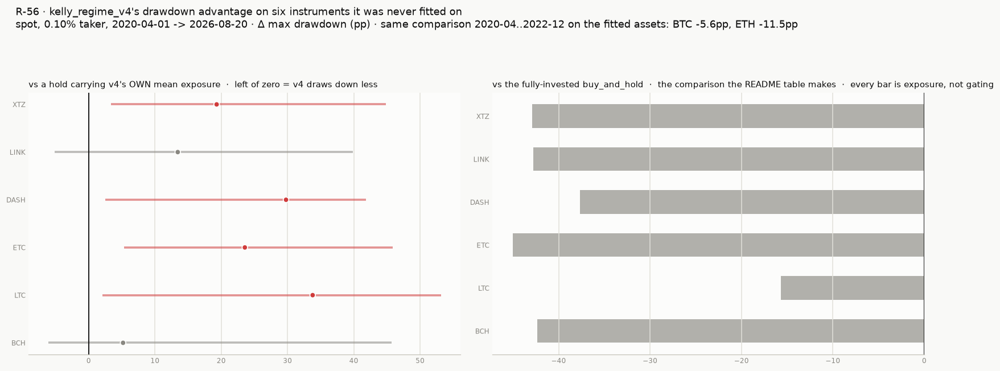

# How strategies are compared — validation & honest caveats

## The comparison protocol

One protocol, one benchmark, applied identically to every registered
strategy:

- **The comparison run.** `tradebot run` backtests every strategy on the
  full 2017–2026 history, on **spot** (1x, 0.10% taker) and **5x
  futures** (0.05% taker), from a **$1,000** start, and ranks by **final
  balance**. The output is the README table and
  [../reports/comparison.md](../reports/comparison.md); CI fails if a
  registered strategy is missing from it.
- **The benchmark is `buy_and_hold` on spot.** Every performance claim
  in this repo is stated against it. Leveraged buy-and-hold is *not* a
  benchmark — it is a stress case: liquidated on the full history and in
  26 of 40 random windows.
- **Point estimates are read as buckets, not a ranking.** Every headline
  carries a paired block-bootstrap interval, a trials-deflated Sharpe
  and a cross-validated selection check (see
  [How much of the comparison table is signal?](#how-much-of-the-comparison-table-is-signal)),
  and the measured **±0.2 Sharpe noise floor** binds any single-path
  comparison.
- **Promotion is decided elsewhere.** A new strategy is judged by the
  pre-registered holdout protocol in [ROUTINE.md](ROUTINE.md) — train
  before 2023, evaluate once against a rule fixed in advance, default
  reject — not by its position in the full-period table.

The rest of this document is the evidence behind that protocol: the
walk-forward split, the intervals and deflation, the Monte Carlo stress
windows, the ETH replication, the harness audit, and funding.

## Walk-forward validation

The comparison table ranks strategies on the **whole** 2017–2026 history.
That single number hides whether an edge is real or an artifact of one
lucky regime, so the leading strategies were re-run on a split:

- **In-sample (IS)**: 2017-01-01 → 2022-12-31 (631k bars) — contains the
  2018 bear (−84%) and the 2022 bear (−77%).
- **Out-of-sample (OOS)**: 2023-01-01 → 2026-08 (380k bars) — a strong
  bull with one ~54% drawdown, and no multi-year bear.

Starting balance $1,000, **futures at 5x**. Each strategy is warmed on
the bars *before* its period (see
[the harness section](#is-the-harness-itself-trustworthy)), so a 100-day
anchor is not handicapped against a zero-warmup benchmark. Reproduce with
`python scripts/experiment.py walkforward`.

| strategy | IS futures | OOS futures | OOS max DD | verdict |
|---|---|---|---|---|
| buy_and_hold | **$18** (liquidated) | **$15.2K** (+1,418%) | 60% | dies in-sample, wins the bull outright |
| `kelly_regime_v4` | $32.9K | $4.9K (+390%) | **33%** | best OOS of the family, lowest OOS drawdown |
| `kelly_regime_v3` | **$33.0K** | $4.5K (+348%) | 39% | promoted |
| `kelly_regime` | $25.5K | $4.2K (+325%) | 41% | the base idea; edge real, regime-dependent |
| `champions_council` | $12.9K | $2.9K (+187%) | **29%** | lower return, lowest drawdown |

## What this actually says

**The regime filter's edge is concentrated in bear markets, and the
out-of-sample split says so bluntly.** In-sample — where the 2018 and 2022
bears exist to be avoided — leveraged buy-and-hold is **liquidated**,
ending at $18, while the regime-gated sizers return $25K–$33K. Reverse the
regime and the result reverses with it: out-of-sample, in an almost
uninterrupted bull with no early crash, leveraged buy-and-hold **beats
every strategy here by a wide margin** (+1,418% against `kelly_regime_v4`'s
+390%), because nothing ever forces it to de-lever and its effective
leverage falls as the account grows.

That is the classic trend-following payoff profile, and it is worth
stating without softening: *this family does not beat holding in a steady
bull. It earns its keep by not being liquidated in the bears — which is
the difference between $18 and $33,000 — and it charges roughly half the
drawdown for that.* Anyone reading the full-period headline as "beats
buy-and-hold" should read this section instead: the full period contains
2018 and 2022, and that is where the entire gap comes from.

**Leverage is where the difference compounds.** On 5x futures,
buy-and-hold is liquidated in the January 2017 crash and ends at $18. The
same market with regime-gated fractional-Kelly sizing ends the full
period at $108K from $1K for the base strategy and $156K for
`kelly_regime_v4`, never liquidating, at Sharpe 1.42–1.59. Position
sizing, not signal cleverness, produces that gap.

**Sizing beats prediction.** Every strategy that makes money over the
decade (the `kelly_regime` family, `champions_council`, `hedge_experts`,
`replicator_book`, `universal_kelly`) is an *allocator* — it decides how
much to hold.
Every pure *predictor* in the suite (MACD/RSI baselines, the flow
followers, the minority-game oracle, the fictitious-play state machine)
loses after fees. On 5-minute BTC, the tradable game-theoretic content is
in growth-optimal sizing and no-regret allocation, not in forecasting the
next bar's sign.

## Parameter honesty

Deliberately **not** the tuned optimum. A sweep of single regime anchors
(raw filter, no volatility targeting) found 50 days best over the full
period ($146K spot vs $66K buy-and-hold), with 200 days at only $6K —
that spread is exactly the sensitivity that signals curve-fitting. So the
shipped strategy votes across **three** anchors, targets **55%
annualized volatility** (BTC's own long-run realized vol, not a swept
value), and caps leverage at **2x**, inside fractional-Kelly practice
(MacLean, Thorp & Ziemba 2010).

Both choices are defensible on the evidence below. Reproduce either table
with `python scripts/experiment.py horizons` / `frontier`.

### The three-anchor vote dominates its own members

Full period, futures 5x, $1,000 start:

| regime anchors | final | Sharpe | max DD | trades |
|---|---|---|---|---|
| 30 days only | $79.4K | 1.31 | 44.9% | 203 |
| 50 days only | $105.5K | 1.38 | 51.1% | 135 |
| 100 days only | $73.2K | 1.27 | 44.9% | 89 |
| 200 days only | $28.5K | 1.04 | 54.4% | 69 |
| **30/50/100 vote (shipped)** | **$108.2K** | **1.42** | **42.6%** | 143 |

The vote beats every individual member on **all three** of return, Sharpe
and drawdown simultaneously. That is a genuine ensemble effect, not a
lucky pick — and it is why the shipped default is the vote even though a
single 50-day anchor is nearly as profitable. (Note also that volatility
targeting compresses the horizon spread from 24x in the raw sweep to
under 4x here: most of the apparent "best lookback" sensitivity was
really uncontrolled risk.)

### The leverage frontier shows the overbetting penalty

Full period, futures 5x, $1,000 start:

| target vol / cap | final | Sharpe | max DD |
|---|---|---|---|
| 0.40 / 1x | $30.4K | 1.38 | 35.5% |
| **0.55 / 2x (shipped)** | **$108.2K** | **1.42** | 42.6% |
| 0.60 / 3x | $174.3K | 1.46 | 48.0% |
| 0.80 / 3x | $312.2K | 1.34 | 57.6% |

Raw return keeps climbing with leverage, but **Sharpe peaks at moderate
sizing and then degrades** — the classic overbetting penalty that
fractional-Kelly practice exists to avoid. The shipped 0.55/2x sits on
the efficient part of the curve; 0.60/3x is the Sharpe optimum for a
risk-tolerant operator; 0.80/3x buys return with a materially worse
risk-adjusted profile and is *not* recommended despite the biggest
headline number. Change these via constructor arguments rather than
editing defaults, so the comparison table stays a stable record.

## How much of the comparison table is signal?

Every number above is a point estimate selected from a search. This
section puts an interval on each one, deflates it by the number of trials
this project has run, and cross-validates the *selection rule* the table
embodies. The decision rules were written into
[LEDGER.md](LEDGER.md#r-29-pre-registration--written-and-committed-before-any-statistic-was-read)
and committed one commit before any of these numbers were read.
Reproduce all of it with `python scripts/inference.py all`; raw rows in
`reports/inference/`.

**Method.** Stationary block bootstrap (Politis & Romano 1994), 30-day
mean block, 2,000 resamples, on **daily** returns — a million
autocorrelated 5m bars is not a million observations. Comparisons are
**paired**: the identical resample is applied to both strategies, so a
draw containing the 2022 bear contains it for both, and the market's own
variance cancels instead of swamping the difference. The holdout is a
fresh $1,000 account from 2023-01-01 (`run_period`), not a slice of the
full run — slicing scores 5x `buy_and_hold` at a flat zero because it was
liquidated back in January 2017, and comparing against a corpse is the
R-22 mistake.

**The machinery is falsified before it is used.** `inference.py selftest`
checks that a strategy against itself returns an interval of exactly
[0.00, 0.00], that `kelly_regime_v4` against `macd_cross` returns an
interval excluding zero (in the committed run: +3.74 [+2.37, +5.03]), and
that the deflated Sharpe **rejects** the best of 50 pure-noise trials
(in the committed run: Sharpe 0.85 by luck alone, DSR 0.637) where the
undeflated probabilistic Sharpe would have certified it.
`tests/test_inference.py` covers the same guarantees on synthetic data
with known answers.

### The ordering is mostly not distinguishable

Testing every **adjacent** pair in the ranking — is each step down real? —
gives **10 of 96** pairs whose 95% paired interval excludes zero:

| period / market | distinguishable adjacent pairs |
|---|---|
| full / spot | 3 of 24 |
| full / futures | 2 of 24 |
| holdout / spot | 4 of 24 |
| holdout / futures | 1 of 24 |

Eight of those ten sit in the losing tail (`universal_kelly` vs
`harsanyi_crowd`, `game_council` vs `minority_oracle`, and so on); the
other two are steps at the boundary of the profitable block —
`champions_council` vs `universal_kelly` on full/futures and
`champions_council` vs `hedge_experts` on the spot holdout. **Not one of
the ten separates two of the table's top eight from each other** — the
leaders, the only part of the table anyone would act on. Read the table
as a set of buckets, not as a rank order.

### Against buy-and-hold, with an interval

`kelly_regime_v4`, paired against `buy_and_hold` on identical resamples:

| period / market | Δ Sharpe | 95% CI | Δ max drawdown | 95% CI |
|---|---|---|---|---|
| full / spot | +0.47 | **[+0.07, +0.87]** | −41.1pp | **[−54.8, −18.4]** |
| holdout / spot | +0.18 | [−0.38, +0.70] | −27.1pp | [−35.8, **+1.9**] |
| holdout / futures | −0.04 | [−0.59, +0.52] | −29.3pp | **[−41.0, −5.0]** |

Bold intervals exclude zero. Three things follow, and none of them is
comfortable:

1. **The drawdown reduction is real on the full history and on the
   futures holdout, and misses on the spot holdout by 1.9 percentage
   points.** One-sided, the probability that v4 draws down deeper than
   holding on the spot holdout is 0.045; two-sided at 95% it is not
   established. The pre-registered rule (C2) required both spot intervals
   to exclude zero, so the claim is downgraded here, in the README and in
   the ledger. R-19's 40-window resample and R-17's ETH replication test
   the same property differently and both stand — **but all three
   measure it against a fully-invested benchmark, and R-33 has since
   shown that 88–92% of the gap is that difference**
   ([below](#the-benchmark-de-levered-what-is-left-of-the-drawdown-finding)).
2. **The return advantage is not established out-of-sample at all.**
3. **By the table's own criterion it is not established in-sample
   either.** The table ranks by final balance; v4's full-period
   log-growth advantage over holding on spot is +0.044, with
   P(beats holding) = **0.52**. A coin flip.

**How wide is that coin flip?** R-29 reported the point and the
probability but not the interval. Adding it (R-30) makes the position
much starker than "0.52" sounds:

| period / market | Δ log growth vs holding | 95% CI |
|---|---|---|
| `kelly_regime_v4`, full / spot | +0.044 | [−2.60, +2.85] |
| `kelly_regime_ev_fast`, full / spot | +0.107 | [−3.08, +3.29] |
| `kelly_regime_v4`, holdout / spot | −0.129 | [−0.94, +0.74] |

An interval of [−2.60, +2.85] in log growth spans everything from ending
with **a thirteenth** of what holding made to ending with **seventeen
times** it. That is the honest width of the table's headline claim over a
decade of 5m bars, and it is why the ranking cannot be read as a ranking.

Run across the whole table, on spot over the full history: **0 of 24
strategies are distinguishably better than `buy_and_hold` on growth**, 13
are distinguishably worse, and the remaining 11 — which is the entire
profitable block — are indistinguishable from it. On the same rows the
drawdown column gives **13 of 24 distinguishably shallower**. The two
columns disagree by construction and that disagreement is the finding:
`kelly_regime_v4`'s ΔSharpe of +0.47 [+0.07, +0.87] *does* exclude zero
while its Δgrowth does not, because Sharpe rewards the volatility the
strategy removes and final balance does not.

### Deflated Sharpe: nothing survives out-of-sample

Bailey & López de Prado (2014), against **190 trials** counted from the
ledger (32 fee-tier configurations, 24 e-process, 9 anchor sets, 7 ladder
widths, 4 volatility estimators, 2 cushion variants, the 25 registered
strategies, and the matched-risk rounds' 36 + 33 + 18 — a floor, not an
estimate. The count was 103 when R-29 first computed this; the three
matched-risk rounds R-31/R-32/R-33 added 87, and the routine's rule that
parallel branches contribute their *total* is why R-31 and R-32 both
count).

The deflated Sharpe depends far more on how *dispersed* the trials were
than on how many there were, and that quantity cannot be recovered after
the fact. So two are reported. At the only dispersion this project has
ever measured (0.223, R-28's 24 configurations → SR\* = 0.61 at 190
trials; it was 0.57 at 103, which is how little the *count* matters):

| | Sharpe | PSR>0 | DSR | min track record needed |
|---|---|---|---|---|
| `kelly_regime_v4`, full spot | 1.44 | 1.000 | **0.996** | 3.7y |
| `kelly_regime_v4`, holdout spot | 1.21 | 0.991 | 0.879 | **7.2y** |
| `buy_and_hold`, holdout spot | 1.03 | 0.976 | 0.787 | 15.4y |

On the full history the leaders clear the 0.95 bar. **On the holdout not
one strategy in the table clears it, and neither does buy-and-hold** —
proving v4's holdout Sharpe against a 190-trial search would need 7.2
years of data like it, and the holdout is 3.6. At the table's own Sharpe
dispersion (2.60) SR\* = 7.13 and everything deflates to zero; that number
is an upper bound on the deflation rather than an estimate, because most
of the table was registered as *documented negative results* rather than
entered as candidates. The column that settles it is `breakeven_sd` in
`reports/inference/deflated.csv`: v4's full-period claim survives any
search whose Sharpe spread is under **0.34** and dies above it.

### Cross-validating the table's own selection rule

The comparison table is a rule — "rank by final balance, take the top" —
and that rule can be cross-validated even though nothing here is fitted.
Combinatorially purged CV (López de Prado 2018): 10 contiguous groups, 2
held out, **45 splits**, 100-day purge and embargo around each test fold,
selecting on the purged training groups and scoring on the held-out ones.

| | spot | futures |
|---|---|---|
| what the rule picks | `kelly_regime_ev_fast` ×22, `buy_and_hold` ×19, v4 ×2, v3 ×2 | `kelly_regime_v4` ×41, v3 ×4 |
| beats holding out-of-fold | **6 of 45** (13%); 19 are ties where it picked holding itself → 6 of 26 contested | 41 of 45, but holding is liquidated and inert in **36 of them** |
| always-`kelly_regime_v4` instead | 44% of folds, median −0.089 log | 91%, median +1.022 log |
| selection shortfall vs hindsight | +0.490 log — the best fold strategy made 63% more than the pick | +0.066 log |
| train→test rank correlation | median 0.72, range −0.70..0.86 | median 0.40, range −0.79..0.74 |

On spot, re-ranking the table inside each fold and holding the winner
**loses to buy-and-hold in most folds**. That is R-12's
28-in-sample/0-out-of-sample result reproduced one level up — at the level
of choosing a strategy rather than tuning a parameter. The futures column
cannot answer the question, because the benchmark is dead in four fifths
of the folds.

### The intervals ship inside the table

Everything above was, until R-30, a document sitting beside a comparison
table that still printed bare point estimates in rank order. A reader who
saw the table and not this file got the confident version. So the
intervals were wired into `tradebot run` itself
(`src/tradebot/evidence.py`): every regeneration of the README table now
reads `reports/inference/bootstrap.csv` and appends two columns — the
paired difference from `buy_and_hold` in log growth and in max drawdown,
each with its 95% interval and a ▲ / ≈ / ▼ verdict. The per-market detail
tables in `reports/comparison.md` carry the Sharpe interval and
P(growth > hold) as well.

Three details are load-bearing rather than cosmetic:

- **The verdict columns are pinned to spot**, whichever market a row's
  balance is bolded in. On 5x futures `buy_and_hold` is liquidated in
  January 2017 and inert for 99.7% of the full period, so seven
  strategies show a growth interval excluding zero *against a corpse*.
  Those never reach the summary table; they appear in the futures detail
  table flagged ☠. This is the R-22 mistake in its natural habitat, and
  the display refuses to make it.
- **The columns sit after the observed numbers**, not among them.
  Everything to their left happened on one path; only they say whether it
  is distinguishable from having done nothing.
- **A registered strategy without a measured interval fails CI**
  (`tests/test_evidence.py`), for both markets and both periods. A new
  row that entered the table as a bare point estimate beside rows
  carrying error bars would read as the *stronger* number, which is the
  reverse of the truth.

The intervals themselves are unchanged from R-29 — the rebuild reproduced
the self-test (+3.74 [+2.37, +5.03]; noise DSR 0.637) and the ordering
counts (3 / 2 / 4 / 1 = 10 of 96) exactly, which is worth knowing about a
pipeline whose whole job is to be trusted.

## Monte Carlo window stress test

A single full-history number cannot separate a robust edge from one lucky
path, so the top three strategies — plus the benchmark and the
structurally different `champions_council` as a control — were resampled
over **40 random windows** (random start, random length drawn from
90–730 days; this run drew 133–681). Each window is preceded by a warmup prefix that warms
indicators **without trading**, so every strategy enters every window
warm, flat and with the full $1,000, and short windows are not penalised
for a cold start. All strategies see identical windows. Reproduce with
`python scripts/stress_test.py --trials 40`; raw rows and the summary are
in `reports/stress/`.

### Spot (1x)

| strategy | median | mean | profitable | beat hold | worst | median DD | worst DD |
|---|---|---|---|---|---|---|---|
| `kelly_regime_v4` | **+82.1%** | +94.6% | 85.0% | 47.5% | **−15.2%** | 23.7% | 43.0% |
| `kelly_regime_v3` | +75.6% | **+97.4%** | 82.5% | 50.0% | −23.6% | 23.3% | 47.2% |
| `kelly_regime_v2` | +64.0% | +85.6% | **87.5%** | 47.5% | −23.7% | **23.1%** | 41.4% |
| `champions_council` | +57.4% | +62.1% | 77.5% | 40.0% | −20.5% | 23.5% | **33.6%** |
| buy_and_hold | +49.3% | +96.6% | 72.5% | — | −50.9% | 52.7% | 84.1% |

The nuance worth stating plainly: the allocators have the **higher
median** but buy-and-hold has a comparable **mean**, and beats them in
about half the windows. That is not a contradiction — the distributions
differ in shape. Holding wins often, by a little, in bull windows (its
best window returned +588% vs +318%); the regime filter wins rarely, by a
lot, in the windows that contain a crash. On spot you are trading away
part of the right tail for a much better typical outcome and a far better
left tail (worst window −15% vs −51%, median drawdown 24% vs 53%).

### Futures (5x) — the decisive case

| strategy | median | profitable | beat hold | worst | worst DD | **liquidated** |
|---|---|---|---|---|---|---|
| `kelly_regime_v4` | **+116.3%** | 85.0% | 65.0% | **−16.5%** | **34.8%** | **0%** |
| `kelly_regime_v3` | +105.6% | 85.0% | 65.0% | −19.7% | 41.8% | **0%** |
| `kelly_regime_v2` | +97.6% | **87.5%** | 65.0% | −27.6% | 39.6% | **0%** |
| `champions_council` | +88.6% | 80.0% | 65.0% | −20.1% | 37.1% | **0%** |
| buy_and_hold | **−98.2%** | 35.0% | — | −98.2% | 99.9% | **65.0%** |

**Leveraged buy-and-hold was liquidated in 26 of 40 windows, and its
median window return is −98.2%** — the median path is a wipeout, not a
disappointment. Every allocator survived **all 40**, stayed profitable in
80–88% of them, and beat holding in 65%. This is the clearest evidence in
the project that the value is in growth-optimal position sizing: same
asset, same windows, same fees — the difference is entirely how much is
held and when.

> These numbers replace an earlier, materially different set. Under the
> old harness strategies traded *through* the warmup prefix, so 19 of
> buy-and-hold's 23 liquidations happened before the measured window even
> opened; those windows then recorded a dead account drifting at 0%,
> which is why its median used to read "exactly 0.0%" and its worst
> drawdown looked *better* than it is. The corrected run makes leveraged
> holding look considerably **worse**, not better. See
> [Is the harness itself trustworthy?](#is-the-harness-itself-trustworthy)

## Does any of this generalize? The ETH falsification test

Every conclusion above rests on BTC 2017–2026. That sounds like 1.01M
observations and is really about **three** independent regime events, so
a filter fitted to those would look identical to one that works. Running
the existing strategy on a second asset is the cheapest experiment that
can tell the difference (ledger row R-17).

### Design

Both series come from the **same venue** (Bitfinex, via
[Zombie-3000/Bitfinex-historical-data](https://github.com/Zombie-3000/Bitfinex-historical-data))
over the **same window**, so period and venue are held constant and only
the asset varies. BTC is the control: the strategy is known to work on
BTC elsewhere, so if the pipeline is sound it should behave sensibly here
too.

- Window: **2016-03-09 → 2019-12-31**, 376,878 5m bars each
- Rebuild with `python scripts/build_bitfinex_dataset.py --source <dir>`
- Covers the 2017 bull and the 2018 bear (BTC −84%, ETH −94%)
- It does **not** cover 2020–2026; that data is not reachable from here

### Result

$1,000 start, 0.10% spot / 0.05% futures fees, no funding.

**Spot (1x):**

| asset | buy & hold | `kelly_regime_v4` | ratio | DD (v4) | DD (hold) |
|---|---|---|---|---|---|
| BTC *(control)* | $17,477 | $10,174 | **0.58x** | **40.1%** | 83.8% |
| ETH *(test)* | $11,550 | $5,482 | **0.47x** | **36.5%** | 94.2% |

**Futures (5x):**

| asset | buy & hold | `kelly_regime_v4` | ratio | DD (v4) | DD (hold) |
|---|---|---|---|---|---|
| BTC *(control)* | $83,264 | $21,536 | 0.26x | **32.1%** | 85.2% |
| ETH *(test)* | **$18** (liquidated) | $4,263 | **236x** | **35.1%** | 99.3% |

### What it says

**The risk property transfers; the return property does not exist.** In
all four cells the strategy roughly halves-to-thirds the drawdown — BTC
83.8%→40.1%, ETH 94.2%→36.5%, and on leverage 85.2%→32.1% and
99.3%→35.1%. That is the same finding the BTC-only work reached from a
completely different direction, now replicated on a second asset. It is
the strongest evidence in this project that the mechanism is real rather
than fitted.

**On return it loses to holding on both assets on spot**, 0.58x and
0.47x. Consistent with everything else here: there is no return alpha,
on either asset.

**The one cell where it wins enormously is the one where holding died.**
Leveraged ETH buy-and-hold was liquidated to $18 in the 2018 bear; the
strategy finished at $4,263. That is not a 236x edge, it is the
difference between surviving and not — the same claim as the BTC stress
test above (holding liquidated in 26 of 40 windows), reproduced on a
second asset.

**And the control behaves as it should.** Leveraged BTC holding *survived*
this particular window and beat the strategy 0.26x, because a position
opened in early 2016 had multiplied enough before the 2018 bear that a
84% fall no longer reached its liquidation price. Same strategy, same
period, different asset, opposite outcome — which is exactly how much a
single path is worth, and why the ETH cell should not be quoted as a 236x
edge either.

### Verdict

The sample-size objection is **partly answered**. The drawdown reduction
is not BTC-specific, which was the thing most at risk of being an
artifact. The absence of return alpha is also not BTC-specific.

What remains unanswered: this window shares the 2018 bear with the main
dataset, so the two tests are not fully independent, and 2020–2026 ETH
was not reachable. A second bear on a second asset in a *different*
period is still the missing experiment (backlog item B-08 in
[LEDGER.md](LEDGER.md)) — since answered by R-47, which found the
drawdown property replicating on ETH's own 2022 bear while the return
edge died at the 0.40% tier.

> 🚨 **"Not BTC-specific" was measured on one other asset, and R-57
> measured it on six more.** The claim in the verdict above — the
> drawdown reduction transfers — holds against a *fully-invested*
> benchmark on every asset tried, BCH, LTC, ETC, DASH, LINK and XTZ
> included. Against a benchmark carrying the strategy's **own exposure**
> it holds on BTC and ETH and **inverts on all six others**. The
> measurement is [the next section](#six-instruments-it-was-never-fitted-on-the-cross-asset-panel).

> ⚠️ **And one more, raised after R-31 and answered by R-33.** Every
> drawdown comparison on this page — including this one — is against a
> **fully-invested** `buy_and_hold`, while the strategy holds
> substantially less. R-31 showed that exactly this mismatch turned a
> risk-level difference into what looked like a mechanism finding for the
> e-process gate. R-33 ran the same test on `kelly_regime_v4` and the
> answer is that **88–92% of the drawdown gap is the exposure level**.
> Read every "cuts drawdown versus holding" figure on this page with that
> attached; the measurement is
> [below](#the-benchmark-de-levered-what-is-left-of-the-drawdown-finding).

## Six instruments it was never fitted on — the cross-asset panel

The ETH test above, and R-47's 2020–2026 follow-up, are both **n=1
asset**, and one of the two assets in this project's evidence base is the
one the strategy was fitted on. That cannot distinguish a mechanism from a
calibration. R-57 fetched six further Coinbase USD 5-minute series and ran
the **frozen, byte-identical** `kelly_regime_v4` on all of them.

### Design

- Panel: **BCH, LTC, ETC, DASH, LINK, XTZ**, 2020-01-01 → 2026-08-20,
  selected by a mechanical liquidity rule fixed before any backtest (three
  fixed 2020 probe days, ranked by dollar volume, then a continuity and
  coverage gate that excludes XRP's 905-day Coinbase suspension). Rebuild
  with `python scripts/fetch_coinbase_panel.py --products BCH-USD …`.
- Measured window 2020-04-01 → end, so the 80-day warmup comes from bars
  *before* the period (R-22). Zero parameters changed, nothing swept.
- Three arms per cell: the strategy, the fully-invested `buy_and_hold`,
  and a passive long holding **v4's own mean notional** — the R-33 matched
  arm. Decision rules pre-registered and committed two commits ahead of
  the first backtest ([LEDGER.md](LEDGER.md), "R-57 pre-registration").
- Reproduce: `python experiments/r57_cross_asset_panel.py run` and
  `… control`. Cells in `reports/cross_asset_panel/`.

### Result — spot, 0.10% taker, 2020-04-01 → 2026-08-20

| asset | v4 max DD | matched hold DD | Δ DD (pp, + = v4 worse) | 95% paired interval | vs fully-invested hold |
|---|---|---|---|---|---|
| BCH | 52.3% | 47.5% | +5.2 | [−6.1, +45.7] | −42.4pp |
| LTC | 74.7% | 42.5% | **+33.8** | [+2.1, +53.1] | −15.7pp |
| ETC | 51.3% | 29.5% | **+23.6** | [+5.3, +45.9] | −45.0pp |
| DASH | 58.7% | 29.7% | **+29.8** | [+2.5, +41.8] | −37.6pp |
| LINK | 47.8% | 38.1% | +13.4 | [−5.1, +39.8] | −42.8pp |
| XTZ | 55.0% | 35.4% | **+19.3** | [+3.3, +44.8] | −42.9pp |

**Six of six against the fully-invested benchmark. Zero of six against
the matched one**, with four intervals excluding zero, all four against
the strategy. Same assets, same runs, opposite conclusions — which is what
the exposure artifact looks like when it is measured rather than assumed.

### Is it the assets, or the period?

The same comparison over a window every asset shares, truncated at
2022-12-31 so no holdout bar is read:

| asset | Δ DD (pp) | 95% interval |
|---|---|---|
| **BTC** | **−5.6** | [−20.0, +16.4] |
| **ETH** | **−11.5** | [−17.3, +19.6] |
| BCH / LTC / ETC / DASH / LINK / XTZ | +6.0 / +0.0 / +15.4 / +17.1 / +14.5 / +11.6 | — |

**2 of 8, and they are exactly the two assets this project has always
measured on.** The property is asset-specific, not period-specific.

### The other two claims, on the same panel

- **Return at the real fee tier** (the pre-registered falsification test):
  v4 beats holding at 0.40% on **2 of 6**, and both are assets where
  holding lost 51% and 87% — cleared by holding less, not by trading
  well. Predicted to fail before the run, and it failed.
- **Return per unit of risk**, the claim R-36 pre-registered and confirmed
  on BTC: v4 out-returns the matched hold on **1 of 6** (every growth
  interval contains zero) and **0 of 6** on the equal-volatility axis.

### Verdict

The sample-size objection is answered in the direction nobody wanted.
`kelly_regime_v4` is not a general regime-sizing mechanism whose drawdown
property travels; it is a mechanism whose measured scope is **BTC and
ETH**. Nothing already recorded is retracted — R-33 had established that
88–92% of the headline gap was exposure, and R-17/R-47's ETH numbers
reproduce here — but the scope of what those rounds left standing is now
measured instead of assumed. Full write-up:
`experiments/reports/r57_cross_asset_panel_report.md`.

## Comparing at matched risk, and what it costs a finding

Two strategies at different exposure levels cannot be compared on return
or on drawdown, because both quantities scale with exposure. Every
comparison in this document that holds exposure fixed is fine; the one
that did not was the e-process round (ledger R-28), which measured a
regime gate that — correctly calibrated — justified only **0.27x** the
incumbent's mean notional, and then reported that it drew down less. That
is arithmetic, not evidence.

Ledger row **R-31** re-ran it controlled. One strategy class
(`experiments/matched_risk.py`) with one sizer, one deadband, one warmup
and one exposure knob; the only thing that varies is which quantity opens
the gate — the incumbent's latched 20/40/80-day anchor vote, or the
e-process's accumulated betting evidence. The exposure knob `k` scales
`target_vol`, `max_leverage` and `deadband` together, which rescales the
position exactly and changes nothing about its timing. Exposures were
solved on inner-validation to within 2% of a target realized volatility,
in both directions (lever the e-process up to the vote; de-lever the vote
down to the e-process), and frozen before the holdout was read.

**The equal-risk exposure ratio is itself regime-dependent.** Matching
the vote's realized volatility on spot needs the e-process at k=2.16 over
2017–2020 and k=4.70 over 2021–2022 — it shuts down hardest exactly when
the vote does not. Which is why the frozen exposures had to be checked
rather than assumed on the holdout, and why three of four cells failed:

| cell | vote vol | e-process vol | gap | max clamp | verdict |
|---|---|---|---|---|---|
| spot / match-up | 0.315 | 0.306 | 2.6% | **41.0%** | void — spot's 1.0-notional cap truncates both arms differently |
| spot / match-down | 0.104 | 0.140 | **29.9%** | 1.3% | void — the risk match did not survive out of sample |
| futures / match-up | 0.394 | 0.527 | **29.0%** | 0.0% | void — same |
| futures / match-down | 0.153 | 0.153 | 0.2% | 0.0% | **valid** |

### At matched risk the two gates are indistinguishable

Paired stationary block bootstrap on the 2023+ holdout — same method as
above, 30-day blocks, 2,000 resamples, identical resamples for both arms,
1,319 daily observations:

| cell | Δ log growth (e-process − vote) | 95% CI | Δ max DD | 95% CI |
|---|---|---|---|---|
| spot / match-up *(void)* | +0.131 | [−0.400, +0.691] | −4.7pp | [−19.9, +7.1] |
| spot / match-down *(void)* | +0.030 | [−0.300, +0.463] | +1.7pp | [−6.3, +9.6] |
| futures / match-up *(void)* | −0.125 | [−1.307, +1.441] | +7.3pp | [−14.2, +27.0] |
| **futures / match-down (valid)** | **−0.072** | **[−0.532, +0.379]** | **−1.9pp** | **[−13.4, +5.4]** |

Eight intervals, eight containing zero, and the sign is not stable across
cells. Whatever separates an anytime-valid evidence gate from a latched
moving-average vote, this dataset cannot see it once they carry the same
risk.

### The ETH replication was a risk-level artifact

This is the part worth carrying forward. R-28's falsification test
reported that the e-process cut ETH's spot drawdown to **19.5%** against
`kelly_regime_v4`'s 36.5% — the drawdown property replicating on a second
asset, which is the strongest form of evidence this project has. R-31
reproduces that 19.5% exactly. But it was measured against an arm
carrying **2.4x** the volatility. Re-match the exposures on ETH's own
volatility and the ordering **reverses in all four cells**:

| ETH cell | matched vol | vote | e-process | Δ DD |
|---|---|---|---|---|
| spot / match-up | 0.377 | $5,186 (DD **36.3%**) | $4,010 (DD 40.0%) | +3.7pp |
| spot / match-down | 0.171 | $2,379 (DD **17.1%**) | $1,944 (DD 19.5%) | +2.4pp |
| futures / match-up | 0.428 | $7,330 (DD **36.1%**) | $3,565 (DD 53.2%) | +17.1pp |
| futures / match-down | 0.232 | $2,345 (DD **27.6%**) | $2,079 (DD 36.9%) | +9.3pp |

The BTC control over the same window keeps the e-process ahead on
drawdown by 5–10pp, as it is everywhere on BTC. So the mechanism's risk
advantage is BTC-specific after all, which is precisely the artifact the
ETH test exists to catch.

The 40-window resample says the same thing from a third direction: R-28's
"deeper than `kelly_regime_v4` in **0 of 40** windows" becomes deeper in
**45–82%** of the same windows once the e-process arm carries comparable
exposure.

**The general rule this establishes**, and the reason the section exists:
*a risk-reduction claim is only a claim about the mechanism if the
comparison is made at equal risk.* Reproduce all of it with
`python experiments/run_matched_risk.py {parity,frontier,match,holdout,interval,eth,costs,windows}`;
raw rows in `reports/matched_risk/`.

**A methodological note that cost nothing and saved the round.** The
pre-registration in [LEDGER.md](LEDGER.md) fixed a *validity gate* — the
two arms' holdout volatilities within 20% of each other and neither
pinned against the market's notional cap — before any result was read.
Without it the headline would have been spot / match-up, where the
e-process arm beats the incumbent's gate on return, drawdown and fees at
once. That cell is void because 41% and 27% of its bars are clamped at
spot's 1.0-notional ceiling, so the two arms are not running the same
sizer. It is the most flattering number in the round and it is not a
result.

### And what is a gate worth at all? The ungated control

A second session ran B-11 in parallel the same day, from the same base
commit and without sight of the first (ledger row **R-32**). It agrees
with everything above from an independent implementation — the two gates
indistinguishable at matched risk, the 0-of-40 windows inverting to
60%/62%, the fee advantage inverting, P1 failing — and its own holdout
cells are **void under the validity gate quoted above**, which is worth
knowing: the rule catches a second round it was not written for.

What it adds is a third arm neither B-11 nor R-31 asked for: **no gate at
all**, pure inverse-volatility targeting, run at matched risk against the
other two. On the inner splits, matched within each split rather than
frozen across one, the ungated arm sits below both gated arms at **every
overlapping risk level in all four cells**. The futures cells are the
clean ones, since the 5x notional cap never binds there:

| matched realized vol | `none` | `vote` | `evidence` |
|---|---|---|---|
| inner-train futures, 0.30 | 1.94 | **2.52** | 2.19 |
| inner-train futures, 0.95 | 3.35 | **5.79** | 5.34 |
| inner-validation futures, 0.21 | −0.12 | **+0.10** | −0.06 |
| inner-validation futures, 0.42 | −0.42 | −0.08 | **−0.02** |

_log growth at matched risk; spot agrees and carries the notional-cap caveat._

Paired over 40 identical random windows carrying the frozen exposures, on
spot the vote gate returns a median **+20.0pp** more than not gating **and**
draws down **6.2pp** less — better on both axes in 80% and 88% of windows —
and **+43.2pp** in 90% of them on futures. The holdout intervals for the
same comparison contain zero, and that cell is void besides, so this is
evidence about direction and magnitude rather than a certified interval.

Taken with the rest of the section: **the gate is worth more than the
choice of gate.** Which quantity opens it — a latched price vote or an
anytime-valid e-process — is not distinguishable; having one is worth
about 20 percentage points of window return at the same risk. Reproduce
with `python experiments/run_gate_control.py {frontier,match,holdout,inference,eth,costs,windows,chart}`;
chart and raw window rows in `reports/gate_control/`.

### The benchmark, de-levered: what is left of the drawdown finding

The argument that retired R-28's risk claim applies verbatim to this
project's own headline, and R-33 (backlog **B-13**) ran it. Every
drawdown figure above compares `kelly_regime_v4` — mean notional
**0.28–0.43**, flat on **29–44%** of bars — against a
**fully-invested** `buy_and_hold`. The control is a passive long holding
a constant fraction `c` of equity, de-levered until its realized
volatility equals v4's: no gate, no forecast, no volatility estimate,
nothing to time with.

**The cleanest instrument first**, because it is 40 paths rather than
one. Both B-11 branches had to caveat their window tables with "exposures
frozen rather than re-matched per window"; that is avoidable for a
constant-exposure arm, whose realized volatility is proportional to `c`
to better than 1%, so one probe backtest per window matches v4 *inside
that window*. Achieved median |volatility gap| **0.51%** on spot and
**0.53%** on futures:

| paired, 40 identical windows | Δ median return | v4 higher in | Δ median max DD | v4 **deeper** in |
|---|---|---|---|---|
| v4 − `buy_and_hold`, spot | −9.1pp | 42% | **−24.5pp** | **0%** |
| v4 − matched passive hold, spot | **+20.8pp** | **82%** | −2.9pp | 22% |
| v4 − `buy_and_hold`, futures | +93.3pp | 57% | **−70.7pp** | **0%** |
| v4 − matched passive hold, futures | **+23.8pp** | **90%** | −5.5pp | 15% |

Hold risk fixed and the median drawdown advantage falls from −24.5pp to
**−2.9pp** on spot and from −70.7pp to **−5.5pp** on futures. **88% and
92% of the gap was the exposure level**, not the gate.

**On the holdout it cannot be resolved at all.** Five of six
pre-registered cells fail their validity gate, for a reason that
generalizes: a volatility-targeting strategy holds its realized
volatility roughly constant across regimes while a constant-exposure
hold's tracks the market's, and the market's fell ~43% from 2021–22 to
2023+, so an exposure frozen on the earlier period delivers about half
the intended risk in the later one. The one valid cell gives Δ max
drawdown **−14.18pp [−22.68, +13.48]**, containing zero. Re-solving the
exposure on the holdout itself — *not* pre-registered, and therefore
in-sample — matches to within 1.7% and gives −12.6 to −17.5pp across four
cells, every interval containing zero.

Per the rule fixed in advance: **"regime-gated sizing cuts drawdown" is
established against a fully-invested benchmark, and is not established
against a de-levered one.** The −41.1pp [−54.8, −18.4] above is unchanged
and still excludes zero; what changed is what it is a statement about.

**What survives matching is a different claim, and it is the better
one.** In every cell of every table in that round — 82–90% of the 40
windows, all four ETH/BTC falsification cells, and every holdout cell
valid or void — v4 out-*returns* the equal-risk passive hold. On ETH,
where R-28's e-process gate reversed on drawdown once its risk was
matched, v4 keeps both: **$5,482 at 36.5% drawdown against $3,827 at
51.3%** on spot at volatility 0.407, and $4,263 at 35.1% against $3,900
at 54.0% on futures. That is a falsification test passed, not a selected
number — but the *return* comparison was never the pre-registered
question in any round, so at this point in the record it was a
hypothesis (backlog **B-14**) and not yet a result.

**R-36 closed B-14, and it is a confirmation with a large asterisk.** The
pooled statistic above was pre-registered as a formal decision rule (exact
binomial 95% CI on the 40-window win-rate) rather than eyeballed, and it
passes on both markets: [67.2%, 92.7%] spot, [76.3%, 97.2%] futures, both
excluding a coin flip. The pre-registered falsification test — split the
same 40 windows by start date, before vs on/after 2021-01-01 — also
survives on both markets. But the honest number is the split, not the
pool: the median advantage **shrinks roughly 10x** once the 2017–2020
bull is excluded, from +68.9pp/+97.2pp (pre-2021 windows) to
**+5.0pp/+7.4pp** (post-2021 windows), and the post-2021 spot subsample's
own interval, at n=22, still contains 50% on its own. Read together: some
return-per-unit-of-risk advantage generalizes past the bull that produced
the headline number, but the headline number itself is substantially a
bull-period effect, in the same spirit — though a smaller one — as the
drawdown headline being substantially an exposure-level effect.

**R-37 then asked whether a strategy could be built to capture more of
that thinned, confirmed edge than v4 already does by construction, and
found nothing that survives its own falsification test.** Two
independent, disjoint-file attempts, both restricted to inner-train/
inner-validation/pre-2020-ETH data with no holdout read: a conservative
retune of the existing `target_vol`/`max_leverage` constants (the one
candidate surviving a matched-exposure control nets a Sharpe delta inside
the ±0.2 noise floor on both markets), and a novel per-vote-state Kelly
fraction sizer (`μ_state/σ_state²` estimated causally per regime state,
rather than one global `target_vol`) that cleanly rules out a
raw-leverage artifact and surfaces a real, non-monotone fact about this
project's own regime states — partial agreement (⅔) carries a higher
measured Kelly ratio than unanimous agreement — but fails its ETH
falsification test decisively, underperforming v4 on the BTC control run
through the identical pipeline as well as on ETH itself, indicating the
inner-validation win was fitted to one window. Full detail in
[docs/LEDGER.md](docs/LEDGER.md) (R-37); code in
`experiments/kelly_regime_v6_retune.py` and
`experiments/kelly_regime_v6_state_kelly.py`.

One diagnostic from the same round that belongs next to every spot figure
on this page: **on the 2023+ spot holdout `kelly_regime_v4` asks for more
than 1.0 notional on 40.7% of bars.** Four bars in ten, spot's cap and
not the strategy is setting the position. R-31 reports 41.0% for an
independent reconstruction of the same gate over the same period.

Reproduce with
`python experiments/run_matched_hold.py {frontier,match,insplit,causality,holdout,interval,rematch,eth,costs,windows}`;
frozen exposures and raw rows in `reports/matched_hold/`.

## Does the starting balance matter?

Almost never, which is why the framework now defaults to a single $1,000
start. Across the twenty strategies registered at the time of the
measurement (R-23; before the `kelly_regime` variants were added), on
both markets, comparing a $1,000 run with a $1,000,000 run:

- **15 of 40** strategy-market pairs returned percentages identical to
  within 0.01pp — e.g. `kelly_regime` ended at $42,096 and $42,096,000.
- **2 of 40** differed by more than 1pp, both of them `universal_kelly`.
- The remaining ~0.5pp gaps were all *already-dead* strategies showing
  −99.5% at $1K versus −100% at $1M.

Every difference traces to the **$5 minimum order notional**, not to any
property of the strategy:

- A $1,000 account that has fallen to ~$5 can no longer place a legal
  order, so it *freezes* just above zero; a $1M account grinds all the way
  down. The small account is saved by the floor, not by skill.
- `universal_kelly` rebalances in tiny increments. On a $1K account most
  of those fall under the $5 minimum and are skipped, which accidentally
  saves fees (20 trades and +22.7% on futures, versus 3,047 trades and
  +0.4% at $1M). That is a real capital-scaling effect worth knowing, but
  it is a statement about minimum order size, not about edge.

Run `tradebot run --balances 1000 1000000` to reproduce; the comparison
table flags any strategy whose return moves more than 1pp with account
size.

## Beta testing the variants

Research rounds on the leading strategy (ML/DL and game theory, see
[RESEARCH.md](RESEARCH.md#improving-the-best-strategy)) produced three
registered variants and a longer list of failures. The failures are the
more useful half and are recorded there: a walk-forward statistical jump
model, Bayesian online changepoint detection, meta-labeling with a
walk-forward logistic model, and — the counterintuitive one — a
*genuinely better* volatility forecast, which made the strategy worse.

Not one of the three that worked is a new detector. They change how the
existing signal maps to exposure: a convex vote response (v2), conditional
volatility targeting (v3), and a faster anchor ladder (v4). That is the
same lesson the comparison table teaches at the suite level — sizing
beats prediction — reappearing inside a single strategy.

Run `python scripts/beta_test.py --windows 24` to reproduce. Futures 5x,
$1,000 start. **All three variants in one table**, since they were
measured on identical splits and identical Monte Carlo windows:

| metric | `kelly_regime` | `kelly_regime_v2` | `kelly_regime_v3` | `kelly_regime_v4` |
|---|---|---|---|---|
| full period | $108,221 | $121,993 | $139,509 | **$156,170** |
| Sharpe | 1.42 | 1.49 | 1.55 | **1.59** |
| max drawdown | 42.6% | 39.6% | 41.8% | **35.3%** |
| trades | **143** | 113 | 147 | 174 |
| in-sample (2017–22) | $25,486 | $30,737 | **$32,971** | $32,925 |
| **out-of-sample (2023–26)** | $4,246 | $3,969 | $4,481 | **$4,901** |
| Monte Carlo median window | +49.7% | +54.6% | +64.3% | **+67.2%** |
| Monte Carlo worst window | −30.5% | −22.4% | −28.8% | **−21.1%** |
| Monte Carlo median drawdown | 32.7% | 29.4% | 26.8% | **23.9%** |
| windows beating the baseline | — | 62.5% | **75.0%** | **75.0%** |
| liquidations | 0% | 0% | 0% | 0% |
| **verdict** | incumbent | no better (fails: oos) | **PROMOTE** | **PROMOTE** |

> The out-of-sample and Monte Carlo rows are ~75% higher than an earlier
> published version of this table, because the split now warms each
> strategy on the bars before the period instead of leaving a 100-day
> anchor flat through the first 7.6% of it. **The verdicts did not
> change** — v2 still fails out-of-sample, v3 and v4 still promote —
> which is the useful part: the promotion decisions were robust to a bias
> that moved the underlying numbers a great deal.

### `kelly_regime_v2` — nine of ten metrics improve, and it still fails

The promotion rule requires a candidate to beat the incumbent on the full
period, *not degrade out-of-sample*, and win the median Monte Carlo
window. v2 lands **6.5% below** on out-of-sample final balance, so the
harness reports "no better (fails: oos)". It is kept registered and
appears in the comparison table, with the caveat stated rather than
buried.

Reading it honestly: the out-of-sample shortfall is well inside the
**±0.2 Sharpe noise floor** measured by paired stationary block bootstrap
(30-day blocks, 2,000 resamples) — a single 3.6-year path cannot resolve
a 6.5% difference. The research predicted this exact pattern in advance:
shrinking partial-agreement states costs return in a market that sits at
two-thirds agreement while drifting up, which describes 2023–2026. What
argues for the change is not any single number but that return, Sharpe,
drawdown, turnover, the Monte Carlo median *and* the Monte Carlo left
tail all move the right way together, with the effect a plateau across
gamma ∈ [1.25, 4.0] rather than a spike at one tuned value — the opposite
of the overfitting signature.

`kelly_regime` keeps `vote_gamma=1.0` as its default, so the incumbent's
published record is unchanged; v2 is a separate registered strategy.

### `kelly_regime_v3` — the first to earn promotion

The sizing half of the research produced the clear winner. Instead of
re-sizing continuously, it holds a **constant notional through normal
volatility** and switches to full inverse-volatility sizing only when
volatility breaks out (high or low), latching that state until it
retraces — the same hysteresis the regime gate uses, applied to risk.

It improves **every** metric in the table above, in both sub-periods and
on both markets, and the harness promotes it. The parameter neighbourhood
is flat (eight threshold combinations land at Sharpe 1.47–1.55) and it
survives a 20bps slippage stress at Sharpe 1.42 — matching the
*frictionless* incumbent.

### `kelly_regime_v4` — promoted, with the return claim withheld

v3 on a doubling anchor ladder (20/40/80 days instead of 30/50/100), each
anchor covering twice the horizon below it — the multi-timescale prior of
Müller et al. (1997) and Corsi's (2009) HAR model, chosen for its
structure rather than fitted. It leads on nine of the eleven metrics
above, including the best out-of-sample balance, the shallowest full-period
drawdown (35.3%), the shallowest out-of-sample drawdown (33%), and the
best Monte Carlo left tail.

**What the evidence supports is narrower than the headline.** Across nine
anchor sets in the 18–28 day range, *every* variant cut max drawdown to
35–39% from v3's 41.8%, and seven of nine scored Sharpe ≥ 1.52 — the
**drawdown reduction is the robust finding**. The Sharpe spread over that
same plateau (1.52–1.60) sits inside the ±0.2 noise floor, so the return
improvement is **not** established by this path, and the $156K headline
should be read as "did not get worse" rather than "is better". Below ~18
days the plateau breaks sharply (16/32/64 scores 1.46), which is what
makes this a region rather than a peak that was tuned to.

Note also that v3 and v4 are within 0.15% of each other in-sample
($32,971 vs $32,925); the entire separation is out-of-sample and in the
tails.

### Why it works: BTC has an inverse leverage effect

This is the most useful thing the research turned up, and it inverts the
textbook. Forward 5-day Sharpe by lagged-volatility quintile, measured on
this data:

| sample | Q1 (low vol) | Q2 | Q3 | Q4 | Q5 (high vol) |
|---|---|---|---|---|---|
| all bars | +0.82 | −0.12 | +0.57 | +0.64 | **+1.08** |
| gate bullish | +1.76 | +0.41 | +1.57 | +1.23 | **+2.06** |

**High volatility forecasts the *highest* forward Sharpe in BTC**, the
opposite of equities — consistent with Baur & Dimpfl (2018, Economics
Letters 173), who find positive shocks raise crypto volatility more than
negative ones. So Moreira & Muir's (2017, J. Finance) volatility-managed
alpha, which requires high volatility to forecast *low* returns, is
absent-to-inverted here. Continuous targeting de-levers into precisely
the best states; conditional targeting (Bongaerts, Kang & van Dijk 2020,
FAJ 76(4)) keeps Harvey et al.'s (2018) mechanical tail protection and
discards the part that fights the asset.

**Corollary, and it is counterintuitive: better volatility *forecasting*
makes this strategy worse.** A timescale blend that beats the incumbent
estimator by 8% on QLIKE — a genuinely better forecast — returns **$52K
instead of $115K** when plugged in, because it de-levers more promptly
into the high-Sharpe states. The incumbent's 8-day span is not merely
adequate; part of its value is that it is *sluggish*.

Two further negative results worth recording: range-based estimators
(Parkinson, Garman-Klass, Rogers-Satchell, Yang-Zhang) read **7–18% low**
on 5m bars from discretisation bias, so a drop-in swap silently raises
effective leverage and invalidates the `target_vol` calibration; and
their textbook 5–8x efficiency advantage does not transfer, because it is
measured against a *daily close-to-close* estimator while the incumbent
already averages 288 squared returns per day.

### A leak the old tests would have missed

The same round found that a daily-aggregated signal broadcast onto every
5-minute bar of the *same* day leaks that entire day of future — worth
**+2.1 Sharpe** in a prototype (3.09 vs 0.99 once lagged correctly). Such
a signal **passes** the truncation test, because truncating the tail does
not change earlier rows. `tests/test_causality_real.py` now also perturbs
future bars (×3 on prices, ×7 on volume) and asserts every prepared
column before the cut is bit-identical, which catches it directly. Every
registered strategy passes.

That was the first of two blind spots. The second — lookahead hidden
inside `on_bar` rather than `prepare`, which this test cannot see — is in
the next section.

## Is the harness itself trustworthy?

Every number above is only as good as the engine that produced it, so the
engine and the test suite were audited adversarially — by **injecting
deliberate bugs and checking whether the suite noticed**. 26 mutants were
planted across the engine, broker, metrics, data loader and strategies.

**20 were caught. Six were completely silent**, and five more were held
by a single assertion each. All are now fixed or covered:

| silent bug | what it would have done | now caught by |
|---|---|---|
| liquidation checked on the **close** instead of the bar's high/low | wicks never liquidate → every leveraged result overstated | `test_intrabar_wick_liquidates_even_when_the_close_recovers` |
| a strategy reading bar `i+1` inside `on_bar` | **perfect foresight**; the prototype returned $3.7e23 from $1,000 at Sharpe 73 with a fully green suite | `test_decisions_ignore_every_bar_after_the_decision_bar` |
| `(1 + mm)` divisor dropped from the **short** liquidation price | every short on 5x futures mis-priced | `test_liquidation_price_short`, `test_short_liquidation_triggers_on_the_bar_high` |
| `REBALANCE_DEADBAND` widened 10x | silently changes turnover, fees and every published balance | `test_rebalance_deadband_threshold_is_exact` |
| Sharpe annualization factor removed | every Sharpe ~324x too small, still "looks like a number" | `test_sharpe_is_annualized_to_5m_bars` |
| epoch-unit detection thresholds shifted | timestamps silently mis-parsed | `tests/test_data.py::test_load_epoch_units` and the round-trip tests |

Two structural problems mattered more than any single mutant:

**The causality guarantee only covered `prepare()`.** A strategy that
keeps the frame handed to `prepare()` and indexes `i + 1` inside `on_bar`
passed the truncation test, the future-bar perturbation test, *and* live
parity. `tests/test_causality_strict.py` now compares the **orders** a
strategy queues under two opposite tampers of the future, which catches
it — and a self-check in that file asserts the detector still detects a
deliberate peek, so the guard cannot rot into a no-op.

**Much of the coverage was vacuous.** 16 of 22 strategies placed *zero*
orders in the 2,000-bar synthetic truncation fixture and 18 of 22 placed
zero in the 1,200-bar live-parity fixture, so those parametrized tests
were asserting `[] == []` for most of the suite — 12 strategies had no
effective truncation coverage anywhere. The truncation test now runs on
the real slice for **every** registered strategy, live parity is checked
on real data with every strategy warm, and
`test_every_strategy_actually_trades_on_the_real_slice` fails loudly if a
strategy ever goes inert again. `tests/test_causality_real.py` also now
**fails** rather than skips when the dataset is missing — a skipped
causality suite is a green run that guarantees nothing.

**Determinism is clean.** Repeated full runs, reversed test order, and
per-file isolation all produce identical results; all RNG is seeded, and
nothing depends on wall-clock or network.

### Two measurement biases found, and what they changed

**1. Stress-test windows scored corpses.** Each Monte Carlo window is
preceded by a 100-day warmup prefix, and strategies were *trading*
through that prefix. On 5x futures, buy-and-hold was liquidated in 23 of
40 windows — but **19 of those 23 liquidations happened inside the
prefix**, before the measured window opened. The window then recorded a
dead account drifting at 0%, which is why its median window return was
"exactly 0.0%".

`run_backtest(..., trade_start=N)` fixes it: bars before `N` still call
`on_bar`, so indicators and internal state warm normally, but their
orders are discarded — every window now opens **flat, warm, with the full
$1,000**.

The correction runs *against* the strategies this repo favours in one
sense and hard against the benchmark in another. Leveraged buy-and-hold
gets worse: 26 of 40 windows liquidated instead of 23, median −98.2%
instead of 0.0%, worst drawdown 99.9% instead of 99.5% — because a fresh
5x position is now actually opened inside each window rather than
inherited already-dead. The allocators' numbers barely move, since none
of them was ever liquidated in a prefix. The lesson is not that the old
conclusion was wrong; it is that it was **right for a reason that was
partly an artifact**, which is the more dangerous failure.

**2. The out-of-sample split handicapped the strategies being tested.**
`df.loc["2023-01-01":]` gives a 100-day-warmup strategy no history, so it
sat flat for the first **7.6% of the out-of-sample period** while
zero-warmup buy-and-hold traded from day one. `tradebot.window.run_period`
now takes the warmup from the bars *before* the period and starts
measuring at the period boundary, so every walk-forward comparison is
warm-vs-warm.

Neither bias was in the backtest engine's own accounting — the full-period
comparison table is unaffected — but both were in the evidence used to
argue that the leaders are robust, which is exactly where a bias does the
most damage.

## Funding: the cost that was missing, and what it does

Every futures figure above was originally computed on a **funding-free
perp**, which is not a real instrument. Perpetuals settle funding every 8
hours, charged on notional. Real Binance BTCUSDT funding is now committed
(`data/btcusdt_perp_funding_8h.csv.gz`, 4,383 settlements, 2020–2023) and
charged as a first-class cost by the engine. Reproduce with
`python scripts/funding_study.py all`.

**The rate is a persistent tax, not noise.** Positive at **86.5%** of
settlements, costing a constant long **+14.97% a year**: +17.2% in 2020,
**+30.6% in 2021**, +4.2% in 2022, +7.9% in 2023.

### Measured, 2020–2023 (funding observed, not assumed)

| strategy | funding-free | with funding | cost |
|---|---|---|---|
| `kelly_regime_v4` | $10,584 | **$7,108** | −33% |
| `kelly_regime_v3` | $11,843 | $7,838 | −34% |
| `kelly_regime` | $10,151 | $6,631 | −35% |
| `champions_council` | $5,240 | $3,626 | −31% |
| buy_and_hold (spot 1x) | — | **$5,934** | pays none |

Over the window where the data is real, funding costs the leaders about a
third of their terminal wealth — and they still clear unlevered spot
holding, $7,108 against $5,934.

### Full period: a band, not a number

The funding history covers 2020–2023; 2017–2019 and 2024–2026 have to be
assumed, so the honest output is a range:

| assumption | `kelly_regime_v4` |
|---|---|
| no funding (**the published headline**) | $156,170 |
| constant at the empirical mean | $80,126 |
| **real 2020–23 + mean elsewhere** | **$50,326** |
| constant at 2x mean (stress) | $35,783 |
| *spot buy_and_hold benchmark* | *$66,044* |

**The band straddles the benchmark.** The $156K headline is an artifact of
a funding-free perp and is roughly **2–3x too high**; the comparison table
still carries it because the table has no funding column, so read every
futures figure in this repo as an upper bound.

### Why it is worse than an average-rate estimate suggests

The strategy dodges some of the bill — it is flat 34% of bars and holds
only 0.73x notional on average while in market. But the rate it pays is
not the average rate:

| | mean funding rate | annualized |
|---|---|---|
| while the strategy **holds** | +0.000183 | **+20.05%** |
| while the strategy is **flat** | +0.000025 | +2.78% |

**Funding is 7x richer in exactly the regimes a trend follower wants to be
long in.** That is not bad luck; it is the same mechanism the strategy is
built on. `kelly_regime`'s grounding is Cardaliaguet & Lehalle's (2018)
mean-field game of trade crowding — drift *is* the crowd's net flow — and
the funding rate is precisely the price of standing on the crowded side of
a perp. The signal the strategy trades and the cost it pays have a common
cause, so the cost scales with the signal. Any strategy in this family
inherits that, and an average-rate assumption will always understate it.

### The other side of the trade: harvesting the premium (measured, 2020–2023)

If this strategy family is structurally short a large, persistent
premium, the obvious response is to take the other side: hold spot,
short the perpetual against it, delta-neutral, and collect funding
(ledger rows R-15 / B-03). Compounding the real Binance BTCUSDT funding
series:

| | |
|---|---|
| gross funding stream | **+82.0%** over 4.0 years = **+16.2%/yr** |
| after 0.10% taker on both legs, quarterly rebalance | +14.6%/yr |
| after 0.40% taker on both legs, quarterly rebalance | +9.8%/yr |
| settlements where the payer flips (negative rate) | 13.5% |
| worst 30-day run of the funding stream | **−1.31%** |

A −1.31% worst month against a +16%/yr carry is a risk profile nothing
else in this repo comes close to — `kelly_regime_v4` at its best has a
35% drawdown. This is the crypto cash-and-carry trade, with a real
literature: He et al. (2024) derive the no-arbitrage relation between
perp price, spot price and funding rate, and empirical work covering
2020–2025 reports a carry Sharpe around 6.45 driven mostly by the
funding rate itself.

**The reason to be careful, and it is a serious one.** That same
literature reports the Sharpe falling to **4.06 from 2024 and turning
negative in 2025** as the trade crowded. The committed data stops at
**2023** — precisely where the premium is said to have broken — so this
measurement covers the good years and none of the bad ones. The numbers
above also do *not* model basis risk at entry and exit, margin and
liquidation risk on the short perp leg, exchange and custody risk (the
failure mode that actually destroyed carry desks in 2022), or borrow
costs. Extending the funding series through 2026 decides this direction
outright; it is backlog item B-02 and blocked on network access.

> **Update, R-39 (08-19): B-02 and B-03 both ran, and both caveats above
> turned out to matter more than the headline.** Funding through 2026 is
> now available (Deribit, a different venue — see `load_funding_extended`
> in `src/tradebot/data.py`) and the delta-neutral trade was implemented
> as real code for the first time (`experiments/funding_harvest_carry.py`).
> Two findings change how this section should be read:
>
> 1. **The +16.2%/yr headline is largely a Binance-specific number, not a
>    market-wide one.** The identical calculation run on Deribit over the
>    *same* 2020–2023 window gives **+7.88%/yr**, with roughly double the
>    negative-settlement frequency (28.0% vs 13.5%) and a worse worst
>    month (−3.32% vs −1.31%). The two venues correlate at only r=0.69
>    over this period. A reader citing "a risk profile nothing else in
>    this repo comes close to" should know that profile is roughly twice
>    as good on Binance as on the other major venue checked.
> 2. **The trade did decay into 2024–2026, but net of realistic costs
>    (0.10% taker) rather than gross.** Gross carry Sharpe barely moved
>    (11.05 → 11.38 across the split) — what fell was the *level* of the
>    premium, not its noisiness. Net of 0.10% costs the carry stopped
>    beating a T-bill around 2025 and went outright negative at a 0.40%
>    retail tier from 2025 on. The literature's reported ~1.8–3.5 Sharpe
>    range (He, Manela, Ross & von Wachter 2024, at retail-to-market-maker
>    cost tiers) is far closer to this project's *net-of-cost* Deribit
>    figures than to the gross ~11 quoted above — worth noting since this
>    page had been citing "~6.45" for the pre-2024 era without a clean
>    primary-source figure behind that specific number.
>
> **The basis-risk caveat above was never resolved — it was found to be
> the whole story.** With no perp price series in this repo, spot and
> perp are modelled by the *same* price, so the delta-neutral trade's
> basis is identically zero by construction and every Sharpe/drawdown
> figure anywhere in this section is a upper bound, not an estimate. The
> full verdict, including why the trade is NOT registered as a strategy,
> is in `docs/LEDGER.md` ("R-39 results"); the actual next step
> (backlog **B-15**) is building a real perp series, which this session
> confirmed is available from the same source used for the funding
> extension — not more funding data, which this round already supplied.

### Funding as a positioning signal, not just a cost (measured, 2020–2023)

Rich funding means crowded longs, and unlike anything else tried here
the signal is *not* derived from price (ledger rows R-16 / B-05).
Forward spot return by funding quintile (rank-binned; Binance clamps the
rate, so the middle quintiles share a value and should be read as one
bucket):

| horizon | Q1 (cheapest) | Q5 (richest) | spread |
|---|---|---|---|
| 1 day | +0.60% | −0.10% | +0.70pp |
| 7 days | +3.02% | +0.30% | +2.72pp |
| 14 days | +4.13% | +0.56% | +3.57pp |

Controlling for momentum — mean 7-day forward return, funding tercile
against trailing-7-day-return tercile:

| | past low | past mid | past high |
|---|---|---|---|
| **funding low** | +2.83% | +1.74% | +2.16% |
| **funding mid** | +0.55% | +1.36% | +3.24% |
| **funding high** | **−1.68%** | **−1.54%** | +1.22% |

Correlation between funding and trailing return is only **0.39**, so this
is not simply a momentum proxy: high funding predicts *negative* forward
returns unless price is also rising strongly.

**Honest assessment: weaker than the tables suggest.** The middle
quintiles are non-monotone (Q3 +3.06%, Q4 −1.02% at identical mean
rates) — noise from splitting a tied cluster, and a warning about how
much of the rest is noise too. Four years, one asset, and this repo's
track record is that every apparent predictor died out-of-sample. The
low-turnover way to use it — a gate that stands flat when funding is in
its top decile — is backlog item B-05; the high-turnover standalone
reversal use is where strategies go to die (R-12).

## Known limitations

- **Funding is modelled but only partly measured.** The engine charges it
  as a first-class cost, and real rates are committed for 2020–2023 — but
  2017–2019 and 2024–2026 are assumed, and **the comparison table has no
  funding column at all**, so every futures figure in it remains an upper
  bound roughly 2–3x too high. See
  [the funding section](#funding-the-cost-that-was-missing-and-what-it-does).
- **Spot data as a perp proxy.** No perp series was reachable when the
  dataset was built (see README); the basis is small but the label
  `spot (perp proxy)` is carried through every report for a reason.
- **One asset, one decade.** BTC 2017–2026 is a single, upward-drifting
  sample path. The ETH test above replicates the drawdown reduction (and
  the absence of return alpha) on a second asset, but it shares the 2018
  bear with the main dataset; a second bear on a second asset in a
  different period (B-08) is still missing before risking capital.
- **The holdout is exhausted.** It has been consulted ~152 times across
  the project (ledger, "Holdout consultations to date"), and the deflated
  Sharpe says the leading strategy needs a 7.2-year track record to clear
  a 190-trial bar on the 3.6 years available. No Sharpe-based claim from
  this dataset is supportable any more. Drawdown still replicates against
  a fully-invested benchmark — but R-33 found that 88–92% of that gap is
  the exposure level, so it is a thinner finding than it looks. Beyond
  that, only forward paper trading can add evidence.
- **Survivorship in the council.** `champions_council` selects members
  that already performed well on this data. Its OOS split is reported
  above precisely because its in-sample rank is not evidence.
