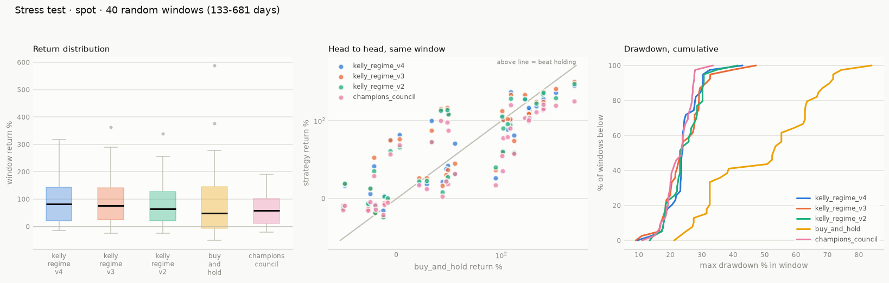

# Walk-forward validation & honest caveats

The comparison table ranks strategies on the **whole** 2017–2026 history.
That single number hides whether an edge is real or an artifact of one
lucky regime, so the leading strategies were re-run on a split:

- **In-sample (IS)**: 2017-01-01 → 2022-12-31 (631k bars) — contains the
  2018 bear (−84%) and the 2022 bear (−77%).
- **Out-of-sample (OOS)**: 2023-01-01 → 2026-08 (380k bars) — a strong
  bull with one ~54% drawdown, and no multi-year bear.

Starting balance $1,000, futures at 5x, spot at 1x.

| strategy | IS futures | OOS futures | OOS max DD | verdict |
|---|---|---|---|---|
| buy_and_hold (spot ref) | $17.2K | $3.8K | 54% | benchmark; liquidates on 5x futures |
| `kelly_regime` | $25.5K | $2.4K (+142%) | 41% | edge real, regime-dependent |
| `champions_council` | $12.9K | $1.9K (+87%) | 29% | lower return, lowest drawdown |

## What this actually says

**The regime filter's edge is concentrated in bear markets.** In-sample —
where two multi-year bears exist to be avoided — `kelly_regime` returns
about 1.5x buy-and-hold. Out-of-sample, in an almost uninterrupted bull,
it **lags** buy-and-hold on raw return (+142% vs +284%) while carrying
noticeably less risk (41% vs 54% max drawdown). That is the classic
trend-following payoff profile, and it is honest to state it plainly:
*this family does not beat holding in a steady bull; it earns its keep by
not participating in the collapses, and by surviving on leverage.*

**Leverage is where the difference compounds.** On 5x futures,
buy-and-hold is liquidated in the January 2017 crash and ends at $18. The
same market with regime-gated fractional-Kelly sizing ends the full
period at $108K from $1K, never liquidating, at Sharpe 1.42 — the highest
in the suite. Position sizing, not signal cleverness, produces that gap.

**Sizing beats prediction.** The three strategies that make money over the
decade (`kelly_regime`, `hedge_experts`, `replicator_book`,
`universal_kelly`) are all *allocators* — they decide how much to hold.
Every pure *predictor* in the suite (MACD/RSI baselines, the flow
followers, the minority-game oracle, the fictitious-play state machine)
loses after fees. On 5-minute BTC, the tradable game-theoretic content is
in growth-optimal sizing and no-regret allocation, not in forecasting the
next bar's sign.

## Parameter honesty

Deliberately **not** the tuned optimum. A sweep of single regime anchors
(raw filter, no volatility targeting) found 50 days best over the full
period ($146K spot vs $66K buy-and-hold), with 200 days at only $6K —
that spread is exactly the sensitivity that signals curve-fitting. So the
shipped strategy votes across **three** anchors, targets **55%
annualized volatility** (BTC's own long-run realized vol, not a swept
value), and caps leverage at **2x**, inside fractional-Kelly practice
(MacLean, Thorp & Ziemba 2010).

Both choices are defensible on the evidence below. Reproduce either table
with `python scripts/experiment.py horizons` / `frontier`.

### The three-anchor vote dominates its own members

Full period, futures 5x, $1,000 start:

| regime anchors | final | Sharpe | max DD | trades |
|---|---|---|---|---|
| 30 days only | $79.4K | 1.31 | 44.9% | 203 |
| 50 days only | $105.5K | 1.38 | 51.1% | 135 |
| 100 days only | $73.2K | 1.27 | 44.9% | 89 |
| 200 days only | $28.5K | 1.04 | 54.4% | 69 |
| **30/50/100 vote (shipped)** | **$108.2K** | **1.42** | **42.6%** | 143 |

The vote beats every individual member on **all three** of return, Sharpe
and drawdown simultaneously. That is a genuine ensemble effect, not a
lucky pick — and it is why the shipped default is the vote even though a
single 50-day anchor is nearly as profitable. (Note also that volatility
targeting compresses the horizon spread from 24x in the raw sweep to
under 4x here: most of the apparent "best lookback" sensitivity was
really uncontrolled risk.)

### The leverage frontier shows the overbetting penalty

Full period, futures 5x, $1,000 start:

| target vol / cap | final | Sharpe | max DD |
|---|---|---|---|
| 0.40 / 1x | $30.4K | 1.38 | 35.5% |
| **0.55 / 2x (shipped)** | **$108.2K** | **1.42** | 42.6% |
| 0.60 / 3x | $174.3K | 1.46 | 48.0% |
| 0.80 / 3x | $312.2K | 1.34 | 57.6% |

Raw return keeps climbing with leverage, but **Sharpe peaks at moderate
sizing and then degrades** — the classic overbetting penalty that
fractional-Kelly practice exists to avoid. The shipped 0.55/2x sits on
the efficient part of the curve; 0.60/3x is the Sharpe optimum for a
risk-tolerant operator; 0.80/3x buys return with a materially worse
risk-adjusted profile and is *not* recommended despite the biggest
headline number. Change these via constructor arguments rather than
editing defaults, so the comparison table stays a stable record.

## Monte Carlo window stress test

A single full-history number cannot separate a robust edge from one lucky
path, so the top three strategies — plus the benchmark and the
structurally different `champions_council` as a control — were resampled
over **40 random windows** (random start, random length between 133 and
681 days). Each window is preceded by a warmup prefix that warms
indicators **without trading**, so every strategy enters every window
warm, flat and with the full $1,000, and short windows are not penalised
for a cold start. All strategies see identical windows. Reproduce with
`python scripts/stress_test.py --trials 40`; raw rows and the summary are
in `reports/stress/`.

### Spot (1x)

| strategy | median | mean | profitable | beat hold | worst | median DD | worst DD |
|---|---|---|---|---|---|---|---|
| `kelly_regime_v4` | **+82.1%** | +94.6% | 85.0% | 47.5% | **−15.2%** | 23.7% | 43.0% |
| `kelly_regime_v3` | +75.6% | **+97.4%** | 82.5% | 50.0% | −23.6% | 23.3% | 47.2% |
| `kelly_regime_v2` | +64.0% | +85.6% | **87.5%** | 47.5% | −23.7% | **23.1%** | 41.4% |
| `champions_council` | +57.4% | +62.1% | 77.5% | 40.0% | −20.5% | 23.5% | **33.6%** |
| buy_and_hold | +49.3% | +96.6% | 72.5% | — | −50.9% | 52.7% | 84.1% |

The nuance worth stating plainly: the allocators have the **higher
median** but buy-and-hold has a comparable **mean**, and beats them in
about half the windows. That is not a contradiction — the distributions
differ in shape. Holding wins often, by a little, in bull windows (its
best window returned +588% vs +318%); the regime filter wins rarely, by a
lot, in the windows that contain a crash. On spot you are trading away
part of the right tail for a much better typical outcome and a far better
left tail (worst window −15% vs −51%, median drawdown 24% vs 53%).

### Futures (5x) — the decisive case

| strategy | median | profitable | beat hold | worst | worst DD | **liquidated** |
|---|---|---|---|---|---|---|
| `kelly_regime_v4` | **+116.3%** | 85.0% | 65.0% | **−16.5%** | **34.8%** | **0%** |
| `kelly_regime_v3` | +105.6% | 85.0% | 65.0% | −19.7% | 41.8% | **0%** |
| `kelly_regime_v2` | +97.6% | **87.5%** | 65.0% | −27.6% | 39.6% | **0%** |
| `champions_council` | +88.6% | 80.0% | 65.0% | −20.1% | 37.1% | **0%** |
| buy_and_hold | **−98.2%** | 35.0% | — | −98.2% | 99.9% | **65.0%** |

**Leveraged buy-and-hold was liquidated in 26 of 40 windows, and its
median window return is −98.2%** — the median path is a wipeout, not a
disappointment. Every allocator survived **all 40**, stayed profitable in
80–88% of them, and beat holding in 65%. This is the clearest evidence in
the project that the value is in growth-optimal position sizing: same
asset, same windows, same fees — the difference is entirely how much is
held and when.

> These numbers replace an earlier, materially different set. Under the
> old harness strategies traded *through* the warmup prefix, so 19 of
> buy-and-hold's 23 liquidations happened before the measured window even
> opened; those windows then recorded a dead account drifting at 0%,
> which is why its median used to read "exactly 0.0%" and its worst
> drawdown looked *better* than it is. The corrected run makes leveraged
> holding look considerably **worse**, not better. See
> [Is the harness itself trustworthy?](#is-the-harness-itself-trustworthy)

## Does the starting balance matter?

Almost never, which is why the framework now defaults to a single $1,000
start. Across the twenty base strategies on both markets, comparing a $1,000 run
with a $1,000,000 run:

- **15 of 40** strategy-market pairs returned percentages identical to
  within 0.01pp — e.g. `kelly_regime` ended at $42,096 and $42,096,000.
- **2 of 40** differed by more than 1pp, both of them `universal_kelly`.
- The remaining ~0.5pp gaps were all *already-dead* strategies showing
  −99.5% at $1K versus −100% at $1M.

Every difference traces to the **$5 minimum order notional**, not to any
property of the strategy:

- A $1,000 account that has fallen to ~$5 can no longer place a legal
  order, so it *freezes* just above zero; a $1M account grinds all the way
  down. The small account is saved by the floor, not by skill.
- `universal_kelly` rebalances in tiny increments. On a $1K account most
  of those fall under the $5 minimum and are skipped, which accidentally
  saves fees (20 trades and +22.7% on futures, versus 3,047 trades and
  +0.4% at $1M). That is a real capital-scaling effect worth knowing, but
  it is a statement about minimum order size, not about edge.

Run `tradebot run --balances 1000 1000000` to reproduce; the comparison
table flags any strategy whose return moves more than 1pp with account
size.

## Beta testing variants: `kelly_regime_v2`

A second research round (ML/DL and game theory, see
[RESEARCH.md](RESEARCH.md#improving-the-best-strategy)) proposed four ways
to improve the leading strategy. Three of them — a walk-forward
statistical jump model, Bayesian online changepoint detection, and
meta-labeling with a walk-forward logistic model — **failed to beat the
baseline** and are recorded there as negative results. The one that
worked is not a new detector at all: it reshapes how the existing vote
maps to exposure, `vote ** 1.75` instead of `vote`.

Run `python scripts/beta_test.py --windows 24` to reproduce. Futures 5x,
$1,000 start:

| metric | `kelly_regime` | `kelly_regime_v2` |
|---|---|---|
| full period | $108,221 | **$121,993** |
| Sharpe | 1.42 | **1.49** |
| max drawdown | 42.6% | **39.6%** |
| trades | 143 | **113** |
| in-sample (2017–22) | $25,486 | **$30,737** |
| **out-of-sample (2023–26)** | **$2,422** | $2,336 |
| Monte Carlo median window | +49.7% | **+54.6%** |
| Monte Carlo worst window | −30.6% | **−22.6%** |
| windows where it beats the baseline | — | 62.5% |
| liquidations | 0% | 0% |

**Nine of ten metrics improve, and it still fails the promotion rule.**
The rule requires a candidate to beat the incumbent on the full period,
*not degrade out-of-sample*, and win the median Monte Carlo window; v2
lands 3.5% below on out-of-sample final balance, so the harness reports
"no better (fails: oos)". Both are kept registered and both appear in the
comparison table, with the caveat stated rather than buried.

Reading it honestly: the out-of-sample shortfall is well inside the
**±0.2 Sharpe noise floor** measured by paired stationary block bootstrap
(30-day blocks, 2,000 resamples) — a single 3.6-year path cannot resolve
a 3.5% difference. The research predicted this exact pattern in advance:
shrinking partial-agreement states costs return in a market that sits at
two-thirds agreement while drifting up, which describes 2023–2026. What
argues for the change is not any single number but that return, Sharpe,
drawdown, turnover, the Monte Carlo median *and* the Monte Carlo left
tail all move the right way together, with the effect a plateau across
gamma ∈ [1.25, 4.0] rather than a spike at one tuned value — the opposite
of the overfitting signature.

`kelly_regime` keeps `vote_gamma=1.0` as its default, so the incumbent's
published record is unchanged; v2 is a separate registered strategy.

### `kelly_regime_v3` — the one that earned promotion

The sizing half of the research produced the clear winner. Instead of
re-sizing continuously, it holds a **constant notional through normal
volatility** and switches to full inverse-volatility sizing only when
volatility breaks out (high or low), latching that state until it
retraces — the same hysteresis the regime gate uses, applied to risk.

| metric | `kelly_regime` | `kelly_regime_v3` |
|---|---|---|
| full period | $108,221 | **$139,509** |
| Sharpe | 1.42 | **1.55** |
| max drawdown | 42.6% | **41.8%** |
| in-sample (2017–22) | $25,486 | **$32,971** |
| **out-of-sample (2023–26)** | $2,422 | **$2,568** |
| Monte Carlo median window | +49.7% | **+64.3%** |
| Monte Carlo median drawdown | 32.7% | **26.8%** |
| windows where it beats the baseline | — | **75.0%** |
| liquidations | 0% | 0% |

It improves **every** metric, in both sub-periods and on both markets,
and the harness promotes it. The parameter neighbourhood is flat (eight
threshold combinations land at Sharpe 1.47–1.55) and it survives a 20bps
slippage stress at Sharpe 1.42 — matching the *frictionless* incumbent.

### Why it works: BTC has an inverse leverage effect

This is the most useful thing the research turned up, and it inverts the
textbook. Forward 5-day Sharpe by lagged-volatility quintile, measured on
this data:

| sample | Q1 (low vol) | Q2 | Q3 | Q4 | Q5 (high vol) |
|---|---|---|---|---|---|
| all bars | +0.82 | −0.12 | +0.57 | +0.64 | **+1.08** |
| gate bullish | +1.76 | +0.41 | +1.57 | +1.23 | **+2.06** |

**High volatility forecasts the *highest* forward Sharpe in BTC**, the
opposite of equities — consistent with Baur & Dimpfl (2018, Economics
Letters 173), who find positive shocks raise crypto volatility more than
negative ones. So Moreira & Muir's (2017, J. Finance) volatility-managed
alpha, which requires high volatility to forecast *low* returns, is
absent-to-inverted here. Continuous targeting de-levers into precisely
the best states; conditional targeting (Bongaerts, Kang & van Dijk 2020,
FAJ 76(4)) keeps Harvey et al.'s (2018) mechanical tail protection and
discards the part that fights the asset.

**Corollary, and it is counterintuitive: better volatility *forecasting*
makes this strategy worse.** A timescale blend that beats the incumbent
estimator by 8% on QLIKE — a genuinely better forecast — returns **$52K
instead of $115K** when plugged in, because it de-levers more promptly
into the high-Sharpe states. The incumbent's 8-day span is not merely
adequate; part of its value is that it is *sluggish*.

Two further negative results worth recording: range-based estimators
(Parkinson, Garman-Klass, Rogers-Satchell, Yang-Zhang) read **7–18% low**
on 5m bars from discretisation bias, so a drop-in swap silently raises
effective leverage and invalidates the `target_vol` calibration; and
their textbook 5–8x efficiency advantage does not transfer, because it is
measured against a *daily close-to-close* estimator while the incumbent
already averages 288 squared returns per day.

### A leak the old tests would have missed

The same round found that a daily-aggregated signal broadcast onto every
5-minute bar of the *same* day leaks that entire day of future — worth
**+2.1 Sharpe** in a prototype (3.09 vs 0.99 once lagged correctly). Such
a signal **passes** the truncation test, because truncating the tail does
not change earlier rows. `tests/test_causality_real.py` now also perturbs
future bars (×3 on prices, ×7 on volume) and asserts every prepared
column before the cut is bit-identical, which catches it directly. All 21
strategies pass.

## Is the harness itself trustworthy?

Every number above is only as good as the engine that produced it, so the
engine and the test suite were audited adversarially — by **injecting
deliberate bugs and checking whether the suite noticed**. 26 mutants were
planted across the engine, broker, metrics, data loader and strategies.

**20 were caught. Six were completely silent**, and five more were held
by a single assertion each. All are now fixed or covered:

| silent bug | what it would have done | now caught by |
|---|---|---|
| liquidation checked on the **close** instead of the bar's high/low | wicks never liquidate → every leveraged result overstated | `test_intrabar_wick_liquidates_even_when_the_close_recovers` |
| a strategy reading bar `i+1` inside `on_bar` | **perfect foresight**; the prototype returned $3.7e23 from $1,000 at Sharpe 73 with a fully green suite | `test_decisions_ignore_every_bar_after_the_decision_bar` |
| `(1 + mm)` divisor dropped from the **short** liquidation price | every short on 5x futures mis-priced | `test_liquidation_price_short`, `test_short_liquidation_triggers_on_the_bar_high` |
| `REBALANCE_DEADBAND` widened 10x | silently changes turnover, fees and every published balance | `test_rebalance_deadband_threshold_is_exact` |
| Sharpe annualization factor removed | every Sharpe ~750x too small, still "looks like a number" | `test_sharpe_is_annualized_to_5m_bars` |
| epoch-unit detection thresholds shifted | timestamps silently mis-parsed | (bounded by the round-trip tests; see limitations) |

Two structural problems mattered more than any single mutant:

**The causality guarantee only covered `prepare()`.** A strategy that
keeps the frame handed to `prepare()` and indexes `i + 1` inside `on_bar`
passed the truncation test, the future-bar perturbation test, *and* live
parity. `tests/test_causality_strict.py` now compares the **orders** a
strategy queues under two opposite tampers of the future, which catches
it — and a self-check in that file asserts the detector still detects a
deliberate peek, so the guard cannot rot into a no-op.

**Much of the coverage was vacuous.** 16 of 22 strategies placed *zero*
orders in the 2,000-bar synthetic truncation fixture and 18 of 22 placed
zero in the 1,200-bar live-parity fixture, so those parametrized tests
were asserting `[] == []` for most of the suite — 12 strategies had no
effective truncation coverage anywhere. The truncation test now runs on
the real slice for **every** registered strategy, live parity is checked
on real data with every strategy warm, and
`test_every_strategy_actually_trades_on_the_real_slice` fails loudly if a
strategy ever goes inert again. `tests/test_causality_real.py` also now
**fails** rather than skips when the dataset is missing — a skipped
causality suite is a green run that guarantees nothing.

**Determinism is clean.** Repeated full runs, reversed test order, and
per-file isolation all produce identical results; all RNG is seeded, and
nothing depends on wall-clock or network.

### Two measurement biases found, and what they changed

**1. Stress-test windows scored corpses.** Each Monte Carlo window is
preceded by a 100-day warmup prefix, and strategies were *trading*
through that prefix. On 5x futures, buy-and-hold was liquidated in 23 of
40 windows — but **19 of those 23 liquidations happened inside the
prefix**, before the measured window opened. The window then recorded a
dead account drifting at 0%, which is why its median window return was
"exactly 0.0%".

`run_backtest(..., trade_start=N)` fixes it: bars before `N` still call
`on_bar`, so indicators and internal state warm normally, but their
orders are discarded — every window now opens **flat, warm, with the full
$1,000**.

The correction runs *against* the strategies this repo favours in one
sense and hard against the benchmark in another. Leveraged buy-and-hold
gets worse: 26 of 40 windows liquidated instead of 23, median −98.2%
instead of 0.0%, worst drawdown 99.9% instead of 99.5% — because a fresh
5x position is now actually opened inside each window rather than
inherited already-dead. The allocators' numbers barely move, since none
of them was ever liquidated in a prefix. The lesson is not that the old
conclusion was wrong; it is that it was **right for a reason that was
partly an artifact**, which is the more dangerous failure.

**2. The out-of-sample split handicapped the strategies being tested.**
`df.loc["2023-01-01":]` gives a 100-day-warmup strategy no history, so it
sat flat for the first **7.6% of the out-of-sample period** while
zero-warmup buy-and-hold traded from day one. `tradebot.window.run_period`
now takes the warmup from the bars *before* the period and starts
measuring at the period boundary, so every walk-forward comparison is
warm-vs-warm.

Neither bias was in the backtest engine's own accounting — the full-period
comparison table is unaffected — but both were in the evidence used to
argue that the leaders are robust, which is exactly where a bias does the
most damage.

## Known limitations

- **No funding rates.** Perpetual futures pay/receive funding every 8
  hours; it is invisible in OHLCV and can meaningfully erode a
  held-long leveraged position. Treat futures figures as an upper bound.
- **Spot data as a perp proxy.** No perp series was reachable when the
  dataset was built (see README); the basis is small but the label
  `spot (perp proxy)` is carried through every report for a reason.
- **One asset, one decade.** BTC 2017–2026 is a single, upward-drifting
  sample path. Cross-asset (ETH) and cross-period validation would be the
  next honest step before risking capital.
- **Survivorship in the council.** `champions_council` selects members
  that already performed well on this data. Its OOS split is reported
  above precisely because its in-sample rank is not evidence.
