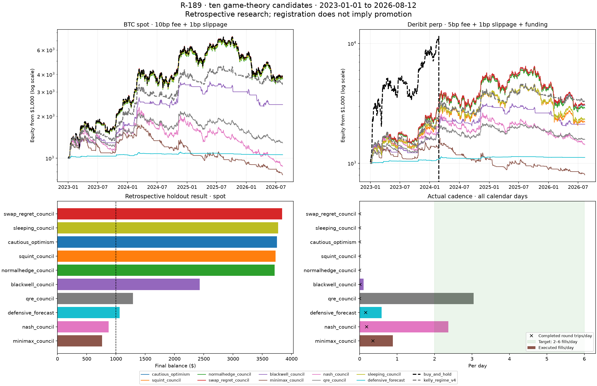

# R-189 — ten game-theory candidates

**All ten are RESEARCH ONLY; none passes the frozen promotion rule.** Two
meet the operational target of 2–6 executed fills/day. **None produces a few
completed round trips per day.** Registration preserves the requested
implementations and negative evidence; it is not a live-trading recommendation.

Primary evaluation: **2023-01-01 to 2026-08-12 00:40 UTC**, fresh $1,000,
Bitstamp BTC spot, 10bp taker +1bp slippage per fill. Buy-and-hold finishes
**$3,839**, Sharpe **1.03**, max drawdown **54.0%**; Kelly v4 finishes
**$3,392**, Sharpe **1.22**, max drawdown **28.0%**. Historical comparisons
below the README's main table use their original cost convention instead.

| candidate | spot balance | Sharpe | max DD | fills/day | closed trips/day | 40bp fee balance | funded perp balance |
|---|---|---|---|---|---|---|---|
| `cautious_optimism` | $3,751 | 1.02 | 53.7% | 0.001 | 0.000 | $3,740 | $3,042 |
| `squint_council` | $3,725 | 1.02 | 53.7% | 0.001 | 0.000 | $3,714 | $2,212 |
| `normalhedge_council` | $3,711 | 1.02 | 53.6% | 0.001 | 0.000 | $3,700 | $2,891 |
| `swap_regret_council` | $3,839 | 1.03 | 54.0% | 0.001 | 0.000 | $3,827 | $3,072 |
| `blackwell_council` | $2,431 | 1.09 | 34.2% | 0.106 | 0.014 | $2,175 | $2,119 |
| `minimax_council` | $761 | -0.18 | 57.8% | 0.884 | 0.353 | $48 | $802 |
| `nash_council` | $875 | 0.03 | 62.6% | 2.368 | 0.187 | $55 | $1,430 |
| `qre_council` | $1,289 | 0.41 | 41.3% | 3.042 | 0.000 | $306 | $1,580 |
| `sleeping_council` | $3,770 | 1.02 | 53.8% | 0.001 | 0.000 | $3,758 | $2,317 |
| `defensive_forecast` | $1,061 | 0.45 | 4.6% | 0.584 | 0.165 | $860 | $1,119 |



The futures pane uses a **5x market** with matching Deribit price and funding,
5bp taker +1bp slippage. Candidates target at most 1x notional; buy-and-hold
uses the full 5x and is liquidated, so its zero tail disappears on the log axis.
Its liquidation is a leverage stress result, not evidence of candidate alpha.
Deribit's continuous funding is approximated by the committed 8h aggregates.
The broker's rebalance band is 5% of maximum notional: 5% of equity on spot,
25% on this futures market. Its coarser futures fills can materially change
results. Lower drawdown alone does not establish an advantage at matched risk.

QRE has 4,012 fills on 97.7% of calendar days, with **no complete exit**:
these are adjustments to a continuously long position. Its $1,289 falls to
$306 at the 40bp fee stress and $861 on ETH. Nash has 3,124 fills and 247
completed episodes; it loses money on BTC spot and ETH. Five cumulative
expert learners each place just one primary holdout fill, largely recovering
a passive long. Blackwell's smaller drawdown comes with only 0.106 fills/day
and substantially less growth. Defensive forecasting has 0.165 completed
trips/day; its modest $61 profit disappears at the higher fee.

The 24 seeded 120–365 day windows are identical across candidates and controls
on each market. Every candidate beats spot buy-and-hold on fewer than 30%
of these windows. They overlap and are descriptive robustness checks, not
24 independent observations. Daily paired stationary bootstrap uses 2,000
resamples and 30-day mean blocks. No candidate has a positive lower 95%
growth-difference bound against spot holding. The frozen program DSR uses
1,479 approximate consultations and a 0.419 validation-Sharpe dispersion;
all scores are below 0.27, against the 0.95 bar. This trial model is an
approximation, not a correction that makes the much-reused holdout pristine.
The 24 supplemental legacy chart cells lift the recorded consultation total
to about 1,503 and cannot rescue any failed promotion condition.

Ten fixed defaults, no parameter sweep or performance-driven retuning.
**684 main cells +24 supplemental historical-interval cells =708 evaluations**
(590 candidate cells, 118 controls). Train is 2017–2020, validation is
2021–2022; complete end dates include 23:55. ETH uses Coinbase data;
funded Deribit validation starts in 2021 to avoid the known missing 2020
settlement. Every account resets flat while each online learner retains
all available causal prior history. Initial Kelly targets are synchronized
for the primary fresh-account controls; the historical chart protocol is
preserved separately. This retained-history convention is needed for
cumulative learners: an arbitrary recent-history live window can differ.

Two initial attempts stopped before any financial evaluation due to mixed
naive/UTC timestamp bounds. Their manifests are preserved. Both bounds and
the funding completeness check were corrected before the successful freeze;
strategy configurations and the promotion rule did not change. The final
manifest hashes match the evaluated source and input files. Independent
fill-tape reconstruction reproduces all 12 primary account balances within
$6e-11 and confirms cadence, fees and next-open slippage.

Research and implementation: [primary-source review](../../docs/R189_RESEARCH.md),
[strategies](../../src/tradebot/strategies/intraday_games.py),
[frozen harness](../../experiments/r189_games.py),
[supplemental historical intervals](../../experiments/r189_legacy_intervals.py).
Receipts: [all main cells](cells.csv), [decisions and failed clauses](decision.csv),
[paired intervals](bootstrap.csv), [frozen manifest](manifest.json).

Reproduce from the repository root:

```bash
.venv/bin/python experiments/r189_games.py run --workers 4
.venv/bin/python experiments/r189_games.py report
.venv/bin/python experiments/r189_legacy_intervals.py
PYTHONPATH=src .venv/bin/python -m pytest -q
```

The main table keeps 2017–2026 Bitstamp prices, zero slippage, and unfunded
spot-proxy futures for comparability. Both controls were independently
reproduced on both historical markets before appending the 20 new rows;
all 54 earlier rows are unchanged. Primary/funded results are never silently
inserted into that historical ranking. The new optional user-supplied CSVs
remain intact; the loader accepts their `ts` header, and explicit historical
files keep this research independent of resolver precedence.

Final regression verification: **684 tests passed** in the complete suite,
including the CLI cache guard. Tests confirm that recent data, custom
costs and authentic perp inputs cannot inherit the old proxy intervals.
Another 40 causality checks pass against the committed historical Bitstamp
dataset, independently of the optional user-supplied data files.
The guard checks published metadata and daily counts; it does not assert
that prices inside an unchanged date range have an identical hash.
