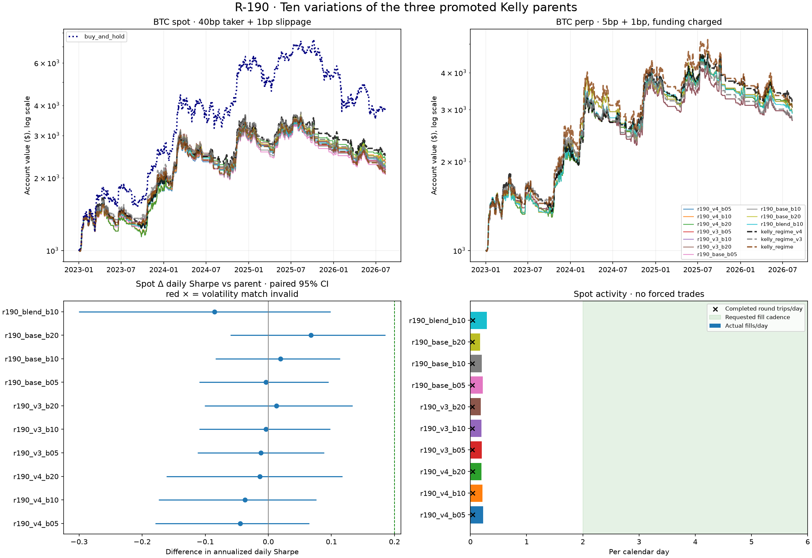

# R-190 — ten variations of the three promoted Kelly strategies

**All ten candidates are NEGATIVE under the frozen rule.** The round completed
**879 financial evaluations**: 784 core cells, 87 passive-control matching
attempts and eight independent audit reproductions. No candidate was promoted
or registered; the accepted comparison and parent defaults remain unchanged.

The lead selected before holdout, `r190_v3_b20`, finished primary BTC spot at
**$2,226.41 versus native v3’s $2,210.11**, from a fresh $1,000; funded
perpetuals finished at **$2,758.55 versus $2,772.21**. These changes are inside
the paired uncertainty ranges. Across all ten, spot activity is only
**0.170–0.290 fills/day** and **0.035–0.039 completed round trips/day**,
missing the requested few trades/day.



Passive 5× holding liquidated. It is a stress control, excluded from the funded
performance panel and scored comparisons. Lower drawdown at lower exposure
is not evidence of improvement; paired inference requires verified risk matches.

## Design and costs

The [frozen protocol](../../experiments/r190_protocol.md) follows
[ROUTINE.md](../../docs/ROUTINE.md). The promoted parents are
`kelly_regime_v4`, `kelly_regime_v3` and original `kelly_regime`. Nine
candidates retain their causal targets with actual-account rebalance bands
0.05/0.10/0.20 equity notional, checked every four hours UTC. Candidate ten
averages the targets with a 0.10 band. Two auxiliary blend bands, 0.05/0.20,
test its neighbourhood. No parameters were retuned. This is an execution/cost
composition; [research and prior rounds](../../docs/R190_RESEARCH.md) define
its scope.

Every cell starts with $1,000, causal earlier history and native next-open
fills. Training preparation sees only pre-2023 bars; original global warmups
stay flat. Native parents initialize their known target at the first eligible
bar, while candidates wait for a UTC slot. The broker’s separate 5% maximum-
notional deadband remains: on 5× perpetuals it is 0.25 equity, making the three
bands within each non-blend family produce identical funded holdout outcomes.
Six daily decision slots are a ceiling; transactions are not forced.

Explicit committed Bitstamp BTC, Coinbase ETH and venue-matched Deribit BTC
prices/funding end **2026-08-12 00:40 UTC**. Inner train is 2017–2020,
validation 2021–2022, holdout 2023 onward. The one-year user CSVs are not inputs.
BTC spot costs **40bp taker +1bp slippage each way**, with a **$10 minimum**,
a constant historical scenario based on the verified entry fee tier. The
10bp BTC cell is a discount scenario. ETH uses 40bp +1bp and a generic $5
minimum as a stress scenario. Perpetuals use 5bp +1bp, actual Deribit funding
aggregated to 8h and the generic linear-margin broker with a $5 minimum;
this does not reproduce exact inverse-contract, continuous-funding or queue
mechanics. Funding coverage is checked.

## All ten results

Final dollars from $1,000, after costs. `05/10/20` denote the band; `base` is
original Kelly. Cadence columns refer to primary 40bp BTC spot.

| Candidate | BTC 40bp | BTC 10bp | Funded BTC | ETH 40bp | Fills/day | Completed round trips/day |
|---|---:|---:|---:|---:|---:|---:|
| v4 · 05 | $2,304.61 | $3,161.32 | $3,055.23 | $1,632.33 | 0.227 | 0.037 |
| v4 · 10 | $2,323.67 | $3,169.02 | $3,055.23 | $1,635.49 | 0.217 | 0.037 |
| v4 · 20 | $2,389.26 | $3,243.74 | $3,055.23 | $1,753.48 | 0.199 | 0.037 |
| v3 · 05 | $2,162.67 | $2,881.45 | $2,758.55 | $1,449.11 | 0.203 | 0.035 |
| v3 · 10 | $2,181.26 | $2,901.60 | $2,758.55 | $1,485.15 | 0.196 | 0.035 |
| v3 · 20 | $2,226.41 | $2,943.70 | $2,758.55 | $1,541.24 | 0.183 | 0.035 |
| base · 05 | $2,070.04 | $2,769.73 | $2,943.47 | $1,386.16 | 0.221 | 0.035 |
| base · 10 | $2,127.12 | $2,818.61 | $2,943.47 | $1,432.75 | 0.204 | 0.035 |
| base · 20 | $2,255.43 | $2,961.92 | $2,943.47 | $1,579.23 | 0.170 | 0.035 |
| blend · 10 | $2,217.59 | $2,976.97 | $2,915.62 | $1,505.02 | 0.290 | 0.039 |

Native v4/v3/base finish spot at **$2,453.75 / $2,210.11 / $2,090.63** and
funded at **$3,193.18 / $2,772.21 / $3,071.69**. Spot holding finishes at
**$3,827.03**, with higher exposure. All candidates are profitable in the four
named holdout scenarios and none of their 550 core cells liquidated.

[All training and validation results](train_cells.csv), [all core results](cells.csv)
and [daily returns](holdout_daily.csv.gz) retain every control and candidate,
including Sharpe, drawdown, active days, exposure, time in market, volatility,
fees, funding, requests and fills. Sharpe is annualized from daily returns,
including the first day’s PnL against $1,000. Core drawdown uses 5-minute equity;
bootstrap drawdown uses daily equity.

The validation-only lead has mean spot/funded Sharpe **0.1816** (components
0.1608/0.2025), with balances **$1,010.46/$1,038.55**. Its inner-train spot
balance is **$12,702.50**. All ten received holdout evaluation regardless of
validation performance; holdout did not select defaults.

## Risk and uncertainty

Paired stationary bootstrap: 2,000 common resamples per cell, 30-day mean
blocks, seed 190. Every primary-holdout Sharpe interval crosses zero.
For the validation-selected v3 band 20, candidate-minus-control estimates are:

| Market/control | Δ daily Sharpe [95% CI] | Δ log growth [95% CI] | Risk match |
|---|---|---|---|
| Spot / native v3 | +0.013 [-0.101, +0.133] | +0.007 [-0.119, +0.150] | Valid |
| Spot / matched hold | -0.174 [-0.776, +0.418] | -0.204 [-0.847, +0.485] | Valid |
| Funded / native v3 | +0.003 [-0.144, +0.141] | -0.005 [-0.194, +0.174] | Valid |
| Funded / matched hold | +0.051 [-0.517, +0.650] | +0.083 [-0.623, +0.865] | **INVALID** |

Parent volatility must be within 5% of the candidate; passive hold within 2%.
All 20 holdout parent comparisons are valid, versus 14/20 in validation.
Passive matches are valid for 20/20 validation and 17/20 holdout comparisons.
All three v3 funded matches miss by 2.061%, so they are void. The **87 attempts**
include every failure; tolerances were not relaxed. The passive control uses
an ex-post scalar, explicit-quantity orders and its existing 10% relative
rebalance band; it is an inference control, not a forecasting rule.

The lead’s spot candidate/parent volatility is **32.16%/32.55% annualized**,
mean exposure **0.598×/0.595×**, time in market **71.97%/72.01%**. Its matched
spot hold has 32.29% volatility, 0.696× exposure and nearly 100% time in market.
Funded candidate/parent volatility is **36.31%/36.73%**, exposure
**0.652×/0.651×**, time in market **72.08%/72.12%**; attempted passive hold has
35.56% volatility and 0.762× exposure, hence fails the match.
[Full paired intervals](bootstrap.csv), [training controls](train_matched_cells.csv)
and [holdout controls](holdout_matched_cells.csv) retain all validity and exposure
measurements. The lead’s small spot difference does not establish improvement.

## Gates, beta tests and multiplicity

There are 24 paired, overlapping 120–365-day windows per market, seed 190.
They are descriptive path checks, not independent trials. The lead wins
**13/24 spot and 13/24 funded** windows against native v3, all risk-valid.
Across candidates, raw wins range **10–19 spot / 10–15 funded**; after voiding
risk mismatches, only four candidates pass the required 13 wins in both
markets. [decision.csv](decision.csv) gives every candidate’s raw wins,
valid wins, valid-window counts and gate Booleans.

Every family fails the plateau gate despite Sharpe ranges below 0.20.
V4, base and blend have unprofitable validation neighbours. Only one v3 band
beats its parent on spot holdout, where two are required. V4/base/blend fail
parent-improvement requirements on at least one holdout market. Identical
funded family outcomes reflect broker granularity, not independent evidence.

Program DSR ranges **0.096–0.205** across both primary markets; local
12-configuration DSR ranges **0.567–0.746**. None reaches the required 0.95
on both markets. The frozen trial-Sharpe dispersion is 0.418538. The
[pre-holdout power check](training_power.csv) projected **6.26–22.36 years**
for the inherited +0.20 Sharpe hurdle; the lead needs approximately
**10.22 years spot /15.35 years funded**, assuming stationary paired noise,
versus about 3.6 years of holdout. The hurdle was not weakened.

The exhaustive rule requires all seven gates: risk-valid >+0.20 Sharpe
improvements on both primary validation/holdout markets against both controls;
positive holdout Sharpe/growth lower bounds; full cost/ETH/funding falsification;
2–6 fills/day; program DSR; beta wins; and plateau. **All ten fail promotion.**
Four pass beta; only v4 band 20 and base band 20 pass the full falsification,
which also requires ETH Sharpe at least as high as the native reference.
None passes cadence, DSR, plateau, the complete point/risk or interval gate.

## Validation and reproduction

**718 tests passed.** The independent skeptic reproduced four training and
four holdout cells using separately reconstructed targets and a quote-cash
account, without the engine, broker or evaluator. Maximum daily equity
error was **$1.28e−11**, with no material mismatch. All ten additionally passed
real pre-2023 target-identity, future-perturbation and prefix checks after
warmup. Target-only probes add no financial evaluations. See [audit.md](audit.md)
and [audit.json](audit.json).

The [manifest](manifest.json), protocol and decision implementation were
committed at `2da272c` before holdout. All 20 frozen source/data hashes match.
Subsequent reporter edits only draw CI endpoints and add the holding legend;
no gate or statistic changed. [Verification receipt](verification.json)
records provenance. The inherited daily-drawdown bootstrap initializes peaks
at its first daily observation rather than separately adding initial cash;
this limits that displayed statistic and does not alter the growth gates.

[Counts](counts.json): **784 core +87 matching +8 audit =879**. Holdout
consultations increased by **736 core +47 matching +4 audit =787**, from
approximately 1,503 to **2,290**. These are dependent consultations, not
independent statistical trials. Negative code remains under `experiments/`.

From the repository root with the recorded datasets and frozen sources:

```bash
PYTHONPATH=src .venv/bin/python experiments/r190_eval.py train --workers 3
PYTHONPATH=src .venv/bin/python experiments/r190_matched.py train --workers 3
PYTHONPATH=src .venv/bin/python tests/test_r190_audit.py train
PYTHONPATH=src .venv/bin/python experiments/r190_report.py freeze
PYTHONPATH=src .venv/bin/python experiments/r190_eval.py holdout --workers 3
PYTHONPATH=src .venv/bin/python experiments/r190_matched.py holdout --workers 3
PYTHONPATH=src .venv/bin/python tests/test_r190_audit.py holdout
PYTHONPATH=src .venv/bin/python tests/test_r190_audit.py causality
PYTHONPATH=src .venv/bin/python experiments/r190_report.py report
PYTHONPATH=src .venv/bin/python -m pytest -q
```

Holdout workers and the reporter verify frozen hashes. Per-name/stage cells
and daily returns flush after every completed cell; primary spot fill tapes
record actual executions. Re-executing financial commands creates additional
evaluations requiring a new ledger receipt, not reuse of this round’s count.
