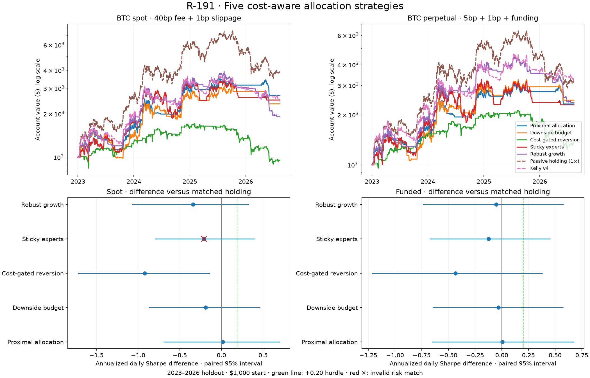

# R-191 — five cost-aware allocation strategies

**All five are NEGATIVE under the frozen decision rule.** The code is retained
as experiments; no strategy is promoted or added to the live registry.
Sticky expert selection led training validation; no default was selected or
retuned using the holdout. New implementations extend known methods rather
than claiming five new information channels.



## Design and provenance

The [pre-registration](../../experiments/r191_protocol.md) was committed in
`25f82c0b`, implementation in `330ccaf1`, and the source/data
[manifest](manifest.json) plus training evidence in `f2edf574` before holdout.
The [research notes](../../experiments/r191_research_notes.md) record primary
citations, original paper data/cost scope, and overlap with earlier rounds.
The rule, thresholds, source hashes, and parameters did not change after
holdout. The independent auditor subsequently changed only receipt paths
and audit reporting, disclosed in [audit.md](audit.md).

| Family | Mechanism | Primary parameter | Fixed neighbors |
|---|---|---|---|
| Proximal allocation | Mean/variance allocation with an L1 switching cost | Penalty 2 | 1, 4 |
| Adaptive downside budget | 90-observation momentum sized by an adaptive downside quantile | Daily loss budget 3% | 2%, 4% |
| Cost-gated OLMAR | Projected moving-average reversion with a fee hurdle | Window 10 | 5, 20 |
| Sticky experts | Hard selection among cash, long, trend and reversion, penalizing switches | Switch penalty 1% | 0.5%, 2% |
| Robust growth | Median growth across six historical blocks, net of switching penalty | Penalty 2 | 1, 4 |

Every target is in [0,1]. Only complete UTC days produce a 23:55 decision;
fills occur at the next open. All share a 252-complete-observation warmup.
The internal one-way cost hurdle remains 40bp plus 1bp on all markets,
including cheaper execution scenarios. Execution uses actual marked holdings,
a 0.05-equity band, and the native broker's separate deadband and minima.
The futures broker's 0.25-equity target band can absorb smaller adjustments.
These are daily decision opportunities, not a required trading frequency.

## Costs, data and limits

Every cell starts with $1,000. Inner train is 2017–2020, validation 2021–2022,
and the retrospective holdout is **2023-01-01 through 2026-08-12 00:40 UTC**.
Training signal preparation sees no post-2022 data. Earlier causal features
carry into each fresh account; hypothetical signal history is not account PnL.

Primary BTC spot charges **0.40% taker plus 1bp slippage**, with a $10 minimum.
The [Bitstamp standard entry tier](https://www.bitstamp.net/fee-schedule/)
was verified on 2026-10-02; fixed historical fees are a scenario, not historical
tier reconstruction. The 0.10% BTC run is a discount sensitivity. ETH charges
40bp plus 1bp with the inherited generic $5 minimum as a stress, not an actual
Coinbase account quote. Funded BTC uses Deribit prices, matching observed
8-hour funding, **5bp taker plus 1bp**, and the generic $5 minimum. The
[Deribit schedule](https://support.deribit.com/hc/en-us/articles/25944746248989-Fees)
still calls its 3.5bp table upcoming; 5bp is a conservative legacy scenario.
The linear-margin broker is not an exact inverse-contract, continuous-funding,
order-book, queue, market-impact, or exchange-rounding model.

[Coverage metadata](data_coverage.json) shows no missing five-minute BTC spot
or perpetual timestamps. ETH has 415 missing timestamps and 31 incomplete
interior days, which do not generate decisions or daily feature observations.
Thus ETH lookbacks count complete observations, and returns across a missing
day span the gap. The final partial day is excluded from signal updates on
all assets; Deribit also starts with a partial day. This limits ETH replication.

Adaptive quantile sizing has no transferred conformal coverage guarantee.
Expert rewards are hypothetical lagged one-day scores, not executable funded
shadow accounts. Block-median quadratic growth is neither exact log utility
nor a confidence bound. Fewer positions or a smaller raw drawdown is not an
established benefit at matched risk.

## Results from every primary

Balances below include the named execution costs. Sharpe uses daily account
returns, including the first day's change from the fresh $1,000 account.

| Strategy | Train BTC | Validation BTC | Validation funded | Holdout BTC | Holdout funded | Holdout ETH | Discount BTC |
|---|---:|---:|---:|---:|---:|---:|---:|
| Cost-aware proximal allocation | $8,829.99 | $1,303.90 | $1,118.28 | $2,683.62 | $2,321.70 | $2,100.41 | $2,798.58 |
| Adaptive downside-quantile budget | $7,169.32 | $981.97 | $875.64 | $2,342.11 | $2,447.55 | $1,747.43 | $2,715.74 |
| Cost-gated moving-average reversion | $476.53 | $870.84 | $783.94 | $951.53 | $1,338.98 | $922.06 | $1,345.95 |
| Sticky net-reward expert selection | $5,750.94 | $1,331.99 | $1,131.13 | $2,489.50 | $2,292.76 | $1,811.57 | $2,691.48 |
| Robust block growth allocation | $4,830.72 | $761.31 | $967.69 | $1,906.61 | $2,366.69 | $750.13 | $2,414.30 |
| buy_and_hold | $29,913.09 | $572.85 | $481.10 | $3,827.03 | $3,136.98 | $1,566.05 | $3,838.54 |
| kelly_regime_v4 | $13,296.41 | $868.83 | $982.56 | $2,453.75 | $3,193.18 | $1,662.27 | $3,391.85 |

The funded passive reference is **one-times notional**, rebalanced with a
10% relative band; it is not leveraged buy-and-hold. Native Kelly v4 is a
contextual incumbent. Raw balances do not imply equal risk. The selected
validation lead, sticky expert selection, remains the descriptive lead even
though the proximal allocator has a higher spot holdout balance.

| Strategy | Spot daily Sharpe | Bar drawdown | Mean exposure | Time in market | Annual volatility | Spot fees | Funded funding paid | Spot fills | Completed episodes |
|---|---:|---:|---:|---:|---:|---:|---:|---:|---:|
| Cost-aware proximal allocation | 1.025 | 28.5% | 0.504x | 63.4% | 31.4% | $114.23 | $351.98 | 66 | 8 |
| Adaptive downside-quantile budget | 0.840 | 39.2% | 0.598x | 60.5% | 35.4% | $334.37 | $440.76 | 56 | 25 |
| Cost-gated moving-average reversion | 0.081 | 48.7% | 0.340x | 45.1% | 26.7% | $618.76 | $66.94 | 197 | 71 |
| Sticky net-reward expert selection | 0.837 | 40.2% | 0.735x | 73.5% | 39.3% | $217.34 | $528.84 | 26 | 13 |
| Robust block growth allocation | 0.689 | 51.9% | 0.550x | 58.6% | 34.4% | $760.42 | $522.41 | 120 | 43 |

[Every core cell](cells.csv), [training daily returns](train_daily.csv.gz),
[holdout daily returns](holdout_daily.csv.gz), and the matched-control receipts
retain all controls, neighbors, costs, exposure, realized volatility, active-day
share, fill counts and completed round trips. There was no parameter search.

## Matched-risk inference

An actual constant-exposure holding control is fitted separately inside each
comparison using at most three native simulations. Relative volatility error
must be <=2%; otherwise the cell is **INVALID**, never scored as a win.
Matching uses explicit-quantity orders with the existing relative 10% band,
identical fees/funding, and records every solver attempt. It is an ex-post
inference control, not a deployable forecast.

The following are candidate-minus-matched-hold differences. Paired stationary
bootstrap uses 2,000 common resamples, 30-day mean blocks and seed 191. Intervals
condition on the fitted exposure; its estimation uncertainty is not included.
Each beta window fits its own exposure independently. Daily bootstrap drawdown
and the five-minute drawdown above have different resolutions.

| Strategy | Market | Risk match | Delta Sharpe [95%] | Delta log growth [95%] | Delta daily drawdown, pp [95%] |
|---|---|---|---:|---:|---:|
| Cost-aware proximal allocation | Spot | valid | +0.017 [-0.694, +0.701] | +0.011 [-0.751, +0.768] | -11.730 [-22.577, +19.744] |
| Cost-aware proximal allocation | Funded | valid | +0.005 [-0.652, +0.676] | +0.007 [-0.684, +0.748] | -13.343 [-24.719, +18.686] |
| Adaptive downside-quantile budget | Spot | valid | -0.187 [-0.871, +0.465] | -0.239 [-1.069, +0.590] | -5.034 [-20.991, +25.664] |
| Adaptive downside-quantile budget | Funded | valid | -0.030 [-0.646, +0.578] | -0.039 [-0.788, +0.737] | -12.270 [-25.907, +16.015] |
| Cost-gated moving-average reversion | Spot | valid | -0.922 [-1.722, -0.137] | -0.891 [-1.657, -0.132] | +13.883 [-5.834, +29.123] |
| Cost-gated moving-average reversion | Funded | valid | -0.435 [-1.215, +0.383] | -0.390 [-1.129, +0.344] | +8.828 [-12.304, +20.037] |
| Sticky net-reward expert selection | Spot | INVALID | -0.210 [-0.795, +0.398] | -0.268 [-1.080, +0.557] | -6.488 [-17.308, +27.386] |
| Sticky net-reward expert selection | Funded | valid | -0.123 [-0.676, +0.456] | -0.166 [-0.956, +0.641] | -8.948 [-20.362, +24.493] |
| Robust block growth allocation | Spot | valid | -0.339 [-1.073, +0.331] | -0.431 [-1.266, +0.427] | +10.473 [-14.981, +31.105] |
| Robust block growth allocation | Funded | valid | -0.053 [-0.740, +0.580] | -0.068 [-0.889, +0.741] | +5.077 [-20.901, +23.236] |

[All validation/holdout intervals](bootstrap.csv) include the underlying
control exposure and match error. Training matched all 10 comparisons in
20 attempts. Holdout matched **240 of 250**
comparisons, including the beta windows, in **555** attempts;
10 were invalid. Their intervals or raw outcomes must
not be interpreted as evidence of an advantage at equal risk.

The training-only [power calculation](training_power.csv) implies
**80.6–156.1 years**
to detect the inherited +0.20 Sharpe equivalent at measured paired noise,
versus two validation years. This is a stationary-noise projection, not a
promise that waiting will resolve the comparison. The threshold was not lowered.

## Frozen verdict and sensitivity

Promotion requires all seven gates: >+0.20 matched Sharpe on both validation
and holdout markets; positive lower holdout Sharpe/growth bounds; higher
absolute holdout balances than full passive references; profitable ETH/fees/
funding and ETH Sharpe >= passive with no primary liquidation; a profitable,
<=0.20-Sharpe-spread parameter plateau; program DSR >=0.95; and at least 13/24
matched window wins per market. Otherwise NEGATIVE. No tail-only escape was
added after seeing results.

| Strategy | Verdict | Failed gates | Spot matched wins / valid | Funded matched wins / valid | Program DSR spot / funded |
|---|---|---|---:|---:|---:|
| Cost-aware proximal allocation | NEGATIVE | matched_edge, intervals, absolute_growth, plateau, dsr, beta | 10/24; 24 valid | 10/24; 24 valid | 0.178 / 0.123 |
| Adaptive downside-quantile budget | NEGATIVE | matched_edge, intervals, absolute_growth, plateau, dsr, beta | 6/24; 22 valid | 8/24; 22 valid | 0.101 / 0.114 |
| Cost-gated moving-average reversion | NEGATIVE | matched_edge, intervals, absolute_growth, falsification, plateau, dsr, beta | 4/24; 23 valid | 11/24; 24 valid | 0.003 / 0.023 |
| Sticky net-reward expert selection | NEGATIVE | matched_edge, intervals, absolute_growth, dsr, beta | 2/24; 23 valid | 1/24; 22 valid | 0.102 / 0.081 |
| Robust block growth allocation | NEGATIVE | matched_edge, intervals, absolute_growth, falsification, plateau, dsr, beta | 2/24; 23 valid | 5/24; 24 valid | 0.059 / 0.106 |

[Decision receipts](decision.csv) show every Boolean and local 15-configuration
DSR. The same 24 overlapping 120–365-day windows are used for each primary
and market; they measure path sensitivity, not independent additional years.
All three family configurations, including poor neighbors, are shown below.
No neighbor was selected using the holdout.

| Configuration | Validation spot Sharpe | Validation funded Sharpe | Holdout spot Sharpe | Holdout funded Sharpe | Holdout spot balance |
|---|---:|---:|---:|---:|---:|
| r191_cost_proximal | 0.522 | 0.342 | 1.025 | 0.897 | $2,683.62 |
| r191_cost_proximal_low | 0.487 | 0.289 | 0.879 | 0.954 | $2,298.17 |
| r191_cost_proximal_high | 0.570 | 0.551 | 0.776 | 0.617 | $2,043.98 |
| r191_conformal_tail | 0.173 | 0.028 | 0.840 | 0.873 | $2,342.11 |
| r191_conformal_tail_low | 0.215 | 0.109 | 0.854 | 0.866 | $2,135.07 |
| r191_conformal_tail_high | 0.186 | 0.024 | 0.857 | 0.865 | $2,409.27 |
| r191_cost_olmar | -0.033 | -0.212 | 0.081 | 0.450 | $951.53 |
| r191_cost_olmar_low | -0.796 | -0.520 | -0.410 | 0.366 | $652.20 |
| r191_cost_olmar_high | -0.494 | -0.035 | 0.031 | 0.272 | $936.83 |
| r191_sticky_expert | 0.537 | 0.374 | 0.837 | 0.768 | $2,489.50 |
| r191_sticky_expert_low | 0.489 | 0.344 | 0.816 | 0.730 | $2,410.49 |
| r191_sticky_expert_high | 0.571 | 0.452 | 0.897 | 0.862 | $2,702.78 |
| r191_robust_growth | -0.004 | 0.225 | 0.689 | 0.849 | $1,906.61 |
| r191_robust_growth_low | -0.025 | 0.267 | 0.694 | 0.973 | $1,927.39 |
| r191_robust_growth_high | 0.248 | 0.197 | 1.070 | 0.837 | $3,085.59 |

## Accounting, audit and reproduction

**1034 total financial evaluations**: 455 core
(51 training, 404 holdout), 575 matching attempts
(20 training, 555 holdout), and four independent audit replays
(two training, two holdout). Fifteen candidate configurations means five
primaries plus ten fixed neighbors; both passive and native controls also
report. **Holdout consultations +961, cumulative
approximately 3,251.** [Exact counts](counts.json).
These dependent consultations are conservatively counted for program DSR;
they are not independent tests. The frozen trial-Sharpe dispersion is
0.418538, the larger of the measured validation spread and
the inherited R-189 floor. No evaluated branch or failed match is omitted.

The [independent audit](audit.md) reconstructs the fixed proximal objective
by enumerating extrema rather than using the production soft-threshold solver,
then uses a separate quote-cash book. Four financial cells agree to less than
$8.2e-12 daily account value. It asserts that unsupported liquidation boundaries
are never crossed rather than pretending to reproduce them. All 15 variants
have non-vacuous synthetic prefix, future-perturbation and actual-order checks.
The 718 existing regression tests and 57 new tests pass (775 total).
The final chart uses a separate presentation-only script to improve labels
and date ticks; it reads saved results and changes no frozen calculations.

Reproduce in a fresh output directory/checkout; the runners reject overwriting
existing receipts. Archive an earlier run and count any new financial replays
before repeating. The committed daily evidence is sufficient to regenerate
inference and the chart without a new financial consultation.

```bash
PYTHONPATH=src:. .venv/bin/python -m pytest -q
.venv/bin/python experiments/r191_eval.py train --workers 3
.venv/bin/python experiments/r191_matched.py train --workers 3
.venv/bin/python experiments/r191_report.py freeze
# Commit the manifest before proceeding to the holdout.
.venv/bin/python experiments/r191_eval.py holdout --workers 3
.venv/bin/python experiments/r191_matched.py holdout --workers 3
.venv/bin/python experiments/r191_report.py report
.venv/bin/python experiments/r191_chart.py
# Optional explicitly counted independent audit CLI:
PYTHONPATH=src:. .venv/bin/python tests/test_r191_audit.py --help
```

The unchanged ranking remains B-06 ongoing, B-09 low, B-17 partial, B-28
blocked on data. B-09 now records this tail-budget attempt without claiming
to close all adaptive conformal methods. The next useful step requires new
evidence or a different problem; this batch does not justify selecting a
historical winner or retuning these parameters against this holdout.
