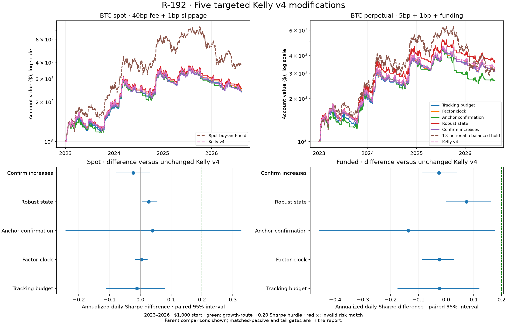

# R-192 — Five targeted Kelly v4 modifications

Completed 2 October 2026. **All five candidates are NEGATIVE under the frozen rule.**
This round tests five isolated candidate improvements to `kelly_regime_v4`.
The registered strategy and its defaults remain unchanged. Its leading raw
README futures rank omits funding and does not establish superiority.

## Design and provenance

The [protocol](../../experiments/r192_protocol.md) was preregistered in
`a956ddb6`; implementation, [research notes](../../experiments/r192_research_notes.md)
and focused tests followed in `8a3c78eb`, before financial evaluations.
The pre-holdout source/data freeze is `cb2b25e1`. The
[manifest](manifest.json) records source/data hashes, runtime versions,
15 local configurations and the descriptive validation ranking. That ranking
does not select a holdout winner or authorize parameter changes.

| Candidate | Single change to native v4 | Primary; fixed neighbors |
|---|---|---|
| Tracking budget | Accumulate squared raw-target gap / 288 while its sign persists; reset on zero/sign reversal; adopt on crossing the budget | 0.01; 0.005 / 0.02 exposure² observed-days |
| Factor clock | Apply the native target latch at aggregate vote changes or an epoch-aligned UTC grid | 24; 12 / 48 hours |
| Anchor confirmation | Each anchor flips after consecutive excess distance beyond its existing 1% opposite boundary accumulates / 288 | 0.01; 0.005 / 0.02 return observed-days |
| Robust state | Clip returns against previous raw volatility for state classification only; retain raw volatility in both sizing denominators | 6; 4 / 8 standard deviations |
| Confirm increases | Coalesce above-accepted-target runs; adopt their latest target after confirmation; decreases are immediate | 12; 6 / 24 observed bars |

Each family has exactly three frozen settings. No combined variant is tested.
Tracking budget has no immediate flat-target bypass; anchor confirmation has
no maximum-delay escape; volatility-state changes alone do not bypass the
factor clock. Changed targets still above the accepted target continue the
increase-confirmation run. These details are intentional, including their
potential to delay useful trading decisions.

The parent retains arithmetic 20/40/80 × 288-bar anchors, 1% vote bands,
lagged eight-day EWM volatility, its 180-day slow reference, native state
thresholds, 0.55 risk budget, 2× signal cap and 23,050-bar warmup. Except where
explicitly replaced, the 0.10 target latch and native callback remain.
Recursions use causal history before a measured window. Disabled-mechanism
identities reconstruct native targets; EWM standard deviation retains the
parent's unbiased pandas convention and one-bar lag.

These are COST/ERR control experiments using existing information. The notes
identify related negative rounds and primary sources on volatility targeting,
inaction bands and trading toward targets. Their theoretical results do not
prove these thresholds optimal or profitable. The game-theory literature
review requires unavailable order-book/opponent data; candles are not treated
as order flow or evidence of a new strategic equilibrium.

## Accounts, execution and data

The control uses the **unchanged native v4 signal and subsequent callback**.
Every candidate and v4 receives the same initial positive-target request on
its first globally eligible bar, filled at the next open. This explicit
fresh-account convention is inherited from R-190; it differs from unwrapped
native full-history startup. All cells start with $1,000, and the first daily
return includes the change from that initial cash.

Signals use closed five-minute observations; fills occur at the next open.
Native minimum orders, fee reserves, leverage limits and broker deadbands
remain. The same-sign broker band is 5% of maximum account notional: 5% of
equity on spot and 25% on the 5×-capacity perpetual account. Signal targets
are bounded at 2× and spot execution is capped at 1×. A changed signal or
submitted order therefore need not change an actual fill.

| Cell | Committed prices | Taker fee + slippage per side | Minimum; funding |
|---|---|---|---|
| Primary BTC spot | Bitstamp BTC/USD, five-minute | 40 bp + 1 bp | $10; none |
| Discount BTC spot | Same Bitstamp series | 10 bp + 1 bp | $10; none |
| ETH transfer stress | Coinbase ETH/USD, five-minute | 40 bp + 1 bp | $5; none |
| Funded BTC perpetual | Deribit BTC perpetual, five-minute | 5 bp + 1 bp | $5; matched observed eight-hour funding |

BTC primary costs use the verified Bitstamp entry-tier scenario. ETH costs
are a generic stress scenario, not a verified Coinbase account quote.
Deribit's retained 5 bp is a conservative legacy scenario; its published
3.5 bp table was still marked upcoming when verified on 2 October 2026.
Historical application of these fixed fees does not reconstruct historical
tier changes. The linear-margin/aggregated-funding simulator approximates
Deribit's contract mechanics; it lacks queues, depth, spread dynamics and
market impact. See the protocol's venue-verification references.

Data end at **2026-08-12 00:40 UTC**, before the report date. Inner training
ends 2020-12-31; validation covers 2021–2022; the retrospective holdout begins
2023-01-01. Training preparation cannot see 2023 onward. The holdout has been
used by earlier research rounds and is not a newly untouched test set.
Inherited lookbacks count observations, with 288 bars per nominal day;
missing timestamps do not create synthetic observations or elapsed-time
accumulation. This is not R-191's complete-calendar-day sampling rule.
All four data-file SHA-256 hashes match R-191, so its
[raw coverage audit](../r191_strategies/data_coverage.json) applies: ETH has
415 missing timestamps and 31 incomplete interior days. R-192 retains the
available observations on those days; it does not exclude incomplete days.
An absent UTC grid bar can skip a factor-clock refresh; no catch-up is added.

The spot passive control is native buy-and-hold. The funded passive is
constant 1× notional, rebalanced with a 10% relative exposure band. It is not
a 5× buy-and-hold account. Matched passive controls are separately executed
accounts with fees, funding and the same relative-band mechanism.

## Risk comparisons and decision rule

Five primaries and two controls receive the named cells and 24 seed-192
paired windows per primary market, lasting 120–365 days. Ten fixed neighbors
receive named cells only. Overlapping windows are descriptive and dependent.
The planned core is 455 evaluations: 51 training and 404 holdout.

There are 260 candidate/passive risk comparisons. Each passive fit starts at
0.5×, adjusts by target/achieved daily volatility, and permits at most three
executed attempts, capped at 1× spot or 2× perpetual. Every attempt counts.
Relative volatility error must be ≤2%; a parent comparison permits ≤5%.
An invalid match cannot win. Ex-post fitted exposure is an inference control,
not a deployable forecast; intervals condition on it and omit fit uncertainty.

Paired daily stationary bootstraps use mean 30-day blocks, 2,000 draws and
seed 192. They compare Sharpe, total log growth and daily maximum drawdown
against both unchanged v4 and the matched passive. Daily drawdown includes
the initial $1,000 peak; bar-level drawdown is reported separately.

Training-only [power estimates](training_power.csv) project 0.38–29.49 years
for a +0.20 Sharpe effect versus the parent and 66.67–90.72 versus matched
passive. Corresponding 2 pp drawdown projections span 1.37–169.35 and
417.36–542.78 years. These are stationary-noise approximations; nonlinear
drawdown prevents an exact sample-size interpretation. Low power does not
lower the frozen thresholds or turn a failed gate into evidence of success.

Promotion requires every common gate and either the growth or tail route.
Common gates include valid risk matches, changed validation fills, profitable
named holdouts, no primary/neighbor liquidation, profitable local plateaus
with Sharpe spread ≤0.20, and program-wide DSR ≥0.95 on both primary holdouts.
Growth requires >0.20 Sharpe gains versus both references, supporting paired
holdout intervals, full-passive balance/ETH checks and ≥13/24 valid wins per
market. Tail requires >2 pp drawdown reduction without growth loss, supporting
intervals and ETH/window checks. The protocol contains the exact conjunctions.
Any failure yields **NEGATIVE**; higher point estimates alone do not promote.

## Results from every primary



Balances include the named costs, from $1,000. Raw balances carry different risk.

| Candidate | Train BTC | Validation BTC / funded | Holdout BTC | Holdout funded | ETH | Discount BTC |
|---|---:|---:|---:|---:|---:|---:|
| Tracking budget | $15,285.21 | $874.20 / $871.81 | $2,406.12 | $3,088.34 | $1,431.97 | $3,301.30 |
| Factor clock | $10,745.80 | $831.66 / $899.22 | $2,458.33 | $3,082.11 | $1,685.89 | $3,401.98 |
| Anchor confirmation | $16,537.01 | $909.33 / $816.70 | $2,535.68 | $2,667.34 | $1,571.76 | $2,905.37 |
| Robust state | $12,228.32 | $881.32 / $992.63 | $2,531.55 | $3,551.83 | $1,632.40 | $3,487.92 |
| Confirm increases | $13,109.26 | $835.39 / $965.08 | $2,374.55 | $3,067.84 | $1,678.88 | $3,282.48 |
| Unchanged Kelly v4 | $13,296.41 | $868.83 / $982.56 | $2,453.75 | $3,193.18 | $1,662.27 | $3,391.85 |
| Passive control | $29,913.09 | $572.85 / $481.10 | $3,827.03 | $3,136.98 | $1,566.05 | $3,838.54 |

Robust state led validation and retains that descriptive label. It improves
the holdout spot balance by 3.2% and funded balance by 11.2% versus v4, but
the spot Sharpe gain is only +0.0269 [0.0048, 0.0550]. This narrow parent
comparison is positive; it does not clear the frozen +0.20 hurdle. Funded
Sharpe is +0.0740 [-0.0002, 0.1614], and funded log-growth is +0.1064
[-0.0020, 0.2554]. Neither establishes a funded gain. All five spot balances
remain below full passive holding, and all five validation balances are
below $1,000 in both markets. There was no retuning or combined candidate.

| Candidate | Spot Sharpe | Bar DD | Spot fills | Spot fees | Mean exposure | Funded funding paid |
|---|---:|---:|---:|---:|---:|---:|
| Tracking budget | 0.920 | 33.87% | 297 | $971.96 | 0.584× | $627.64 |
| Factor clock | 0.934 | 34.25% | 326 | $1,042.26 | 0.583× | $633.45 |
| Anchor confirmation | 0.971 | 34.09% | 145 | $419.82 | 0.584× | $599.34 |
| Robust state | 0.958 | 34.28% | 321 | $1,051.53 | 0.584× | $720.11 |
| Confirm increases | 0.908 | 34.30% | 322 | $1,003.62 | 0.583× | $632.01 |
| Unchanged Kelly v4 | 0.931 | 34.28% | 331 | $1,039.26 | 0.584× | $655.10 |

Anchor confirmation cuts spot fills 331→145 and fees $1,039→$420, but its
funded balance falls by 16.5% versus v4. Reduced trading is not sufficient
evidence of improvement. Bar drawdown above and daily bootstrap drawdown
below measure different resolutions.

## Paired holdout inference

All named parent and matched-passive risk comparisons are valid. Values are
candidate minus control; brackets are paired 95% intervals, conditional on
the fitted passive exposure. Neither a negative drawdown point estimate nor
a positive growth point estimate establishes an equal-risk benefit.

| Candidate | Market | Reference | Δ Sharpe [95%] | Δ log growth [95%] | Δ daily DD, pp [95%] |
|---|---|---|---:|---:|---:|
| Tracking budget | Spot | v4 | -0.0113 [-0.1123, +0.0803] | -0.0196 [-0.1406, +0.0860] | -0.4593 [-2.8005, +3.7437] |
| Tracking budget | Spot | Matched hold | -0.0955 [-0.7062, +0.4819] | -0.1152 [-0.7655, +0.5680] | -6.5284 [-15.4575, +21.5450] |
| Tracking budget | Funded | v4 | -0.0227 [-0.1752, +0.1201] | -0.0334 [-0.2295, +0.1547] | +2.2822 [-4.4844, +5.9882] |
| Tracking budget | Funded | Matched hold | +0.1614 [-0.4169, +0.6998] | +0.2217 [-0.5048, +0.9551] | -11.7346 [-22.2797, +16.2653] |
| Factor clock | Spot | v4 | +0.0032 [-0.0186, +0.0236] | +0.0019 [-0.0259, +0.0267] | -0.0694 [-0.7615, +0.4972] |
| Factor clock | Spot | Matched hold | -0.0881 [-0.6812, +0.4655] | -0.1033 [-0.7330, +0.5770] | -6.2258 [-15.5658, +20.4102] |
| Factor clock | Funded | v4 | -0.0240 [-0.0865, +0.0295] | -0.0354 [-0.1288, +0.0437] | -0.0212 [-1.0241, +1.8426] |
| Factor clock | Funded | Matched hold | +0.1598 [-0.4141, +0.6962] | +0.2199 [-0.4747, +0.9363] | -14.0031 [-22.8154, +15.2775] |
| Anchor confirmation | Spot | v4 | +0.0401 [-0.2432, +0.3275] | +0.0328 [-0.2994, +0.3644] | +0.7387 [-10.4206, +9.1892] |
| Anchor confirmation | Spot | Matched hold | -0.0423 [-0.6396, +0.5154] | -0.0538 [-0.6944, +0.6126] | -5.1227 [-15.5470, +19.7193] |
| Anchor confirmation | Funded | v4 | -0.1360 [-0.4580, +0.1760] | -0.1799 [-0.5920, +0.2269] | +11.2418 [-6.8314, +17.9027] |
| Anchor confirmation | Funded | Matched hold | +0.0417 [-0.5653, +0.5856] | +0.0447 [-0.7107, +0.8206] | -2.7459 [-20.3329, +19.9597] |
| Robust state | Spot | v4 | +0.0269 [+0.0048, +0.0550] | +0.0312 [+0.0041, +0.0674] | -0.0386 [-1.5587, +0.0853] |
| Robust state | Spot | Matched hold | -0.0641 [-0.6536, +0.4859] | -0.0764 [-0.7151, +0.6091] | -6.2558 [-16.1677, +20.3918] |
| Robust state | Funded | v4 | +0.0740 [-0.0002, +0.1614] | +0.1064 [-0.0020, +0.2554] | -0.0317 [-4.4774, +0.5710] |
| Robust state | Funded | Matched hold | +0.2511 [-0.3060, +0.7753] | +0.3488 [-0.3354, +1.0736] | -14.0095 [-24.1509, +13.4274] |
| Confirm increases | Spot | v4 | -0.0228 [-0.0797, +0.0306] | -0.0328 [-0.1020, +0.0319] | -0.0115 [-1.9429, +2.2482] |
| Confirm increases | Spot | Matched hold | -0.1070 [-0.7065, +0.4539] | -0.1284 [-0.7594, +0.5417] | -6.0821 [-15.4235, +20.7153] |
| Confirm increases | Funded | v4 | -0.0256 [-0.0857, +0.0386] | -0.0400 [-0.1239, +0.0456] | +0.9400 [-2.1256, +2.5480] |
| Confirm increases | Funded | Matched hold | +0.1275 [-0.4318, +0.6562] | +0.1816 [-0.5000, +0.8907] | -10.8866 [-21.4218, +15.7155] |

Training matched all 10 passive comparisons in 20 attempts. Holdout matched
233/250 comparisons in 575 attempts; 17 window matches are invalid. Combined
parent/passive window validity can be lower because the parent must also
stay within 5% risk. Every invalid comparison is a non-win. Full validation
and holdout inference, including fit parameters, is in [bootstrap.csv](bootstrap.csv).

## Frozen decisions and neighborhoods

Every family fails the common profitable-neighborhood and program DSR gates,
as well as both complete growth and tail routes. All primaries are profitable
in the four named holdouts, all mechanisms change validation fills, and no
core cell liquidates. Those passing checks do not override the failed ones.

| Candidate | Verdict | Spot growth / tail wins (valid) | Funded growth / tail wins (valid) | Program DSR spot / funded |
|---|---|---:|---:|---:|
| Tracking budget | NEGATIVE | 3/24 / 0/24 (23) | 7/24 / 5/24 (21) | 0.120 / 0.169 |
| Factor clock | NEGATIVE | 0/24 / 0/24 (23) | 1/24 / 0/24 (21) | 0.125 / 0.168 |
| Anchor confirmation | NEGATIVE | 7/24 / 1/24 (20) | 7/24 / 2/24 (19) | 0.141 / 0.122 |
| Robust state | NEGATIVE | 0/24 / 0/24 (24) | 8/24 / 0/24 (23) | 0.134 / 0.220 |
| Confirm increases | NEGATIVE | 3/24 / 0/24 (22) | 6/24 / 0/24 (21) | 0.115 / 0.167 |

Factor clock and confirm increases pass the ETH growth check; only confirm
increases passes the ETH tail check. No candidate passes either window gate.
[decision.csv](decision.csv) records every gate, failure and local DSR;
[window_comparisons.csv](window_comparisons.csv) retains each paired window.

| Configuration | Validation Sharpe spot / funded | Holdout Sharpe spot / funded | Holdout spot balance |
|---|---:|---:|---:|
| r192_tracking_budget | -0.072 / -0.094 | 0.920 / 1.034 | $2,406.12 |
| r192_tracking_budget_low | -0.098 / 0.167 | 0.924 / 1.075 | $2,422.48 |
| r192_tracking_budget_high | -0.091 / -0.067 | 0.874 / 0.903 | $2,285.33 |
| r192_factor_clock | -0.146 / -0.046 | 0.934 / 1.033 | $2,458.33 |
| r192_factor_clock_low | -0.117 / -0.062 | 0.939 / 1.035 | $2,472.09 |
| r192_factor_clock_high | -0.133 / -0.053 | 0.957 / 1.069 | $2,527.42 |
| r192_anchor_confirm | -0.012 / -0.181 | 0.971 / 0.921 | $2,535.68 |
| r192_anchor_confirm_low | 0.107 / -0.116 | 1.034 / 1.043 | $2,744.42 |
| r192_anchor_confirm_high | 0.024 / -0.092 | 0.802 / 0.839 | $2,075.78 |
| r192_robust_state | -0.055 / 0.134 | 0.958 / 1.131 | $2,531.55 |
| r192_robust_state_low | -0.073 / 0.142 | 0.940 / 1.087 | $2,480.11 |
| r192_robust_state_high | -0.056 / 0.153 | 0.949 / 1.124 | $2,500.04 |
| r192_confirm_increase | -0.144 / 0.087 | 0.908 / 1.031 | $2,374.55 |
| r192_confirm_increase_low | -0.118 / 0.054 | 0.905 / 1.022 | $2,373.33 |
| r192_confirm_increase_high | -0.071 / 0.187 | 0.906 / 1.006 | $2,362.61 |

No neighbor was selected after observing the holdout. Complete metrics,
exposure, activity, fills, completed round trips, costs and daily returns are
retained in [cells.csv](cells.csv) and the aggregate daily-series files.

## Audit, tests and accounting

Before holdout, reporting was tightened to include initial capital in daily
drawdown and to require all four completed audit receipts. Strategy parameters,
costs, data and decision thresholds did not change. All 75 frozen source/data
hashes verify. The presentation-only chart was subsequently relabeled.

**848 tests pass**, including strict causality, all 15 variants’ non-vacuous
prefix/future-perturbation tests, five disabled identities, next-open execution,
startup parity, accounting and fail-closed report checks. An initial full-suite
run overlapped the pre-freeze report-test update and used stale fixtures; the
complete frozen suite was rerun and passes. No financial evaluations were
repeated or interrupted. Synthetic tests are not financial consultations.

The independent tracking-budget reconstruction matches all targets exactly.
Its separate quote-cash book reproduces all four fixed validation/holdout
spot/funded cells within $1.51e-11 daily equity, with no discrepancies. It
asserts unsupported liquidation boundaries were never crossed. See
[audit.md](audit.md). Both controls also reproduce all seven R191 named cells
and daily curves under the same costs and startup convention.

**1,054 financial evaluations:** 455 core (51 training +404 holdout),
595 matching attempts (20 +575), and four audit replays (2 +2).
**Holdout consultations +981; cumulative approximately 4,232.**
[counts.json](counts.json) retains the totals. Dependent windows and controls
are counted conservatively; they are not independent tests. Program DSR uses
4,232 trials and frozen dispersion 0.418538; local DSR uses 15 configurations.
Nominal daily sample size enters DSR; block bootstrap addresses serial
dependence separately. No claim of fresh out-of-sample discovery is made.

## Reproduction

Run from the final committed checkout with its existing `.venv`. The archive
below creates fresh outputs while retaining the published receipts. Do not
rerun financial commands over existing result directories: overwrite guards
reject that, and any additional financial run must be retained and counted.

```sh
R192_PYTHON="$(pwd)/.venv/bin/python"
PYTHONPATH=src:. "$R192_PYTHON" -m pytest -q
R192_RUN=$(mktemp -d /tmp/tradebot-r192.XXXXXX)
git archive HEAD | tar -x -C "$R192_RUN" --exclude='reports/*'
cd "$R192_RUN"
"$R192_PYTHON" experiments/r192_eval.py train --workers 3
"$R192_PYTHON" experiments/r192_matched.py train --workers 3
PYTHONPATH=src:. "$R192_PYTHON" tests/test_r192_audit.py train
"$R192_PYTHON" experiments/r192_report.py freeze
"$R192_PYTHON" experiments/r192_eval.py holdout --workers 3
"$R192_PYTHON" experiments/r192_matched.py holdout --workers 3
PYTHONPATH=src:. "$R192_PYTHON" tests/test_r192_audit.py holdout
"$R192_PYTHON" experiments/r192_report.py report
"$R192_PYTHON" experiments/r192_chart.py
```

Final evidence: `cells.csv`, `bootstrap.csv`, `decision.csv`,
`window_comparisons.csv`, `counts.json`, `audit.json`, `audit.md`,
`training_power.csv`, `manifest.json` and aggregate daily series. Per-strategy
receipts remain local; their complete metrics/daily contents are aggregated.
The presentation-only chart reads these saved results and performs no new
financial evaluations. The final `summary.png` was visually inspected.
